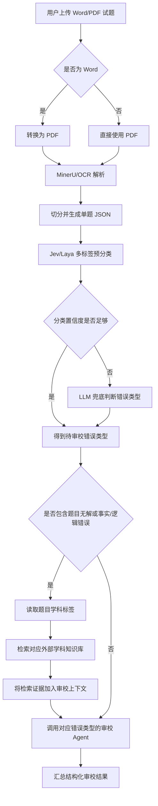

# AI 审校 Agent 实现方案

## 1. 项目定位

小组项目面向研究生试题生产流程，整体包含 AI 自主命题、AI 审校、学科知识库和 AI 组卷四个模块。AI 审校模块既可以独立审查教师上传的题目，也可以作为其他模块的质量门禁：

- 自主命题生成题目后，先通过审校才能进入题库；
- 学科知识库为事实核验、逻辑核验和题目可解性判断提供外部证据；
- AI 组卷完成后，再调用审校模块检查试卷中的每道题目。

课程项目中的核心贡献不是单个分类模型，而是一个可运行的多步 Agent。系统需要解析试题文件、切分题目、判断应执行哪些错误类型的审校，在必要时检索外部知识，并输出结构化修改建议。

### 1.1 项目目标

构建一个面向研究生入学考试题目的自动审校 Agent。系统接收 Word 或 PDF 试题，自动完成文件转换、OCR 解析、题目切分、错误类型预分类、置信度门控、知识库检索和专项审校，最终输出定位到原文的错误报告和修改建议。

### 1.2 必做功能范围

系统需要完成以下九类错误的审校：

1. 错别字；
2. 标点符号错误；
3. 选项结构错误；
4. 信息缺失；
5. 题目与题型不一致；
6. 答案泄露；
7. 语义不清；
8. 题目无解；
9. 事实/逻辑错误。

图文不一致、小语种审校和整卷级冲突暂不纳入当前实现范围。

## 2. 系统架构



### 2.1 文档解析流水线

系统首先统一处理用户上传的 Word 或 PDF 试题：

1. 检查文件类型、大小、页数和是否加密；
2. Word 文件先转换为 PDF，并保留转换日志；
3. PDF 统一提交给 MinerU 等 OCR 或文档解析模型；
4. 恢复页码、标题层级、题号、题干、选项、答案、解析、表格、公式和图片占位；
5. 按大题、小题和共用材料关系切分，避免把共用材料或共用选项错误分配给单题；
6. 对低质量扫描页、OCR 低置信区域、公式解析失败和题号断裂进行局部重试；
7. 保留题目在原 PDF 中的页码和坐标，供最终报告定位和高亮。

Word 转 PDF 后需要检查页数、图片数量和关键文本是否发生明显变化。MinerU 解析失败时，可以降级到其他 OCR 模型，但不同解析后端需要输出相同的单题 JSON 格式。

### 2.2 单题 JSON 格式

系统内部将 `reference` 拆成结构化字段，避免后续模块反复通过正则表达式解析标签：

```json
{
  "schema_version": "1.0",
  "reference": {
    "subject": "有机化学",
    "subject_code": "organic_chemistry",
    "exam_title": "2025年研究生入学考试",
    "question_type": "选择题",
    "question_type_code": "multiple_choice",
    "additional_info": []
  },
  "detection_content": "下列化合物中反应速率最快的是（ ）。\nA. ……\nB. ……\nC. ……\nD. ……"
}
```

- `subject` 保留面向用户的学科名称，`subject_code` 用于稳定选择知识库和学科专项配置；
- `exam_title` 用于保存试卷来源语境；
- `question_type` 保留原题型名称，`question_type_code` 用于错误类型预分类和题型规则判断；
- `additional_info` 保存大题要求、共用材料标识、共用选项标识或其他补充信息；
- `detection_content` 保存当前需要审校的完整题目文本；
- `schema_version` 用于管理后续字段变化；
- 页码、坐标、原文件哈希和题目 ID 由编排层单独保存。

这种结构便于预分类器直接读取 `question_type`，也便于知识库模块根据 `subject` 定向检索。系统应保留 MinerU 的原始解析结果，字段拆分失败时可以回溯原文。

### 2.3 Jev/Laya 预分类与置信度门控

单题进入正式审校前，先由 Jev、Laya 等轻量分类模型执行多标签预检查，判断需要运行哪些错误类型的审校。分类器只负责选择审校任务，不直接生成最终错误报告。

示例输出：

```json
{
  "routing_scores": {
    "错别字": 0.96,
    "选项结构错误": 0.91,
    "题目无解": 0.57,
    "事实/逻辑错误": 0.18
  }
}
```

置信度门控采用按错误类型分别校准的阈值：

- 分类置信度达到该错误类型的阈值时，直接采用分类结果；
- 分类置信度低于阈值时，调用 LLM 重新判断是否需要执行该类审校；
- 分类模型调用失败、缺少某类分数或输入明显超出分类模型能力范围时，由 LLM 完整兜底；
- 阈值通过验证集实验确定，不为所有错误类型预设同一个固定值。

阈值实验需要同时观察错误类型路由 Recall、最终审校 Recall、LLM 兜底率、平均调用次数和审校时间。门控的首要目标是避免漏掉必要的专项审校任务。

### 2.4 知识库取证

当待审校类型包含“题目无解”或“事实/逻辑错误”时，系统读取 `reference.subject`，检索对应的外部学科知识库。检索结果作为证据加入该专项审校 Agent 的上下文，然后再执行审校。

知识库检索需要满足以下要求：

- 按学科选择检索空间，避免跨学科内容干扰；
- 返回来源、相关片段和检索得分；
- 只把与当前题目直接相关的证据加入上下文；
- 找不到可靠证据时明确记录，不把模型参数记忆伪装成知识库结论；
- 检索证据用于支持判断，不改变审校 Agent 的结构化输出字段。

### 2.5 专项审校 Agent 与 Prompt Profile

每个审校 Agent 只处理一个错误类型。任务 Prompt 至少包含：

- 固定错误类型；
- 正向触发条件；
- 明确排除条件；
- 判断正误、故意设错和找错题等题型边界；
- 原文定位和最小修改要求；
- 典型正例与易误报负例。

Qwen3.7-27B 的最佳任务提示词作为初始基线冻结。接入其他模型时，为每个模型维护独立、版本化的 Prompt Profile，不能默认复用同一 Prompt 就能获得相同效果。

新模型的 Prompt 调优流程为：

1. 固定数据集、输出协议、解码参数和评测方式；
2. 根据 badcase 修改当前错误类型的 Prompt；
3. 先运行 focus 样本验证；
4. focus 通过后运行该错误类型的完整评测集；
5. 检查混淆矩阵、Precision、Recall、F2、FRR 和时间；
6. 达到指标后冻结模型 ID、Prompt 版本、Prompt 哈希和评测结果。

每轮只改变一个主要因素，例如任务说明、Few-shot、thinking 模式或采样参数，以便确认性能变化的来源。

### 2.6 审校结果检查与汇总

专项审校结果返回后，程序执行以下检查：

1. `original_text` 必须真实存在于 `detection_content`；
2. `total_errors` 必须等于 `errors` 数组长度；
3. `error_type` 必须与当前专项审校任务一致；
4. 错误位置和修改文本不得为空；
5. 同一位置的重复报告需要合并；
6. 输出解析失败时进行有限次数重试，仍失败则记录为无效结果。

多个错误类型可以并行审校，完成后按题目汇总为一份结构化报告。

## 3. 模型输入与输出协议

系统内部的结构化单题 JSON 不直接发送给专项审校模型。调用模型前，`payload_builder` 将 `reference` 对象序列化为带标签的字符串，再组装 `messages`，并保持 `system -> user -> assistant` 的角色顺序：

```text
reference.subject         -> 【学科】
reference.exam_title      -> 【试卷标题】
reference.question_type   -> 【题型或其它信息】
reference.additional_info -> 追加到【题型或其它信息】或对应上下文
```

模型调用示例：

```json
{
  "messages": [
    {
      "role": "system",
      "content": "<共享核心 + 当前错误类型任务 Prompt + JSON 输出约束>"
    },
    {
      "role": "user",
      "content": "[INPUT_PAYLOAD]\n{\"reference\":\"【学科】...\\n【试卷标题】...\\n【题型或其它信息】...\",\"detection_content\":\"题目原文...\"}"
    },
    {
      "role": "assistant",
      "content": "{\"reason\":\"...\",\"has_error\":true,\"total_errors\":1,\"errors\":[...]}"
    }
  ]
}
```

输入要求：

- `system` 由共享核心、当前错误类型 Prompt 和 JSON 输出约束组成；
- `user` 以 `[INPUT_PAYLOAD]` 开头，后接包含 `reference` 和 `detection_content` 的 JSON；
- `reference` 字符串由 `payload_builder` 根据内部结构化字段确定性生成；
- 当前 Agent 只检测其负责的错误类型。

输出要求：

- 无错误时输出 `has_error=false`、`total_errors=0`、`errors=[]`；
- 有错误时，每条结果包含 `error_type`、`position`、`original_text`、`anchor_text`、`correction`、`description` 和 `suggestion`；
- `assistant.content` 必须能解析为一个合法 JSON 对象；
- 不在模型输出中加入路由置信度、页码坐标、模型版本或工具轨迹，这些信息由编排层保存。

## 4. 评测计划

评测按错误类型分别进行。每次完整评测需要保存模型、Prompt、数据版本、并发数、有效样本数和原始预测，确保结果可复现。

### 4.1 评测指标

| 指标 | 计算或记录方式 |
| --- | --- |
| 混淆矩阵 | 记录 TP、TN、FP、FN 原始计数 |
| Precision | `TP / (TP + FP)` |
| Recall | `TP / (TP + FN)` |
| F2 | `(5 × Precision × Recall) / (4 × Precision + Recall)` |
| FRR | `FP / (TP + FP)`，即 `1 - Precision` |
| 审校时间 | 记录完整批次总耗时、平均单题耗时，并在条件允许时记录 P50/P95 |
| 有效结果 | 记录成功、无效、跳过、超时和调用失败的样本数 |

除二分类是否报错外，还需要抽查错误位置、错误类型和修改建议是否正确。字符串不完全相同但语义正确的修改建议，可以由人工或独立 Judge 进行复核。

### 4.2 指标目标与评测门禁

九个错误类型分别达到以下目标：

- `Precision >= 90%`；
- `Recall >= 90%`；
- `FRR < 10%`；
- 完整评测不存在未处理的无效、跳过、超时或调用失败样本。

评测表至少包含以下字段：

| 错误类型 | TP | TN | FP | FN | Precision | Recall | F2 | FRR | 总耗时 | 平均单题耗时 | 有效样本 |
| --- | ---: | ---: | ---: | ---: | ---: | ---: | ---: | ---: | ---: | ---: | ---: |
| 错别字 |  |  |  |  |  |  |  |  |  |  |  |
| 标点符号错误 |  |  |  |  |  |  |  |  |  |  |  |
| 选项结构错误 |  |  |  |  |  |  |  |  |  |  |  |
| 信息缺失 |  |  |  |  |  |  |  |  |  |  |  |
| 题目与题型不一致 |  |  |  |  |  |  |  |  |  |  |  |
| 答案泄露 |  |  |  |  |  |  |  |  |  |  |  |
| 语义不清 |  |  |  |  |  |  |  |  |  |  |  |
| 题目无解 |  |  |  |  |  |  |  |  |  |  |  |
| 事实/逻辑错误 |  |  |  |  |  |  |  |  |  |  |  |

## 5. Challenges 与 Solutions

| Challenge | 原因 | Solution | 验证方式 |
| --- | --- | --- | --- |
| Word/PDF 版式差异 | Word 转换、扫描件和复杂公式可能破坏题目结构 | 统一转 PDF、MinerU 解析、局部 OCR 重试、页码坐标回链 | 题目切分准确率、人工抽查 |
| 预分类漏掉必要任务 | 轻量分类器可能对边界样本低置信或误分类 | 分错误类型校准阈值，低置信和异常输入交给 LLM 兜底 | 路由 Recall、最终 Recall、兜底率 |
| 知识性错误与可解性判断缺少可靠依据 | 单靠模型参数记忆难以确认专业事实、逻辑关系以及题目是否具备充分条件 | 根据学科标签检索可信外部知识库，将来源和相关片段作为证据，再调用题目无解或事实/逻辑错误审校 Agent | 两类任务的 Precision/Recall、证据正确率、无证据结论比例 |
| 数学等学科的计算结果难以仅靠语言模型验证 | 复杂计算、方程求解和答案唯一性判断容易出现推理或算术错误 | 根据学科和题型调用 Code Execution、Python 或符号计算等外部工具，重新计算并将结果作为审校证据 | 计算工具执行成功率、答案复算一致率、题目无解类 Recall |
| 审校成本与时间增加 | 九类审校全部执行会产生较多调用 | Jev/Laya 预分类、并行执行、置信度门控和 LLM 按需兜底 | 总耗时、平均单题耗时、调用次数 |

## 6. 实现技术建议

### 6.1 后端组件

- API：FastAPI；
- Word 转 PDF：LibreOffice headless 或等价转换服务；
- 文档解析：MinerU 为主解析器，其他 OCR 作为失败降级路径；
- 预分类：Jev、Laya 或同类轻量多标签分类模型；
- LLM 接口：兼容统一调用协议，可切换 Qwen3.7-27B 和其他候选模型；
- 学科知识库：按学科分库，使用 FAISS、pgvector 或其他向量检索服务；
- 数据存储：PostgreSQL 保存文件、单题、审校任务、模型版本、Prompt 版本和评测记录；
- 异步执行：使用任务队列或 `asyncio` 并发执行已选中的错误类型审校。

### 6.2 模块划分

```text
review_agent/
├── api/
├── parser/
│   ├── word_to_pdf.py
│   ├── mineru_client.py
│   ├── question_splitter.py
│   └── payload_builder.py
├── router/
│   ├── lightweight_classifier.py
│   ├── confidence_gate.py
│   └── llm_fallback.py
├── knowledge/
│   ├── subject_registry.py
│   └── retriever.py
├── reviewers/
│   ├── typo.py
│   ├── punctuation.py
│   ├── options.py
│   ├── missing.py
│   ├── mismatch.py
│   ├── answer_leak.py
│   ├── ambiguity.py
│   ├── unsolvability.py
│   └── logic.py
├── prompts/
├── validation/
├── aggregation/
├── evaluation/
└── tests/
```
