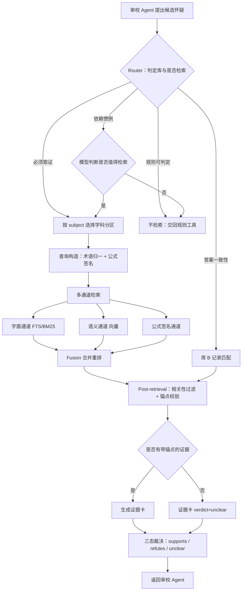

# 学科内容知识库（证据检索层）技术设计

> 模块归属：学科知识库
> 对接模块：AI 审校 Agent（`exam-checker-agent.md`）、AI 组卷 Agent（`exam-assembly-agent.md`）
> 版本：v3 · 2026-10-03
>
> **修订历史**
> - **v2**：技术栈选型由"知识节点编译型"改为 **Modular RAG**；核心库由"同源题库"改为"学科内容库"。
> - **v3**：新增 **库 B 答案索引库**（支撑答案一致性检查），并补 §3.7 数据模型与存储选型。
>   库编号相应调整为 A 学科内容 / B 答案索引 / C 语言错误标准 / D 结构规范。

---

# 1. 背景与目标

## 1.1 项目定位

小组项目包含 AI 自主命题、AI 审校、学科知识库、AI 组卷四个模块。本模块负责**为审校提供可核验的外部证据**，是审校 Agent 判断「事实/逻辑错误」「题目无解」「答案一致性」时的外部依据来源。

调用关系：

- **AI 审校 Agent** 在待审校类型包含「题目无解」或「事实/逻辑错误」时，向本模块发起检索，把返回的证据加入专项审校上下文（见 `exam-checker-agent.md` §2.4）；
- **AI 组卷 Agent** 在整卷级验证中，使用本模块的能力辅助「知识点覆盖度」与「跨题答案泄露」判断（见 `exam-assembly-agent.md` §2.6）；
- 本模块**不产生审校结论**，只提供证据。是否报错由审校 Agent 决定。

## 1.2 目标

1. **建成四个证据库**：学科内容、答案索引、语言错误标准、结构规范，每个库回答一类明确的问题；
2. 每条证据都**带可定位锚点**。**无锚点的结果不计为证据**；
3. 检索是**有条件的**：按学科路由、按怀疑类型决定是否检索，不是每题都查；
4. 找不到证据时**明确返回"无证据"**，不用模型参数记忆填补；
5. **可评测**：检索层、证据层、端到端三层指标，以及"关掉知识库"的消融结果。

## 1.3 明确的非目标

- ❌ **不以试题库作为学科事实的依据**：试题是考试抽样，不是学科内容参考（理由见 §2.3）；
- ⚠️ **但试题+答案的成对数据是合法的**——用于**同一道题的答案比对**（库 B），不用于跨题泛化（区别见 §3.3.1）；
- ❌ **不建"全学科百科"**：只做跑通闭环所需的学科；
- ❌ **不做通用事实核查**：开放式事实判断缺乏可核验依据，会推高误报率；
- ❌ **不由本模块生成知识**：库的内容必须来自外部一手材料，不接受模型合成内容入库；
- ❌ **知识库不自演化**：不接受运行时自动写入或改写（理由见 §2.5）。

---

# 2. 技术栈选型

本节回答：**知识库应该用 RAG 还是 LLM-Wiki？如果是 RAG，是哪一种？**

## 2.1 判定依据

用三个可操作的判据，而不是套术语：

| 判据 | 问题 |
|---|---|
| **查询形态** | 这个库会收到什么形状的查询？相似 / 精确 / 结构化 / 多跳关系？ |
| **知识形态** | 待入库的知识是封闭可穷举的，还是开放不可预知的？ |
| **可审计性** | "这条结论基于哪一版、哪一段"，能不能回答？ |

## 2.2 结论

> **库 A 学科内容库：Modular RAG。**
> **库 B 答案索引库：指纹索引 + 记录匹配（记录关联），不是 RAG。**
> **库 C 语言错误标准库：检索。库 D 结构规范库：编译型查表。**
> **编译：仅用于索引增强（术语归一 / 公式签名 / 题型惯例），不用于知识表示。**
> **排除：GraphRAG、知识节点编译型（作为知识表示）、agentic-wiki、以试题库为学科事实依据。**

**同时明确一点**：本项目的 "agentic" 体现在**"是否检索"这个决策**上，不体现在知识库形态上。即 **Agentic 的检索决策 + 各类库各自的访问架构**。

## 2.3 为什么不以试题库作为学科事实的依据

**试题是考试的抽样，不是学科内容的参考：**

1. **覆盖不可控**：一份卷子从几百个概念里挑几十个考。要验证的某个概念，可能从未被任何一份卷子考过；
2. **有偏样本**：某知识点被反复考，可能只反映命题偏好，不代表学科重要性；
3. **判定错位**：用另一份考卷去判"这个陈述在学科上成不成立"，本质是**拿抽样当标准答案**。

**结论**：试题**不能作为学科事实的依据**。但它可以作为两种东西：

- **答案比对参照**——同一道题的标准答案（库 B，见 §3.3）；
- **检索辅助**——改写检测、重复检测。

## 2.4 为什么库 A 是检索而非知识节点编译型

v1 曾选择编译型，v2 起改为检索。原因是**内容形态变了**：

| | v1 的情形 | v2 起的情形 |
|---|---|---|
| 内容来源 | 试题解析（"这道题选 B，因为……"） | 教材 / 百科 / 开放课程讲义 |
| 概念是否已组织好 | ❌ 埋在题目语境里，必须抽象出来 | ✅ 定义在术语框、定理在定理节、条件在小节首段 |
| 是否必须编译才能用 | ✅ 必须 | ❌ 直接检索即可 |
| 覆盖是否封闭可穷举 | 是（题量有限） | **不是**（教材开放式，问法不可穷举） |
| → 范式 | 编译型 | **检索** |

> **不需要编译本来就已经编译好的东西。**

编译降级为**索引增强手段**（见 §3.2、§5.3）：

| 用途 | 是否编译 | 原因 |
|---|---|---|
| 事实核验 / 可解性 / 术语界定 / 概念辨析 | ❌ 纯检索 | 语料段落本身即可作证据 |
| **术语归一索引** | ✅ 轻量编译 | 把「绝对感受阈限 / Absolute Threshold / 绝对阈限」归到同一检索键 |
| **公式签名索引** | ✅ 轻量编译 | LaTeX 等价写法归一，否则公式题检索失效 |
| **题型惯例统计** | ✅ 编译 | 结构性知识，封闭可穷举 |

## 2.5 为什么不是 LLM-Wiki

**agentic-wiki** —— 库会自己变，审计链断裂。审校取证最基本的要求是"这条结论基于哪一版、哪一段"，库一旦自生长，这个问题就无法回答；且本模块没有起始 wiki 语料。

**LLM-Wiki 的共性缺陷** —— wiki 产出的是**合成过的页面**，而审校取证要的是**一手内容 + 锚点**。教材和百科本身就是权威一手来源，直接引用它比引用一段综合文字强得多。

`exam-checker-agent.md` §2.4 已有的护栏「**不把模型参数记忆伪装成知识库结论**」是同一道防线；本模块把它扩展为：**也不接受合成过的二手页面作为证据。**

## 2.6 为什么不是 GraphRAG

判据是**查询形态**。本模块各库只会收到四类查询：

| 查询类型 | 例子 | 需要的能力 |
|---|---|---|
| 事实核验 | "胶原蛋白的二级结构是三股螺旋"这句对不对？ | 定位到对应段落 |
| 可解性 | 给定这些条件，能解出唯一答案吗？ | 定位到方法及其适用条件 |
| 术语界定 | 这个名词的标准定义是什么？ | 定位到定义段 |
| 答案比对 | 卷面答案与标准答案一致吗？ | **精确匹配同题记录** |

**没有一类是多跳关系查询。** GraphRAG 的增量价值在于跨实体多跳，而本库的查询是"定位到那一节""匹配到那条记录"。图结构不产生增量，却要付出 LLM 实体关系抽取的成本，且**抽取质量本身无法在项目周期内评测**。

## 2.7 为什么库 A 是 Modular RAG 而非 Advanced RAG

§6.4 必须跑四组消融——`字面 vs 语义 vs 混合`、`top-k = 1/3/5/10`、`路由开关`、`元数据过滤开关`。**要能跑消融，检索后端就必须可替换**，这正是 Modular RAG 的定义。

| Modular RAG 模块 | 本模块的用途 |
|---|---|
| **Routing** | 按学科选分区的 **subject routing**；按怀疑类型决定是否检索的 **conditional routing**；按库选择的 **store routing** |
| **多检索器** | 字面（FTS/BM25）+ 语义（向量）+ 公式签名通道 |
| **Fusion** | 混合检索结果合并与重排 |
| **Post-retrieval** | 相关性过滤 + 锚点校验 + 可信级标注 |

**实现上保持克制**：几个可替换的函数 + 一个显式 Router，**不实现通用插件框架**。

## 2.8 各类方案判定汇总

| 方案 | 判定 | 核心理由 |
|---|---|---|
| Naive RAG | ❌ 不足 | 无路由、无过滤、无归因 |
| **Advanced RAG** | ⚠️ 子集 | 优化项全要，但**跑不了消融** |
| **Modular RAG** | ✅ **库 A/C 选定** | 需要多检索后端 + 显式 Router |
| **记录匹配（指纹索引）** | ✅ **库 B 选定** | 答案比对要"同一道题"，不是"相似的题"（§3.3） |
| GraphRAG | ❌ | 查询不是多跳关系型 |
| 知识节点编译型 | ⚠️ **降级为索引增强 + 库 D** | 教材已概念化；仅用于索引与封闭结构知识 |
| agentic-wiki | ❌ | 库自演化破坏审计 |
| 试题库作为**学科事实依据** | ❌ | 考试抽样不等于学科内容（§2.3） |

---

# 3. 系统架构

## 3.1 整体流程



## 3.2 库结构：四个库 + 索引层

| 库 | 内容 | 来源 | 回答什么问题 | 访问范式 | 可信级 |
|---|---|---|---|---|---|
| **A 学科内容库**（核心） | 教材 / 百科 / 讲义的章节与段落 | 外部公开学科语料 | 这个陈述在学科上成立吗？术语的标准定义？A 与 B 的区别？方法的适用条件？ | **Modular RAG** | A |
| **B 答案索引库** | `(题目, 标准答案, 解析?, 来源)` 记录 | 公开的真题+官方答案、开放教材配套习题答案 | 卷面答案与标准答案一致吗？ | **指纹索引 + 记录匹配** | A |
| **C 语言错误标准库** | 七类错误的定义与正反例 | FCGEC（41,340 句 / IWO/IWC/CM/CR/SC/ILL/AM）；NaSGEC-Exam（考试域） | 这个语言问题在公认分类里算不算错？ | 检索 | A |
| **D 结构规范库** | 题型规范、作答指令惯例、选项结构规范、标点规范 | 公开命题/格式规范 + 团队自有卷子的结构统计 | 这个题型**本来**就该这么写吗？ | **编译型（节点）** | B |

**索引层（跨库，不单独构成语料）：**

| 索引 | 作用 | 为什么必须 |
|---|---|---|
| **术语归一索引** | 「绝对感受阈限 / Absolute Threshold / 绝对阈限」→ 同一检索键 | 教材用语与题目用语常不一致，不归一会系统性漏召回 |
| **公式签名索引** | LaTeX 等价写法归一（`x^{2}` → `x^2`） | **只上向量检索会让公式题系统性失效** |
| **元数据索引** | `subject_code` / 题型 / 来源 / 版本 / 章节路径 | 支撑 subject routing 与硬过滤 |

> **库 D 的说明**：审校中误报的主要来源不是模型认不出错别字，而是**它不知道这个题型本来就这么写**——例如把整节「名词解释」判成"信息缺失"。把惯例变成可查的统计事实，是本设计里唯一保留的编译型组件。

## 3.3 库 B 答案索引库（新增）

### 3.3.1 为什么它是合法的，且与 §2.3 不矛盾

| | 被否掉的用法（§2.3） | 库 B 的用法 |
|---|---|---|
| 目标 | 用 A 题的内容判断 B 题对不对 | **用 A 题自己的标准答案比对 A 题卷面上的答案** |
| 逻辑 | 跨题泛化（依赖"考试抽样 = 学科内容"这个错误前提） | **同一道题的查表**（不依赖任何泛化） |
| 是否成立 | ❌ | ✅ |

> **判据：同题查表合法，跨题泛化不合法。**

### 3.3.2 记录结构

```json
{
  "record_id": "AK_2026_BC_0142",
  "subject_code": "biochemistry",
  "question_type_code": "single_choice",
  "fingerprint": {
    "stem_norm": "下列哪种氨基酸在蛋白质三维结构的形成中最可能通过其残基形成共价交联",
    "stem_hash": "9f2c...",
    "options_norm": ["半胱氨酸", "丝氨酸", "赖氨酸", "天冬氨酸"],
    "options_hash": "41ab...",
    "combo_hash": "c73e..."
  },
  "standard_answer": { "raw": "A", "normalized": ["A"], "answer_type": "single" },
  "explanation": "……",
  "source": {
    "title": "某公开真题集（含答案）",
    "license": "CC-BY",
    "retrieved_at": "2026-10-xx",
    "anchor": "第 12 页"
  },
  "quality_flag": "verified"
}
```

### 3.3.3 三级索引

| 索引 | 键 | 用途 |
|---|---|---|
| **组合指纹索引**（主） | `combo_hash` = hash(题干归一 + 选项归一) | 题干与选项都一致 → 可信级 A |
| **题干指纹索引** | `stem_hash` | 题干一致但选项被改动 → 触发改写检测 |
| **语义索引**（辅） | 题干向量 | **仅用于召回疑似同题，绝不直接作为依据** |
| 分区过滤 | `subject_code` + `question_type_code` | 先硬过滤，压掉跨学科与跨题型噪声 |

### 3.3.4 匹配分级（核心设计）

| 级别 | 条件 | 可用于答案比对？ | 输出 |
|---|---|---|---|
| **L1 完全一致** | `combo_hash` 命中（题干 + 选项 + 顺序归一后全同） | ✅ **可以** | 可信级 A，直接比对 |
| **L2 题干预选项近一致** | `stem_hash` 命中，选项仅格式差异 | ✅ 可以 | 可信级 A |
| **L3 题干一致但选项被改动** | `stem_hash` 命中，选项内容有实质差异 | ❌ **不可以** | 只输出"**疑似改写**"提示，**不提供答案依据** |
| **L4 仅语义相似** | 只有向量召回 | ❌ 不可以 | 仅作线索，**不进入证据卡** |

**L3 必须实现。** 没有它，这个库会成为"自信错误"的来源——一道相似度很高的题可能选项被改过、答案已经不同，拿它去比对就会得出错误结论。

改写检测做法：

```
stem_hash 命中 → 对齐两边选项集合
   ├─ 选项文本集合相同、仅顺序/标点不同 → L2
   ├─ 选项文本集合有差异（增/删/改）      → L3，标注"选项已改动"
   └─ 题干本身也有实质差异               → 降为 L4
```

### 3.3.5 答案归一化

**必须做**，否则会大量误判：

| 卷面写法 | 归一键 |
|---|---|
| `B` / `B.` / `（B）` / `B、` / `答案：B` / `B项` | `["B"]` |
| `ACD` / `A、C、D` / `AC D` / `CDA` | `["A","C","D"]`（**排序后比集合**） |
| `√` / `对` / `T` | `["TRUE"]` |
| `1` / `①` | `["1"]` |

多选题必须**按集合比**，不能按字符串比——否则 `ACD` 与 `CDA` 会被判成不一致。

### 3.3.6 两个必须接受的限制

**限制一：只对客观题可行。**

| 题型 | 能否比对 |
|---|---|
| 单选 / 多选 / 判断 / 填空 | ✅ 可以 |
| 名词解释 / 简答 / 论述 / 计算 / 证明 | ❌ 不行（答案开放） |

按已看过的卷子估算，客观题约占 **30%~50%**（会计卷 39 题中单选 10 + 多选 5 ≈ 38%；生化 641 卷 62 题中单选 20 ≈ 32%）。**这个覆盖率必须如实报告，不能宣称"我们做了全卷答案核验"。**

**限制二：需要"材料含答案"这个前提。**

自命题原卷通常不含答案。触发条件：

> 用户提交材料**包含答案**（命题老师提交了试卷+答案），或该卷能匹配到带答案的同题记录。

若用户只传试题，此检查**不触发**——不是失败，是不满足前提。**建议在 `exam-checker-agent.md` 的流程图里增加这个判断节点。**

## 3.4 检索通道（库 A / C）

1. **硬过滤（先于任何相似度计算）**：`subject_code → 题型 → 语料来源 → 章节范围`。
2. **字面通道（FTS5 / BM25）**：精确术语、公式符号、专有名词。
3. **语义通道（稠密向量）**：换了说法的表述。
4. **公式签名通道**：公式题专用，走字面匹配。
5. **Fusion**：合并多通道结果，按加权分数重排。
6. **Post-retrieval 过滤**：只保留与当前怀疑**直接相关**的段落；**无锚点的一律剔除**。

**切分粒度**：按语料自身的结构层级切——`章 → 节 → 小节 → 段落`，**保留标题路径**（如 `第3章 > 3.2 蛋白质二级结构 > 段落4`）。**不要扁平切块**：扁平切块会丢失"这一段属于哪个概念"的语境。

## 3.5 Router：查哪个库、是否检索

| 类别 | 怀疑类型 | 目标库 | 策略 |
|---|---|---|---|
| **必须取证** | 题目无解、事实/逻辑错误 | A | 一律检索（100%） |
| **答案比对** | 答案不一致 | **B** | 材料含答案时触发；否则不触发 |
| **规则可判定** | 错别字、标点符号错误、编号跳号 | C（语言）/ D（结构） | 规则优先，必要时查标准库（≤ 10%） |
| **依赖惯例** | 信息缺失、题目与题型不一致、语义不清 | D + C | 模型判断，依据：怀疑类型 + 自身不确定度 + 库覆盖度 |

> 注：`exam-checker-agent.md` §2.4 只对「题目无解」「事实/逻辑错误」触发检索。上表的**必须取证类**与之一致；其余类别是否纳入由审校模块决定，本模块按配置化清单实现。

## 3.6 证据卡与三态裁决

```json
{
  "evidence_card_id": "EC_0001",
  "question_id": "Q102",
  "suspect_type": "事实/逻辑错误",
  "verdict": "refutes",
  "evidence": [
    {
      "source_id": "textbook:biochem:ch3:s3.2:p4",
      "source_type": "subject_content",
      "store": "A",
      "source_title": "生物化学（公开教材）第3章 3.2 蛋白质二级结构",
      "anchor_span": "第4段 第2句",
      "snippet": "……胶原蛋白的三股螺旋是其特有的二级结构元件……",
      "retrieval_score": 0.88,
      "trust_level": "A"
    }
  ],
  "kb_coverage": true,
  "route_reason": "suspect_type 属必须取证类",
  "latency_ms": 310
}
```

**库 B 的证据卡形态**（match_level 是关键字段）：

```json
{
  "evidence_card_id": "EC_0021",
  "question_id": "Q205",
  "suspect_type": "答案不一致",
  "verdict": "supports",
  "match_level": "L2",
  "evidence": [
    {
      "record_id": "AK_2026_BC_0142",
      "store": "B",
      "standard_answer": ["A"],
      "paper_answer": ["C"],
      "answer_agree": false,
      "source_title": "某公开真题集（含答案）",
      "anchor_span": "第 12 页 第 3 题",
      "trust_level": "A"
    }
  ],
  "kb_coverage": true,
  "route_reason": "材料含答案，且匹配到同题记录（L2）"
}
```

三态定义：

| 裁决 | 触发条件 | 对下游的影响 |
|---|---|---|
| `supports` | 至少一条 A/B 级证据明确支持该怀疑 | 允许升级为可报 |
| `refutes` | 证据显示该陈述不成立 / 答案与卷面一致 / 该题型本来就这么写 | 触发撤回，记入误报模式库 |
| `unclear` | 未检索到证据、匹配级别为 L3/L4、或证据不足 | **既不算支持也不算反驳**；作为覆盖率统计量报告，**不消耗误报预算** |

**三条硬约束**：
1. **无 `anchor_span` 的条目从 `evidence` 列表中剔除**；
2. **库 B 只有 L1/L2 可进入 `evidence`**；L3/L4 一律走 `unclear` 并在 `note` 中说明"疑似改写，不可作依据"；
3. 审校 Agent 输出裁决时必须引用 `source_id` / `record_id`，无法引用只能输出 `unclear`。

## 3.7 数据模型与存储选型

### 3.7.1 先分清三个正交的层次

"SQL 还是 NoSQL"这个问题，实际上是三个不同维度被混在了一起：

| 层次 | 可选值 | 各库取值 |
|---|---|---|
| **① 访问范式** | 语义检索(RAG) / 记录匹配 / 结构化查询 / 图遍历 | A/C 语义检索；**B 记录匹配**；D 结构化查询 |
| **② 数据模型** | 关系型 / 文档 / 键值 / 图 / 向量 | **以关系型为主**，A/C 另加向量索引 |
| **③ 查询语言** | SQL / 原生 API / DSL | **SQL**（库 B 的等值查询、库 A/C 的元数据过滤） |

> 说明：**SQL 是一种查询语言，不是一种数据库类型。** NoSQL（键值 / 文档 / 宽列 / 图 / 向量）一般不提供 SQL 接口。所以"SQL 的非关系型数据库"这个说法本身是矛盾的——两者不在同一个维度上。

### 3.7.2 各库的存储形态

| 库 | 主索引 | 存储形态 | 是否需要向量索引 |
|---|---|---|---|
| **A 学科内容库** | FTS5 + 向量 | chunk 表 + 向量索引 | ✅ 需要 |
| **B 答案索引库** | **哈希（B-tree 等值查）** | **关系型记录表** | ⚠️ 仅 L4 召回通道需要 |
| **C 语言错误标准库** | FTS5 + 向量 | 与 A 同构 | ✅ 需要 |
| **D 结构规范库** | 无（按键直接读） | 小表 / JSON 文件 | ❌ 不需要 |

### 3.7.3 库 B 为什么是关系型，而不是文档型 / 键值型

1. **schema 是固定的，不是 schemaless。** 字段由 `exam-checker-agent.md` §2.2 的单题 JSON 决定，不会变。文档型数据库的核心优势（字段自由）用不上；
2. **查询是等值匹配 + 集合运算，不是相似度排序。** `combo_hash` / `stem_hash` 等值查、选项集合比对——这是 B-tree 索引的主场；
3. **需要与审校请求做关联查询。** `question_id ↔ 审校请求 ↔ 答案记录`，还要按 `subject_code` + `question_type_code` 过滤——这是 join 与二级索引的活。

### 3.7.4 具体选型

| 用途 | 选型 | 理由 |
|---|---|---|
| **库 B 记录表** | **SQLite**（起步） | 嵌入式、零运维、单文件、可离线，满足可复现要求 |
| 哈希索引 | SQLite 普通索引（B-tree） | `combo_hash` / `stem_hash` 等值查 |
| 库 A/C 字面检索 | **SQLite FTS5** | 同一文件内解决，不引入额外组件 |
| 库 A/C 向量检索 | `sqlite-vec` 扩展，或独立 FAISS 索引文件 | 保持离线 |
| 库 D | 小表 / JSON | 数据量小，直接读 |
| **扩展路径** | **PostgreSQL + pgvector** | 与 `exam-checker-agent.md` §6.1 的选型一致 |

> **落地建议：一个 SQLite 文件 + 一个 FAISS 索引文件即可。** 四个库的数据量合计在十万级，SQLite 足够；**不要一上来上分布式或专用向量数据库**。

## 3.8 污染控制

1. 若评测使用团队自有的审校材料（待判 finding），该材料**不得同时作为知识库语料或答案记录**；
2. 语料与答案记录按 `source` 字段隔离，与评测集的重叠条数写入数据卡；
3. **版本冻结**：知识库以**版本号 + 内容哈希**标识，报告结论时注明所用版本。

---

# 4. 输入输出协议

## 4.1 检索请求（来自审校 Agent）

```json
{
  "schema_version": "1.0",
  "request_id": "REQ_Q102_T1",
  "question_id": "Q102",
  "reference": {
    "subject": "生物化学",
    "subject_code": "biochemistry",
    "exam_title": "2026年硕士研究生入学考试",
    "question_type": "名词解释",
    "question_type_code": "term_explanation",
    "additional_info": ["本大题为共享题干题"]
  },
  "detection_content": "第二信使",
  "suspect_type": "题目无解",
  "claim": "题面仅给出一个术语，缺少作答条件",
  "llm_confidence": 0.72,
  "paper_answer": null,
  "retrieval_policy": { "top_k": 5, "trust_level_min": "B", "require_anchor": true }
}
```

新增字段 `paper_answer`：**卷面上给出的答案**（若材料含答案）。库 B 的答案比对依赖它；为 `null` 时库 B 不触发。

`reference` 与 `detection_content` 的字段定义与 `exam-checker-agent.md` §2.2 的单题 JSON **完全一致**；其余为本模块追加字段。

## 4.2 证据卡输出

见 §3.6。字段是审校模块要求的「来源 + 相关片段 + 检索得分」的**超集**，新增 `anchor_span`、`trust_level`、`store`、`source_title`；库 B 额外返回 `match_level`、`standard_answer`、`paper_answer`、`answer_agree`。

## 4.3 无证据时的输出

```json
{
  "evidence_card_id": "EC_0002",
  "verdict": "unclear",
  "evidence": [],
  "kb_coverage": false,
  "route_reason": "必须取证类，但库中无同科目相关内容",
  "note": "已检索库 A/C，无带锚点证据；本结论不基于模型参数记忆"
}
```

`note` 字段用于向审校模块明确：**这是"查过了没查到"，不是"查过了没问题"。**

库 B 的 L3 情形单独说明：

```json
{
  "verdict": "unclear",
  "match_level": "L3",
  "note": "匹配到疑似同题记录，但选项已被改动，不能作为答案依据；如需判定请人工复核"
}
```

## 4.4 与审校模块的接口约定

| 约定 | 内容 |
|---|---|
| 本模块不返回审校结论 | 只返回证据与三态裁决，`has_error` 由审校 Agent 决定 |
| 不改动审校输出 schema | 证据卡与 `{reason, has_error, total_errors, errors[]}` 完全解耦 |
| 触发类型可配置 | 按 §3.5 的清单配置，默认与 `exam-checker-agent.md` §2.4 一致 |
| 失败可降级 | 检索超时或不可用时返回 `verdict=unclear`，**不得阻塞审校流程** |
| **答案一致性：有条件支持** | 仅在「材料含答案」且**匹配级别为 L1/L2** 时提供答案比对；L3/L4 一律返回 `unclear` |
| **答案类的其他检查** | 「答案泄露」不由库 B 承担；可由库 A 检查"选项是否与题干中的定义/结论重复"，属弱化判定，须标注为低可信 |

## 4.5 与组卷模块的接口约定

| 能力 | 接口 | 用途 |
|---|---|---|
| 知识点覆盖检索 | 给定一组题目文本，返回涉及的 **`knowledge_points`** 集合 | 验证「必要知识点是否被覆盖」 |
| 跨题提示检索 | 给定题目对，检索库 A 中同时相关的概念段落 | 辅助「跨题答案泄露 / 相互提示」判断 |
| 重复题检测（辅助） | 库 B 的指纹索引可直接用于**完全重复题**检测 | 整卷级「重复题比例」 |

输出字段与 `exam-assembly-agent.md` §3.3 的 `failed_checks` 结构兼容（`check_type` / `severity` / `message` / `affected_questions`）。

`knowledge_points` 由本模块从库 A 的学科内容中归一得到（见 §5.3 术语归一索引），因此**与语料的概念体系一致**，而非各题自由标注——这保证了组卷的「知识点覆盖率」指标可比、可复现。

---

# 5. 数据来源与建库流程

> 本模块的生命线是**语料与答案记录**。§5.1 是选型标准，必须先按它筛数据集再动手。

## 5.1 数据集筛选标准

### 必须满足（缺一不可）

| 条件 | 为什么 |
|---|---|
| **可按学科切分** | 检索前要按 `subject_code` 硬过滤 |
| **有明确结构层级**（章 / 节 / 小节） | 决定切块能否保住语境；扁平长文本切块质量差 |
| **可达段落级锚点** | 每条证据必须能回链到"第几节第几段" |
| **可离线固化** | 评测必须可复现；抓取结果落盘进仓库 |
| **许可清晰** | 教材与真题版权是真实风险；优先开放许可 |
| **纯文本或可稳定解析** | 扫描件 PDF 会引入 OCR 噪声，直接污染证据 |

### 按库分列的数据要求

| 库 | 需要什么数据 | 优先级 | 来源类型 |
|---|---|---|---|
| **A 学科内容库** | 结构化的学科内容 | ★★★ | 开放教材（OpenStax 等）、百科条目（维基/维基教科书）、开放获取综述、公开课程讲义 |
| **B 答案索引库** | **题 + 官方答案成对** | ★★★ | 公开的历年真题+官方答案、开放教材配套习题答案、已公开的答案汇编 |
| **C 语言错误标准库** | 句子级错误标注语料 | ★★☆ | 公开纠错语料（考试域优先） |
| **D 结构规范库** | 题型与格式规范 | ★★☆ | 公开命题/格式规范；团队自有卷子的结构统计 |

> ⚠️ **审核答案来源时特别注意**：网上的"参考答案"常是网友整理，**无权威性，不能作为标准答案**。必须要求来源可追溯（官方出版物、教材配套、权威机构发布）。**模型生成的答案一律不得入库**——那是循环论证。

### 优先选（按性价比排序）

| 优先级 | 类型 | 优点 | 注意 |
|---|---|---|---|
| ★★★ | **开放教材**（OpenStax 等） | 结构规范、许可干净、有术语表 | 需确认中文学科覆盖 |
| ★★★ | **百科条目**（维基百科 / 维基教科书） | 概念密度高、天然带定义与引用 | 条目粒度需按章节切分 |
| ★★★ | **公开真题 + 官方答案** | 唯一能支撑答案比对的来源 | 必须核验答案的官方性 |
| ★★☆ | **开放获取的领域综述** | 权威表述 | 篇幅长，需按小节切 |
| ★☆☆ | **公开课程大纲 / 讲义** | 接近审校需求 | 质量参差，需人工抽检 |
| ❌ | **论坛问答 / 网友答案 / 题库解析 / AI 生成内容** | — | 质量不可控；会重新引入"用二手内容当证据"的问题 |

### 一点提醒

**不要一开始就追求"覆盖整个学科"。** 先选**一个学科**、**一个内容域**（例如生物化学的"蛋白质结构"），把闭环跑通再扩。**语料规模不是本模块的评测指标，证据可用率才是。**

## 5.2 建库流程

```
【库 A / C：内容型】
外部语料获取 → 许可核对 + 版本记录（source / license / retrieved_at）
   → 格式规整（EPUB / HTML / PDF → 纯文本，保留结构标记）
   → 分级切块：章 → 节 → 小节 → 段落（保留标题路径）
   → 索引构建（FTS5 / 向量 / 公式签名 / 术语归一）
   → 质量抽检（人工，抽样 ≥ 30 条，检查锚点可回链）
   → 冻结版本 + 数据卡

【库 B：记录型】
真题+答案数据获取 → 许可与**官方性**核验
   → 切分为单题 → 题干归一化 → 选项归一化 → 计算三种指纹
   → 答案归一化（见 §3.3.5）
   → 写入记录表（combo_hash / stem_hash 建索引）
   → 抽样验证（人工核 30 条，确认指纹与答案正确）
   → 冻结版本 + 数据卡
```

**切块要点（库 A/C）：**

| 要点 | 做法 | 反例 |
|---|---|---|
| 保留标题路径 | chunk 元数据带 `第3章 > 3.2 > 段落4` | ❌ 只存纯文本 |
| 不过度切碎 | 段落为最小单位，公式与上下文不分离 | ❌ 按固定 512 token 硬切 |
| 定义段优先 | 术语首次出现的定义段单独标记 | ❌ 定义与举例混成一大块 |
| 公式保真 | LaTeX 原样保留 + 存规范化签名 | ❌ 把公式转成自然语言 |

## 5.3 索引增强（唯一保留的编译环节）

| 增强 | 输入 | 产物 | 解决什么 |
|---|---|---|---|
| 术语归一 | 语料术语 + 教材术语表 + 同义词表 | `归一键 → [变体]` 映射 | 题目用语 ≠ 教材用语导致的漏召回 |
| 公式签名 | 语料与题目中的 LaTeX | 规范化字符串签名 | 公式题向量检索失效 |
| 题型惯例统计 | 团队自有卷子 + 公开命题规范 | 分题型的统计节点 | 「信息缺失」「题型不一致」类误报 |

## 5.4 数据卡（每次建库产出）

必须记录：

- 各库条数、chunk 总数、字段完整率；
- 每个来源的 **license / 获取时间 / 版本哈希 / 原始来源**；
- **库 B 额外记录：答案来源的官方性说明**；
- 切分方式与采样比例、随机种子；
- 人工抽检结果（锚点可回链率、指纹正确率）；
- 与评测集的重叠条数。

## 5.5 已决定：答案来源

v2 曾把「答案一致性」列为无依据、交团队决定。**v3 已决定：另立库 B 承担**，理由是 §3.3.1 的"同题查表 vs 跨题泛化"判据。

同一条判据也决定了它的边界：

| 检查 | 归属 | 说明 |
|---|---|---|
| 答案一致性 | **库 B** | 仅在 L1/L2 匹配下提供依据 |
| 答案泄露 | 库 A（弱化） | 只查"选项是否与题干定义/结论重复"，标注低可信 |
| 答案正确性（无同题记录时） | ❌ 不做 | 需要从学科内容推理，属于审校 Agent 的判断，不是查表 |

---

# 6. 评测指标

## 6.1 检索层（库 A / C）

| 指标 | 定义 | 目标 |
|---|---|---|
| P@1 | 首条结果为正确概念段落的准确率 | ≥ 0.6 |
| Recall@5 | 前 5 条内命中正确概念段落的比例 | ≥ 0.8 |
| MRR | 平均倒数排名 | 报告实际值 |
| 公式题可用率 | 公式题中能检索到有效证据的比例 | 单独报告 |

**测试集构造**：语料的「定义段 / 定理段」天然是可疑问题的标准答案。做法是从语料中抽取概念定义，**反向生成**"这个术语的定义是什么"类查询，构成 300 组留出对。

## 6.2 记录匹配层（库 B）

| 指标 | 定义 | 目标 |
|---|---|---|
| 匹配精确率 | L1/L2 命中的记录中，确实是同一道题的比例 | ≥ 0.95 |
| **改写检测召回** | 选项被改动的题对被正确判为 L3 的比例 | **≥ 0.9**（关键） |
| 误配率 | L3/L4 被错误升格为 L1/L2 的比例 | **→ 0**（零容忍） |
| 客观题覆盖率 | 待审题目中能匹配到带答案记录的比例 | 如实报告（预估 30%~50%） |
| 答案归一化准确率 | 归一后比对结果与人工判定一致的比例 | ≥ 0.98 |

> **改写检测召回是关键指标。** 它低，库 B 就会输出自信的错误结论——这比"检不到"严重得多。

## 6.3 证据层

| 指标 | 定义 | 目标 |
|---|---|---|
| 三态裁决准确率 | 人工判 200 条：证据是否真的支持/反驳该怀疑 | 报告实际值 |
| 锚点可回链率 | 证据锚点能定位到原文的比例 | **100%** |
| `unclear` 占比 | 作为覆盖率指标报告，不视为错误 | 报告实际值 |

## 6.4 端到端

| 指标 | 定义 |
|---|---|
| FPR | 干净题被判为有错的比例 |
| Recall | 真实错误的召回 |
| F1 | 综合 |
| 检索调用率 | 检索题数 / 总题数，按 §3.5 四类分别报告 |

## 6.5 消融（必做）

| # | 消融 | 观察 |
|---|---|---|
| 1 | **关掉知识库** | **最重要**。若 FPR 与 Recall 几乎不变，则本模块无贡献，**照实报告** |
| 2 | 字面 only / 语义 only / 混合 | 验证公式题为何必须字面通道 |
| 3 | top-k = 1 / 3 / 5 / 10 | 收益递减曲线 |
| 4 | 术语归一 / 公式签名 / 元数据过滤 开关 | 验证三个"索引增强"各自的增量 |
| 5 | **库 B 开关 / L3 检测开关** | **不关 L3 检测时的误配率**——用于证明改写检测的必要性 |

## 6.6 成本

每题检索次数、token、耗时；每卷成本；p95 延迟；建库一次性成本。

---

# 7. Challenges & Solutions

| Challenge | 原因 | Solution | 验证方式 |
|---|---|---|---|
| **语料获取是最大不确定性** | 不依赖仓库题库，语料需外部收集；许可与质量都要核 | 按 §5.1 硬性标准筛选；先做**单学科单内容域**跑通 | 语料可用 chunk 数、锚点可回链率 |
| **教材用语 ≠ 题目用语** | 常用简称、俗称、英文缩写 | **术语归一索引** | 归一前后的 Recall@5 差值 |
| **公式题向量检索失效** | 同一公式多种写法 | LaTeX 规范化 + **公式签名通道** | 公式题 vs 文字题的 P@1 差距 |
| **检索到了但"没用"** | 相关段落里没有能判定的那句话 | 强制要求**判定句锚点**；取不到就返回 `unclear` | 证据层人工判定准确率 |
| **"查不到"≠"没有错"** | 语料未覆盖不代表题目无问题 | **三态裁决**，`unclear` 既不算支持也不算反驳 | `unclear` 比例及其下的 FPR |
| **切块丢失语境** | 扁平切块把定理与条件切开 | 按层级切，**保留标题路径** | 不同切分粒度下的 P@1 对比 |
| **版权与许可** | 教材与真题受版权保护 | 只用开放许可语料；记录 license；交付物只含派生索引 | 数据卡许可字段完整率 |
| **模型不会用检索结果** | 忽略、误读或过度采信片段 | 证据卡格式 + **无锚点不计证据** + 强制引用 | 证据层人工判定准确率 |
| **成本失控** | 题数 × 怀疑数 × 通道数 × top-k | **两级路由** + 检索缓存 + 库 D 走查表 | 每题检索次数、每卷成本 |
| **检索质量无标注** | 没有"该检索到哪段"的标注 | 用**定义段反向生成查询**构造测试集 | P@1 / Recall@5 / MRR |
| **🆕 答案记录错配** | 相似题被当成同题，但选项已改、答案不同 | **匹配分级 L1~L4 + 改写检测**；L3/L4 一律 `unclear`，不得作依据 | 误配率（零容忍）、改写检测召回 |
| **🆕 答案只在客观题可用** | 名词解释/简答/论述没有唯一答案字符串 | **明确限定题型范围**，覆盖率如实报告（预估 30%~50%） | 客观题覆盖率 |
| **🆕 答案来源无权威性** | 网上大量"参考答案"是网友整理 | 只采信官方出版物/教材配套/权威机构；**来源可追溯**；模型生成的答案禁止入库 | 数据卡的来源可追溯率 |
| **🆕 材料不含答案** | 自命题原卷通常无答案 | 库 B **按前提不触发**，不是失败；建议在审校流程图中加判断节点 | 触发率与不触发的原因分布 |

---

# 8. 实现计划与代码结构

## 8.1 推荐技术方案

| 组件 | 选型 | 说明 |
|---|---|---|
| 字面检索 | SQLite **FTS5** | 零依赖、可离线、支持公式签名 |
| 语义检索 | `sqlite-vec` 或独立 **FAISS** 索引文件 | 保持离线 |
| **库 B 记录表** | **SQLite（关系型）** | 哈希等值查 + 二级索引 |
| 结构化查表 | SQLite 小表 / JSON | 库 D 专用 |
| Embedding | 可离线部署的中文向量模型 | 需可复现 |
| 语料解析 | EPUB / HTML 解析库 + PDF 文本抽取 | 扫描件优先排除 |
| 路由 | 规则表 + 模型判断 | 见 §3.5 |
| 存储 | **单 SQLite 文件** | 四库共用一个文件，便于分发与复现 |
| 缓存 | 本地 KV（题目哈希 → 证据卡） | 控成本 |
| **扩展路径** | PostgreSQL + pgvector | 与 `exam-checker-agent.md` §6.1 一致 |

> **可复现性要求**：支持 `--offline` 模式，不依赖私有端点；建库脚本 + 数据卡 + 语料哈希一并入库。

## 8.2 建议代码目录

```text
knowledge_base/
├── README.md
├── config/
│   ├── routing_policy.yaml        # §3.5 触发类型与目标库
│   ├── sources.yaml               # §5.1 语料/答案源清单 + license
│   └── trust_levels.yaml          # 四库可信等级
├── ingest/
│   ├── fetch_sources.py           # 内容与答案数据获取 + 许可记录
│   ├── parse_epub_html.py         # 格式规整
│   ├── hierarchical_chunker.py    # 分级切块（保留标题路径）
│   ├── normalize_latex.py         # 公式签名
│   └── term_alias.py              # 术语归一索引
├── build/
│   ├── build_store_a.py           # 学科内容库
│   ├── build_store_b.py           # 答案索引库（指纹 + 归一化）
│   ├── fingerprint.py             # 题干/选项/组合指纹
│   ├── answer_normalize.py        # §3.3.5 答案归一化
│   ├── build_store_c.py           # 语言错误标准库
│   ├── build_store_d.py           # 结构规范库（编译型）
│   └── dataset_card.py            # §5.4 数据卡
├── retrieve/
│   ├── router.py                  # §3.5 路由（含选库）
│   ├── lexical.py                 # FTS5
│   ├── dense.py                   # 向量
│   ├── formula.py                 # 公式签名通道
│   ├── fusion.py                  # 合并重排
│   ├── rerank.py                  # Post-retrieval 过滤
│   └── evidence_card.py           # 证据卡 + 锚点校验
├── match/                         # 库 B 专用
│   ├── record_match.py            # L1~L4 分级
│   ├── edit_detect.py             # 改写检测（选项集合对齐）
│   └── compare.py                 # 答案比对
├── adjudicate/
│   └── verdict.py                 # 三态裁决
├── eval/
│   ├── gen_queries_from_defs.py   # 定义段反向生成检索测试集
│   ├── eval_retrieval.py          # P@1 / Recall@5 / MRR
│   ├── eval_record_match.py       # 匹配精确率 / 改写检测召回 / 误配率
│   ├── eval_evidence.py           # 200 条人工判定
│   ├── eval_end2end.py            # 端到端 FPR / Recall
│   └── ablate.py                  # §6.5 五组消融
├── data/
│   ├── corpus/                    # 固化语料（含 license）
│   ├── answer_records/            # 答案记录数据
│   ├── kb.sqlite                  # 单文件存储
│   ├── vectors.faiss
│   └── dataset_card.json
└── tests/
```

## 8.3 核心伪代码

```python
def retrieve(suspect, reference, paper_answer, policy):
    # 1) 路由：查哪个库 / 是否检索
    route = router.decide(suspect.suspect_type, suspect.llm_confidence,
                          has_paper_answer=paper_answer is not None)
    if route.target == "none":
        return EvidenceCard(verdict="unclear", route_reason="规则可判定，不检索")

    # 2) 库 B 分支：答案比对（不做语义检索）
    if route.target == "B":
        m = match.record_match(reference, suspect.detection_content)   # L1~L4
        if m.level in ("L1", "L2"):
            agree = compare.answer(m.record.standard_answer, paper_answer)
            return EvidenceCard(verdict="refutes" if agree else "supports",
                                match_level=m.level, evidence=[m.to_evidence()])
        return EvidenceCard(verdict="unclear", match_level=m.level,
                            note="疑似改写或仅语义相似，不能作为答案依据")

    # 3) 库 A/C 分支：内容检索
    scope = partition(reference.subject_code)
    q = normalize_query(suspect.claim, suspect.detection_content)
    hits = (lexical.search(scope, q, k=policy.top_k)
            + dense.search(scope, q, k=policy.top_k)
            + formula.search(scope, q, k=policy.top_k))
    hits = fusion.merge(hits, weights=config.weights)

    # 4) Post-retrieval：相关性过滤 + 锚点校验（硬约束）
    hits = [h for h in hits if h.relevant and h.anchor_span]
    if not hits:
        return EvidenceCard(verdict="unclear", evidence=[],
                            note="已检索，无带锚点证据；不基于模型参数记忆")

    return EvidenceCard(verdict=adjudicate(hits), evidence=hits, route_reason=route)
```

## 8.4 开发里程碑

| 里程碑 | 目标 |
|---|---|
| **K1** | **语料选型 + 最小可检索闭环**：选定一个学科的内容域，完成获取、分级切块、双通道索引；给定一句学科陈述，返回带锚点的段落 |
| **K2** | **索引增强**：术语归一 + 公式签名；用"定义段反向生成"构造检索测试集，出第一版 P@1 / Recall@5 |
| **K3** | **证据卡 + 三态裁决 + Router**：打通与审校 Agent 的端到端闭环；完成锚点校验硬约束 |
| **K4** | **库 C / 库 D 接入**：语言错误标准与结构规范；评估库 D 对"信息缺失"类误报的压制幅度 |
| **K5** | **四组消融 + 数据卡 + `--offline` 复现包** |
| **K6** | **🆕 库 B 答案索引库**：指纹索引 + L1~L4 匹配分级 + **改写检测** + 答案归一化；出匹配精确率与改写检测召回 |

> **K1 是关键路径**（语料获取不确定性最大）。
> **K6 依赖外部答案数据成熟度最高，排在最后**；在此之前，可先用少量已知「题+答案」成对数据验证库 B 的架构是否跑通（**只作架构验证，不作知识来源**）。

## 8.5 预期贡献

1. **给出"知识库该建在什么上"的判据**：学科内容作为学科事实的依据；试题+答案仅用于**同题比对**（同题查表合法、跨题泛化不合法）；
2. **给出"检索还是编译还是记录匹配"的判别标准**（查询形态 / 知识形态 / 可审计性），并据此给四个库分配不同架构；
3. **把"是否有证据"变成可交付的契约**：无锚点不计证据、三态裁决、`unclear` 不消耗误报预算、**库 B 只有 L1/L2 可作依据**；
4. **提供不依赖 LLM-as-judge 的评测链路**：定义段反向生成检索测试集；指纹索引用于重复题检测。

---

# 9. 接口术语对齐

三份文档共用以下术语，避免歧义：

| 术语 | 含义 | 归属模块 |
|---|---|---|
| **单题审校 Agent** / Question Review Agent | 判断一道题本身是否合格 | 审校 |
| **整卷级验证器** / Exam-Level Validator | 判断一组合格题组合起来是否是好试卷 | 组卷 |
| **已审校题库** / Reviewed Question Bank | 存题 + metadata + `review_status` | 组卷 |
| **学科内容库**（库 A） | 学科内容语料，提供事实/条件/定义类证据 | 知识库 |
| **答案索引库**（库 B） | `(题目, 标准答案)` 记录，用于同题答案比对 | 知识库 |
| **证据检索层**（本模块，勿统称"知识库"） | 提供外部证据，不产生审校结论 | 知识库 |
| **证据卡** / Evidence Card | 返回的结构化证据，必须带锚点 | 知识库 |
| **匹配级别 L1~L4** | 库 B 的同题匹配分级；**只有 L1/L2 可作答案依据** | 知识库 |
| **三态裁决** | `supports` / `refutes` / `unclear` | 知识库 |
| **`unclear`** | 查过但没查到，或匹配级别不足；**既不算支持也不算反驳** | 知识库 |
| **索引增强** | 术语归一 / 公式签名 / 题型惯例统计（本设计仅保留的编译环节） | 知识库 |
