## QUESTION 1

### QUESTION TYPE

multiple_choice_single_answer

### QUESTION

将一个  $10 \times 10$  对称矩阵  $M$  的上三角部分的元素  $m_{i,j}$ $(1 \leq i \leq j \leq 10)$  按列优先存入C语言的一维数组N中，元素  $m_{7,2}$  在N中的下标是（）。

### CHOICES

- A. 15
- B. 16
- C. 22
- D. 23

### EXPLANATION

上三角矩阵按列优先存储,先存储仅1个元素的第一列,再存储有2个元素的第二列,以此类推。  $m_{7,2}$  位于左下角,对应右上角的元素为  $m_{2,7}$  ,在  $m_{2,7}$  之前存有

第1列:1

第2列:2

第3列:3

第4列:4

第5列:5

第6列:6

第7列:1

前面共存有  $1 + 2 + 3 + 4 + 5 + 6 + 1 = 22$  个元素(数组下标范围为  $0\sim 21$  ),注意数组下标从0开始,故  $m_{2,7}$  在数组N中的下标为22,即  $m_{7,2}$  在数组N中的下标为22。

### ANSWER

C

## QUESTION 2

### QUESTION TYPE

multiple_choice_single_answer

### QUESTION

对空栈  $S$  进行Push 和Pop 操作，入栈序列为  $a,b,c,d,e$  ，经过Push, Push, Pop, Push, Pop, Push,Push, Pop 操作后得到的出栈序列是（ ）。

### CHOICES

- A. b,a,c
- B. b,a,e
- C. b,c,a
- D. b,c,e

### EXPLANATION

按题意,出入栈操作的过程如下:

<table><tr><td>操作</td><td>栈内元素</td><td>出栈元素</td></tr><tr><td>Push</td><td>a</td><td></td></tr><tr><td>Push</td><td>ab</td><td></td></tr><tr><td>Pop</td><td>a</td><td>b</td></tr><tr><td>Push</td><td>ac</td><td></td></tr><tr><td>Pop</td><td>a</td><td>c</td></tr><tr><td>Push</td><td>ad</td><td></td></tr><tr><td>Push</td><td>ade</td><td></td></tr><tr><td>Pop</td><td>ad</td><td>e</td></tr></table>

故出栈序列为  $b,c,e$。

### ANSWER

D

## QUESTION 3

### QUESTION TYPE

multiple_choice_single_answer

### QUESTION

对于任意一棵高度为5 且有10 个结点的二叉树，若采用顺序存储结构保存，每个结点占1个存储单元（仅存放结点的数据信息），则存放该二叉树需要的存储单元数量至少是（  ）。

### CHOICES

- A. 31
- B. 16
- C. 15
- D. 10

### EXPLANATION

二叉树采用顺序存储时,用数组下标来表示结点之间的父子关系。对于一棵高度为5的二叉树,为了满足任意性,其  $1 \sim 5$  层的所有结点都要被存储起来,即考虑为一棵高度为 5 的满二叉树,总共需要存储单元的数量为  $1 + 2 + 4 + 8 + 16 = 31$ 。

### ANSWER

A

## QUESTION 4

### QUESTION TYPE

multiple_choice_single_answer

### QUESTION

已知森林  $F$  及与之对应的二叉树  $T$  ，若  $F$  的先根遍历序列是  $a,b,c,d,e,f,$  中根遍历序列是 $b,a,d,f,e,c$  ，则  $T$  的后根遍历序列是（  ）。

### CHOICES

- A. b,a,d,f,e,c
- B. b,d,f,e,c,a
- C. b,f,e,d,c,a
- D. f,e,d,c,b,a

### EXPLANATION

森林  $F$  的先根遍历序列对应其二叉树  $T$  的先序遍历序列,森林  $F$  的中根遍历序列对应其二叉树  $T$  的中序遍历序列。即  $T$  的先序遍历序列为  $a, b, c, d, e, f$ ,中序遍历序列为  $b, a, d, f, e, c$ 。根据二叉树  $T$  的先序序列和中序序列可以唯一确定它的结构,构造过程如下:

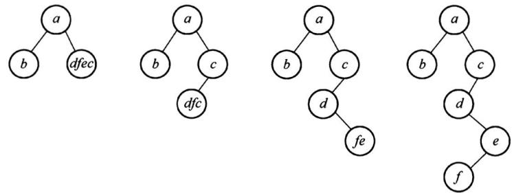

可以得到二叉树  $T$  的后序序列为  $b, f, e, d, c, a$ 。

### ANSWER

C

## QUESTION 5

### QUESTION TYPE

multiple_choice_single_answer

### QUESTION

下列给定的关键字输入序列中，不能生成如下二叉排序树的是（ ）。

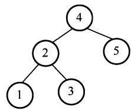

### CHOICES

- A. 4, 5, 2, 1, 3
- B. 4, 5, 1, 2, 3
- C. 4, 2, 5, 3, 1
- D. 4, 2, 1, 3, 5

### EXPLANATION

每个选项都逐一验证,选项B生成二叉排序树的过程如下:

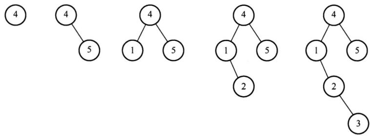

显然选项B错误。

### ANSWER

B

## QUESTION 6

### QUESTION TYPE

multiple_choice_single_answer

### QUESTION

修改递归方式实现的图的深度优先搜索（DFS）算法，将输出（访问）顶点信息的语句移到退出递归前（即执行输出语句后立刻退出递归)。采用修改后的算法遍历有向无环图  $G$ 若输出结果中包含  $G$  中的全部顶点，则输出的顶点序列是  $G$  的（  ）。

### CHOICES

- A.拓扑有序序列
- B.逆拓扑有序序列
- C.广度优先搜索序列
- D.深度优先搜索序列

### EXPLANATION

DFS是一个递归算法,在遍历过程中,先访问的顶点被压入栈底。设在图中有顶点  $\nu_{i}$  ,它有后继顶点  $\nu_{j}$  ,即存在边  $\nu_{i},\nu_{j} \rightarrow \circ$ 。根据DFS的规则,  $\nu_{i}$  入栈后,必先遍历完其后继顶点后 $\nu_{i}$  才会出栈,也就是说  $\nu_{i}$  会在  $\nu_{j}$  之后出栈,在如题所指的过程中,  $\nu_{i}$  在  $\nu_{j}$  后打印。由于  $\nu_{i}$  和  $\nu_{j}$  具有任意性,从上面的规律可以看出,输出顶点的序列是逆拓扑有序序列。

### ANSWER

B

## QUESTION 7

### QUESTION TYPE

multiple_choice_single_answer

### QUESTION

已知无向图  $G$  如下所示，使用克鲁斯卡尔（Kruskal）算法求图  $G$  的最小生成树，加到最小生成树中的边依次是（ ）。

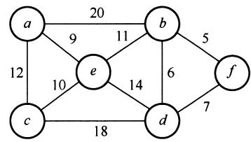

### CHOICES

- A. (b,f), (b,d), (a,e), (c,e), (b,e)
- B. (b,f), (b,d), (b,e), (a,e), (c,e)
- C.  $(a,e),(b,e),(c,e),(b,d),(b,f)$
- D.  $(a,e),(c,e),(b,e),(b,f),(b,d)$

### EXPLANATION

Kruskal算法:按权值递增顺序依次选取  $n - 1$  条边,并保证这  $n - 1$  条边不构成回路。初始构造一个仅含  $n$  个顶点的森林;第一步,选取权值最小的边  $(b, f)$  加入最小生成树;第二步,剩余边中权值最小的边为  $(b, d)$ ,加入最小生成树,第二步操作后权值最小的边  $(d, f)$  不能选,因为会与之前已选取的边形成回路;接下来依次选取权值 9, 10, 11 对应的边加入最小生成树,此时 6 个顶点形成了一棵树,最小生成树构造完成。按照上述过程,加到最小生成树的边依次为  $(b, f), (b, d), (a, e), (c, e), (b, e)$ 。其生成过程如下所示。

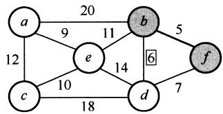  
第一步选取边  $< b,f>$

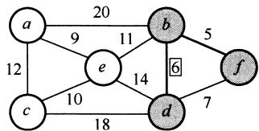  
第二步选取边  $< b,d>$

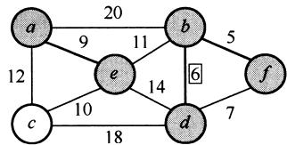  
第三步选取边  $< a,e>$

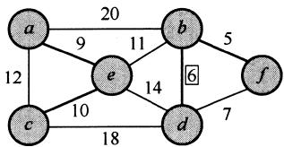  
第四步选取边  $< c,e>$

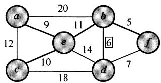  
第五步选取边  $< b,e>$

### ANSWER

A

## QUESTION 8

### QUESTION TYPE

multiple_choice_single_answer

### QUESTION

若使用AOE网估算工程进度,则下列叙述中正确的是()。

### CHOICES

- A. 关键路径是从原点到汇点边数最多的一条路径
- B. 关键路径是从原点到汇点路径长度最长的路径
- C. 增加任一关键活动的时间不会延长工程的工期
- D. 缩短任一关键活动的时间将会缩短工程的工期

### EXPLANATION

关键路径是指权值之和最大而非边数最多的路径,故选项A错误。选项B正确,是关键路径的概念。无论是存在一条还是存在多条关键路径,增加任一关键活动的时间都会延长工程的工期,因为关键路径始终是权值之和最大的那条路径,选项C错误。仅有一条关键路径时,减少关键活动的时间会缩短工程的工期;存在多条关键路径时,缩短一条关键活动的时间不一定会缩短工程的工期,缩短了路径长度的那条关键路径不一定还是关键路径,选项D错误。

### ANSWER

B

## QUESTION 9

### QUESTION TYPE

multiple_choice_single_answer

### QUESTION

下列关于大根堆(至少含2个元素)的叙述中,正确的是()。

I. 可以将堆视为一棵完全二叉树  
II. 可以采用顺序存储方式保存堆  
III. 可以将堆视为一棵二叉排序树  
IV. 堆中的次大值一定在根的下一层

### CHOICES

- A.仅I、II
- B.仅II、III
- C.仅I、II和IV
- D. I、III和IV

### EXPLANATION

这是一道简单的概念题。堆是一棵完全树,采用一维数组存储,故I正确,II正确。大根堆只要求根结点值大于左右孩子值,并不要求左右孩子值有序,III错误。堆的定义是递归的,所以其左右子树也是大根堆,所以堆的次大值一定是其左孩子或右孩子,IV正确。

### ANSWER

C

## QUESTION 10

### QUESTION TYPE

multiple_choice_single_answer

### QUESTION

依次将关键字5,6,9,13,8,2,12,15插入初始为空的4阶B树后,根结点中包含的关键字是()。

### CHOICES

- A.8
- B.6,9
- C.8,13
- D.9,12

### EXPLANATION

一个4阶B树的任意非叶结点至多含有  $m - 1 = 3$  个关键字,在关键字依次插入的过程中,会导致结点的不断分裂,插入过程如下所示。

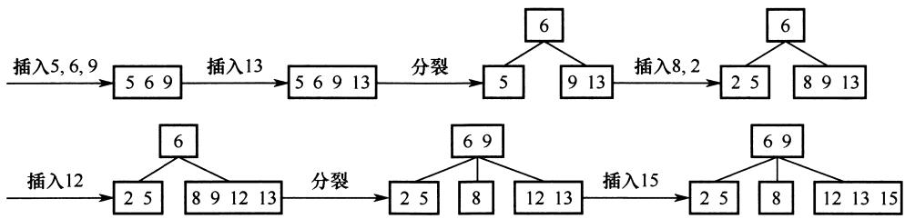

得到根结点包含的关键字为6,9。

### ANSWER

B

## QUESTION 11

### QUESTION TYPE

multiple_choice_single_answer

### QUESTION

对大部分元素已有序的数组进行排序时,直接插入排序比简单选择排序效率更高,其原因是()。

### CHOICES

- A.仅I
- B.仅III
- C.仅I、II
- D. I、II和III

### EXPLANATION

考虑较极端的情况,对于有序数组,直接插入排序的比较次数为  $n - 1$ ,简单选择排序的比较次数始终为  $1 + 2 + \dots +n - 1 = n(n - 1) / 2$ ,I正确。两种排序方法的辅助空间都是  $O(1)$ ,无差别,II错误。初始有序时,移动次数均为0;对于通常情况,直接插入排序每趟插入都

需要依次向后挪位, 而简单选择排序只需与找到的最小元素交换位置, 后者的移动次数少很多, III 错误。

### ANSWER

A

## QUESTION 12

### QUESTION TYPE

multiple_choice_single_answer

### QUESTION

下列给出的部件中,其位数(宽度)一定与机器字长相同的是()。

### CHOICES

- A.仅I、II
- B.仅I、III
- C.仅II、III
- D.仅II、III、IV

### EXPLANATION

机器字长是指 CPU 内部用于整数运算的数据通路的宽度。CPU 内部数据通路是指 CPU 内部的数据流经的路径及路径上的部件, 主要是 CPU 内部进行数据运算、存储和传送的部件, 这些部件的宽度基本上要一致才能相互匹配。因此, 机器字长等于 CPU 内部用于整数运算的运算器位数和通用寄存器宽度。

### ANSWER

B

## QUESTION 13

### QUESTION TYPE

multiple_choice_single_answer

### QUESTION

已知带符号整数用补码表示,float型数据用IEEE754标准表示,假定变量  $x$  的类型只可能是int或float,当  $x$  的机器数为C8000000H时,  $x$  的值可能是()。

### CHOICES

- A.  $-7\times 2^{27}$
- B.  $-2^{16}$
- C.  $2^{17}$
- D.  $25\times 2^{27}$

### EXPLANATION

$\mathrm{C8000000H} = 1100100000000000000000000000000_{2}$

将其转换为对应的 float 型或 int 型:

1)为float型时,尾数隐藏最高位1,数符为1表示负数,阶码  $10010000 = 2^{7} + 2^{4} = 128 + 16,$  再减去偏置值127得到17,算出  $x$  值为  $-2^{17}$ 。

2)为int型时, 带符号补码, 为负数, 数值部分取反加 1, 得 0111000000000000000000000000000。

### ANSWER

B

## QUESTION 14

### QUESTION TYPE

multiple_choice_single_answer

### QUESTION

在按字节编址,采用小端方式的32位计算机中,按边界对齐方式为以下C语言结构型变量a分配存储空间:

struct {
  short x1;
  int x2;
} a;

若a的首地址为2020FE00H,a的成员变量x2的机器数为12340000H,则其中34H所在存储单元的地址是()。

### CHOICES

- A. 2020 FE03H
- B. 2020 FE04H
- C. 2020 FE05H
- D. 2020 FE06H

### EXPLANATION

在 32 位计算机中, 按字节编址, 根据小端方式和按边界对齐的定义, 给出变量 a 的存放方式如下:

<table><tr><td rowspan="2">地址</td><td>2020 FE00H</td><td>2020 FE01H</td><td>2020 FE02H</td><td>2020 FE03H</td></tr><tr><td>未知</td><td>未知</td><td></td><td></td></tr><tr><td>说明</td><td>x1 (LSB)</td><td>x1 (MSB)</td><td></td><td></td></tr><tr><td rowspan="2">地址</td><td>2020 FE00H</td><td>2020 FE05H</td><td>2020 FE06H</td><td>2020 FE07H</td></tr><tr><td>00H</td><td>00H</td><td>34H</td><td>12H</td></tr><tr><td>说明</td><td>x2 (LSB)</td><td></td><td></td><td>x2 (MSB)</td></tr></table>

于是, 34H 所在存储单元的地址为 2020 FE06H。

### ANSWER

D

## QUESTION 15

### QUESTION TYPE

multiple_choice_single_answer

### QUESTION

下列关于TLB和Cache的叙述中,错误的是( )。

### CHOICES

- A. 命中率都与程序局部性有关
- B. 缺失后都需要去访问主存
- C. 缺失处理都可以由硬件实现
- D. 都由DRAM存储器组成

### EXPLANATION

Cache 由 SRAM 组成; TLB 通常由相联存储器组成, 也可由 SRAM 组成。DRAM 需要不断刷新, 性能偏低, 不适合组成 TLB 和 Cache。选项 A、B 和 C 都是 TLB 和 Cache 的特点。

### ANSWER

D

## QUESTION 16

### QUESTION TYPE

multiple_choice_single_answer

### QUESTION

某计算机采用16位定长指令字格式,操作码位数和寻址方式位数固定,指令系统有48条指令,支持直接、间接、立即、相对4种寻址方式。单地址指令中,直接寻址方式的可寻址范围是( )。

### CHOICES

- A.  $0\sim 255$
- B.  $0\sim 1023$
- C.  $-128\sim 127$
- D.  $-512\sim 511$

### EXPLANATION

48 条指令需要 6 位操作码字段  $(2^{5} < 48 < 2^{6})$ , 4 种寻址方式需要 2 位寻址特征位  $(4 = 2^{2})$ , 还剩  $16 - 6 - 2 = 8$  位作为地址码, 故直接寻址范围为  $0 \sim 255$  。注意, 主存地址不能为负。

### ANSWER

A

## QUESTION 17

### QUESTION TYPE

multiple_choice_single_answer

### QUESTION

下列给出的处理器类型中,理想情况下,CPI为1的是( )。

I.单周期CPU II.多周期CPU III.基本流水线CPU IV.超标量流水线CPU

### CHOICES

- A.仅I、II
- B.仅I、III
- C.仅II、IV
- D.仅III、IV

### EXPLANATION

CPI 表示执行指令所需的时钟周期数。对于一个程序或一台机器来说, 其 CPI 指执行该程序或机器指令集中的所有指令所需的平均时钟周期数。对于单周期 CPU, 令指令周期  $=$  时钟周期,  $\mathrm{CPI} = 1$ , I 正确。对于多周期 CPU, CPU 的执行过程分成几个阶段, 每个阶段用一个时钟去完成, 每种指令所用的时钟数可以不同,  $\mathrm{CPI} > 1$ , II 错误。对于基本流水线 CPU, 让每个时钟周期流出一条指令,  $\mathrm{CPI} = 1$ , III 正确。超标量流水线 CPU 在每个时钟周期内

并发执行多条独立的指令, 每个时钟周期流出多条指令,  $\mathrm{CPI}< 1$ , IV 错误。

### ANSWER

B

## QUESTION 18

### QUESTION TYPE

multiple_choice_single_answer

### QUESTION

下列关于"自陷"(Trap,也称陷阱)的叙述中,错误的是( )。

### CHOICES

- A.自陷是通过陷阱指令预先设定的一类外部中断事件
- B.自陷可用于实现程序调试时的断点设置和单步跟踪
- C.自陷发生后CPU将转去执行操作系统内核相应程序
- D.自陷处理完成后返回到陷阱指令的下一条指令执行

### EXPLANATION

自陷是一种内部异常, A 错误。在  $80 \times 86$  中, 用于程序调试的"断点设置"功能是通过"自陷"方式实现的, 选项 B 正确。执行到自陷指令时, 无条件或有条件地自动调出操作系统内核程序进行执行, 选项 C 正确。CPU 执行"陷阱指令"后, 会自动地根据不同"陷阱"类型进行相应的处理, 然后返回到"陷阱指令"的下一条指令执行, 选项 D 正确。

### ANSWER

A

## QUESTION 19

### QUESTION TYPE

multiple_choice_single_answer

### QUESTION

QPI总线是一种点对点全工同步串行总线,总线上的设备可同时接收和发送信息,每个方向可同时传输20位信息(16位数据  $+4$  位校验位),每个QPI数据包有80位信息,分2个时钟周期传送,每个时钟周期传递2次。因此,QPI总线带宽为:每秒传送次数  $\times 2\mathrm{B}\times 2$  。若QPI时钟频率为  $2.4\mathrm{GHz}$  ,则总线带宽为( )。

### CHOICES

- A.4.8GBps
- B.9.6GBps
- C.19.2GBps
- D.38.4GBps

### EXPLANATION

每个时钟周期传送2次, 故每秒传送的次数  $=$  时钟频率  $\times 2 = 2.4 \mathrm{~G} \times 2 / \mathrm{s}$ 。

总线带宽  $=$  每秒传送次数  $\times 2 \mathrm{~B} \times 2 = 2.4 \mathrm{~G} \times 2 \times 2 \mathrm{~B} \times 2 / \mathrm{s} = 19.2 \mathrm{~G} \mathrm{~B} / \mathrm{s}$ 。

题中已给出总线带宽公式, 降低了难度。公式中的"  $\times 2 \mathrm{~B}$ " 是因为每次传输 16 位数据, " $\times 2$ " 是因为采用点对点全双工总线, 两个方向可同时传输信息。

### ANSWER

C

## QUESTION 20

### QUESTION TYPE

multiple_choice_single_answer

### QUESTION

下列事件中,属于外部中断事件的是( )。

I.访存时缺页  
II.定时器到时  
III.网络数据包到达

### CHOICES

- A.仅I、II
- B.仅I、III
- C.仅II、III
- D.I、II和III

### EXPLANATION

访存时缺页属于内部异常, I 错误; 定时器到时描述的是时钟中断, 属于外部中断, II 正确; 网络数据包到达描述的是 CPU 执行指令以外的事件, 属于外部中断, III 正确。

### ANSWER

C

## QUESTION 21

### QUESTION TYPE

multiple_choice_single_answer

### QUESTION

外部中断包括不可屏蔽中断(NMI)和可屏蔽中断,下列关于外部中断的叙述中,错误的是( )。

### CHOICES

- A.CPU处于关中断状态时,也能响应NMI请求
- B.一旦可屏蔽中断请求信号有效,CPU将立即响应
- C.不可屏蔽中断的优先级比可屏蔽中断的优先级高
- D.可通过中断屏蔽字改变可屏蔽中断的处理优先级

### EXPLANATION

由 CPU 内部产生的异常称为内中断, 内中断都是不可屏蔽中断。通过中断请求线 INTR 和 NMI, 从 CPU 外部发出的中断请求为外中断, 通过 INTR 信号线发出的外中断是可屏蔽中断, 而通过 NMI 信号线发出的是不可屏蔽中断。不可屏蔽中断不受中断标志位的影响, 即使在关中断的情况下也会被响应, 选项 A 正确。不可屏蔽中断的处理优先级最高, 任何时候只要发生不可屏蔽中断, 都要中止现行程序的执行, 转到不可屏蔽中断处理程序执行, 选项 C 正确。CPU 响应中断需要满足 3 个条件:  $①$  中断源有中断请求;  $②$  CPU 允许中断及开中断;  $③$  一条指令执行完毕, 且没有更紧迫的任务。故选项 B 错误。

### ANSWER

B

## QUESTION 22

### QUESTION TYPE

multiple_choice_single_answer

### QUESTION

若设备采用周期挪用DMA方式进行输入和输出,每次DMA传送的数据块大小为512字节,相应的I/O接口中有一个32位数数据缓冲寄存器。对于数据输入过程,下列叙述中,错误的是( )。

### CHOICES

- A. 每准备好 32 位数据，DMA 控制器就发出一次总线请求
- B. 相对于 CPU，DMA 控制器的总线使用权的优先级更高
- C. 在整个数据块的传送过程中，CPU 不可以访问主存储器
- D. 数据块传送结束时，会产生“DMA 传送结束”中断请求

### EXPLANATION

周期挪用法由 DMA 控制器挪用一个或几个主存周期来访问主存, 传送完一个数据字后立即释放总线, 是一种单字传送方式, 每个字传送完后 CPU 可以访问主存, 选项 C 错误。停止 CPU 访存法则是指在整个数据块的传送过程中, 使 CPU 脱离总线, 停止访问主存。

### ANSWER

C

## QUESTION 23

### QUESTION TYPE

multiple_choice_single_answer

### QUESTION

若多个进程共享同一个文件F，则下列叙述中，正确的是（）。

### CHOICES

- A. 各进程只能用“读”方式打开文件F
- B. 在系统打开文件表中仅有一个表项包含F的属性
- C. 各进程的用户打开文件表中关于F的表项内容相同
- D. 进程关闭F时，系统删除F在系统打开文件表中的表项

### EXPLANATION

多个进程可同时以"读"或"写"方式打开文件, 操作系统并不保证写操作的互斥性, 进程可通过系统调用对文件加锁, 保证互斥写 (读者- 写者问题), 选项 A 错误。整个系统只有一个系统打开文件表, 同一个文件打开多次只需改变引用计数, 选项 B 正确。用户进程的打开文件表关于同一个文件不一定相同, 例如读写指针位置不一定相同, 选项 C 错误。进程关闭文件时, 文件的引用计数减 1 , 引用计数变为 0 时才删除系统打开文件表中的表项, 选项 D 错误。

### ANSWER

B

## QUESTION 24

### QUESTION TYPE

multiple_choice_single_answer

### QUESTION

下列选项中，支持文件长度可变、随机访问的磁盘存储空间分配方式是（）。

### CHOICES

- A. 索引分配
- B. 链接分配
- C. 连续分配
- D. 动态分区分配

### EXPLANATION

索引分配支持变长的文件, 同时可以随机访问文件的指定数据块, 选项 A 正确。链接分配不支持随机访问, 需要依靠指针依次访问, 选项 B 错误。连续分配的文件长度固定, 不支持

可变文件长度(连续分配的文件长度虽然也可变,但是需大量移动数据,代价较大,相比之下不太合适),选项C错误。动态分区分配是内存管理方式,不是磁盘空间的管理方式,选项D错误。

### ANSWER

A

## QUESTION 25

### QUESTION TYPE

multiple_choice_single_answer

### QUESTION

下列与中断相关的操作中，由操作系统完成的是（）。

I. 保存被中断程序的中断点  
II. 提供中断服务  
III. 初始化中断向量表  
IV. 保存中断屏蔽字

### CHOICES

- A.仅I、II
- B.仅I、II、IV
- C.仅III、IV
- D.仅II、III、IV

### EXPLANATION

当CPU检测到中断信号后,由硬件自动保存被中断程序的断点(即程序计数器PC),I错误。之后,硬件找到该中断信号对应的中断向量,中断向量指明中断服务程序入口地址(各中断向量统一存放在中断向量表中,该表由操作系统初始化,II正确)。接下来开始执行中断服务程序,保存PSW、保存中断屏蔽字、保存各通用寄存器的值,并提供与中断信号对应的中断服务,中断服务程序属于操作系统内核,II和IV正确。

### ANSWER

D

## QUESTION 26

### QUESTION TYPE

multiple_choice_single_answer

### QUESTION

下列与进程调度有关的因素中，在设计多级反馈队列调度算法时需要考虑的是（）。

I. 就绪队列的数量  
II. 就绪队列的优先级  
III. 各就绪队列的调度算法  
IV. 进程在就绪队列间的迁移条件

### CHOICES

- A.仅I、II
- B.仅III、IV
- C.仅II、III、IV
- D.I、II、III和IV

### EXPLANATION

多级反馈队列调度算法需要综合考虑优先级数量、优先级之间的转换规则等,就绪队列的数量会影响长进程的最终完成时间,I正确;就绪队列的优先级会影响进程执行的顺序,II正确;各就绪队列的调度算法会影响各队列中进程的调度顺序,III正确;进程在就绪队列中的迁移条件会影响各进程在各队列中的执行时间,IV正确。

### ANSWER

D

## QUESTION 27

### QUESTION TYPE

multiple_choice_single_answer

### QUESTION

某系统中有A、B两类资源各6个，t时刻资源分配及需求情况如下表所示。

<table><tr><td>进程</td><td>A已分配数量</td><td>B已分配数量</td><td>A需求总量</td><td>B需求总量</td></tr><tr><td>P1</td><td>2</td><td>3</td><td>4</td><td>4</td></tr><tr><td>P2</td><td>2</td><td>1</td><td>3</td><td>1</td></tr><tr><td>P3</td><td>1</td><td>2</td><td>3</td><td>4</td></tr></table>

t时刻安全性检测结果是（）。

### CHOICES

- A. 存在安全序列P1、P2、P3
- B. 存在安全序列P2、P1、P3
- C. 存在安全序列P2、P3、P1
- D. 不存在安全序列

### EXPLANATION

首先求出需求矩阵:

$\mathbf{N e e d} = \mathbf{M a x} - \mathbf{A l l o c a t i o n} = {\left[ \begin{array}{l l}{4} & {4}\\ {3} & {1}\\ {3} & {4} \end{array} \right]} - {\left[ \begin{array}{l l}{2} & {3}\\ {2} & {1}\\ {1} & {2} \end{array} \right]} = {\left[ \begin{array}{l l}{2} & {1}\\ {1} & {0}\\ {2} & {2} \end{array} \right]}$

由Allocation得知当前Available为(1,0)。由需求矩阵可知,初始只能满足P2的需求,选项A错误。P2释放资源后Available变为(3,1),此时仅能满足P1的需求,选项C错误。P1释放资源后Available变为(5,4),可以满足P3的需求,得到的安全序列为P2,P1,P3,选项B正确,选项D错误。

### ANSWER

B

## QUESTION 28

### QUESTION TYPE

multiple_choice_single_answer

### QUESTION

下列因素中，影响请求分页系统有效（平均）访存时间的是（）。

I. 缺页率  
II. 磁盘读写时间  
III. 内存访问时间  
IV. 执行缺页处理程序的CPU时间

### CHOICES

- A.仅II、III
- B.仅I、IV
- C.仅I、III、IV
- D.I、II、III和IV

### EXPLANATION

I影响缺页中断的频率,缺页率越高,平均访存时间越长;II和IV影响缺页中断的处理时间,中断处理时间越长,平均访存时间越长;III影响访问页表和访问目标物理地址的时间,故I、II、III和IV均正确。

### ANSWER

D

## QUESTION 29

### QUESTION TYPE

multiple_choice_single_answer

### QUESTION

下列关于父进程与子进程的叙述中，错误的是（）。

### CHOICES

- A. 父进程与子进程可以并发执行
- B. 父进程与子进程共享虚拟地址空间
- C. 父进程与子进程有不同的进程控制块
- D. 父进程与子进程不能同时使用同一临界资源

### EXPLANATION

父进程与子进程当然可以并发执行,选项A正确。父进程可与子进程共享一部分资源,但不能共享虚拟地址空间,在创建子进程时,会为子进程分配资源,如虚拟地址空间等,选项B错误。临界资源一次只能为一个进程所用,选项D正确。进程控制块PCB是进程存在的唯一标志,每个进程都有自己的PCB,选项C正确。

### ANSWER

B

## QUESTION 30

### QUESTION TYPE

multiple_choice_single_answer

### QUESTION

对于具备设备独立性的系统,下列叙述中,错误的是( )。

### CHOICES

- A. 可以使用文件名访问物理设备
- B. 用户程序使用逻辑设备名访问物理设备
- C. 需要建立逻辑设备与物理设备之间的映射关系
- D. 更换物理设备后必须修改访问该设备的应用程序

### EXPLANATION

设备可视为特殊文件,选项A正确。用户使用逻辑设备名来访问物理文件,有利于设备独立性,选项B正确。通过逻辑设备名访问物理设备时,需要建立逻辑设备和物理设备之间的映射关系,选项C正确。应用程序按逻辑设备名访问设备,再经驱动程序的处理来控制

物理设备，若更换物理设备，则只需更换驱动程序，而无须修改应用程序，选项D错误。

### ANSWER

D

## QUESTION 31

### QUESTION TYPE

multiple_choice_single_answer

### QUESTION

某文件系统的目录项由文件名和索引结点号构成。若每个目录项长度为 64 字节,其中 4 字节存放索引结点号,60 字节存放文件名。文件名由小写英文字母构成,则该文件系统能创建的文件数量的上限为( )。

### CHOICES

- A.  $2^{26}$
- B.  $2^{32}$
- C.  $2^{60}$
- D.  $2^{64}$

### EXPLANATION

在总长为64字节的目录项中，索引结点占4字节，即32位。不同目录下的文件的文件名可以相同，所以在考虑系统创建最多文件数量时，只需考虑索引结点的个数，即创建文件数量上限  $=$  索引结点数量上限。整个系统中最多存储  $2^{32}$  个索引结点，因此整个系统最多可以表示  $2^{32}$  个文件，选项B正确。

### ANSWER

B

## QUESTION 32

### QUESTION TYPE

multiple_choice_single_answer

### QUESTION

下列准则中,实现临界区互斥机制必须遵循的是( )。

I. 两个进程不能同时进入临界区  
II. 允许进程访问空闲的临界资源  
III. 进程等待进入临界区的时间是有限的  
IV. 不能进入临界区的执行态进程立即放弃 CPU

### CHOICES

- A.仅I、IV
- B.仅II、III
- C.仅I、II、III
- D.仅I、III、IV

### EXPLANATION

实现临界区互斥需满足多个准则。“忙则等待”准则，即两个进程不能同时访问临界区，I正确。“空闲让进”准则，若临界区空闲，则允许其他进程访问，II正确。“有限等待”准则，即进程应该在有限时间内访问临界区，III正确。I、II和III是互斥机制必须遵循的原则。IV是“让权等待”准则，不一定非得实现，如皮特森算法。

### ANSWER

C

## QUESTION 33

### QUESTION TYPE

multiple_choice_single_answer

### QUESTION

下图描述的协议要素是( )。

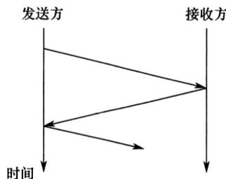

I.语法  
II.语义  
III.时序

### CHOICES

- A.仅I
- B.仅II
- C.仅III
- D.I、II和III

### EXPLANATION

协议由语法、语义和时序（又称同步）三部分组成。语法规定了通信双方彼此“如何讲”，即规定了传输数据的格式。语义规定了通信双方彼此“讲什么”，规定了所要完成的功能，如通信双方要发出什么控制信息、执行的动作和返回的应答。时序规定了信息交流的次序。由图可知发送方与接收方依次交换信息，体现了协议三要素中的时序要素。

### ANSWER

D

## QUESTION 34

### QUESTION TYPE

multiple_choice_single_answer

### QUESTION

下列关于虚电路网络的叙述中,错误的是( )。

### CHOICES

- A. 可以确保数据分组传输顺序
- B. 需要为每条虚电路预分配带宽
- C. 建立虚电路时需要进行路由选择
- D. 依据虚电路号 (VCID) 进行数据分组转发

### EXPLANATION

虚电路服务需要有建立连接过程，每个分组使用短的虚电路号，属于同一条虚电路的分组按照同一路由进行转发，分组到达终点的顺序与发送顺序相同，可以保证有序传输，不需要为每条虚电路预分配带宽。

### ANSWER

B

## QUESTION 35

### QUESTION TYPE

multiple_choice_single_answer

### QUESTION

在下图所示的网络中,冲突域和广播域的个数分别是( )。

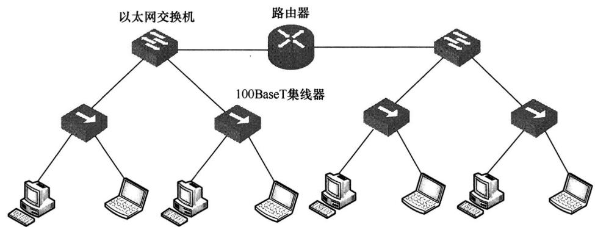

### CHOICES

- A. 2,2
- B. 2,4
- C. 4,2
- D. 4,4

### EXPLANATION

网络层设备路由器可以隔离广播域和冲突域；链路层设备普通交换机只能隔离冲突域；物理层设备集线器、中继器既不能隔离冲突域又不能隔离广播域。因此，题中共有2个广播域、4个冲突域。

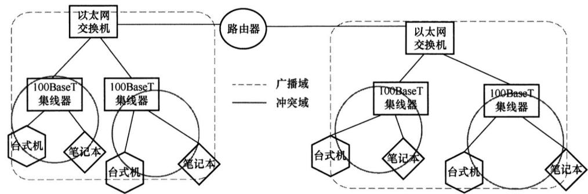

### ANSWER

B

## QUESTION 36

### QUESTION TYPE

multiple_choice_single_answer

### QUESTION

假设主机甲采用停—等协议向主机乙发送数据帧,数据帧长与确认帧长均为 1000B,数据传输速率是 10kbps,单项传播延时是 200ms。则甲的最大信道利用率为( )。

### CHOICES

- A.  $80\%$
- B.  $66.7\%$
- C.  $44.4\%$
- D.  $40\%$

### EXPLANATION

发送数据帧和确认帧的时间均为  $t = 1000 \times 8\mathrm{b} / 10\mathrm{kbps} = 800\mathrm{ms}$ 。

发送周期  $T = 800\mathrm{ms} + 200\mathrm{ms} + 800\mathrm{ms} + 200\mathrm{ms} = 2000\mathrm{ms}$ 。信道利用率  $= t / T \times 100\% = 800 / 2000 \times 100\% = 40\%$ 。

### ANSWER

D

## QUESTION 37

### QUESTION TYPE

multiple_choice_single_answer

### QUESTION

某 IEEE 802.11 无线局域网中,主机 H 与 AP 之间发送或接收 CSMA/CA 帧的过程如下图所示。在 H 或 AP 发送帧前所等待的帧间间隔时间(IFS)中,最长的是( )。

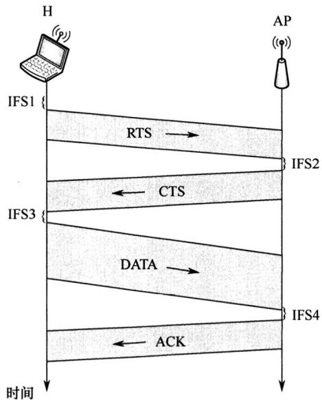

### CHOICES

- A. IFS1
- B. IFS2
- C. IFS3
- D. IFS4

### EXPLANATION

为了尽量避免碰撞,802.11规定,所有站在完成发送后,必须等待一段很短的时间(继续监听)才能发送下一帧。这段时间称为帧间间隔(InterFrame Space,IFS)。帧间间隔的长短取决于该站要发送的帧的类型。IEEE802.11使用3种帧间间隔:

DIFS(分布式协调IFS):最长的IFS,优先级最低,用于异步帧竞争访问的时延。

PIFS(点协调IFS):中等长度的IFS,优先级居中,在PCF操作中使用。

SIFS(短IFS):最短的IFS,优先级最高,用于需要立即响应的操作。

网络中的控制帧及所接收数据的确认帧都采用SIFS作为发送之前的等待时延。当结点要发送数据帧时,载波监听到信道空闲时,需等待DIFS后发送RTS预约信道,图中IFS1对应的是帧间间隔DIFS,时间最长,图中IFS2、IFS3、IFS4对应SIFS。

### ANSWER

A

## QUESTION 38

### QUESTION TYPE

multiple_choice_single_answer

### QUESTION

若主机甲与主机乙已建立一条 TCP 连接,最大段长(MSS)为 1KB,往返时间(RTT)为 2ms,则在不出现拥塞的前提下,拥塞窗口从 8KB 增长到 32KB 所需的最长时间是( )。

### CHOICES

- A.4ms
- B.8ms
- C.24ms
- D.48ms

### EXPLANATION

由于慢开始门限ssthresh可以根据需求设置,为了求拥塞窗口从8KB增长到32KB所需的最长时间,可以假定慢开始门限小于等于8KB,只要不出现拥塞,拥塞窗口就都是加法增大,每经历一个传输轮次(RTT),拥塞窗口逐次加1,所需最长时间为  $(32 - 8) \times 2\mathrm{ms} = 48\mathrm{ms}$ 。

### ANSWER

D

## QUESTION 39

### QUESTION TYPE

multiple_choice_single_answer

### QUESTION

若主机甲与主机乙建立 TCP 连接时,发送的 SYN 段中的序号为 1000,在断开连接时,甲发送给乙的 FIN 段中的序号为 5001,则在无任何重传的情况下,甲向乙已经发送的应用层数据的字节数为( )。

### CHOICES

- A. 4002
- B. 4001
- C. 4000
- D. 3999

### EXPLANATION

甲与乙建立TCP连接时发送的SYN段中的序号为1000,则在数据传输阶段所用的起始序号为1001;断开连接时,甲发送给乙的FIN段中的序号为5001,在无任何重传的情况下,甲向乙已经发送的应用层数据的字节数为  $5001 - 1001 = 4000$ 。

### ANSWER

C

## QUESTION 40

### QUESTION TYPE

multiple_choice_single_answer

### QUESTION

假设下图所示网络中的本地域名服务器只提供递归查询服务,其他域名服务器均只提供迭代查询服务;局域网内主机访问 Internet 上各服务器的往返时间(RTT)均为  $10\mathrm{ms}$ ,忽略其他各种时延。若主机 H 通过超链接 http://www.abc.com/index.html 请求浏览纯文本 Web 页 index.html,则从点击超链接开始到浏览器接收到 index.html 页面为止,所需的最短时间与最长时间分别是( )。

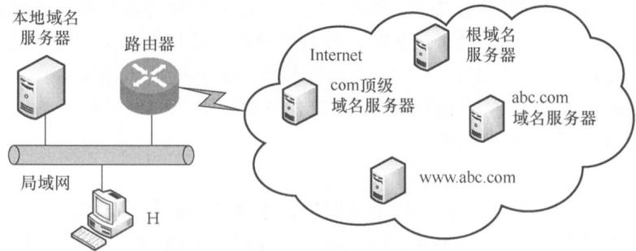

### CHOICES

- A.10ms,40ms
- B.10ms,50ms
- C.20ms,40ms
- D.20ms,50ms

### EXPLANATION

题中RTT均为局域网内主机(主机H、本地域名服务器)访问Internet上各服务器的往返时间,且忽略其他时延,因此主机H向本地域名服务器的查询时延忽略不计。最短时间:本地主机中有该域名到IP地址对应的记录,因此不需要DNS查询时延,直接和www.abc.com服务器建立TCP连接再进行资源访问,TCP连接建立需要1个RTT,接着发送访问请求并收到服务器资源响应需要1个RTT,共计2个RTT,即  $20\mathrm{ms}$ ;最长时间:本地主机递归查询本地域名服务器(延时忽略),本地服务器依次迭代查询根域名服务器、com顶级域名服务器、abc.com域名服务器,共3个RTT,查询到IP地址后,将该映射返回给主机H,主机H和www.abc.com服务器建立TCP连接再进行资源访问,共2个RTT,因此最长时间需要  $3 + 2 = 5$  个RTT,即  $50\mathrm{ms}$ 。

### ANSWER

D

## QUESTION 41

### QUESTION TYPE

multiple_choice_single_answer

### QUESTION

设  $n$  是描述问题规模的非负整数,下列程序段的时间复杂度是( )。

$\mathbf{x} = 0$  while  $(n \geq (x + 1) \times (x + 1))$   $\mathbf{x} = \mathbf{x} + 1$

### CHOICES

- A.  $O(\log n)$
- B.  $O(n^{1 / 2})$
- C.  $O(n)$
- D.  $O(n^{2})$

### ANSWER

B

## QUESTION 42

### QUESTION TYPE

multiple_choice_single_answer

### QUESTION

若将一棵树  $T$  转化为对应的二叉树BT,则下列对BT的遍历中,其遍历序列与  $T$  的后根遍历序列相同的是( )。

### CHOICES

- A.先序遍历
- B.中序遍历
- C.后序遍历
- D.按层遍历

### ANSWER

C

## QUESTION 43

### QUESTION TYPE

multiple_choice_single_answer

### QUESTION

对  $n$  个互不相同的符号进行哈夫曼编码。若生成的哈夫曼树共有115个结点,则  $n$  的值是( )。

### CHOICES

- A.56
- B.57
- C.58
- D.60

### ANSWER

B

## QUESTION 44

### QUESTION TYPE

multiple_choice_single_answer

### QUESTION

在任意一棵非空平衡二叉树(AVL树)  $T_{1}$  中,删除某结点  $\nu$  之后形成平衡二叉树  $T_{2}$  ,再将 $\nu$  插入  $T_{2}$  形成平衡二叉树  $T_{3}$  。下列关于  $T_{1}$  与  $T_{3}$  的叙述中,正确的是( )。

I.若  $\nu$  是  $T_{1}$  的叶结点,则  $T_{1}$  与  $T_{3}$  可能不相同

II.若  $\nu$  不是  $T_{1}$  的叶结点,则  $T_{1}$  与  $T_{3}$  一定不相同

III.若  $\nu$  不是  $T_{1}$  的叶结点,则  $T_{1}$  与  $T_{3}$  一定相同

### CHOICES

- A.仅I
- B.仅II
- C.仅I、II
- D.仅I、III

### ANSWER

A

## QUESTION 45

### QUESTION TYPE

multiple_choice_single_answer

### QUESTION

下图所示的AOE网表示一项包含8个活动的工程。活动  $d$  的最早开始时间和最迟开始时间分别是( )。

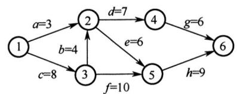

### CHOICES

- A.3和7
- B.12和12
- C.12和14
- D.15和15

### ANSWER

B

## QUESTION 46

### QUESTION TYPE

hybrid

### QUESTION

用有向无环图描述表达式  $(x + y)((x + y) / x)$ ,需要的顶点个数至少是( )。

## QUESTION 47

### QUESTION TYPE

short_answer

### QUESTION

定义三元组  $(a,b,c)$  (其中  $a,b,c$  均为正数)的距离  $D = |a - b| + |b - c| + |c - a|$ 。给定3个非空整数集合  $S_{1}$, $S_{2}$  和  $S_{3}$ ，按升序分别存储在3个数组中。设计一个尽可能高效的算法，计算并输出所有可能的三元组  $(a,b,c)$  $(a\in S_{1},b\in S_{2},c\in S_{3})$  中的最小距离。例如  $S_{1} = \{-1,0,9\}$ ， $S_{2} = \{-25, -10,10,11\}$ ， $S_{3} = \{2,9,17,30,41\}$ ，则最小距离为2，相应的三元组为(9,10,9)。要求:

1)给出算法的基本设计思想。

2)根据设计思想，采用C或  $\mathrm{C + + }$  语言描述算法，关键之处给出注释。

3)说明你所设计算法的时间复杂度和空间复杂度。

### EXPLANATION

分析。由  $D = |a - b| + |b - c| + |c - a| \geqslant 0$  得:

$①$  当  $a = b = c$  时,距离最小。

$②$  其余情况。不失一般性,假设  $a \leqslant b \leqslant c$ ,观察下面的数轴:

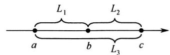

$L_{1} = |a - b|$, $L_{2} = |b - c|$, $L_{3} = |c - a|$, $D = |a - b| + |b - c| + |c - a| = L_{1} + L_{2} + L_{3} = 2L_{3}$ 。

由  $D$  的表达式可知，事实上决定  $D$  大小的关键是  $a$  和  $c$  之间的距离，于是问题就可以简化为每次固定  $c$  找一个  $a$  使得  $L_{3} = |c - a|$  最小。

1)算法的基本设计思想

$①$  使用  $D_{\min}$  记录所有已处理过的三元组的最小距离，初值为一个足够大的整数。

$②$  集合  $S_{1}, S_{2}$  和  $S_{3}$  分别保存在数组 A、B、C 中。数组的下标变量  $i = j = k = 0$，当  $i < |S_{1}|$，$j < |S_{2}|$  且  $k < |S_{3}|$  时(  $|S|$ 表示集合  $S$  中的元素个数)。循环执行  $\mathbf{a}) \sim \mathbf{c})$ 。

a)计算  $(\mathbf{A}[i], \mathbf{B}[j], \mathbf{C}[k])$  的距离  $D$  ; (计算  $D$  )

b)若  $D < D_{\min}$  ,则  $D_{\min} = D$  ; (更新  $D_{\min}$ )

c)将 A[i], B[j], C[k] 中的最小值的下标  $+1$  ;(对照分析:最小值为  $a$ ，最大值为  $c$ ，这里  $c$  不变而更新  $a$ ，试图寻找更小距离  $D$  )

$③$  输出  $D_{\min}$  ,结束。

2)算法实现:

#define INT_MAX 0x7fffffff

int abs_(int a){ // 计算绝对值
    if(a < 0) return -a;
    else return a;
}

bool xls_min(int a, int b, int c) { // 判断a是否是三个数中的最小值
    if(a <= b && a <= c) return true;
    return false;
}

int findMinofTrip(int A[], int n, int B[], int m, int C[], int p) {
    int i = 0, j = 0, k = 0;
    int D_min = INT_MAX, D;

    while(i < n && j < m && k < p && D_min > 0) {
        D = abs_(A[i] - B[j]) + abs_(B[j] - C[k]) + abs_(C[k] - A[i]); // 计算D
        if(D < D_min) D_min = D; // 更新D_min
        if(xls_min(A[i], B[j], C[k])) i++; // 更新a索引
        else if(xls_min(B[j], C[k], A[i])) j++; // 更新b索引
        else k++; // 更新c索引
    }
    return D_min;
}

3)设  $n = |S_{1}| + |S_{2}| + |S_{3}|$ ，时间复杂度为  $O(n)$ ，空间复杂度为  $O(1)$  。

### ANSWER

详见步骤。

## QUESTION 48

### QUESTION TYPE

short_answer

### QUESTION

若任一个字符的编码都不是其他字符编码的前缀，则称这种编码具有前缀特性。现有某字符集(字符个数  $\geqslant 2$ )的不等长编码，每个字符的编码均为二进制的0、1序列，最长为  $L$  位，且具有前缀特性。请回答下列问题:

1)哪种数据结构适宜保存上述具有前缀特性的不等长编码?

2)基于你所设计的数据结构，简述从0/1串到字符串的译码过程。

3)简述判定某字符集的不等长编码是否具有前缀特性的过程。

### EXPLANATION

1)使用一棵二叉树保存字符集中各字符的编码，每个编码对应于从根开始到达某叶结点的一条路径，路径长度等于编码位数，路径到达的叶结点中保存该编码对应的字符。

2)从左至右依次扫描0/1串中的各位。从根开始，根据串中当前位沿当前结点的左子指针或右子指针下移，直到移动到叶结点时为止。输出叶结点中保存的字符。然后从根开始重复这个过程，直到扫描到0/1串结束，译码完成。

3)二叉树既可用于保存各字符的编码，又可用于检测编码是否具有前缀特性。判定编码是否具有前缀特性的过程，也是构建二叉树的过程。初始时，二叉树中仅含有根结点，其左子指针和右子指针均为空。

依次读入每个编码C，建立/寻找从根开始对应于该编码的一条路径，过程如下:

对每个编码，从左至右扫描C的各位，根据C的当前位(0或1)沿结点的指针(左子指针或右子指针)向下移动。当遇到空指针时，创建新结点，让空指针指向该新结点并继续移动。沿指针移动的过程中，可能遇到三种情况：

$①$  若遇到了叶结点(非根)，则表明不具有前缀特性，返回。

$②$  若在处理C的所有位的过程中，均没有创建新结点，则表明不具有前缀特性，返回。

$③$  若在处理C的最后一个编码位时创建了新结点，则继续验证下一个编码。

若所有编码均通过验证，则编码具有前缀特性。

### ANSWER

详见步骤。

## QUESTION 49

### QUESTION TYPE

short_answer

### QUESTION

有实现  $x \times y$  的两个C语言函数如下:

unsigned umul (unsigned x, unsigned y) {return x * y;}

int imul (int x, int y) {return x * y;}

假定某计算机M中ALU只能进行加减运算和逻辑运算。请回答下列问题。

1)若M的指令系统中没有乘法指令，但有加法、减法和位移等指令，则在M上也能实现上述两个函数中的乘法运算，为什么?

2)若M的指令系统中有乘法指令，则基于ALU、位移器、寄存器以及相应控制逻辑实现乘法指令时，控制逻辑的作用是什么?

3)针对以下三种情况:  $①$  没有乘法指令;  $②$  有使用ALU和位移器实现的乘法指令;  $③$  有使用阵列乘法器实现的乘法指令，函数umul()在哪种情况下执行时间最长?哪种情况下执行的时间最短?说明理由。

4)  $n$  位整数乘法指令可保存  $2n$  位乘积，当仅取低  $n$  位作为乘积时，其结果可能会发生溢出。当  $n = 32$, $x = 2^{31} - 1$, $y = 2$  时，带符号整数乘法指令和无符号整数乘法指令得到的  $x \times y$  的  $2n$  位乘积分别是什么(用十六进制表示)?此时函数umul()和imul()的返回结果是否溢出?对于无符号整数乘法运算，当仅取乘积的低  $n$  位作为乘法结果时，如何用  $2n$  位乘积进行溢出判断?

### EXPLANATION

1)乘法运算可以通过加法和移位来实现。编译器可以将乘法运算转换为一个循环代码段，在循环代码段中通过比较、加法和移位等指令实现乘法运算。

2)控制逻辑的作用是控制循环次数，控制加法和移位操作。

3) $①$ 最长，$③$ 最短。对于 $①$，需要用循环代码段(即软件)实现乘法操作，因而需要反复执行很多条指令，而每条指令都需要取指令、译码、取数、执行并保存结果，所以执行时间很长;对于 $②$ 和 $③$，都只需用一条乘法指令实现乘法操作，不过 $②$ 中的乘法指令需要多个时钟周期才能完成，而 $③$ 中的乘法指令可以在一个时钟周期内完成，所以 $③$ 的执行时间最短。

4)当  $n=32, x=2^{31} -1, y=2$  时，带符号整数和无符号整数乘法指令得到的64位乘积都是00000000FFFF FFFFH。int型的表示范围为  $[-2^{31}, 2^{31} -1]$，故函数imul()的结果溢出；unsigned int型的表示范围为  $[0, 2^{32} -1]$，故函数umul()的结果不溢出。对于无符号整数乘法，若乘积高  $n$  位全为0，即使低  $n$  位全为1也正好是  $2^{32} -1$，不溢出，否则溢出。

### ANSWER

详见步骤。

## QUESTION 50

### QUESTION TYPE

short_answer

### QUESTION

假定主存地址为32位，按字节编址，指令Cache和数据Cache与主存之间均采用8路组相联映射方式，直写(Write Through)写策略和LRU替换算法，主存块大小为64B，数据区容量各为32KB。开始时Cache均为空。请回答下列问题。

1)Cache每一行中标记(Tag)、LRU位各占几位？是否有修改位？

2)有如下C语言程序段:

for  $(\mathbf{k} = \mathbf{0}; \mathbf{k} < \mathbf{1024}; \mathbf{k}++)$

$\mathbf{s}[\mathbf{k}] = 2 * \mathbf{s}[\mathbf{k}]$

若数组s及其变量k均为int型，int型数据占4B，变量k分配在寄存器中，数组s在主存中的起始地址为008000C0H，则该程序段执行过程中，访问数组s的数据Cache缺失次数为多少？

3)若CPU最先开始的访问操作是读取主存单元00010003H中的指令，简要说明从Cache中访问该指令的过程，包括Cache缺失处理过程。

### EXPLANATION

1)主存块大小为  $64\mathrm{B} = 2^{6}$ 字节，所以主存地址低6位为块内地址，Cache组数为 $32\mathrm{KB} / (64\mathrm{B} \times 8) = 64 = 2^{6}$，故主存地址中间6位为Cache组号，主存地址中高32-6-6 $= 20$ 位为标记，采用8路组相联映射，故每行中的LRU位占3位，采用直写方式，故没有修改位。

2)  $008000\mathrm{C0H} = 0000000010000000000000000110000000000000000000000000000000000000000000000000000000000000000000000000000000000000000000000000000$ ，主存地址的低6位为块内地址，为全0，故s位于一个主存块的开始处，占  $1024 \times 4\mathrm{B} / 64\mathrm{B} = 64$  个主存块；在执行程序段的过程中，每个主存块中的  $64\mathrm{B} / 4\mathrm{B} = 16$  个数组元素依次读、写1次，因而对每个主存块，总是第一次访问缺失，此时会将整个主存块调入Cache，之后每次都命中。综上，数组s的数据Cache访问缺失次数为64次。

3)  $00010003\mathrm{H} = 000000000000000000000000000000000000000000000000000000000000000000000000000000000000000000000000000\mathrm{H} = 00000000000000000000000000000000000000000000000000000000000000000000000000000000000000000000$ ，根据主存地址划分可知，组索引为0，故该地址所在主存块被映射到指令Cache的第0组；因为Cache初始为空，所有Cache行的有效位均为0，所以Cache访问缺失。此时，将该主存块取出后存入指令Cache的第0组的任意一行，并将主存地址高20位(00010H)填入该行标记字段，设置有效位，修改LRU位，最后根据块内地址000011B从该行中取出相应的内容。

### ANSWER

详见步骤。

## QUESTION 51

### QUESTION TYPE

short_answer

### QUESTION

现有5个操作A、B、C、D和E，操作C必须在A和B完成后执行，操作E必须在C和D完成后执行，请使用信号量的wait()、signal()操作(P、V操作)描述上述操作之间的同步关系，并说明所用信号量及其初值。

### EXPLANATION

本题要求实现操作的先后顺序，没有互斥关系，是一个简单的同步问题。

本题虽然有5个操作，但是只有4个同步关系，因此分别设置信号量SAC、SBC、SCE和SDE对应4个同步关系。

Semaphore  $\mathrm{SAC} = 0$  //控制A和C的执行顺序

Semaphore  $\mathrm{SBC} = 0$  //控制B和C的执行顺序

Semaphore  $\mathrm{SCE} = 0$  //控制C和E的执行顺序

Semaphore  $\mathrm{SDE} = 0$  //控制D和E的执行顺序

5个操作可描述为如下。

CoBegin
    A() {
        完成动作A;
        V(SAC); //实现A、C之间的同步关系
    }

    B() {
        完成动作B;
        V(SBC); //实现B、C之间的同步关系
    }

    C() {
        //C必须在A、B都完成后才能完成
        P(SAC);
        P(SBC);
        完成动作C;
        V(SCE); //实现C、E之间的同步关系
    }

    D() {
        完成动作D;
        V(SDE); //实现D、E之间的同步关系
    }

    E() {
        //E必须在完成C、D之后执行
        P(SCE);
        P(SDE);
        完成动作E;
    }
CoEnd

### ANSWER

详见步骤。

## QUESTION 52

### QUESTION TYPE

short_answer

### QUESTION

某32位系统采用基于二级页表的请求分页存储管理方式，按字节编址，页目录项和页表项长度均为4字节，虚拟地址结构如下所示。

<table><tr><td>页目录号（10位）</td><td>页号（10位）</td><td>页内偏移量（12位）</td></tr></table>

某C程序中数组a[1024][1024]的起始虚拟地址为10800000H，数组元素占4字节，该程序运行时，其进程的页目录起始物理地址为00201000H，请回答下列问题。

1)数组元素a[1][2]的虚拟地址是什么？对应的页目录号和页号分别是什么？对应的页目录项的物理地址是什么？若该目录项中存放的页框号为00301H，则a[1][2]所在页对应的页表项的物理地址是什么？

2)数组a在虚拟地址空间中所占的区域是否必须连续？在物理地址空间中所占区域是否必须连续？

3)已知数组a按行优先方式存放，若对数组a分别按行遍历和按列遍历，则哪种遍历方式的局部性更好？

### EXPLANATION

1)  $①$  页面大小  $= 2^{12}\mathrm{B} = 4096\mathrm{B} = 4\mathrm{KB}$ 。每个数组元素4B，每个页面可以存放4KB/4B  $= 1024$ 个数组元素，正好是数组的一行，数组a按行优先方式存放。10800000H的虚页号为10800H，因此a[0]行存放在虚页号为10800H的页面中，a[1]行存放在页号为10801H的页面中。a[1][2]的虚拟地址为  $10801~000\mathrm{H} + 4 \times 2 = 10801~008\mathrm{H}$ 。

$②$  转换为二进制0001000010000000001000000001000,根据虚拟地址结构可知，对应的页目录号为042H，页号为001H。

$③$  进程的页目录表起始地址为00201000H，每个页目录项长4B，因此042H号页目录项的物理地址是  $00201000\mathrm{H} + 4 \times 42\mathrm{H} = 00201108\mathrm{H}$ 。

$④$  页目录项存放的页框号为00301H，二级页表的起始地址为00301000H，因此a[1][2]所在页的页号为001H，每个页表项4B，因此对应的页表项物理地址是00301000H  $+$  $001\mathrm{H} \times 4 = 00301004\mathrm{H}$ 。

2) 根据数组的随机存取特点，数组 a 在虚拟地址空间中所占的区域必须连续，由于数组 a 不止占用一页，相邻逻辑页在物理上不一定相邻，因此数组 a 在物理地址空间中所占的区域可以不连续。

3) 由1)可知每个页面正好可以存放一整行的数组元素，"按行优先方式存放"意味着数组的同一行的所有元素都存放在同一个页面中，同一列的各个元素都存放在不同的页面中，因此数组 a 按行遍历的局部性较好。

### ANSWER

详见步骤。

## QUESTION 53

### QUESTION TYPE

short_answer

### QUESTION

某校园网有两个局域网，通过路由器R1、R2和R3互联后接入Internet，S1和S2为以太网交换机。局域网采用静态IP地址配置，路由器部分接口以及各主机的IP地址如下图所示。

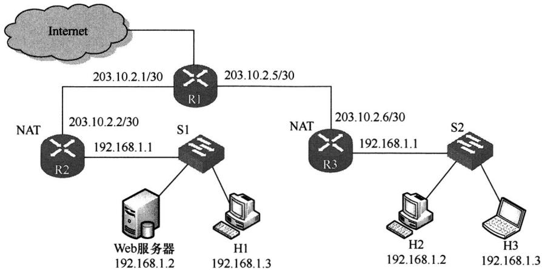

假设NAT转换表结构为

<table><tr><td colspan="2">外网</td><td colspan="2">内网</td></tr><tr><td>IP地址</td><td>端口号</td><td>IP地址</td><td>端口号</td></tr><tr><td></td><td></td><td></td><td></td></tr></table>

请回答下列问题:

1)为使H2和H3能够访问Web服务器(使用默认端口号),需要进行什么配置?

2)若H2主动访问Web服务器时，将HTTP请求报文封装到IP数据报P中发送，则H2发送P的源IP地址和目的IP地址分别是什么？经过R3转发后，P的源IP地址和目的IP地址分别是什么？经过R2转发后，P的源IP地址和目的IP地址分别是什么？

### EXPLANATION

1) 两个子网使用了相同的网段，且路由器开启了 NAT 功能，加上题干给出了 NAT 表的结构，因此需要配置 NAT 表。路由器 R2 开启 NAT 服务，当路由器 R2 从 WAN 口收到 H2 或 H3 发来的数据时，根据 NAT 表发送给 Web 服务器的对应端口。外网 IP 地址应该为路由器的外端 IP 地址，内网 IP 地址应该为 Web 服务器的地址，Web 服务器的默认端口为 80，因此内网端口号固定为 80，当其他网络的主机访问 Web 服务器时，默认访问的端口应该也是 80，但是访问的目的 IP 是路由器的 IP 地址，因此 NAT 表中的外部端口最好也统一为 80。题目中并未要求对 H1 进行访问，因此 H1 的 NAT 表项可以不写。R2 的 NAT 表配置如下:

<table><tr><td colspan="2">外网</td><td colspan="2">内网</td></tr><tr><td>IP地址</td><td>端口号</td><td>IP地址</td><td>端口号</td></tr><tr><td>203.10.2.2</td><td>80</td><td>192.168.1.2</td><td>80</td></tr></table>

2) 由于启用了 NAT 服务，H2 发送的 P 的源 IP 地址应该是 H2 的内网地址，目的地址应该是 R2 的外网 IP 地址，源 IP 地址是 192.168.1.2，目的 IP 地址是 203.10.2.2。R3 转发后，将 P 的源 IP 地址改为 R3 的外网 IP 地址，目的 IP 地址仍然不变，源 IP 地址是 203.10.2.6，目的 IP 地址是 203.10.2.2。R2 转发后，将 P 的目的 IP 地址改为 Web 服务器的内网地址，源地址仍然不变，源 IP 地址是 203.10.2.6，目的 IP 地址是 192.168.1.2。

### ANSWER

详见步骤.

