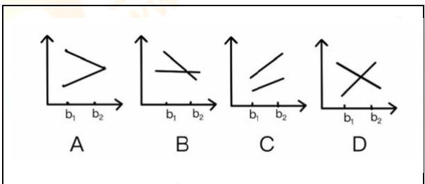
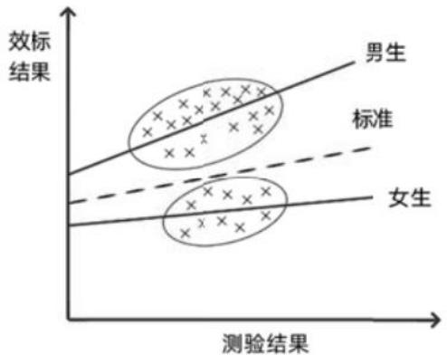
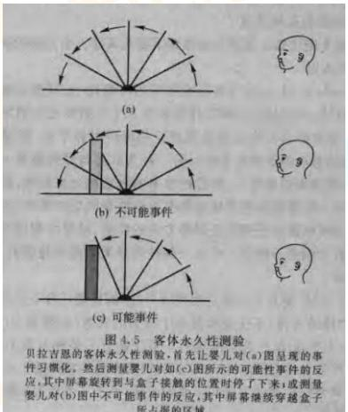

## QUESTION 1

### QUESTION TYPE

multiple_choice_single_answer

### QUESTION

下列问题中，认知心理学家最可能关注（）

### CHOICES

- A. 如何理解书面语言
- B. 如何提高员工积极性
- C. 帮人处理家庭关系
- D. 改进教学方法提高教学效果

### EXPLANATION

认知心理学关注知觉、记忆、语言和问题解决等领域，提高员工积极性是管理心理学研究领域，帮人处理家庭关系是临床和咨询心理学关注的，改进教学方法提高教学效果是教育心理学的关注点。

### ANSWER

A

## QUESTION 2

### QUESTION TYPE

multiple_choice_single_answer

### QUESTION

在安静的房间里，小华能听到6米外钟表秒针的滴答声，而小明却不能。说明小华高于小明的（）

### CHOICES

- A. 绝对感受阈限
- B. 绝对感受性
- C. 差别感受阈限
- D. 差别感受性

### EXPLANATION

绝对感受阈限（Absolute Threshold）指个体能够刚刚感受到某种刺激的最小强度。绝对感受性，是绝对感受阈限的反面，指感受刺激的能力。绝对感受性越高，是绝对感受阈限越低。题干问的是小华比小明高的是绝对感受性。

### ANSWER

B

## QUESTION 3

### QUESTION TYPE

multiple_choice_single_answer

### QUESTION

一个色觉正常的人注视红花约一分钟后，再将视线转向白墙，会在白墙上看到（）

### CHOICES

- A. 绿花
- B. 蓝
- C. 黄
- D. 红

### EXPLANATION

这是一个典型的视觉后像（Afterimage）现象，具体为负后像（Negative Afterimage）。颜色感知由红-绿、蓝-黄两个对立的颜色通道调控。红色和绿色是一对对立颜色，当红色感受器疲劳后，绿色感受器的作用占主导地位，因此在看白墙时会感知到绿色后像。

### ANSWER

A

## QUESTION 4

### QUESTION TYPE

multiple_choice_single_answer

### QUESTION

下列能解释5000HZ以上音高的理论是（）

### CHOICES

- A. 频率理论
- B. 位置理论
- C. 齐射神经反射
- D. 平行加工理论

### EXPLANATION

频率理论能够解释1000 Hz以下的声音音高的辨别，位置理论和神经齐射理论能够解释1000一5000 Hz声音音高的辨别，超过5000 Hz的声音音高的辨别由位置理论来解释。

### ANSWER

B

## QUESTION 5

### QUESTION TYPE

multiple_choice_single_answer

### QUESTION

当彩色霓虹灯按一定顺序运动时，你可以看到变化，这种现象可以用（）来解释。

### CHOICES

- A. 运动后效
- B. 诱发运动
- C. 自主运动
- D. 动景运动

### EXPLANATION

电影、电视、活动性商业广告、霓虹灯都是根据动景运动发生的原理制成的。

### ANSWER

D

## QUESTION 6

### QUESTION TYPE

multiple_choice_single_answer

### QUESTION

关于冥想，下面观点错误的是（）

### CHOICES

- A. 练习冥想可以有效提高人的身心健康
- B. 是正念，冥想时要把全身心专注在当前的状态之下。
- C. 中国古代的“心斋"和“坐忘"都是冥想的形式
- D. 正念冥想时，要对当前的状态进行的状态好坏进行评判。

### EXPLANATION

冥想持一种非评价性的接受态度，所谓非评价性是指不评判此时此刻的体验的好坏。

### ANSWER

D

## QUESTION 7

### QUESTION TYPE

multiple_choice_single_answer

### QUESTION

下列关于催眠的说法，正确的是（）

### CHOICES

- A. 催眠与睡眠是完全相同的意识状态
- B. 催眠与睡眠状态的脑电波完全相同
- C. 催眠源于奥地利医生的麦斯麦术
- D. 催眠状态下被催眠者对暗示的反应会降低

### EXPLANATION

催眠是由奥地利医生弗朗茨·梅斯梅尔（Franz Mesmer）发明的，他将催眠称为“动物磁气疗法”，后来成为现代催眠术的基础。催眠状态下意识是清醒的，被试对于暗示的反应增强。

### ANSWER

C

## QUESTION 8

### QUESTION TYPE

multiple_choice_single_answer

### QUESTION

洛夫特斯等人对目击者记忆的研究主要表明（）

### CHOICES

- A. 记忆错误受个体年龄影响
- B. 记忆错误受情绪差异影响
- C. 记忆不受事后情况影响
- D. 记忆主要是对过去事物进行建构的过程

### EXPLANATION

心理学家洛夫特斯等人（Loftus & Palmer，1974）对目击者的记忆进行了大量研究，发现目击者的记忆容易受到提问方式、事后接触到的信息等多种因素的影响，目击者的记忆并不完全可靠。这些研究说明了错误记忆的存在。

### ANSWER

D

## QUESTION 9

### QUESTION TYPE

multiple_choice_single_answer

### QUESTION

关于内隐记忆和外显记忆影响因素说法正确的是（）

### CHOICES

- A. 加工深度影响内隐记忆大于外显记忆
- B. 干扰信息影响内隐记忆大于外显记忆
- C. 记忆负荷量影响外显记忆大于内隐记忆
- D. 呈现方式影响外显记忆大于内隐记忆

### EXPLANATION

只有呈现方式影响内隐记忆，其他影响因素都是影响外显记忆。

### ANSWER

C

## QUESTION 10

### QUESTION TYPE

multiple_choice_single_answer

### QUESTION

陆钦斯的量水实验反映了（ ）是影响问题解决的因素。

### CHOICES

- A. 动机
- B. 定势
- C. 功能固着
- D. 表现方式

### EXPLANATION

Luchin的量水实验证明了定势对问题解决的影响。

### ANSWER

B

## QUESTION 11

### QUESTION TYPE

multiple_choice_single_answer

### QUESTION

根据概念组织的激活扩散模型，概念组织的基础是（）

### CHOICES

- A. 原型类比
- B. 逻辑关系
- C. 层次网络
- D. 语义相关性

### EXPLANATION

激活模型中概念网络以语义相关性为基础，意义相互联系的概念组织在一起。

### ANSWER

D

## QUESTION 12

### QUESTION TYPE

multiple_choice_single_answer

### QUESTION

提出语言的先天获得装置的学者是（）

### CHOICES

- A. 布洛卡
- B. 沃尔夫
- C. 乔姆斯基
- D. 威尔尼克

### EXPLANATION

语言获得装置是乔姆斯基提出。

### ANSWER

C

## QUESTION 13

### QUESTION TYPE

multiple_choice_single_answer

### QUESTION

判断下列两个字（分别是A和B），判断A为假字的反应时比B为假字的反应时更长，这是因为（）

### CHOICES

- A. 汉字的读音
- B. 汉字的意义
- C. 部位的数量
- D. 正字法规则

### EXPLANATION

汉字识别的过程中，“正字规则”是指人们对汉字结构和构成规律的熟悉度会影响识别效率。即使汉字书写错误或者部分缺失，只要不完全违反“正字规则”，人们仍能较快地识别出错误并做出反应。B的构成更符合正字法规则，识别会更快。

### ANSWER

D

## QUESTION 14

### QUESTION TYPE

multiple_choice_single_answer

### QUESTION

根据动机唤醒理论，描述错误的是（）

### CHOICES

- A. 对唤醒的偏好水平影响个体的行为
- B. 个体通常喜欢中等强度的刺激
- C. 个体经历不影响唤醒水平的偏好
- D. 重复活动使得动机水平降低

### EXPLANATION

人们偏好最佳的唤醒水平，一般来讲，个体偏好中等强度的刺激水平，简化原理，即重复进行刺激能使唤醒水平降低，个人经验对于偏好的影响，富有经验的个体偏好复杂刺激。

### ANSWER

C

## QUESTION 15

### QUESTION TYPE

multiple_choice_single_answer

### QUESTION

改变对负性情绪事件的理解来调节情绪的策略是（）

### CHOICES

- A. 合理宣泄策略
- B. 认知重评策略
- C. 注意转换策略
- D. 控制和修正策略

### EXPLANATION

合理宣泄策略即承认不良情绪并把它适当地表达出来。认知重评，即认知改变，通过改变对情绪事件的理解和评价，而进行情绪调节。注意转换策略包括分心和专注两种策略。分心是将注意集中于与情绪无关的方面，或者将注意从目前的情境中转移开；专注是对情境中的某一个方面长时间地集中注意，这时个体可以创造一种自我维持的卓越状态。控制和修正策略是通过改变情境中各种不利的情绪事件来实现的，情绪调节者试图通过控制情境来控制情绪的过程或结果。

### ANSWER

B

## QUESTION 16

### QUESTION TYPE

multiple_choice_single_answer

### QUESTION

智力PASS模型不包括以下哪个认知过程？（）

### CHOICES

- A. 知觉
- B. 注意
- C. 同时性加工
- D. 即时性加工

### EXPLANATION

PASS是指“计划－注意－同时性加工－继时性加工”，它包含了三个认知系统和四种认知过程。

### ANSWER

A

## QUESTION 17

### QUESTION TYPE

multiple_choice_single_answer

### QUESTION

社会学取向的社会心理学理论解释个体行为的途径不包括（）

### CHOICES

- A. 人格
- B. 角色
- C. 地位
- D. 阶层

### EXPLANATION

社会学取向的观点关注大层面，人格属于个体层面。

### ANSWER

A

## QUESTION 18

### QUESTION TYPE

multiple_choice_single_answer

### QUESTION

囚徒困境中，关于A和B，下面四个选项中，理解更正确的是（）

### CHOICES

- A. 对A来说，他认为选择对自己最好的结果，选择不认罪
- B. 对B来说，要想让对对方最不利的答案就是自己不认罪
- C. 两个人各自的理性，导致了团体的不理性
- D. 没有信任也能促进两者的合作

### EXPLANATION

在囚犯困境中，尽管双方都知道合作的结果最好，但人们却并不会选择合作，为什么？这就需要考虑个体的理性。在这里，从个体的理性来讲，要想得到最好的结果，就是自己承认而对方不承认，但从双方的角度来讲，都不承认才能获得最佳的结果。但是实际上，个体因为追求理性而使群体获得了最差的结果。那么，在什么样的情景下才能使双方获益最大呢？心理学家发现，信任在这种合作中起了决定性的作用。如果双方存在信任，那么合作就能够形成；而如果缺乏信任，双方之间的合作不可能产生。

### ANSWER

C

## QUESTION 19

### QUESTION TYPE

multiple_choice_single_answer

### QUESTION

小学高年级儿童记忆发展  
$①$ 原记忆仍未退去  
$(2)$ 抽象思维逐渐占据优势  
$(3)$ 无意识记忆占据主导  
$(4)$ 已经熟练使用复述组块化等记忆策略

### CHOICES

- A. $①②$
- B. $①(3)$
- C. $②(4)$
- D. $③(4)$

### EXPLANATION

小学高年级儿童的记忆发展表现为抽象思维逐渐占据优势（$②$），同时他们已经开始熟练使用复杂的记忆策略，如复数组块化$(4)$，这些都属于高级认知功能的体现。$①$“原记忆仍未退去”是描述早期记忆特点，但对高年级儿童来说，记忆已更加高级化。$(3)$“无意识记忆占据主导”是幼儿阶段的记忆特点，而小学高年级儿童的有意识记忆逐渐占主导地位。正确答案为C。

### ANSWER

C

## QUESTION 20

### QUESTION TYPE

multiple_choice_single_answer

### QUESTION

维果斯基认为，记忆发展的高级阶段必须要掌握（）

### CHOICES

- A. 书面语言
- B. 高级图示
- C. 精神生产工具
- D. 物质生产工具

### EXPLANATION

维果斯基认为，记忆发展的高级阶段必须掌握于精神生产工具，如语言、符号、图示等文化工具。这些工具帮助个体进行有意识的记忆加工，提高记忆效率。书面语言和高级图示是具体工具，属于精神生产工具的范畴，而D物质生产工具与记忆发展的高级阶段无关。

### ANSWER

C

## QUESTION 21

### QUESTION TYPE

multiple_choice_single_answer

### QUESTION

小学生认为遵守规定会得到表扬，违反规定会得到惩罚。他处于的道德水平阶段，

### CHOICES

- A. 未有道德标准的水平
- B. 以行为结果为导向阶段
- C. 协商追求认可的阶段
- D. 道德标准内化的阶段

### EXPLANATION

小学阶段的儿童倾向于根据行为的外部结果来判断道德行为，例如遵守规则会得到表扬，违反规则会受到惩罚，这表明他们处于以行为结果为导向阶段。A未有道德标准的水平描述更低年龄的儿童。C协商追求认可的阶段和D道德标准内化的阶段属于更高级的道德发展水平。

### ANSWER

B

## QUESTION 22

### QUESTION TYPE

multiple_choice_single_answer

### QUESTION

前语言时期，个体言语行为表现中没有出现的是（）

### CHOICES

- A. 建立姿势和词语的连接
- B. 出现典型的社会性姿势
- C. 开始叫爸爸和妈妈
- D. 在发声的基础上还会加上咿呀等语气词

### EXPLANATION

在前语言时期，个体的言语行为还未表现为建立姿势和词语的连接，这是后语言发展阶段的特点。B典型的社会性姿势、C叫爸爸妈妈，以及D在发声基础上加入咿呀等语气词，均属于前语言时期的正常表现。

### ANSWER

A

## QUESTION 23

### QUESTION TYPE

multiple_choice_single_answer

### QUESTION

研究人员为了快速评估在5岁、7岁、9岁的儿童在捐赠意愿上的差异，选择的研究方法是（）

### CHOICES

- A. 横向研究
- B. 纵向研究
- C. 交叉研究
- D. 微观细节原理设计

### EXPLANATION

横向研究是一种在同一时间点对不同年龄组（如5岁、7岁、9岁儿童）进行比较的方法，适合快速评估不同年龄组之间的差异。B纵向研究需要追踪同一组儿童随时间变化的表现，不适合快速评估。C交叉研究结合横向和纵向方法，但耗时更长。D微观细节原理设计不适用于这类研究。

### ANSWER

A

## QUESTION 24

### QUESTION TYPE

multiple_choice_single_answer

### QUESTION

T.Holmes和R.Rahe在社会性研究中发现，对成人健康危害最大的社会事件是（）

### CHOICES

- A. 退休
- B. 解雇
- C. 离婚
- D. 和领导有矛盾

### EXPLANATION

T.Holmes和R.Rahe的研究发现，离婚是对成人健康影响较大的社会事件，仅次于配偶死亡。他们的社会再适应评定量表显示，重大生活事件的压力对健康有显著影响，排名前三的是配偶死亡、离婚和婚姻失败。

### ANSWER

C

## QUESTION 25

### QUESTION TYPE

multiple_choice_single_answer

### QUESTION

埃里克森的理论中青少年所面临的危机是（）

### CHOICES

- A. 勤奋和自卑
- B. 亲密和孤独
- C. 信任和不信任
- D. 自我同一性和角色混乱

### EXPLANATION

在埃里克森的心理社会发展理论中，青少年阶段面临的核心发展任务是自我同一性与角色混乱（Identity vs. Role Confusion）。这一阶段的青少年试图形成稳定的自我认同。A勤奋和自卑属于学龄儿童阶段，B亲密和孤独属于成年早期阶段，C信任和不信任属于婴儿阶段的任务。

### ANSWER

D

## QUESTION 26

### QUESTION TYPE

multiple_choice_single_answer

### QUESTION

学业自我妨碍的动机是（）

### CHOICES

- A. 强化理论
- B. 归因理论
- C. 调节理论聚焦
- D. 自我价值理论

### EXPLANATION

学业自我妨碍是一种个体为保护自我价值（Self-Worth）而采取的策略，其动机是为了避免失败对自我形象的损害。如果最终失败，个体可以将原因归因于自我妨碍的行为，而非能力不足，从而维护对自己的积极评价。A强化、B归因和C调节与聚焦都不是学业自我妨碍的核心动机，因此正确答案为D。

### ANSWER

D

## QUESTION 27

### QUESTION TYPE

multiple_choice_single_answer

### QUESTION

在加涅的学习层次理论中，学生对一类刺激做出相同反射的学习是（）

### CHOICES

- A. 信号学习
- B. 概念学习
- C. 辨别学习
- D. 刺激反应学习

### EXPLANATION

在加涅的学习层次理论中，概念学习是对刺激进行分类时，学会对一类刺激作出同样的反应，也就是对事物的抽象特征的反应。因此，正确答案为B。

### ANSWER

B

## QUESTION 28

### QUESTION TYPE

multiple_choice_single_answer

### QUESTION

通过强化一系列逐渐接近目标的行为而建立一个新的行为，这种学习方式是（）

### CHOICES

- A. 连续强化
- B. 间接强化
- C. 渐隐
- D. 塑造

### EXPLANATION

强化一系列逐渐接近目标行为的过程，最终建立一种新的行为，这种方法叫做塑造（Shaping）。塑造通过逐步强化与目标行为接近的行为，帮助个体逐渐达成目标行为。A连续强化是指每次正确行为都得到强化，但并不涉及行为的渐进调整。B间接强化不是心理学中的常用术语，可能是表述错误。C渐隐指的是逐渐减少提示或辅助，以使个体能够在没有外部提示的情况下独立完成目标行为。因此正确答案为D。

### ANSWER

D

## QUESTION 29

### QUESTION TYPE

multiple_choice_single_answer

### QUESTION

奥苏博尔的学习理论中认为影响学习的重要条件是（）

### CHOICES

- A. 智力水平
- B. 学习的动机
- C. 认知结构特点
- D. 代替强化

### EXPLANATION

奥苏伯尔的学习理论中认为影响学习的重要条件是认知结构特点。奥苏伯尔强调，新知识的学习需要与个体已有的认知结构相联系，学习的效率和效果依赖于认知结构的组织性和稳定性。A智力水平、B学习动机、D代替强化虽然都可能影响学习，但不是奥苏伯尔理论的核心观点。

### ANSWER

C

## QUESTION 30

### QUESTION TYPE

multiple_choice_single_answer

### QUESTION

中学生学习一个常用的外语单词，是什么学习？（）

### CHOICES

- A. 表征学习
- B. 组合学习
- C. 命题学习
- D. 规则学习

### EXPLANATION

表征学习（Representation Learning）是指对具有象征性意义的符号、图像、语言等内容的学习。学习一个单词时，学习者需要理解它的语音、拼写及其意义的对应关系，这属于表征层面的学习。B当新概念或新命题与认知结构中已有的观念既不产生下位关系又不产生上位关系时，它们之间可能存在组合关系，凭借组合关系来理解意义的学习就是组合学习。C命题学习是掌握概念或事物之间的关系。如"北京是中国的首都"等。D规则学习：了解两个或两个以上概念之间的关系。

### ANSWER

A

## QUESTION 31

### QUESTION TYPE

multiple_choice_single_answer

### QUESTION

“自我效能感”指的是（）

### CHOICES

- A. 个体的能力水平
- B. 个体的自我价值和自尊
- C. 个体的自我概念
- D. 个体对自己能力的信念

### EXPLANATION

自我效能感指人们对自己是否能够成功地进行某一成就行为的主观判断。即对自己能力的主观判断。

### ANSWER

D

## QUESTION 32

### QUESTION TYPE

multiple_choice_single_answer

### QUESTION

有学生认为“人都是自私的”，老师通过提事实，讲道理，帮助学生消除严重阻碍集体主义价值观的形成的错误思想，方法是（）

### CHOICES

- A. 消除意义障碍
- B. 促进知情统一
- C. 丰富情感体验
- D. 榜样模仿训练

### EXPLANATION

意义障碍是指青少年学生由于某些心理及社会原因而在接受教育过程中表现出来的心理障碍，主要有道德认知障碍与情感障碍两大类。题干中老师通过各种方法帮助学生除消除认知和情感两大障碍。

### ANSWER

A

## QUESTION 33

### QUESTION TYPE

multiple_choice_single_answer

### QUESTION

在阅读材料线上材料的过程中，使用的加工方式是（）

### CHOICES

- A. 眼动追踪技术
- B. 知识图谱技术
- C. 文字分析技术
- D. 经颅磁刺激

### EXPLANATION

在阅读线上材料过程中，知识图表是一种帮助学习者组织和理解信息的加工方式，通过结构化图表来提升信息加工和理解效果。A眼动追踪技术、C脑电波分析、D经颅磁刺激是研究方法或工具，而不是阅读过程中使用的加工方式。

### ANSWER

B

## QUESTION 34

### QUESTION TYPE

multiple_choice_single_answer

### QUESTION

双生子实验采用的是哪个设计

### CHOICES

- A. 独立组设计
- B. 随机组设计
- C. 匹配组设计
- D. 自然设计

### EXPLANATION

双生子实验通常采用配对匹配分组的方式，因为双生子具有高度相似的遗传背景，可以作为实验和对照条件下的匹配个体。A独立分组和B随机分组不强调个体间的匹配，D自变量研究是实验设计的一部分而非分组方式。

### ANSWER

C

## QUESTION 35

### QUESTION TYPE

multiple_choice_single_answer

### QUESTION

在两因素实验中，因素A是主效应显著，B因素主效应不显著，  $\mathrm{A}\times \mathrm{B}$  的交互作用显著，它的图应该是（）

### CHOICES

- A
- B
- C
- D

### EXPLANATION

A主效应显著说明不同水平（a1和a2）的平均值存在差异。在图中表现为两条线的平均高度差异明显（上下有位移）。B主效应不显著说明不同水平（b1和b2）对结果的影响差异不明显。在图中表现为水平轴b1和b2之间的整体趋势平行，无明显高度差。A和B之间存在交互作用，意味着因子A的效果因B的不同水平而有所不同。在图中表现为两条线的交叉或斜率变化（不平行）。

### ANSWER

A

## QUESTION 36

### QUESTION TYPE

multiple_choice_single_answer

### QUESTION

在盲视实验中，主观报告与迫选成绩背离，说明被试的盲视野的刺激知觉具有（）

### CHOICES

- A. 可理解性
- B. 无意识性
- C. 有意识
- D. 选择性

### EXPLANATION

盲视实验中的主观报告（患者主观认为看不到）与迫选成绩（在需要选择时表现出一定的准确性）之间的背离，表明盲视患者在盲视野的刺激知觉是无意识性的。患者无法主观意识到刺激的存在，但在某些任务中仍能无意识地处理刺激。A可理解性、C有意识和D选择性均不符合盲视实验的特征。正确答案为B。

### ANSWER

B

## QUESTION 37

### QUESTION TYPE

multiple_choice_single_answer

### QUESTION

心理学研究经常用大学生作为研究群体，这样会使实验的什么效度降低？

### CHOICES

- A. 外部效度
- B. 构思效度
- C. 内部效度
- D. 统计结构效度

### EXPLANATION

心理学研究经常使用大学生作为被试，这种群体具有一定的局限性（如年龄、文化背景相对一致），可能无法很好地推广到更广泛的人群中，从而降低了外部效度（即研究结果对真实世界或其他人群的普适性）。B结构效度、C内部效度和D统计效度与被试样本群体的多样性无直接关联。

### ANSWER

A

## QUESTION 38

### QUESTION TYPE

multiple_choice_single_answer

### QUESTION

在研究情绪动态变化特性的抽样技术是（）

### CHOICES

- A. 简单随机抽样
- B. 分层随机抽样
- C. 按照事件进行抽样
- D. 按照时间进行抽样

### EXPLANATION

在研究情绪动态变化特点的实验中，通常选择按照时间进行分层的抽样方法。因为情绪动态变化需要在不同的时间点上采集数据，以反映其时间变化的特点。A简单随机抽样和B分层抽样不关注时间，C按照事件进行分层更多用于事件驱动型研究，而不是情绪的时间变化研究。正确答案为D。

### ANSWER

D

## QUESTION 39

### QUESTION TYPE

multiple_choice_single_answer

### QUESTION

启动实验中，启动刺激为  $30\mathrm{ms}$ ，然后把刺激为，显示为  $100\mathrm{ms}$ ，其中起启动刺激和靶刺激之间的间隔为  $50\mathrm{ms}$ ，则问SOA是多少？

### CHOICES

- A. 50ms
- B. 80ms
- C. 150ms
- D. 180ms

### EXPLANATION

SOA（刺激开始时间间隔）是指启动刺激开始和靶刺激开始之间的时间间隔。启动刺激的时间为  $30\mathrm{ms}$ ，启动刺激和靶刺激之间的间隔为  $50\mathrm{ms}$ ，靶刺激显示为  $100\mathrm{ms}$ 。  
$\mathrm{SOA} = 30\mathrm{ms} + 50\mathrm{ms} + 70\mathrm{ms} = 150\mathrm{ms}$ 。

### ANSWER

C

## QUESTION 40

### QUESTION TYPE

multiple_choice_single_answer

### QUESTION

下列范式中，属于内隐联想测验的是（）

### CHOICES

- A. stroop范式
- B. AB范式
- C. LGT范式
- D. GANT范式

### EXPLANATION

内隐联想测验（IAT）是一种测量内隐态度的工具，GANT范式（Go/No-Go Association Task）属于内隐联想测验，用于研究个体对刺激类别的内隐态度。其他选项（如Stroop范式）不属于IAT，因此答案为D。

### ANSWER

D

## QUESTION 41

### QUESTION TYPE

multiple_choice_single_answer

### QUESTION

盯着屏幕当听到咔的一声的时候脑子典型的脑电成分是（）

### CHOICES

- A. CVN
- B. P300
- C. C100
- D. LPC

### EXPLANATION

当个体听到“咔”的声音时，大脑会产生一个与注意和刺激评估相关的脑电成分，即P300。这是典型的晚期阳性波，通常与目标检测任务有关。正确答案为B。  
CVN：不相关脑电成分。C100：更早期的脑电成分（早期感觉加工）。LPC：后期认知加工，晚于P300。

### ANSWER

B

## QUESTION 42

### QUESTION TYPE

multiple_choice_single_answer

### QUESTION

FMRI所依据的指标（）

### CHOICES

- A. 血流速度快慢
- B. 血氧含量多少
- C. 脑磁活动强度
- D. 神经电位活动幅度

### EXPLANATION

fMRI的原理基于BOLD信号（血氧水平依赖），其反映的是脑部活跃区域的血氧含量变化，而非血流速度或其他神经活动指标。因此，正确答案是B。

### ANSWER

B

## QUESTION 43

### QUESTION TYPE

multiple_choice_single_answer

### QUESTION

最能体现差别感觉阈限的测量方法是（）

### CHOICES

- A. 最小变化法
- B. 恒定刺激法
- C. 平均差误法
- D. 信号刺激法

### EXPLANATION

差别感觉阈限是指感知两个刺激之间最小可感知差异的能力。最小变化法（Method of Limits）通过系统性地改变刺激强度来测量差别阈限，是最能体现差别感觉阈限的方法。恒定刺激法更常用于绝对感觉阈限的测量，因此正确答案应为A。

### ANSWER

A

## QUESTION 44

### QUESTION TYPE

multiple_choice_single_answer

### QUESTION

固定组比较设计面临的主要问题是（）

### CHOICES

- A. 不能显示测试效应
- B. 没有随机选择被试
- C. 不能进行独立样本 t 检验
- D. 不能进行实验后测比较

### EXPLANATION

固定组比较设计的主要问题在于缺乏随机化选择被试，这可能导致实验结果受选择偏倚的影响，从而影响研究的内部效度。正确答案为B。

### ANSWER

B

## QUESTION 45

### QUESTION TYPE

multiple_choice_single_answer

### QUESTION

用跑、跳、单脚站立三种室外运动，探究对运动协调能力的影响，然后对被试进行八周的训练，从三个方面来测量这个反应的协调性，八周的训练是（）

### CHOICES

- A. 自变量
- B. 因变量
- C. 总结变量
- D. 控制变量

### EXPLANATION

“八周的训练”是研究者操控的实验条件，因此属于自变量。反应的协调性是被测量的变量，即因变量，而训练时间不是总结变量或控制变量。正确答案应为A。

### ANSWER

A

## QUESTION 46

### QUESTION TYPE

multiple_choice_single_answer

### QUESTION

反映空间知觉能力的重要实验指标是（）

### CHOICES

- A. 视敏度
- B. 深度视锐
- C. 邵勒斯比率
- D. 闪光融合临界频率

### EXPLANATION

深度视锐（Depth Perception）是反映空间知觉能力的重要实验指标，涉及对物体空间距离的感知。A视敏度和D闪光融合临界频率与空间知觉无直接关联。正确答案为B。

### ANSWER

B

## QUESTION 47

### QUESTION TYPE

multiple_choice_single_answer

### QUESTION

某次考试全体考生成绩服从正态分布，均值为100，标准差为20，测验信度为0.96。某生考试分数为110，那么该生真实水平有约  $68\%$  可能处于（）

### CHOICES

- A. 100~110
- B. 102~112
- C. 106~114
- D. 108~112

### EXPLANATION

根据信度公式和标准误：标准误差(SE)  $= 20\times \sqrt{(1 - 0.96)} = 4$ 。  
若测量值为110，真实水平的68%置信区间为 $\pm 1$ 个标准误差：$110\pm 4 = [106,114]$。

### ANSWER

C

## QUESTION 48

### QUESTION TYPE

multiple_choice_single_answer

### QUESTION

多元线性回归中对决定系数开方得到R值，下列说法正确的是（）

### CHOICES

- A. 自变量对因变量的解释率
- B. 自变量的线性组合与因变量的相关
- C. 估计方差与实测方差的比
- D. 实测均值与估计均值的比

### EXPLANATION

决定系数($R^2$)表示自变量的线性组合对因变量的解释程度，而对其开平方得到的R值反映的是自变量的线性组合与因变量之间的相关程度。A解释率是$R^2$的定义，而非R的直接解释。C估计方差与实测方差的比与R无关。D实测均值与估计均值的比与R无关。正确答案为B。

### ANSWER

B

## QUESTION 49

### QUESTION TYPE

multiple_choice_single_answer

### QUESTION

罗夏的墨迹测验中的四个阶段是（）

### CHOICES

- A. 提问阶段
- B. 支配阶段
- C. 类比阶段
- D. 自主反应阶段

### EXPLANATION

罗夏墨迹测验通常包括自由反应阶段、提问阶段、记分阶段和解释阶段。提问阶段是研究者通过提问进一步挖掘被试对墨迹的解释。B支配阶段和C类比阶段不是罗夏墨迹测验中的正式阶段。正确答案为A。

### ANSWER

A

## QUESTION 50

### QUESTION TYPE

multiple_choice_single_answer

### QUESTION

变量x、y转换为变量  $\mathbf{x}^{\prime}$ 、y，则相关系数$r_{xy}$和$r_{x'y'}$不同的情况为（）

### CHOICES

- A. x、y的单位
- B. x或y乘一个正数
- C. x或y加一个常数
- D. x或y减一个随机变量

### EXPLANATION

Pearson相关系数只受变量间相对位置的变化（如加减随机变量）影响。A单位变化和B乘正数不影响相关系数，因为标准化处理消除了单位差异。C加常数也不会改变相关系数。但如果D x或y减一个随机变量，可能会改变数据的分布，影响相关性。正确答案为D。

### ANSWER

D

## QUESTION 51

### QUESTION TYPE

multiple_choice_single_answer

### QUESTION

两组数据：第一组8、12、15、17，第二组2、4、7、9、10，对这两组数据的差异进行U检验，需计算（）

### CHOICES

- A. 平方和
- B. 总和
- C. 秩和
- D. 离差平方和

### EXPLANATION

U检验是一种非参数检验，主要通过对两组数据的秩和进行比较来判断两组数据是否有显著差异。A平方和、B总和和D离差平方和都不是U检验的关键步骤。正确答案为C。

### ANSWER

C

## QUESTION 52

### QUESTION TYPE

multiple_choice_single_answer

### QUESTION

可以同时比较多组样本集中趋势和离散程度的统计图是（）

### CHOICES

- A. 线形图
- B. 条形图
- C. 圆形图
- D. 箱型图

### EXPLANATION

箱型图可以同时显示数据的集中趋势（如中位数）和离散程度（如四分位距和极差）。A线形图适合趋势分析，B条形图适合类别数据的比较，C圆形图展示比例分布，不反映离散程度。正确答案为D。

### ANSWER

D

## QUESTION 53

### QUESTION TYPE

multiple_choice_single_answer

### QUESTION

心理测验中，肯德尔和谐系数用来计算（）

### CHOICES

- A. 评分者信度
- B. 重测信度
- C. 复本信度
- D. 内部一致性信度

### EXPLANATION

肯德尔和谐系数用于测量多个评分者对同一对象评分的一致性，是计算评分者信度的常用方法。B重测信度和C复本信度主要用于衡量时间或版本间的一致性。D内部一致性信度用于评估测验各题目之间的一致性（如Cronbach α)。正确答案为A。

### ANSWER

A

## QUESTION 54

### QUESTION TYPE

multiple_choice_single_answer

### QUESTION

下列人格表中，采用迫选法作答的是（）

### CHOICES

- A. 16PF
- B. SCL-90
- C. EPPS
- D. NEO-PI

### EXPLANATION

EPPS（爱德华个人偏好量表）采用迫选法（forced choice），要求被试在两种偏好中选择一种，以避免社会称许效应。16PF使用等级评分，SCL-90使用频率评分，NEO-PI使用量表评分。正确答案为C。

### ANSWER

C

## QUESTION 55

### QUESTION TYPE

multiple_choice_single_answer

### QUESTION

一个心理测验的效标关联效度系数为0.8，表明该测验可以解释校标测验分数方差比例为（）

### CHOICES

- A. $20\%$
- B. $36\%$
- C. $64\%$
- D. $80\%$

### EXPLANATION

效标关联效度的平方$(R^2)$表示测验分数能够解释效标分数方差的比例：  
$R^2 = 0.8^2 = 0.64$，即$64\%$。其他选项均为错误计算。正确答案为C。

### ANSWER

C

## QUESTION 56

### QUESTION TYPE

multiple_choice_single_answer

### QUESTION

在卡方检验中，若虚无假设成立，则计算出来的次数是（）

### CHOICES

- A. 统计次数
- B. 期望次数
- C. 实计次数
- D. 结果次数

### EXPLANATION

在卡方检验中，虚无假设成立时，计算得到的期望次数（Expected Frequency）反映理论上每个分类变量应该出现的频数。统计次数、实计次数和结果次数均不符合期望次数的定义。正确答案为B。

### ANSWER

B

## QUESTION 57

### QUESTION TYPE

multiple_choice_single_answer

### QUESTION

方差分析中  $\mathrm{H_0}$  为真，下列哪个条件成立（）

### CHOICES

- A. 组内方差比组间方差小
- B. 组内方差和组间方差相差不大
- C. 组内变异是由实验处理效应所引起
- D. 组间平方和和组内平方和相差不大

### EXPLANATION

在方差分析中，当$H_0$为真时，组内方差和组间方差的估计值应接近，表明实验组和控制组之间没有显著差异。A组内方差比组间方差小不成立，因为组内和组间差异应接近。C组内变异由实验效应引起不符合随机误差假设。D组间平方和和组内平方和相差不大表述不够准确。正确答案为B。

### ANSWER

B

## QUESTION 58

### QUESTION TYPE

multiple_choice_single_answer

### QUESTION

男女生成绩效标结果和测验结果相关分析，以下说法正确的是，如图，预测

### CHOICES

- A. 男生高分端比低分端更容易被高估
- B. 女生高分端比低分端更容易被高估
- C. 男生高分端比低分端更容易被低估
- D. 女生高分端比低分端更容易被低估

### EXPLANATION

从题目图示可以看出：男生回归线的斜率大于女生回归线，即男生的预测成绩（测验结果）对效标结果的影响更明显。男生的回归线高于标准线的高分部分，这表明男生在高分端更容易被高估。男生的回归线低于标准线的低分部分，这表明男生在低分端更容易被低估。对于女生，女生的回归线更平缓，整体表现出较少的偏差。根据这些信息，答案为A。

### ANSWER

A

## QUESTION 59

### QUESTION TYPE

multiple_choice_single_answer

### QUESTION

关于区间估计说法正确的是（）

### CHOICES

- A. 区间估计是对样本平均数的精确估计
- B. 两组数据的置信区间完全重合，两总体均值不一定相等
- C. 当样本5%的数据处于总体的置信区间里时，样本和总体均值不相等
- D. 若两个样本的均值置信区间未重合，这两个总体均值不相等的概率为95%

### EXPLANATION

当两组数据的置信区间重叠时，并不能确定它们的总体均值是相等的。置信区间表示总体均值可能落入的范围，但重叠可能仅反映样本变异性，无法保证两组均值相等。A选项错误，因为置信区间的宽窄由样本量和标准误决定，不能直接提高对总体均值估计的精确性。C选项错误，置信区间描述总体均值的可能范围，与样本的覆盖无关。D选项错误，置信区间未重叠时说明均值可能有显著差异，但不能保证95%均值不同。正确答案为B。

### ANSWER

B

## QUESTION 60

### QUESTION TYPE

multiple_choice_single_answer

### QUESTION

关于探索性因素分析，错误的是（）

### CHOICES

- A. 其数学原理是共变抽取
- B. 可以探索量表结构
- C. 抽取出的因子数目可以大于测试题数
- D. 相关性太低的变量不适合进行探索性因素分析

### EXPLANATION

在探索性因素分析（EFA）中，抽取出的因子数目不能大于测试题数。这是因为因子的本质是对变量间相关性进行降维分析，而因子数目最多与变量数（测试题数）相等。A选项正确，EFA的数学原理基于变量的共变关系（协方差矩阵）。B选项正确，EFA常用于探索量表的潜在结构。D选项正确，相关性太低的变量不能有效贡献于因子结构，因此不适合进行EFA。正确答案为C。

### ANSWER

C

## QUESTION 61

### QUESTION TYPE

multiple_choice_multiple_answer

### QUESTION

人的一只眼睛失明后，失去的深度线索有（ ）

### CHOICES

- A. 运动视差
- B. 视轴辐合
- C. 纹理梯度
- D. 视网膜视差

### EXPLANATION

运动视差和纹理梯度是单眼线索，视轴辐合和视网膜视差是双眼线索，必须两只眼睛共同完成。

### ANSWER

BD

## QUESTION 62

### QUESTION TYPE

multiple_choice_multiple_answer

### QUESTION

下列陈述性记忆的表达，正确的是（ ）

### CHOICES

- A. 陈述性记忆是对有关事物和事件的记忆
- B. 陈述性记忆可以通过语言的传授获得
- C. 陈述性记忆的提取过程往往需要意识的参与
- D. 陈述性记忆可以表现为对某种运动技能的掌握

### EXPLANATION

运动技能的掌握是程序性记忆。

### ANSWER

ABC

## QUESTION 63

### QUESTION TYPE

multiple_choice_multiple_answer

### QUESTION

应激状态下个体的生理反应具体包含（ ）

### CHOICES

- A. 呼吸加快
- B. 心率上升
- C. 血压上升
- D. 肠胃活动增加

### EXPLANATION

在应激条件下，呼吸会加快加深，心率增加，血管收缩，血压上升。除了这些内部变化之外，肌肉使得喉部和鼻腔的通道打开，从而使得更多的空气进入肺部，同时面部也出现强烈的情绪表情。信息还传递到胃部肌肉，使得消化之类的特定功能停止。

### ANSWER

ABC

## QUESTION 64

### QUESTION TYPE

multiple_choice_multiple_answer

### QUESTION

琼斯和戴维斯的对应推断原则，推断一个人的外在行为和内在品质一致的条件有（）

### CHOICES

- A. 他的行为是他自己选择的
- B. 他在别人眼里是一个善良的人
- C. 他的行为不是社会所期望的
- D. 他经常在别人的角度看问题

### EXPLANATION

自由选择性、行为的非期望和非顺从性是对应推断的条件。

### ANSWER

AC

## QUESTION 65

### QUESTION TYPE

multiple_choice_multiple_answer

### QUESTION

3岁半的小聪总是吵着要找朋友玩，到了朋友家之后却只是和朋友各自玩自己的积木。下列说法正确的是（）

### CHOICES

- A. 小聪的游戏类型是假装游戏
- B. 小聪的游戏类型是平行游戏
- C. 小聪尚未掌握社会交往能力
- D. 由非社会性游戏向社会性游戏过渡

### EXPLANATION

假装游戏出现在2岁以后，主要特征是假装，包括以物代物、以动作代替动作、角色扮演等。平行游戏是指几个儿童在一起游戏，玩相似的玩具，但彼此之间的游戏是独立的，没有真正的交往与合作，这是幼儿初期（3-4岁）的游戏特点。婴儿从出生后的半年开始出现真正意义上的同伴社交行为，发展阶段：客体中心、简单交往、互补性交往。16-18个月时婴儿交往能力发展的转折点，此后，婴儿的社交性游戏迅速增长。

### ANSWER

BD

## QUESTION 66

### QUESTION TYPE

multiple_choice_multiple_answer

### QUESTION

如果张老师非常认可德西的自我决定理论，他可能会采取什么教学方法（）

### CHOICES

- A. 鼓励学生对学习任务进行自主选择
- B. 对学生的进步给予鼓励和反馈
- C. 对学生的学习行为提出明确要求
- D. 允许学生对学习行为产生消极情绪

### EXPLANATION

自我决定理论是美国心理学家德西和瑞安提出的，认为理解学生学习动机的关键是个体的三种基本心理需要：胜任需要、归属需要和自主需要。教学的实践意义：引导树立内部目标；设置适度挑战任务；提供自主性支持；呈现信息性的指导、规则、反馈、评价和奖励；营造和谐的人际关系氛围。

### ANSWER

AB

## QUESTION 67

### QUESTION TYPE

multiple_choice_multiple_answer

### QUESTION

系列位置效应，会引起近因效应减少的因素有（）

### CHOICES

- A. 记忆项目的呈现时间变长
- B. 记忆材料的系列长度变长
- C. 材料呈现完毕后增加划消测验
- D. 材料呈现完毕后增加减法计算

### EXPLANATION

单词频率、呈现速度、系列长度不影响近因效应，系列单词呈现完毕后的干扰活动影响近因效应。

### ANSWER

CD

## QUESTION 68

### QUESTION TYPE

multiple_choice_multiple_answer

### QUESTION

某研究使用再认任务考察情绪效价对图片记忆的影响，可分析的指标有（）

### CHOICES

- A. 图片再认的dʹ
- B. 图片再认的β
- C. 图片再认的速度
- D. 图片再认的正确率

### EXPLANATION

$\beta = 0$ 击中/O虚报，  $\mathrm{d}^{\prime} = Z$ 击中 - Z虚报。再认任务能够获得击中和虚报信息，因此AB可以分析，CD均可以分析。

### ANSWER

ABCD

## QUESTION 69

### QUESTION TYPE

multiple_choice_multiple_answer

### QUESTION

以下说法正确的是（ ）

### CHOICES

- A. α越小，拒绝域越小
- B. 其他条件不变，样本容量越小，越有可能拒绝虚无假设
- C. 其他条件不变，标准误越小，越有可能拒绝虚无假设
- D. $\mathrm{P = 0.05}$，虚无假设为真的概率为0.05

### EXPLANATION

以下是对每个选项的分析：

A. α越小，拒绝域越小：正确。显著性水平（α）越小，检验中拒绝虚无假设的区域（即临界值范围）越小，因此拒绝虚无假设的条件更严格。

B. 其他条件不变，样本容量越小，越有可能拒绝虚无假设：错误。样本容量越小，标准误越大，检验统计量的值越小，更难达到显著水平，因此越难拒绝虚无假设。

C. 其他条件不变，标准误越小，越有可能拒绝虚无假设：正确。标准误越小，意味着样本均值的分布更接近总体均值，统计检验更敏感，从而更容易拒绝虚无假设。

D. $\mathrm{P = 0.05}$，虚无假设为真的概率为0.05：错误。P值是指在虚无假设为真时，观察到当前样本结果或更极端结果的概率，而不是虚无假设为真的概率。

### ANSWER

AC

## QUESTION 70

### QUESTION TYPE

multiple_choice_multiple_answer

### QUESTION

在测量的过程中，对信度和效度都产生影响的因素有（）

### CHOICES

- A. 测验题目的数量
- B. 被试团体的同质性
- C. 施测过程的规范性
- D. 被试的测验焦虑

### EXPLANATION

ACD均为信度和效度的影响因素。被试团体的同质性影响效度，测验内部的同质性影响信度。

### ANSWER

ACD

## QUESTION 71

### QUESTION TYPE

short_answer

### QUESTION

根据班杜拉的交互决定论，解释人格的形成与发展。

### EXPLANATION

(1)班杜拉主张交互决定论，即个人的内部因素（如期望、信念、自我效能）、行为、环境三者相互作用，从而影响人格的形成。在影响人格的众多因素中，班杜拉特别强调自我效能感对行为的影响。自我效能感是指个体对自己在特定的情境中是否有能力得到满意结果的判断。较高的自我效能感会给个体带来积极的适应结果，如养成好的学习习惯，降低工作压力等。

(2)提出和重视观察学习是班杜拉最重要的理论贡献。当一个人的反应受到所观察的他人的影响时，观察学习就产生了，被观察的他人叫作榜样。班杜拉认为，人的行为模式的特点是由榜样塑造的。影响观察学习发生的条件主要有以下几个。  
$①$  榜样的特征。人们倾向于模仿自己喜欢或者尊敬的人，那些有魅力的人也常常成为人们模仿的对象。  
$(2)$  观察者的特征。那些自信心低或者自尊水平低的人更容易产生模仿。  
$(3)$  榜样的行为结果，即是否获得奖励。如果人们观察到榜样的行为能带来积极的结果，就更有可能模仿。

### ANSWER

根据班杜拉的交互决定论，人格的形成与发展是个人内部因素（如期望、信念、自我效能）、行为及环境三者相互作用的结果。其中，自我效能感对行为的影响尤其重要，它影响个体的适应行为。此外，观察学习通过榜样的特征、观察者特征及榜样行为的结果影响人格的发展。

## QUESTION 72

### QUESTION TYPE

short_answer

### QUESTION

什么是偏见？克服偏见的方法有哪些？

### EXPLANATION

偏见是人们以不正确或不充分的信息为根据而形成的对其他人或群体的片面甚至错误的看法与影响。

消除偏见的方法：

(1)社会化：儿童、青少年的偏见主要通过社会化过程形成，因而通过对这一过程的控制可以减少或消除偏见，而在社会化过程中尤其要注意父母与周围环境以及媒体的影响。

(2)受教育：有时候偏见更多地来源于知识的缺乏和狭隘。

(3)直接接触：接触假设认为，在某些条件下，对立团体之间的直接接触能够减少他们之间存在的偏见。这里所指的条件包括地位平等、有亲密接触、团体内部有合作并有成功机会、团体内部有支持平等的规范。

(4)自我监控：由于偏见本身也与认知过程有关，所以通过对认知过程的监控也可以减少偏见。当人们意识到自己有偏见时，通过静下心来想、抑制自己的偏见反应等减少偏见。在此过程中，内疚感、自我批评、搜寻引发偏见反应的情境线索都有助于偏见的消除或减少。

### ANSWER

偏见是基于不正确或不充分信息形成的对他人或群体的片面甚至错误的看法。克服偏见的方法包括：（1）社会化过程的控制，减少偏见形成；（2）通过教育弥补知识缺乏；（3）促进对立团体的直接接触；（4）自我监控认知过程，减少偏见反应。

## QUESTION 73

### QUESTION TYPE

short_answer

### QUESTION

简述加里培林的智慧技能五阶段形成理论。

### EXPLANATION

心智技能，又称为智慧技能或智力技能，是指一种借助于内部语言在人脑中进行的认知活动方式，如默读、心算、写作、观察和分析等技能。

加里培林认为心智技能的内化需要经历5个阶段：

$①$  活动定向阶段：活动准备阶段，了解做什么，如何做等。  
$②$  物质活动或物质化活动：物质活动是指运用实物的活动，而物质化活动是利用实物的模像进行活动。  
$③$  有声言语阶段：用出声的外部言语形式来完成活动。  
$④$  无声“外部”言语阶段：以词的声音表象、动觉表象为中介，进行智力活动。  
$⑤$  内部言语阶段：这一阶段的特点是压缩和自动化。

### ANSWER

加里培林的智慧技能五阶段形成理论包括：  
(1) 活动定向阶段；  
(2) 物质或物质化活动阶段；  
(3) 有声言语阶段；  
(4) 无声“外部”言语阶段；  
(5) 内部言语阶段，体现压缩和自动化过程。

## QUESTION 74

### QUESTION TYPE

short_answer

### QUESTION

某研究者用两种方法对ABC三种特质进行调查，得到如下多质多法矩阵。

<table><tr><td>方法</td><td></td><td>1</td><td></td><td></td><td>2</td><td></td><td></td></tr><tr><td></td><td>特质</td><td>A</td><td>B</td><td>C</td><td>A</td><td>B</td><td>C</td></tr><tr><td>1</td><td>A</td><td>0.88</td><td></td><td></td><td></td><td></td><td></td></tr><tr><td></td><td>B</td><td>0.52</td><td>0.90</td><td></td><td></td><td></td><td></td></tr><tr><td></td><td>C</td><td>0.39</td><td>0.35</td><td>0.76</td><td></td><td></td><td></td></tr><tr><td>2</td><td>A</td><td>0.55</td><td>0.22</td><td>0.08</td><td>0.91</td><td></td><td></td></tr><tr><td></td><td>B</td><td>0.21</td><td>0.68</td><td>0.11</td><td>0.65</td><td>0.94</td></tr><tr><td></td><td>C</td><td>0.10</td><td>0.09</td><td>0.45</td><td>0.54</td><td>0.49</td><td>0.84</td></tr></table>

(1)采用哪种方法测量何种特质得到的信度最高？采用哪种方法测量何种特质得到的信度最低？各自的值分别是多少？

(2)哪种测量的聚合效度最高？其值是多少？

### EXPLANATION

(1)采用方法2测量B特质的信度最高（  $\mathrm{r = 0.94}$  ）。采用方法1测量C特质的信度最低（  $\mathrm{r = 0.76}$  ）。

(2)B，聚合效度是指一种测量方法的结果与另一种测量相同特质的方法之间的相关性有多高。在多质多法矩阵（MTMM）中，聚合效度衡量的是相同特质在不同方法中的一致性。例如在本数据中

特质A：方法1和方法2的相关值为0.55。特质B：方法1和方法2的相关值为0.68。特质C：方法1和方法2的相关值为0.45。

比较这三组相关值，聚合效度最高的是特质B，其值为0.68。这表明在特质B的测量中，不同方法间具有较高的一致性，反映了较高的聚合效度。

【解析】：

<table><tr><td>方法</td><td></td><td>方法1</td><td></td><td></td><td>方法2</td><td></td><td></td></tr><tr><td></td><td>特质</td><td>A</td><td>B</td><td>C</td><td>A</td><td>B</td><td>C</td></tr><tr><td>方法1</td><td>A</td><td>0.88</td><td></td><td></td><td></td><td></td><td></td></tr><tr><td></td><td>B</td><td>0.52</td><td>0.90</td><td></td><td></td><td></td><td></td></tr><tr><td></td><td>C</td><td>0.39</td><td>0.35</td><td>0.76</td><td></td><td></td><td></td></tr></table>

<table><tr><td>方法2</td><td>A</td><td>0.55</td><td>0.22</td><td>0.08</td><td>0.91</td><td></td><td></td></tr><tr><td></td><td>B</td><td>0.21</td><td>0.68</td><td>0.11</td><td>0.65</td><td>0.94</td><td></td></tr><tr><td></td><td>C</td><td>0.10</td><td>0.09</td><td>0.45</td><td>0.54</td><td>0.49</td><td>0.84</td></tr></table>

表格中位于主对角线上的数值（表格中只加粗的数据），是用同样的方法测量相同特质所得的相关，是信度指标；表格中加粗有画下划线的数值，是用不同方法测量同种特质所得的相关，是测验的聚合效度指标；表格中加粗有边框的数值，是用相同方法测量不同特质所得的相关，是测验的区分效度指标；表格中其他数值是用不同方法测量不同特质所得的相关，一般较低，是特质与方法间交互影响的反映。

### ANSWER

(1) 信度最高的是方法2测量B特质，$\mathrm{r = 0.94}$；信度最低的是方法1测量C特质，$\mathrm{r = 0.76}$。

(2) 聚合效度最高的是特质B，值为0.68。

## QUESTION 75

### QUESTION TYPE

short_answer

### QUESTION

论述19世纪以来的重要脑功能学说。

### EXPLANATION

(1) 定位说

脑功能定位说认为，人的心理功能是和脑的某一特定部位有关的。定位学说始于18世纪德国加尔和斯柏兹姆的颅相学，即某人有某种特点，他的大脑结构就会有相应的特点，并反映到颅骨上。颅相学缺乏科学根据，但推动了脑功能定位的研究。

真正的定位理论提出开始于19世纪60年代失语症的研究。布洛卡区和威尔尼克区的发现，都使人们相信语言是有特定脑区的。加拿大医生潘非尔德发现用电刺激大脑题叶能激发人对童年经历的回忆。这些都支持了定位学说。

(2) 整体说

整体说最早由弗洛伦斯提出，他认为人的大脑是一个整体，要通过整体来发挥作用。弗洛伦斯用局部毁损法进行实验，以观察其对动物行为的影响。结果发现，动物功能的丧失与切除皮层的部位无关，而与切除皮层的大小有关。

20世纪初拉什利进一步用损伤白鼠大脑的办法，观察其对白鼠学习的影响，得出两条原理：

$①$  均势原理：大脑皮层的各个部位几乎以均等的程度对学习发生影响；

$(2)$  总体活动原理：学习活动的效率与大脑受损伤的面积大小成反比，而与受损伤的部位无关。

(3) 机能系统说

前苏联神经心理学家鲁利亚在治疗二次世界大战脑受伤的伤员，以及对他们进行恢复训练的时候发现，某一脑部位的损伤并不是导致某一孤立的心理机能的丧失，而是引起某种综合症，即一系列过程的障碍。在恢复训练时发现，与某一脑损伤部位相联系的生理机能是难于恢复的，但可以进行机能的改造。因而提出：

大脑是一个动态的结构，是一个复杂的动态机能系统。包括：

$①$  调节激活和维持觉醒状态的激活系统，又称动力系统，由网状结构和边缘系统组成；

$(2)$  信息接受、加工和储存系统。它位于大脑皮层的后部，包括枕叶、题叶和顶叶以及相应的皮层下组织；

$(3)$  行为调节系统，是编制行为的程序、调节和控制行为的系统。它包括额叶的广大脑区。它的基本作用是产生活动意图，形成行为程序，实现对复杂行为形式的调节与控制。

人的各种行为和心理活动是这三个机能系统相互作用、协同活动的结果。

(4) 机能模块说

机能模块说是20世纪80年代在认知科学和认知神经科学的研究中出现的学说，它认为，人脑在结构和功能上是由高度专门化并相对独立的模块组成的，这些模块复杂而巧妙的结合是实现复杂而精细的认知功能的基础。这一理论得到了认知神经科学研究成果的支持。例如，视觉领域的研究发现，猴子的视觉与31个脑区有关；颜色、运动和形状知觉是两个大的功能模块，它们之间的精细分工和合作，是视觉的神经基础。

(5) 神经网络说

随着神经科学和认知神经科学的发展，人们越来越认识到，各种心理活动，特别是一些高级复杂的认知活动（如记忆、语言、面孔识别等），都是由不同脑区协同活动构成的神经网络来实现的，而这些脑区可以经由不同神经网络参与不同的认知活动，并在这些认知活动中发挥不同的作用。正是由这些脑区组成的动态神经网络构成了各种复杂认知活动的神经基础。格奇温德是较早用神经网络观点来描述语言产生的一位神经科学家。

### ANSWER

见上述论述。

## QUESTION 76

### QUESTION TYPE

short_answer

### QUESTION

材料二：

美国心理学家贝拉杰昂等使用期望违背范式，研究发现3.5-4.5个月的婴儿就已经认识到东西被遮盖时仍是存在的，如右图所示，在研究中她让婴儿反复看一块隔板向后旋转 $180^{\circ}$ 的情景，当婴儿注视时间下降后将一块彩色木块放在隔板后，再旋转隔板会有“可能”和“不可能”两种事件，可能事件是隔板由于木块阻挡而停止旋转，不可能事件则是隔板达到木块位置后仍继续向后旋转。结果发现婴儿对于不可能事件的注视时间更长并表现的很惊讶。研究者据此认为3.5-4.5个月的婴儿已经能够理解木块先隐藏在隔板后，不能被看到但仍然是存在的（如下图）。

(1) 皮亚杰发现的婴儿的这种心理特点所指向的心理学概念是什么？说明其含义。

(2) 根据期望违背范式的基本逻辑，简要分析材料二中的结果为何能说明婴儿认为木块在隔板后仍然存在。

(3) 为什么两个实验研究得出了不一致的结果？

### EXPLANATION

(1)

皮亚杰的A非B任务实验体现的是婴儿的客体永久性（Object Permanence）。客体永久性是指婴儿理解到物体即使在视野中消失，也仍然存在的能力。这是皮亚杰理论中感知运动阶段（0-2岁）的重要标志之一，反映了婴儿对世界的基本认知能力从具体感知向抽象理解的过渡。在A非B任务中，当婴儿能够多次在位置A找到隐藏的物体时，说明他们已经初步理解物体的存在性。但当物体被移到位置B时，如果婴儿仍然选择位置A，则说明他们的

客体永久性尚未完全发展，认知仍受到习惯性动作记忆的干扰。

(2)

Baillargeon的预期违背范式通过观察婴儿对"不可能事件"的注视时间，推断婴儿对物体的理解。在预期违背范式中，将一个屏幕旋转至180度后遮挡一个物体，此时存在两种情况：可能事件：符合婴儿对物理规律的预期，例如屏幕旋转被障碍物阻挡。

不可能事件：违背物理规律的事件，例如屏幕穿过障碍物。

测量指标：通过记录婴儿对事件的注视时间，判断他们是否对“不可能事件”表现出更强的兴趣。婴儿会对与预期不符的事件产生注意力集中，这说明他们已经建立了对世界的某种认知预期。如果婴儿对“不可能事件”注视时间更长，表明他们注意到事件与预期不符，说明他们已经具备某种隐性认知。由于婴儿已经对“物体不可穿透”的物理规律有初步理解，即他们预期屏幕会因木块而停止旋转。在“不可能事件”中，屏幕穿过木块，违背了他们的预期。婴儿对此表现出更长时间的注视，说明他们认知中认为木块依然存在，即使被遮挡，这一现象表明，婴儿对物体的“持续存在”（客体永久性）和“不可穿透性”有了初步理解，即使这种理解仍然是隐性的。

(3)

皮亚杰和Baillargeon的实验对于婴儿客体永久性发展时间的结论不同，原因主要在于两者的实验设计和能力要求的差异。

$①$  皮亚杰的A非B任务测试方式依赖显性行为，要求婴儿进行主动的搜索行为（如抓取、移动障碍物、绕到遮挡物后方等）。在此过程中，婴儿需要组织一个有效的寻找程序来解决问题，整合认知能力（客体永久性）和动作控制能力（抓取或移动障碍物），并克服习惯性动作（例如习惯性地选择A位置）。因此，未表现出搜索行为不能证明婴儿没有关于物体存在的认识。

由于动作能力发展滞后，皮亚杰的任务低估了婴儿认知能力的发展，因此认为客体永久性在8个月左右出现。

$(2)$  Baillargeon的预期违背实验通过注视时间间接测量婴儿的隐性认知，不要求实际动作。婴儿只需要表现出对不可能事件的更长注视，就能够体现其具备对物理规律的初步认知（如物体的持续存在和不可穿透性），而无需组织寻找程序、动作控制和行为抑制。因此，这种方法能够更敏感地捕捉到婴儿的客体永久性，因此发现婴儿在3.5到4.5个月就已经具备初步的客体永久性。

综上两者时间差异的原因可总结为

$①$  行为与认知的分离：皮亚杰的任务依赖显性行为，而Baillargeon的实验关注隐性认知。8个月以下的婴儿可能已经具备客体永久性，但因动作能力不足，在A非B任务中未能表现出来。

$(2)$  实验复杂性差异：皮亚杰的任务要求婴儿整合多种能力（记忆、行为抑制、动作协调)，难度更高。Baillargeon的实验通过简单的注视时间测量，降低了任务复杂性，更适合早期婴儿的认知能力。

$(3)$  方法敏感性差异：A非B任务可能高估了动作能力对认知的依赖，从而低估了婴儿的认知能力。预期违背范式通过捕捉婴儿对“不可能事件”的兴趣，能够更早发现他们的认知发展迹象。

### ANSWER

(1) 客体永久性（Object Permanence），指婴儿理解物体即使在视野中消失，仍然存在的能力。

(2) 因婴儿对“不可能事件”表现出更长时间的注视，说明他们注意到事件违背物理规律，认知中认为木块仍存在于隔板后，即具有隐性客体永久性的理解。

(3) 两实验结果差异源于实验设计不同：皮亚杰依赖显性动作行为，动作能力限制使认知表现被低估；Baillargeon通过注视时间测量隐性认知，更早发现婴儿具备客体永久性。

## QUESTION 77

### QUESTION TYPE

short_answer

### QUESTION

有研究者探讨了决策时长对合作行为的影响。

实验一：

以4名被试为一组完成一轮公共物品博弈任务，每人初始金额40元，以任务完成后所拥有的总金额为被试费，每人有权决定将自己的40元按一定比例的额度投入公共基金，投资盈利规则是，先计算4名被试投入公共基金的金额，翻倍后均分4人。研究者记录了每人投入的金额，将其作为合作行为的指标。结果：决策时长与投入公共基金呈负相关。

实验二：

采用相似流程但对不同被试的决策时长进行操纵：将被试随机分两组，一组10秒内必须做出选择（时间压力条件），另一组10秒后才做出选择（时间延迟条件），结果发现时间压力事件下被试向公共基金投入金额（ $M = 26.98$ ）显著高于时间延迟（ $M = 20.88$ ），也显著高于实验一（ $M = 23.83$ ）；而时间延迟条件下，投入公基金的金额显著低于实验一中的金额，据此研究者认为快速决策可促进合作行为，而延迟决策抑制合作行为。

(1) 说明实验2的实验设计类型，自变量和因变量  

(2) 在实验过程和数据分析阶段，研究者如何确保对决策时长操纵的有效性。  

(3) 为什么进行实验2？为什么要比较实验1和实验2的结果？  

(4) 为了使实验结果效度更具推广性，可以如何改进实验？

### EXPLANATION

(1)

实验2是单因素被试间设计，自变量为决策时间（时间压力组、时间延迟组，被试间变量），因变量为合作行为（投资集体的金额）。

(2)

$①$  实验过程中：通过时间提示保证被试了解决策时间，或在决策环节设置反应时间限制，确保被试在规定时间内作出决策反应。

$(2)$  数据分析阶段：采用独立样本t检验，对时间压力组和时间延迟组的决策时间进行独立样本t检验，若时间延迟组的决策时间显著大于时间压力组，则说明决策时长操纵有效。

(3)

$①$  实验1并未对决策时长进行操纵，只能得到决策时长与合作行为的相关关系，无法说明因果关系，实验2中对决策时长进行操纵，能够获得决策时长与合作行为的因果关系，证明决策时长影响合作行为。

$(2)$  将实验2和实验1的决策进行比较的原因：能够了解实验操纵（对决策时长的要求）对合作行为的影响。

(4) 可以采取以下改进措施：

$①$  确保被试样本的代表性：选取被试样本时，使用随机抽样选取被试，被试应具有代表性，可以增加样本容量、招募多样化被试。

$(2)$  创设真实的实验环境：贴近生活环境，例如，为投资程序设置更加真实的说明和显示方式。或在真实的多人合作条件中开展研究。

$(3)$  测量工具的局限性：采用丰富多样的测量工具，例如，要求被试开展多轮投资、采用其他任务测量被试的合作行为等；控制额外变量，例如，控制被试的情绪、时间敏感性、压力感知等。

### ANSWER

(1) 单因素被试间设计；自变量：决策时间（时间压力组、时间延迟组）；因变量：合作行为（投入公共基金金额）。

(2) 实验过程中通过限定反应时间保证决策时长操纵，数据分析阶段采用独立样本t检验验证两组决策时长差异显著。

(3) 实验2设计为实验操纵决策时长，确立因果关系；比较实验1与实验2有助于了解操纵决策时长对合作行为影响。

(4) 通过改进被试样本代表性、创设真实环境和采用多样测量工具来提高实验结果的推广效度。

## QUESTION 78

### QUESTION TYPE

short_answer

### QUESTION

研究者针对某儿童认知能力成套测验建立了小学五年级学生团体的常模。该测验中定形和图形类推两个分测验均采用平均数为100、标准差为15的标准分数。现用该成套测验测量36名小学五年级学生的认知能力。测量结果显示，该组学生完形测验的平均分为104.5；图形类推测验平均分为108；完形测验得分与图形类推测验得分的协方差为153。

附：  $Z_{0.05 / 2} = 1.960$  ，  $Z_{0.05} = 1.645$  ；  $\scriptstyle \mathfrak{t}_{0.05 / 2(35)} = 2.030$  ，  $\scriptstyle \mathfrak{t}_{0.05(35)} = 1.690$

(1) 结合本研究，简述确定常模团体的注意事项。

(2) 该组学生的完形测验得分是否显著高于常模平均水平？

(3) 该组学生的图形类推测验得分是否显著高于完形测验得分？

### EXPLANATION

(1)

常模是根据标准化样本的测验分数，经过统计处理而建立起来的具有参照点和单位的测验量表。在这个量表上，被试可根据自己的测验分数找到自己在团体中所处的地位。

$①$  群体构成的界限必须明确；本研究中的常模团体为小学五年级学生。

$②$  样本必须具有代表性；群体较大时，抽样必须真实地反映总体的行为，应当在抽样时应用随机化原则，选取各个地区、多个学校的小学五年级学生作为样本。

$(3)$  取样过程必须详尽描述；应当在测验手册中介绍常模团体的大小、取样方法、时间及其他信息。

$(4)$  样本大小要适当；综合考虑人力物力、总体大小、抽样的精确度等因素，选择合适的样本容量。

$(5)$  要注意常模的时间；常模应当与当时的社会状况接近，对于智力测验而言，应当使用近几年的常模团体。

$(6)$  一般常模与特殊常模结合。对于特殊群体，提供适合特殊情况的特殊常模。

(2)

总体方差已知，采用单样本Z检验。

$①$  建立假设：单侧检验。

$$
H_{0}:\mu_1 \leq \mu_0
$$

$$
H_{1}:\mu_1 > \mu_0
$$

$②$  规定显著性水平：采用单侧检验，  $\alpha = 0.05$

$(3)$  计算检验统计量的值

$$
Z = \frac{\overline{X} - \mu_0}{\sigma_0 / \sqrt{n}} = \frac{104.5 - 100}{15 / \sqrt{36}} = 1.8
$$

$(4)$  将统计量的值与临界值对比做出决策

$$
Z_{0.05} = 1.645
$$

$$
Z = 1.8 > Z_{0.05} = 1.645
$$

拒绝 $H_0$，即可以认为该组学生的完形测验得分显著高于常模平均水平。

(3)

总体方差已知，采用相关样本Z检验，单侧检验。

$①$  建立假设：  $\mu_2$  为图形推理测验得分，  $\mu_1$  为完形测验得分。

$$
H_0: \mu_2 \leq \mu_1
$$

$$
H_1: \mu_2 > \mu_1
$$

$②$  确定显著性水平  $\alpha = 0.05$

$(3)$  计算检验统计量的值

已知协方差为 $\frac{\Sigma x_1}{n} = 153$,  $\sigma_1^{2} = \sigma_2^{2} = 15^{2}$，

$$
r = \frac{153}{15 \times 15} = 0.68
$$

$$
\sigma_{D_{\overline{X}}} = \sqrt{\frac{\sigma_1^{2} + \sigma_2^{2} - 2r \sigma_1 \sigma_2}{n}} = \sqrt{\frac{15^{2} + 15^{2} - 2 \times 0.68 \times 15 \times 15}{36}} = 2
$$

$$
Z = \frac{\overline{X}_2 - \overline{X}_1}{\sigma_{D_{\overline{X}}}} = \frac{108 - 104.5}{2} = 1.75
$$

$(4)$  将统计量的值与临界值对比做出决策

$$
Z_{0.05} = 1.645
$$

$$
Z = 1.75 > Z_{0.05} = 1.645
$$

拒绝 $H_0$，即可以认为该组学生的图形类推测验得分显著高于完形测验得分。

### ANSWER

(1) 常模团体应界限明确、样本具有代表性、取样过程详尽描述、样本量适当、常模时间更新及时，并结合一般常模与特殊常模。

(2) 该组学生完形测验得分 $(Z=1.8)$ 显著高于常模平均水平。

(3) 该组学生图形类推测验得分 $(Z=1.75)$ 显著高于完形测验得分。

