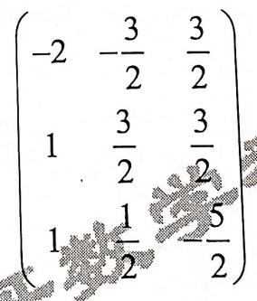
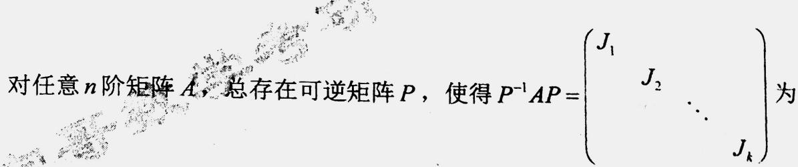
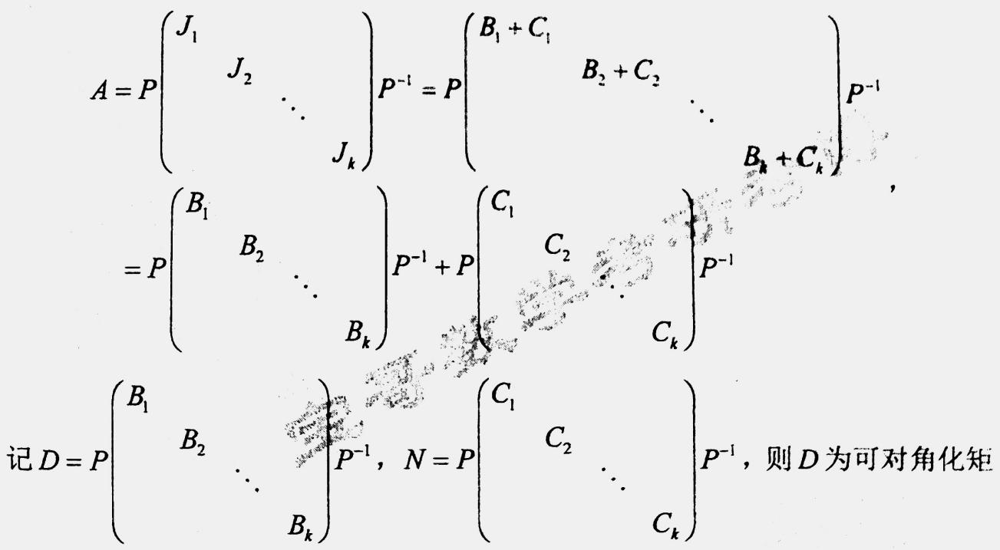
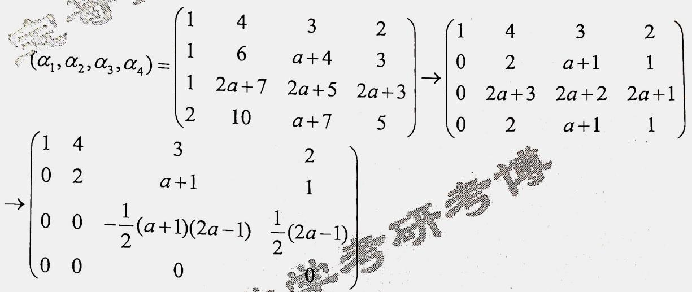
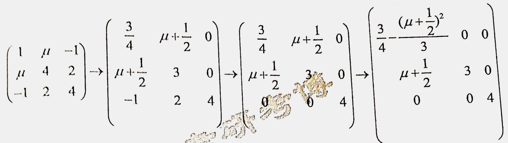
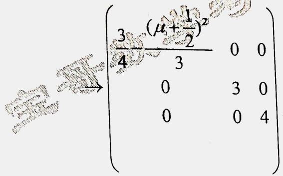
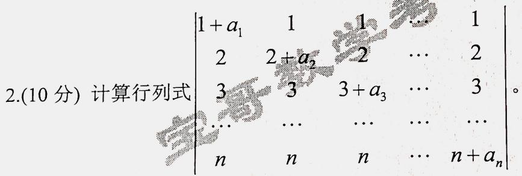
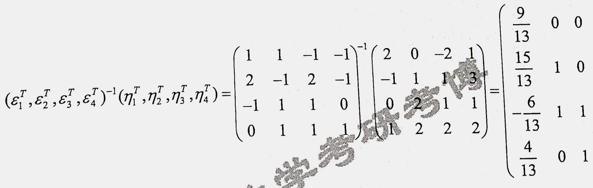
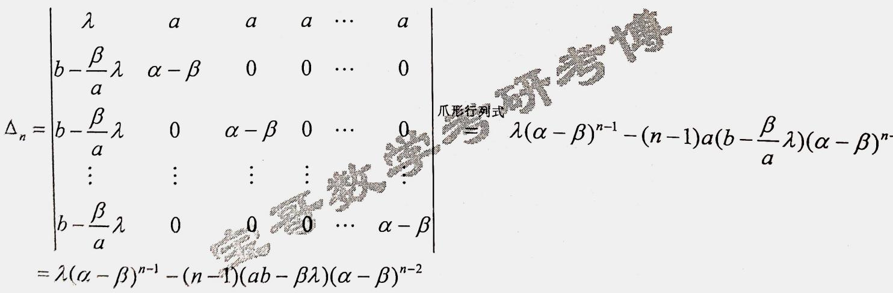
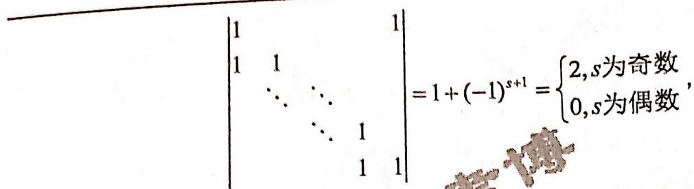

## QUESTION 1

### QUESTION TYPE

short_answer

### QUESTION

求多项式  $A x^{4} + B x^{2} + 1$  有重因式的条件,并确定重数。

### EXPLANATION

令  $f(x) = A x^{4} + B x^{2} + 1$ 。

如果  $A = 0$ ，则  $f(x) = B x^{2} + 1$ ，  $f(x)$  不可能有重因式，故  $A \neq 0$ 。

$$
f'(x) = 4 A x^{3} + 2 B x
$$

$$
f(x) = \frac{1}{4} x f'(x) + \frac{1}{2} B x^{2} + 1,
$$

故  $\gcd(f(x), f'(x)) = \gcd(f'(x), \frac{1}{2} B x^{2} + 1)$ 。  $f(x)$  有重因式当且仅当  $\gcd(f(x), f'(x)) \neq 1$ 。

即  $\gcd(f'(x), \frac{1}{2} B x^{2} + 1) \neq 1$ 。如果  $B = 0$ ，则  $\gcd(f'(x), \frac{1}{2} B x^{2} + 1) = 1$ ，  $f(x)$  没有重因式，故  $B \neq 0$ 。

$$
f'(x) = \frac{8 A x}{B} \left(\frac{1}{2} B x^{2} + 1\right) + \frac{2 (B^{2} - 4 A)}{B} x,
$$

故  $\gcd(f'(x), \frac{1}{2} B x^{2} + 1) = \gcd\left(\frac{1}{2} B x^{2} + 1, \frac{2 (B^{2} - 4 A)}{B} x\right)$ ，  $f(x)$  有重因式当且仅当

$\gcd\left(\frac{1}{2} B x^{2} + 1, \frac{2 (B^{2} - 4 A)}{B} x\right) \neq 1$ ，这等价于  $\frac{2 (B^{2} - 4 A)}{B} = 0$ ，即  $B^{2} = 4 A$ 。

因此,多项式  $A x^{4} + B x^{2} + 1$  有重因式的条件为  $\left\{ \begin{array}{l} B^{2} = 4 A \\ A \neq 0 \end{array} \right.$ 。

当  $B^{2} = 4 A$  且  $A \neq 0$ 时，

$$
A x^{4} + B x^{2} + 1 = \frac{1}{4} B^{2} x^{4} + B x^{2} + 1 = \left(\frac{1}{2} B x^{2} + 1\right)^{2},
$$

重因式为  $\frac{1}{2} B x^{2} + 1$ ，其重数为2。

### ANSWER

$\left\{ \begin{array}{l} B^{2} = 4 A \\ A \neq 0 \end{array} \right.$，此时重因式的重数为2。

## QUESTION 2

### QUESTION TYPE

short_answer

### QUESTION

设矩阵  $A$  满足  $A^{2} + 2 A + 3 E = 0$ ，则对任意实数  $c$ ， $A - c E$  可逆，并求  $(A - c E)^{-1}$ 。

### EXPLANATION

矩阵  $A$  满足  $A^{2} + 2 A + 3 E = 0$ ，故

$$
\left[A + (c + 2) E\right] (A - c E) + (c^{2} + 2 c + 3) E = 0,
$$

即 

$$
\left[A + (c + 2) E\right] (A - c E) = - (c^{2} + 2 c + 3) E.
$$

对任意实数  $c$ ：

$$
c^{2} + 2 c + 3 = (c + 1)^{2} + 2 \geq 2 > 0,
$$

故

$$
\frac{A + (c + 2) E}{c^{2} + 2 c + 3} (A - c E) = E,
$$

故  $A - c E$  可逆，且

$$
(A - c E)^{-1} = - \frac{A + (c + 2) E}{c^{2} + 2 c + 3}.
$$

### ANSWER

对任意实数  $c$ ，  $A - c E$  可逆，且

$$
(A - c E)^{-1} = - \frac{A + (c + 2) E}{c^{2} + 2 c + 3}.
$$

## QUESTION 3

### QUESTION TYPE

proof

### QUESTION

设  $A$  和  $B$  都是  $n$  阶矩阵，且都相似于对角矩阵，证明  $A$  与  $B$  相似的充分必要条件是  $A$  和  $B$  的特征多项式相等，并举例说明当  $A$  与  $B$  均相似于对角矩阵的条件去掉后，充分性一般不成立。

### ANSWER

(1) 必要性：

相似矩阵的特征多项式相等，故若  $A$  与  $B$  相似，则  $A$  和  $B$  的特征多项式相等。

(2) 充分性：

假设  $A$  和  $B$  的特征多项式相等，且  $A$  和  $B$  都相似于对角矩阵，故  $A$  和  $B$  相似。

(3) 举例说明：

当不要求  $A$  和  $B$  都相似于对角矩阵时，充分性不成立。例如,

$$
A = \begin{pmatrix}0 & 0 \\ 0 & 0\end{pmatrix}, \quad B = \begin{pmatrix}0 & 1 \\ 0 & 0\end{pmatrix}
$$

则  $A$  和  $B$  的特征多项式均为  $\lambda^{2}$ ，但  $A$  与  $B$  不相似。

## QUESTION 4

### QUESTION TYPE

short_answer

### QUESTION

已知二次型 

$$
x_{1}^{2} + x_{2}^{2} + x_{3}^{2} + 2 \alpha x_{1} x_{2} + 2 x_{1} x_{3} + 2 \beta x_{2} x_{3}
$$

可用正交变换化为

$$
y_{1}^{2} + 2 y_{2}^{2}
$$

，求  $\alpha, \beta$ 。

### EXPLANATION

该二次型的矩阵为

$$
A = \begin{pmatrix}1 & \alpha & 1 \\ \alpha & 1 & \beta \\ 1 & \beta & 1\end{pmatrix}.
$$

其特征值为  $0, 1, 2$ ，故

$$
|A| = - (\alpha - \beta)^{2}, \quad |A - E| = \begin{vmatrix}0 & \alpha & 1 \\ \alpha & 0 & \beta \\ 1 & \beta & 0\end{vmatrix} = 2 \alpha \beta = 0.
$$

故

$$
\alpha = \beta = 0.
$$

### ANSWER

$\alpha = 0, \quad \beta = 0$。

## QUESTION 5

### QUESTION TYPE

short_answer

### QUESTION

(1) 解方程组

$$
\begin{cases}
2 x_{1} + 3 x_{2} + x_{3} + 2 x_{4} = 0, \\
x_{1} + b x_{2} + x_{3} + x_{4} = 0,
\end{cases}
$$

(2) 求参数  $a,b$ ，并求通解。

### EXPLANATION

方程组(1)的系数矩阵为

$$
\begin{pmatrix}
2 & 3 & 1 & 2 \\
1 & 0 & -1 & a
\end{pmatrix} \rightarrow 
\begin{pmatrix}
1 & 0 & -1 & a \\
0 & 3 & 3 & 2 - 2 a
\end{pmatrix} \rightarrow
\begin{pmatrix}
1 & 0 & -1 & a \\
0 & 1 & 1 & \frac{2 - 2 a}{3}
\end{pmatrix}.
$$

因此，方程组(1)的通解为

$$
x = \begin{pmatrix} x_{3} - a x_{4} \\ -x_{3} + \frac{2 a - 2}{3} x_{4} \\ x_{3} \\ x_{4} \end{pmatrix} = x_{3} \begin{pmatrix}1 \\ -1 \\ 1 \\ 0 \end{pmatrix} + x_{4} \begin{pmatrix} -a \\ \frac{2a - 2}{3} \\ 0 \\ 1 \end{pmatrix}.
$$

方程组(1)与(2)同解，故

$$
\begin{cases}
- a + 3 \times \frac{2 a - 2}{3} + 1 = 0, \\
1 - b + 1 = 0,
\end{cases}
$$

求解得

$$
a = 1, \quad b = 2.
$$

方程组的通解为

$$
x = x_{3} \begin{pmatrix} 1 \\ -1 \\ 1 \\ 0 \end{pmatrix} + x_{4} \begin{pmatrix} -1 \\ 0 \\ 0 \\ 1 \end{pmatrix}.
$$

### ANSWER

$a = 1, b = 2$，通解为

$$
x = x_{3} \begin{pmatrix}1 \\ -1 \\ 1 \\ 0 \end{pmatrix} + x_{4} \begin{pmatrix} -1 \\ 0 \\ 0 \\ 1 \end{pmatrix}.
$$

## QUESTION 6

### QUESTION TYPE

proof

### QUESTION

证明：如果  $V_{1}, V_{2}$  是线性空间  $V$  的两个子空间，那么

$$
\dim(V_{1}) + \dim(V_{2}) = \dim(V_{1} \cap V_{2}) + \dim(V_{1} + V_{2}).
$$

### ANSWER

设

$$
\dim (V_{1} \cap V_{2}) = r, \quad \dim V_{1} = r_{1}, \quad \dim V_{2} = r_{2}.
$$

假设  $\alpha_{1}, \alpha_{2}, \dots, \alpha_{r}$  是  $V_{1} \cap V_{2}$  的一组基，将其分别扩充为  $V_{1}$  的基 $\alpha_{1}, \alpha_{2}, \dots, \alpha_{r}, \beta_{1}, \beta_{2}, \dots, \beta_{r_{1} - r}$ 和  $V_{2}$  的基 $\alpha_{1}, \alpha_{2}, \dots, \alpha_{r}, \gamma_{1}, \gamma_{2}, \dots, \gamma_{r_{2} - r}$。

则

$$
V_{1} + V_{2} = \mathrm{span}\{\alpha_{1}, \alpha_{2}, \dots, \alpha_{r}, \beta_{1}, \beta_{2}, \dots, \beta_{r_{1} - r}, \gamma_{1}, \gamma_{2}, \dots, \gamma_{r_{2} - r}\}.
$$

再证明上述向量组线性无关。假设

$$
k_{1}\alpha_{1} + k_{2}\alpha_{2} + \dots + k_{r}\alpha_{r} + p_{1}\beta_{1} + \dots + p_{r_{1} - r} \beta_{r_{1} - r} + q_{1}\gamma_{1} + \dots + q_{r_{2} - r} \gamma_{r_{2} - r} = 0.
$$

左边的前半部属于  $V_{1}$ ，右边的后半部属于  $V_{2}$  ，从而

$$
q_{1}\gamma_{1} + \dots + q_{r_{2} - r} \gamma_{r_{2} - r} \in V_{1} \cap V_{2},
$$

因此由  $\alpha_{1}, \alpha_{2}, \dots, \alpha_{r}$  线性表示，即

$$
q_{1}\gamma_{1} + \dots + q_{r_{2} - r} \gamma_{r_{2} - r} = - l_{1}\alpha_{1} - \dots - l_{r} \alpha_{r}.
$$

代入后，由向量组线性无关性得所有系数均为零，故

$$
k_{1} = \dots = k_{r} = p_{1} = \dots = p_{r_{1} - r} = q_{1} = \dots = q_{r_{2} - r} = 0.
$$

因此，该组向量线性无关，为  $V_{1} + V_{2}$  的一组基，维数为

$$
\dim(V_{1} + V_{2}) = r + (r_{1} - r) + (r_{2} - r) = r_{1} + r_{2} - r,
$$

即

$$
\dim V_{1} + \dim V_{2} = \dim(V_{1} \cap V_{2}) + \dim(V_{1} + V_{2}).
$$

## QUESTION 7

### QUESTION TYPE

proof

### QUESTION

设  $\alpha_{1}, \alpha_{2}, \dots, \alpha_{m}$ 和  $\beta_{1}, \beta_{2}, \dots, \beta_{m}$  都为  $n$  维向量组，证明向量组

$$
\alpha_{1} + \beta_{1}, \alpha_{2} + \beta_{2}, \dots, \alpha_{m} + \beta_{m}
$$

的秩不超过向量组  $\alpha_{1}, \alpha_{2}, \dots, \alpha_{m}$  和  $\beta_{1}, \beta_{2}, \dots, \beta_{m}$  的秩之和。

### ANSWER

若  $\alpha_{1}, \alpha_{2}, \dots, \alpha_{m}$  或  $\beta_{1}, \beta_{2}, \dots, \beta_{m}$  中有全零向量，则结论显然成立。假设两组向量均非零。

设  $\alpha_{1}, \alpha_{2}, \dots, \alpha_{r}$  为  $\alpha$  组的极大线性无关组， $\beta_{1}, \beta_{2}, \dots, \beta_{s}$  为  $\beta$  组的极大线性无关组。

由于向量组  $\alpha_{1} + \beta_{1}, \alpha_{2} + \beta_{2}, \dots, \alpha_{m} + \beta_{m}$  都能由  $\alpha_{1}, \dots, \alpha_{r}, \beta_{1}, \dots, \beta_{s}$  线性表示，其秩不超过  $r + s$ 。

## QUESTION 8

### QUESTION TYPE

short_answer

### QUESTION

求线性方程组，使它的解是由向量组生成的线性子空间：

$$
\alpha_{1} = \begin{pmatrix}1 \\ -1 \\ 1 \\ 0\end{pmatrix}, \quad \alpha_{2} = \begin{pmatrix}1 \\ 1 \\ 0 \\ 0\end{pmatrix}, \quad \alpha_{3} = \begin{pmatrix}2 \\ 0 \\ 1 \\ 1\end{pmatrix}.
$$

### EXPLANATION

令系数矩阵为

$$
\begin{pmatrix}
1 & 1 & 2 \\
-1 & 1 & 0 \\
1 & 0 & 1 \\
0 & 0 & 1
\end{pmatrix}^T
=
\begin{pmatrix}
1 & -1 & 1 & 0 \\
1 & 1 & 0 & 0 \\
2 & 0 & 1 & 1
\end{pmatrix},
$$

对此矩阵进行初等变换求矩阵的零空间方程，得齐次方程组

$$
\begin{cases}
x_{1} + \frac{1}{2} x_{3} + \frac{1}{2} x_{4} = 0, \\
x_{2} - \frac{1}{2} x_{3} + \frac{1}{2} x_{4} = 0.
\end{cases}
$$

### ANSWER

线性方程组为

$$
\begin{cases}
x_{1} + \frac{1}{2} x_{3} + \frac{1}{2} x_{4} = 0, \\
x_{2} - \frac{1}{2} x_{3} + \frac{1}{2} x_{4} = 0.
\end{cases}
$$

## QUESTION 9

### QUESTION TYPE

short_answer

### QUESTION

求基  $\epsilon_{1}, \epsilon_{2}, \epsilon_{3}, \epsilon_{4}$  到基  $\eta_{1}, \eta_{2}, \eta_{3}, \eta_{4}$  过渡矩阵，并求向量  $\xi = (1,0,0,-1)$  在  $\eta$  基下的坐标，其中：

$$
\begin{cases}
\epsilon_{1} = (1,1,1,1), \quad \epsilon_{2} = (1,1,-1,-1), \\
\epsilon_{3} = (1,-1,1,-1), \quad \epsilon_{4} = (1,-1,-1,1),
\end{cases}
$$

$$
\begin{cases}
\eta_{1} = (1,1,0,1), \quad \eta_{2} = (2,1,3,1), \\
\eta_{3} = (1,1,0,0), \quad \eta_{4} = (0,1,-1,-1).
\end{cases}
$$

### EXPLANATION

基  $\epsilon$  到  $\eta$  的过渡矩阵为

$$
P = (\epsilon_{1}, \epsilon_{2}, \epsilon_{3}, \epsilon_{4})^{-1} (\eta_{1}, \eta_{2}, \eta_{3}, \eta_{4})
$$

计算得

$$
P = \begin{pmatrix}
\frac{1}{2} & 2 & \frac{1}{2} & 0 \\
\frac{1}{2} & -\frac{1}{2} & \frac{1}{2} & \frac{1}{2} \\
-\frac{1}{2} & 1 & 0 & 0 \\
\frac{1}{2} & -\frac{1}{2} & 0 & -\frac{1}{2}
\end{pmatrix}.
$$

向量  $\xi = (1, 0, 0, -1)^T$  在  $\eta$  基下的坐标为

$$
P^{-1} \xi = \begin{pmatrix} -2 \\ -\frac{1}{2} \\ 4 \\ -\frac{3}{2} \end{pmatrix}.
$$

### ANSWER

过渡矩阵为

$$
\begin{pmatrix}
\frac{1}{2} & 2 & \frac{1}{2} & 0 \\
\frac{1}{2} & -\frac{1}{2} & \frac{1}{2} & \frac{1}{2} \\
-\frac{1}{2} & 1 & 0 & 0 \\
\frac{1}{2} & -\frac{1}{2} & 0 & -\frac{1}{2}
\end{pmatrix},
$$

$\xi$ 在 $\eta$ 基下的坐标为

$$
\begin{pmatrix} -2 \\ -\frac{1}{2} \\ 4 \\ -\frac{3}{2} \end{pmatrix}.
$$

## QUESTION 10

### QUESTION TYPE

proof

### QUESTION

设  $n$  阶矩阵  $A$  满足  $f(A) = g(A) = 0$ ，其中多项式

$$
f(x) = x^{4} - x^{3} - 7 x^{2} + 13 x - 6, \quad g(x) = x^{4} + 3 x^{3} - 3 x^{2} - 11 x - 6,
$$

证明  $A$  相似于某对角阵。

### ANSWER

多项式分解：

$$
\begin{aligned}
f(x) &= x^{4} - x^{3} - 7 x^{2} + 13 x - 6 = (x - 1)^2 (x - 2)(x + 3), \\
g(x) &= x^{4} + 3 x^{3} - 3 x^{2} - 11 x - 6 = (x + 1)^2 (x + 3)(x - 2).
\end{aligned}
$$

则

$$
\gcd(f(x), g(x)) = (x - 2)(x + 3).
$$

存在多项式  $u(x), v(x)$  使得

$$
u(x) f(x) + v(x) g(x) = (x - 2)(x + 3).
$$

由题意，

$$
(u(A) f(A)) + (v(A) g(A)) = (A - 2 E)(A + 3 E) = 0.
$$

因此，

$$
(A - 2 E)(A + 3 E) = 0,
$$

$(x - 2)(x + 3)$  是  $A$  的化零多项式，无重根，故  $A$  可对角化。

## QUESTION 11

### QUESTION TYPE

proof

### QUESTION

设  $f(x),g(x)$  是数域  $P$  上两个一元多项式, $m$  为给定的正整数,证明: $f(x)\mid g(x)$  的充分必要条件是  $f^{m}(x)\mid g^{m}(x)$ 。

### ANSWER

若  $f(x) = 0$ ,则  $f^{m}(x)\mid g^{m}(x)$  当且仅当  $g^{m}(x) = 0$ ,当且仅当  $g(x) = 0$ ,当且仅当  $f(x)\mid g(x)$ 。

若  $f(x)\neq 0$ ,令  $\left(f(x),g(x)\right) = d(x)$，且 $f(x) = f_{1}(x)d(x)$，$g(x) = g_{1}(x)d(x)$，则  $\left(f_{1}(x),g_{1}(x)\right) = 1$ ，故  $\left(f_{1}^{m}(x),g_{1}^{m}(x)\right) = 1$ ，故

$$
\left(f^{m}(x),g^{m}(x)\right) = \left(f_{1}^{m}(x)d^{m}(x),g_{1}^{m}(x)d^{m}(x)\right) = d^{m}(x),
$$

式  $f^{m}(x)\mid g^{m}(x)$  的当且仅当  $\left(f^{m}(x),g^{m}(x)\right) \sim f^{m}(x)$  ，即  $d^{m}(x) \sim f^{m}(x)$  ，即  $d(x) \sim f(x)$  ，即  $f(x) \mid g(x)$  。

## QUESTION 12

### QUESTION TYPE

short_answer

### QUESTION

计算下列行列式  
$$
\left| 
\begin{array}{cccccc}
x_{1} + a_{1} & x_{1} & x_{1} & \dots & x_{1} & \dots \\
x_{2} & x_{2} + a_{2} & x_{2} & \dots & x_{2} & \dots \\
x_{3} & x_{3} & x_{3} + a_{3} & \dots & x_{3} & \dots \\
\dots & \dots & \dots & \dots & \dots & \dots \\
x_{n} & x_{n} & x_{n} & \dots & x_{n} + a_{n} & \dots \\
\dots & \dots & \dots & \dots & \dots & \dots
\end{array} 
\right|
\quad (a_{1}a_{2}\dots a_{n} \neq 0)
$$

### EXPLANATION

$a_{1}a_{2}\dots a_{n}\neq 0$，故

$$
\begin{array}{rl}
& \left|\begin{array}{ccccc}
x_{1}+a_{1} & x_{1} & x_{1} & \cdots & x_{1} \\
x_{2} & x_{2}+a_{2} & x_{2} & \cdots & x_{2} \\
x_{3} & x_{3} & x_{3}+a_{3} & \cdots & x_{3} \\
\cdots & \cdots & \cdots & \cdots & \cdots \\
x_{n} & x_{n} & x_{n} & \cdots & x_{n}+a_{n}
\end{array}\right| \\
= & \left|\begin{array}{ccccc}
x_{1}+a_{1} & -a_{1} & -a_{1} & \cdots & -a_{1} \\
x_{2} & a_{2} & 0 & \cdots & 0 \\
x_{3} & 0 & a_{3} & \cdots & 0 \\
\cdots & \cdots & \cdots & \cdots & \cdots \\
x_{n} & 0 & 0 & \cdots & a_{n}
\end{array}\right| \\
= & \left|\begin{array}{ccccc}
x_{1}+a_{1} + \frac{a_{1}x_{2}}{a_{2}} + \frac{a_{1}x_{3}}{a_{3}} + \cdots + \frac{a_{1}x_{n}}{a_{n}} & -a_{1} & -a_{1} & \cdots & -a_{1} \\
0 & a_{2} & 0 & \cdots & 0 \\
0 & 0 & a_{3} & \cdots & 0 \\
\cdots & \cdots & \cdots & \cdots & \cdots \\
0 & 0 & 0 & \cdots & a_{n}
\end{array}\right|
\end{array}
$$

$$
= \left(x_{1} + a_{1} + \frac{a_{1}x_{2}}{a_{2}} + \frac{a_{1}x_{3}}{a_{3}} + \dots + \frac{a_{1}x_{n}}{a_{n}}\right) a_{2} a_{3} \dots a_{n}
$$

$$
= a_{1} a_{2} a_{3} \dots a_{n} + \sum_{j=1}^{n} a_{1} \dots a_{j-1} x_{j} a_{j+1} \dots a_{n}
$$

### ANSWER

$$
a_{1} a_{2} a_{3} \dots a_{n} + \sum_{j=1}^{n} a_{1} \dots a_{j-1} x_{j} a_{j+1} \dots a_{n}
$$

## QUESTION 13

### QUESTION TYPE

short_answer

### QUESTION

讨论  $a,b$  为何值时,下列线性方程组有唯一解?无穷多解?无解?

当有无穷多解时,求出该方程组的通解,其中方程组为:  
$$
\left\{
\begin{array}{l}
a x_{1} + 3x_{2} + 3x_{3} = 3 \\
x_{1} + 4x_{2} + x_{3} = 1 \\
2x_{1} + 3x_{2} + b x_{3} = 2
\end{array}
\right.
$$

### EXPLANATION

方程组的增广矩阵为

$$
G=\left(\begin{array}{c c c c}
a & 3 & 3 & 3 \\
1 & 4 & 1 & 1 \\
2 & 3 & b & 2
\end{array}\right)
\to
\left(\begin{array}{c c c c}
1 & 4 & 1 & 1 \\
0 & 3-4a & 3 - a & 3 - a \\
0 & -5 & b - 2 & 0
\end{array}\right)
\to
\left(\begin{array}{c c c c}
1 & 0 & \frac{4b - 3}{5} & 1 \\
0 & 1 & \frac{2 - b}{5} & 0 \\
0 & 0 & 3 - a - (3 - 4a)\frac{2 - b}{5} & 3 - a
\end{array}\right)
$$

如果  
$$
3 - a - (3 - 4a)\frac{2 - b}{5} \neq 0,
$$
则方程组有唯一解。

如果  
$$
\left\{
\begin{array}{l}
3 - a - (3 - 4a)\frac{2 - b}{5} = 0 \\
3 - a \neq 0
\end{array}
\right.,
$$
则方程组无解。

如果  
$$
\left\{
\begin{array}{l}
3 - a - (3 - 4a)\frac{2 - b}{5} = 0 \\
3 - a = 0
\end{array}
\right.,
$$
即  
$$
a = 3, \quad b = 2,
$$
则方程组有无穷多解, 此时

$$
G \to
\left(
\begin{array}{c c c c}
1 & 0 & 1 & 1 \\
0 & 1 & 0 & 0 \\
0 & 0 & 0 & 0
\end{array}
\right),
$$

方程组的通解为

$$
x = \left(
\begin{array}{c}
1 - x_{3} \\
0 \\
x_{3}
\end{array}
\right)
= \left(
\begin{array}{c}
1 \\
0 \\
0
\end{array}
\right) + x_{3}
\left(
\begin{array}{c}
-1 \\
0 \\
1
\end{array}
\right).
$$

### ANSWER

唯一解的条件是  
$$
3 - a - (3 - 4a)\frac{2 - b}{5} \neq 0.
$$

无解的条件是  
$$
\left\{
\begin{array}{l}
3 - a - (3 - 4a)\frac{2 - b}{5} = 0 \\
3 - a \neq 0
\end{array}
\right.
$$

无穷多解的条件是  
$$
a = 3, \quad b = 2,
$$
此时通解为  
$$
x = \left(
\begin{array}{c}
1 \\
0 \\
0
\end{array}
\right) + x_{3}
\left(
\begin{array}{c}
-1 \\
0 \\
1
\end{array}
\right).
$$

## QUESTION 14

### QUESTION TYPE

proof

### QUESTION

设  $A = \left( \begin{array}{cccc}a_{11} & a_{12} & \dots & a_{1n} \\ a_{21} & a_{22} & \dots & a_{2n} \\ \dots & \dots & \dots & \dots \\ a_{m1} & a_{m2} & \dots & a_{mn} \end{array} \right)$  为  $m \times n$  的实数矩阵

(1) 证明:秩  $(A A^{T}) =$  秩  $(A^{T}A) =$  秩  $(A)$；

(2) 证明:矩阵  $A^{T}A$  正定的充要条件是秩  $(A) = n$。

### ANSWER

1. 若  $Ax = 0$  ,则  $A^{T}Ax = 0$ ；若  $A^{T}Ax = 0$  ,则  
$$x^{T}A^{T}Ax = (Ax)^{T}(Ax) = 0,$$  
即  $Ax = 0$  。这里,  $x\in \mathbb{R}^{n}$  ,故方程组  $Ax = 0$  与  $A^{T}Ax = 0$  同解。故  
$$n - r(A) = n - r(A^{T}A)$$  
即  
$$r(A^{T}A) = r(A).$$  
结论证明完毕。

用  $A^{T}$  替代  $A$  ,并注意  $r(A) = r(A^{T})$  ,就有  
$$r(A) = r(AA^{T}).$$  

2. 由于  
$$(A^{T}A)^{T} = A^{T}A,$$  
故  $A^{T}A$  为  $n$  阶实对称矩阵。对任意  $n$ 维实列向量  $x$  ,有  
$$x^{T}A^{T}A x = (A x)^{T}(A x) \geq 0,$$  
由  $x$  的任意性,矩阵  $A^{T}A$  半正定。故  $A^{T}A$  正定的充要条件是  $A^{T}A$  可逆，即  
$$r(A^{T}A) = n,$$  
即  
$$r(A) = n.$$

(1) 秩  $(A A^{T}) =$  秩  $(A^{T}A) =$  秩  $(A)$；  

(2) 矩阵  $A^{T}A$  正定的充要条件是秩  $(A) = n$。

## QUESTION 15

### QUESTION TYPE

proof

### QUESTION

证明:向量组的任何一个线性无关组都可以扩充成一个极大线性无关组。

### ANSWER

假设  $\alpha_{1},\alpha_{2},\dots ,\alpha_{n}$  为一组向量,其秩为  $r$  ,  $\alpha_{1},\dots ,\alpha_{s}$  为其一个无关组。

若  $s = r$  ,则  $\alpha_{1},\dots ,\alpha_{s}$  为一个极大线性无关组。

若  $s< r$  ,则  $\alpha_{s + 1},\dots ,\alpha_{n}$  至少有一个向量不能由  $\alpha_{1},\dots ,\alpha_{s}$  线性表示,不妨记为  $\alpha_{s + 1}$  ,则  $\alpha_{1},\dots ,\alpha_{s + 1}$  线性无关。

若  $s + 1 = r$  ,则  $\alpha_{1},\dots ,\alpha_{s + 1}$  为一个极大线性无关组。

若  $s + 1< r$  ,则  $\alpha_{s + 2},\dots ,\alpha_{n}$  至少有一个向量不能由  $\alpha_{1},\dots ,\alpha_{s + 1}$  线性表示,不妨记为  $\alpha_{s + 2}$  ,则  $\alpha_{1},\dots ,\alpha_{s + 2}$  线性无关。

反复继续这样的过程  $r - s$  次,就可以将  $\alpha_{1},\dots ,\alpha_{s}$  扩充为一个极大线性无关组。

## QUESTION 16

### QUESTION TYPE

short_answer

### QUESTION

设  $\alpha_{1} = (1, -1, 2, 4), \alpha_{2} = (0,3,1,2), \alpha_{3} = (3,0,7,14), \alpha_{4} = (1, -1, 2,0), \alpha_{5} = (2,1,5,6)$ ，把  $\alpha_{1},\alpha_{2}$  扩充成一个极大无关组,并把其余向量用此极大无关组线性表示。

### EXPLANATION

$$
(\alpha_{1}^{T},\alpha_{2}^{T},\alpha_{3}^{T},\alpha_{4}^{T},\alpha_{5}^{T})=\left(\begin{array}{c c c c c}
1 & 0 & 3 & 1 & 2 \\
-1 & 3 & 0 & -1 & 1 \\
2 & 1 & 7 & 2 & 5 \\
4 & 2 & 14 & 0 & 6
\end{array}\right)
\rightarrow
\left(\begin{array}{c c c c c}
1 & 0 & 3 & 1 & 2 \\
0 & 3 & 3 & 0 & 3 \\
0 & 1 & 1 & 0 & 1 \\
0 & 2 & 2 & -4 & -2
\end{array}\right)
$$

故  $\alpha_{1}, \alpha_{2}, \alpha_{4}$  为一个极大线性无关组,  

$\alpha_{3} = 3 \alpha_{1} + \alpha_{2}$,  

$\alpha_{5} = \alpha_{1} + \alpha_{2} + \alpha_{4}$ 。

### ANSWER

$\alpha_{1}, \alpha_{2}, \alpha_{4}$  是极大无关组，且  

$\alpha_{3} = 3 \alpha_{1} + \alpha_{2}$,  

$\alpha_{5} = \alpha_{1} + \alpha_{2} + \alpha_{4}$ 。

## QUESTION 17

### QUESTION TYPE

short_answer

### QUESTION

在  $P^{3}$  中,求由基  $\epsilon_{1}, \epsilon_{2}, \epsilon_{3}$  到基  $\eta_{1}, \eta_{2}, \eta_{3}$  的过渡矩阵,并求向量  $\alpha = (1,0,0)$ 在基  $\epsilon_{1}, \epsilon_{2}, \epsilon_{3}$  下的坐标,其中  
$$
\left\{ \begin{array}{l}
\epsilon_{1} = (- 1,1,1)\\ 
\epsilon_{2} = (2,1,1)\\ 
\epsilon_{3} = (- 1,0,1) 
\end{array} \right., \quad
\left\{ \begin{array}{l}
\eta_{1} = (1,2, - 1)\\ 
\eta_{2} = (2,2, - 1)\\ 
\eta_{3} = (2, - 1, - 1)
\end{array} \right.
$$

### EXPLANATION

由基  $\epsilon_{1}, \epsilon_{2}, \epsilon_{3}$  到基  $\eta_{1}, \eta_{2}, \eta_{3}$  的过渡矩阵为

$$
(\epsilon_{1}^{T},\epsilon_{2}^{T},\epsilon_{3}^{T})^{-1}(\eta_{1}^{T},\eta_{2}^{T},\eta_{3}^{T}) = \left( \begin{array}{ccc}
-1 & 2 & -1\\ 
1 & 1 & 0\\ 
1 & 1 & 1 
\end{array} \right)^{-1}
\left( \begin{array}{ccc}
1 & 2 & 2\\ 
2 & 2 & -1\\ 
-1 & -1 & -1 
\end{array} \right)
= \left( \begin{array}{ccc}
2 & \frac{5}{3} & -\frac{4}{3}\\ 
0 & \frac{1}{3} & \frac{1}{3}\\ 
-3 & -3 & 0 
\end{array} \right)
$$

向量  $\alpha = (1,0,0)$  在基  $\epsilon_{1}, \epsilon_{2}, \epsilon_{3}$  下的坐标为

$$
(\epsilon_{1}^{T},\epsilon_{2}^{T},\epsilon_{3}^{T})^{-1} \alpha^{T} = \left( \begin{array}{ccc}
-1 & 2 & -1\\ 
1 & 1 & 0\\ 
1 & 1 & 1 
\end{array} \right)^{-1} \left( \begin{array}{c}
1 \\ 0 \\ 0
\end{array} \right) = \left( \begin{array}{c}
1 \\ 1 \\ 0
\end{array} \right)
$$

### ANSWER

过渡矩阵为  
$$
\left( \begin{array}{ccc}
2 & \frac{5}{3} & -\frac{4}{3}\\ 
0 & \frac{1}{3} & \frac{1}{3}\\ 
-3 & -3 & 0 
\end{array} \right)
$$

向量  $\alpha = (1,0,0)$  在基  $\epsilon_{1}, \epsilon_{2}, \epsilon_{3}$  下的坐标为  
$$
(1,1,0)
$$

## QUESTION 18

### QUESTION TYPE

proof

### QUESTION

设  $f_{1}(x), f_{2}(x), f(x) = f_{1}(x) f_{2}(x)$  为数域  $P$  上一元多项式,  $A$  为  $n$  阶方阵,  $W, W_{1}, W_{2}$  分别表示齐次线性方程组  $f(A) X = 0, f_{1}(A) X = 0, f_{2}(A) X = 0$  的解空间。

(1) 证明:  $W_{1}, W_{2}$  都是  $W$  的子空间;

(2) 证明:如果  $\left(f_{1}(x), f_{2}(x)\right) = 1$ ,那么  $W = W_{1} \oplus W_{2}$ 。

### ANSWER

1. 任取  $X \in W_{1}$ ,则  $f_{1}(A)X = 0$ ,故  
$$
f(A)X = f_{1}(A)f_{2}(A)X = f_{2}(A)f_{1}(A)X = 0,
$$  
故  $X \in W$ 。

同理，任取  $X \in W_{2}$ ,则  
$$
f_{2}(A)X = 0, \quad f(A)X = f_{1}(A)f_{2}(A)X = 0,
$$  
故  $X \in W$ 。

因此,  $W_{1}, W_{2}$  都是  $W$  的子空间。

2. 由于  $\left(f_{1}(x), f_{2}(x)\right) = 1$ ,故存在多项式  $u(x), \nu (x)$ ,使得  
$$
u(x)f_{1}(x) + \nu (x)f_{2}(x) = 1,
$$  
故  
$$
u(A)f_{1}(A) + \nu (A)f_{2}(A) = E.
$$  
任取  $\alpha \in W$ ,有  
$$
\alpha = u(A)f_{1}(A)\alpha + \nu (A)f_{2}(A)\alpha = 0,
$$  
其中,  
$$
f_{2}(A)u(A)f_{1}(A)\alpha = u(A)f_{1}(A)f_{2}(A)\alpha = 0,
$$  
$$
f_{1}(A)\nu (A)f_{2}(A)\alpha = \nu (A)f_{1}(A)f_{2}(A)\alpha = 0,
$$  
即  
$$
u(A)f_{1}(A)\alpha \in W_{2}, \quad \nu (A)f_{2}(A)\alpha \in W_{1}.
$$  
由  $\alpha$  的任意性, 得  
$$
W = W_{1} + W_{2}.
$$  
又任取  $\alpha \in W_{1} \cap W_{2}$ ,有  
$$
f_{1}(A)\alpha = 0, \quad f_{2}(A)\alpha = 0,
$$  
故  
$$
\alpha = u(A)f_{1}(A)\alpha + \nu (A)f_{2}(A)\alpha = 0,
$$  
由  $\alpha$  的任意性, 得  
$$
W_{1} \cap W_{2} = \{0\}.
$$  
故  
$$
W = W_{1} \oplus W_{2}.
$$

(1) $W_{1}, W_{2}$  都是  $W$  的子空间；

(2) 若  $\left(f_{1}(x), f_{2}(x)\right) = 1$ , 则  
$$
W = W_{1} \oplus W_{2}.
$$

## QUESTION 19

### QUESTION TYPE

short_answer

### QUESTION

设矩阵  
$$
A = \begin{pmatrix}
1 & - 2 & 2 \\
- 2 & - 2 & 4 \\
2 & 4 & - 2
\end{pmatrix},
$$  
求正交矩阵  $P$ ,使得  $P^{-1} A P$  为对角矩阵, 并写出对角矩阵。

### EXPLANATION

先将 $A$ 分解为  
$$
A = 2E + \begin{pmatrix}
-1 & -2 & 2 \\
-2 & -4 & 4 \\
2 & 4 & -4
\end{pmatrix} = 2E - \begin{pmatrix}1 \\ 2 \\ -2 \end{pmatrix} (1, 2, -2).
$$

由秩1矩阵的理论，$A$ 的特征值为  
$$
2, 2, 2 - (1, 2, -2) \begin{pmatrix}1 \\ 2 \\ -2\end{pmatrix} = -7.
$$

特征值 $2$ 对应的特征向量是方程  
$$
(1, 2, -2) x = 0
$$  
的非零解，求得两个正交解为  
$$
(0, 1, 1)^{T}, \quad (4, -1, 1)^{T}.
$$

特征值 $-7$ 对应的特征向量是  
$$
(1, 2, -2)^{T}.
$$

令  
$$
P = \begin{pmatrix}
\frac{1}{3} & 0 & \frac{4}{3\sqrt{2}} \\
\frac{2}{3} & \frac{1}{\sqrt{2}} & - \frac{1}{3\sqrt{2}} \\
- \frac{2}{3} & \frac{1}{\sqrt{2}} & \frac{1}{3\sqrt{2}}
\end{pmatrix}.
$$

则 $P$ 为正交矩阵, 且  
$$
P^{-1} A P = \begin{pmatrix}
2 & 0 & 0 \\
0 & 2 & 0 \\
0 & 0 & -7
\end{pmatrix}
$$  
为对角矩阵。

### ANSWER

正交矩阵  
$$
P = \begin{pmatrix}
\frac{1}{3} & 0 & \frac{4}{3\sqrt{2}} \\
\frac{2}{3} & \frac{1}{\sqrt{2}} & - \frac{1}{3\sqrt{2}} \\
- \frac{2}{3} & \frac{1}{\sqrt{2}} & \frac{1}{3\sqrt{2}}
\end{pmatrix},
$$  
对角矩阵为  
$$
\begin{pmatrix}
2 & 0 & 0 \\
0 & 2 & 0 \\
0 & 0 & -7
\end{pmatrix}.
$$

## QUESTION 20

### QUESTION TYPE

proof

### QUESTION

证明:欧氏空间  $R^{n}$  的任一子空间  $U$  是一个齐次线性方程组的解空间。

### ANSWER

设  $r = \dim U$ 。

若  $r = 0$ ，则  $U = \{0\}$ ，取线性方程组为  $Ax = 0$ ，其中  $A$  为  $n$  阶可逆矩阵。

若  $r = n$ ，则  $U = R^{n}$ ，取线性方程组为  $Ax = 0$ ，其中  $A$  为  $m \times n$  阶零矩阵。

若  $0< r< n$ ，设  $\alpha_{1},\alpha_{2},\dots ,\alpha_{r}$  为其一组基,则  
$r\left( \begin{array}{c}{\alpha_{1}^{T}}\\ {\alpha_{2}^{T}}\\ \vdots \\ {\alpha_{r}^{T}} \end{array} \right) = r$，  
$\left( \begin{array}{c}{\alpha_{1}^{T}}\\ {\alpha_{2}^{T}}\\ \vdots \\ {\alpha_{r}^{T}} \end{array} \right)x = 0$ 有 $n - r$ 个线性无关的解，设  $\eta_{1},\eta_{2},\dots ,\eta_{n - r}$ 为其一个基础解系,则  
$\left( \begin{array}{c}{\alpha_{1}^{T}}\\ {\alpha_{2}^{T}}\\ \vdots \\ {\alpha_{r}^{T}} \end{array} \right)\left(\eta_{1},\eta_{2},\dots ,\eta_{n - r}\right) = 0$，  
即  
$\left( \begin{array}{c}{\eta_{1}^{T}}\\ {\eta_{2}^{T}}\\ \vdots \\ {\eta_{n - r}^{T}} \end{array} \right)x = 0$ 的 $r$ 个线性无关的解。

而  
$r\left( \begin{array}{c}\eta_{1}^{T} \\ \eta_{2}^{T} \\ \vdots \\ \eta_{n - r}^{T} \end{array} \right) = n - r$，  
故  
$\left( \begin{array}{c}\eta_{1}^{T} \\ \eta_{2}^{T} \\ \vdots \\ \eta_{n - r}^{T} \end{array} \right)x = 0$ 有 $n - (n - r) = r$ 个线性无关的解，  
故  $\alpha_{1}, \alpha_{2}, \dots , \alpha_{r}$  为方程组  
$\left( \begin{array}{c}\eta_{1}^{T} \\ \eta_{2}^{T} \\ \vdots \\ \eta_{n - r}^{T} \end{array} \right)x = 0$ 的一个基础解系，  
故  $U$  为  
$\left( \begin{array}{c}\eta_{1}^{T} \\ \eta_{2}^{T} \\ \vdots \\ \eta_{n - r}^{T} \end{array} \right)x = 0$ 的解空间。

## QUESTION 21

### QUESTION TYPE

proof

### QUESTION

写出判别多项式  $f(x)$  在有理数域上不可约的艾森斯坦判别法，并给出证明；

求多项式  $f(x) = x^{5} - 1$  在有理数域上的因式分解，要求给出证明。

### ANSWER

1. 设  $f(x) = a_{n}x^{n} + a_{n - 1}x^{n - 1} + \dots + a_{1}x + a_{0}$  是一个整系数多项式。如果存在一个素数  $p$ ，使得：

(1)  $p$  不整除  $a_{n}$ ；

(2)  $p$  整除  $a_{n - 1},\dots, a_{1}, a_{0}$ ；

(3)  $p^{2}$  不整除  $a_{0}$ 。

若  $f(x)$  在有理数域上可约，则  $f(x)$  可分解为两个次数较低的整系数多项式的乘积：

$$
f(x) = (b_{l}x^{l} + b_{l - 1}x^{l-1} + \dots + b_{1}x + b_{0})(c_{m}x^{m} + c_{m - 1}x^{m -1} + \dots + c_{1}x + c_{0}),
$$

其中  $b_i, c_j \in \mathbb{Z}, i=0,1,2,\dots,l, j=0,1,2,\dots,m$ ，且  $b_l, c_m \neq 0, l,m < n, l + m = n$ 。

则有：

$$
a_n = b_l c_m, \quad a_0 = b_0 c_0,
$$

素数  $p \mid a_0 = b_0 c_0$ ，故  $p \mid b_0$  或  $p \mid c_0$ 。

但  $p^{2} \nmid a_0$ ，因此，  $p \mid b_0$  和  $p \mid c_0$  有且只有一个成立。

不妨假设  $p \mid b_0$ ，则  $p \nmid c_0$ 。

另一方面，  $p \nmid a_n = b_l c_m$ ，故  $p \nmid b_l$  且  $p \nmid c_m$ 。

假设  $b_0, b_1, \dots, b_l$  中第一个不能被  $p$  整除的数为  $b_k$ ，则  $p \mid b_0, \dots, b_{k-1}$，

比较  $x^{k}$  两端的系数，有

$$
a_k = b_0 c_k + b_1 c_{k-1} + \dots + b_{k-1} c_1 + b_k c_0.
$$

根据规定，  $p \mid b_0 c_k, \dots, p \mid b_{k-1} c_1$ ，又  $p \mid a_k$ ，故  $p \mid b_k c_0$ 。

但因为  $p \nmid b_k$ ，则  $p \mid c_0$ 。

这与  $p \nmid c_0$  矛盾。

因此，  $f(x)$  在有理数域上不可约。证毕！

2. 多项式的因式分解：

$$
x^5 - 1 = (x - 1)(x^4 + x^3 + x^2 + x + 1).
$$

我们指出：设  $p$  是素数，则

$$
x^{p-1} + x^{p-2} + \dots + x + 1
$$

在有理数域上不可约。

证明：

$$
x^{p - 1} + x^{p - 2} + \dots + x + 1 = \frac{x^p - 1}{x - 1} = \frac{(y + 1)^p - 1}{y} = \frac{y^p + \sum_{j=1}^{p-1} C_p^j y^j}{y} = y^{p - 1} + \sum_{j=1}^{p-1} C_p^j y^{j - 1},
$$

其中  $y = x - 1$ 。

由于  $p$  为素数，故  $p \mid C_p^j$  对所有  $j = 1, 2, \dots, p-1$ 成立，且  $p^2 \nmid C_p^1$ 。

根据艾森斯坦判别法，$y^{p-1} + \sum_{j=1}^{p-1} C_p^j y^{j-1}$  在有理数域上不可约。

5 是素数，故  $x^{4} + x^{3} + x^{2} + x + 1$  在有理数域上不可约。

因此，

$$
x^{5} - 1 = (x - 1)(x^{4} + x^{3} + x^{2} + x + 1)
$$

是  $x^{5} - 1$  在有理数域上的因式分解。

(1) 艾森斯坦判别法描述及证明如上，得出结论：若满足条件，则多项式在有理数域上不可约。

(2)  $x^{5} - 1$  在有理数域上的因式分解为：

$$
(x - 1)(x^{4} + x^{3} + x^{2} + x + 1),
$$

其中  $x^{4} + x^{3} + x^{2} + x + 1$  在有理数域上不可约。

## QUESTION 22

### QUESTION TYPE

bybrid

### QUESTION

设  $n$  元线性方程组  $AX = B$  ,  $A^{T}$  表示矩阵  $A$  的转置,其中

$$
A = \left( \begin{array}{llll}2a & 1 & \dots & \dots \\ a^{2} & 2a & \dots & \dots \\ \dots & \dots & \dots & 1 \\ \dots & \dots & a^{2} & 2a \end{array} \right), \quad X = (x_{1},x_{2},\dots ,x_{n})^{T}, \quad B = (1,0,\dots ,0)^{T},
$$

(1) 证明:  $\left|A\right| = (n + 1)a^{n}$

(2) 当  $a$  为何值时,方程组有唯一解,并求  $x_{1}$

(3) 当  $a$  为何值时,方程组有无穷多解,并求通解。

### EXPLANATION

1. 这是特殊类型的三对角行列式,特值方程  $2a^{2} = 2a^{n} - a^{2}$  的两根都是  $a$$

故  $\left|A\right| = (n + 1)a^{n}$

2. 当  $a\neq 0$  时,  $\left|A\right|\neq 0$  ,方程组有唯一解,由克莱姆法则,

\[
x_{1}=\frac{\left|\begin{array}{l l l l l l}{1}&{1}&{0}&{\cdots}&{0}&{0}\\ {0}&{2a}&{1}&{\cdots}&{0}&{0}\\ {0}&{a^{2}}&{2a}&{\cdots}&{0}&{0}\\ {\cdots}&{\cdots}&{\cdots}&{\cdots}&{\cdots}&{\cdots}\\ {0}&{0}&{0}&{\cdots}&{2a}&{1}\\ {0}&{0}&{0}&{\cdots}&{a^{2}}&{2a}\end{array}\right|}{\left|\begin{array}{l}{a}\\ {a}\\ {a}\\ {a}\\ {a}\end{array}\right|}=\frac{n a^{n- 1}}{(n+1)a^{n}}=\frac{n}{(n+1)a}
\]

其有无穷多解，通解为  $x = \left( \begin{array}{l}{k}\\ {1}\\ {0}\\ {0}\\ {\vdots}\\ {0} \end{array} \right)$

### ANSWER

(1) $\left|A\right| = (n + 1)a^{n}$

(2) 当  $a \neq 0$  时,方程组有唯一解，且  $x_1 = \dfrac{n}{(n+1)a}$

(3) 当  $a = 0$  时,方程组有无穷多解，通解为  
\[
x = \begin{pmatrix} k \\ 1 \\ 0 \\ 0 \\ \vdots \\ 0 \end{pmatrix}
\]

## QUESTION 23

### QUESTION TYPE

proof

### QUESTION

设  $\alpha_{1},\alpha_{2},\dots ,\alpha_{s}$  是线性空间  $V$  中的向量组，证明：生成子空间  $L(\alpha_{1},\alpha_{2},\dots ,\alpha_{s})$  的维数等于向量组  $\alpha_{1},\alpha_{2},\dots ,\alpha_{s}$  的秩；

### ANSWER

记  $r$  为  $\alpha_{1},\alpha_{2},\dots ,\alpha_{s}$  的秩，  $W = L(\alpha_{1},\alpha_{2},\dots ,\alpha_{s})$  。如果  $r = 0$  ，则  $\alpha_{1} = \alpha_{2} = \dots = \alpha_{s} = 0$  ，故  $W = \{0\}$  ，  $\dim W = 0 = r$  。

现在假设  $r > 0$  。

不妨设  $\alpha_{1},\alpha_{2},\dots ,\alpha_{r}$  为  $\alpha_{1},\alpha_{2},\dots ,\alpha_{s}$  的一个极大线性无关组，则  $\alpha_{1},\alpha_{2},\dots ,\alpha_{s}$  与 $\alpha_{1},\alpha_{2},\dots ,\alpha_{r}$  等价，故  $W = L(\alpha_{1},\alpha_{2},\dots ,\alpha_{r})$  。

$\alpha_{1},\alpha_{2},\dots ,\alpha_{r}\in W$  ，线性无关，且  $W$  中任意元素均可由其线性表示，故其为W的一组基，W的维数为r。

综上所述,生成子空间  $L(\alpha_{1},\alpha_{2},\dots ,\alpha_{s})$  的维数等于向量组  $\alpha_{1},\alpha_{2},\dots ,\alpha_{s}$  的秩。

## QUESTION 24

### QUESTION TYPE

short_answer

### QUESTION

设V中向量组  $\alpha_{1},\alpha_{2},\alpha_{3},\alpha_{4}$  线性无关，求子空间

$$
W = L(\alpha_{1} + \alpha_{2},\alpha_{2} + \alpha_{3},\alpha_{3} + \alpha_{4},\alpha_{4} + \alpha_{1})
$$

的维数和一组基

### EXPLANATION

将列向量组写成矩阵形式：

$$
(\alpha_{1} + \alpha_{2},\alpha_{2} + \alpha_{3},\alpha_{3} + \alpha_{4},\alpha_{4} + \alpha_{1}) = (\alpha_{1},\alpha_{2},\alpha_{3},\alpha_{4})
\cdot
\left(
\begin{array}{cccc}
1 & 0 & 0 & 1 \\
1 & 1 & 0 & 0 \\
0 & 1 & 1 & 0 \\
0 & 0 & 1 & 1
\end{array}
\right)
$$

对矩阵进行初等变换：

$$
\begin{aligned}
\left(
\begin{array}{cccc}
1 & 0 & 0 & 1 \\
1 & 1 & 0 & 0 \\
0 & 1 & 1 & 0 \\
0 & 0 & 1 & 1
\end{array}
\right)
&\to
\left(
\begin{array}{cccc}
1 & 0 & 0 & 1 \\
0 & 1 & 0 & -1 \\
0 & 1 & 1 & 0 \\
0 & 0 & 1 & 1
\end{array}
\right)
\to
\left(
\begin{array}{cccc}
1 & 0 & 0 & 1 \\
0 & 1 & 0 & -1 \\
0 & 0 & 1 & 1 \\
0 & 0 & 1 & 1
\end{array}
\right)
\to
\left(
\begin{array}{cccc}
1 & 0 & 0 & 1 \\
0 & 1 & 0 & -1 \\
0 & 0 & 1 & 1 \\
0 & 0 & 0 & 0
\end{array}
\right)
\end{aligned}
$$

由此可见，矩阵的前三列为极大线性无关组。

由于  $\alpha_{1},\alpha_{2},\alpha_{3},\alpha_{4}$  线性无关，故

$\alpha_{1} + \alpha_{2},\alpha_{2} + \alpha_{3},\alpha_{3} + \alpha_{4}$  为极大线性无关组，即为 $W$ 的一组基，$W$ 的维数为3。

### ANSWER

$W$ 的维数为 3，且基为 $\{\alpha_{1} + \alpha_{2}, \alpha_{2} + \alpha_{3}, \alpha_{3} + \alpha_{4}\}$。

## QUESTION 25

### QUESTION TYPE

bybrid

### QUESTION

设实二次型  
$$
f(x_{1},x_{2},x_{3}) = 2x_{1}^{2} + 2x_{2}^{2} - x_{3}^{2} - 8x_{1}x_{2} - 4x_{1}x_{3} + 4x_{2}x_{3}
$$

(1) 用正交变换将此二次型化为标准形, 并写出所做的变换;

(2) 写出二次型的规范形;

(3) 判断此二次型是否为正定二次型？要求说明理由。

### EXPLANATION

1. 二次型  $f$  的矩阵为  
$$
A=\left(\begin{array}{c c c}2 & -4 & -2 \\ -4 & 2 & 2 \\ -2 & 2 & -1\end{array}\right) = -2E + \left(\begin{array}{c c c}4 & -4 & -2 \\ -4 & 4 & 2 \\ -2 & 2 & 1\end{array}\right) = -2E + \left(\begin{array}{c}2 \\ -2 \\ -1\end{array}\right)(2, -2, -1),
$$

其特征值为  $-2, -2, -2 + (2, -2, -1) \left(\begin{array}{c}2 \\ -2 \\ -1\end{array}\right) = 7$。  
特征值  $-2$  对应的特征向量即方程  
$(2, -2, -1)x = 0$  的非零解，求之，可得两个正交的解  $(1,1,0)^{T}, (1,-1,4)^{T}$；  
特征值7对应特征向量  $(2,-2,-1)^{T}$。  

令  
$$
P = \left(
\begin{array}{ccc}
\frac{2}{3} & \frac{1}{\sqrt{2}} & \frac{1}{3\sqrt{2}} \\
-\frac{2}{3} & \frac{1}{\sqrt{2}} & -\frac{1}{3\sqrt{2}} \\
-\frac{1}{3} & 0 & \frac{4}{3\sqrt{2}}
\end{array}
\right).
$$

### ANSWER

(1) 用特征值分解得到的正交变换矩阵 $P$ 即为所需正交变换，利用 $P$ 可将二次型化为标准形。

(2) 二次型的规范形为  
$$
-2y_{1}^{2} - 2y_{2}^{2} + 7y_{3}^{2}
$$

(3) 此二次型有两个负特征值和一个正特征值，既非正定也非负定。

## QUESTION 26

### QUESTION TYPE

short_answer

### QUESTION

设  $\alpha_{1} = (1,2,1, - 2),\alpha_{2} = (2,3,1,0),\alpha_{3} = (1,2,2, - 3),V_{1} = L(\alpha_{1},\alpha_{2},\alpha_{3})$

$$
\beta_{1} = (1,1,1,1),\beta_{2} = (1,0,1, - 1),\beta_{3} = (1,3,0, - 4),V_{2} = L(\beta_{1},\beta_{2},\beta_{3})
$$

(1) 证明:子空间  $V_{1}\cap V_{2}$  的维数等于齐次线性方程组

$$
x_{1}\alpha_{1} + x_{2}\alpha_{2} + x_{3}\alpha_{3} + x_{4}\beta_{1} + x_{5}\beta_{2} + x_{6}\beta_{3} = 0
$$

的解空间的维数。

(2) 求子空间  $V_{1} + V_{2},V_{1}\cap V_{2}$  的维数与一组基。

### EXPLANATION

$$
\dim (V_{1}\cap V_{2}) = \dim V_{1} + \dim V_{2} - \dim (V_{1} + V_{2})
$$

$$
V_{1} + V_{2} = L(\alpha_{1},\alpha_{2},\alpha_{3},\beta_{1},\beta_{2},\beta_{3}),
$$

其维数为6减去线性方程组  $x_{1}\alpha_{1} + x_{2}\alpha_{2} + x_{3}\alpha_{3} + x_{4}\beta_{1} + x_{5}\beta_{2} + x_{6}\beta_{3} = 0$  的解空间的维数。

$$
\begin{array}{r l}&{\left(\alpha_{1},\alpha_{2},\alpha_{3},\beta_{1},\beta_{2},\beta_{3}\right)=\left(\begin{array}{l l l l l l}{1}&{2}&{1}&{1}&{1}&{1}\\ {2}&{3}&{2}&{1}&{0}&{3}\\ {1}&{1}&{2}&{1}&{1}&{0}\\ {-2}&{0}&{-3}&{1}&{-1}&{-4}\end{array}\right)\rightarrow\left(\begin{array}{l l l l l l}{1}&{2}&{1}&{1}&{1}&{1}\\ {0}&{-1}&{0}&{-1}&{-2}&{1}\\ {0}&{-1}&{1}&{0}&{0}&{-1}\\ {0}&{4}&{-1}&{3}&{1}&{-2}\end{array}\right)}\\ &{\rightarrow\left(\begin{array}{l l l l l l}{1}&{0}&{1}&{-1}&{-3}&{3}\\ {0}&{1}&{0}&{1}&{2}&{-1}\\ {0}&{0}&{1}&{1}&{2}&{-2}\\ {0}&{0}&{-1}&{-1}&{-7}&{2}\end{array}\right)\rightarrow\left(\begin{array}{l l l l l l}{1}&{0}&{0}&{-2}&{-5}&{5}\\ {0}&{1}&{0}&{1}&{2}&{-1}\\ {0}&{0}&{1}&{1}&{2}&{-2}\\ {0}&{0}&{0}&{0}&{-5}&{0}\end{array}\right)\rightarrow\left(\begin{array}{l l l l l l}{1}&{0}&{0}&{-2}&{0}&{5}\\ {0}&{1}&{0}&{1}&{0}&{-1}\\ {0}&{0}&{1}&{1}&{0}&{-2}\\ {0}&{0}&{0}&{0}&{1}&{0}\end{array}\right)}\end{array}
$$

这样,  $\alpha_{1},\alpha_{2},\alpha_{3}$  线性无关,  $\beta_{1},\beta_{2},\beta_{3}$  线性无关,故子空间  $V_{1}\cap V_{2}$  的维数等于

$$
3 + 3 - (6 - r) = r
$$

其中,  $r$  为齐次线性方程组

$$
x_{1}\alpha_{1} + x_{2}\alpha_{2} + x_{3}\alpha_{3} + x_{4}\beta_{1} + x_{5}\beta_{2} + x_{6}\beta_{3} = 0
$$

的解空间的维数。

$$
(\alpha_{1},\alpha_{2},\alpha_{3},\beta_{1},\beta_{2},\beta_{3})\rightarrow \left( \begin{array}{cccccc}1 & 0 & 0 & -2 & 0 & 5 \\ 0 & 1 & 0 & 1 & 0 & -1 \\ 0 & 0 & 1 & 1 & 0 & -2 \\ 0 & 0 & 0 & 0 & 1 & 0 \end{array} \right),
$$

因此,  $\alpha_{1},\alpha_{2},\alpha_{3},\beta_{2}$  为  $V_{1} + V_{2}$  的一组基,  $V_{1} + V_{2}$  的维数是4,故  $\dim (V_{1}\cap V_{2}) =$  。我们还看到  $\beta_{1},\beta_{3}$  均可由  $\alpha_{1},\alpha_{2},\alpha_{3}$  线性表示,故其属于  $V_{1}\cap V_{2}$  ,故其便是  $V_{1}\cap V_{2}$  的一组基。

### ANSWER

(1) 子空间  $V_{1}\cap V_{2}$  的维数等于齐次线性方程组

$$
x_{1}\alpha_{1} + x_{2}\alpha_{2} + x_{3}\alpha_{3} + x_{4}\beta_{1} + x_{5}\beta_{2} + x_{6}\beta_{3} = 0
$$

的解空间的维数。

(2) 维数: $\dim(V_1 + V_2) = 4$,  $\dim(V_1 \cap V_2) = 2$；

一组基:  

$V_1 + V_2$ 的一组基为 $\{\alpha_1, \alpha_2, \alpha_3, \beta_2\}$；  

$V_1 \cap V_2$ 的一组基为 $\{\beta_1, \beta_3\}$。

## QUESTION 27

### QUESTION TYPE

short_answer

### QUESTION

在  $P^{3}$  中,给定两组基  
$\left\{ \begin{array}{l} \epsilon_{1} = (1,0,1) \\ \epsilon_{2} = (2,1,0) \\ \epsilon_{3} = (1,1,1) \end{array} \right\}$，  
$\eta_{2} = (2,2,-1)$，  
作线性变换  
$T\epsilon_{i} = \eta_{i}, i=1,2,3$，  
求：线性变换  $T$  分别在基  $\epsilon_{1},\epsilon_{2},\epsilon_{3}$  与基  $\eta_{1},\eta_{2},\eta_{3}$  下的矩阵。

### EXPLANATION

基  $\epsilon_{1},\epsilon_{2},\epsilon_{3}$  到基  $\eta_{1},\eta_{2},\eta_{3}$  的过渡矩阵为

$$
(\epsilon_{1}^{T}, \epsilon_{2}^{T}, \epsilon_{3}^{T})^{-1}(\eta_{1}^{T}, \eta_{2}^{T}, \eta_{3}^{T}) = \left( \begin{array}{ccc}1 & 2 & 1 \\ 0 & 1 & 1 \\ 1 & 0 & 1 \end{array} \right)^{-1} \left( \begin{array}{ccc} 1 & 2 & 2 \\ 2 & 2 & -1 \\ -1 & -1 & -1 \end{array} \right) = \left( \begin{array}{ccc} -2 & -\frac{3}{2} & \frac{3}{2} \\ 1 & \frac{3}{2} & \frac{3}{2} \\ 1 & \frac{1}{2} & -\frac{5}{2} \end{array} \right)
$$

因为  $T\epsilon_{i} = \eta_{i}, i=1,2,3$，  
故线性变换  $T$  分别在基  $\epsilon_{1}, \epsilon_{2}, \epsilon_{3}$  与基  $\eta_{1}, \eta_{2}, \eta_{3}$  下的矩阵为

### ANSWER

$T$  在基  $\epsilon_{1}, \epsilon_{2}, \epsilon_{3}$  下的矩阵为单位矩阵，即 $I$；  
在基  $\eta_{1}, \eta_{2}, \eta_{3}$  下的矩阵为过渡矩阵  
$$
\left( \begin{array}{ccc} -2 & -\frac{3}{2} & \frac{3}{2} \\ 1 & \frac{3}{2} & \frac{3}{2} \\ 1 & \frac{1}{2} & -\frac{5}{2} \end{array} \right).
$$

## QUESTION 28

### QUESTION TYPE

proof

### QUESTION

设  $A = (a_{ij})$  为  $n$  级实对称矩阵,在  $R^{n}$  中定义内积  $(\alpha ,\beta) = \alpha A\beta^{T}$  ,其中

$\alpha = (x_{1},x_{2},\dots ,x_{n}), \beta = (y_{1},y_{2},\dots ,y_{n})$ 。

证明:  $R^{n}$  关于上述内积成欧氏空间的充分必要条件是  $A$  为正定矩阵。

### ANSWER

必要性

$R^{n}$  关于上述内积成欧氏空间,故

(1)对任意  $\alpha ,\beta$  ,  $(\alpha ,\beta) = (\beta ,\alpha)$  ,即  
$$
\alpha A\beta^{T} = \beta A\alpha^{T} = (\beta A\alpha^{T})^{T} = \alpha A^{T}\beta^{T} \quad,
$$
由 $\alpha ,\beta$  的任意性,得  $A = A^{T}$  ,即  $\boldsymbol{A}$  为实对称矩阵。

(2)对任意  $\alpha$  ,  
$$
\alpha A\alpha^{T} = (\alpha ,\alpha) \geq 0,
$$  
且当且仅当  $\alpha = 0$  时，  $\alpha A\alpha^{T} = 0$ 。

因此,  $\boldsymbol{A}$  为正定矩阵。

充分性

假设  $\boldsymbol{A}$  为正定矩阵。任取  $\alpha ,\beta ,\gamma \in R^{n}$  和  $k \in R$ 。

$$
(\alpha ,k\beta +\gamma) = \alpha A(k\beta +\gamma)^{T} = \alpha A(k\beta^{T} + \gamma^{T}) = k\alpha A\beta^{T} + \alpha A\gamma^{T} = k(\alpha ,\beta) + (\alpha ,\gamma)
$$

$$
(\alpha ,\beta) = \alpha A\beta^{T} = (\alpha A\beta^{T})^{T} = \beta A^{T}\alpha^{T} = \beta A\alpha^{T} = (\beta ,\alpha)
$$

$$
(\alpha ,\alpha) = \alpha A\alpha^{T} \geq 0,
$$  
且当且仅当  $\alpha = 0$  时，  $(\alpha ,\alpha) = \alpha A\alpha^{T} = 0$ 。

故  $(\alpha ,\beta)$  为内积,  $R^{n}$  关于该内积构成欧氏空间。

## QUESTION 29

### QUESTION TYPE

proof

### QUESTION

设  $T$  为  $n$  维线性空间  $V$  的线性变换，且  $T^{2} = T$，证明：

(1) $T$  的特征值为1或  $0$ 。

(2) $T$  的值域  $T V = \{ \eta \mid T \eta = \eta, \eta \in V \}$。

(3) $T V \oplus T^{-1}(0) = V$ 。

### ANSWER

1. 任取  $T$  的特征值  $\lambda$，则  $\lambda^{2} - \lambda = \lambda (\lambda -1)$  为  $T^{2} - T = 0$  的特征值, 即  $\lambda = 1$  或  $\lambda = 0$。由  $\lambda$  的任意性，  $T$  的特征值为1或0。

2. 记  $V_{1} = \{\eta \mid T \eta = \eta, \eta \in V\}$。任取  $x = T y \in T V$，则  $T x = T^{2} y = T y = x$，故  $x \in V_{1}$，由  $x$  的任意性，  $T V \subset V_{1}$。又任取  $x \in V_{1}$，则  $x = T x \in T V$，由  $x$  的任意性，  $V_{1} \subset T V$。故  $T V = V_{1}$，即  $T V = \{\eta \mid T \eta = \eta, \eta \in V\}$。

3. 任取  $x \in V$，有  $x = T x + x - T x$，其中，

$$
T x \in T(V), \quad T(x - T x) = T x - T^{2} x = T x - T x = 0,
$$

故  $x - T x \in T^{-1}(0)$。由  $x$  的任意性，  $V = T V + T^{-1}(0)$。再任取  $x = T(y) \in T V \cap T^{-1}(0)$，

则  $T x = T^{2} y = 0$，即  $x = T y = 0$，由  $x$  的任意性，  $T V \cap T^{-1}(0) = \{0\}$，故  $T V \oplus T^{-1}(0) = V$。

(1) $T$ 的特征值为 1 或 0。

(2) $T V = \{\eta \mid T \eta = \eta, \eta \in V\}$。

(3) $T V \oplus T^{-1}(0) = V$。

## QUESTION 30

### QUESTION TYPE

proof

### QUESTION

证明: 任意一个  $n$ 阶方阵  $A$ 都可以写成  $A = D + N$ 的形式，其中  $D$ 能与对角矩阵相似，  $N$ 为幂零矩阵，并且  $D N = N D$ 。

### ANSWER

【解答】

$A$ 的 Jordan 标准形，其中，

$$
J_{i}=\left(\begin{array}{cccc}
\lambda_{i} & 1 &  & \\
 & \lambda_{i} & \ddots & \\
 &  & \ddots & 1 \\
 &  &  & \lambda_{i}
\end{array}\right)
= \lambda_{i} E_{n_{i}} + \left(\begin{array}{cccc}
0 & 1 &  & \\
 & 0 & \ddots & \\
 &  & \ddots & 1 \\
 &  &  & 0
\end{array}\right)
= B_{i} + C_{i},
$$

其中，$n_{1} + n_{2} + \dots + n_{k} = n$，$B_{i} = \lambda_{i} E_{n_{i}}$，$C_{i} = \left(\begin{array}{cccc}
0 & 1 &  & \\
 & 0 & \ddots & \\
 &  & \ddots & 1 \\
 &  &  & 0
\end{array}\right)$，分别为数量矩阵和幂零矩阵，且 $B_{i} C_{i} = C_{i} B_{i}$，$i = 1,2,\dots,k$，于是，

为矩阵，$N$ 为幂零矩阵，且由于 $B_{i} C_{i} = C_{i} B_{i}$，$i = 1,2,\dots,k$，故 $D N = N D$。

## QUESTION 31

### QUESTION TYPE

fill_in_the_blank

### QUESTION

已知  $f(x) = x^{4} + 2x^{3} - x^{2} - 4x - 2,g(x) = x^{4} + x^{3} - x^{2} - 2x - 2$  ,求  $\left(f(x),g(x)\right) =$

### EXPLANATION

$f(x) = g(x) + x^{3} - 2x,g(x) = (x + 1)(x^{3} - 2x) + x^{2} - 2,x^{3} - 2x = x(x^{2} - 2),$  故  $(f(x),g(x)) = x^{2} - 2$

### ANSWER

$x^{2} - 2$

## QUESTION 32

### QUESTION TYPE

fill_in_the_blank

### QUESTION

设  $A = \left( \begin{array}{cccccc}1 & 1 & 1 & \dots & 1\\ a_1 & a_2 & a_3 & \dots & a_n\\ a_1^2 & a_2^2 & a_3^2 & \dots & a_n^2\\ \dots & \dots & \dots & \dots & \dots \\ a_1^{n - 1} & a_2^{n - 1} & a_3^{n - 1} & \dots & a_n^{n - 1} \end{array} \right),a_i\neq a_j,X = \left( \begin{array}{c}x_1\\ x_2\\ x_3\\ \dots \\ x_n \end{array} \right),B = \left( \begin{array}{c}1\\ 1\\ 1\\ \dots \\ 1 \end{array} \right),$  则线性方程组

$A^{T}X = B$  的解为

### EXPLANATION

$A = \left( \begin{array}{cccccc}1 & 1 & 1 & \dots & 1\\ a_1 & a_2 & a_3 & \dots & a_n\\ a_1^2 & a_2^2 & a_3^2 & \dots & a_n^2\\ \dots & \dots & \dots & \dots & \dots \\ a_1^{n - 1} & a_2^{\dots} & a_3^{\dots} & \dots & a_n^{n - 1} \end{array} \right),a_i\neq a_j,$  故  $\left|A\right| = \prod_{1\leq i< j\leq n}\left(a_{j} - a_{i}\right)\neq 0$  ,故  $A$

可逆,故  $A^{T}$  可逆,故  $A^{T}X = B$  有唯一解。  $A^{T}$  的第一列为  $B$  ,故  $A^{T}e_{1} = B$  ,故  $A^{T}X = B$  的解为  $e_{1}$

### ANSWER

$e_{1}$

## QUESTION 33

### QUESTION TYPE

fill_in_the_blank

### QUESTION

设四元线性方程组  $Ax = b$  的系数矩阵  $A$  的秩为3,  $\beta_{1},\beta_{2},\beta_{3}$  是  $Ax = b$  的三个解,且  $\beta_{1} = (2,0,0,2)^{T},\beta_{2} + \beta_{3} = (0,2,2,0)^{T}$  ,则  $Ax = b$  的通解为

### EXPLANATION

四元线性方程组  $Ax = b$  的系数矩阵  $A$  的秩为3,故  $Ax = 0$  有  $4 - 3 = 1$  个线性无关的解。  $\beta_{1},\beta_{2},\beta_{3}$  是  $Ax = b$  的三个解,且  $\beta_{1} = (2,0,0,2)^{T},\beta_{2} + \beta_{3} = (0,2,2,0)^{T}$

故  $\frac{1}{2} (\beta_{2} + \beta_{3}) = (0,1,1,0)^{T}$  也是  $Ax = b$  的解,

$$
\frac{1}{2} (\beta_{2} + \beta_{3}) - \beta_{1} = (0,1,1,0)^{T} - (2,0,0,2)^{T} = (-2,1,1, - 2)^{T}
$$

为  $Ax = 0$  的一个非零解,即  $Ax = 0$  的一个基础解系,故  $Ax = b$  的通解为

$$
(2,0,0,2)^{T} + k(-2,1,1, - 2)^{T}
$$

### ANSWER

$(2,0,0,2)^{T} + k(-2,1,1,-2)^{T}$

## QUESTION 34

### QUESTION TYPE

fill_in_the_blank

### QUESTION

设  $A,B$  为2阶方阵,  $A^{*},B^{*}$  为  $A,B$  的伴随矩阵,若  $\left|A\right| = 2,\left|B\right| = 3$  ,则分块矩阵  $\begin{array}{r}{\left( \begin{array}{c c}{0} & {A}\\ {B} & 0 \end{array} \right)} \end{array}$  的伴随矩阵为

### EXPLANATION

$A,B$  为2阶方阵,  $A^{*},B^{*}$  为  $A,B$  的伴随矩阵,  $\left|A\right| = 2,\left|B\right| = 3$  ,故

故  $\begin{array}{r}{\left( \begin{array}{c c}{0} & {A}\\ {B} & 0 \end{array} \right)} \end{array}$  可逆,

$$
\begin{array}{r l}&{\left(\begin{array}{c c}{0}&{A}\\ {B}&{0}\end{array}\right)^{*}=\left(\begin{array}{c c}{0}&{A}\\ {B}&{0}\end{array}\right)^{*}=\left|A\right|\left|B\right|\left(\begin{array}{c c}{0}&{B^{-1}}\\ {A^{-1}}&{0}\end{array}\right)=\left(\begin{array}{c c}{0}&{\left|A\right|\left|B\right|B^{-1}}\\ {\left|A\right|\left|B\right|A^{-1}}&{0}\end{array}\right)}\\ &{\qquad=\left(\begin{array}{c c}{0}&{\left|A\right|B^{*}}\\ {\left|B\right|A^{*}}&{0}\end{array}\right)=\left(\begin{array}{c c}{0}&{2B^{*}}\\ {3A^{*}}&{0}\end{array}\right)}\end{array}
$$

### ANSWER

$\left(\begin{array}{cc}0 & 2B^{*} \\ 3A^{*} & 0\end{array}\right)$

## QUESTION 35

### QUESTION TYPE

fill_in_the_blank

### QUESTION

设  $A,P$  均为三阶矩阵,且  $P^{T}A P = \left( \begin{array}{lll}1 & 0 & 0 \\ 0 & 1 & 0 \\ 0 & 0 & 2 \end{array} \right)$ ,若  $P = \left(\alpha_{1},\alpha_{2},\alpha_{3}\right)$

$\mathcal{Q} = \left(\alpha_{1} + \alpha_{2},\alpha_{2},\alpha_{3}\right)$  ,则  $Q^{T}A Q$  为

### EXPLANATION

$$
\mathcal{Q} = (\alpha_{1} + \alpha_{2},\alpha_{2},\alpha_{3}) = (\alpha_{1},\alpha_{2},\alpha_{3})\left( \begin{array}{lll}1 & 0 & 0 \\ 1 & 1 & 0 \\ 0 & 0 & 1 \end{array} \right) = P\left( \begin{array}{lll}1 & 0 & 0 \\ 1 & 1 & 0 \\ 0 & 0 & 1 \end{array} \right),
$$

故

$$
\begin{array}{r l}&{Q^{T} A Q=\left[P\left(\begin{array}{lll}1 & 0 & 0 \\ 1 & 1 & 0 \\ 0 & 0 & 1\end{array}\right)\right]^{T} A P\left(\begin{array}{lll}1 & 0 & 0 \\ 1 & 1 & 0 \\ 0 & 0 & 1\end{array}\right)}\\ &{\quad\quad=\left(\begin{array}{lll}1 & 1 & 0 \\ 0 & 1 & 0 \\ 0 & 0 & 1\end{array}\right) P^{T} A P\left(\begin{array}{lll}1 & 0 & 0 \\ 1 & 1 & 0 \\ 0 & 0 & 1\end{array}\right)}\\ &{\quad\quad=\left(\begin{array}{lll}1 & 1 & 0 \\ 0 & 1 & 0 \\ 0 & 0 & 1\end{array}\right)\left(\begin{array}{lll}1 & 0 & 0 \\ 0 & 1 & 0 \\ 0 & 0 & 2\end{array}\right)\left(\begin{array}{lll}1 & 0 & 0 \\ 1 & 1 & 0 \\ 0 & 0 & 1\end{array}\right)}\\ &{\quad\quad=\left(\begin{array}{lll}1 & 1 & 0 \\ 0 & 1 & 0 \\ 0 & 0 & 1\end{array}\right)\left(\begin{array}{lll}1 & 0 & 0 \\ 1 & 1 & 0 \\ 0 & 0 & 1\end{array}\right)=\left(\begin{array}{lll}2 & 1 & 0 \\ 1 & 1 & 0 \\ 0 & 0 & 2\end{array}\right)}\end{array}
$$

### ANSWER

$\left(\begin{array}{lll}2 & 1 & 0 \\ 1 & 1 & 0 \\ 0 & 0 & 2\end{array}\right)$

## QUESTION 36

### QUESTION TYPE

fill_in_the_blank

### QUESTION

$n$ 阶实对称矩阵 $A$ 按合同关系进行分类,共有 类

### EXPLANATION

先按秩分类,可分为  $n + 1$  个大类,秩为  $r$  的大类按正惯性指数分类,可分为  $r + 1$  个小类,故把  $n$  阶实对称矩阵按合同分类,共有

$$
\sum_{r = 0}^{n}(r + 1) = \frac{(1 + n + 1)(n + 1)}{2} = \frac{1}{2} (n + 1)(n + 2)
$$

类。

### ANSWER

$\frac{1}{2} (n + 1)(n + 2)$

## QUESTION 37

### QUESTION TYPE

fill_in_the_blank

### QUESTION

写出矩阵  $A = \left( \begin{array}{ccc} - 1 & -2 & 6 \\ -1 & 0 & 3 \\ -1 & -1 & 4 \end{array} \right)$  的若尔当标准形

### EXPLANATION

$$
\left(\begin{array}{c c c}{{-1}}&{{-2}}&{{6}}\\ {{-1}}&{{0}}&{{3}}\\ {{-1}}&{{-1}}&{{4}}\end{array}\right)=E+\left(\begin{array}{c c c}{{-2}}&{{-2}}&{{6}}\\ {{-1}}&{{-1}}&{{3}}\\ {{-1}}&{{-1}}&{{3}}\end{array}\right)=E+\left(\begin{array}{c}{{2}}\\ {{1}}\\ {{1}}\end{array}\right)(-1,-1,3),
$$

其特征值为  $1,1,1 + (- 1, - 1,3)\left( \begin{array}{c}2 \\ 1 \\ 1 \end{array} \right) = 1$ ,对应2个线性无关的特征向量,故其Jordan标准形为  $\left( \begin{array}{ccc}1 & 0 & 0 \\ 0 & 1 & 1 \\ 0 & 0 & 1 \end{array} \right)$ ,初等因子为  $\lambda - 1,(\lambda - 1)^2$ ,不变因子为  $1,\lambda - 1,(\lambda - 1)^2$ 。

### ANSWER

$\left( \begin{array}{ccc}1 & 0 & 0 \\ 0 & 1 & 1 \\ 0 & 0 & 1 \end{array} \right)$

## QUESTION 38

### QUESTION TYPE

multiple_choice_multiple_answer

### QUESTION

设  $\mathcal{A}$  是  $n$  维线性空间  $V$  的线性变换,则下列结论正确的有哪些

A.值域  $\mathcal{A}V$  是  $\mathcal{A}$  的不变子空间 

B.  $A V = V$  

C.  $\dim A V + \dim A^{-1}(0) = n$  

D.  $A V\oplus A^{-1}(0) = V$

### CHOICES

- A
- B
- C
- D

### EXPLANATION

A和C的结论都是正确的,B和D的结论不对。选A和C。

### ANSWER

A, C

## QUESTION 39

### QUESTION TYPE

fill_in_the_blank

### QUESTION

设  $\alpha_{1}, \alpha_{2}, \dots , \alpha_{n}$  是  $n$  维欧氏空间  $V$  的一组标准正交基,  $V$  中向量

$\alpha = x_{1}\alpha_{1} + x_{2}\alpha_{2} + \dots +x_{n}\alpha_{n}, \beta = y_{1}\alpha_{1} + y_{2}\alpha_{2} + \dots +y_{n}\alpha_{n}$ , 则  $(\alpha , \beta) =$

### EXPLANATION

$\alpha_{1}, \alpha_{2}, \dots , \alpha_{n}$  是  $n$  维欧氏空间  $V$  的一组标准正交基,  $V$  中向量

$\alpha = x_{1}\alpha_{1} + x_{2}\alpha_{2} + \dots +x_{n}\alpha_{n}, \beta = y_{1}\alpha_{1} + y_{2}\alpha_{2} + \dots +y_{n}\alpha_{n}$ , 故  $(\alpha , \beta) = \sum_{i = 1}^{n} x_{i} y_{i}$ 。

### ANSWER

$\sum_{i = 1}^{n} x_{i} y_{i}$

## QUESTION 40

### QUESTION TYPE

fill_in_the_blank

### QUESTION

设  $\xi = \left( \begin{array}{ccc}1 & 2 & -1 & 2 \\ 1 & 5 & a & 3 \\ -1 & b & -2 & -1 \end{array} \right)$  的特征向量, 则  $a = \_ \_ \_ \_ \_ \_ \_ \_ \_ \_ \_ \_ \_ \_ \_ \_ \_ \_ \_ \_ \_ \_ \_ \_ \_ \_ \_ \_ \_ \_ \_ \_ \_ \_ \_ \_ \_ \_ \_ \_ \_ \_ \_ \_ \_ \_ \_ \_ \_ \_ \_$

### EXPLANATION

$\xi = \left( \begin{array}{c}1 \\ 1 \\ - 1 \end{array} \right)$  是矩阵  $A = \left( \begin{array}{ccc}2 & -1 & 2 \\ 5 & a & 3 \\ -1 & b & -2 \end{array} \right)$  的特征向量, 假设相应的特征值为  $\lambda$ , 则

$A\xi = \lambda \xi$  ,即  $\left( \begin{array}{c c c}{2} & {- 1} & 2\\ 5 & a & 3\\ {- 1} & b & {- 2} \end{array} \right)\left( \begin{array}{c}{1}\\ {1}\\ {- 1} \end{array} \right) = \lambda \left( \begin{array}{c}{1}\\ {1}\\ {- 1} \end{array} \right)$  ,即  $\left( \begin{array}{c}{- 1}\\ {2 + a}\\ {1 + b} \end{array} \right) = \left( \begin{array}{c}{\lambda}\\ {\lambda}\\ {- \lambda} \end{array} \right)$  ,故  $\lambda = - 1$

$a = \lambda - 2 = - 3, b = - \lambda - 1 = 0$ 。

### ANSWER

$a = -3$

## QUESTION 41

### QUESTION TYPE

bybrid

### QUESTION

设向量组  $\alpha_{1} = (1,1,1,3), \alpha_{2} = (-1, -3,5,1), \alpha_{3} = (3,2, -1, p + 2), \alpha_{4} = (-2, -6,10, p)$ 。

(1)  $p$  为何值时, 该向量组线性无关? 并将  $\alpha = (4,1,6,10)$  用  $\alpha_{1}, \alpha_{2}, \alpha_{3}, \alpha_{4}$  线性表出。

(2)  $p$  为何值时, 该向量组线性相关? 求出它的秩和一个极大线性无关组。

### EXPLANATION

$$
(\alpha_{1}^{T},\alpha_{2}^{T},\alpha_{3}^{T},\alpha_{4}^{T},\alpha^{T})=\left(\begin{array}{c c c c c}1 & -1 & 3 & -2 & 4 \\ 1 & -3 & 2 & -6 & 1 \\ 1 & 5 & -1 & 10 & 6 \\ 3 & 1 & p+2 & p & 10 \end{array}\right) \rightarrow \left(\begin{array}{c c c c c}1 & -1 & 3 & -2 & 4 \\ 0 & -2 & -1 & -4 & -3 \\ 0 & 6 & -4 & 12 & 2 \\ 0 & 4 & p-7 & p+6 & -2 \end{array}\right)
$$

$$
\rightarrow \left(\begin{array}{c c c c c}1 & 0 & \frac{7}{2} & 0 & \frac{11}{2} \\ 0 & 1 & \frac{1}{2} & 2 & \frac{3}{2} \\ 0 & 0 & -7 & 0 & -7 \\ 0 & 0 & p-9 & p-2 & -8 \end{array}\right) \rightarrow \left(\begin{array}{c c c c c}1 & 0 & 0 & 0 & 2 \\ 0 & 1 & 0 & 2 & 1 \\ 0 & 0 & 1 & 0 & 1 \\ 0 & 0 & 0 & p-2 & 1-p \end{array}\right)
$$

当且仅当  $p - 2 \neq 0$ ，即  $p \neq 2$ ，该向量组线性无关，此时，

$$
(\alpha_{1}^{T},\alpha_{2}^{T},\alpha_{3}^{T},\alpha_{4}^{T},\alpha^{T}) \rightarrow \left(\begin{array}{c c c c c}1 & 0 & 0 & 0 & 2 \\ 0 & 1 & 0 & 2 & \frac{3p - 4}{p - 2} \\ 0 & 0 & 1 & 0 & -1 \\ 0 & 0 & 0 & 1 & \frac{1 - p}{p - 2} \end{array}\right),
$$

故  

$$
\alpha = 2\alpha_{1} + \frac{3p - 4}{p - 2}\alpha_{2} + \alpha_{3} + \frac{1 - p}{p - 2}\alpha_{4}.
$$

$p = 2$ 时, 该向量组线性相关, 其秩为3,  $\alpha_{1},\alpha_{2},\alpha_{3}$  为一个极大线性无关组。

### ANSWER

(1) 当  $p \neq 2$ 时, 向量组线性无关。此时，  
$\displaystyle \alpha = 2\alpha_{1} + \frac{3p - 4}{p - 2}\alpha_{2} + \alpha_{3} + \frac{1 - p}{p - 2}\alpha_{4}$ 。

(2) 当  $p = 2$ 时, 向量组线性相关, 秩为3, 极大线性无关组为  $\alpha_{1}, \alpha_{2}, \alpha_{3}$ 。

## QUESTION 42

### QUESTION TYPE

bybrid

### QUESTION

设  $\alpha_{1} = (1,1,-1,2), \alpha_{2} = (2,-1,3,0), \alpha_{3} = (0,-3,5,-4), V_{1} = L(\alpha_{1}, \alpha_{2}, \alpha_{3})$ ，

$\beta_{1} = (1,2,2,1), \beta_{2} = (4,-3,3,1), V_{2} = L(\beta_{1}, \beta_{2})$ ，求子空间  $V_{1} + V_{2}, V_{1} \cap V_{2}$  的维数与一组基。

### EXPLANATION

$$
(\alpha_{1}^{T}, \alpha_{2}^{T}, \alpha_{3}^{T}, \beta_{1}^{T}, \beta_{2}^{T}) = \left(\begin{array}{l l l l l}1 & 2 & 0 & 1 & 4 \\ 1 & -1 & -3 & 2 & -3 \\ -1 & 3 & 5 & 2 & 3 \\ 2 & 0 & -4 & 1 & 1 \end{array}\right) \rightarrow \left(\begin{array}{l l l l l}1 & 2 & 0 & 1 & 4 \\ 0 & -3 & -3 & 1 & -7 \\ 0 & 5 & 5 & 3 & 7 \\ 0 & -4 & -4 & -1 & -7 \end{array}\right)
$$

$$
\rightarrow \left(\begin{array}{l l l l l}1 & 0 & -2 & \frac{5}{3} & -\frac{2}{3} \\ 0 & 1 & 1 & -\frac{1}{3} & \frac{7}{3} \\ 0 & 0 & 0 & \frac{14}{3} & -\frac{14}{3} \\ 0 & 0 & 0 & -\frac{7}{3} & \frac{7}{3} \end{array}\right) \rightarrow \left(\begin{array}{l l l l l}1 & 0 & -2 & 0 & 1 \\ 0 & 1 & 1 & 0 & 2 \\ 0 & 0 & 0 & 1 & -1 \\ 0 & 0 & 0 & 0 & 0 \end{array}\right)
$$

故  $\alpha_{1}, \alpha_{2}, \beta_{1}$  为  $V_{1} + V_{2}$  的一组基，  $V_{1} + V_{2}$  的维数是3。

$$
(\alpha_{1}^{T}, \alpha_{2}^{T}, \beta_{1}^{T}, \beta_{2}^{T}) \rightarrow \left( \begin{array}{cccc}1 & 0 & 0 & 1 \\ 0 & 1 & 0 & 2 \\ 0 & 0 & 1 & -1 \\ 0 & 0 & 0 & 0 \end{array} \right),
$$

求解方程组  $(\alpha_{1}^{T}, \alpha_{2}^{T}, \beta_{1}^{T}, \beta_{2}^{T}) x = 0$ , 可得其通解为

$$
x = \left( \begin{array}{c} - x_{4} \\ - 2 x_{4} \\ x_{4} \\ x_{4} \end{array} \right) = x_{4} \left( \begin{array}{c} - 1 \\ - 2 \\ 1 \\ 1 \end{array} \right),
$$

故  $\beta_{1} + \beta_{2} = (5, -1, 5, 2)$  为  $V_{1} \cap V_{2}$  的一组基,  $V_{1} \cap V_{2}$  的维数为1。

### ANSWER

$\dim(V_1 + V_2) = 3$，其一组基为  $\alpha_1, \alpha_2, \beta_1$ 。

$\dim(V_1 \cap V_2) = 1$，其一组基为  $\beta_1 + \beta_2 = (5, -1, 5, 2)$ 。

## QUESTION 43

### QUESTION TYPE

bybrid

### QUESTION

设矩阵  

$$
A = \begin{pmatrix} 3 & 2 & 4 \\ 2 & 0 & 2 \\ 4 & 2 & 3 \end{pmatrix},
$$

求正交矩阵  $P$ ，使得  $P^{-1} A P$  为对角矩阵，并写出对角矩阵。

### EXPLANATION

$$
A = \begin{pmatrix} 3 & 2 & 4 \\ 2 & 0 & 2 \\ 4 & 2 & 3 \end{pmatrix} = -E + \begin{pmatrix} 4 & 2 & 4 \\ 2 & 1 & 2 \\ 4 & 2 & 4 \end{pmatrix} = -E + \begin{pmatrix} 2 \\ 1 \\ 2 \end{pmatrix}(2,1,2),
$$

其特征值为  $-1, -1, -1 + (2,1,2) \begin{pmatrix} 2 \\ 1 \\ 2 \end{pmatrix} = 8$ 。特征值  $-1$ 对应的特征向量即方程  $(2,1,2) x = 0$ 的非零解，求得两个正交解为  

$$
(1,0,-1)^{T}, \quad (1,-4,1)^{T},
$$

特征值8对应特征向量为  

$$
(2,1,2)^{T}.
$$

取  

$$
P = \begin{pmatrix} \frac{1}{\sqrt{2}} & \frac{1}{3 \sqrt{2}} & \frac{2}{3} \\ 0 & - \frac{4}{3 \sqrt{2}} & \frac{1}{3} \\ -\frac{1}{\sqrt{2}} & \frac{1}{3 \sqrt{2}} & \frac{2}{3} \end{pmatrix},
$$

则  $P$  为正交矩阵，且  

$$
P^{-1} A P = \begin{pmatrix} -1 & & \\ & -1 & \\ & & 8 \end{pmatrix}
$$

为对角矩阵。

### ANSWER

取正交矩阵  

$$
P = \begin{pmatrix} \frac{1}{\sqrt{2}} & \frac{1}{3 \sqrt{2}} & \frac{2}{3} \\ 0 & - \frac{4}{3 \sqrt{2}} & \frac{1}{3} \\ -\frac{1}{\sqrt{2}} & \frac{1}{3 \sqrt{2}} & \frac{2}{3} \end{pmatrix}
$$

使得  

$$
P^{-1} A P = \begin{pmatrix} -1 & 0 & 0 \\ 0 & -1 & 0 \\ 0 & 0 & 8 \end{pmatrix}.
$$

## QUESTION 44

### QUESTION TYPE

bybrid

### QUESTION

在  $P^{3}$  中取两组基:  

$$
\left\{
\begin{array}{l}
\alpha_{1} = (1,1,1) \\
\alpha_{2} = (1,0,-1) \\
\alpha_{3} = (1,2,1)
\end{array}
\right.,
\quad
\left\{
\begin{array}{l}
\beta_{1} = (2,2,1) \\
\beta_{2} = (1,1,-1) \\
\beta_{3} = (-1,0,1)
\end{array}
\right.
$$

定义线性变换:  $\mathcal{A}\alpha_{i} = \beta_{i}, i = 1,2,3$ 。

(1) 求由基  $\alpha_{1},\alpha_{2},\alpha_{3}$  到基  $\beta_{1},\beta_{2},\beta_{3}$  的过渡矩阵；

(2) 求线性变换  $\mathcal{A}$  在基  $\beta_{1},\beta_{2},\beta_{3}$  下的矩阵；

(3) 求向量  $\alpha = (2,1,-1)$  的象  $\mathcal{A}\alpha$ 。

### EXPLANATION

(1) 由基  $\alpha_1, \alpha_2, \alpha_3$  到基  $\beta_1, \beta_2, \beta_3$  的过渡矩阵为

$$
P = (\alpha_1^{T}, \alpha_2^{T}, \alpha_3^{T})^{-1} (\beta_1^{T}, \beta_2^{T}, \beta_3^{T}) = \begin{pmatrix}1 & 1 & 1 \\ 1 & 0 & 2 \\ 1 & -1 & 1 \end{pmatrix}^{-1} \begin{pmatrix} 2 & 1 & -1 \\ 2 & 1 & 0 \\ 1 & -1 & 1 \end{pmatrix} = \begin{pmatrix} 1 & -1 & 0 \\ \frac{1}{2} & 1 & -1 \\ \frac{1}{2} & 1 & 0 \end{pmatrix}.
$$

(2)  $\mathcal{A}\alpha_{i} = \beta_{i}, i=1,2,3$ ，故线性变换  $\mathcal{A}$  在基  $\alpha_1, \alpha_2, \alpha_3$  下的矩阵为单位矩阵 $I$ ，则线性变换  $\mathcal{A}$  在基  $\beta_1, \beta_2, \beta_3$  下的矩阵为

$$
P^{-1} I P = P,
$$

即

$$
\left(\begin{array}{ccc}1 & -1 & 0 \\ \frac{1}{2} & 1 & -1 \\ \frac{1}{2} & 1 & 0 \end{array}\right).
$$

(3) 向量  $\alpha = (2,1,-1)$  在基  $\alpha_1, \alpha_2, \alpha_3$  下的坐标为

$$
(\alpha_1^{T}, \alpha_2^{T}, \alpha_3^{T})^{-1} \alpha^{T} = \begin{pmatrix} 0 \\ \frac{3}{2} \\ \frac{1}{2} \end{pmatrix}.
$$

故

$$
\mathcal{A}\alpha = P \begin{pmatrix} 0 \\ \frac{3}{2} \\ \frac{1}{2} \end{pmatrix} = \begin{pmatrix} 1 & -1 & 0 \\ \frac{1}{2} & 1 & -1 \\ \frac{1}{2} & 1 & 0 \end{pmatrix} \begin{pmatrix}0 \\ \frac{3}{2} \\ \frac{1}{2} \end{pmatrix} = \begin{pmatrix} -\frac{3}{2} \\ \frac{3}{2} \\ \frac{3}{2} \end{pmatrix}.
$$

将该坐标转回基 $\alpha_1, \alpha_2, \alpha_3$ 表示的向量，即

$$
\mathcal{A}\alpha = -\frac{3}{2} \alpha_1 + \frac{3}{2} \alpha_2 + \frac{3}{2} \alpha_3.
$$

### ANSWER

(1) 由基  $\alpha_1, \alpha_2, \alpha_3$  到基  $\beta_1, \beta_2, \beta_3$  的过渡矩阵为  

$$
P = \begin{pmatrix} 1 & -1 & 0 \\ \frac{1}{2} & 1 & -1 \\ \frac{1}{2} & 1 & 0 \end{pmatrix}.
$$

(2) 线性变换  $\mathcal{A}$  在基  $\beta_1, \beta_2, \beta_3$  下的矩阵为  

$$
P = \begin{pmatrix} 1 & -1 & 0 \\ \frac{1}{2} & 1 & -1 \\ \frac{1}{2} & 1 & 0 \end{pmatrix}.
$$

(3) 向量  $\alpha = (2,1,-1)$  的象为  

$$
\mathcal{A}\alpha = -\frac{3}{2} \alpha_1 + \frac{3}{2} \alpha_2 + \frac{3}{2} \alpha_3.
$$

## QUESTION 45

### QUESTION TYPE

proof

### QUESTION

若  $f(x)$  为复数域上的  $n$  次多项式,  $f^{\prime}(x)\neq 0, g(x) = x f(x)$ ，证明：

(1) 若  $f^{\prime}(x)\mid f(x)$ ，则  $f(x)$  有  $n$  重根；

(2) 若  $f(0) = 0$ 且  $f^{\prime}(x)\mid g^{\prime}(x)$ ，则  $g(x)$  有  $n + 1$  重根。

### ANSWER

(1) 方法一

$f^{\prime}(x)\mid f(x)$ ，令  $f(x) = \sum_{i = 0}^{n}a_{i}x^{i}$ ，则  $f^{\prime}(x) = \sum_{i = 1}^{n}i a_{i}x^{i - 1}$ ，令

$f(x) = (k x + c)f^{\prime}(x)$ ，则

$$
\begin{array}{rl}
& \sum_{i = 0}^{n}a_{i}x^{i} = (k x + c)\sum_{i = 1}^{n}i a_{i}x^{i - 1} = \sum_{i = 1}^{n}k i a_{i}x^{i} + c\sum_{i = 1}^{n}i a_{i}x^{i - 1} \\
= & \sum_{i = 1}^{n}k i a_{i}x^{i} + c\sum_{i = 0}^{n-1}(i + 1)a_{i + 1}x^{i}
= c a_{1} + \sum_{i = 1}^{n - 1}[k i a_{i} + c(i + 1)a_{i + 1}]x^{i} + k n a_{n} x^{n}
\end{array}
$$

因此,

$$
\left\{
\begin{array}{ll}
a_{0} = c a_{1} \\
a_{i} = k i a_{i} + c(i + 1)a_{i + 1}, & i = 1,2,\dots ,n - 1 \\
k n a_{n} = a_{n}
\end{array}
\right.
$$

故  $k = \frac{1}{n}$ ，  $a_{i} = \frac{c(i + 1)a_{i + 1}}{1 - k i} = \frac{c(i + 1)a_{i + 1}}{1 - \frac{i}{n}} = \frac{n c (i + 1)a_{i + 1}}{n - i}$ ，  $i = 1,2,\dots ,n - 1$ ， 故

$$
\begin{array}{rl}
a_{i} = & \frac{n c (i + 1)a_{i + 1}}{n - i} = \frac{n c (i + 1)}{n - i} \frac{n c (i + 2) a_{i + 2}}{n - i - 1} = \frac{n c (i + 1)}{n - i} \frac{n c (i + 2)}{n - i - 1} \frac{n c (i + 3)}{n - i - 2} a_{i + 3} \\
= & \frac{n c (i + 1)}{n - i} \frac{n c (i + 2)}{n - i - 1} \frac{n c (i + 3)}{n - i - 2} \cdots \frac{n c n}{1} a_{n} = \frac{n!}{(n - i)! i!} (n c)^{n - i} a_{n} = C_{n}^{i} (n c)^{n - i} a_{n}
\end{array}
$$

故  $a_{0} = c a_{1} = c C_{n}^{1} (n c)^{n - 1} a_{n} = (n c)^{n} a_{n} = C_{n}^{0} (n c)^{n} a_{n}$ ,  $a_{n} = C_{n}^{n} (n c)^{n - n} a_{n}$ ， 故

$$
f(x) = \sum_{i = 0}^{n} a_{i} x^{i} = \sum_{i = 0}^{n} C_{n}^{i} (n c)^{n - i} a_{n} x^{i} = a_{n} (x + n c)^{n},
$$

令  $a = a_{n}, b = - n c$ ， 则  $f(x) = a (x - b)^{n}$ ， 故  $f(x)$  有  $n$  重根。

方法二

假设  $f(x) = a p_{1}^{n_{1}}(x) p_{2}^{n_{2}}(x) \dots p_{k}^{n_{k}}(x)$ ，其中  $0 \neq a \in P_{1}$ ，$p_{1}(x), p_{2}(x), \dots, p_{k}(x)$  为互不相同的首一不可约多项式,  $k \in \mathbb{N}^{+}$ ，$n_{1}, n_{2}, \dots, n_{k} \in \mathbb{N}^{+}$ ，  $n_{1} + n_{2} + \dots + n_{k} = n$ ，故

$$
\frac{f(x)}{(f(x), f^{\prime}(x))} = p_{1}(x) p_{2}(x) \dots p_{k}(x).
$$

由  $f^{\prime}(x) \mid f(x)$ ，故  $(f(x), f^{\prime}(x)) \sim f^{\prime}(x)$ ，且  $\deg (f^{\prime}(x)) = n - 1$ ，故

$$
\deg \frac{f(x)}{(f(x), f^{\prime}(x))} = 1.
$$

因此，$k=1$ ，且  $\deg p_{1}(x) = 1$ ，设 $p_{1}(x) = x - b$ ，则  $f(x) = a (x - b)^{n}$ ，故  $f(x)$  有  $n$  重根。

(2)  $g(x) = x f(x)$ ，故  $g^{\prime}(x) = f(x) + x f^{\prime}(x)$ 。  $f^{\prime}(x) \mid g^{\prime}(x)$ ，故  $f^{\prime}(x) \mid [f(x) + x f^{\prime}(x)]$ ，即  $f^{\prime}(x) \mid f(x)$ 。由(1)，  $f(x)$ 有  $n$  重根。 由于  $f(0) = 0$ ，故  $f(x)$ 的  $n$ 重根为 0 ，设  $f(x) = c x^{n}$ ,  $c \neq 0$ ，故  $g(x) = x f(x) = c x^{n + 1}$ ，故  $g(x)$  有  $n + 1$  重根。

(1) $f(x) = a (x - b)^{n}$ ，故  $f(x)$ 有  $n$ 重根。

(2) $g(x)$ 有  $n + 1$ 重根。

## QUESTION 46

### QUESTION TYPE

proof

### QUESTION

设  $A = \left( \begin{array}{cccc} a_{11} & a_{12} & \dots & a_{1 n} \\ a_{21} & a_{22} & \dots & a_{2 n} \\ \vdots & \vdots & \ddots & \vdots \\ a_{m 1} & a_{m 2} & \dots & a_{m n} \end{array} \right)$ 为  $m \times n$  的实数矩阵，证明：

(1) 二次型  $f(x_{1}, x_{2}, \dots, x_{n}) = \sum_{l=1}^{m} (a_{l1} x_{1} + a_{l2} x_{2} + \dots + a_{l n} x_{n})^{2}$ 的矩阵为  $A^{T} A$ ；

(2) 上述二次型  $f$ 正定的充分必要条件是秩  $\operatorname{rank}(A) = n$ 。

### ANSWER

(1) 令  $\alpha_{i}^{T} = (a_{i1}, a_{i2}, \dots, a_{i n}), i=1,2,\dots,m$ ，则

$$
\begin{array}{rl}
f(x_{1}, x_{2}, \dots, x_{n}) & = \sum_{i=1}^{m} (a_{i1} x_{1} + a_{i2} x_{2} + \dots + a_{i n} x_{n})^{2} = \sum_{i=1}^{m} x^{T} \alpha_{i} \alpha_{i}^{T} x = x^{T} \left( \sum_{i=1}^{m} \alpha_{i} \alpha_{i}^{T} \right) x \\
\sum_{i=1}^{m} \alpha_{i} \alpha_{i}^{T} & = \left( \begin{array}{cccc} a_{11} & a_{12} & \dots & a_{1 n} \\ a_{21} & a_{22} & \dots & a_{2 n} \\ \vdots & \vdots & \ddots & \vdots \\ a_{m 1} & a_{m 2} & \dots & a_{m n} \end{array} \right)^{T} \left( \begin{array}{cccc} a_{11} & a_{12} & \dots & a_{1 n} \\ a_{21} & a_{22} & \dots & a_{2 n} \\ \vdots & \vdots & \ddots & \vdots \\ a_{m 1} & a_{m 2} & \dots & a_{m n} \end{array} \right) = A^{T} A.
\end{array}
$$

(2) 对任意  $x \in \mathbb{R}^{n}$ ，有

$$
f(x) = \sum_{i=1}^{m} (a_{i1} x_{1} + a_{i2} x_{2} + \dots + a_{i n} x_{n})^{2} \geq 0,
$$

故  $f$ 半正定。 $f$ 正定当且仅当矩阵 $A^{T} A$ 可逆，即

$$
\operatorname{rank}(A^{T} A) = n,
$$

而 $\operatorname{rank}(A^{T} A) = \operatorname{rank}(A)$，故

$$
\operatorname{rank}(A) = n
$$

是 $f$ 正定的充分必要条件。

(1) 二次型  $f(x)$ 的矩阵为  $A^{T} A$ 。

(2) $f$ 正定的充分必要条件是  $\operatorname{rank}(A) = n$ 。

## QUESTION 47

### QUESTION TYPE

proof

### QUESTION

设  $R^{2 \times 2}$ 是全体实2阶方阵组成的线性空间，  

$W = \left\{ \begin{pmatrix} a & b \\ -b & a \end{pmatrix} \mid a,b \in \mathbb{R} \right\}$，证明：

(1)  $W$ 是  $R^{2 \times 2}$ 的子空间，并求  $W$ 的维数和一组基；

(2) 复数域  $\mathbb{C}$  作为  $\mathbb{R}$  上的线性空间与  $W$ 同构，并写出同构映射。

### ANSWER

(1) 任取  $A = \begin{pmatrix} a & b \\ -b & a \end{pmatrix}, B = \begin{pmatrix} c & d \\ -d & c \end{pmatrix} \in W$ 和  $k \in \mathbb{R}$ ，则

$$
k A + B = \begin{pmatrix} k a + c & k b + d \\ -(k b + d) & k a + c \end{pmatrix} \in W.
$$

由  $A, B, k$ 的任意性，$W$ 是  $R^{2 \times 2}$ 的子空间。

$W$ 中元素的一般形式为

$$
A = \begin{pmatrix} a & b \\ -b & a \end{pmatrix} = a E + b \begin{pmatrix} 0 & 1 \\ -1 & 0 \end{pmatrix},
$$

其中

$$
E = \begin{pmatrix} 1 & 0 \\ 0 & 1 \end{pmatrix}, \quad \begin{pmatrix} 0 & 1 \\ -1 & 0 \end{pmatrix} \in W,
$$

线性无关，且  $W$ 中任意元素均可由其线性表示，因此它们为  $W$ 的一组基，维数为 2。

(2) 定义映射  $\phi: \mathbb{C} \to W$ ，为

$$
\phi(a + b i) = \begin{pmatrix} a & b \\ -b & a \end{pmatrix}, \quad a,b \in \mathbb{R}.
$$

任取  $z_{1} = a_{1} + b_{1} i, z_{2} = a_{2} + b_{2} i, k \in \mathbb{R}$，则

$$
\begin{aligned}
\phi(k z_{1} + z_{2}) & = \phi \big( (k a_{1} + a_{2}) + i (k b_{1} + b_{2}) \big) = \begin{pmatrix} k a_{1} + a_{2} & k b_{1} + b_{2} \\ - (k b_{1} + b_{2}) & k a_{1} + a_{2} \end{pmatrix} \\
& = k \begin{pmatrix} a_{1} & b_{1} \\ - b_{1} & a_{1} \end{pmatrix} + \begin{pmatrix} a_{2} & b_{2} \\ - b_{2} & a_{2} \end{pmatrix} = k \phi(z_{1}) + \phi(z_{2}).
\end{aligned}
$$

由  $z_{1}, z_{2}, k$ 的任意性，$\phi$ 为线性映射。

若

$$
\phi(a + b i) = \begin{pmatrix} a & b \\ -b & a \end{pmatrix} = 0,
$$

则 $a = b = 0$，即  $a + b i = 0$，故  $\ker(\phi) = \{0\}$ ，$\phi$ 单射。

对任意  $\begin{pmatrix} a & b \\ -b & a \end{pmatrix} \in W$，有

$$
\phi(a + b i) = \begin{pmatrix} a & b \\ -b & a \end{pmatrix},
$$

故 $\phi$ 满射。

因此，$\phi$ 是从 $\mathbb{C}$ 到 $W$ 的同构映射，复数域 $\mathbb{C}$ 作为 $\mathbb{R}$ 上的线性空间与 $W$ 同构。

(1) $W$ 是  $R^{2 \times 2}$ 的子空间，维数为 2，基为

$$
E = \begin{pmatrix} 1 & 0 \\ 0 & 1 \end{pmatrix}, \quad \begin{pmatrix} 0 & 1 \\ -1 & 0 \end{pmatrix}.
$$

(2) 同构映射

$$
\phi: \mathbb{C} \to W, \quad \phi(a + b i) = \begin{pmatrix} a & b \\ -b & a \end{pmatrix}.
$$

## QUESTION 48

### QUESTION TYPE

proof

### QUESTION

设  $V_{1}, V_{2}$ 是  $n$  维欧氏空间  $V$ 的子空间，且  $V_{1}$ 的维数小于  $V_{2}$ 的维数，证明：

$$
V_{2} \cap V_{1}^{\perp} \neq \{0\}.
$$

### ANSWER

由维数公式，

$$
\begin{aligned}
\dim(V_{2} \cap V_{1}^{\perp}) & = \dim V_{2} + \dim V_{1}^{\perp} - \dim (V_{2} + V_{1}^{\perp}) \\
& \geq \dim V_{2} + (n - \dim V_{1}) - n = \dim V_{2} - \dim V_{1} > 0.
\end{aligned}
$$

故有非零元素， 即

$$
V_{2} \cap V_{1}^{\perp} \neq \{0\}.
$$

## QUESTION 49

### QUESTION TYPE

fill_in_the_blank

### QUESTION

整系数多项式  $3x^{4} + 5x^{3} + x^{2} + 5x - 2$  的有理根为

### EXPLANATION

$$
\begin{array}{r l} 
& {3x^{4} + 5x^{3} + x^{2} + 5x - 2 = 3x^{4} + 5x^{3} + 3x^{2} - 2x^{2} + 5x - 2}\\ 
& {= 3x^{2}(x^{2} + 1) + 5x(x^{2} + 1) - 2(x^{2} + 1) = (x^{2} + 1)(3x^{2} + 5x - 2)}\\ 
& {= (x^{2} + 1)(3x - 1)(x + 2)} 
\end{array}
$$

故整系数多项式  $3x^{4} + 5x^{3} + x^{2} + 5x - 2$  的有理根为  $\frac{1}{3}, - 2$ 。

### ANSWER

$\frac{1}{3}, - 2$

## QUESTION 50

### QUESTION TYPE

fill_in_the_blank

### QUESTION

设  $A,B$  为3阶矩阵,且  $\left|A\right| = 3,\left|B\right| = 2,\left|A^{-1} + B\right| = 2$  ,则  $\left|A + B^{-1}\right| =$

### EXPLANATION

$A,B$  为3阶矩阵,且  $\left|A\right| = 3,\left|B\right| = 2,\left|A^{- 1} + B\right| = 2$  ,故

$$
\left|E + AB\right| = \left|A\right|\left|A^{-1} + B\right| = 3\times 2 = 6,
$$

$$
2\left|A + B^{-1}\right| = \left|A + B^{-1}\right|\left|B\right| = \left|AB + B\right| = 6,
$$

故  $\left|A + B^{- 1}\right| = 3$ 。

### ANSWER

3

## QUESTION 51

### QUESTION TYPE

fill_in_the_blank

### QUESTION

已知  $A = \left( \begin{array}{ccc}2 & 0 & 0 \\ 0 & 0 & 1 \\ 0 & 1 & x \end{array} \right), B = \left( \begin{array}{ccc}2 & 0 & 0 \\ 0 & y & 0 \\ 0 & 0 & -1 \end{array} \right)$  相似,则  $x, y$  的值为

### EXPLANATION

$A,B$  相似,  $B$  的特征值为  $2,y, - 1$  ,故$A$的特征值为  $2,y, - 1$  ,故

$$
\left|A + E\right| = \left| \begin{array}{ccc}3 & 0 & 0 \\ 0 & 1 & 1 \\ 0 & 1 & x + 1 \end{array} \right| = 3x = 0,
$$

即  $x = 0$  。  $A = \left( \begin{array}{ccc}2 & 0 & 0 \\ 0 & 0 & 1 \\ 0 & 1 & 0 \end{array} \right)$  有特征值  $2, - 1$  ,故另一个特征值为  $\operatorname{tr}(A) = 2 - 1 = 1$ 。

故  $A$  的特征值为$2,1,-1$，故  $y = 1$  。

$A$  的特征值$2,1,- 1$互不相同,故  $A$  和 $B$ 相似。

### ANSWER

$x=0, y=1$

## QUESTION 52

### QUESTION TYPE

fill_in_the_blank

### QUESTION

设  $\alpha_{1} = (1,2, - 1,0)^{T}$ ,  $\alpha_{2} = (1,1,0,2)^{T}$ ,  $\alpha_{3} = (2,1,1,k)^{T}$  所生成的向量空间的维数为2,

则  $k =$

### EXPLANATION

$$
(\alpha_{1},\alpha_{2},\alpha_{3})=\left(\begin{array}{c c c}{{1}}&{{1}}&{{2}}\\ {{2}}&{{1}}&{{1}}\\ {{-1}}&{{0}}&{{1}}\\ {{0}}&{{2}}&{{k}}\end{array}\right)\rightarrow\left(\begin{array}{c c c}{{1}}&{{1}}&{{2}}\\ {{0}}&{{-1}}&{{-3}}\\ {{0}}&{{1}}&{{3}}\\ {{0}}&{{2}}&{{k}}\end{array}\right)\rightarrow\left(\begin{array}{c c c}{{1}}&{{1}}&{{2}}\\ {{0}}&{{-1}}&{{-3}}\\ {{0}}&{{0}}&{{0}}\\ {{0}}&{{0}}&{{k-6}}\end{array}\right),
$$

$\alpha_{1},\alpha_{2},\alpha_{3}$  所生成的向量空间的维数为2,故  $\alpha_{1},\alpha_{2},\alpha_{3}$  的秩为2,故  $k - 6 = 0$ ,即  $k = 6$  。

### ANSWER

6

## QUESTION 53

### QUESTION TYPE

fill_in_the_blank

### QUESTION

已知四阶方阵  $A = \left(\alpha_{1},\alpha_{2},\alpha_{3},\alpha_{4}\right)$ ,其中  $\alpha_{2},\alpha_{3},\alpha_{4}$  线性无关,  $\alpha_{1} = 3\alpha_{2} + \alpha_{3}$  如果  $\beta = \alpha_{1} + 2\alpha_{2} + \alpha_{4}$ ,则线性方程组  $AX = \beta$  的通解为

### EXPLANATION

四阶方阵  $A = (\alpha_{1},\alpha_{2},\alpha_{3},\alpha_{4})$  中,其中  $\alpha_{2},\alpha_{3},\alpha_{4}$  线性无关,  $\alpha_{1} = 3\alpha_{2} + \alpha_{3}$ 。

$\beta = \alpha_{1} + 2\alpha_{2} + \alpha_{4}$ 。

$$
A = (\alpha_{1},\alpha_{2},\alpha_{3},\alpha_{4}) = (3\alpha_{2} + \alpha_{3},\alpha_{2},\alpha_{3},\alpha_{4}) = (\alpha_{2},\alpha_{3},\alpha_{4})\left( \begin{array}{cccc}3 & 1 & 0 & 0\\ 1 & 0 & 1 & 0\\ 0 & 0 & 0 & 1 \end{array} \right),
$$

$$
\beta = \alpha_{1} + 2\alpha_{2} + \alpha_{4} = 3\alpha_{2} + \alpha_{3} + 2\alpha_{2} + \alpha_{4} = 5\alpha_{2} + \alpha_{3} + \alpha_{4} = (\alpha_{2},\alpha_{3},\alpha_{4})\left( \begin{array}{l}5\\ 1\\ 1 \end{array} \right),
$$

故  $AX = \beta$  等价于  

$$
(\alpha_{2},\alpha_{3},\alpha_{4})\left( \begin{array}{cccc}3 & 1 & 0 & 0\\ 1 & 0 & 1 & 0\\ 0 & 0 & 0 & 1 \end{array} \right) X = (\alpha_{2},\alpha_{3},\alpha_{4})\left( \begin{array}{l}5\\ 1\\ 1 \end{array} \right),
$$

$\alpha_{2},\alpha_{3},\alpha_{4}$  线性无关,

故  $AX = \beta$  又等价于  

$$
\left( \begin{array}{cccc}3 & 1 & 0 & 0\\ 1 & 0 & 1 & 0\\ 0 & 0 & 0 & 1 \end{array} \right) X = \left( \begin{array}{l}5\\ 1\\ 1 \end{array} \right),
$$

其通解为  

$$
X = \left( \begin{array}{c}x_{1}\\ 5 - 3x_{1}\\ 1 - x_{1}\\ 1 \end{array} \right) = \left( \begin{array}{c}0\\ 5\\ 1\\ 1 \end{array} \right) + x_{1}\left( \begin{array}{c}1\\ -3\\ -1\\ 0 \end{array} \right).
$$

### ANSWER

$X = \begin{pmatrix}0 \\ 5 \\ 1 \\ 1\end{pmatrix} + x_1 \begin{pmatrix}1 \\ -3 \\ -1 \\ 0\end{pmatrix}$

## QUESTION 54

### QUESTION TYPE

multiple_choice_single_answer

### QUESTION

关于多项式说法不正确的是( )

### CHOICES

- A. 奇数次实系数多项式一定有实根
- B.  $f(x)$  在有理数域上可约,则  $f(x)$  一定存在有理根
- C. 若  $f(x) = g(x)q(x) + r(x)$  ,则  $\left(f(x),g(x)\right) = \left(g(x),r(x)\right)$
- D. 若  $p(x)$  是  $f(x)$  的  $k$  重因式,则  $p(x)$  是  $f^{\prime}(x)$  的  $k - 1$  重因式

### EXPLANATION

A和C和D的结论显然都是成立的。取  $f(x) = (x^{2} + 1)^{2}$  ,则其在有理数域上可约,但不存在有理根。

### ANSWER

B

## QUESTION 55

### QUESTION TYPE

multiple_choice_single_answer

### QUESTION

以下说法正确的是( )

### CHOICES

- A. 若两个向量等价,则它们所含向量的个数相同
- B. 若向量组  $\{\alpha_{1},\alpha_{2},\dots ,\alpha_{r}\}$  线性无关,  $\alpha_{r + 1}$  可由  $\alpha_{1},\alpha_{2},\dots ,\alpha_{r}$  线性表出,则向量组  $\{\alpha_{1},\alpha_{2},\dots ,\alpha_{r + 1}\}$  线性无关
- C. 若向量组  $\{\alpha_{1},\alpha_{2},\dots ,\alpha_{r}\}$  线性无关,则  $\{\alpha_{1},\alpha_{2},\dots ,\alpha_{r - 1}\}$  也线性无关
- D. 若向量组  $\{\alpha_{1},\alpha_{2},\dots ,\alpha_{r}\}$  线性无关,则  $\alpha_{r}$  一定可由  $\alpha_{1},\alpha_{2},\dots ,\alpha_{r - 1}$  线性表出

### EXPLANATION

若两个向量等价,则它们所含向量的个数未必相同,A错。  

若向量组  $\{\alpha_{1},\alpha_{2},\dots ,\alpha_{r}\}$  线性无关,  $\alpha_{r + 1}$  可由  $\alpha_{1},\alpha_{2},\dots ,\alpha_{r}$  线性表出,则向量组  $\{\alpha_{1},\alpha_{2},\dots ,\alpha_{r + 1}\}$  线性相关,B错。  

若向量组  $\{\alpha_{1},\alpha_{2},\dots ,\alpha_{r}\}$  线性无关,则  $\{\alpha_{1},\alpha_{2},\dots ,\alpha_{r - 1}\}$  也线性无关,C对。  

若向量组  $\{\alpha_{1},\alpha_{2},\dots ,\alpha_{r}\}$  线性无关,则  $\alpha_{r}$  一定不可由  $\alpha_{1},\alpha_{2},\dots ,\alpha_{r - 1}$  线性表出,D错。  

选C。

### ANSWER

C

## QUESTION 56

### QUESTION TYPE

multiple_choice_single_answer

### QUESTION

下列条件有几个是  $n$  阶矩阵  $A$  可对角化的充要条件?( )

(1)  $A$  有  $n$  个不同的特征值

(2)  $A$  有  $n$  个线性无关的特征向量

(3)对于  $A$  的每个特征值对应的特征子空间的维数等于该特征值的重数

(4)  $\mathcal{A}$  的特征多项式无重根

### CHOICES

- A. 1个
- B. 2个
- C. 3个
- D. 4个

### EXPLANATION

(1)和(4)都是  $\mathcal{A}$  可对角化的充分不必要条件, (2)和(3)都是  $\mathcal{A}$  可对角化的充要条件, 选B。

### ANSWER

B

## QUESTION 57

### QUESTION TYPE

multiple_choice_single_answer

### QUESTION

设  $V$  是欧氏空间,  $\alpha , \beta , \delta , \gamma \in V, k$  为实数, 下列式中正确的是( )

### CHOICES

- A.  $(\alpha + \beta , \gamma + \delta) = (\alpha , \gamma) + (\beta , \delta)$
- B.  $(k \alpha , \beta) = (\alpha , k \beta)$
- C.  $|k \alpha | = |k| \alpha |$
- D.  $\left| \alpha + \beta \right| = \left| \alpha \right| + \left| \beta \right|$

### EXPLANATION

$$
(\alpha + \beta , \gamma + \delta) = (\alpha , \gamma) + (\beta , \gamma) + (\alpha , \delta) + (\beta , \delta), \mathrm{A} \text{错}
$$

$(k \alpha , \beta) = (\alpha , k \beta) = k (\alpha , \beta)$ ,  $\mathrm{B}$  对。

$|k \alpha | = |k| | \alpha |$ ,  $\mathrm{C}$  错。

$|\alpha +\beta |\leq |\alpha | + |\beta |$  ,但未必有  $\left|\alpha +\beta \right| = \left|\alpha \right| + \left|\beta \right|$  ,D错。选B。

### ANSWER

B

## QUESTION 58

### QUESTION TYPE

multiple_choice_single_answer

### QUESTION

设  $\mathcal{A}$  是  $n$  维线性空间  $V$  的线性变换, 则下列结论不正确的是( )

### CHOICES

- A.  $\mathcal{A}$  的核  $\mathcal{A}^{-1}(0)$  是  $\mathcal{A}$  的不变子空间
- B.  $\mathcal{A} V = V$  当且仅当  $\mathcal{A}^{-1}(0) = \{0\}$
- C.  $\dim \mathcal{A}^{-1}(0) + \dim \mathcal{A} V = n$
- D.  $\mathcal{A} V \oplus \mathcal{A}^{-1}(0) = V$

### EXPLANATION

A和B和C都是正确的。AV(0)=V当且仅当r(A²)=r(A)。取V=R²,  $\mathcal{A}\left( \begin{array}{c}{x_{1}}\\ {x_{2}} \end{array} \right) = \left( \begin{array}{c}{x_{2}}\\ {0} \end{array} \right)$  AV=AV(0)=L(e),AV∩A(0)≠{0},D错。选D。

### ANSWER

D

## QUESTION 59

### QUESTION TYPE

bybrid

### QUESTION

设  $\alpha_{1} = (1,1,1,2)^{T}, \alpha_{2} = (4,6,2a + 7,10)^{T}, \alpha_{3} = (3,a + 4,2a + 5,a + 7)^{T}$

$$
\alpha_{4} = (2,3,2a + 3,5)^{T}
$$

(1)判断  $\alpha_{1},\alpha_{2},\alpha_{3},\alpha_{4}$  是否线性相关?

(2)  $\alpha$  取何值时,  $\alpha_{4}$  不能用  $\alpha_{1},\alpha_{2},\alpha_{3}$  线性表示,并求出  $\alpha_{1},\alpha_{2},\alpha_{3},\alpha_{4}$  的秩和一个极大线性无关组。

(3)  $\alpha$  取何值时,  $\alpha_{4}$  能用  $\alpha_{1},\alpha_{2},\alpha_{3}$  线性表示。

### EXPLANATION

因此,

(1)  $\alpha_{1},\alpha_{2},\alpha_{3},\alpha_{4}$  线性相关。

(2)如果  $\left\{ \begin{array}{l}{-\frac{1}{2} (a + 1)(2a - 1) = 0}\\ {\frac{1}{2} (2a - 1)\neq 0} \end{array} \right.$  即  $a = -1$  ,则  $\alpha_{4}$  不能用  $\alpha_{1},\alpha_{2},\alpha_{3}$  线性表示,此时,

$(\alpha_{1},\alpha_{2},\alpha_{3},\alpha_{4})\rightarrow \left( \begin{array}{c c c c}{1} & {4} & {3} & {2}\\ {0} & {2} & {0} & {1}\\ {0} & {0} & {0} & {- \frac{3}{2}}\\ {0} & {0} & {0} & {0} \end{array} \right),$  故  $\alpha_{1},\alpha_{2},\alpha_{4}$  为一个极大线性无关组,  $\alpha_{1},\alpha_{2},\alpha_{3},\alpha_{4}$

的秩为3。

(3)  $a\neq -1$  时  $\alpha_{4}$  ,  $\alpha_{4}$  能用  $\alpha_{1},\alpha_{2},\alpha_{3}$  线性表示。

### ANSWER

(1) 线性相关。

(2) 当  $a = -1$ ，  $\alpha_{4}$  不能由  $\alpha_{1},\alpha_{2},\alpha_{3}$  线性表示。秩为3，极大线性无关组为  $\alpha_{1},\alpha_{2},\alpha_{4}$ 。

(3) 当  $a \neq -1$ ，  $\alpha_{4}$  能由  $\alpha_{1},\alpha_{2},\alpha_{3}$  线性表示。

## QUESTION 60

### QUESTION TYPE

short_answer

### QUESTION

计算下列  $m$  阶行列式

$$
D = \left| \begin{array}{l l l l l l}{\lambda} & \alpha & \alpha & \alpha & \dots & \alpha \\ b & \alpha & \beta & \beta & \dots & \beta \\ b & \beta & \alpha & \beta & \dots & \beta \\ b & \beta & \beta & \alpha & \dots & \beta \\ \dots & \dots & \dots & \dots & \dots & \dots \\ b & \beta & \beta & \beta & \dots & \alpha \end{array} \right|.
$$

### EXPLANATION

如果  $\alpha \neq 0$  且  $\alpha \neq \beta$

$$
D=\left|\begin{array}{c c c c c c c}{{\lambda}}&{{\alpha}}&{{\alpha}}&{{\alpha}}&{{\cdots}}&{{\alpha}}\\ {{-\frac{\beta}{\alpha}\lambda}}&{{\alpha-\beta}}&{{0}}&{{0}}&{{\cdots}}&{{0}}\\ {{b-\frac{\beta}{\alpha}\lambda}}&{{0}}&{{\alpha-\beta}}&{{0}}&{{\cdots}}&{{0}}\\ {{b-\frac{\beta}{\alpha}\lambda}}&{{0}}&{{0}}&{{\alpha-\beta}}&{{\cdots}}&{{0}}\\ {{\cdots}}&{{\cdots}}&{{\cdots}}&{{\cdots}}&{{\cdots}}&{{\cdots}}\\ {{b-\frac{\beta}{\alpha}\lambda}}&{{0}}&{{0}}&{{0}}&{{\cdots}}&{{\alpha-\beta}}\end{array}\right|
$$

$$
\begin{array}{r l}&{\left|\begin{array}{l l l l l l l l}{\lambda-\frac{(n-1)\alpha(b-\frac{\beta}{\alpha})}{\alpha-\beta}}&{0}&{0}&{0}&{\cdots}&{0}\\ {b-\frac{\beta}{\alpha}\lambda}&{\alpha-\beta}&{0}&{0}&{\cdots}&{0}\\ {b-\frac{\beta}{\alpha}\lambda}&{0}&{\alpha-\beta}&{0}&{\cdots}&{0}\\ {b-\frac{\beta}{\alpha}\lambda}&{0}&{0}&{\alpha-\beta}&{\cdots}&{0}\\ {\cdots}&{\cdots}&{\cdots}&{\cdots}&{\cdots}&{\cdots}\\ {b-\frac{\beta}{\alpha}\lambda}&{0}&{0}&{0}&{\cdots}&{\alpha-\beta}\end{array}\right|}\\ &{=\left[\begin{array}{l}{\lambda-\frac{(n-1)\alpha(b-\frac{\beta}{\alpha})}{\alpha-\beta}}\\ {\lambda-\frac{\beta}{\alpha}\lambda}&{\alpha-\beta}&{0}&{0}&{\cdots}&{0}\\ {b-\frac{\beta}{\alpha}\lambda}&{0}&{\alpha-\beta}&{0}&{\cdots}&{0}\\ {b-\frac{\beta}{\alpha}\lambda}&{0}&{0}&{\alpha-\beta}&{\cdots}&{0}\\ {\cdots}&{\cdots}&{\cdots}&&{\cdots}&{\cdots}\end{array}\right]}\end{array}
$$

$$
= \left[\lambda -\frac{(n - 1)\alpha\left(b - \frac{\beta}{\alpha}\lambda\right)}{\alpha - \beta}\right](\alpha -\beta)^{n - 1} = \lambda (\alpha -\beta)^{n - 1} - (n - 1)(\alpha b - \beta \lambda)(\alpha -\beta)^{n - 1}
$$

最后一式是  $\alpha$  的连续函数,而  $D$  也是  $\alpha$  的连续函数,故

$$
D = \lambda (\alpha -\beta)^{n - 1} - (n - 1)(\alpha b - \beta \lambda)(\alpha -\beta)^{n - 2}
$$

### ANSWER

$$
D = \lambda (\alpha -\beta)^{n - 1} - (n - 1)(\alpha b - \beta \lambda)(\alpha -\beta)^{n - 2}.
$$

## QUESTION 61

### QUESTION TYPE

short_answer

### QUESTION

当  $a, b$  取何值时,下述线性方程组有解或无解?并在有解时,求其全部解

$$
\left\{ \begin{array}{l}x_{1} + x_{2} - 2x_{3} + 3x_{4} = 0 \\ 2x_{1} + x_{2} - 6x_{3} + 4x_{4} = -1 \\ 3x_{1} + 2x_{2} + ax_{3} + 7x_{4} = -1 \\ x_{1} - x_{2} - 6x_{3} - x_{4} = b \end{array} \right.
$$

### EXPLANATION

方程组的增广矩阵为

$$
\left(\begin{array}{cccc|c} 1 & 1 & -2 & 3 & 0 \\ 2 & 1 & -6 & 4 & -1 \\ 3 & 2 & a & 7 & -1 \\ 1 & -1 & -6 & -1 & b \end{array}\right)
$$

如果  $b + 2 \neq 0$ ,即  $b \neq -2$ ,则方程组无解。

如果  $b = - 2$ ,则方程组有解。更进一步,如果  $a + 8 \neq 0$ ,即  $a \neq -8$ ,则

$$
G\rightarrow\left(\begin{array}{cccc|c} 1 & 0 & 0 & 1 & -1 \\ 0 & 1 & 0 & 2 & 1 \\ 0 & 0 & 1 & 0 & 0 \\ 0 & 0 & 0 & 0 & 0 \end{array}\right)
$$

方程组的通解为

$$
x=\left(\begin{array}{c} -1 - x_4 \\ 1 - 2x_4 \\ 0 \\ x_4 \end{array}\right) = \left(\begin{array}{c} -1 \\ 1 \\ 0 \\ 0 \end{array}\right) + x_4 \left(\begin{array}{c} -1 \\ -2 \\ 0 \\ 1 \end{array}\right)
$$

如果  $a = -8$ ,则

$$
G\rightarrow\left(\begin{array}{cccc|c} 1 & 0 & -4 & 1 & -1 \\ 0 & 1 & 2 & 2 & 1 \\ 0 & 0 & 0 & 0 & 0 \\ 0 & 0 & 0 & 0 & 0 \end{array}\right)
$$

方程组的通解为

$$
x=\left(\begin{array}{c} -1 + 4x_{3} - x_{4} \\ 1 - 2x_{3} - 2x_{4} \\ x_{3} \\ x_{4} \end{array}\right) = \left(\begin{array}{c} -1 \\ 1 \\ 0 \\ 0 \end{array}\right) + x_{3} \left(\begin{array}{c} 4 \\ -2 \\ 1 \\ 0 \end{array}\right) + x_{4} \left(\begin{array}{c} -1 \\ -2 \\ 0 \\ 1 \end{array}\right)
$$

### ANSWER

当  $b \neq -2$  时无解。

当  $b = -2$ 且  $a \neq -8$  ，有解，通解为

$$
x = \left(\begin{array}{c} -1 \\ 1 \\ 0 \\ 0 \end{array}\right) + x_4 \left(\begin{array}{c} -1 \\ -2 \\ 0 \\ 1 \end{array}\right).
$$

当  $b = -2$ 且  $a = -8$  ，有解，通解为

$$
x = \left(\begin{array}{c} -1 \\ 1 \\ 0 \\ 0 \end{array}\right) + x_3 \left(\begin{array}{c} 4 \\ -2 \\ 1 \\ 0 \end{array}\right) + x_4 \left(\begin{array}{c} -1 \\ -2 \\ 0 \\ 1 \end{array}\right).
$$

## QUESTION 62

### QUESTION TYPE

short_answer

### QUESTION

设  $V = L(\epsilon_{1}, \epsilon_{2}, \epsilon_{3}, \epsilon_{4})$  为四维线性空间,线性变换  $\mathcal{A}$  在基下的矩阵为

$$
\left( \begin{array}{cccc}1 & 0 & 2 & 1 \\ - 1 & 2 & 1 & 3 \\ 1 & 2 & 5 & 5 \\ 2 & - 2 & 1 & - 2 \end{array} \right),
$$

求线性变换  $\mathcal{A}$  的值域与核, 并指出它们的维数和一组基。

### EXPLANATION

$\mathcal{A}$  在基  $\epsilon_{1}, \epsilon_{2}, \epsilon_{3}, \epsilon_{4}$  下的矩阵为

$$
A=\left(\begin{array}{c c c c}{{1}}&{{0}}&{{2}}&{{1}}\\ {{-1}}&{{2}}&{{1}}&{{3}}\\ {{1}}&{{2}}&{{5}}&{{5}}\\ {{2}}&{{-2}}&{{1}}&{{-2}}\end{array}\right)\rightarrow\left(\begin{array}{c c c c}{{1}}&{{0}}&{{2}}&{{1}}\\ {{0}}&{{2}}&{{3}}&{{4}}\\ {{0}}&{{2}}&{{3}}&{{4}}\\ {{0}}&{{-2}}&{{-3}}&{{-4}}\end{array}\right)\rightarrow\left(\begin{array}{c c c c}{{1}}&{{0}}&{{2}}&{{1}}\\ {{0}}&{{1}}&{{\frac{3}{2}}}&{{2}}\\ {{0}}&{{0}}&{{0}}&{{0}}\\ {{0}}&{{0}}&{{0}}&{{0}}\end{array}\right),
$$

其前两列为列向量的极大线性无关组, 故  $\epsilon_{1} - \epsilon_{2} + \epsilon_{3} + 2\epsilon_{4}, 2\epsilon_{2} + 2\epsilon_{3} - 2\epsilon_{4}$  为  $\operatorname {Im}(\mathcal{A})$  的一组基,  $\operatorname {Im}(\mathcal{A})$  的维数为2。求解方程组  $x = 0$ , 可得其通解为

$$
x=\left(\begin{array}{c}{{-2x_{3}-x_{4}}}\\ {{3}}\\ {{-2x_{4}-2x_{4}}}\\ {{x_{3}}}\\ {{x_{4}}}\end{array}\right)=-\frac{1}{2}x_{3}\left(\begin{array}{c}{{4}}\\ {{3}}\\ {{-2}}\\ {{0}}\end{array}\right)-x_{4}\left(\begin{array}{c}{{1}}\\ {{2}}\\ {{0}}\\ {{-1}}\end{array}\right),
$$

故  $4\epsilon_{1} + 3\epsilon_{2} - 2\epsilon_{3}, \epsilon_{1} + 2\epsilon_{2} - \epsilon_{4}$  为  $\ker (\mathcal{A})$  的一组基,  $\ker (\mathcal{A})$  的维数为2。

### ANSWER

值域维数为2，基为

$$
\left\{ \epsilon_{1} - \epsilon_{2} + \epsilon_{3} + 2\epsilon_{4}, \quad 2\epsilon_{2} + 2\epsilon_{3} - 2\epsilon_{4} \right\}.
$$

零空间维数为2，基为

$$
\left\{ 4\epsilon_{1} + 3\epsilon_{2} - 2\epsilon_{3}, \quad \epsilon_{1} + 2\epsilon_{2} - \epsilon_{4} \right\}.
$$

## QUESTION 63

### QUESTION TYPE

short_answer

### QUESTION

在  $P^{3}$  中取两组基

$$
\left\{ \begin{array}{l}\alpha_{1} = (1,1,0) \\ \alpha_{2} = (2,1,3) \\ \alpha_{3} = (1,2,1) \end{array} \right.,
\quad
\left\{ \begin{array}{l}\beta_{1} = (1,0,1) \\ \beta_{2} = (1,2,2) \\ \beta_{3} = (1,1,2) \end{array} \right.
$$

(1)求由基  $\alpha_{1}, \alpha_{2}, \alpha_{3}$  到基  $\beta_{1}, \beta_{2}, \beta_{3}$  的过渡矩阵;

(2)求向量  $\alpha = (a,b,c)$  在基  $\alpha_{1}, \alpha_{2}, \alpha_{3}$  下的坐标。

### EXPLANATION

(1)由基  $\alpha_{1}, \alpha_{2}, \alpha_{3}$  到基  $\beta_{1}, \beta_{2}, \beta_{3}$  的过渡矩阵为

$$
(\alpha_{1}^{T},\alpha_{2}^{T},\alpha_{3}^{T})^{-1}(\beta_{1}^{T},\beta_{2}^{T},\beta_{3}^{T}) = \left( \begin{array}{lll}1 & 2 & 1 \\ 1 & 1 & 2 \\ 0 & 3 & 1 \end{array} \right)^{-1}\left( \begin{array}{lll}1 & 1 & 1 \\ 0 & 2 & 1 \\ 1 & 2 & 2 \end{array} \right) = \left( \begin{array}{lll}\frac{1}{2} & -\frac{3}{4} & -\frac{1}{2} \\ \frac{1}{2} & \frac{1}{4} & \frac{1}{2} \\ -\frac{1}{2} & \frac{5}{4} & \frac{1}{2} \end{array} \right)
$$

(2)向  $\mathbf{\Psi}_{\alpha} = (a,b,c)$  在基  $\alpha_{1},\alpha_{2},\alpha_{3}$  下的坐标

$$
(\alpha_{1}^{T},\alpha_{2}^{T},\alpha_{3}^{T})^{-1}\alpha^{T} = \left( \begin{array}{lll}1 & 2 & 1 \\ 1 & 1 & 2 \\ 0 & 3 & 1 \end{array} \right)^{-1}\left( \begin{array}{l}a \\ b \\ c \end{array} \right) = \left( \begin{array}{lll}\frac{5}{4} a - \frac{1}{4} b - \frac{3}{4} c \\ \frac{1}{4} a - \frac{1}{4} b + \frac{1}{4} c \\ -\frac{3}{4} a + \frac{3}{4} b + \frac{1}{4} c \end{array} \right)
$$

### ANSWER

(1) 过渡矩阵为

$$
\left( \begin{array}{lll}\frac{1}{2} & -\frac{3}{4} & -\frac{1}{2} \\ \frac{1}{2} & \frac{1}{4} & \frac{1}{2} \\ -\frac{1}{2} & \frac{5}{4} & \frac{1}{2} \end{array} \right).
$$

(2) 向量  $\alpha = (a,b,c)$  在基  $\alpha_{1}, \alpha_{2}, \alpha_{3}$  下的坐标是

$$
\left( \begin{array}{l}
\frac{5}{4} a - \frac{1}{4} b - \frac{3}{4} c \\[6pt]
\frac{1}{4} a - \frac{1}{4} b + \frac{1}{4} c \\[6pt]
-\frac{3}{4} a + \frac{3}{4} b + \frac{1}{4} c
\end{array} \right).
$$

## QUESTION 64

### QUESTION TYPE

short_answer

### QUESTION

设3阶实对称矩阵  $\boldsymbol{A}$  的各行元素之和均为3,向量  $\alpha_{1} = (-1,2, - 1)^{T},\alpha_{2} = (0, - 1,1)^{T}$  是线性方程组  $A X = 0$  的两个解。

(1)求  $\boldsymbol{A}$  的所有特征值和特征向量;

(2)求正交矩阵  $\rho$  和对角矩阵  $\rho$  使得  $\rho^{T}A Q = D$  。

### EXPLANATION

(1)3阶实对称矩阵  $\boldsymbol{A}$  的各行元素之和均为3,故3为  $\boldsymbol{A}$  的特征值,并对应特征向量  $(1,1,1)^{T}$  。向量  $\alpha_{1} = (-1,2, - 1)^{T},\alpha_{2} = (0, - 1,1)^{T}$  是线性方程组  $A X = 0$  的两个无关解,故0也是  $\boldsymbol{A}$  的特征值,并对应两个线性无关的特征向量  $\alpha_{1},\alpha_{2}$  。故  $\boldsymbol{A}$  的所有特征值为3,0,0,特征值3对应特征向量  $(1,1,1)^{T}$  。特征值0对应特征向量  $\alpha_{1},\alpha_{2}$  。

(2)令

$$
\beta_{1} = \frac{1}{\sqrt{3}} (1,1,1)^{T}, \quad \beta_{2} = \frac{\alpha_{1}}{|\alpha_{1}|} = \frac{1}{\sqrt{6}} (-1,2, -1)^{T}, \quad \beta_{3} = \frac{\alpha_{2} - (\beta_{1},\alpha_{2})\beta_{1}}{|\alpha_{2} - (\beta_{1},\alpha_{2})\beta_{1}|} = \frac{1}{\sqrt{2}} (-1,0,1)^{T}.
$$

$$
Q = (\beta_{1},\beta_{2},\beta_{3})^{T} = \left( \begin{array}{ccc}
\frac{1}{\sqrt{3}} & \frac{1}{\sqrt{6}} & \frac{1}{\sqrt{2}} \\
\frac{1}{\sqrt{3}} & \frac{2}{\sqrt{6}} & 0 \\
\frac{1}{\sqrt{3}} & -\frac{1}{\sqrt{6}} & \frac{1}{\sqrt{2}}
\end{array} \right).
$$

$$
Q^{T} A Q = \left( \begin{array}{ccc}3 & 0 & 0 \\ 0 & 0 & 0 \\ 0 & 0 & 0 \end{array} \right) = D,
$$

为对角矩阵。

### ANSWER

(1) 矩阵  $\boldsymbol{A}$  的特征值为  $3, 0, 0$ ，相应的特征向量分别为

$$
3 \rightarrow (1,1,1)^{T}, \quad 0 \rightarrow \alpha_{1} = (-1,2,-1)^{T}, \quad 0 \rightarrow \alpha_{2} = (0,-1,1)^{T}.
$$

(2) 正交矩阵

$$
Q = \left( \beta_{1}, \beta_{2}, \beta_{3} \right) = \left( \begin{array}{ccc}
\frac{1}{\sqrt{3}} & \frac{1}{\sqrt{6}} & \frac{1}{\sqrt{2}} \\
\frac{1}{\sqrt{3}} & \frac{2}{\sqrt{6}} & 0 \\
\frac{1}{\sqrt{3}} & -\frac{1}{\sqrt{6}} & \frac{1}{\sqrt{2}}
\end{array} \right),
$$

对角矩阵

$$
D = \left( \begin{array}{ccc}3 & 0 & 0 \\ 0 & 0 & 0 \\ 0 & 0 & 0 \end{array} \right),
$$

满足  $Q^{T} A Q = D$。

## QUESTION 65

### QUESTION TYPE

proof

### QUESTION

设  $f(x)$  为复数域上非零多项式

(1)证明:  $f(x)$  没有重因式当且仅当  $\left(f(x), f^{\prime}(x)\right) = 1$ 。

(2)证明:若  $f(x)$  没有重因式,则  $\left(f(x) + f^{\prime}(x), f(x)\right) = 1$ 。

### ANSWER

(1)必要性

$f(x)$  没有重因式,故  $f(x)$  没有重根,设  $f(x) = c\prod_{j = 1}^{n}\left(x - x_{j}\right)$  ;  $x_{1},\dots ,x_{n}$  互不相同,  $c\neq 0$  ,故  
$$
f^{\prime}(x) = c\sum_{i = 1}^{n}(x - x_{1})\cdots(x - x_{i - 1})(x - x_{i + 1})\cdots (x - x_{n})
$$
$\,x_{1},x_{2},\dots ,x_{n}$  都不是  $f^{\prime}(x)$  的根,故  $f(x),f^{\prime}(x)$  没有公共根,故  $\left(f(x),f^{\prime}(x)\right) = 1$ 。  
充分性

假设  $\left(f(x), f^{\prime}(x)\right) = 1$ ,则  $f(x)$  没有重根,故  $f(x) = c\prod_{j = 1}^{n}\left(x - x_{j}\right)$  为  $f(x)$  的因式分解,  $x_{1},\dots ,x_{n}$  互不相同,  $c\neq 0$ ,其没有重因式。

(2)  $f(x)$  没有重因式,故  $\left(f(x), f^{\prime}(x)\right) = 1$ ,故
$$
\left(f(x) + f^{\prime}(x), f(x)\right) = \left(f(x), f^{\prime}(x)\right) = 1
$$

(1)  $f(x)$  没有重因式当且仅当  $\left(f(x), f^{\prime}(x)\right) = 1$ 。

(2) 若  $f(x)$  没有重因式,则  $\left(f(x) + f^{\prime}(x), f(x)\right) = 1$ 。

## QUESTION 66

### QUESTION TYPE

proof

### QUESTION

设  $A$  是  $n$  维线性空间  $V$  上的线性变换,  $\lambda_{1}, \lambda_{2}, \dots , \lambda_{s}$  是  $A$  的  $s$  个不同的特征值, $P_{1}, P_{2}, \dots , P_{s}$  是  $\lambda_{1}, \lambda_{2}, \dots , \lambda_{s}$  对应的特征向量,证明:

(1)  $P_{1} + P_{2} + \dots +P_{s}$  不是  $A$  的特征向量;

(2) 若  $V$  中每一个非零向量都是  $A$  的特征向量,则  $A$  是数乘变换。

### ANSWER

(1)  $\mathcal{A}$  是  $n$  维线性空间  $V$  上的线性变换,  $\lambda_{1}, \lambda_{2}, \dots , \lambda_{s}$  是  $\mathcal{A}$  的  $s$  个不同的特征值, $P_{1}, P_{2}, \dots , P_{s}$  是  $\lambda_{1}, \lambda_{2}, \dots , \lambda_{s}$  对应的特征向量,故  $A P_{i} = \lambda_{i} P_{i}, i = 1,2, \dots , s$ ,  $P_{1}, P_{2}, \dots , P_{s}$  线性无关。

假设  $P_{1} + P_{2} + \dots +P_{s}$  是  $\mathcal{A}$  的特征向量,设相应的特征值为  $\lambda$  ,则 
$$
\lambda (P_{1} + P_{2} + \dots +P_{s}) = A(P_{1} + P_{2} + \dots +P_{s}) = A P_{1} + A P_{2} + \dots +A P_{s} = \lambda_{1}P_{1} + \lambda_{2}P_{2} + \dots +\lambda_{s}P_{s}
$$
故  
$$
\sum_{i = 1}^{s}(\lambda - \lambda_{i})P_{i} = 0,
$$
$P_{1},P_{2},\dots ,P_{s}$  线性无关,故  $\lambda - \lambda_{i} = 0$  ,即  $\lambda_{i} = \lambda ,i = 1,2,\dots ,s$  。故  
$\lambda_{1} = \lambda_{2} = \dots = \lambda_{s}$  ,但  $\lambda_{1},\lambda_{2},\dots ,\lambda_{s}$  互不相同,矛盾!  
故  $P_{1} + P_{2} + \dots +P_{s}$  不是  $\mathcal{A}$  的特征向量。

(2)  $V$  中每一个非零向量都是  $\mathcal{A}$  的特征向量。假设  $\mathcal{A}$  有不同特征值,设  $\lambda , \mu$  为其不同特征值,分别对应特征向量  $\alpha , \beta$  ,则  $\alpha + \beta \neq 0$  也是  $\mathcal{A}$  的特征向量。另一方面,由(1),  $\alpha + \beta$  不是  $\mathcal{A}$  的特征向量,矛盾!因此,  $\mathcal{A}$  的特征值都相同,设为  $a$  。   
$V$  中每一个非零向量都是  $\mathcal{A}$  的特征向量,故  $A x = a x, x \neq 0$  ,上式在  $x = 0$  也成立,故  $A x = a x$  。  
故  $\mathcal{A}$  为数乘变换。

(1)  $P_{1} + P_{2} + \dots +P_{s}$  不是  $A$  的特征向量；

(2) 若  $V$  中每一个非零向量都是  $A$  的特征向量,则  $A$  是数乘变换。

## QUESTION 67

### QUESTION TYPE

proof

### QUESTION

设  $f(x_{1}, x_{2}, \dots , x_{n}) = X^{T} A X$  是一实二次型,若有实  $n$  维向量  $X_{1}, X_{2}$  使  
$X_{1}^{T} A X_{1} > 0, X_{2}^{T} A X_{2} < 0$  ,证明:必存在实  $n$  维向量  $X_{0} \neq 0$  使  $X_{0}^{T} A X_{0} = 0$ 。

### ANSWER

# 方法一

由已知  $f(x_{1}, x_{2}, \dots , x_{n})$  是不定二次型,故有非退化线性替换  $X = C Y$  ,使得  $f(x_{1}, x_{2}, \dots , x_{n})$  的标准形为
$$
g(Y) = y_{1}^{2} + y_{2}^{2} + \dots + y_{p}^{2} - y_{p + 1}^{2} - \dots - y_{r}^{2}
$$
$r = r(A)$  ,  $0 < p < r$  ,取  
$$
Y_{0} = (1,\underbrace{0,\cdots,0}_{p - 1},1,0,\dots ,0)
$$
故  $g(Y_{0}) = 0$  ,令  $X_{0} = C Y_{0}$

由  $Y_{0} \neq 0$  知  $X_{0} \neq 0$  ,且  $f(X_{0}) = g(Y_{0}) = 0$  ,即存在  $X_{0} \neq 0$  ,使得  $X_{0}^{T} A X_{0} = 0$ 。

# 方法二

$X_{1}^{T}A X_{1} > 0,X_{2}^{T}A X_{2}< 0$  ,故  $X_{1}\neq 0$  ,  $X_{2}\neq 0$  ,如果  $X_{1},X_{2}$  是线性相关的,则存在非零实数  $\lambda$  ,使得  $X_{2} = \lambda X_{1}$  ,于是,  
$$
X_{2}^{T}A X_{2} = \lambda^{2}X_{1}^{T}A X_{1} > 0
$$
矛盾!因此, $X_{1},X_{2}$  是线性无关的。令  
$$
X(t) = (1 - t)X_{1} + tX_{2}, \quad f(t) = \left[X(t)\right]^{T}A X(t)
$$
则  $X(t) \neq 0$ , $f(t)$  为连续函数,由零点定理,存在  $t_{0} \in (0,1)$  ,使得  $f(t_{0}) = 0$  。令  $X_{0} = X(t_{0})$  ,则  $X_{0} \neq 0$  ,且  $X_{0}^{T}A X_{0} = 0$ 。

## QUESTION 68

### QUESTION TYPE

proof

### QUESTION

设  $A$  是  $n$  维线性空间  $V$  上的线性变换,证明:若秩  $(A^{2}) =$  秩  $(A)$  ,则  
$$
V = A V \oplus A^{-1}(0)
$$

## QUESTION 69

### QUESTION TYPE

fill_in_the_blank

### QUESTION

设多项式  $x^{2} + k x + 1\mid x^{4} + l x + m$ ，则  $k,l,m$  满足条件

### EXPLANATION

$x^{4} + l x + m = (x^{2} - k x + k^{2} - 1)(x^{2} + k x + 1) + \left[k + l - k(k^{2} - 1)\right]x + m - k^{2} + 1$，

多项式  $x^{2} + k x + 1\mid x^{4} + l x + m$ ，故

$\left\{ \begin{array}{l}k + l - k(k^{2} - 1) = 0 \\ m - k^{2} + 1 = 0 \end{array} \right.$

即

$\left\{ \begin{array}{l}l = k(k^{2} - 2) \\ m = k^{2} - 1 \end{array} \right.$

### ANSWER

$l = k(k^{2} - 2), \quad m = k^{2} - 1$

## QUESTION 70

### QUESTION TYPE

fill_in_the_blank

### QUESTION

设  $n$  阶方阵  $\boldsymbol{A}$  的各行元素之和为0，且  $\boldsymbol{A}$  的秩为  $n - 1$ ，则齐次线性方程组  $A X = 0$  的通解为

### EXPLANATION

依据题意，$(1,1,\dots ,1)^{T}$  为  $A X = 0$  的解，$A$  的秩为  $n - 1$，故  $A X = 0$  只有一个线性无关的解，故  $A X = 0$  的通解为  $k(1,1,\dots ,1)^{T}$ 。

### ANSWER

$k(1,1,\dots ,1)^{T}$

## QUESTION 71

### QUESTION TYPE

fill_in_the_blank

### QUESTION

设三阶非零矩阵  $A$  的每一个列向量都是以下方程组的解

$$
\left\{
\begin{array}{l}
x_{1} + 2x_{2} - 3x_{3} = 0\\
2x_{1} - x_{2} + \lambda x_{3} = 0,\\
3x_{1} + x_{2} - x_{3} = 0
\end{array}
\right.
$$

则  $\lambda$  的值为

### EXPLANATION

记  $A = \left( \begin{array}{ccc}1 & 2 & -3 \\ 2 & -1 & \lambda \\ 3 & 1 & -1 \end{array} \right)$，则矩阵方程  $A X_{3 \times 3} = O_{3 \times 3}$  有非零解，这等价于

$$
|A| = \left| \begin{array}{ccc}1 & 2 & -3 \\ 2 & -1 & \lambda \\ 3 & 1 & -1 \end{array} \right| = 5 \lambda - 10 = 0,
$$

即  $\lambda = 2$ 。故  $\lambda$  的值为2。

### ANSWER

$2$

## QUESTION 72

### QUESTION TYPE

fill_in_the_blank

### QUESTION

设  $\alpha$  是三维列向量，矩阵  $\alpha \alpha^{T} = \left( \begin{array}{ccc}1 & -1 & 1 \\ -1 & 1 & -1 \\ 1 & -1 & 1 \end{array} \right)$ ，则  $\alpha^{T} \alpha = $

### EXPLANATION

$\alpha$  是三维列向量，矩阵  $\alpha \alpha^{T} = \left( \begin{array}{ccc}1 & -1 & 1 \\ -1 & 1 & -1 \\ 1 & -1 & 1 \end{array} \right)$ ，故

$$
\alpha^{T}\alpha = \mathrm{tr}(\alpha^{T}\alpha) = \mathrm{tr}(\alpha \alpha^{T}) = \mathrm{tr}(A) = 3
$$

### ANSWER

$3$

## QUESTION 73

### QUESTION TYPE

fill_in_the_blank

### QUESTION

设  $\beta_{1},\beta_{2},\beta_{3}$  是非齐次线性方程组  $AX = b$  的三个解， $r(A) = 3$ ，$\beta_{1} = (2,0.5,-1)^{T}$，$\beta_{2} + \beta_{3} = (1,9,8,6)^{T}$，则  $AX = b$  的通解是

### EXPLANATION

$\beta_{1}, \beta_{2}, \beta_{3}$  是非齐次线性方程组  $AX = b$  的三个解， $r(A) = 3$ ，$\beta_{1} = (2,0.5,-1)^{T}$，$\beta_{2} + \beta_{3} = (1,9,8,6)^{T}$。

故  $AX = 0$  有  $4 - 3 = 1$  个线性无关的解，$\frac{1}{2} (\beta_{2} + \beta_{3}) = (\frac{1}{2}, \frac{9}{2}, 4, 3)^{T}$ 为  $AX = b$  的一个解，

$\frac{1}{2} (\beta_{2} + \beta_{3}) - \beta_{1} = (\frac{1}{2}, \frac{9}{2}, 4, 3)^{T} - (2, 0.5, -1)^{T} = (-\frac{3}{2}, \frac{9}{2}, -1, 4)^{T}$

为  $AX = 0$  的一个线性无关解，即  $AX = 0$  的一个基础解系，故  $AX = b$  的通解是

$$
(2, 0.5, -1)^{T} + k \left(-\frac{3}{2}, \frac{9}{2}, -1, 4\right)^{T}
$$

### ANSWER

$(2, 0.5, -1)^{T} + k \left(-\frac{3}{2}, \frac{9}{2}, -1, 4\right)^{T}$

## QUESTION 74

### QUESTION TYPE

fill_in_the_blank

### QUESTION

若二次型 

$$
f(x_{1}, x_{2}, x_{3}) = x_{1}^{2} + 4x_{2}^{2} + 4x_{3}^{2} + 2\mu x_{1}x_{2} - 2 x_{1} x_{3} + 4 x_{2} x_{3}
$$

是正定的，则  $\mu$  的取值范围是

### EXPLANATION

二次型  $f$  的矩阵为

故  $f$  正定当且仅当

$$
\frac{3}{4} - \frac{(\mu + \frac{1}{2})^{2}}{3} > 0,
$$

当且仅当

$$
\mu \in (-2,1).
$$

### ANSWER

$\mu \in (-2,1)$

## QUESTION 75

### QUESTION TYPE

fill_in_the_blank

### QUESTION

设  $V = P^{3}$ ，线性变换 

$$
A(x_{1}, x_{2}, x_{3}) = (3x_{1} + x_{2}, 4x_{2} - 3x_{3}, x_{1} - 3x_{2} + 5x_{3})
$$

则  $A$  在基 $(1,0,0),(0,1,0),(0,0,1)$ 下的矩阵是

### EXPLANATION

$$
A(x_{1}, x_{2}, x_{3}) = (3x_{1} + x_{2}, 4x_{2} - 3x_{3}, x_{1} - 3x_{2} + 5x_{3}) = (x_{1}, x_{2}, x_{3}) \left( \begin{array}{ccc} 3 & 0 & 1 \\ 1 & 4 & -3 \\ 0 & -3 & 5 \end{array} \right),
$$

故  $A$  在基  $(1,0,0), (0,1,0), (0,0,1)$  下的矩阵是

$$
\left( \begin{array}{ccc}3 & 0 & 1 \\ 1 & 4 & -3 \\ 0 & -3 & 5 \end{array} \right)^T = \left( \begin{array}{ccc}3 & 1 & 0 \\ 0 & 4 & -3 \\ 1 & -3 & 5 \end{array} \right).
$$

### ANSWER

$\left( \begin{array}{ccc}3 & 1 & 0 \\ 0 & 4 & -3 \\ 1 & -3 & 5 \end{array} \right)$

## QUESTION 76

### QUESTION TYPE

fill_in_the_blank

### QUESTION

已知三阶矩阵  $A$  有一特征值为2，则矩阵 

$$
B = A^{3} - 3 A^{2} + 5 E
$$

的特征值为多少？

### EXPLANATION

三阶矩阵  $A$  有一特征值为2，故矩阵  $B = A^{3} - 3 A^{2} + 5 E$  必有特征值

$$
2^{3} - 3 \times 2^{2} + 5 = 8 - 12 + 5 = 1.
$$

### ANSWER

$1$

## QUESTION 77

### QUESTION TYPE

fill_in_the_blank

### QUESTION

方程组的系数行列式为：

如果  $\lambda \neq - \frac{4}{5}$  且  $\lambda \neq 1$  ，则方程组有唯一解。

若  $\lambda = - \frac{4}{5}$  ，增广矩阵为

$$
\left(\begin{array}{cccc}
2 & -\frac{4}{5} & -1 & 1 \\
-\frac{4}{5} & -1 & 1 & 2 \\
4 & 5 & -5 & -1 \\
\end{array}\right) \rightarrow
\left(\begin{array}{cccc}
2 & -\frac{4}{5} & -1 & 1 \\
-\frac{4}{5} & -1 & 1 & 2 \\
0 & 0 & 0 & 9 \\
\end{array}\right),
$$

此时方程组有无解？

若  $\lambda = 1$ ，求方程组通解。

### EXPLANATION

当  $\lambda = -\frac{4}{5}$  ，增广矩阵第3行变为

$$
0\quad 0 \quad 0 \quad 9,
$$

方程组无解。

当  $\lambda = 1$ 时，

$$
\left(\begin{array}{cccc}
2 & 1 & -1 & 1 \\
1 & -1 & 1 & 2 \\
4 & 5 & -5 & -1 \\
\end{array}\right) \rightarrow
\left(\begin{array}{cccc}
1 & -1 & 1 & 2 \\
0 & 3 & -3 & -3 \\
0 & 9 & -9 & -9 \\
\end{array}\right) \rightarrow
\left(\begin{array}{cccc}
1 & 0 & 0 & 1 \\
0 & 1 & -1 & -1 \\
0 & 0 & 0 & 0 \\
\end{array}\right).
$$

故方程组的通解为

$$
x = \left(\begin{array}{c}
1 \\
x_{3} -1 \\
x_{3}
\end{array}\right) = \left(\begin{array}{c}
1 \\
-1 \\
0
\end{array}\right) + x_{3} \left(\begin{array}{c}
0 \\
1 \\
1
\end{array}\right).
$$

### ANSWER

无解；通解为 

$$
\left(\begin{array}{c}
1 \\
-1 \\
0
\end{array}\right) + x_3 \left(\begin{array}{c}
0 \\
1 \\
1
\end{array}\right).
$$

## QUESTION 78

### QUESTION TYPE

bybrid

### QUESTION

设向量组

$$
\alpha_{1} = (1,2,3,1), \quad \alpha_{2} = (-1, -3, 2, -1), \quad \alpha_{3} = (-2, -6, a + 2, -2), \quad \alpha_{4} = (-3, -1, -1, 2a + 3)
$$

(1)  $a$  为何值时，该向量组线性无关；

(2)  $a$  为何值时，该向量组线性相关？此时求出它的秩和一个极大线性无关组；

(3)  $a$  为何值时，  $\alpha_{4}$  能用  $\alpha_{1}, \alpha_{2}, \alpha_{3}$  线性表示。

### EXPLANATION

$$
(\alpha_{1}^{T}, \alpha_{2}^{T}, \alpha_{3}^{T}, \alpha_{4}^{T}) = \left(\begin{array}{cccc}
1 & -1 & -2 & -3 \\
2 & -3 & -6 & -1 \\
3 & 2 & a+2 & -1 \\
1 & -1 & -2 & 2a + 3
\end{array}\right)
\rightarrow
\left(\begin{array}{cccc}
1 & -1 & -2 & -3 \\
0 & -1 & -2 & 5 \\
0 & 5 & a + 8 & 8 \\
0 & 0 & 0 & 2a + 6
\end{array}\right)
\rightarrow
\left(\begin{array}{cccc}
1 & 0 & 0 & -8 \\
0 & 1 & 2 & -5 \\
0 & 0 & a - 2 & 33 \\
0 & 0 & 0 & 2a + 6
\end{array}\right)
$$

(1) 如果  $a - 2 \neq 0$  且  $2a + 6 \neq 0$ ，即  $a \neq 2$  且  $a \neq -3$ ，则该向量组线性无关。

(2) 如果  $a = 2$ ，则该向量组线性相关，向量组的秩为3， $\alpha_{1}, \alpha_{2}, \alpha_{3}$  为一个极大线性无关组。

如果  $a = -3$ ，则该向量组线性相关，向量组的秩为3， $\alpha_{1}, \alpha_{2}, \alpha_{3}$  为一个极大线性无关组。

(3) 当  $a \neq 2$  且  $a \neq -3$  时，该向量组线性无关，$\alpha_{4}$  不能用  $\alpha_{1}, \alpha_{2}, \alpha_{3}$  线性表示。

如果  $a = 2$ ，则

$$
(\alpha_{1}^{T}, \alpha_{2}^{T}, \alpha_{3}^{T}, \alpha_{4}^{T}) \rightarrow \left( \begin{array}{cccc}
1 & 0 & 0 & -8 \\
0 & 1 & 2 & -5 \\
0 & 0 & 0 & 33 \\
0 & 0 & 0 & 10
\end{array} \right),
$$

$\alpha_{4}$  不能用  $\alpha_{1}, \alpha_{2}, \alpha_{3}$  线性表示。

如果  $a = -3$ ，则

$$
(\alpha_{1}^{T}, \alpha_{2}^{T}, \alpha_{3}^{T}, \alpha_{4}^{T}) \rightarrow \left( \begin{array}{cccc}
1 & 0 & 0 & -8 \\
0 & 1 & 2 & -5 \\
0 & 0 & -5 & 33 \\
0 & 0 & 0 & 0
\end{array} \right),
$$

$\alpha_{4}$  能用  $\alpha_{1}, \alpha_{2}, \alpha_{3}$  线性表示。

### ANSWER

(1) $a \neq 2$ 且 $a \neq -3$ 时，线性无关；

(2) $a = 2$ 或 $a = -3$ 时，线性相关，秩为3，极大线性无关组为 $\{\alpha_{1}, \alpha_{2}, \alpha_{3}\}$；

(3) 当且仅当 $a = -3$ 时，$\alpha_{4}$ 能用 $\alpha_{1}, \alpha_{2}, \alpha_{3}$ 线性表示。

## QUESTION 79

### QUESTION TYPE

bybrid

### QUESTION

设  $V = P^{3}$ ，定义线性变换 

$$
\sigma(x_{1}, x_{2}, x_{3}) = (2x_{1} - x_{2}, x_{2} + x_{3}, x_{3}).
$$

(1) 求  $\sigma$  在基  $\alpha_{1} = (2,0,1), \alpha_{2} = (0,-1,1), \alpha_{3} = (-1,0,2)$  下的矩阵；

(2) 求向量  $\alpha = (1,0,-2)$  的象  $\sigma(\alpha)$  在基  $\alpha_{1}, \alpha_{2}, \alpha_{3}$  下的坐标；

(3) 求  $\sigma$  的逆变换  $\sigma^{-1}$ 。

### EXPLANATION

(1) 

$$
\sigma(x_{1}, x_{2}, x_{3}) = (2x_{1} - x_{2}, x_{2} + x_{3}, x_{3}) = (x_{1}, x_{2}, x_{3}) \left( \begin{array}{ccc} 2 & 0 & 0 \\ -1 & 1 & 0 \\ 0 & 1 & 1 \end{array} \right),
$$

故  $\sigma$  在自然基  $e_1, e_2, e_3$  下的矩阵为 

$$
A = \left( \begin{array}{ccc} 2 & 0 & 0 \\ -1 & 1 & 0 \\ 0 & 1 & 1 \end{array} \right)^{T} = \left( \begin{array}{ccc} 2 & -1 & 0 \\ 0 & 1 & 1 \\ 0 & 0 & 1 \end{array} \right).
$$

基  $e_1, e_2, e_3$  到基  $\alpha_1, \alpha_2, \alpha_3$  的过渡矩阵为

$$
P = \left( \begin{array}{ccc} 2 & 0 & -1 \\ 0 & -1 & 0 \\ 1 & 1 & 2 \end{array} \right).
$$

故  $\sigma$  在基  $\alpha_1, \alpha_2, \alpha_3$  下的矩阵为

$$
P^{-1} A P = \left(\begin{array}{ccc} 2 & 0 & -1 \\ 0 & -1 & 0 \\ 1 & 1 & 2 \end{array}\right)^{-1} \left(\begin{array}{ccc} 2 & -1 & 0 \\ 0 & 1 & 1 \\ 0 & 0 & 1 \end{array}\right) \left(\begin{array}{ccc} 2 & 0 & -1 \\ 0 & -1 & 0 \\ 1 & 1 & 2 \end{array}\right) = \left(\begin{array}{ccc} \frac{7}{5} & \frac{1}{5} & -\frac{6}{5} \\ \frac{1}{5} & \frac{3}{5} & -\frac{8}{5} \\ \frac{6}{5} & \frac{3}{5} & \frac{2}{5} \end{array}\right).
$$

(2) 向量  $\alpha = (1,0,-2) = -\alpha_3$ ，故其在基  $\alpha_1, \alpha_2, \alpha_3$  下的坐标为  $-e_3$，

故  $\sigma(\alpha)$  在基  $\alpha_1, \alpha_2, \alpha_3$  下的坐标为

$$
\left(\begin{array}{ccc} \frac{7}{5} & \frac{1}{5} & -\frac{6}{5} \\ \frac{1}{5} & \frac{3}{5} & -\frac{8}{5} \\ \frac{6}{5} & \frac{3}{5} & \frac{2}{5} \end{array}\right)
\left(\begin{array}{c}
0 \\
0 \\
-1
\end{array}\right)
= \left(\begin{array}{c}
\frac{6}{5} \\
\frac{8}{5} \\
-\frac{2}{5}
\end{array}\right).
$$

(3) 

$$
A^{-1} = \left( \begin{array}{ccc} 2 & -1 & 0 \\ 0 & 1 & 1 \\ 0 & 0 & 1 \end{array} \right)^{-1} = \left( \begin{array}{ccc} \frac{1}{2} & \frac{1}{2} & -\frac{1}{2} \\ 0 & 1 & -1 \\ 0 & 0 & 1 \end{array} \right).
$$

故

$$
\sigma^{-1}(x_1, x_2, x_3) = \left( \frac{1}{2} x_1 + \frac{1}{2} x_2 - \frac{1}{2} x_3, \quad x_2 - x_3, \quad x_3 \right).
$$

### ANSWER

(1) $\displaystyle \left(\begin{array}{ccc} \frac{7}{5} & \frac{1}{5} & -\frac{6}{5} \\ \frac{1}{5} & \frac{3}{5} & -\frac{8}{5} \\ \frac{6}{5} & \frac{3}{5} & \frac{2}{5} \end{array}\right)$

(2) $\displaystyle \left(\begin{array}{c} \frac{6}{5} \\ \frac{8}{5} \\ -\frac{2}{5} \end{array}\right)$

(3) $\displaystyle \sigma^{-1}(x_1, x_2, x_3) = \left( \frac{1}{2} x_1 + \frac{1}{2} x_2 - \frac{1}{2} x_3, \quad x_2 - x_3, \quad x_3 \right)$

## QUESTION 80

### QUESTION TYPE

bybrid

### QUESTION

已知二次型 

$$
f(x_1, x_2, x_3) = (1 - a) x_1^{2} + (1 - a) x_2^{2} + 2 x_3^{2} + 2 (1 + a) x_1 x_2
$$

的秩为2，

(1) 求  $a$  的值；

(2) 求正交变换  $X = QY$  ，把  $f$  化为标准形；

(3) 求方程  $f(x_1, x_2, x_3) = 0$  的解。

### EXPLANATION

(1) 该二次型的矩阵为

$$
A = \left( \begin{array}{ccc}
1 - a & 1 + a & 0 \\
1 + a & 1 - a & 0 \\
0 & 0 & 2
\end{array} \right).
$$

该二次型的秩为2，故

$$
|A| = \left|\begin{array}{ccc}
1 - a & 1 + a & 0 \\
1 + a & 1 - a & 0 \\
0 & 0 & 2
\end{array}\right| = 2 \times \left| \begin{array}{cc} 1 - a & 1 + a \\ 1 + a & 1 - a \end{array} \right| = 2 \left[(1 - a)^2 - (1 + a)^2 \right] = 2 \left[(1 - a) - (1 + a)\right]\left[(1 - a) + (1 + a)\right] = 2 \times (-2a) \times 2 = -8a.
$$

令  $|A| = 0$ ，得  $a = 0$ 。

故

$$
A = \left( \begin{array}{ccc}
1 & 1 & 0 \\
1 & 1 & 0 \\
0 & 0 & 2
\end{array} \right).
$$

(2) 分解：

$$
A = 2E + \left(\begin{array}{ccc}
-1 & 1 & 0 \\
1 & -1 & 0 \\
0 & 0 & 0
\end{array}\right) = 2E - \left( \begin{array}{c} 1 \\ -1 \\ 0 \end{array} \right) (1, -1, 0).
$$

由秩1矩阵理论，特征值为 $2, 2, 2 - (1, -1, 0) \cdot (1, -1, 0) = 0$。

特征值2对应的特征向量即方程 $(1, -1, 0) x = 0$ 的非零解，有两个正交解

$$
(0,0,1), \quad (1,1,0),
$$

特征值0对应特征向量

$$
(1, -1, 0).
$$

令

$$
Q = \left( \begin{array}{ccc}
0 & \frac{1}{\sqrt{2}} & \frac{1}{\sqrt{2}} \\
0 & \frac{1}{\sqrt{2}} & -\frac{1}{\sqrt{2}} \\
1 & 0 & 0
\end{array} \right),
$$

则 $Q$ 为正交矩阵，且变换后得正交变换：

$$
f(x_{1}, x_{2}, x_{3}) = 2 y_{1}^{2} + 2 y_{2}^{2}
$$

为标准形。

(3) 方程 

$$
f(x_1, x_2, x_3) = 0
$$

等价于

$$
2 y_1^2 + 2 y_2^2 = 0,
$$

即

$$
y_1 = 0, \quad y_2 = 0,
$$

解得

$$
X = Q Y = y_3 (1, -1, 0)^T.
$$

### ANSWER

(1) $a = 0$；

(2) $Q = \left( \begin{array}{ccc} 0 & \frac{1}{\sqrt{2}} & \frac{1}{\sqrt{2}} \\ 0 & \frac{1}{\sqrt{2}} & -\frac{1}{\sqrt{2}} \\ 1 & 0 & 0 \end{array} \right)$，标准形为 $2 y_1^2 + 2 y_2^2$；

(3) 方程 $f(x_1,x_2,x_3) = 0$ 的解为 $X = y_3 (1,-1,0)^T$。

## QUESTION 81

### QUESTION TYPE

proof

### QUESTION

设  $f(x),g(x),h(x)$  是数域  $P$  上的多项式,

$$
(x + a)f(x) + (x + b)g(x) = (x^{2} + c)h(x),
$$

$$
(x - a)f(x) + (x - b)g(x) = (x^{2} + c)h(x),
$$

其中  $a,b,c\in P,a\neq 0,c\neq 0,a\neq b$  ,证明  $x^{2} + c$  是  $f(x)$  和  $g(x)$  的公因式。

### ANSWER

$$
(x + a)f(x) + (x + b)g(x) = (x^{2} + c)h(x),
$$

$$
(x - a)f(x) + (x - b)g(x) = (x^{2} + c)h(x),
$$

$c\neq 0$  ,故  $x^{2} + c = 0$  有两个不同的根  $\pm \sqrt{- c}$  ,故

$$
\left\{ \begin{array}{l}(\sqrt{-c} +a)f(\sqrt{-c}) + (\sqrt{-c} +b)g(\sqrt{-c}) = 0 \\ (\sqrt{-c} -a)f(\sqrt{-c}) + (\sqrt{-c} -b)g(\sqrt{-c}) = 0 \end{array} \right.
$$

$$
\left\{ \begin{array}{l}(-\sqrt{-c} +a)f(-\sqrt{-c}) + (-\sqrt{-c} +b)g(-\sqrt{-c}) = 0 \\ (-\sqrt{-c} -a)f(-\sqrt{-c}) + (-\sqrt{-c} -b)g(-\sqrt{-c}) = 0 \end{array} \right.
$$

$$
\left|\begin{array}{cc}
\sqrt{-c} + a & \sqrt{-c} + b \\
\sqrt{-c} - a & \sqrt{-c} - b
\end{array}\right| = 
\left|\begin{array}{cc}
2a & 2b \\
\sqrt{-c} - a & \sqrt{-c} - b
\end{array}\right| = 
\left|\begin{array}{cc}
2a & 2b \\
\sqrt{-c} & \sqrt{-c}
\end{array}\right| = 2(a-b)\sqrt{-c} \neq 0,
$$

$$
\left|\begin{array}{cc}
-\sqrt{-c} + a & -\sqrt{-c} + b \\
-\sqrt{-c} - a & -\sqrt{-c} - b
\end{array}\right| =
\left|\begin{array}{cc}
2a & 2b \\
-\sqrt{-c} - a & -\sqrt{-c} - b
\end{array}\right| = 
\left|\begin{array}{cc}
2a & 2b \\
-\sqrt{-c} & -\sqrt{-c}
\end{array}\right| = 2(b - a)\sqrt{-c} \neq 0,
$$

故  $f(\sqrt{- c}) = g(\sqrt{- c}) = f(- \sqrt{- c}) = g(- \sqrt{- c}) = 0$  ,故  $(x^{2} + c)\big|f(x)$  ,  $(x^{2} + c)\big|g(x)$  故  $x^{2} + c$  是  $f(x)$  和  $g(x)$  的公因式。

## QUESTION 82

### QUESTION TYPE

proof

### QUESTION

设  $A,B$  都是  $n\times n$  矩阵,且  $AB = 0$  ,证明:

(1) 秩  $\left(A\right)+$  秩  $\left(B\right)\leq n$ 。

(2) 对于  $A$  ,必存在矩阵  $B$  使得秩  $\left(A\right)+$  秩  $\left(B\right)\leq k$  ,其中  $\operatorname{rank}(A)\leq k\leq n$ 。

### ANSWER

(1)  $AB = 0$  ,故  $B$  的列向量都是  $Ax = 0$  的解,  $B$  有  $r(B)$  个线性无关的列向量，  $Ax = 0$  有  $n - r(A)$  个线性无关的解，故  $r(B)\leq n - r(A)$ ，即  $r(A) + r(B)\leq n$ 。

(2) 设  $\alpha_{1},\alpha_{2},\dots ,\alpha_{n - r}$  为  $Ax = 0$  的一个基础解系, 其中  $r = r(A)$ ，取

$$
B = \left(\alpha_{1},\alpha_{2},\dots ,\alpha_{k - r},\underbrace{0,\cdots,0}_{n - k + r}\right),
$$

则  $AB = 0$  且  $r(A) + r(B) = k$ 。

(1) 秩  $\left(A\right)+$  秩  $\left(B\right)\leq n$ 。  

(2) 存在矩阵  $B$  使得  $r(A)+r(B)=k$ ，其中  $r(A)\leq k \leq n$ 。

## QUESTION 83

### QUESTION TYPE

proof

### QUESTION

设  $V_{1},V_{2}$  是线性空间  $V$  的两个子空间,证明:  $V_{1}\cup V_{2} = V_{1} + V_{2}$  的充分必要条件是  $V_{1}\subseteq V_{2}$  或  $V_{2}\subseteq V_{1}$ 。

### ANSWER

必要性

假设  $V_{1}\cup V_{2} = V_{1} + V_{2}$  ，但  $V_{1}\subseteq V_{2}$  和  $V_{2}\subseteq V_{1}$  都不成立。任取  $x\in V_{1} - V_{2}, y\in V_{2} - V_{1}$ ，有

$$
z = x + y,
$$

则  $z \notin V_{1}$  且  $z \notin V_{2}$ ，故  $z \notin V_{1} \cup V_{2}$ 。但  $x,y \in V_{1} \cup V_{2}$ ，  $V_{1} \cup V_{2} = V_{1} + V_{2}$  是子空间，故  $z = x + y \in V_{1}\cup V_{2}$ ，矛盾!故  $V_{1}\subseteq V_{2}$  或  $V_{2}\subseteq V_{1}$ 。

充分性

假设  $V_{1}\subseteq V_{2}$  或  $V_{2}\subseteq V_{1}$ ，则

$$
V_{1} \cup V_{2} = V_{2} = V_{1} + V_{2},
$$

或

$$
V_{1} \cup V_{2} = V_{1} = V_{1} + V_{2},
$$

故  $V_{1} \cup V_{2} = V_{1} + V_{2}$ 。

## QUESTION 84

### QUESTION TYPE

proof

### QUESTION

设  $\sigma$  是  $n$-维线性空间  $V$  的线性变换,且  $\sigma^{2} = \sigma$  ,证明:

(1)  $\sigma$  的核  $\sigma^{-1}(0) = \{\xi -\sigma \xi \mid \xi \in V\}$；

(2)  $\sigma V \oplus \sigma^{-1}(0) = V$；

(3) 若  $\tau$  是  $V$  的另一个线性变换,且  $\sigma \tau = \tau \sigma$  ,则  $\sigma V$  是  $\tau$  的不变子空间。

### ANSWER

(1) 记  $A = \{\xi -\sigma \xi \mid \xi \in V\}$ 。任取  $x \in \sigma^{-1}(0)$ ，则  $\sigma (x) = 0$ ，故  $x = x - \sigma (x) \in A$ ，由  $x$  的任意性,  $\sigma^{-1}(0) \subseteq A$ 。任取  $x = \alpha - \sigma \alpha \in A$ ，  $\sigma^{2} = \sigma$ ，故

$$
\sigma x = \sigma \alpha - \sigma^{2} \alpha = 0,
$$

即  $x \in \sigma^{-1}(0)$ ，由  $x$ 的任意性,  $A \subseteq \sigma^{-1}(0)$ 。故  $\sigma^{-1}(0) = A$ 。

(2) 任取  $x \in V$ ，有  $x = \sigma x + (x - \sigma x)$ ，其中  $\sigma x \in \sigma V$ ，  $x - \sigma x \in \sigma^{-1}(0)$ ，由  $x$  的任意性,  $\sigma V + \sigma^{-1}(0) = V$ 。又任取  $x = \sigma y \in \sigma (V) \cap \sigma^{-1}(0)$ ，则  $\sigma x = \sigma^{2} y = 0$ ，即  $x = \sigma y = 0$ ，由  $x$ 的任意性,  $\sigma (V) \cap \sigma^{-1}(0) = \{0\}$ ，故  $\sigma V \oplus \sigma^{-1}(0) = V$ 。

(3) 任取  $x = \sigma y \in \sigma V$ ，则 

$$
\tau x = \tau \sigma y = \sigma \tau y \in \sigma V,
$$

由  $x$  的任意性,  $\sigma V$  是  $\tau$  的不变子空间。

(1) $\sigma^{-1}(0) = \{\xi - \sigma \xi \mid \xi \in V\}$ 。

(2) $\sigma V \oplus \sigma^{-1}(0) = V$ 。

(3) 若  $\sigma \tau = \tau \sigma$ ，则  $\sigma V$ 是  $\tau$  的不变子空间。

## QUESTION 85

### QUESTION TYPE

fill_in_the_blank

### QUESTION

设  $A = \left(A_{1}, A_{2}, A_{3}\right)$  为3阶方阵,  $\left|A\right| = -4$ , 则  $\left|A_{3} + 3A_{1}, A_{2}, A_{3}A_{1}\right| =$

### EXPLANATION

$\left|A_{3} + 3A_{1}, A_{2}, A_{3}\right| = 4\left|A_{3} + 3A_{1}, A_{2}, A_{1}\right| = 4\left|A_{3}, A_{2}, A_{1}\right| = -4\left|A_{1}, A_{2}, A_{3}\right| = -4\left|A\right| = -4 \times (-4) = 16$

### ANSWER

16

## QUESTION 86

### QUESTION TYPE

fill_in_the_blank

### QUESTION

设线性方程组 

$$
\begin{cases}
x_{1} + x_{2} + x_{3} = 3 \\
x_{1} + 2 x_{2} - a x_{3} = 6 \\
2 x_{1} - x_{2} + 3 x_{3} = 9
\end{cases}
$$

无解, 则  $a$  的值为

### EXPLANATION

方程组的增广矩阵为

$$
\left( \begin{array}{cccc}
1 & 1 & 1 & 3 \\
1 & 2 & -a & 6 \\
2 & -1 & 3 & 9
\end{array} \right)
\to
\left( \begin{array}{cccc}
1 & 1 & 1 & 3 \\
0 & 1 & -a - 1 & 3 \\
0 & -3 & 1 & 3
\end{array} \right)
\to
\left( \begin{array}{cccc}
1 & 1 & 1 & 3 \\
0 & 1 & -a - 1 & 3 \\
0 & 0 & -3a - 2 & 12
\end{array} \right)
$$

方程组无解当且仅当增广矩阵最后一行对应的系数为0但常数不为0，即 $-3a - 2 = 0$，解得

$$
a = -\frac{2}{3}
$$

### ANSWER

$-\dfrac{2}{3}$

## QUESTION 87

### QUESTION TYPE

fill_in_the_blank

### QUESTION

设矩阵 

$$
B = \begin{pmatrix}
0 & 0 & 1 \\
0 & 1 & 0 \\
1 & 0 & 0
\end{pmatrix},
$$

已知矩阵  $A$  相似于  $B$ , 则秩  $\left(A - 2E\right) +$  秩  $\left(A - E\right) =$

### EXPLANATION

因为  $A$  相似于  $B$ ，则

$$
r(A - 2E) + r(A - E) = r(B - 2E) + r(B - E)
$$

计算

$$
B - 2E = \begin{pmatrix}
-2 & 0 & 1 \\
0 & -1 & 0 \\
1 & 0 & -2
\end{pmatrix}
$$

显然为可逆矩阵，故 $r(B - 2E) = 3$ 。

计算

$$
B - E = \begin{pmatrix}
-1 & 0 & 1 \\
0 & 0 & 0 \\
1 & 0 & -1
\end{pmatrix}
$$

因此 $r(B - E) = 1$ 。

故

$$
r(A - 2E) + r(A - E) = 3 + 1 = 4
$$

### ANSWER

4

## QUESTION 88

### QUESTION TYPE

fill_in_the_blank

### QUESTION

设  $A$  为  $n$  级方阵,且  $A^{k} = 0$ ,则  $\left(E - A\right)^{-1} =$

### EXPLANATION

利用矩阵的幂零性质，得

$$
(E - A)^{-1} = E + A + A^{2} + \dots + A^{k-1}
$$

### ANSWER

$E + A + A^{2} + \dots + A^{k - 1}$

## QUESTION 89

### QUESTION TYPE

fill_in_the_blank

### QUESTION

已知5级  $\lambda$-矩阵  $A(\lambda)$  的各阶行列式因子为：

$$
D_{1}(\lambda) = D_{2}(\lambda) = D_{3}(\lambda) = 1, \quad D_{4}(\lambda) = \lambda(\lambda - 1), \quad D_{5}(\lambda) = \lambda^{3}(\lambda - 1)^{2},
$$

则  $A(\lambda)$  的不变因子是

### EXPLANATION

由行列式因子的除数关系，故  $A(\lambda)$  的不变因子为

$$
1, \quad 1, \quad 1, \quad \lambda(\lambda - 1), \quad \lambda^{2}(\lambda - 1)
$$

### ANSWER

$1,1,1,\lambda(\lambda - 1),\lambda^{2}(\lambda - 1)$

## QUESTION 90

### QUESTION TYPE

fill_in_the_blank

### QUESTION

设  $V = P^{3}$  ,线性变换 

$$
A(x_{1}, x_{2}, x_{3}) = (2x_{1} - x_{2} + 4x_{3}, \; 3x_{2} - 5x_{3}, \; -x_{1} + 3x_{2}),
$$

则 $A$ 在基 $(1,0,0)$, $(0,1,0)$, $(0,0,1)$ 下的矩阵是

### EXPLANATION

计算得

$$
A(x_{1}, x_{2}, x_{3}) = (x_{1}, x_{2}, x_{3}) \begin{pmatrix}
2 & 0 & -1 \\
-1 & 3 & 3 \\
4 & -5 & 0
\end{pmatrix}
$$

因此，$A$ 在基 $(1,0,0), (0,1,0), (0,0,1)$ 下的矩阵为

$$
\begin{pmatrix}
2 & -1 & 4 \\
0 & 3 & -5 \\
-1 & 3 & 0
\end{pmatrix}
$$

### ANSWER

$\begin{pmatrix}
2 & -1 & 4 \\
0 & 3 & -5 \\
-1 & 3 & 0
\end{pmatrix}$

## QUESTION 91

### QUESTION TYPE

fill_in_the_blank

### QUESTION

在欧氏空间  $R^{3}$  中,基 

$$
\alpha_{1} = \begin{pmatrix}1 \\ -2 \\ 1\end{pmatrix}, \quad
\alpha_{2} = \begin{pmatrix}2 \\ 1 \\ 0\end{pmatrix}, \quad
\alpha_{3} = \begin{pmatrix} -1 \\ 0 \\ 3 \end{pmatrix}
$$

的度量矩阵是

### EXPLANATION

度量矩阵为基向量矩阵的转置乘以基向量矩阵：

$$
\begin{pmatrix}
\alpha_{1}^T \\
\alpha_{2}^T \\
\alpha_{3}^T
\end{pmatrix}
\left(\alpha_{1}, \alpha_{2}, \alpha_{3}\right)
= \begin{pmatrix}
1 & -2 & 1 \\
2 & 1 & 0 \\
-1 & 0 & 3
\end{pmatrix}
\begin{pmatrix}
1 & 2 & -1 \\
-2 & 1 & 0 \\
1 & 0 & 3
\end{pmatrix}
= \begin{pmatrix}
6 & 0 & 2 \\
0 & 5 & -2 \\
2 & -2 & 10
\end{pmatrix}
$$

### ANSWER

$\begin{pmatrix}
6 & 0 & 2 \\
0 & 5 & -2 \\
2 & -2 & 10
\end{pmatrix}$

## QUESTION 92

### QUESTION TYPE

fill_in_the_blank

### QUESTION

在  $R[x]$  中定义内积  

$$
(f(x), g(x)) = \int_{-1}^{1} f(x)g(x) \, dx,
$$

则  $f(x) = x$  与  $g(x) = x + 1$  的距离等于

### EXPLANATION

计算距离：

$$
|f - g| = \sqrt{(f - g, f - g)} = \sqrt{\int_{-1}^{1} (x - (x+1))^2 \, dx} = \sqrt{\int_{-1}^{1} (-1)^2 \, dx} = \sqrt{2}.
$$

### ANSWER

$\sqrt{2}$

## QUESTION 93

### QUESTION TYPE

short_answer

### QUESTION

设多项式  $f(x) = x^{3} + (1 + t)x^{2} + 4x + 2u$  与  $g(x) = x^{3} + t x^{2} + 2u$  的最大公因式是一个二次多项式，求  $t, u$  的值。

### EXPLANATION

$f(x) = g(x) + x^{2} + 4x$，故  $\left(f(x), g(x)\right) = \left(g(x), x^{2} + 4x\right)$。  
$f(x), g(x)$ 的最大公因式是一个二次多项式，故  $\left(g(x), x(x + 4)\right)$ 为一个二次多项式，即  $x(x + 4) \mid g(x)$，即  
$\left\{ \begin{array}{l} g(0) = 2u = 0 \\ g(- 4) = - 64 + 16t + 2u = 0 \end{array} \right.$，故  $u = 0, t = 4$ 。

### ANSWER

$t = 4, u = 0$

## QUESTION 94

### QUESTION TYPE

short_answer

### QUESTION

计算行列式  
\[  
D_{n} = \left| \begin{array}{cccccc}  
1 & 2 & \dots & n - 1 & n \\  
1 & 1 & \dots & 1 & 1 - n \\  
1 & 1 & \dots & 1 - n & 1 \\  
\dots & \dots & \dots & \dots & \dots \\  
1 & 1 - n & 1 & \dots & 1  
\end{array} \right|  
\]

### EXPLANATION

【解答】

$$

$$

$$

$$

## QUESTION 95

### QUESTION TYPE

bybrid

### QUESTION

设

$$
\alpha_{1} = (1,1,1,3,2), \quad \alpha_{2} = (1,0,2,3,2), \quad \alpha_{3} = (1, -1,1,2,1), \quad \alpha_{4} = (-7,8,2a + 2, -11, 2a)
$$

(1) 判断  $\alpha_{1}, \alpha_{2}, \alpha_{3}, \alpha_{4}$  是否线性相关？

(2)  $a$  取何值时，  $\alpha_{4}$  不能用  $\alpha_{1}, \alpha_{2}, \alpha_{3}$  线性表示，并求出  $\alpha_{1}, \alpha_{2}, \alpha_{3}, \alpha_{4}$  的秩和一个极大线性无关组。

(3)  $a$  取何值时，  $\alpha_{4}$  能用  $\alpha_{1}, \alpha_{2}, \alpha_{3}$  线性表示，并写出表达式。

### EXPLANATION

【解答】

$$
(\alpha_{1}^{T}, \alpha_{2}^{T}, \alpha_{3}^{T}, \alpha_{4}^{T}) = \left(\begin{array}{cccc}
1 & 1 & 1 & -7 \\
1 & 0 & -1 & 8 \\
1 & 2 & 1 & 2a + 2 \\
3 & 3 & 2 & -11 \\
2 & 2 & 1 & 2a
\end{array}\right) \rightarrow \left(\begin{array}{cccc}
1 & 1 & 1 & -7 \\
0 & -1 & -2 & 15 \\
0 & 1 & 0 & 2a + 9 \\
0 & 0 & -1 & 10 \\
0 & 0 & -1 & 2a + 14
\end{array}\right)
$$

$$
\begin{array}{r}
\rightarrow \left(\begin{array}{cccc}
1 & 0 & -1 & 8 \\
0 & 1 & 2 & -15 \\
0 & 0 & -2 & 2a + 24 \\
0 & 0 & \frac{a+1}{2} & \frac{a+1}{2} \\
0 & 0 & \frac{a+1}{2} & \frac{a+1}{2} \\
0 & 0 & \frac{a+1}{2} & \frac{a+1}{2}
\end{array}\right) \rightarrow \left(\begin{array}{cccc}
1 & 0 & 0 & -a - 4 \\
0 & 1 & 0 & 2a + 9 \\
0 & 0 & 1 & -a - 12 \\
0 & 0 & 0 & -a - 2 \\
0 & 0 & 0 & a + 2
\end{array}\right) \rightarrow \left(\begin{array}{cccc}
1 & 0 & 0 & -a - 4 \\
0 & 1 & 0 & 2a + 9 \\
0 & 0 & 1 & -a - 12 \\
0 & 0 & 0 & a + 2 \\
0 & 0 & 0 & 0
\end{array}\right)
\end{array}
$$

因此

(1) 若  $a + 2 \neq 0$，即  $a \neq -2$，则  $\alpha_{1}, \alpha_{2}, \alpha_{3}, \alpha_{4}$  线性无关。若  $a + 2 = 0$，即  $a = -2$，则  $\alpha_{1}, \alpha_{2}, \alpha_{3}, \alpha_{4}$  线性相关。

(2) 当  $a + 2 \neq 0$，即  $a \neq -2$  时，  $\alpha_{4}$  不能用  $\alpha_{1}, \alpha_{2}, \alpha_{3}$  线性表示，  $\alpha_{1}, \alpha_{2}, \alpha_{3}, \alpha_{4}$  的秩为4，$\alpha_{1}, \alpha_{2}, \alpha_{3}, \alpha_{4}$  为极大线性无关组。

(3) 如果  $a = -2$，则  $\alpha_{4}$  能用  $\alpha_{1}, \alpha_{2}, \alpha_{3}$  线性表示，

$$
\alpha_{4} = (-a - 4)\alpha_{1} + (2a + 9)\alpha_{2} + (-a - 12)\alpha_{3} = -2\alpha_{1} + 5\alpha_{2} - 10\alpha_{3}
$$

### ANSWER

(1) 当 $a \neq -2$ 时，$\alpha_{1}, \alpha_{2}, \alpha_{3}, \alpha_{4}$ 线性无关；当 $a = -2$ 时，线性相关。

(2) 当 $a \neq -2$ 时，$\alpha_{4}$ 不能由 $\alpha_{1}, \alpha_{2}, \alpha_{3}$ 线性表示；秩为4，最大线性无关组为 $\alpha_{1}, \alpha_{2}, \alpha_{3}, \alpha_{4}$。

(3) 当 $a = -2$ 时，$\alpha_{4}$ 可表示为 $\alpha_{4} = -2\alpha_{1} + 5\alpha_{2} - 10\alpha_{3}$。

## QUESTION 96

### QUESTION TYPE

bybrid

### QUESTION

设  $A$  是数域  $P$  上的一个  $n$  级矩阵,数域  $P$  上所有与  $A$  可交换的矩阵组成的集合记为  $C(A)$ 。

(1)证明:  $C(A)$  是  $P^{n\times n}$  的一个子空间。

(2)若  $A = \left( \begin{array}{ccc}0 & 0 & 1 \\ 1 & 0 & 0 \\ 4 & -2 & 1 \end{array} \right)$ ，求  $C(A)$  的维数和一组基。

### EXPLANATION

(1) 任取  $X,Y\in C(A)$  和  $k\in P$ ，则  $A X = X A, A Y = Y A$ ，故

$$
A(k X + Y) = k A X + A Y = k X A + Y A = (k X + Y) A,
$$

故  $k X + Y\in C(A)$ ，由  $X,Y,k$  的任意性，  $C(A)$  是  $P^{n\times n}$  的一个子空间。

(2) 计算特征多项式和最小多项式：

$$
f(x) = \left|x E - A\right| = x^{3} - x^{2} - 4x + 2, \quad f^{\prime}(x) = 3x^{2} - 2x - 4,
$$

利用欧几里得算法计算最大公约数：

$$
f(x) = \left(\frac{1}{3} x - \frac{1}{9}\right) f^{\prime}(x) - \frac{26}{9} x + \frac{14}{9},
$$

故

$$
\left(f(x), f^{\prime}(x)\right) = \left(f^{\prime}(x), - \frac{26}{9} x + \frac{14}{9}\right).
$$

检验  $x = \frac{7}{13}$  不是  $f^{\prime}(x)$  的根，故

$$
\left(f^{\prime}(x), - \frac{26}{9} x + \frac{14}{9}\right) = 1,
$$

因此

$$
\left(f(x), f^{\prime}(x)\right) = 1,
$$

说明  $f(x)$  没有重根。故  $A$  的最小多项式和特征多项式一致。

由交换矩阵空间的结论， 

$$
C(A) = \left\{f(A)\mid f(x)\in P[x]\right\} = L(E,A,A^{2}),
$$

其中， $E, A, A^{2}$  为  $C(A)$  的一组基。

### ANSWER

(1)  $C(A)$  是  $P^{n\times n}$  的一个子空间。

(2)  $\dim C(A) = 3$ ，一组基为  $\{E, A, A^{2}\}$ 。

## QUESTION 97

### QUESTION TYPE

bybrid

### QUESTION

设矩阵  
$$
A = \begin{pmatrix}
2 & 2 & -2 \\
2 & 5 & -4 \\
-2 & -4 & 5
\end{pmatrix}
$$

(1) 求矩阵  $A$  的所有特征值和特征向量；

(2) 求正交矩阵  $T$  使得  $T^{-1}AT$  为对角形矩阵。

### EXPLANATION

$$
\begin{pmatrix}
2 & 2 & -2 \\
2 & 5 & -4 \\
-2 & -4 & 5
\end{pmatrix}
= E + \begin{pmatrix}
1 & 2 & -2 \\
2 & 4 & -4 \\
-2 & -4 & 4
\end{pmatrix}
= E + \begin{pmatrix} 1 \\ 2 \\ - 2 \end{pmatrix} (1,2, - 2),
$$

由秩1矩阵的理论,其特征值为  $1,1,1 + (1,2, - 2)\begin{pmatrix}1 \\ 2 \\ - 2 \end{pmatrix} = 10$ 。特征值1对应的特征向量即方程  $(1,2, - 2)x = 0$  的非零解,求之,可得两个正交的解  $(0,1,1)^{T},(4, - 1,1)^{T}$ 。

特征值10对应特征向量  $(1,2, - 2)^{T}$ 。

令  
$$
T = \begin{pmatrix}
0 & - \frac{4}{3\sqrt{2}} & \frac{1}{3} \\
\frac{1}{\sqrt{2}} & -\frac{1}{3\sqrt{2}} & \frac{2}{3} \\
\frac{1}{\sqrt{2}} & \frac{1}{3\sqrt{2}} & -\frac{2}{3}
\end{pmatrix},
$$  
则  $T$  为正交矩阵，

且  
$$
T^{T}AT = \begin{pmatrix}
1 & 0 & 0 \\
0 & 1 & 0 \\
0 & 0 & 10
\end{pmatrix}
$$  
为对角矩阵。

### ANSWER

(1) 特征值为 $1, 1, 10$，对应的特征向量分别为 $(0,1,1)^T$, $(4,-1,1)^T$（对应特征值1）和 $(1,2,-2)^T$（对应特征值10）。

(2) 正交矩阵  
$$
T = \begin{pmatrix}
0 & - \frac{4}{3\sqrt{2}} & \frac{1}{3} \\
\frac{1}{\sqrt{2}} & -\frac{1}{3\sqrt{2}} & \frac{2}{3} \\
\frac{1}{\sqrt{2}} & \frac{1}{3\sqrt{2}} & -\frac{2}{3}
\end{pmatrix}
$$  
使得 $T^{-1} A T = T^T A T = \mathrm{diag}(1, 1, 10)$。

## QUESTION 98

### QUESTION TYPE

short_answer

### QUESTION

设二次型  $f(x_{1},x_{2},x_{3}) = x_{1}^{2} + 4x_{2}^{2} + 4x_{3}^{2} + 2ax_{1}x_{2} - 2x_{1}x_{2} + 4x_{2}x_{3}$ 。

(1) 若二次型  $f$  的秩为2，求  $a$  的值；

(2) 若二次型  $f$  为正定二次型，求  $a$  的取值范围；

(3) 当  $a = 1$  时，化二次型  $f$  为标准形，并写出所作的线性变换。

### EXPLANATION

1. 二次型  $f$  的矩阵为  
$$
A = \left( \begin{array}{ccc}
1 & a & -1 \\
a & 4 & 2 \\
-1 & 2 & 4
\end{array} \right),
$$  
其秩为2，而其任意两行线性无关，故其秩也至少是2，故  $r(A) = 2$  当且仅当  
$$
\left|A\right| = \left| \begin{array}{ccc}
1 & a & -1 \\
a & 4 & 2 \\
-1 & 2 & 4
\end{array} \right| = - 4(a - 1)(a + 2) = 0,
$$  
即  $a = 1$  或  $a = -2$ 。

2.  $A = \left( \begin{array}{ccc}
1 & a & -1 \\
a & 4 & 2 \\
-1 & 2 & 4
\end{array} \right)$ ，  
其一阶顺序主子式为  $1 > 0$ ，  
二阶顺序主子式为  
$$
\left| \begin{array}{cc}
1 & a \\
a & 4
\end{array} \right| = 4 - a^{2},
$$  
三阶顺序主子式为  
$$
\left|A\right| = -4 (a - 1)(a + 2),
$$  
故  $f$  正定当且仅当  
$$
\begin{cases}
4 - a^{2} > 0 \\
-4 (a - 1)(a + 2) > 0
\end{cases}
$$  
即  $-2 < a < 1$ 。

3. 当  $a = 1$  时，  
$$
A = \left( \begin{array}{ccc}
1 & 1 & -1 \\
1 & 4 & 2 \\
-1 & 2 & 4
\end{array} \right),
$$  
其特征方程为  
$$
\left| \begin{array}{ccc}
1 - \lambda & 1 & -1 \\
1 & 4 - \lambda & 2 \\
-1 & 2 & 4 - \lambda
\end{array} \right| = (1 - \lambda - 6)(1 - \lambda - 3) \lambda = 0,
$$  
因此，  $A$  的特征值为  $6, 3, 0$ 。

求对应特征向量：

$$
A - 6E = \left( \begin{array}{ccc}
-5 & 1 & -1 \\
1 & -2 & 2 \\
-1 & 2 & -2
\end{array} \right)
\sim
\left( \begin{array}{ccc}
1 & -2 & 2 \\
0 & -9 & 9 \\
0 & 0 & 0
\end{array} \right)
\sim
\left( \begin{array}{ccc}
1 & 0 & 0 \\
0 & 1 & -1 \\
0 & 0 & 0
\end{array} \right),
$$  
因此，特征值6对应特征向量为  $(0, 1, 1)^T$ 。

$$
A - 3E = \left( \begin{array}{ccc}
-2 & 1 & -1 \\
1 & 1 & 2 \\
-1 & 2 & 1
\end{array} \right)
\sim
\left( \begin{array}{ccc}
1 & 1 & 2 \\
0 & 3 & 3 \\
0 & 3 & 3
\end{array} \right)
\sim
\left( \begin{array}{ccc}
1 & 0 & 1 \\
0 & 1 & 1 \\
0 & 0 & 0
\end{array} \right),
$$  
因此，特征值3对应特征向量为  $(1, 1, -1)^T$ 。

$$
A = \left( \begin{array}{ccc}
1 & 1 & -1 \\
1 & 4 & 2 \\
-1 & 2 & 4
\end{array} \right)
\sim
\left( \begin{array}{ccc}
1 & 1 & -1 \\
0 & 3 & 3 \\
0 & 3 & 3
\end{array} \right)
\sim
\left( \begin{array}{ccc}
1 & 0 & -2 \\
0 & 1 & 1 \\
0 & 0 & 0
\end{array} \right),
$$  
因此，特征值0对应特征向量为  $(2, -1, 1)^T$ 。

令  
$$
P = \left( \begin{array}{ccc}
0 & \frac{1}{\sqrt{3}} & \frac{2}{\sqrt{6}} \\
\frac{1}{\sqrt{2}} & \frac{1}{\sqrt{3}} & - \frac{1}{\sqrt{6}} \\
\frac{1}{\sqrt{2}} & - \frac{1}{\sqrt{3}} & \frac{1}{\sqrt{6}}
\end{array} \right), \quad x = Py,
$$  
则  $P$  为正交矩阵，  
二次型化为标准形  
$$
f = 6 y_1^2 + 3 y_2^2.
$$

### ANSWER

(1) $a = 1$ 或 $a = -2$ 。

(2) $-2 < a < 1$ 。

(3) 当 $a=1$ 时，线性变换为 $x = Py$，其中  
$$
P = \left( \begin{array}{ccc}
0 & \frac{1}{\sqrt{3}} & \frac{2}{\sqrt{6}} \\
\frac{1}{\sqrt{2}} & \frac{1}{\sqrt{3}} & -\frac{1}{\sqrt{6}} \\
\frac{1}{\sqrt{2}} & -\frac{1}{\sqrt{3}} & \frac{1}{\sqrt{6}}
\end{array} \right),
$$  
标准形为  
$$
f = 6 y_1^2 + 3 y_2^2.
$$

## QUESTION 99

### QUESTION TYPE

proof

### QUESTION

设  $A$  是  $n$  维线性空间  $V$  上的线性变换,若  $V$  中每一个非零向量都是它的特征向量,则  $A$  是数乘变换。

### ANSWER

假设  $A$  有不同的特征值  $\lambda , \mu$ ,设  $\alpha , \beta$  为相应的特征向量,故  $\alpha , \beta$  线性无关, $A\alpha = \lambda \alpha$ , $A\beta = \mu \beta$ 。 $\alpha , \beta$  线性无关, $\alpha + \beta \neq 0$ ,故  $\alpha + \beta$  为  $A$  的特征向量,设其特征值为  $k$ ,则  $A(\alpha + \beta) = k(\alpha + \beta)$ ,即  $\lambda \alpha + \mu \beta = k(\alpha + \beta)$ ,故  $(\lambda - k)\alpha + (\mu - k)\beta = 0$ 。 $\alpha , \beta$  线性无关,故  $\lambda - k = \mu - k = 0$ ,故  $\lambda = \mu = k$ ,这与  $\lambda \neq \mu$  矛盾!故  $A$  的特征值都相同,设为  $\alpha$ 。任取  $0 \neq x \in V$ ,有  $Ax = \alpha x$ ,该式对  $x = 0$  也成立,故  $Ax = \alpha x$ 。故  $A$  为数乘变换。

## QUESTION 100

### QUESTION TYPE

proof

### QUESTION

设  $A$  是  $n$  维线性空间  $V$  上的线性变换,证明:若  $A^{-1}(0) = \{0\}$ ,则  $A$  必为可逆变换。

### ANSWER

$A^{- 1}(0) = \{0\}$ ,故  $A$  是单的。任取  $V$  的一组基  $\alpha_1, \alpha_2, \dots , \alpha_n$ ,令

$$
\sum_{i = 1}^{n}c_{i}A(\alpha_{i}) = A(\sum_{i = 1}^{n}c_{i}\alpha_{i}) = 0,
$$

即  $\sum_{i = 1}^{n}c_{i}\alpha_{i}\in A^{- 1}(0)$  。由于  $A^{- 1}(0) = \{0\}$  ,故  $\sum_{i = 1}^{n}c_{i}\alpha_{i} = 0$  。又  $\alpha_{1},\alpha_{2},\dots ,\alpha_{n}$  为  $V$  的一组基,故  $c_{1} = c_{2} = \dots = c_{n} = 0$  ,故  $A(\alpha_{1}),A(\alpha_{2}),\dots ,A(\alpha_{n})$  线性无关,故是  $V$  的一组基。

任取  $\alpha \in V$  ,存在  $c_{1},c_{2},\dots ,c_{n}$  ,使得  $\alpha = \sum_{i = 1}^{n}c_{i}A(\alpha_{i}) = A(\sum_{i = 1}^{n}c_{i}\alpha_{i})$  。令  $\sum_{i = 1}^{n}c_{i}\alpha_{i} = \beta$ 。

则  $\alpha = A(\beta)$  ,由  $\alpha$  的任意性,  $A$  是满的。

因此,  $A$  必为可逆变换。

## QUESTION 101

### QUESTION TYPE

proof

### QUESTION

设  $f(x),g(x)$  都是  $P[x]$  中的多项式,证明:  $g^{2}(x)\mid f^{2}(x)$  当且仅当  $g(x)\mid f(x)$  。

### ANSWER

我们来证明如下一般的结论:

设  $m$  为任一正整数,则  $f^{m}(x)\mid g^{m}(x)$  的充要条件为  $f(x)\mid g(x)$  。

证明:

若  $f(x) = 0$  ,则  $f^{m}(x)\mid g^{m}(x)$  当且仅当  $g^{m}(x) = 0$  ,当且仅当  $g(x) = 0$  ,当且仅当  $f(x)\mid g(x)$  。

若  $f(x)\neq 0$  ,令  $\left(f(x),g(x)\right) = d(x)$  ,  $f(x) = f_{1}(x)d(x)$  ,  $g(x) = g_{1}(x)d(x)$  则  $\left(f_{1}(x),g_{1}(x)\right) = 1$  ,故  $\left(f_{1}^{m}(x),g_{1}^{m}(x)\right) = 1$  ,故

$$
\left(f^{m}(x),g^{m}(x)\right) = \left(f_{1}^{m}(x)d^{m}(x),g_{1}^{m}(x)d^{m}(x)\right) = d^{m}(x),
$$

故  $f^{m}(x)\mid g^{m}(x)$  的当且仅当  $\left(f^{m}(x),g^{m}(x)\right) \sim f^{m}(x)$  ,即  $d^{m}(x) \sim f^{m}(x)$  ,即  $d(x) \sim f(x)$  ,即  $f(x)\mid g(x)$  。

回到本题,  $f(x),g(x)$  都是  $P[x]$  中的多项式,故  $g^{2}(x)\mid f^{2}(x)$  当且仅当  $g(x)\mid f(x)$  。

## QUESTION 102

### QUESTION TYPE

proof

### QUESTION

证明:任意一个  $n$  阶方阵  $A$  都可以写成  $A = D + N$  的形式,其中  $D$  能与对角矩阵相似,  $N$  为幂零矩阵。

### ANSWER

存在可逆矩阵  $P$  ,使得  $P^{- 1}A P = \left( \begin{array}{cccc}{J_{1}} & & & \\ & {J_{2}} & & \\ & & {\ddots} & \\ & & & {J_{k}} \end{array} \right)$  为  $A$  的Jordan标准形,

其中,

$$
J_{i}=\left(\begin{array}{cccc}{\lambda_{i}} & {1} & {} & {} \\ {} & {\lambda_{i}} & {\ddots} & {} \\ {} & {} & {\ddots} & {1} \\ {} & {} & {} & {\lambda_{i}}\end{array}\right)_{n_{i}}=\lambda_{i}E_{n_{i}}+\left(\begin{array}{cccc}{0} & {1} & {} & {} \\ {} & {0} & {\ddots} & {} \\ {} & {} & {0} & {1} \\ {} & {} & {} & {0}\end{array}\right)_{n_{i}}=B_{i}+C_{i},
$$

其中,  $n_{1} + n_{2} + \dots +n_{k} = n$  ,  $B_{i} = \lambda_{i}E_{n_{i}}$  ,  $C_{i} = \left( \begin{array}{cccc}{0} & 1 & {} & {} \\ {} & 0 & \ddots & {} \\ {} & {} & \ddots & 1 \\ {} & {} & {} & 0 \end{array} \right)$  分别为数量矩阵和幂零矩阵,  $i = 1,2,\dots ,k$ 。

于是,

$$
A = P\left( \begin{array}{cccc}{J_{1}} & & & \\ & {J_{2}} & & \\ & & \ddots & \\ & & & {J_{k}} \end{array} \right)P^{-1} = P\left( \begin{array}{cccc}{B_{1} + C_{1}} & & & \\ & {B_{2} + C_{2}} & & \\ & & \ddots & \\ & & & {B_{k} + C_{k}} \end{array} \right)P^{-1}
$$

$$
= P\left( \begin{array}{cccc}{B_{1}} & & & \\ & {B_{2}} & & \\ & & \ddots & \\ & & & {B_{k}} \end{array} \right)P^{-1} + P\left( \begin{array}{cccc}{C_{1}} & & & \\ & {C_{2}} & & \\ & & \ddots & \\ & & & {C_{k}} \end{array} \right)P^{-1}
$$

记  $D = P\left( \begin{array}{cccc}{B_{1}} & & & \\ & {B_{2}} & & \\ & & \ddots & \\ & & & {B_{k}} \end{array} \right)P^{- 1}$ ,  
$N = P\left( \begin{array}{cccc}{C_{1}} & & & \\ & {C_{2}} & & \\ & & \ddots & \\ & & & {C_{k}} \end{array} \right)P^{- 1}$ ,则  $D$  为可对角化矩阵,  $N$  为幂零矩阵,且  $A = D + N$ 。

## QUESTION 103

### QUESTION TYPE

fill_in_the_blank

### QUESTION

设矩阵  $A = \left(2\alpha ,3\gamma_{1},4\gamma_{2},\gamma_{3}\right), B = \left(\beta ,2\gamma_{1},3\gamma_{2},4\gamma_{3}\right)$ ，其中  $\alpha ,\beta ,\gamma_{1},\gamma_{2},\gamma_{3}$  为四维列向量，且  $\left|A\right| = 2, \left|B\right| = -3$ ，则  $\left|A + B\right| =$

### EXPLANATION

$$
2 = \left|A\right| = \left|2\alpha ,3\gamma_{1},4\gamma_{2},\gamma_{3}\right| = 24\left|\alpha ,\gamma_{1},\gamma_{2},\gamma_{3}\right|,
$$

$$
-3 = \left|B\right| = \left|\beta ,2\gamma_{1},3\gamma_{2},4\gamma_{3}\right| = 24\left|\beta ,\gamma_{1},\gamma_{2},\gamma_{3}\right|,
$$

故  $\left|\alpha ,\gamma_{1},\gamma_{2},\gamma_{3}\right| = \frac{1}{12}, \left|\beta ,\gamma_{1},\gamma_{2},\gamma_{3}\right| = - \frac{1}{8},$

$$
\begin{array}{c}
{\left|A+B\right| = \left|2\alpha + \beta, 5\gamma_{1}, 7\gamma_{2}, 5\gamma_{3}\right| = 350\left|\alpha, \gamma_{1}, \gamma_{2}, \gamma_{3}\right| + 175\left|\beta, \gamma_{1}, \gamma_{2}, \gamma_{3}\right|} \\
{= 350 \times \frac{1}{12} - 175 \times \left(-\frac{1}{8}\right) = \frac{175}{24}}
\end{array}
$$

### ANSWER

$\frac{175}{24}$

## QUESTION 104

### QUESTION TYPE

fill_in_the_blank

### QUESTION

多项式  $x^{5} + x^{4} - 6x^{3} - 14x^{2} - 11x - 3$  的有理根是

### EXPLANATION

令  $f(x) = x^{5} + x^{4} - 6x^{3} - 14x^{2} - 11x - 3$ ，则  $f(x)$  为首一整系数多项式，其有理根都是整数根，且都是  $- 3$  的因子，即只能是  $\pm 1$  或  $\pm 3$ 。

$f(1) = - 32$ ， $f(- 1) = 0$ ， $f(3) = 0$ ， $f(- 3) = - 96$ ，故多项式  $x^{5} + x^{4} - 6x^{3} - 14x^{2} - 11x - 3$  的有理根是  $-1, 3$ 。

### ANSWER

$-1, 3$

## QUESTION 105

### QUESTION TYPE

fill_in_the_blank

### QUESTION

设线性方程组  
$\left( \begin{array}{ccc}1 & 2 & 1 \\ 2 & 3 & p + 2 \\ 1 & p & -2 \end{array} \right)
\left( \begin{array}{c}x_{1} \\ x_{2} \\ x_{3} \end{array} \right) 
= \left( \begin{array}{c}1 \\ 3 \\ 4 \end{array} \right)$  
有无穷解，则  $p$  的值为

### EXPLANATION

方程组的增广矩阵为

$$
\left(\begin{array}{cccc}
1 & 2 & 1 & 1 \\
2 & 3 & p+2 & 3 \\
1 & p & -2 & 4
\end{array}\right)
\xrightarrow{初等行变换}
\left(\begin{array}{cccc}
1 & 2 & 1 & 1 \\
0 & -1 & p & 1 \\
0 & p - 2 & -3 & 3
\end{array}\right)
\xrightarrow{继续消元}
\left(\begin{array}{cccc}
1 & 2 & 1 & 1 \\
0 & -1 & p & 1 \\
0 & 0 & (p+1)(p-3) & *
\end{array}\right)
$$

方程组有无穷多解当且仅当

$$
\begin{cases}
(p+1)(p-3) = 0 \\
\text{增广矩阵对应常数项无矛盾}
\end{cases}
$$

结合代入条件，得到

$$
p = -1
$$

### ANSWER

$-1$

## QUESTION 106

### QUESTION TYPE

fill_in_the_blank

### QUESTION

设 $l = p^3$ ，线性变换  
$A\left(x_{1}, x_{2}, x_{3}\right) = \left(2x_{1} - 4x_{3},\ x_{1} + 3x_{2} - 5x_{3},\ - x_{1} + 3x_{2}\right)$ ，  
则 $A$ 在基 $(1,0,0), (0,1,0), (0,0,1)$ 下的矩阵是

### EXPLANATION

$\displaystyle
\begin{aligned}
\mathcal{A}(x_{1}, x_{2}, x_{3}) &= (2x_{1} - 4x_{3},\ x_{1} + 3x_{2} - 5x_{3},\ - x_{1} + 3x_{2}) \\
&= (x_{1}, x_{2}, x_{3})
\begin{pmatrix}
2 & 1 & -1 \\
0 & 3 & 3 \\
-4 & -5 & 0
\end{pmatrix}
\end{aligned}
$

因此，$A$ 在基 $(1,0,0),(0,1,0),(0,0,1)$ 下的矩阵为

$$
\left( \begin{array}{ccc}
2 & 1 & -1 \\
0 & 3 & 3 \\
-4 & -5 & 0
\end{array} \right)^T
= \left( \begin{array}{ccc}
2 & 0 & -4 \\
1 & 3 & -5 \\
-1 & 3 & 0
\end{array} \right)
$$

### ANSWER

$\displaystyle
\begin{pmatrix}
2 & 0 & -4 \\
1 & 3 & -5 \\
-1 & 3 & 0
\end{pmatrix}
$

## QUESTION 107

### QUESTION TYPE

fill_in_the_blank

### QUESTION

在欧氏空间  $R^4$  中,  $\alpha = (2,1,3,2), \beta = (1,2,-2,1)$ 的距离  $\alpha (\alpha , \beta) =$

### EXPLANATION

$$
\alpha - \beta = (2,1,3,2) - (1,2,-2,1) = (1,-1,5,1),
$$

$$
\alpha (\alpha , \beta) = \sqrt{1^2 + (-1)^2 + 5^2 + 1^2} = \sqrt{1 + 1 + 25 + 1} = \sqrt{28} = 2\sqrt{7}
$$

### ANSWER

$2\sqrt{7}$

## QUESTION 108

### QUESTION TYPE

multiple_choice_single_answer

### QUESTION

设  $A, B$  都是  $n$  阶非零矩阵, 且  $AB = 0$ , 则( )

### CHOICES

- A.  $|A| = 0, |B| \neq 0$
- B.  $|A| \neq 0, |B| = 0$
- C.  $|A| = 0$  或  $|B| = 0$
- D.  $|A| = 0$  且  $|B| = 0$

### EXPLANATION

$A, B$  都是  $n$  阶非零矩阵, 且  $AB = 0$ , 故  $r(A) > 0, r(B) > 0, r(A) + r(B) \leq n$ , 故  $r(A) < n, r(B) < n$ , 故  $|A| = 0$  且  $|B| = 0$  。选 D。

### ANSWER

D

## QUESTION 109

### QUESTION TYPE

multiple_choice_single_answer

### QUESTION

设线性方程组  $AX = b$  对应的齐次线性方程组  $AX = 0$ , 则下列结论正确的是( )

### CHOICES

- A.若  $AX = 0$  仅有零解, 则  $AX = b$  有唯一解
- B.若  $AX = 0$  有非零解, 则  $AX = b$  有无穷解
- C.若  $AX = b$  有无穷解, 则  $AX = 0$  有非零解
- D.若  $A X = b$  有无穷解,则  $A X = 0$  仅有零解

### EXPLANATION

若  $A X = 0$  仅有零解,则  $A X = b$  未必有解,A错。

若  $A X = 0$  有非零解,则  $A X = b$  未必有解,B错。

若  $A X = b$  有无穷解,则  $A X = 0$  有非零解,C对,D错。选C。

### ANSWER

C

## QUESTION 110

### QUESTION TYPE

multiple_choice_single_answer

### QUESTION

设矩阵  $\mathcal{A}$  与  $B$  相似,则下列说法不正确的是( )

### CHOICES

- A.  $\mathcal{A}$  与  $B$  有相同的特征值
- B.  $\mathcal{A}$  与  $B$  有相同的特征向量
- C.  $|A| = |B|$
- D.秩  $(A) =$  秩  $(B)$

### EXPLANATION

根据相似矩阵的性质,A和C和D都是正确的,B是错误的,选B。

### ANSWER

B

## QUESTION 111

### QUESTION TYPE

multiple_choice_single_answer

### QUESTION

设  $\mathcal{A}$  是  $n$  维线性空间  $V$  的线性变换,则下列结论正确的有( )个

(1)  $A^{-1}(0) = \{0\}$  当且仅当  $A V = V$  
(2)  $V_{1} \cup V_{2} = V_{1} + V_{2}$

(3)  $\dim A V + \dim A^{-1}(0) = n$  
(4)  $A V \oplus A^{-1}(0) = V$

A.1个  
B.2个  
C.3个  
D.4个

### CHOICES

- A.1个
- B.2个
- C.3个
- D.4个

### EXPLANATION

1的结论正确。  $V_{1} \cup V_{2} = V_{1} + V_{2}$  当且仅当  $V_{1} \subset V_{2}$  或  $V_{2} \subset V_{1}$ ,B错。3的结论正确。  $A V \oplus A^{-1}(0) = V$  当且仅当  $r(A) = r(A^{2})$ ,D错。选B。

### ANSWER

B

## QUESTION 112

### QUESTION TYPE

multiple_choice_single_answer

### QUESTION

设  $\mathcal{A}$  是  $n$  维线性空间  $V$  的一个线性变换,以下结论不正确的是( )

### CHOICES

- A.  $\mathcal{A}$  是  $V$  的正交变换当且仅当  $\mathcal{A}$  保持向量的夹角不变
- B.  $\mathcal{A}$  是  $V$  的正交变换当且仅当  $\mathcal{A}$  保持向量间的距离不变
- C.  $\mathcal{A}$  是  $V$  的正交变换当且仅当  $\mathcal{A}$  保持向量的长度不变
- D.  $\mathcal{A}$  是  $V$  的正交变换当且仅当  $\mathcal{A}$  在任一标准正交基下的矩阵是正交矩阵

### EXPLANATION

A错误!  $\mathcal{A}$  是  $V$  的正交变换的任意非零常数倍也保持向量的夹角不变。

B和C和D都是正确的。选A。

### ANSWER

A

## QUESTION 113

### QUESTION TYPE

short_answer

### QUESTION

已知多项式  $f(x) = x^{3} + 6x^{2} + 3kx + 8$  有重根,求  $k$  的值,并求  $f(x)$  的根。

### EXPLANATION

$$
\begin{array}{c}{{f^{\prime}(x)=3x^{2}+12x+3k=3\big(x^{2}+4x+k\big),}}\\ {{}}\\ {{f(x)=(x+2)\big(x^{2}+4x+k\big)+2(k-4)(x-1),}}\end{array}
$$

如果  $k - 4 = 0$  ,即  $k = 4$  ,则

$$
f(x) = x^{3} + 6x^{2} + 12x + 8 = (x + 2)^{3},
$$

其根都是  $-2$  。如果  $k\neq 4$  ,则  $\left(f(x),f^{\prime}(x)\right) = \left(f^{\prime}(x),x - 1\right)$  。  $f(x)$  有重根当且仅当  $\left(f(x),f^{\prime}(x)\right)\neq 1$  ,即  $f^{\prime}(1) = k + 5 = 0$  ,即  $k = -5$  ,  $x = 1$  为其二重根,故

$$
f(x) = x^{3} + 6x^{2} - 15x + 8 = (x - 1)^{2}(x + 8).
$$

故其根为$1,1,-8$。

### ANSWER

$k=4$或$k=-5$。对应的根分别为$-2,-2,-2$和$1,1,-8$。

## QUESTION 114

### QUESTION TYPE

short_answer

### QUESTION

记该行列式为  $D_{n}$  。若  $a_{2}a_{3}\dots a_{n}\neq 0$ ，证明

$$
D_{n} = a_{1}a_{2}a_{3}\dots a_{n} + \sum_{i = 1}^{n}i a_{1}\dots a_{i - 1}a_{i + 1}\dots a_{n}.
$$

### EXPLANATION

$$
D_{n}=|\begin{array}{c c c c c}{{1+a_{1}}}&{{1}}&{{1}}&{{\cdots}}&{{1}}\\ {{-2a_{1}}}&{{a_{2}}}&{{0}}&{{\cdots}}&{{0}}\\ {{-3a_{1}}}&{{0}}&{{a_{3}}}&{{\cdots}}&{{0}}\\ {{\cdots}}&{{\cdots}}&{{\cdots}}&{{\cdots}}&{{\cdots}}\\ {{-n a_{1}}}&{{0}}&{{0}}&{{\cdots}}&{{a_{n}}}\end{array}|.
$$

利用行列式的初等变换，可化为

$$
|\begin{array}{c c c c c}{{1 + a_1 + \frac{2a_1}{a_2} + \frac{3a_1}{a_3} + \cdots + \frac{n a_1}{a_n}}}&{{0}}&{{0}}&{{\cdots}}&{{1}}\\
{-2a_1} & a_2 & 0 & \cdots & 0 \\
{-3a_1} & 0 & a_3 & \cdots & 0 \\
\vdots & \vdots & \vdots & \ddots & \vdots \\
{-n a_1} & 0 & 0 & \cdots & a_n
\end{array}|.
$$

进一步化简至二阶行列式，

$$
D_n = \left|\begin{array}{cc}
1 + a_1 + \frac{2a_1}{a_2} + \frac{3a_1}{a_3} + \cdots + \frac{n a_1}{a_n} & -2a_1 \\
-2a_1 & a_2
\end{array}\right| = a_1 a_2 a_3 \dots a_n + \sum_{i=1}^n i a_1 \dots a_{i-1} a_{i+1} \dots a_n.
$$

最后一式是  $a_{2},a_{3},\dots ,a_{n}$  的连续函数,而  $D_{n}$  也是  $a_{2},a_{3},\dots ,a_{n}$  的连续函数,故公式恒成立。

### ANSWER

$$
D_{n} = a_{1}a_{2}a_{3}\dots a_{n} + \sum_{i = 1}^{n}i a_{1}\dots a_{i - 1}a_{i + 1}\dots a_{n}.
$$

## QUESTION 115

### QUESTION TYPE

bybrid

### QUESTION

设  $\alpha_{1} = (1,1,1,3)^{T},\alpha_{2} = (1,3, -5, -1)^{T},\alpha_{3} = (3,1,10,15)^{T},\alpha_{4} = (3,7, -9,3 - 2a)^{T}$  线性相关。

(1)求  $a$  的值;

(2)求它的秩和一个极大无关组,并把其余向量用这组极大无关组线性表示。

### EXPLANATION

$\alpha_{1}, \alpha_{2}, \alpha_{3}, \alpha_{4}$  线性相关,故  $2 - 2a = 0$  ,即  $a = 1$  。

$\alpha_{1}, \alpha_{2}, \alpha_{3}$  为极大线性无关组, 且  
$\alpha_{4} = \alpha_{1} + 2\alpha_{2}$。

### ANSWER

(1) $a=1$；

(2) 秩为3,极大无关组为$\{\alpha_1, \alpha_2, \alpha_3\}$，且$\alpha_4 = \alpha_1 + 2\alpha_2$。

## QUESTION 116

### QUESTION TYPE

bybrid

### QUESTION

已知齐次线性方程组  

\[
\begin{cases}
x_{1} - 2x_{2} + 3x_{3} - 4x_{4} = 0 \\
x_{1} + 5x_{2} + 3x_{3} + 3x_{4} = 0
\end{cases}
\]

(1)求此方程组的解空间  $W$；

(2)在  $R^{4}$  中求出  $W$  的正交补子空间  $W^{\perp}$。

### EXPLANATION

(1)方程组的系数矩阵为

\[
\begin{pmatrix}
1 & -2 & 3 & -4 \\
1 & 5 & 3 & 3
\end{pmatrix}
\]

因此，方程组的通解为  

\[
\left( \begin{array}{c} -3x_3 + 2x_4 \\ -x_4 \\ x_3 \\ x_4 \end{array} \right) = x_3 \left( \begin{array}{c} -3 \\ 0 \\ 1 \\ 0 \end{array} \right) + x_4 \left( \begin{array}{c} 2 \\ -1 \\ 0 \\ 1 \end{array} \right),
\]

其中$\left( \begin{array}{c} -3 \\ 0 \\ 1 \\ 0 \end{array} \right), \left( \begin{array}{c} 2 \\ -1 \\ 0 \\ 1 \end{array} \right)$为基础解系,故  

\[
W = L\left(\left[ \begin{array}{c} -3 \\ 0 \\ 1 \\ 0 \end{array} \right], \left[ \begin{array}{c} 2 \\ -1 \\ 0 \\ 1 \end{array} \right]\right).
\]

(2) 向量

\[
\left(\begin{array}{c}1 \\ -2 \\ 3 \\ -4\end{array}\right), \quad \left(\begin{array}{c}1 \\ 5 \\ 3 \\ 3\end{array}\right)
\]

线性无关,且$W$中的元素都与这两向量正交,故

\[
\left( \begin{array}{c}1\\ -2\\ 3\\ -4 \end{array} \right), \quad \left( \begin{array}{c}1 \\ 5 \\ 3 \\ 3 \end{array} \right) \in W^{\perp}.
\]

又  $\dim W^{\perp} = 4 - \dim W = 4 - 2 = 2$  ,故  

\[
W^{\perp} = L\left(\left[ \begin{array}{c}1 \\ -2 \\ 3 \\ -4 \end{array} \right], \left[ \begin{array}{c}1 \\ 5 \\ 3 \\ 3 \end{array} \right]\right).
\]

### ANSWER

(1) $W = \mathrm{span}\left\{\begin{pmatrix}-3 \\ 0 \\ 1 \\ 0\end{pmatrix}, \begin{pmatrix}2 \\ -1 \\ 0 \\ 1\end{pmatrix}\right\}$；

(2) $W^\perp = \mathrm{span}\left\{\begin{pmatrix}1 \\ -2 \\ 3 \\ -4\end{pmatrix}, \begin{pmatrix}1 \\ 5 \\ 3 \\ 3\end{pmatrix}\right\}$。

## QUESTION 117

### QUESTION TYPE

bybrid

### QUESTION

设  $V = L(\epsilon_{1},\epsilon_{2},\epsilon_{3},\epsilon_{4})$  是  $R$  上的一个4维线性空间,  $V$  上的线性变换  $T$  在这组基下的矩阵为  

$$
A = \left( \begin{array}{cccc}1 & 0 & 2 & 1 \\ -1 & 2 & 1 & 3 \\ 1 & 2 & 5 & 5 \\ 2 & 2 & 2 & 2 \end{array} \right).
$$

(1)求  $T$  在基  $\eta_{1} = \epsilon_{1} + \epsilon_{2},\eta_{2} = \epsilon_{2},\eta_{3} = \epsilon_{3} + \epsilon_{4},\eta_{4} = \epsilon_{4}$  下的矩阵;

(2)求  $T$  的值域和核。

### EXPLANATION

(1)基$\epsilon$到基$\eta$的过渡矩阵为  

$$
P = \left( \begin{array}{cccc}1 & 0 & 0 & 0 \\ 1 & 1 & 0 & 0 \\ 0 & 0 & 1 & 0 \\ 0 & 0 & 1 & 1 \end{array} \right),
$$

$T$在基$\epsilon$下的矩阵为$A$，故在基$\eta$下的矩阵为

$$
P^{-1} A P = \left(\begin{array}{cccc}
1 & 0 & 0 & 0 \\
-1 & 1 & 0 & 0 \\
0 & 0 & 0 & 0 \\
0 & 0 & 0 & 0
\end{array}\right)
\left(\begin{array}{cccc}
1 & 0 & 3 & 1 \\
1 & 2 & 4 & 3 \\
3 & 2 & 10 & 5 \\
4 & 2 & 4 & 2
\end{array}\right)
= \left(\begin{array}{cccc}
1 & 0 & 3 & 1 \\
0 & 2 & 1 & 2 \\
3 & 2 & 10 & 5 \\
1 & 0 & -6 & -3
\end{array}\right).
$$

(2)  $T$  在基  $\epsilon_{1}, \epsilon_{2}, \epsilon_{3}, \epsilon_{4}$  下的矩阵为

$$
A=\left(\begin{array}{c c c c}1 & 0 & 2 & 1 \\ -1 & 2 & 1 & 3 \\ 1 & 2 & 5 & 5 \\ 2 & 2 & 2 & 2\end{array}\right)
$$

进行行变换化简：

$$
\rightarrow \left(\begin{array}{c c c c}1 & 0 & 2 & 1 \\ 0 & 2 & 3 & 4 \\ 0 & 2 & 3 & 4 \\ 0 & 2 & -2 & 0\end{array}\right) \rightarrow \left(\begin{array}{c c c c}1 & 0 & 2 & 1 \\ 0 & 2 & -2 & 0 \\ 0 & 0 & 5 & 4 \\ 0 & 0 & 0 & 0\end{array}\right) \rightarrow \left(\begin{array}{c c c c}1 & 0 & 0 & -\frac{3}{5} \\ 0 & 2 & 0 & \frac{8}{5} \\ 0 & 0 & 1 & \frac{4}{5} \\ 0 & 0 & 0 & 0\end{array}\right) \rightarrow \left(\begin{array}{c c c c}1 & 0 & 0 & -\frac{3}{5} \\ 0 & 1 & 0 & \frac{4}{5} \\ 0 & 0 & 1 & \frac{4}{5} \\ 0 & 0 & 0 & 0\end{array}\right).
$$

因此，  

$$
\operatorname{Im}(T) = L\left(\epsilon_{1} - \epsilon_{2} + \epsilon_{3} + 2 \epsilon_{4}, \quad 2\epsilon_{2} + 2\epsilon_{3} + 2\epsilon_{4}, \quad 2\epsilon_{1} + \epsilon_{2} + 5\epsilon_{3} + 2\epsilon_{4} \right).
$$

求解方程组  $A x = 0$  ,其通解为  

$$
x = \left( \frac{3}{5}x_{4}, -\frac{4}{5}x_{4}, -\frac{4}{5}x_{4}, x_4 \right)^T,
$$

故

$$
\ker(T) = L\left( 3\epsilon_{1} - 4\epsilon_{2} - 4\epsilon_{3} + 5 \epsilon_{4} \right).
$$

### ANSWER

(1) $T$  在基 $\eta$ 下的矩阵为  

$$
\left(\begin{array}{cccc}
1 & 0 & 3 & 1 \\
0 & 2 & 1 & 2 \\
3 & 2 & 10 & 5 \\
1 & 0 & -6 & -3
\end{array}\right).
$$

(2)  

$$
\operatorname{Im}(T) = L\left(\epsilon_{1} - \epsilon_{2} + \epsilon_{3} + 2 \epsilon_{4}, 2\epsilon_{2} + 2\epsilon_{3} + 2\epsilon_{4}, 2\epsilon_{1} + \epsilon_{2} + 5\epsilon_{3} + 2\epsilon_{4}\right),
$$

$$
\ker(T) = L\left(3\epsilon_{1} - 4\epsilon_{2} - 4\epsilon_{3} + 5\epsilon_{4}\right).
$$

## QUESTION 118

### QUESTION TYPE

bybrid

### QUESTION

已知二次型  

$$
f(x_{1}, x_{2}, x_{3}) = 5x_{1}^{2} + 5x_{2}^{2} + kx_{3}^{2} - 2x_{1}x_{2} + 6x_{1}x_{3} - 6x_{2}x_{3}
$$

的秩为2, 求参数  $k$  及正交变换  $X = P Y$  化二次型为标准形。

### EXPLANATION

二次型  $f$  的矩阵为  

$$
A = \left( \begin{array}{ccc}5 & -1 & 3 \\ -1 & 5 & -3 \\ 3 & -3 & k \end{array} \right),
$$

其秩为2,而其前两行线性无关,故

无论  $k$  为何值,秩都至少是2,故  $r(A) = 2$  当且仅当

$$
\left|A\right| = \left| \begin{array}{ccc}5 & -1 & 3 \\ -1 & 5 & -3 \\ 3 & -3 & k \end{array} \right| = 24 k - 72 = 0,
$$

即  $k = 3$  。

对矩阵$A$求特征多项式：

$$
|\lambda E - A| = \left|\begin{array}{ccc}
\lambda - 5 & 1 & -3 \\
1 & \lambda - 5 & 3 \\
-3 & 3 & \lambda - 3
\end{array}\right| = \lambda(\lambda - 4)(\lambda - 9).
$$

通过初等变换对$A$进行对角化：

$$
A \rightarrow \begin{pmatrix}
1 & -5 & 3 \\
0 & 24 & -12 \\
0 & 12 & -6
\end{pmatrix}
\rightarrow
\begin{pmatrix}
1 & 1 & 0 \\
0 & 2 & -1 \\
0 & 0 & 0
\end{pmatrix}.
$$

故$A$的特征向量为：

- 特征值0对应的特征向量为  $(1, -1, -2)^T$；
- 特征值4对应的特征向量为  $(1, 1, 0)^T$；
- 特征值9对应的特征向量为  $(1, -1, 1)^T$。

取正交矩阵

$$
P = \left(\begin{array}{ccc}
\frac{1}{\sqrt{3}} & \frac{1}{\sqrt{2}} & \frac{1}{\sqrt{6}} \\
-\frac{1}{\sqrt{3}} & \frac{1}{\sqrt{2}} & -\frac{1}{\sqrt{6}} \\
\frac{1}{\sqrt{3}} & 0 & -\frac{2}{\sqrt{6}}
\end{array}\right),
$$

令  $x = P y$  ,则  

$$
f = 9 y_{1}^{2} + 4 y_{2}^{2}.
$$

### ANSWER

$k=3$，正交变换矩阵为

$$
P = \left(\begin{array}{ccc}
\frac{1}{\sqrt{3}} & \frac{1}{\sqrt{2}} & \frac{1}{\sqrt{6}} \\
-\frac{1}{\sqrt{3}} & \frac{1}{\sqrt{2}} & -\frac{1}{\sqrt{6}} \\
\frac{1}{\sqrt{3}} & 0 & -\frac{2}{\sqrt{6}}
\end{array}\right),
$$

标准形为  

$$
f = 9 y_{1}^{2} + 4 y_{2}^{2}.
$$

## QUESTION 119

### QUESTION TYPE

proof

### QUESTION

已知不可约多项式  $p(x)$  是  $f(x)$  的  $k$  重因式  $(k \geq 1)$ 。

(1) 证明:  $p(x)$  是  $f'(x)$  的  $k - 1$  重因式；

(2) 回答此结论的逆命题是否正确。

### ANSWER

(1) 令  $f(x) = p^{k}(x)g(x)$ ,  且  $p(x) \nmid g(x)$  即  $(p(x), g(x)) = 1$ 。  
则  $f'(x) = kp^{k - 1}(x)p'(x)g(x) + p^{k}(x)g'(x) = p^{k - 1}(x)[kp'(x)g(x) + p(x)g'(x)]$ 。  
由于  $(p(x), p'(x)) = (p(x), g(x)) = 1$ , 故  $(p(x), p'(x)g(x)) = 1$ ，  
于是  $(p(x), kp'(x)g(x) + p(x)g'(x)) = (p(x), p'(x)g(x)) = 1$ 。

故  $p(x)$  是  $f'(x)$  的  $k - 1$  重因式。

(2) 逆命题不正确。取  $f(x) = x^{3} + 1$ ,  $p(x) = x$ ，  
则  $p(x)$  是  $f'(x)$  的  $3 - 1 = 2$  重因式,  
但  $p(x)$  不是  $f(x)$  的 3 重因式。

(1) 证明见步骤。

(2) 逆命题不正确。

## QUESTION 120

### QUESTION TYPE

proof

### QUESTION

设  $A$  是  $m \times n$  的实数矩阵,  $A^{T}$  是  $A$  的转置矩阵, 证明:

(1) 秩  $(A^{T}A) =$  秩  $(A)$；

(2) 如果秩  $(A) = n$ , 那么  $A^{T}A$  必是正定矩阵。

### ANSWER

(1)若  $A x = 0$  ,则  $A^{T}A x = 0$ ；  
若  $A^{T}A x = 0$  ,则  $x^{T}A^{T}A x = (A x)^{T}(A x) = 0$  ，即  $A x = 0$ 。  
这里  $x \in \mathbb{R}^{n}$ ，故方程组  $A x = 0$  与  $A^{T}A x = 0$  同解。  
故  $n - r(A) = n - r(A^{T}A)$ ,即  $r(A^{T}A) = r(A)$ 。结论证明完毕。

(2)  $(A^{T}A)^{T} = A^{T}A$ ，故  $A^{T}A$  为  $n$  阶实对称矩阵。  
因为  $r(A) = n$ , 故对任意  $n$  维非零实向量  $x$ , 有  $A x \neq 0$ ，  
故  $x^{T}A^{T}A x = (A x)^{T}(A x) > 0$ ，由  $x$  的任意性,  $A^{T}A$  必是正定矩阵。

(1) $r(A^{T}A) = r(A)$ 。

(2) 若 $r(A) = n$ ，则 $A^{T}A$ 是正定矩阵。

## QUESTION 121

### QUESTION TYPE

proof

### QUESTION

证明:  $n$  阶复数矩阵  $A$  的特征值全为零的充分必要条件是存在自然数  $m$ , 使得  $A^{m} = 0$ 。

### ANSWER

若  $A$  的特征值全为 0 , 则  $\lambda^{n}$  为  $A$  的特征多项式，  
由哈密尔顿-凯莱定理，有

\[
A^{n} = 0,
\]

故存在自然数  $m$  ，使得  $A^{m} = 0$ 。

若存在正整数  $m$  ，使得  $A^{m} = 0$ ，任取  $A$  的特征值  $\lambda$ ，则  

$\lambda^{m}$  为  $A^{m} = 0$  的特征值，故  $\lambda^{m} = 0$ ，即  $\lambda = 0$ 。  
由  $\lambda$  的任意性,  $A$  的特征值全为 0 。

## QUESTION 122

### QUESTION TYPE

proof

### QUESTION

设  $\mathcal{A}$  是  $n$  阶方阵,且  $\mathcal{A}$  的秩为  $r$ ,  定义集合

\[
S(\mathcal{A}) = \left\{\mathcal{B} \mid \mathcal{B} \in P^{n \times n}, \mathcal{A} B = 0\right\}
\]

(1)证明:  $S(\mathcal{A})$  是  $P^{n \times n}$  的子空间；

(2)证明:  $S(\mathcal{A})$  的维数  $= n(n - r)$ 。

### ANSWER

(1) 任取  $\mathcal{X}, \mathcal{Y} \in S(\mathcal{A})$  和  $k \in P$ ，则  $A X = A Y = 0$ ，于是

\[
A(k X + Y) = k A X + A Y = k \cdot 0 + 0 = 0,
\]

故  $k X + Y \in S(\mathcal{A})$ 。由  $X, Y, k$  的任意性,  $S(\mathcal{A})$  是  $P^{n \times n}$  的子空间。

(2) 若  $r = n$ , 则  $A X = 0$  当且仅当  $X = 0$ ，即  $S(\mathcal{A}) = \{0\}$ , 维数为 0 ,满足  $n(n - r) = 0$ 。

若  $r < n$ , 则齐次线性方程组  $A x = 0$  有  $n - r$  个线性无关的解。假设  $\alpha_{1}, \dots , \alpha_{n - r}$  是其一组基。  

$X \in S(\mathcal{A})$  当且仅当  $X \in P^{n \times n}$  且  $A X = 0$ ，即  $X$  的列向量都是齐次线性方程组  $A x = 0$  的解。  

故  $S(\mathcal{A})$  中元素的一般形式为

\[
X = \left( \sum_{j=1}^{n-r} c_{1j} \alpha_{j}, \sum_{j=1}^{n-r} c_{2j} \alpha_{j}, \cdots, \sum_{j=1}^{n-r} c_{n j} \alpha_{j} \right)
\]

\[
= \sum_{j=1}^{n-r} c_{1j} (\alpha_{j}, 0, \cdots, 0) + \sum_{j=1}^{n-r} c_{2j} (0, \alpha_{j}, \cdots, 0) + \cdots + \sum_{j=1}^{n-r} c_{n j} (0,0,\cdots,\alpha_{j})
\]

向量组

\[
(\alpha_{1}, 0, \ldots, 0), \ldots, (\alpha_{n-r}, 0, \ldots, 0), (0, \alpha_{1}, \ldots, 0), \ldots, (0, 0, \ldots, \alpha_{n-r})
\]

在  $S(\mathcal{A})$  中线性无关，且任意元素均可由其线性表示，故其为  $S(\mathcal{A})$  的一组基。  

因此， $\dim S(\mathcal{A}) = n(n - r)$ 。

(1) $S(\mathcal{A})$ 是 $P^{n \times n}$ 的子空间。

(2) $\dim S(\mathcal{A}) = n(n - r)$。

## QUESTION 123

### QUESTION TYPE

proof

### QUESTION

设  $p > 1$  是素数,用多项式理论证明  $\sqrt{p}$  是无理数。

### ANSWER

$p > 1$  是素数，考虑多项式  $x^{2} - p$ 。  

$p$  不可被平方整除，所以符合艾森斯坦判别法条件（以素数  $p$  为基准），  
使得  $x^{2} - p$  在有理数域上不可约。  

故  $x^{2} - p$  无有理根。  

而  $\sqrt{p}$  是  $x^{2} - p$  的根，故  $\sqrt{p}$  必是无理数。

## QUESTION 124

### QUESTION TYPE

proof

### QUESTION

计算行列式  

\[
\left| \begin{array}{ccc}
246 & 427 & 327 \\
1014 & 543 & 443 \\
-342 & 721 & 621
\end{array} \right|
\]

的值。

### ANSWER

\[
\begin{aligned}
& \left|\begin{array}{ccc}
246 & 427 & 327 \\
1014 & 543 & 443 \\
-342 & 721 & 621
\end{array}\right| 
= \left|\begin{array}{ccc}
246 & 100 & 327 \\
1014 & 100 & -443 \\
-342 & 100 & 621
\end{array}\right| 
= 200 \left|\begin{array}{ccc}
123 & 1 & 327 \\
507 & 1 & 443 \\
-171 & 1 & 621
\end{array}\right| \\
& = 200 \left|\begin{array}{ccc}
450 & 1 & 327 \\
950 & 1 & 443 \\
450 & 1 & 621
\end{array}\right| 
= 10000 \left|\begin{array}{ccc}
9 & 1 & 327 \\
19 & 1 & 443 \\
9 & 1 & 621
\end{array}\right| 
= 10000 \left|\begin{array}{ccc}
9 & 1 & 327 \\
19 & 1 & 443 \\
0 & 0 & 294
\end{array}\right| \\
& = 2940000 \left|\begin{array}{cc}
9 & 1 \\
19 & 1
\end{array}\right| 
= -29400000
\end{aligned}
\]

## QUESTION 125

### QUESTION TYPE

proof

### QUESTION

设  $\alpha_1, \alpha_2, \alpha_3$  线性无关，证明:  $\alpha_1 + \alpha_2, \alpha_2 + \alpha_3, \alpha_3 + \alpha_1$  也线性无关。

### ANSWER

\[
(\alpha_1 + \alpha_2, \alpha_2 + \alpha_3, \alpha_3 + \alpha_1) = (\alpha_1, \alpha_2, \alpha_3) \begin{pmatrix} 1 & 0 & 1 \\ 1 & 0 & 0 \\ 0 & 1 & 1 \end{pmatrix}
\]

计算矩阵行列式：

\[
\left| \begin{array}{ccc}
1 & 0 & 1 \\
1 & 1 & 0 \\
0 & 1 & 1
\end{array} \right| = 2 \neq 0,
\]

因为  $\alpha_1, \alpha_2, \alpha_3$  线性无关，故  $\alpha_1 + \alpha_2, \alpha_2 + \alpha_3, \alpha_3 + \alpha_1$  也线性无关。

## QUESTION 126

### QUESTION TYPE

proof

### QUESTION

当取何值时，线性方程组

\[
\left\{ 
\begin{array}{l}
2x_{1} + \lambda x_{2} - 2x_{3} = 1 \\
\lambda x_{1} - x_{2} + x_{3} = 2 \\
4x_{1} + 5x_{2} - 5x_{3} = -1
\end{array}
\right.
\]

无解，有唯一解，或有无穷解；并且在有无穷多解时求其通解。

### ANSWER

增广矩阵为

\[
\left(\begin{array}{ccc|c}
2 & \lambda & -2 & 1 \\
\lambda & -1 & 1 & 2 \\
4 & 5 & -5 & -1
\end{array}\right)
\]

经过行变换和列交换，

\[
\rightarrow
\left(\begin{array}{ccc|c}
1 & -1 & \frac{\lambda}{2} & \frac{1}{2} \\
0 & -1 & -2\lambda + 5 & -3 \\
0 & \lambda + 1 & -\frac{1}{2}\lambda^2 - 1 & -\frac{1}{2}\lambda + 2
\end{array}\right)
\]

继续消元得到

\[
\rightarrow
\left(\begin{array}{ccc|c}
1 & -1 & \frac{\lambda}{2} & \frac{1}{2} \\
0 & -1 & -2\lambda + 5 & -3 \\
0 & 0 & -\frac{1}{2}(5\lambda + 4)(\lambda - 2) & -\frac{7}{2}\lambda - 1
\end{array}\right)
\]

判断情况：

- 若  $\lambda \neq - \frac{4}{5}$  且  $\lambda \neq 2$ ，则方程组有唯一解。
  
- 若  $\lambda = - \frac{4}{5}$  或  $\lambda = 2$ ，则方程组无解。

方程组不存在无穷多解的情况。

- 无解：$\lambda = -\frac{4}{5}$ 或 $\lambda = 2$。

- 有唯一解：其他值的 $\lambda$ 。

- 无无穷多解。

## QUESTION 127

### QUESTION TYPE

proof

### QUESTION

设

\[
\begin{cases}
\alpha_{1} = (2,1,2,2,-4), \\
\alpha_{2} = (1,1,-1,0,2), \\
\alpha_{3} = (0,1,2,1,-1), \\
\alpha_{4} = (-1,-1,-1,-1,1), \\
\alpha_{5} = (1,2,1,1,1)
\end{cases}
\]

试确定向量组  $\alpha_{1}, \alpha_{2}, \alpha_{3}, \alpha_{4}, \alpha_{5}$  的秩和一个极大线性无关组, 并用这个极大无关组表示其它向量。

### ANSWER

\[
(\alpha_{1}^{r}, \alpha_{2}^{r}, \alpha_{3}^{r}, \alpha_{4}^{r}, \alpha_{5}^{r}) = \left(
\begin{array}{ccccc}
2 & 1 & 0 & -1 & 1 \\
1 & 1 & 1 & -1 & 2 \\
2 & -1 & 2 & -1 & 1 \\
2 & 0 & 1 & -1 & 1 \\
-4 & 2 & -1 & 1 & 1
\end{array}
\right)
\rightarrow
\left(
\begin{array}{ccccc}
1 & 1 & 1 & -1 & 2 \\
0 & -1 & -2 & 1 & -3 \\
0 & -3 & 0 & 1 & -3 \\
0 & -2 & -1 & 1 & -3 \\
0 & 6 & 3 & -3 & 9
\end{array}
\right)
\]

进一步化简：

\[
\rightarrow
\left(
\begin{array}{ccccc}
1 & 0 & -1 & 0 & -1 \\
0 & 1 & 2 & -1 & 3 \\
0 & 0 & 6 & -2 & 6 \\
0 & 0 & 5 & -1 & 3 \\
0 & 0 & -9 & 3 & -9
\end{array}
\right)
\rightarrow
\left(
\begin{array}{ccccc}
1 & 0 & 0 & -1 & 0 \\
0 & 1 & 0 & -1 & 1 \\
0 & 0 & 1 & -1 & 1 \\
0 & 0 & 0 & 0 & 0 \\
0 & 0 & 0 & 0 & 0
\end{array}
\right)
\]

因此，$\alpha_{1}, \alpha_{2}, \alpha_{3}$ 为一组极大线性无关组，  
且

\[
\alpha_{4} = -\frac{1}{3} \alpha_{1} - \frac{1}{3} \alpha_{2} - \frac{1}{3} \alpha_{3}, \quad \alpha_{5} = \alpha_{2} + \alpha_{3}.
\]

秩为 3 ，极大线性无关组为  $\alpha_{1}, \alpha_{2}, \alpha_{3}$ 。

$\alpha_{4} = -\frac{1}{3}\alpha_{1} - \frac{1}{3}\alpha_{2} - \frac{1}{3}\alpha_{3}$ ，

$\alpha_{5} = \alpha_{2} + \alpha_{3}$ 。

## QUESTION 128

### QUESTION TYPE

proof

### QUESTION

求矩阵

\[
A = \begin{pmatrix}
2 & 1 & 0 & 0 \\
3 & 2 & 0 & 0 \\
5 & 7 & 1 & 8 \\
-1 & -3 & -1 & -6
\end{pmatrix}
\]

的逆矩阵。

### ANSWER

计算分块矩阵逆：

\[
\left(
\begin{array}{cc}
2 & 1 \\
3 & 2
\end{array}
\right)^{-1} = \left(
\begin{array}{cc}
2 & -1 \\
-3 & 2
\end{array}
\right),
\quad
\left(
\begin{array}{cc}
1 & 8 \\
-1 & -6
\end{array}
\right)^{-1} = \left(
\begin{array}{cc}
-3 & -4 \\
\frac{1}{2} & \frac{1}{2}
\end{array}
\right),
\]

然后计算

\[
\left(
\begin{array}{cc}
1 & 8 \\
-1 & -6
\end{array}
\right)^{-1}
\left(
\begin{array}{cc}
5 & 7 \\
-1 & -3
\end{array}
\right)
\left(
\begin{array}{cc}
2 & 1 \\
3 & 2
\end{array}
\right)^{-1}
= \left(
\begin{array}{cc}
-3 & -4 \\
\frac{1}{2} & \frac{1}{2}
\end{array}
\right)
\left(
\begin{array}{cc}
5 & 7 \\
-1 & -3
\end{array}
\right)
\left(
\begin{array}{cc}
2 & -1 \\
-3 & 2
\end{array}
\right).
\]

计算结果为

\[
= \left(
\begin{array}{cc}
-11 & -9 \\
2 & 2
\end{array}
\right)
\left(
\begin{array}{cc}
2 & -1 \\
-3 & 2
\end{array}
\right)
= \left(
\begin{array}{cc}
5 & -7 \\
-2 & 2
\end{array}
\right).
\]

因此，

\[
A^{-1} = \begin{pmatrix}
2 & -1 & 0 & 0 \\
3 & 2 & 0 & 0 \\
-5 & 7 & -3 & -4 \\
2 & -2 & \frac{1}{2} & \frac{1}{2}
\end{pmatrix}.
\]

\[
A^{-1} = \begin{pmatrix}
2 & -1 & 0 & 0 \\
3 & 2 & 0 & 0 \\
-5 & 7 & -3 & -4 \\
2 & -2 & \frac{1}{2} & \frac{1}{2}
\end{pmatrix}.
\]

## QUESTION 129

### QUESTION TYPE

proof

### QUESTION

用非退化线性替换将二次型  

\[
f = x_{1}^{2} + 2x_{1}x_{2} + 2x_{2}^{2} + 4x_{2}x_{3} + 4x_{3}^{2}
\]

化为标准形（写出线性替换）。

### ANSWER

由配方法得：

\[
f = (x_{1} + x_{2})^{2} + (x_{2} + 2x_{3})^{2}
\]

令：

\[
\begin{cases}
y_{1} = x_{1} + x_{2} \\
y_{2} = x_{2} + 2x_{3} \\
y_{3} = x_{3}
\end{cases}
\quad \Longleftrightarrow \quad
\begin{cases}
x_{1} = y_{1} - y_{2} + 2 y_{3} \\
x_{2} = y_{2} - 2 y_{3} \\
x_{3} = y_{3}
\end{cases}
\]

则

\[
f = y_{1}^{2} + y_{2}^{2}
\]

即为标准形。

线性替换为

\[
\begin{cases}
y_{1} = x_{1} + x_{2} \\
y_{2} = x_{2} + 2x_{3} \\
y_{3} = x_{3}
\end{cases}
,
\quad
f = y_{1}^{2} + y_{2}^{2}.
\]

## QUESTION 130

### QUESTION TYPE

proof

### QUESTION

证明:如果  $A$  是正定矩阵,那么  $A^{-1}$  也是正定矩阵。

### ANSWER

因为  $A$  是正定矩阵，所以  $A$  是实对称矩阵且其特征值都是正数。  
因此  $A^{-1}$  也是实对称矩阵，其特征值为  $A$  的特征值的倒数，均为正数。  

故  $A^{-1}$  也是正定矩阵。

## QUESTION 131

### QUESTION TYPE

proof

### QUESTION

设  $V$  是复数域上的线性空间，已知线性变换  $\sigma$  在一组基  $\epsilon_{1}, \epsilon_{2}, \epsilon_{3}$  下的矩阵为：

\[
A = \begin{pmatrix}
0 & 0 & 1 \\
0 & 1 & 0 \\
1 & 0 & 0
\end{pmatrix}
\]

(1) 求  $\sigma$  的特征值与特征向量；

(2) 判断  $\sigma$  是否可在适当基下对角化，若可以，写出基变换的过渡矩阵  $T$ ；

(3) 求  $A^{1000}$ 。

### ANSWER

(1) 写成形式：

\[
A = E + \begin{pmatrix}
-1 & 0 & 1 \\
0 & 0 & 0 \\
1 & 0 & -1
\end{pmatrix} = E + 
\begin{pmatrix}
-1 \\
0 \\
1
\end{pmatrix}
(1, 0, -1).
\]

计算特征值：$1, 1, 1 + (1, 0, -1) \begin{pmatrix} -1 \\ 0 \\ 1 \end{pmatrix} = 1, 1, -1$。

特征值为1对应的特征向量由方程 $(1,0,-1)x = 0$ 给出，解得两个线性无关向量为 $(1,0,1)$ 和 $(0,1,0)$；

特征值为 $-1$ 的特征向量为 $(1,0,-1)^T$ 。

(2) 在基

\[
\epsilon_{1} + \epsilon_{3}, \quad \epsilon_{2}, \quad \epsilon_{1} - \epsilon_{3}
\]

下，$\sigma$ 的矩阵为对角阵：

\[
\begin{pmatrix}
1 & 0 & 0 \\
0 & 1 & 0 \\
0 & 0 & -1
\end{pmatrix}.
\]

对应的过渡矩阵为

\[
T = \begin{pmatrix}
1 & 0 & 1 \\
0 & 1 & 0 \\
1 & 0 & -1
\end{pmatrix}.
\]

(3) 由于

\[
A^{2} = E,
\]

故

\[
A^{1000} = (A^{2})^{500} = E^{500} = E.
\]

(1) 特征值 $1,1,-1$ ，对应特征向量为 $(1,0,1),(0,1,0)$ 和 $(1,0,-1)$ 。

(2) 可对角化，过渡矩阵为

\[
T = \begin{pmatrix}
1 & 0 & 1 \\
0 & 1 & 0 \\
1 & 0 & -1
\end{pmatrix}.
\]

(3) $A^{1000} = E$。

## QUESTION 132

### QUESTION TYPE

proof

### QUESTION

设  $P_{n}[x]$  表示数域  $P$  上次数小于  $n$  的多项式及零多项式构成的线性空间：

(1) 证明:  

\[
1, \quad x - a, \quad (x - a)^{2}, \quad \dots, \quad (x - a)^{n - 1}
\]

是一组基；

(2) 求上述基和基  

\[
1, \quad x, \quad x^{2}, \quad \dots, \quad x^{n - 1}
\]

的过渡矩阵。

### ANSWER

(1) 对任意  $f(x) \in P_{n}[x]$ ，有麦克劳林展开：

\[
f(x) = \sum_{j=0}^{n-1} \frac{f^{(j)}(a)}{j!} (x - a)^{j}.
\]

由于  $\dim P_{n}[x] = n$ ，故向量组

\[
1, \quad x - a, \quad (x - a)^{2}, \quad \dots, \quad (x - a)^{n - 1}
\]

是一组基。

(2) 利用二项式定理：

\[
x^{j} = (a + (x - a))^{j} = \sum_{i=0}^{j} \binom{j}{i} a^{j - i} (x - a)^{i}, \quad j=0,1,\dots,n-1,
\]

故上述基到基  $1, x, x^{2}, \dots, x^{n-1}$ 的过渡矩阵为：

\[
\begin{pmatrix}
1 & a & a^{2} & a^{3} & \dots & a^{n - 1} \\
0 & 1 & 2a & 3a^{2} & \dots & \binom{n-1}{1} a^{n-2} \\
0 & 0 & 1 & 3a & \dots & \binom{n-1}{2} a^{n-3} \\
0 & 0 & 0 & 1 & \dots & \binom{n-1}{3} a^{n-4} \\
\vdots & \vdots & \vdots & \vdots & \ddots & \vdots \\
0 & 0 & 0 & 0 & \dots & 1
\end{pmatrix}
\]

(1) 其为一组基；

(2) 过渡矩阵如上。

## QUESTION 133

### QUESTION TYPE

proof

### QUESTION

设矩阵  

\[
A = \begin{pmatrix}
-1 & -2 & 6 \\
-1 & 0 & 3 \\
-1 & -1 & 4
\end{pmatrix},
\]

求  $A$  的特征多项式，行列式因子，不变因子，初等因子及若尔当标准形。

### ANSWER

（图像无法显示，此题答案不完整，建议补充相关教材材料）

---

*注意：此题涉及若尔当标准形及相关理论，具体计算步骤未给出。*

## QUESTION 134

### QUESTION TYPE

fill_in_the_blank

### QUESTION

当  $k = \_$  ,  $l = \_$  5阶行列式  $D$  的项  $a_{12}a_{2k}a_{31}a_{4l}a_{53}$  取"负"号。

### EXPLANATION

$(k,l) = (4,5)$  或  $(k,l) = (5,4)$  。  $\tau (2,4,1,5,3) = 1 + 2 + 2 = 5$  ,故2,4,1,5,3为奇排列,2.5.1,4.3为偶排列,故  $k = 4,l = 5$  时,5阶行列式  $D$  的项  $a_{12}a_{2k}a_{31}a_{4l}a_{53}$  取"负"号。

### ANSWER

$k=4, l=5$

## QUESTION 135

### QUESTION TYPE

fill_in_the_blank

### QUESTION

设行列式  $\left| \begin{array}{lll}1 & 2 & a \\ 2 & 0 & 3 \\ 3 & 6 & 9 \end{array} \right|$  中,余子式  $A_{21} = 3$  ,则  $a = \_$

### EXPLANATION

行列式  $\left| \begin{array}{lll}1 & 2 & a \\ 2 & 0 & 3 \\ 3 & 6 & 9 \end{array} \right|$  中,余子式  $A_{21} = 3$  ,故  $(- 1)^{2 + 1} \left| \begin{array}{ll}2 & a \\ 6 & 9 \end{array} \right| = 3$  ,求解,可得  $a = \frac{7}{2}$

### ANSWER

$\frac{7}{2}$

## QUESTION 136

### QUESTION TYPE

fill_in_the_blank

### QUESTION

设  $A$  为4阶矩阵,且  $|A| = 2$  ,则  $\left|2AA^{*}\right| = \_$

### EXPLANATION

$$
\left|2AA^{*}\right| = 2^{4}\left|A\right|\left|A^{*}\right| = 16\left|A\right|\left|A\right|^{3} = 16\left|A\right|^{4} = 16\times 2^{4} = 256
$$

### ANSWER

$256$

## QUESTION 137

### QUESTION TYPE

fill_in_the_blank

### QUESTION

若  $A = \left( \begin{array}{ccc}1 & 1 & 0 \\ 1 & k & 0 \\ 0 & 0 & k - 2 \end{array} \right)$  正定,则  $k$  满足条件

### EXPLANATION

$$
A=\left(\begin{array}{c c c}{{1}}&{{1}}&{{0}}\\ {{1}}&{{k}}&{{0}}\\ {{0}}&{{0}}&{{k-2}}\end{array}\right)\rightarrow\left(\begin{array}{c c c}{{1}}&{{1}}&{{0}}\\ {{0}}&{{k-1}}&{{0}}\\ {{0}}&{{0}}&{{k-2}}\end{array}\right)\rightarrow\left(\begin{array}{c c c}{{1}}&{{0}}&{{0}}\\ {{0}}&{{k-1}}&{{0}}\\ {{0}}&{{0}}&{{k-2}}\end{array}\right),
$$

故  $A$  正定等价于  $\left\{ \begin{array}{l}k - 1 > 0 \\ k - 2 > 0 \end{array} \right.$  即  $k > 2$  。

### ANSWER

$k > 2$

## QUESTION 138

### QUESTION TYPE

fill_in_the_blank

### QUESTION

矩阵  $A = \left( \begin{array}{llll}7 & 0 & 0 & 0\\ 0 & 8 & 0 & 0\\ 0 & 0 & 3 & 4\\ 0 & 0 & 1 & 3 \end{array} \right)$  的特征值是

### EXPLANATION

其特征值为  $1,1 + 2 + 2 = 5$  ,故  $\pmb{A}$  的特征值为7,8,1,5。

### ANSWER

$7, 8, 1, 5$

## QUESTION 139

### QUESTION TYPE

fill_in_the_blank

### QUESTION

已知二阶矩阵  $\pmb{A}$  可对角化且其特征值为2,则其全部可能的Jordan标准形为:

### EXPLANATION

二阶矩阵  $\pmb{A}$  可对角化且其特征值为2,故  $A\sim 2E$  ,即  $A = 2E$  ,其全部可能的Jordan标准形为  $2E$  。

### ANSWER

$2E$

## QUESTION 140

### QUESTION TYPE

fill_in_the_blank

### QUESTION

在欧氏空间  $R^{4}$  中,  $\alpha = (2,1,3,2)$  ,  $\beta = (1,2, - 2,1)$  的距离  $d(\alpha ,\beta) =$

### EXPLANATION

在欧氏空间  $R^{4}$  中,  $\alpha = (2,1,3,2)$  ,  $\beta = (1,2, - 2,1)$  的距离

$$
d(\alpha ,\beta) = \left|\alpha -\beta \right| = \left|(1, - 1,5,1)\right| = 2\sqrt{7},
$$

### ANSWER

$2\sqrt{7}$

## QUESTION 141

### QUESTION TYPE

short_answer

### QUESTION

设  $\sigma$  为变换,  $V$  为欧氏空间,若  $\forall \xi ,\eta \in V$  都有  $\left\langle \sigma (\xi),\sigma (\eta)\right\rangle = \left\langle \xi ,\eta \right\rangle$  ,则  $\sigma$  为变换。

### EXPLANATION

我们指出:欧氏空间中保持内积的变换一定是线性变换,从而是正交变换。

设  $V$  为欧氏空间,  $T$  为其上保持内积的变换。我们首先指出,  $T$  为线性变换。为此,任取  $\alpha ,\beta \in V$  ,  $k\in R$  ,则

$(T(\alpha +\beta) - T\alpha - T\beta ,T(\alpha +\beta) - T\alpha - T\beta)$ 

$$
\begin{aligned}
&= (T(\alpha +\beta),T(\alpha +\beta)) + (T\alpha ,T\alpha) + (T\beta ,T\beta) - 2(T(\alpha +\beta),T\alpha) - 2(T(\alpha +\beta),T\beta) + 2(T(\alpha +\beta),T\beta) \\
&= (\alpha +\beta ,\alpha +\beta) + (\alpha ,\alpha) + (\beta ,\beta) - 2(\alpha +\beta ,\alpha) - 2(\alpha +\beta ,\beta) + 2(\alpha ,\beta) \\
&= (\alpha ,\alpha) + (\beta ,\beta) + 2(\alpha ,\beta) + (\alpha ,\alpha) + (\beta ,\beta) - 2(\alpha ,\alpha) - 2(\beta ,\beta) - 4(\alpha ,\beta) + 2(\alpha ,\beta) = 0
\end{aligned}
$$

因此,  $T(\alpha +\beta) - T\alpha - T\beta = 0$  ,即  $T(\alpha +\beta) = T\alpha +T\beta$  。

$$
(T(k\alpha) - k T\alpha ,T(k\alpha) - k T\alpha) = (T(k\alpha),T(k\alpha)) + (k T\alpha ,k T\alpha) - 2(T(k\alpha),k T\alpha)
$$

$$
= (k\alpha ,k\alpha) + k^{2}(T\alpha ,T\alpha) - 2k(T(k\alpha),T\alpha) = k^{2}(\alpha ,\alpha) + k^{2}(\alpha ,\alpha) - 2k(k\alpha ,\alpha)
$$

$$
= 2k^{2}(\alpha ,\alpha) - 2k^{2}(\alpha ,\alpha) = 0
$$

因此,  $T(k\alpha) = k T\alpha$

回到本题,  $\sigma$  为变换,  $V$  为欧氏空间:若  $\forall \xi ,\eta \in V$  都有  $\langle \sigma (\xi),\sigma (\eta)\rangle = \langle \xi ,\eta \rangle$ ,故  $\sigma$  为正交变换。

### ANSWER

$\sigma$ 为正交变换。

## QUESTION 142

### QUESTION TYPE

short_answer

### QUESTION

设多项式  $f(x) = x^{4} + 2x^{3} - x^{2} - 4x - 2,g(x) = x^{4} + x^{3} - x^{2} - 2x - 2$ ,求多项式  $u(x),v(x)$  使得  $u(x)f(x) + v(x)g(x) = \left(f(x),g(x)\right)$ 。

### EXPLANATION

$f(x) = g(x) + x^{3} - 2x,\quad g(x) = (x + 1)(x^{3} - 2x) + x^{2} - 2,\quad x^{3} - 2x = x(x^{2} - 2)$，故  $(f(x),g(x)) = x^{2} - 2$ 。

$f(x),g(x) = x^{2} - 2 = g(x) - (x + 1)(x^{2} - 2x) = g(x) - (x + 1)[f(x) - g(x)] = (- x - 1)f(x) + (x + 2)g(x)$ 。

故  $u(x) = - x - 1,v(x) = x + 2$ ，则  $u(x)f(x) + v(x)g(x) = (f(x),g(x))$ 。

### ANSWER

$u(x) = - x - 1,\quad v(x) = x + 2$

## QUESTION 143

### QUESTION TYPE

short_answer

### QUESTION

求下列齐次线性方程组的一个基础解系,并表出全部解:

$$
\left\{ \begin{array}{c}x_{1} + x_{2} + x_{3} + x_{4} + x_{5} = 0 \\ 3x_{1} + 2x_{2} + x_{3} + x_{4} - 3x_{5} = 0 \\ x_{2} + 2x_{3} + 2x_{4} + 6x_{5} = 0 \\ 5x_{1} + 4x_{2} + 3x_{3} + 3x_{4} - x_{5} = 0 \end{array} \right.
$$

### EXPLANATION

方程组的系数矩阵为

$$
\left(\begin{array}{l l l l l}
1 & 1 & 1 & 1 & 1 \\ 
3 & 2 & 1 & 1 & -3 \\ 
0 & 1 & 2 & 2 & 6 \\ 
5 & 4 & 3 & 3 & -1 
\end{array}\right)
\to
\left(\begin{array}{l l l l l}
1 & 1 & 1 & 1 & -1 \\ 
0 & -1 & -2 & -6 & 0 \\ 
0 & 1 & 2 & 2 & 6 \\ 
0 & -1 & -2 & -6 & 0 
\end{array}\right)
\to
\left(\begin{array}{l l l l l}
1 & 0 & -1 & -1 & -5 \\ 
0 & 1 & 2 & 2 & 6 \\ 
0 & 0 & 0 & 0 & 0 \\ 
0 & 0 & 0 & 0 & 0 
\end{array}\right),
$$

故方程组的通解为

$$
\begin{pmatrix}
x_{1} \\ x_{2} \\ x_{3} \\ x_{4} \\ x_{5}
\end{pmatrix}
= x_{3}
\begin{pmatrix}
1 \\ -2 \\ 1 \\ 0 \\ 0
\end{pmatrix}
+ x_{4}
\begin{pmatrix}
1 \\ -2 \\ 0 \\ 1 \\ 0
\end{pmatrix}
+ x_{5}
\begin{pmatrix}
5 \\ -6 \\ 0 \\ 0 \\ 1
\end{pmatrix}.
$$

### ANSWER

基础解系为：

$$
\left\{
\begin{pmatrix}
1 \\ -2 \\ 1 \\ 0 \\ 0
\end{pmatrix},
\begin{pmatrix}
1 \\ -2 \\ 0 \\ 1 \\ 0
\end{pmatrix},
\begin{pmatrix}
5 \\ -6 \\ 0 \\ 0 \\ 1
\end{pmatrix}
\right\}
$$

通解为

$$
x_3
\begin{pmatrix}
1 \\ -2 \\ 1 \\ 0 \\ 0
\end{pmatrix}
+
x_4
\begin{pmatrix}
1 \\ -2 \\ 0 \\ 1 \\ 0
\end{pmatrix}
+
x_5
\begin{pmatrix}
5 \\ -6 \\ 0 \\ 0 \\ 1
\end{pmatrix}
$$

## QUESTION 144

### QUESTION TYPE

short_answer

### QUESTION

用非退化线性替换化二次型  $x_{1}^{2} + 2x_{1}x_{2} - 12x_{2}^{2} + 4x_{2}x_{3} + 4x_{3}^{2}$  为标准形。

### EXPLANATION

$x_{1}^{2} + 2x_{1}x_{2} - 12x_{2}^{2} + 4x_{2}x_{3} + 4x_{3}^{2} = x_{1}^{2} + 2x_{1}x_{2} + 2x_{2}^{2} + 4x_{2}x_{3} + 4x_{3}^{2} - 14x_2^2$

仔细检查原式与解析间的差异：

原式是 $x_1^2 + 2x_1x_2 - 12x_2^2 + 4x_2 x_3 + 4x_3^2$

解答中$-12x_2^2$误写为$2x_2^2$，按解答内容整理：

$x_1^2 + 2x_1 x_2 + 2x_2^2 + 4x_2 x_3 + 4x_3^2 = (x_1 + x_2)^2 + (x_2 + 2 x_3)^2$

设

$$
\left\{
\begin{array}{l}
x_1 + x_2 = y_1 \\
x_2 + 2x_3 = y_2 \\
x_3 = y_3
\end{array}
\right.
$$

则解得

$$
\left\{
\begin{array}{l}
x_1 = y_1 - y_2 + 2 y_3 \\
x_2 = y_2 - 2 y_3 \\
x_3 = y_3
\end{array}
\right.
$$

在此变换下，二次型化为标准形

$$
y_1^2 + y_2^2
$$

### ANSWER

标准形为 $y_1^2 + y_2^2$。

对应的非退化线性替换为：

$$
\left\{
\begin{aligned}
y_1 &= x_1 + x_2 \\
y_2 &= x_2 + 2 x_3 \\
y_3 &= x_3
\end{aligned}
\right.
$$

## QUESTION 145

### QUESTION TYPE

short_answer

### QUESTION

在  $P^{4}$  中,设  $\left\{ \begin{array}{l l}{\epsilon_{1} = (1,2, - 1,0)}\\ {\epsilon_{2} = (1, - 1,1,1)}\\ {\epsilon_{3} = (-1,2,1,1)}\\ {\epsilon_{4} = (-1, - 1,0,1)} \end{array} \right.,\left\{ \begin{array}{l l}{\eta_{1} = (2, - 1,0,1)}\\ {\eta_{2} = (0,1,2,2)}\\ {\eta_{3} = (-2,1,1,2)}\\ {\eta_{4} = (1,3,1,2)} \end{array} \right.,$  求由基  $\epsilon_{1},\epsilon_{2},\epsilon_{3},\epsilon_{4}$  到基  $\eta_{1},\eta_{2},\eta_{3},\eta_{4}$  的过渡矩阵,并求  $\xi = (1,0,0,0)$  在基  $\epsilon_{1},\epsilon_{2},\epsilon_{3},\epsilon_{4}$  下的坐标。

### EXPLANATION

基  $\epsilon_{1},\epsilon_{2},\epsilon_{3},\epsilon_{4}$  到基  $\eta_{1},\eta_{2},\eta_{3},\eta_{4}$  的过渡矩阵为

$$
(\epsilon_{1}^{T},\epsilon_{2}^{T},\epsilon_{3}^{T},\epsilon_{4}^{T})^{-1}\xi^{T}=\left(\begin{array}{c c c c}
1 & 1 & -1 & -1 \\
2 & -1 & 2 & -1 \\
-1 & 1 & -1 & 0 \\
0 & -1 & 1 & 1
\end{array}\right)^{-1}\left(\begin{array}{c}1 \\ 0 \\ 0 \\ 0\end{array}\right)=\left(\begin{array}{c}3 \\ 13 \\ 5 \\ 13\end{array}\right)
$$

### ANSWER

由基  $\epsilon$ 到  $\eta$ 的过渡矩阵如图所示；$\xi=(1,0,0,0)$ 在基  $\epsilon$ 下的坐标为：

$$
\begin{pmatrix}
3 \\
13 \\
5 \\
13
\end{pmatrix}
$$

## QUESTION 146

### QUESTION TYPE

short_answer

### QUESTION

求正交矩阵  $T$  使  $T^T A T$  成对角形,其中  $A = \left( \begin{array}{ccc}2 & 2 & -2 \\ 2 & 5 & -4 \\ -2 & -4 & 5 \end{array} \right)$ 。

### EXPLANATION

$$
A = \left(\begin{array}{c c c}
2 & 2 & -2 \\
2 & 5 & -4 \\
-2 & -4 & 5
\end{array}\right) = E + \left(\begin{array}{c c c}
1 & 2 & -2 \\
2 & 4 & -4 \\
-2 & -4 & 4
\end{array}\right) = E + \begin{pmatrix}1 \\ 2 \\ -2\end{pmatrix} (1, 2, -2),
$$

其特征值为 $1,1,1 + (1,2,-2)\begin{pmatrix}1 \\ 2 \\ -2\end{pmatrix} = 1,1,10$ 。

特征值1对应的特征向量为方程 $(1,2,-2) x = 0$ 的非零解，求得两个正交解为 $(0,1,1)^T, (4,-1,1)^T$ 。

特征值10对应特征向量为 $(1,2,-2)^T$ 。

令

$$
Q = \left(
\begin{array}{ccc}
0 & \frac{4}{3\sqrt{2}} & \frac{1}{3} \\
\frac{1}{\sqrt{2}} & -\frac{1}{3\sqrt{2}} & \frac{2}{3} \\
\frac{1}{\sqrt{2}} & \frac{1}{3\sqrt{2}} & -\frac{2}{3}
\end{array}
\right),
$$

则  $Q$  为正交矩阵,且

$$
Q^T A Q = \left( \begin{array}{ccc}
1 & 0 & 0 \\
0 & 1 & 0 \\
0 & 0 & 10
\end{array} \right)
$$

为对角矩阵。

### ANSWER

正交矩阵：

$$
T = Q = \left(
\begin{array}{ccc}
0 & \frac{4}{3\sqrt{2}} & \frac{1}{3} \\
\frac{1}{\sqrt{2}} & -\frac{1}{3\sqrt{2}} & \frac{2}{3} \\
\frac{1}{\sqrt{2}} & \frac{1}{3\sqrt{2}} & -\frac{2}{3}
\end{array}
\right)
$$

满足

$$
T^T A T = \begin{pmatrix}
1 & 0 & 0 \\
0 & 1 & 0 \\
0 & 0 & 10
\end{pmatrix}
$$

为对角矩阵。

## QUESTION 147

### QUESTION TYPE

proof

### QUESTION

证明:  
$$
\left| \begin{array}{cccccc}
{\alpha +\beta} & {\alpha \beta} & 0 & \dots & 0 & 0\\
1 & {\alpha +\beta} & {\alpha \beta} & \dots & 0 & 0\\
0 & 1 & {\alpha +\beta} & \dots & 0 & 0\\
\vdots & \vdots & \vdots & \ddots & \vdots & \vdots \\
0 & 0 & 0 & \dots & \alpha +\beta & \alpha \beta \\
0 & 0 & 0 & \dots & 1 & \alpha +\beta
\end{array} \right| = \frac{\alpha^{n + 1} - \beta^{n + 1}}{\alpha - \beta}, \quad \alpha \neq \beta \neq 0
$$

### ANSWER

这是特殊类型的三对角行列式，特征方程为  
$$r^{2} = (\alpha +\beta)r - \alpha \beta,$$  
其有两不同根 $\alpha , \beta$，故  

$$
\left| \begin{array}{cccccc}
{\alpha +\beta} & {\alpha \beta} & 0 & \dots & 0 & 0\\
1 & {\alpha +\beta} & {\alpha \beta} & \dots & 0 & 0\\
0 & 1 & {\alpha +\beta} & \dots & 0 & 0\\
\vdots & \vdots & \vdots & \ddots & 1 & \vdots \\
0 & 0 & 0 & \dots & \alpha +\beta & \alpha \beta \\
0 & 0 & 0 & \dots & 1 & \alpha +\beta
\end{array} \right| = \frac{\alpha^{n + 1} - \beta^{n + 1}}{\alpha - \beta}.
$$

【备注1】  
本题解法的理论基础请详细参考实用附录代数篇《一类递归数列的通项公式和特殊三对角行列式的求法》。

$$
\left| \begin{array}{cccccc}
{\alpha +\beta} & {\alpha \beta} & 0 & \dots & 0 & 0\\
1 & {\alpha +\beta} & {\alpha \beta} & \dots & 0 & 0\\
0 & 1 & {\alpha +\beta} & \dots & 0 & 0\\
\vdots & \vdots & \vdots & \ddots & 1 & \vdots \\
0 & 0 & 0 & \dots & \alpha +\beta & \alpha \beta \\
0 & 0 & 0 & \dots & 1 & \alpha +\beta
\end{array} \right| = \frac{\alpha^{n + 1} - \beta^{n + 1}}{\alpha - \beta}.
$$

## QUESTION 148

### QUESTION TYPE

proof

### QUESTION

设  $A$  为  $n \times n$  矩阵，证明:如果  $A^{2} = E$ ，那么  
$$\operatorname{rank}(A + E) + \operatorname{rank}(A - E) = n.$$

### ANSWER

由 $A^{2} = E$ ，故  
$$(A + E)(A - E) = A^{2} - E^{2} = 0,$$  
因此  
$$\operatorname{rank}(A + E) + \operatorname{rank}(A - E) \leq n.$$

另一方面，  
$$n = \operatorname{rank}((A + E) + (E - A)) \leq \operatorname{rank}(A + E) + \operatorname{rank}(E - A) = \operatorname{rank}(A + E) + \operatorname{rank}(A - E).$$

综上，  
$$\operatorname{rank}(A + E) + \operatorname{rank}(A - E) = n.$$

## QUESTION 149

### QUESTION TYPE

proof

### QUESTION

证明:秩等于  $r$  的对称矩阵可以表成  $r$  个秩等于1的对称矩阵之和。

### ANSWER

任取秩为  $r$  的对称矩阵 $A$，则存在可逆矩阵  $P$ ，使得  
$$
P^{T} A P = \begin{pmatrix} I_{p} & 0 & 0 \\ 0 & -I_{q} & 0 \\ 0 & 0 & 0 \end{pmatrix},
$$  
其中，$p + q = r$，

故  
$$
A = P^{-T} \begin{pmatrix} I_{p} & 0 & 0 \\ 0 & -I_{q} & 0 \\ 0 & 0 & 0 \end{pmatrix} P^{-1} = \sum_{i=1}^{p} P^{-T} E_{ii} P^{-1} - \sum_{i=p+1}^{p+q} P^{-T} E_{ii} P^{-1},
$$  
其中，$P^{-T} E_{ii} P^{-1}, i=1,2,\dots,p+q$ 都是对称矩阵，故 $A$ 可以表示成 $r$ 个秩等于1的对称矩阵之和。

## QUESTION 150

### QUESTION TYPE

proof

### QUESTION

证明:  
$$
n\sum_{i=1}^{n} x_i^{2} - \left(\sum_{i=1}^{n} x_i\right)^{2}
$$  
是半正定的。

### ANSWER

考虑表达式  
$$
n\sum_{i=1}^{n} x_i^{2} - \left(\sum_{i=1}^{n} x_i\right)^{2} = n^{2} \left[ \frac{\sum_{i=1}^{n} x_i^{2}}{n} - \left(\frac{1}{n} \sum_{i=1}^{n} x_i \right)^{2} \right] = n \sum_{i=1}^{n} \left(x_i - \frac{1}{n} \sum_{j=1}^{n} x_j \right)^2 \geq 0,
$$  
故该表达式是半正定的。

表达式  
$$
n\sum_{i=1}^{n} x_i^{2} - \left(\sum_{i=1}^{n} x_i \right)^2
$$  
是半正定的。

## QUESTION 151

### QUESTION TYPE

proof

### QUESTION

设  $V_1$ 与  $V_2$ 分别是齐次线性方程组  
$$x_1 + x_2 + \dots + x_n = 0$$  
与  
$$x_1 = x_2 = \dots = x_{n-1} = x_n$$  
的解空间，证明:  
$$P^n = V_1 \oplus V_2.$$

### ANSWER

任取 $x = (x_i) \in P^n$。令  
$$\overline{x} = \frac{1}{n} \sum_{i=1}^n x_i,$$  
$$y = (\overline{x}, \overline{x}, \dots, \overline{x})^T,$$  
$$z = x - y,$$  
则  
$$x = z + y,$$  
其中，$z \in V_1$，$y \in V_2$，因此 $x \in V_1 + V_2$。由 $x$ 的任意性得  
$$P^n = V_1 + V_2.$$

又方程组  
$$
\begin{cases}
x_1 + x_2 + \dots + x_n = 0 \\
x_1 = x_2 = \dots = x_n
\end{cases}
$$  
显然只有零解，故  
$$V_1 \cap V_2 = \{0\}.$$

因此，  
$$P^n = V_1 \oplus V_2.$$

$$
P^n = V_1 \oplus V_2.
$$

## QUESTION 152

### QUESTION TYPE

short_answer

### QUESTION

设有多项式  $f(x) = x^{4} + 3x^{2} + ax + b$  与  $g(x) = x^{2} - 2ax + 2$ 。若  $g(x)$  整除  $f(x)$ ,求  $a$  与  $b$  的值。

### EXPLANATION

$$
f(x) = (x^{2} + 2ax + 4a^{2} + 1)g(x) + \left[2a(4a^{2} + 1) - 3a\right]x + b - 2(4a^{2} + 1),
$$

$g(x)$  整除  $f(x)$ ,故  
$$
\left\{ 
\begin{array}{l}
2a(4a^{2} + 1) - 3a = 0 \\
b - 2(4a^{2} + 1) = 0 
\end{array} 
\right.
$$

求解,可得  
$$
\left\{ 
\begin{array}{l}
a = 0 \\
b = 2 
\end{array} 
\right.
\quad \text{或} \quad 
\left\{ 
\begin{array}{l}
a = \pm \frac{\sqrt{2}}{4} \\
b = 3 
\end{array} 
\right.
$$

### ANSWER

$\left\{ \begin{array}{l}a = 0 \\ b = 2 \end{array} \right.$ 或 $\left\{ \begin{array}{l}a = \pm \frac{\sqrt{2}}{4} \\ b = 3 \end{array} \right.$

## QUESTION 153

### QUESTION TYPE

short_answer

### QUESTION

设  $n\geq 3$ ,计算  $n$  阶行列式

$$
\Delta_{n} = \left| \begin{array}{l l l l l l}{\lambda} & a & a & a & \dots & a\\ b & \alpha & \beta & \beta & \dots & \beta \\ b & \beta & \alpha & \beta & \dots & \beta \\ \vdots & \vdots & \vdots & \vdots & & \vdots \\ b & \beta & \beta & \beta & \dots & \alpha \end{array} \right|.
$$

### EXPLANATION

如果  $a\neq 0$ ,则

【备注1】

a b b b C1 a1 C2 a2 Cn

【解答】

如果  $a_{1}a_{2}\dots a_{n}\neq 0$  ,则

$= (a- c- c- - a)aa\cdots a=aa\cdots a= a- a- a$

最后一式是  $a_{1}a_{2}\dots a_{n}$  的连续函数,而  
$$
\left| \begin{array}{c c c c}{a_{0}} & {b_{1}} & {b_{2}} & \dots & {b_{n}}\\ c_{1} & {a_{1}} & {} & {} & {}\\ c_{2} & {} & {} & {} & {}\\ \vdots & {} & {} & {} & {}\\ c_{n} & {} & {} & {} & {a_{n}} \end{array} \right|
$$  
也是$a_0, a_1,\dots,a_n$的连续函数,故

$$
\left| \begin{array}{l l l l l}{a_{0}} & {b_{1}} & {b_{2}} & \dots & {b_{n}}\\ {c_{1}} & {a_{1}} & & & \\ {c_{2}} & & & & \\ \vdots & & & & \\ {c_{n}} & & & & {a_{n}} \end{array} \right| = a_{0}a_{1}a_{2}\dots a_{n} - \sum_{i = 1}^{n}a_{1}\dots a_{i - 1}b_{i}c_{i}a_{i + 1}\dots a_{n}\# \dots
$$

按此公式,可以轻易地计算任何爪形行列式的值。

## QUESTION 154

### QUESTION TYPE

short_answer

### QUESTION

设  $A = \left( \begin{array}{cc}3 & -2 \\ -2 & 3 \end{array} \right)$ ,利用正交相似变换求  $\phi (\mathbf{A}) = \mathbf{A}^{10} - 5\mathbf{A}^{9}$ 。

### EXPLANATION

$A=  \mathbf{A}=\begin{pmatrix}3 & -2 \\ -2 & 3\end{pmatrix} = E \times 3 + \begin{pmatrix}0 & -2 \\ -2 & 0\end{pmatrix} = E \times (-2) + \begin{pmatrix}5 & 0 \\ 0 & 5\end{pmatrix}$，

由秩1矩阵的理论,其

特征值为  $1,1 + 2(1, - 1)\left( \begin{array}{c}1 \\ - 1 \end{array} \right) = 5$ 。特征值1对应的特征向量即方程  $(1, - 1)x = 0$  的

非零解,求之,可得一个线性无关的解  $(1,1)^T$ ,特征值5对应特征向量  $(1, - 1)^T$ 。

令  
$$
P = \left( \begin{array}{cc}\frac{1}{\sqrt{2}} & \frac{1}{\sqrt{2}} \\ \frac{1}{\sqrt{2}} & - \frac{1}{\sqrt{2}} \end{array} \right),
$$  
则  $P$  为正交矩阵，  
$$
P^T A P = \left( \begin{array}{cc}1 & 0 \\ 0 & 5 \end{array} \right),
$$  
故  
$$
A = P\left( \begin{array}{cc}1 & 0 \\ 0 & 5 \end{array} \right)P^T,
$$

$$
\begin{array}{r l}
& \phi(\mathbf{A})=\mathbf{A}^{10}-5\mathbf{A}^{9} = P\left(\begin{array}{cc}{1^{10}-5\times1^{9}} & 0 \\ 0 & {5^{10}-5\times5^{9}}\end{array}\right)P^{T} = P\left(\begin{array}{cc}{-4} & 0 \\ 0 & 0\end{array}\right)P^{T} \\
= & \left(\begin{array}{cc}{\frac{1}{\sqrt{2}}} & {\frac{1}{\sqrt{2}}} \\ {\frac{1}{\sqrt{2}}} & {-\frac{1}{\sqrt{2}}}\end{array}\right)
\left(\begin{array}{cc}{-4} & 0 \\ 0 & 0\end{array}\right)
\left(\begin{array}{cc}{\frac{1}{\sqrt{2}}} & {\frac{1}{\sqrt{2}}} \\ {\frac{1}{\sqrt{2}}} & {-\frac{1}{\sqrt{2}}}\end{array}\right)
= \left(\begin{array}{cc}{-2} & {-2} \\ {-2} & {-2}\end{array}\right).
\end{array}
$$

### ANSWER

$\phi(\mathbf{A}) = \left(\begin{array}{cc} -2 & -2 \\ -2 & -2 \end{array}\right)$

## QUESTION 155

### QUESTION TYPE

short_answer

### QUESTION

设  $A$  是  $n$  阶正定矩阵  $(n > 1)$ , $\alpha \in \mathbf{R}^n$ ,且  $\alpha$  是非零列向量。令  $B = A\alpha \alpha^T$ ,求  $B$  的最大特征值以及  $B$  的属于这个特征值的特征子空间的维数和一个基。

### EXPLANATION

$A$  是  $n$  阶正定矩阵  $(n > 1)$ , $\alpha \in \mathbf{R}^n$ ,且  $\alpha$  是非零列向量,令  $B = A\alpha \alpha^T$ ,由秩1矩阵的理论, $B$  的特征值为  $0$（重数为 $n - 1$）和  $\alpha^T A\alpha >0$ 。

特征值  $\alpha^T A\alpha$  对应特征向量  $A\alpha$ 。

故  $B$  的最大特征值为  $\alpha^T A\alpha$ ，$B$  属于这个特征值的特征子空间的维数为 1 ，一组基为  $A\alpha$ 。

### ANSWER

最大特征值为  $\alpha^T A\alpha$ ，对应特征子空间维数为 1 ，基为  $A\alpha$ 。

## QUESTION 156

### QUESTION TYPE

short_answer

### QUESTION

用非退化线性替换将二次型

$$
f(x_{1},x_{2},x_{3},x_{4}) = x_{1}^{2} + x_{2}^{2} + x_{3}^{2} + x_{4}^{2} + 2x_{1}x_{2} + 2x_{2}x_{3} + 2x_{3}x_{4}
$$

化为标准形,再进一步化为规范形(分实系数、复系数两种情形),并写出所作的非退化线性替换。

### EXPLANATION

$$
f(x_{1},x_{2},x_{3},x_{4}) = x_{1}^{2} + x_{2}^{2} + x_{3}^{2} + x_{4}^{2} + 2x_{1}x_{2} + 2x_{2}x_{3} + 2x_{3}x_{4} = (x_{1} + x_{2})^{2} + x_{3}^{2} + x_{4}^{2} + 2x_{2}x_{3} + 2x_{3}x_{4}
$$

$$
= (x_{1} + x_{2})^{2} + (x_{4} + x_{3})^{2} + 2x_{2}x_{3}
$$

令  
$$
\left\{
\begin{array}{ll}
x_{1} + x_{2} = y_{1} \\
x_{3} + x_{4} = y_{2} \\
x_{2} = \frac{1}{\sqrt{2}} y_{3} + \frac{1}{\sqrt{2}} y_{4} \\
x_{3} = \frac{1}{\sqrt{2}} y_{3} - \frac{1}{\sqrt{2}} y_{4}
\end{array}
\right.
$$

则  
$$
\left\{
\begin{array}{ll}
x_{1} = y_{1} - \frac{1}{\sqrt{2}} y_{3} - \frac{1}{\sqrt{2}} y_{4} \\
x_{2} = \frac{1}{\sqrt{2}} y_{3} + \frac{1}{\sqrt{2}} y_{4} \\
x_{3} = \frac{1}{\sqrt{2}} y_{3} - \frac{1}{\sqrt{2}} y_{4} \\
x_{4} = y_{2} - \frac{1}{\sqrt{2}} y_{3} + \frac{1}{\sqrt{2}} y_{4}
\end{array}
\right.
$$

故

$$
f(x_{1},x_{2},x_{3},x_{4}) = y_{1}^{2} + y_{2}^{2} + y_{3}^{2} - y_{4}^{2}
$$

为标准形。

$f(x_{1},x_{2},x_{3},x_{4}) = y_{1}^{2} + y_{2}^{2} + y_{3}^{2} - y_{4}^{2}$  为  $f$  在实数域上的规范形,上述线性变换为将  $f$  在实数域上化为规范形的线性变换。

又令  
$$
\left\{
\begin{array}{ll}
y_{k} = z_{k}, \quad k = 1,2,3 \\
y_{4} = i z_{4}
\end{array}
\right.
$$

即  
$$
\left\{
\begin{array}{ll}
x_{1} = z_{1} - \frac{1}{\sqrt{2}} z_{3} - \frac{1}{\sqrt{2}} i z_{4} \\
x_{2} = \frac{1}{\sqrt{2}} z_{3} + \frac{1}{\sqrt{2}} i z_{4} \\
x_{3} = \frac{1}{\sqrt{2}} z_{3} - \frac{1}{\sqrt{2}} i z_{4} \\
x_{4} = z_{2} - \frac{1}{\sqrt{2}} z_{3} + \frac{1}{\sqrt{2}} i z_{4}
\end{array}
\right.
$$

则

$$
f(x_{1},x_{2},x_{3},x_{4}) = z_{1}^{2} + z_{2}^{2} + z_{3}^{2} + z_{4}^{2}
$$

为将  $f$  在复数域上化为规范形的线性变换。

### ANSWER

标准形：  
$$
f = y_{1}^{2} + y_{2}^{2} + y_{3}^{2} - y_{4}^{2}
$$

实系数规范形线性变换：  
$$
\left\{
\begin{array}{ll}
x_{1} = y_{1} - \frac{1}{\sqrt{2}} y_{3} - \frac{1}{\sqrt{2}} y_{4} \\
x_{2} = \frac{1}{\sqrt{2}} y_{3} + \frac{1}{\sqrt{2}} y_{4} \\
x_{3} = \frac{1}{\sqrt{2}} y_{3} - \frac{1}{\sqrt{2}} y_{4} \\
x_{4} = y_{2} - \frac{1}{\sqrt{2}} y_{3} + \frac{1}{\sqrt{2}} y_{4}
\end{array}
\right.
$$

复系数规范形：  
$$
f = z_{1}^{2} + z_{2}^{2} + z_{3}^{2} + z_{4}^{2}
$$

复系数线性变换：  
$$
\left\{
\begin{array}{ll}
x_{1} = z_{1} - \frac{1}{\sqrt{2}} z_{3} - \frac{1}{\sqrt{2}} i z_{4} \\
x_{2} = \frac{1}{\sqrt{2}} z_{3} + \frac{1}{\sqrt{2}} i z_{4} \\
x_{3} = \frac{1}{\sqrt{2}} z_{3} - \frac{1}{\sqrt{2}} i z_{4} \\
x_{4} = z_{2} - \frac{1}{\sqrt{2}} z_{3} + \frac{1}{\sqrt{2}} i z_{4}
\end{array}
\right.
$$

## QUESTION 157

### QUESTION TYPE

short_answer

### QUESTION

设三阶方阵  
$$
A = \left( \begin{array}{ccc}3 & 0 & 0 \\ 1 & 1 & 1 \\ 1 & -1 & 3 \end{array} \right),
$$  
求  $A$  的初等因子及若当标准形。

### EXPLANATION

$A$ 为块下三角矩阵,对角块为3和  
$$
\left( \begin{array}{cc}1 & 1 \\ - 1 & 3 \end{array} \right).
$$

$$
\left( \begin{array}{cc}1 & 1 \\ - 1 & 3 \end{array} \right) = 2E + \left( \begin{array}{cc} -1 & 1 \\ -1 & 1 \end{array} \right),
$$  

由秩1矩阵的理论,其特征值为  $2$ 和 $2 - 1 + 1 = 2$ 。

因此,矩阵 $\mathcal{A}$ 的特征值为  $3,2,2$。  

计算  
$$
\mathbf{A} - 2E = \left( \begin{array}{ccc}1 & 0 & 0 \\ 1 & -1 & 1 \\ 1 & -1 & 1 \end{array} \right), \quad r(A - 2E) = 2,
$$

故 $\mathcal{A}$ 的特征值2对应  $3 - 2 = 1$  个线性无关的特征向量。

综上， $\mathcal{A}$ 的Jordan标准形为  
$$
\left( \begin{array}{ccc}3 & 0 & 0 \\ 0 & 2 & 1 \\ 0 & 0 & 2 \end{array} \right),
$$  

$\mathcal{A}$ 的初等因子为  
$$
(\lambda - 3) \left((\lambda - 2)^2\right).
$$

### ANSWER

初等因子为 $(\lambda - 3)((\lambda - 2)^2)$ ，若当标准形为  
$$
\left( \begin{array}{ccc}3 & 0 & 0 \\ 0 & 2 & 1 \\ 0 & 0 & 2 \end{array} \right).
$$

## QUESTION 158

### QUESTION TYPE

proof

### QUESTION

证明:  $x^{d} - 1 \mid x^n - 1$ ,当且仅当  $d \mid n$ 。

### ANSWER

方法一

如果  $d = 0$ ,则  $x^d - 1 \mid x^n - 1$  等价于  $n = 0$ ,即  $d \mid n$ 。现在只假设  $d > 0$ 。

$x^{d} - 1$  有  $d$  个互不相同的单位根  $e^{\frac{2k\pi i}{d}},k\in \mathbb{Z}$  因此,  $(x^{d} - 1)\big|(x^{n} - 1)$  当且仅当对每个  $k\in \mathbb{Z}$  ,  $e^{\frac{2k\pi i}{d}}$  都是  $x^{n} - 1$  的根,即  $e^{\frac{2n k\pi i}{d}} = 1$  ,即存在  $m\in \mathbb{Z}$  ,使得 $\frac{2n k\pi i}{d} = 2m\pi i$  ,即  $n k = m d$  ,这等价于对每个  $k\in \mathbb{Z}$  ,  $d\mid n k$  ,这等价于  $d\mid n$  。

综上所述,  $(x^{d} - 1) \mid (x^n - 1)$  当且仅当  $d \mid n$ 。

方法二

如果  $d = 0$ ,则  $x^d - 1 \mid x^n - 1$  等价于  $n = 0$ ,即  $d \mid n$ 。现在只假设  $d > 0$ 。

存在非负整数  $q, r$ ,使得  $n = qd + r$ ,其中  $0 \leq r < d$ ,故

$x^{n} - 1 = x^{q d + r} - 1 = (x^{q d + r} - x^{r}) + (x^{r} - 1) = x^{r}(x^{d} - 1)\left[ x^{q d - 1} + x^{q d - 2} + \dots + x^{d} + 1 \right] + (x^{r} - 1)$ 。

故  $x^{d} - 1 \mid x^{n} - 1$  等价于  $x^d - 1 \mid x^r - 1$ ,但  $0 \leq r < d$ ,故又等价于  $r = 0$ ,即  $d \mid n$ 。

综上所述,  $x^d - 1 \mid x^n - 1$  等价于  $d \mid n$ 。

## QUESTION 159

### QUESTION TYPE

proof

### QUESTION

设  $\epsilon$  为三次原根,证明:  
$$
\left| \begin{array}{lll}
a & b & c \\
c & a & b \\
b & c & a 
\end{array} \right| = (a + b + c)(a + b\epsilon + c\epsilon^2)(a + b\epsilon^2 + c\epsilon) .
$$

### ANSWER

$$
\left| \begin{array}{ccc}
a & b & c \\
c & a & b \\
b & c & a 
\end{array} \right| = a^3 + b^3 + c^3 - 3abc = (a + b + c)(a^2 + b^2 + c^2 - ab - ac - bc)
$$

为三次单位根,故 $\epsilon^3 = 1$, 且满足 $1 + \epsilon + \epsilon^2 = 0$ 。

\[
\begin{aligned}
&(a + b\epsilon + c\epsilon^{2})(a + b\epsilon^{2} + c\epsilon) \\
=\, & a^{2} + a b\epsilon^{2} + a c\epsilon + a b\epsilon + b^{2}\epsilon^{3} + b c\epsilon^{2} + a c\epsilon^{2} + b c\epsilon^{4} + c^{2}\epsilon^{3} \\
=\, & a^{2} + a b\epsilon^{2} + a c\epsilon + a b\epsilon + b^{2} + b c\epsilon^{2} + a c\epsilon^{2} + b c\epsilon + c^{2} \\
=\, & a^{2} + b^{2} + c^{2} + (\epsilon^{2} + \epsilon) a b + (\epsilon^{2} + \epsilon) a c + (\epsilon^{2} + \epsilon) b c \\
=\, & a^{2} + b^{2} + c^{2} - a b - a c - b c
\end{aligned}
\]

将上述结果代入，得：

\[
\left| \begin{array}{ccc}
a & b & c \\
c & a & b \\
b & c & a 
\end{array} \right| = (a + b + c)(a + b\epsilon + c\epsilon^2)(a + b\epsilon^2 + c\epsilon).
\]

## QUESTION 160

### QUESTION TYPE

proof

### QUESTION

设向量  $\beta_{1} = 4\alpha_{1} + \alpha_{2} + \alpha_{3} + \alpha_{4}, \beta_{2} = \alpha_{1} + 4\alpha_{2} + \alpha_{3} + \alpha_{4}, \beta_{3} = \alpha_{1} + \alpha_{2} + 4\alpha_{3} + \alpha_{4},$ $\beta_{4} = \alpha_{1} + \alpha_{2} + \alpha_{3} + 4\alpha_{4}$  。证明:向量组  $\beta_{1}, \beta_{2}, \beta_{3}, \beta_{4}$  线性无关的充要条件是向量组  $\alpha_{1}, \alpha_{2}, \alpha_{3}, \alpha_{4}$  线性无关。

### ANSWER

$$
(\beta_{1}, \beta_{2}, \beta_{3}, \beta_{4}) = (\alpha_{1}, \alpha_{2}, \alpha_{3}, \alpha_{4}) \begin{pmatrix} 4 & 1 & 1 & 1 \\ 1 & 4 & 1 & 1 \\ 1 & 1 & 4 & 1 \\ 1 & 1 & 1 & 4 \end{pmatrix} ,
$$

$$
\begin{pmatrix}
4 & 1 & 1 & 1 \\
1 & 4 & 1 & 1 \\
1 & 1 & 4 & 1 \\
1 & 1 & 1 & 4
\end{pmatrix} 
= 3E + \begin{pmatrix}
1 & 1 & 1 & 1 \\
1 & 1 & 1 & 1 \\
1 & 1 & 1 & 1 \\
1 & 1 & 1 & 1
\end{pmatrix},
$$

$\begin{pmatrix}
1 & 1 & 1 & 1 \\
1 & 1 & 1 & 1 \\
1 & 1 & 1 & 1 \\
1 & 1 & 1 & 1
\end{pmatrix}$ 的秩为1，迹为4。由秩1矩阵的理论，该矩阵的特征值有一个是 4，其他为0。

故矩阵 $\begin{pmatrix}
4 & 1 & 1 & 1 \\
1 & 4 & 1 & 1 \\
1 & 1 & 4 & 1 \\
1 & 1 & 1 & 4
\end{pmatrix}$ 的特征值为 $3, 3, 3, 7$，均非零，故可逆。

因此，向量组 $\beta_{1}, \beta_{2}, \beta_{3}, \beta_{4}$ 与 $\alpha_{1}, \alpha_{2}, \alpha_{3}, \alpha_{4}$ 等价，秩相等。

故向量组 $\beta_{1}, \beta_{2}, \beta_{3}, \beta_{4}$ 线性无关的充要条件是向量组 $\alpha_{1}, \alpha_{2}, \alpha_{3}, \alpha_{4}$ 线性无关。

## QUESTION 161

### QUESTION TYPE

proof

### QUESTION

设  $n$  阶实对称矩阵  $\mathcal{A}$  的秩为  $n$  ,  $\mathcal{A}_{ij}$  是  $\mathbf{A} = (a_{ij})_{n\times n}$  中元素  $a_{ij}$  的代数余子式

$(i,j = 1,2,\dots ,n)$  。二次型  $f(x_{1},x_{2},\dots ,x_{n}) = \sum_{i = 1}^{n}\sum_{j = 1}^{n}\frac{\mathbf{A}_{ij}}{|\mathbf{A}|} x_{i}x_{j}$  。设  $\mathbf{x} = (x_{1},x_{2},\dots,x_{n})^{\mathrm{T}}$

证明:

(1)二次型  $f(x)$  的矩阵  $\mathbf{A}^{-1}$ 。

(2)二次型  $g(x) = x^{\mathrm{T}} A x$  与  $f(x)$  的规范形相同。

### ANSWER

$n$ 阶实对称矩阵 $A$ 的秩为 $n$ ,  $\mathcal{A}_{ij}$ 是 $\mathbf{A} = (a_{ij})_{n\times n}$ 中元素 $a_{ij}$ 的代数余子式 $(i,j = 1,2,\dots ,n)$ ,这样, $A$ 可逆,  $|A|\neq 0$ ,  $A_{ij} = A_{ji}, i,j = 1,2,\dots ,n$ 。

(1) 二次型 
$$
f(x_{1},x_{2},\dots,x_{n}) = \sum_{i = 1}^{n}\sum_{j = 1}^{n}\frac{\mathbf{A}_{ij}}{|A|} x_{i}x_{j},
$$ 
故二次型 $f(x)$ 的矩阵为
$$
\frac{(A^{*})^{T}}{|A|} = \frac{A^{*}}{|A|} = A^{-1}.
$$

(2) 设 $A$ 的正负惯性指数分别为 $p, n - p$ ，即 $A$ 有 $p$ 个正特征值，$n - p$ 个负特征值，故 $A^{-1}$ 有 $p$ 个正特征值，$n - p$ 个负特征值，故 $A$ 与 $A^{-1}$ 合同，故二次型 $g(x) = x^{\mathrm{T}} A x$ 与 $f(x)$ 的规范形相同。

(1) $f(x)$ 的矩阵是 $A^{-1}$。

(2) 二次型 $g(x)$ 与 $f(x)$ 的规范形相同。

## QUESTION 162

### QUESTION TYPE

proof

### QUESTION

设  $A,B$  为任意两个  $n$  阶方阵。证明:  $AB$  和  $BA$  有相同的特征多项式。

### ANSWER

我们首先引入并证明如下结论:

设  $A,B$  分别为  $m\times n$  和  $n\times m$  阶矩阵,则  
$$
\lambda^{n} \left| \lambda E_{m} - AB \right| = \lambda^{m} \left| \lambda E_{n} - BA \right|.
$$  

证明:

\[
\begin{aligned}
& \left( \begin{array}{cc} E_{n} & O \\ -A & E_{m} \end{array} \right)
\left( \begin{array}{cc} O & B \\ O & AB \end{array} \right)
\left( \begin{array}{cc} E_{n} & O \\ -A & E_{m} \end{array} \right)^{-1} \\
= & \left( \begin{array}{cc} O & B \\ O & O \end{array} \right)
\left( \begin{array}{cc} E_{n} & O \\ A & E_{m} \end{array} \right) \\
= & \left( \begin{array}{cc} BA & B \\ O & O \end{array} \right)
\left( \begin{array}{cc} E_{n} & O \\ A & E_{m} \end{array} \right) \\
= & \left( \begin{array}{cc} BA & B \\ O & O \end{array} \right)
\left( \begin{array}{cc} E_{n} & O \\ A & E_{m} \end{array} \right) \\
= & \left( \begin{array}{cc} BA & B \\ O & O \end{array} \right)
\left( \begin{array}{cc} E_{n} & O \\ A & E_{m} \end{array} \right).
\end{aligned}
\]

因此,  $\left( \begin{array}{cc} O & B \\ O & AB \end{array} \right)$  相似于  $\left( \begin{array}{cc} BA & B \\ O & O \end{array} \right)$ , 

故有
$$
\left| \begin{array}{cc} \lambda E_{n} & -B \\ 0 & \lambda E_{m} - AB \end{array} \right| = \left| \begin{array}{cc} \lambda E_{n} - BA & -B \\ 0 & \lambda E_{m} \end{array} \right|,
$$
即  
$$
\lambda^{n} \left| \lambda E_{m} - AB \right| = \lambda^{m} \left| \lambda E_{n} - BA \right|.
$$

结论证明完毕!

回到本题, $A, B$ 为两个 $n$ 阶方阵, 故
$$
\lambda^{n} \left| \lambda E_{n} - AB \right| = \lambda^{n} \left| \lambda E_{n} - BA \right|,
$$
故
$$
\left| \lambda E_{n} - AB \right| = \left| \lambda E_{n} - BA \right|,
$$
即 $AB$ 与 $BA$ 有相同的特征多项式。

## QUESTION 163

### QUESTION TYPE

proof

### QUESTION

设  $T$  是复数域上的  $n$  维空间  $V$  的一个线性变换, 而  $T$  在基  $\epsilon_{1}, \epsilon_{2}, \dots , \epsilon_{n}$  下的矩阵是一个若当块。证明:

(1) 包含  $\epsilon_{1}$  的不变子空间就是  $V$  自身。

(2) 任一非零不变空间都包含  $\epsilon_{n}$ 。

(3)  $V$  不能分解成两个非平凡的不变子空间的直和。

### ANSWER

$T$ 是复数域上 $n$ 维空间 $V$ 的一个线性变换, 而 $T$ 在基 $\epsilon_{1}, \epsilon_{2}, \dots , \epsilon_{n}$ 下的矩阵是一个若当块, 设为
$$
\begin{pmatrix}
\lambda & 1 & 0 & \cdots & 0 \\
0 & \lambda & 1 & \cdots & 0 \\
\vdots & \vdots & \vdots & \ddots & \vdots \\
0 & 0 & 0 & \cdots & \lambda
\end{pmatrix}.
$$

于是, $T \epsilon_{j} = \lambda \epsilon_{j} + \epsilon_{j + 1}$, $j = 1,2, \dots , n - 1$,

$T \epsilon_{n} = \lambda \epsilon_{n}$,

故 $\epsilon_{j + 1} = (T - \lambda I) \epsilon_{j}$, $j = 1,2, \dots , n - 1$,

$(T - \lambda I) \epsilon_{n} = 0$,

故对任意 $j \in \{1,2, \dots , n - 1\}$ 和 $k \in \mathbb{N}^{+}$ ，有

$$
(T - \lambda I)^{k} \epsilon_{j} = \begin{cases}
\epsilon_{j + k}, & k \leqslant n - j \\
0, & k > n - j
\end{cases}.
$$

(1)  任取包含  $\epsilon_{1}$  的不变子空间  $W$ ,则
$$
\epsilon_{j} = (T - \lambda I)^{j - 1} \epsilon_{1} \in W, \quad j = 1, 2, \dots , n,
$$
故 $W$ 包含 $V$ 的基 $\epsilon_{1}, \epsilon_{2}, \dots, \epsilon_{n}$，故 $W = V$。

因此，包含 $\epsilon_1$ 的不变子空间就是 $V$ 本身。

(2) 任取 $T$ 的非零不变子空间 $W$，设 $v = c_{1} \epsilon_{1} + c_{2} \epsilon_{2} + \dots + c_{n} \epsilon_{n} \in W$ 为非零元，则 $c_{j}$ 不全为 0。

假设 $c_{j_0}$ 是最小的下标使得 $c_{j_0} \neq 0$，那么
$$
v = c_{j_0} \epsilon_{j_0} + c_{j_0 + 1} \epsilon_{j_0 + 1} + \cdots + c_n \epsilon_n \in W.
$$

作用 $(T - \lambda I)^{n - j_0}$ 于 $v$ 得
$$
(T - \lambda I)^{n - j_0} v = c_{j_0} \epsilon_n \in W,
$$
因为 $c_{j_0} \neq 0$，故 $\epsilon_n \in W$。

由 $W$ 的任意性，任一非零不变子空间都包含 $\epsilon_n$。

(3) 假设 $V$ 可分解为两个非零不变子空间的直和 $V = W_1 \oplus W_2$，则 $\epsilon_1 \in V$ 必属于 $W_1$ 或 $W_2$，假设属于 $W_1$，则根据(1)，$W_1 = V$，矛盾。

因此，$V$ 不能分解为两个非平凡的不变子空间的直和。

(1) 包含 $\epsilon_1$ 的不变子空间是 $V$ 自身。

(2) 任一非零不变空间都包含 $\epsilon_n$。

(3) $V$ 不可分解为两个非平凡不变子空间的直和。

## QUESTION 164

### QUESTION TYPE

short_answer

### QUESTION

设  $\mathbf{A} = (a_{ij})_{n\times n}$  是一个  $n$  阶矩阵,  $|\mathbf{A}| = d$  。又设  $\mathbf{B} = (b_{ij})_{n\times n}$  满足  $b_{ij} = c^{l - 2} / a_{ij}$ ,  $c\neq 0$ , 用行列式的定义求  $|\mathbf{B}|$ 。

### EXPLANATION

$\mathbf{B} = (b_{ij})_{n\times n}$  满足  $b_{ij} = c^{l - 2j}a_{ij}$ ,  $c\neq 0$ , 故

$$
\begin{array}{r l}{|B| =} & {\sum_{j_{1},j_{2},\dots ,j_{n}\neq 1,\dots ,n\neq 1,\dots ,n\neq 1,\dots ,n\neq 1,\dots ,n\neq 1,\dots ,n\neq 1,\dots ,n\neq 1,\dots ,n\neq 1,\dots ,n\neq 1,\dots ,n\neq 1,\dots ,n\neq 1,\dots ,n\neq 1,\dots ,n\neq 1,\dots ,n|}\\ {=} & {\sum_{j_{1},j_{2},\dots ,j_{n}\neq 1,\dots ,n\neq 1,\dots ,n\neq 1,\dots ,n\neq 1,\dots ,n\neq 1,\dots ,n\neq 1,\dots ,n\neq 1,\dots ,n\neq 1,\dots ,n\neq 1,\dots ,n}}\\ {=} & {\sum_{j_{1},j_{2},\dots ,j_{n}\neq 1,\dots ,n\neq 1,\dots ,n\neq 1,\dots ,n\neq 1,\dots ,n\neq 1,\dots ,n\neq 1,\dots ,n\neq 1,\dots ,n\neq 1,\dots ,n\neq 1,\dots}}\\ {=} & {\sum_{j_{1},j_{2},\dots ,j_{n}\neq 1,\dots ,n\neq 1,\dots ,n\neq 1,\dots ,n\neq 1,\dots ,n\neq 1,\dots ,n\neq 1,\dots ,n\neq 1,\dots ,n\neq 1,\dots ,n\neq 1}}\\ {=} & {\sum_{j_{1},j_{2},\dots ,j_{n}\neq 1,\dots ,n\neq 1,\dots ,n\neq 1,\dots ,n\neq 1,\dots ,n\neq 1,\dots ,n\neq 1,\dots ,n\neq 1,\dots ,n\neq 1,\dots ,n\neq 1,}}\\ {=} & {\sum_{j_{1},j_{2},\dots ,j_{n}\neq 1,\dots ,n\neq 1,\dots ,n\neq 1,\dots ,n\neq 1,\dots ,n\neq 1,\dots ,n\neq 1,\dots ,n\neq 1,\dots ,n\neq 1,\dots ,n\neq 1}\dots ,n\neq 1,\dots ,n\neq 1,\dots ,n\neq 1,\dots ,n\neq 1,\dots ,n\neq 1,\dots ,n\neq 1,\dots ,n\neq 1,\dots ,n\neq 1,\dots ,n\neq 1,\dots ,n\neq 1,\dots ,n\neq 1,\ldots ,n\neq 1,\dots ,n\neq 1,\dots ,n\neq 1,\dots ,n\neq 1,\dots ,n\neq 1,\dots ,n\neq 1,\dots ,n\neq 1,\dots ,n\neq 1,\dots ,n\neq 1,\dots ,n\neq 1,\dots ,n\neq 1,\dots \dots ,n\neq 1,\dots \dots ,n\neq 1,\dots \dots ,n\neq 1,\dots \dots ,n\neq 1,\dots \dots ,n\neq 1,\dots \dots ,n\neq 1,\dots \dots ,n\neq 1,\dots \dots ,n\neq 1,\dots \ldots ,n\neq 1,\dots \dots ,n\neq 1,\dots \dots ,n\neq 1,\dots \dots ,n\neq 1,\dots \dots ,n\neq 1,\dots \dots ,n\neq 1,\dots \dots ,n\neq 1,\dots \dots ,n\neq 1,\dots \dots ,n\neq 1,\dots \dots \dots ,n\neq 1,\dots \dots \dots ,n\neq 1,\dots \dots \dots ,n\neq 1,\dots \dots \dots \dots ,n\neq 1,\dots \dots \dots \dots \dots \dots \dots \dots \dots \dots \dots \dots \dots \dots \dots \dots \dots \dots \dots \dots \dots \dots \dots \dots \dots \dots \dots \dots \dots \dots \dots \dots \dots \dots \dots \dots \dots \dots \dots \dots \dots \dots \dots \dots \dots \dots \dots \dots \dots \dots \dots|} \end{array}
$$

## QUESTION 165

### QUESTION TYPE

short_answer

### QUESTION

若向量组  $\alpha_{1},\alpha_{2},\ldots ,\alpha_{s}(s > 2)$  线性无关,试讨论

$$
\alpha_{1} + \alpha_{2},\alpha_{2} + \alpha_{3},\ldots ,\alpha_{s - 1} + \alpha_{s},\alpha_{s} + \alpha_{1}
$$

的线性相关性。

### EXPLANATION

$$
(\alpha_{1} + \alpha_{2},\alpha_{2} + \alpha_{3},\ldots ,\alpha_{s - 1} + \alpha_{s},\alpha_{s} + \alpha_{1}) = (\alpha_{1},\alpha_{2},\ldots ,\alpha_{s})\left( \begin{array} l l l l l l l l l l l l l l l l l l l l l l l l l l l l l l l l l l l l l l l l l l l l l l l l l l l l l l l l l l l l l l l l l l l l l l l l l l l l l l l l l l l l l l l l l l l l l l l l l l l l l \end{array} \right),
$$

向量组  $\alpha_{1}, \alpha_{2}, \ldots , \alpha_{s}(s > 2)$  线性无关,故若  $s$  为奇数,则

线性无关,若  $\alpha_{1} + \alpha_{2}, \alpha_{2} + \alpha_{3}, \ldots , \alpha_{s - 1} + \alpha_{s}, \alpha_{s} + \alpha_{1}$  线性相关。

## QUESTION 166

### QUESTION TYPE

short_answer

### QUESTION

解方程组

$$
\left\{ \begin{array}{l}\lambda x_{1} + x_{2} + x_{3} = 1, \\ x_{1} + \lambda x_{2} + x_{3} = \lambda , \\ x_{1} + x_{2} + \lambda x_{3} = \lambda^{2}. \end{array} \right.
$$

### EXPLANATION

方程组的系数矩阵为  

$$
\left( \begin{array}{lll}\lambda & 1 & 1 \\ 1 & \lambda & 1 \\ 1 & 1 & \lambda \end{array} \right) = (a - 1)E + \left( \begin{array}{l}1 \\ 1 \\ 1 \end{array} \right)(1,1,1),
$$

其特征值为

$$
\lambda -1, \lambda -1, \lambda -1 + (1,1,1) \left( \begin{array}{l}1 \\ 1 \\ 1 \end{array} \right) = \lambda + 2,
$$

如果  $\lambda \neq 1$  且  $\lambda \neq - 2$ ,则方程组有唯一解。方程左右两边相加,可得  

$$
(\lambda + 2)(x_{1} + x_{2} + x_{3}) = 1 + \lambda + \lambda^{2},
$$

故  

$$
x_{1} + x_{2} + x_{3} = \frac{1 + \lambda + \lambda^{2}}{\lambda + 2},
$$

故

$$
x_{1} = \frac{1 - \frac{1 + \lambda + \lambda^{2}}{\lambda + 2}}{\lambda - 1} = -\frac{\lambda + 1}{\lambda + 2}, \quad 
x_{2} = \frac{\lambda - \frac{1 + \lambda + \lambda^{2}}{\lambda + 2}}{\lambda - 1} = \frac{1}{\lambda + 2},
$$

$$
x_{3} = \frac{\lambda^{2} - \frac{1 + \lambda + \lambda^{2}}{\lambda + 2}}{\lambda - 1} = \frac{(\lambda + 1)^{2}}{\lambda + 2},
$$

如果  $\lambda = 1$ ,则方程组等价于  $x_{1} + x_{2} + x_{3} = 1$ ,其通解为

$$
x=\left(\begin{array}{c}x_{1} \\ x_{2} \\ 1 - x_{1} - x_{2}\end{array}\right) = x_{1}\left(\begin{array}{c}1 \\ 0 \\ -1\end{array}\right) + x_{2}\left(\begin{array}{c}0 \\ 1 \\ -1\end{array}\right) + \left(\begin{array}{c}0 \\ 0 \\ 1\end{array}\right).
$$

如果  $\lambda = - 2$ ,方程组左边各式和为0,右边常数和为  $1 + \lambda + \lambda^{2} = 3$ ,方程组无解。

## QUESTION 167

### QUESTION TYPE

short_answer

### QUESTION

已知二次型  

$$
f(x_{1},x_{2},x_{3}) = (1 - a)x_{1}^{2} + (1 - a)x_{2}^{2} + 2x_{3}^{2} + 2(1 + a)x_{1}x_{2}
$$

的秩为2.

(1)求  $a$  的值。

(2)求正交变换  $\mathbf{X} = \mathbf{Q}\mathbf{Y}$ ,将  $f(x_{1},x_{2},x_{3})$  化为标准形。

(3)求方程  $f(x_{1},x_{2},x_{3}) = 0$  的解。

### EXPLANATION

(1)该二次型的矩阵为  

$$
A = \left( \begin{array}{ccc}1 - a & 1 + a & 0 \\ 1 + a & 1 - a & 0 \\ 0 & 0 & 2 \end{array} \right).
$$

该二次型的秩为2,故

$$
\left|A\right| = \left| \begin{array}{ccc}1 - a & 1 + a & 0 \\ 1 + a & 1 - a & 0 \\ 0 & 0 & 2 \end{array} \right| = -8a = 0,
$$

即  $a = 0$ ,故  

$$
A = \left( \begin{array}{ccc}1 & 1 & 0 \\ 1 & 1 & 0 \\ 0 & 0 & 2 \end{array} \right).
$$

$$
A = \left( \begin{array}{ccc}1 & 1 & 0 \\ 1 & 1 & 0 \\ 0 & 0 & 2 \end{array} \right) = 2E + \left( \begin{array}{ccc} - 1 & 1 & 0 \\ 1 & -1 & 0 \\ 0 & 0 & 0 \end{array} \right) = 2E - \left( \begin{array}{c}1 \\ -1 \\ 0 \end{array} \right)(1, - 1,0).
$$

由秩1矩阵的理论,其特征值为  

$$
2,2,2 - (1, - 1,0)\left( \begin{array}{c}1 \\ - 1 \\ 0 \end{array} \right) = 0.
$$

特征值2对应的特征向量即方程  $(1, - 1,0)x = 0$  的非零解,求之,可得两个正交的解  

$$
(0,0,1)^{T}, \quad (1,1,0),
$$

特征值0对应特征向量(1,1,0)。

令  

$$
Q=  \mathcal{Q} = \left( \begin{array}{ccc}0 & 0 & 0 \\ 0 & \frac{1}{\sqrt{2}} & \frac{1}{\sqrt{2}} \\ 1 & \frac{1}{\sqrt{2}} & - \frac{1}{\sqrt{2}} \end{array} \right), \quad X = QY,
$$

则Q为正交矩阵,且  

$$
f(x_{1},x_{2},x_{3}) = 2y_{1}^{2} + 2y_{2}^{2}
$$

为标准形。

(3)  $f(x_{1},x_{2},x_{3}) = 0$  当且仅当  

$$
2y_{1}^{2} + 2y_{2}^{2} = 0,
$$

即  

$$
y_{1} = y_{2} = 0,
$$

即  

$$
Y = \left( \begin{array}{c}0 \\ 0 \\ y_{3} \end{array} \right),
$$

即

$$
X = QY = y_{3}\left( \begin{array}{c}0 \\ \frac{1}{\sqrt{2}} \\ -\frac{1}{\sqrt{2}} \end{array} \right).
$$

## QUESTION 168

### QUESTION TYPE

short_answer

### QUESTION

设

$$
\mathbf{A} = \left( \begin{array}{ccc}13 & 16 & 16 \\ -5 & -7 & -6 \\ -6 & -8 & -7 \end{array} \right),
$$

求矩阵A的不变因子,初等因子,若当标准形,有理标准形。

### EXPLANATION

A的特征多项式为

$$
A = \left| \begin{array}{ccc}13 & 16 & 16 \\ -5 & -7 & -6 \\ -6 & -8 & -7 \end{array} \right|,
$$

故A的特征值为- 3,1,1。

$$
A - E= \left( \begin{array}{c c c}12 & 16 & 16 \\ -5 & -8 & -6 \\ -6 & -8 & -8 \end{array} \right)
$$

其前两行线性无关,故

$$
2 \leq r(A) \leq 2,
$$

即  $r(A) = 2$ 。

故  $A$  的2重特征值1只对应  $3 - 2 = 1$  个线性无关的特征向量,

故A的若尔当标准型为  

$$
\left( \begin{array}{ccc} - 3 & 0 & 0 \\ 0 & 1 & 1 \\ 0 & 0 & 1 \end{array} \right),
$$

初等因子为  

$$
\lambda + 3, \quad (\lambda - 1)^{2},
$$

不变因子为

$$
1, \quad 1, \quad (\lambda + 3)(\lambda - 1)^{2}.
$$

$(\lambda - 1)^{2} = \lambda^{2} - 2\lambda +1$ ，因此,有理标准形为  

$$
\left( \begin{array}{ccc} - 3 & 0 & 0 \\ 0 & 0 & - 1 \\ 0 & 1 & 2 \end{array} \right).
$$

## QUESTION 169

### QUESTION TYPE

short_answer

### QUESTION

设线性变换  $\sigma :R^{3}\to R^{3}$  定义为

$$
\sigma \left( \begin{array}{c}x \\ y \\ z \end{array} \right) = \left( \begin{array}{c}x + y + z \\ 2x - y + z \\ y - z \end{array} \right)
$$

(1) 求出  $\sigma$  在下述基下的矩阵:  $e_{1} = (1,0,0)^{T}, e_{2} = (0,1,0)^{T}, e_{3} = (0,0,1)^{T}$ 。

(2) 求出  $\sigma$  在下述基下的矩阵:  $\alpha_{1} = (1,1,1)^{T}, \alpha_{2} = (1, - 1,2)^{T}, \alpha_{3} = (0,1,1)^{T}$ 。

(3) 写出  $\alpha_{1}, \alpha_{2}, \alpha_{3}$  到  $e_{1}, e_{2}, e_{3}$  的过渡矩阵。

### EXPLANATION

(1)  

$$
\sigma \left( \begin{array}{c}x \\ y \\ z \end{array} \right) = \left( \begin{array}{c}x + y + z \\ 2x - y + z \\ y - z \end{array} \right) = \left( \begin{array}{ccc}1 & 1 & 1 \\ 2 & -1 & 1 \\ 0 & 1 & -1 \end{array} \right) \left( \begin{array}{c}x \\ y \\ z \end{array} \right),
$$

故  $\sigma$  在基  $e_{1}, e_{2}, e_{3}$  下的矩阵为

$$
A = \left( \begin{array}{ccc}1 & 1 & 1 \\ 2 & -1 & 1 \\ 0 & 1 & -1 \end{array} \right).
$$

(2) 

基  $e_{1}, e_{2}, e_{3}$  到基  $\alpha_{1}, \alpha_{2}, \alpha_{3}$  的过渡矩阵为  

$$
P = \left( \begin{array}{ccc}1 & 1 & 0 \\ 1 & -1 & 1 \\ 1 & 2 & 1 \end{array} \right),
$$

$\sigma$  在基  $e_{1}, e_{2}, e_{3}$  下的矩阵为  $A$ ,故  $\sigma$  在基  $\alpha_{1},\alpha_{2},\alpha_{3}$  下的矩阵为

$$
P^{-1} A P = \left(\begin{array}{ccc}1 & 1 & 0 \\ 1 & -1 & 1 \\ 1 & 2 & 1\end{array}\right)^{-1} \left(\begin{array}{ccc}1 & 1 & 1 \\ 2 & -1 & 1 \\ 0 & 1 & -1\end{array}\right) \left(\begin{array}{ccc}1 & 1 & 0 \\ 1 & -1 & 1 \\ 1 & 2 & 1\end{array}\right) = \left(\begin{array}{ccc} \frac{11}{3} & \frac{14}{3} & 2 \\ -\frac{2}{3} & -\frac{8}{3} & 0 \\ -\frac{7}{3} & -\frac{7}{3} & -2 \end{array}\right).
$$

(3)  $\alpha_{1}, \alpha_{2}, \alpha_{3}$  到  $e_{1}, e_{2}, e_{3}$  的过渡矩阵为

$$
P^{-1} A P = \left(\begin{array}{ccc}1 & 1 & 0 \\ 1 & -1 & 1 \\ 1 & 2 & 1\end{array}\right)^{-1} \left(\begin{array}{ccc}1 & 1 & 1 \\ 2 & -2 & 1 \\ 0 & 1 & -1\end{array}\right) \left(\begin{array}{ccc}1 & 1 & 0 \\ 1 & -1 & 1 \\ 1 & 2 & 1\end{array}\right) = \left(\begin{array}{ccc} \frac{11}{3} & \frac{14}{3} & 2 \\ -\frac{2}{3} & -\frac{8}{3} & 0 \\ -\frac{7}{3} & -\frac{7}{3} & -2 \end{array}\right).
$$

## QUESTION 170

### QUESTION TYPE

proof

### QUESTION

设 $f(x)$ 是一个2017次整系数多项式，$a_{1}, a_{2}, \dots , a_{2018}$ 是彼此不同的整数，且 $f^{2}(a_{i}) = 1, i = 1,2, \dots , 2018$，证明: $f(x)$ 在有理数域上不可约。

### ANSWER

反设结论不成立，则 $f(x)$ 在有理数域上可约，故其在整数环上可约，故存在正次数整系数多项式 $g(x), h(x)$ 使得 $f(x) = g(x)h(x)$。

$f(x)$ 是一个2017次整系数多项式，$a_{1}, a_{2}, \dots , a_{2018}$ 是彼此不同的整数，且 $f^{2}(a_{i}) = 1, i = 1,2, \dots , 2018$，故 $f(a_{i}) = \pm 1, i = 1,2, \dots , 2018$，于是，$g(a_{i}) = \pm 1, h(a_{i}) = \pm 1, i = 1,2, \dots , 2018$。

$\partial g(x) + \partial h(x) = \partial f(x) = 2017$，这样，$g(x), h(x)$ 有一个的次数 $\leq 1008$。不妨设 $\partial g(x) \leq 1008$。

$g(a_{i}) = \pm 1, i = 1,2, \dots , 2018$，故 $g(a_{1}), g(a_{2}), \dots , g(a_{2018})$ 中至少有1009个取1或取 $- 1$，不妨设 $g(a_{1}), g(a_{2}), \dots , g(a_{2018})$ 至少有1009个取1。这样，$g(x) - 1$ 至少有1009个不同的根。另一方面，$\partial (g(x) - 1) = \partial g(x) \leq 1008$，故 $g(x) - 1 = 0$，即 $g(x) = 1$。但 $g(x)$ 为正次数多项式，矛盾!故 $f(x)$ 在有理数域上不可约。

## QUESTION 171

### QUESTION TYPE

proof

### QUESTION

设 $n \geq 2$，$f_{1}(x), f_{2}(x), \ldots , f_{n}(x)$ 是关于次数小于或等于 $n - 2$ 的多项式，$a_{1}, a_{2}, \ldots , a_{n}$ 为任意数，证明:行列式

$$
\left| \begin{array}{c c c c}{f_{1}(a_{1})} & {f_{2}(a_{1})} & \dots & {f_{n}(a_{1})}\\ {f_{1}(a_{2})} & {f_{2}(a_{2})} & \dots & {f_{n}(a_{2})}\\ \vdots & \vdots & & \vdots \\ {f_{1}(a_{n})} & {f_{2}(a_{n})} & \dots & {f_{n}(a_{n})} \end{array} \right| = 0
$$

并举例说明条件“次数 $\leq n - 2$”是不可缺少的。

### ANSWER

如果 $a_{1}, a_{2}, \dots , a_{n - 1}$ 中至少有一个相同，则

$$
\left| \begin{array}{c c c c}{f_{1}(a_{1})} & {f_{2}(a_{1})} & \dots & {f_{n}(a_{1})}\\ {f_{1}(a_{2})} & {f_{2}(a_{2})} & \dots & {f_{n}(a_{2})}\\ \vdots & \vdots & & \vdots \\ {f_{1}(c_{n})} & {f_{2}(c_{n})} & \dots & {f_{n}(c_{n})} \end{array} \right| = 0,
$$

显然成立。现在只假设 $a_{1}, a_{2}, \dots , a_{n - 1}$ 互不相同。

令

$$
\mathfrak{S}\cdot g(x)\cdot \left| \begin{array}{c c c c}{f_{1}(a_{1})} & {f_{2}(a_{1})} & \dots & {f_{n}(a_{1})}\\ {f_{1}(a_{2})} & {f_{2}(a_{2})} & \dots & {f_{n}(a_{2})}\\ \vdots & \vdots & & \vdots \\ {f_{1}(x)} & {f_{2}(x)} & \dots & {f_{n}(x)} \end{array} \right|,
$$

则 $\partial g(x)\leq n - 2$，且

$\mathfrak{g}(a_{1}) = g(a_{2}) = \dots = g(a_{n - 1}) = 0$，

故

$$
\left| \begin{array}{c c c c}{f_{1}(a_{1})} & {f_{2}(a_{1})} & \dots & {f_{n}(a_{1})}\\ {f_{1}(a_{2})} & {f_{2}(a_{2})} & \dots & {f_{n}(a_{2})}\\ \vdots & \vdots & & \vdots \\ {f_{1}(a_{n})} & {f_{2}(a_{n})} & \dots & {f_{n}(a_{n})} \end{array} \right| = 0.
$$

综上所述，

## QUESTION 172

### QUESTION TYPE

proof

### QUESTION

设 $n$ 阶矩阵 $\mathbf{A} = (a_{ij})_{n \times n}$ 的每一行只有一个元素是1，其余元素都是0；而每一列的元素之和是1。证明:存在自然数 $m > 0$，使得 $\mathbf{A}^{m} = \mathbf{E}$，其中 $\mathbf{E}$ 为 $n$ 阶单位矩阵。

### ANSWER

$n$ 阶矩阵 $\mathbf{A} = (a_{ij})_{n \times n}$ 的每一行只有一个元素是1，其余元素都是0；而每一列的元素之和是1，因此，$A$ 必然是一个排列阵，记

$$
A = (e_{j_{1}}, e_{j_{2}}, \dots , e_{j_{n}}),
$$

其中，$j_{1}, j_{2}, \dots , j_{n}$ 为 $1, 2, \dots , n$ 的一个全排列。定义置换 $\sigma (k) = j_{k}, k = 1, 2, \dots , n$，设其阶为 $m$。

$$
A^{k} = \left(e_{\sigma^{k}(1)}, e_{\sigma^{k}(2)}, \dots , e_{\sigma^{k}(n)}\right),
$$

于是，

$$
A^{m} = \left(e_{\sigma^{m}(1)}, e_{\sigma^{m}(2)}, \dots , e_{\sigma^{m}(n)}\right) \stackrel{\text{def}}{=} \left(\tilde{e}_{1}, \tilde{e}_{2}, \dots , e_{n}\right) = E.
$$

## QUESTION 173

### QUESTION TYPE

proof

### QUESTION

设 $\mathbf{A}$ 为 $n$ 阶矩阵，$\mathbf{E}$ 为 $n$ 阶单位矩阵，$\mathbf{A}, \mathbf{E} - \mathbf{A}, \mathbf{E} - \mathbf{A}^{-1}$ 均可逆，证明:

$$
\left(E - A\right)^{-1} + \left(E - A^{-1}\right)^{-1} = E
$$

### ANSWER

$\mathbf{A}$ 为 $n$ 阶矩阵，$\mathbf{E}$ 为 $n$ 阶单位矩阵，$\mathbf{A}, \mathbf{E} - \mathbf{A}, \mathbf{E} - \mathbf{A}^{-1}$ 均可逆，于是，

$$
\left(E - A^{-1}\right)^{-1} = \left[A^{-1}(A - E)\right]^{-1} = (A - E)^{-1}A = -(E - A)^{-1}A,
$$

$$
\left(E - A\right)^{-1} + \left(E - A^{-1}\right)^{-1} = \left(E - A\right)^{-1} - \left(E - A\right)^{-1}A = \left(E - A\right)^{-1}\left(E - A\right) = E.
$$

## QUESTION 174

### QUESTION TYPE

proof

### QUESTION

证明:由交矩阵的特征根的模等于1。

### ANSWER

假设 $\mathcal{A}$ 是正交矩阵，任取其特征值 $\lambda$，设 $x$ 为相应的特征向量，则 $x^{H}x > 0$，故 

$$
\left(A x\right)^{H}\left(A x\right) = x^{H}A^{H}A x = x^{H}A^{T}A x = x^{H}x,
$$

又 $\left(\lambda x\right)^{H}\left(\lambda x\right) = \left|\lambda \right|^{2}x^{H}x$。

故 $x^{H}x = \left|\lambda \right|^{2}x^{H}x$，即 $\left|\lambda \right|^{2} = 1$，即 $\left|\lambda \right| = 1$。

由 $\lambda$ 的任意性，$A$ 的特征值的模都是1。

## QUESTION 175

### QUESTION TYPE

proof

### QUESTION

设 $A\neq 0$ 是 $m\times n$ 矩阵，$b^{T} = (b_{1},\ldots ,b_{m})$，$A^{T}X = 0$ 的解空间为 $W$，证明:线性方程组 $AX = b$ 有解的充要条件是 $b\perp W$。

### ANSWER

必要性：

方程组 $AX = b$ 有解，设 $X_{0}$ 为其一个解，故 $b = AX_{0}$。任取 $X\in W$，则

$$
X^{T}b = X^{T}AX_{0} = (A^{T}X)^{T}X_{0} = 0,
$$

由 $X$ 的任意性，$b\perp W$。

充分性：

假设 $b\perp W$，则 $A^{T}X = 0$ 的解也是 $b^{T}X = 0$ 的解，故 $A^{T}X = 0$ 与

$$
\begin{pmatrix}
A^{T} \\
b^{T}
\end{pmatrix} X = 0
$$

解相同，故 $r(A^{T}) = r\left(\begin{pmatrix}A^{T} \\ b^{T} \end{pmatrix}\right)$，即 $r(A) = r(A,b)$，故线性方程组 $AX = b$ 有解。

