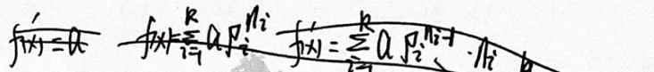
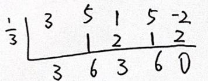
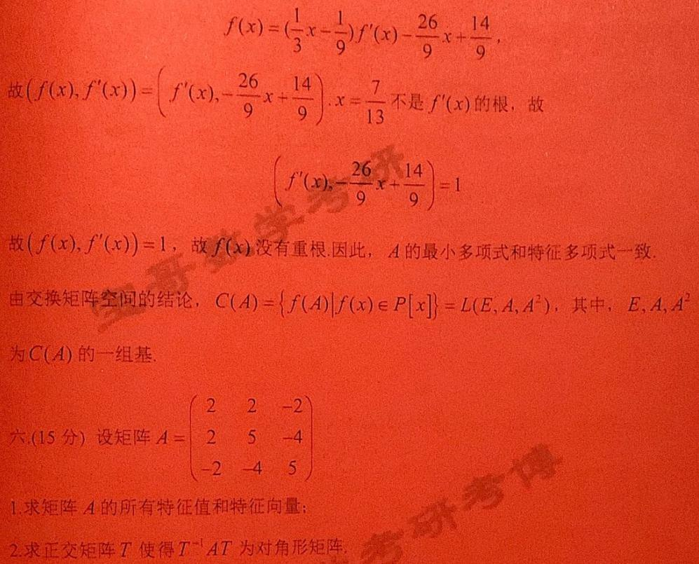
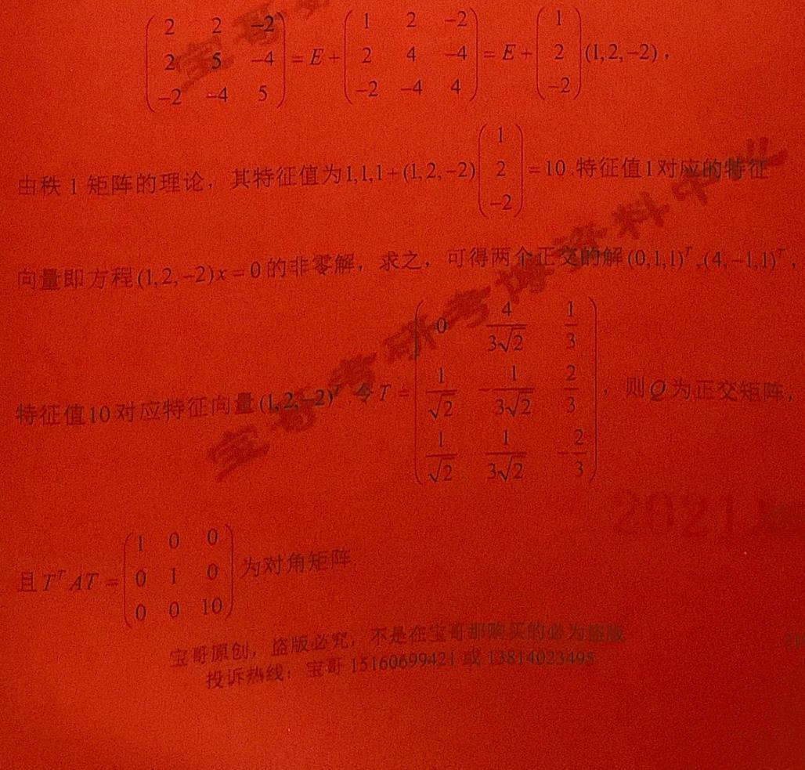
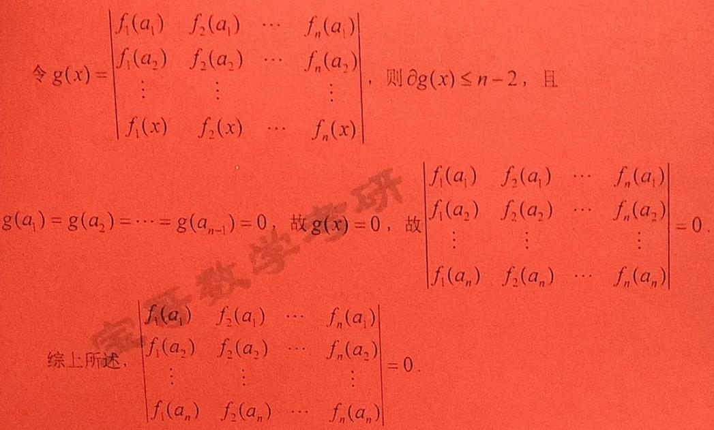
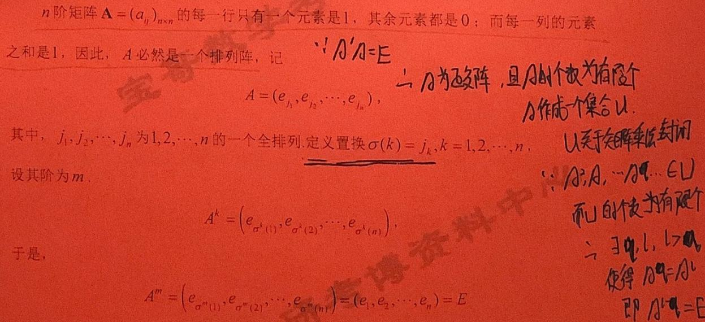

## QUESTION 1

### QUESTION TYPE

short_answer

### QUESTION

求多项式  $A x^{4} + B x^{2} + 1$  有重因式的条件,并确定重数.

### EXPLANATION

令  $f(x) = A x^{4} + B x^{2} + 1$

如果  $A = 0$  ,则  $f(x) = B x^{2} + 1$  ,  $f(x)$  不可能有重因式,故  $A \neq 0$

$$
f^{\prime}(x) = 4A x^{3} + 2B x
$$

$$
f(x) = \frac{1}{4} x f^{\prime}(x) + \frac{1}{2} B x^{2} + 1,
$$

故  $\left(f(x), f^{\prime}(x)\right) = \left(f^{\prime}(x), \frac{1}{2} B x^{2} + 1\right). f(x)$  有重因式当且仅当  $\left(f(x), f^{\prime}(x)\right) \neq 1$  即  $\left(f^{\prime}(x), \frac{1}{2} B x^{2} + 1\right) \neq 1$ . 如果  $B = 0$  ,则  $\left(f^{\prime}(x), \frac{1}{2} B x^{2} + 1\right) = 1$  ,  $f(x)$  没有重因式,故  $B \neq 0$

$$
f^{\prime}(x) = \frac{8 A x}{B} \left(\frac{1}{2} B x^{2} + 1\right) + \frac{2(B^{2} - 4 A)}{B} x,
$$

故  $\left(f^{\prime}(x), \frac{1}{2} B x^{2} + 1\right) = \left(\frac{1}{2} B x^{2} + 1, \frac{2(B^{2} - 4 A)}{B} x\right)$  ,  $f(x)$  有重因式当且仅当  $\left(\frac{1}{2} B x^{2} + 1, \frac{2(B^{2} - 4 A)}{B} x\right) \neq 1$  ,这等价于  $\frac{2(B^{2} - 4 A)}{B} = 0$  ,即  $B^{2} = 4 A$ . 因此,

多项式  $A x^{4} + B x^{2} + 1$  有重因式的条件为  
$\left\{ \begin{array}{l}B^{2} = 4 A \\ A \neq 0 \end{array} \right.$  

当  $\left\{ \begin{array}{l}B^{2} = 4 A \\ A \neq 0 \end{array} \right.$  时,

$$
A x^{4} + B x^{2} + 1 = \frac{1}{4} B^{2} x^{4} + B x^{2} + 1 = \left(\frac{1}{2} B x^{2} + 1\right)^{2},
$$

重因式或者是  $\frac{1}{2} B x^{2} + 1$  ,或者是  $\frac{1}{2} B x^{2} + 1$  的因式,重数总是2.

### ANSWER

多项式  $A x^{4} + B x^{2} + 1$  有重因式的条件为  
$\left\{ \begin{array}{l}B^{2} = 4 A \\ A \neq 0 \end{array} \right.$ ，重数为2。

## QUESTION 2

### QUESTION TYPE

short_answer

### QUESTION

设矩阵  $A$  满足  $A^{2} + 2 A + 3 E = 0$  ,则对任意实数  $c$  ,  $A - c E$  可逆,并求  $(A - c E)^{-1}$.

### EXPLANATION

矩阵  $A$  满足  $A^{2} + 2A + 3E = 0$  ,故

$$
\left[A + (c + 2)E\right](A - cE) + (c^{2} + 2c + 3)E = 0,
$$

即  $\left[A + (c + 2)E\right](A - cE) = - (c^{2} + 2c + 3)E$  对任意实数  $c$

$$
c^{2} + 2c + 3 = (c + 1)^{2} + 2\geq 2 > 0,
$$

故  $- \frac{A + (c + 2)E}{c^{2} + 2c + 3} (A - cE) = E$  ,故  $A - cE$  可逆,且  $(A - cE)^{- 1} = - \frac{A + (c + 2)E}{c^{2} + 2c + 3}$

### ANSWER

$A - cE$  可逆,且  
$(A - cE)^{- 1} = - \frac{A + (c + 2)E}{c^{2} + 2c + 3}$.

## QUESTION 3

### QUESTION TYPE

proof

### QUESTION

设  $A$  和  $B$  都是  $n$  阶矩阵,并且都相似于对角矩阵,证明  $A$  与  $B$  相似的充要条件为  $A$  和  $B$  的特征多项式相等,并举例说明当  $A$  与  $B$  相似于对角矩阵的条件去掉后,充分性一般不成立.

### ANSWER

(1)必要性

相似矩阵的特征多项式相等,故若  $A$  与  $B$  相似,则  $A$  和  $B$  的特征多项式相等.

充分性

假设  $A$  和  $B$  的特征多项式相等,  $A$  和  $B$  都是  $n$  阶矩阵,并且都相似于对角矩阵,故  $A$  和  $B$  相似于同一个对角矩阵,故  $A$  与  $B$  相似.

(2)当  $A$  与  $B$  相似于对角矩阵的条件去掉后,充分性一般不成立.

例如,取  
$A = \begin{pmatrix}0 & 1 \\ 0 & 0\end{pmatrix},  
B = \begin{pmatrix}0 & 0 \\ 0 & 0\end{pmatrix}$  

则  $A$  和  $B$  的特征多项式相等,但  $A$  与  $B$  不相似.

## QUESTION 4

### QUESTION TYPE

short_answer

### QUESTION

已知二次型  $x_{1}^{2} + x_{2}^{2} + x_{3}^{2} + 2\alpha x_{1}x_{2} + 2x_{1}x_{3} + 2\beta x_{2}x_{3}$  可用正交变换化为  $y_{2}^{2} - 2y_{3}^{2}$  ,求  $\alpha ,\beta$.

### EXPLANATION

该二次型的矩阵为  
$A = \begin{pmatrix}1 & \alpha & 1 \\ \alpha & 1 & \beta \\ 1 & \beta & 1 \end{pmatrix}$  

其特征值为0,1,2,故

$$
\left|A\right| = \left| \begin{array}{ccc}1 & \alpha & 1 \\ \alpha & 1 & \beta \\ 1 & \beta & 1 \end{array} \right| = -(\alpha -\beta)^{2},
$$

$$
\left|A - E\right| = \left| \begin{array}{ccc}0 & \alpha & 1 \\ \alpha & 0 & \beta \\ 1 & \beta & 0 \end{array} \right| = 2\alpha \beta = 0,
$$

故  $\alpha = \beta = 0$

### ANSWER

$\alpha = 0, \quad \beta = 0$.

## QUESTION 5

### QUESTION TYPE

short_answer

### QUESTION

已知线性方程组(1)  
$\left\{ \begin{array}{l}2x_{1} + 3x_{2} + x_{3} + 2x_{4} = 0 \\ x_{1} - x_{3} + a x_{2} = 0 \end{array} \right.$  

(2)  
$\left\{ \begin{array}{l}x_{1} + 3x_{2} + 2x_{3} + x_{4} = 0 \\ x_{1} + b x_{2} + x_{3} + x_{4} = 0 \end{array} \right.$  

同解,求  $a,b$  ,并求它们的通解.

### EXPLANATION

方程组(1)的系数矩阵为

$$
\left(\begin{array}{cccc}
2 & 3 & 1 & 2 \\
1 & 0 & -1 & a
\end{array}\right) \rightarrow
\left(\begin{array}{cccc}
1 & 0 & -1 & a \\
0 & 3 & 3 & 2 - 2a
\end{array}\right) \rightarrow
\left(\begin{array}{cccc}
1 & 0 & -1 & a \\
0 & 1 & 1 & \frac{2 - 2a}{3}
\end{array}\right)
$$

因此,方程组(1)的通解为

$$
x = \begin{pmatrix}
x_3 - a x_4 \\
- x_3 + \frac{2a - 2}{3} x_4 \\
x_3 \\
x_4
\end{pmatrix}
= x_3 \begin{pmatrix}1 \\ -1 \\ 1 \\ 0 \end{pmatrix} + x_4 \begin{pmatrix} -a \\ \frac{2a - 2}{3} \\ 0 \\ 1 \end{pmatrix}
$$

方程组(1)与(2)同解,故 $\begin{pmatrix}1 \\ -1 \\ 1 \\ 0 \end{pmatrix}, \begin{pmatrix} -a \\ \frac{2a - 2}{3} \\ 0 \\ 1 \end{pmatrix}$ 为(2)的解,故

$$
\left\{
\begin{array}{l}
- a + 3 \cdot \frac{2a - 2}{3} + 1 = 0 \\
1 - b + 1 = 0
\end{array}
\right.
$$

求解得到  $a=1 , b=2$ 。

故方程组的通解为

$$
x = x_3 \begin{pmatrix}1 \\ -1 \\ 1 \\ 0 \end{pmatrix} + x_4 \begin{pmatrix} -1 \\ 0 \\ 0 \\ 1 \end{pmatrix}
$$

### ANSWER

$a=1, b=2$。通解为  
$x = x_3 (1, -1, 1, 0)^T + x_4 (-1, 0, 0, 1)^T$。

## QUESTION 6

### QUESTION TYPE

proof

### QUESTION

证明:如果  $V_{1}, V_{2}$  是线性空间  $V$  的两个子空间,那么

$$
\dim(V_1 + V_2) = \dim V_1 + \dim V_2 - \dim (V_1 \cap V_2)
$$

### ANSWER

设  $\dim (V_{1}\cap V_{2}) = r$  ,  $\dim V_{1} = r_{1}$  ,  $\dim V_{2} = r_{2}$  .

假设  $\alpha_{1},\alpha_{2},\dots ,\alpha_{r}$  为  $V_{1}\cap V_{2}$  的一组基,将其分别扩充为  $V_{1}$  的一组基  
$\alpha_{1},\alpha_{2},\dots ,\alpha_{r},\beta_{1},\beta_{2},\dots ,\beta_{r_1 - r}$  
和  $V_{2}$  的一组基  
$\alpha_{1},\alpha_{2},\dots ,\alpha_{r},\gamma_{1},\gamma_{2},\dots ,\gamma_{r_2 - r}$  

则

$$
V_{1} + V_{2} = \mathrm{span}(\alpha_{1},\dots,\alpha_{r},\beta_{1},\dots,\beta_{r_1 - r}) + \mathrm{span}(\alpha_{1},\dots,\alpha_{r},\gamma_{1},\dots,\gamma_{r_2 - r}) = \mathrm{span}(\alpha_{1},\dots,\alpha_{r},\beta_{1},\dots,\beta_{r_1 - r},\gamma_{1},\dots,\gamma_{r_2 - r})
$$

以下再证明  $\alpha_{1},\dots,\alpha_{r},\beta_{1},\dots,\beta_{r_1 - r},\gamma_{1},\dots,\gamma_{r_2 - r}$  线性无关即可.

假设  
$$
k_{1}\alpha_{1} + \dots + k_{r}\alpha_{r} + p_{1}\beta_{1} + \dots + p_{r_1 - r}\beta_{r_1 - r} + q_{1}\gamma_{1} + \dots + q_{r_2 - r}\gamma_{r_2 - r} = 0
$$  
则

$$
k_{1}\alpha_{1} + \dots + k_{r}\alpha_{r} + p_{1}\beta_{1} + \dots + p_{r_1 - r}\beta_{r_1 - r} = -(q_{1}\gamma_{1} + \dots + q_{r_2 - r}\gamma_{r_2 - r})
$$

一方面，左式属于  $V_{1}$  ，另一方面右式属于  $V_{2}$  ，因而右式属于  $V_{1} \cap V_{2}$  ，由  $\alpha_1, \dots, \alpha_r$  是  $V_1 \cap V_2$  的基,右式可由  $\alpha_i$  表示，即

$$
q_{1}\gamma_{1} + \dots + q_{r_2 - r}\gamma_{r_2 - r} = -l_{1}\alpha_{1} - \dots - l_{r}\alpha_{r}
$$

于是

$$
l_{1}\alpha_{1} + \dots + l_{r}\alpha_{r} + q_{1}\gamma_{1} + \dots + q_{r_2 - r}\gamma_{r_2 - r} = 0
$$

由  $\alpha_{1}, \dots, \alpha_{r}, \gamma_1, \dots, \gamma_{r_2 - r}$  线性无关,得  
$l_{1} = \cdots = l_{r} = q_{1} = \cdots = q_{r_2 - r} = 0$。再由  $ \alpha_{1}, \dots, \alpha_r, \beta_1, \dots, \beta_{r_1 - r}$  也线性无关,得  
$k_{1} = \cdots = k_{r} = p_{1} = \cdots = p_{r_1 - r} = 0$。

综上,该向量组线性无关,其基数为  
$r + (r_1 - r) + (r_2 - r) = r_1 + r_2 - r$。

结论得证!

## QUESTION 7

### QUESTION TYPE

proof

### QUESTION

设  $\alpha_{1},\alpha_{2},\dots ,\alpha_{m}$  与  $\beta_{1},\beta_{2},\dots ,\beta_{m}$  都为  $n$  维向量组,证明向量组  $\alpha_{1} + \beta_{1},\alpha_{2} + \beta_{2},\dots ,\alpha_{m} + \beta_{m}$  的秩不超过向量组  $\alpha_{1},\alpha_{2},\dots ,\alpha_{m}$  和  $\beta_{1},\beta_{2},\dots ,\beta_{m}$  的秩之和.

### ANSWER

若  $\alpha_{1},\alpha_{2},\dots ,\alpha_{m}$  或  $\beta_{1},\beta_{2},\dots ,\beta_{m}$  有一组向量全为0,结论显然成立.

假设两组向量都不全为0。

设  $\alpha_{1},\alpha_{2},\dots ,\alpha_{m}$  和  $\beta_{1},\beta_{2},\dots ,\beta_{m}$  的秩分别为  $r,s$ 。

不妨设  $\alpha_{1},\dots,\alpha_{r}$  和  $\beta_{1}, \dots, \beta_{s}$  分别为极大线性无关组，则  $\alpha_{1},\dots,\alpha_{r}$  和  $\beta_1,\dots,\beta_s$  分别与原向量组等价。由此向量组

$$
\alpha_{1} + \beta_{1}, \alpha_{2} + \beta_{2}, \dots, \alpha_{m} + \beta_{m}
$$

可由原始向量组线性表示，因此，也可以由  $\alpha_{1},\dots,\alpha_{r}, \beta_{1},\dots,\beta_{s}$  线性表示。

因此，该向量组的秩不超过  $\alpha_{1},\dots,\alpha_{r}, \beta_{1},\dots,\beta_{s}$  的秩。

而  $\alpha_{1},\dots,\alpha_{r}, \beta_{1},\dots,\beta_{s}$  的秩不超过  $r + s$ 。

综上，结论成立。

## QUESTION 8

### QUESTION TYPE

short_answer

### QUESTION

求线性方程组,使它的解是由下列向量组所生成的线性子空间

$$
\alpha_{1} = \begin{pmatrix}1 \\ -1 \\ 1 \\ 0 \end{pmatrix}, \quad \alpha_{2} = \begin{pmatrix}1 \\ 0 \\ 0 \\ 1 \end{pmatrix}, \quad \alpha_{3} = \begin{pmatrix}2 \\ 0 \\ 1 \\ 1 \end{pmatrix}
$$

### EXPLANATION

$$
\left(\begin{array}{c}
\alpha_1^T \\ \alpha_2^T \\ \alpha_3^T
\end{array}\right) =
\begin{pmatrix}
1 & -1 & 1 & 0 \\
1 & 0 & 0 & 1 \\
2 & 0 & 1 & 1
\end{pmatrix} \rightarrow
\begin{pmatrix}
1 & -1 & 1 & 0 \\
0 & 2 & -1 & 1 \\
0 & 2 & -1 & 1
\end{pmatrix} \rightarrow
\begin{pmatrix}
1 & 0 & \frac{1}{2} & \frac{1}{2} \\
0 & 1 & -\frac{1}{2} & \frac{1}{2} \\
0 & 0 & 0 & 0
\end{pmatrix}
$$

故方程组  
$$
\begin{pmatrix}
1 & -1 & 1 & 0 \\
1 & 0 & 0 & 1 \\
2 & 0 & 1 & 1
\end{pmatrix} x = 0
$$  
的通解为

$$
x = \begin{pmatrix}
-\frac{1}{2} x_3 - \frac{1}{2} x_4 \\
\frac{1}{2} x_3 - \frac{1}{2} x_4 \\
x_3 \\
x_4
\end{pmatrix}
= -\frac{1}{2} x_3 \begin{pmatrix}1 \\ -1 \\ -2 \\ 0 \end{pmatrix} - \frac{1}{2} x_4 \begin{pmatrix}1 \\ 1 \\ 0 \\ -2 \end{pmatrix}
$$

其中，  
$\begin{pmatrix}1 \\ -1 \\ -2 \\ 0 \end{pmatrix}$ 和 $\begin{pmatrix}1 \\ 1 \\ 0 \\ -2 \end{pmatrix}$ 为基础解系,故该矩阵为所求的一个方程组的系数矩阵。

### ANSWER

方程组  
$$
\begin{pmatrix}
1 & -1 & -2 & 0 \\
1 & 1 & 0 & -2
\end{pmatrix} x = 0
$$  
的通解即为所求。

## QUESTION 9

### QUESTION TYPE

short_answer

### QUESTION

求基  $\epsilon_{1}, \epsilon_{2}, \epsilon_{3}, \epsilon_{4}$  到基  $\eta_{1}, \eta_{2}, \eta_{3}, \eta_{4}$  的过渡矩阵,并求向量  $\xi = (1,0,0,-1)$  在  $\eta_{1}, \eta_{2}, \eta_{3}, \eta_{4}$  下的坐标。

其中  
$$
\epsilon_{1} = (1,1,1,1), \quad \epsilon_{2} = (1,1,-1,-1), \quad \epsilon_{3} = (1,-1,1,-1), \quad \epsilon_{4} = (1,-1,1,1)
$$

$$
\eta_{1} = (1,1,0,1), \quad \eta_{2} = (2,1,3,1), \quad \eta_{3} = (1,1,0,0), \quad \eta_{4} = (0,1,-1,-1)
$$

### EXPLANATION

基  $\epsilon$ 到基  $\eta$ 的过渡矩阵为

$$
P = (\epsilon_1^T, \epsilon_2^T, \epsilon_3^T, \epsilon_4^T)^{-1} (\eta_1^T, \eta_2^T, \eta_3^T, \eta_4^T) = \begin{pmatrix}
1 & 1 & 1 & 1 \\
1 & 1 & -1 & -1 \\
1 & -1 & 1 & 1 \\
1 & -1 & -1 & 1
\end{pmatrix}^{-1}
\begin{pmatrix}
1 & 2 & 1 & 0 \\
1 & 1 & 1 & 1 \\
0 & 3 & 0 & -1 \\
1 & 1 & 0 & -1
\end{pmatrix}
= \begin{pmatrix}
\frac{1}{2} & 2 & \frac{1}{2} & 0 \\
\frac{1}{2} & -\frac{1}{2} & \frac{1}{2} & \frac{1}{2} \\
\frac{1}{2} & 1 & 0 & 0 \\
\frac{1}{2} & -\frac{1}{2} & 0 & -\frac{1}{2}
\end{pmatrix}
$$

向量  $\xi$  在  $\eta$  下的坐标为

$$
(\eta_1^T, \eta_2^T, \eta_3^T, \eta_4^T)^{-1} \xi^T = 
\begin{pmatrix}
1 & 2 & 1 & 0 \\
1 & 1 & 1 & 1 \\
0 & 3 & 0 & -1 \\
1 & 1 & 0 & -1
\end{pmatrix}^{-1}
\begin{pmatrix}
1 \\ 0 \\ 0 \\ -1
\end{pmatrix}
= \begin{pmatrix}
-2 \\ -\frac{1}{2} \\ 4 \\ -\frac{3}{2}
\end{pmatrix}
$$

### ANSWER

过渡矩阵为  
$$
\begin{pmatrix}
\frac{1}{2} & 2 & \frac{1}{2} & 0 \\
\frac{1}{2} & -\frac{1}{2} & \frac{1}{2} & \frac{1}{2} \\
\frac{1}{2} & 1 & 0 & 0 \\
\frac{1}{2} & -\frac{1}{2} & 0 & -\frac{1}{2}
\end{pmatrix}
$$  
向量  $\xi$  在基  $\eta$  下的坐标为  
$$
\left(-2, -\frac{1}{2}, 4, -\frac{3}{2}\right)^T.
$$

## QUESTION 10

### QUESTION TYPE

proof

### QUESTION

设  $n$  阶矩阵  $A$  满足  $f(A) = g(A) = 0$，其中  
$$
f(x) = x^{4} - x^{3} - 7x^{2} + 13x -6, \quad g(x) = x^{4} + 3x^{3} - 3x^{2} - 11x -6.
$$  
证明  $A$  相似于某对角阵.

### ANSWER

多项式  
$$
\begin{aligned}
f(x) &= x^4 - x^3 - 7 x^2 + 13 x - 6 = (x - 1)^2 (x - 2)(x + 3), \\
g(x) &= x^4 + 3 x^3 - 3 x^2 - 11 x - 6 = (x + 1)^2 (x + 3)(x - 2).
\end{aligned}
$$

因此  $(f(x), g(x)) = (x - 2)(x + 3)$ 。

存在多项式  $u(x), \nu(x)$  使得

$$
u(x) f(x) + \nu(x) g(x) = (x - 2)(x + 3),
$$

代入矩阵  $A$  ,

$$
(A - 2E)(A + 3E) = u(A) f(A) + \nu(A) g(A) = 0.
$$

因此  $(x - 2)(x + 3)$  是  $A$  的化零多项式,且无重根，故  $A$  可对角化。

## QUESTION 11

### QUESTION TYPE

proof

### QUESTION

证明:如果  $\left(f(x),g(x)\right) = 1$ 和  $\left(f(x),h(x)\right) = 1$ ，那么  $\left(f(x),g(x)h(x)\right)=1$.

### ANSWER

$\left(f(x),g(x)\right)=1, \quad \left(f(x), h(x)\right) =1$ ，故存在多项式  $u(x),\nu(x), s(x), t(x)$  ，使得

$$
u(x) f(x) + \nu(x) g(x) = 1, \quad s(x) f(x) + t(x) h(x) = 1,
$$

两式相乘，有

$$
\begin{aligned}
& [u(x) f(x) + \nu(x) g(x)] [s(x) f(x) + t(x) h(x)] \\
= & u(x) s(x) f^2(x) + \nu(x) s(x) g(x) f(x) + u(x) t(x) h(x) f(x) + \nu(x) t(x) g(x) h(x) \\
= & \left( u(x) s(x) f(x) + \nu(x) s(x) g(x) + u(x) t(x) h(x) \right) f(x) + \nu(x) t(x) g(x) h(x) = 1,
\end{aligned}
$$

故  $\left(f(x), g(x) h(x)\right) = 1$。

## QUESTION 12

### QUESTION TYPE

short_answer

### QUESTION

计算下列  $n$  阶行列式，特别是  
$$
D_n = \left|
\begin{array}{cccccc}
3 & 2 & 0 & \cdots & 0 & 0 \\
1 & 3 & 2 & \cdots & 0 & 0 \\
0 & 1 & 3 & \cdots & 0 & 0 \\
\vdots & \vdots & \vdots & & \vdots & \vdots \\
0 & 0 & 0 & \cdots & 3 & 2 \\
0 & 0 & 0 & \cdots & 1 & 3 \\
\end{array}
\right|
$$

### EXPLANATION

该行列式是特殊类型的三对角行列式，其特征方程为  
$$
r^{2} = 3 r - 2,
$$  
方程的两个根为  $1$  和  $2$ ，故

$$
D_{n} = \frac{2^{n+1} - 1^{n+1}}{2 - 1} = 2^{n+1} - 1.
$$

### ANSWER

$D_n = 2^{n+1} - 1$。

## QUESTION 13

### QUESTION TYPE

short_answer

### QUESTION

设向量组  $\alpha_1, \alpha_2, \dots, \alpha_m$  线性无关，令  
$$
\beta_1 = \alpha_1, \quad \beta_2 = \alpha_1 + \alpha_2, \quad \dots, \quad \beta_m = \alpha_1 + \alpha_2 + \cdots + \alpha_m,
$$  
证明向量组  $\beta_1, \beta_2, \dots, \beta_m$  线性无关.

### EXPLANATION

$$
(\beta_1, \beta_2, \dots, \beta_m) = (\alpha_1, \alpha_2, \dots, \alpha_m)
\begin{pmatrix}
1 & 1 & \dots & 1 \\
0 & 1 & \dots & 1 \\
\vdots & \vdots & \ddots & \vdots \\
0 & 0 & \dots & 1
\end{pmatrix},
$$

该右侧矩阵为可逆矩阵，且  $\alpha_1, \dots, \alpha_m$  线性无关，故  $\beta_1, \dots, \beta_m$  线性无关。

### ANSWER

向量组  $\beta_1, \beta_2, \dots, \beta_m$  线性无关。

## QUESTION 14

### QUESTION TYPE

proof

### QUESTION

设  $B$  为  $m \times n$  矩阵，$A$ 和 $C$ 满足  $A B = C$，且  $\mathrm{rank}(B) = n$。证明秩  $\mathrm{rank}(A) = \mathrm{rank}(C)$，并说明秩  $(A) = s$  的充要条件是秩  $(C) = s$。

### ANSWER

引入如下结论：

若矩阵 $A$ 列满秩，则 $\mathrm{rank}(A B) = \mathrm{rank}(B)$；

若矩阵 $B$ 行满秩，则 $\mathrm{rank}(A B) = \mathrm{rank}(A)$。

$B$ 行满秩，即 $\mathrm{rank}(B) = n$ ，故

$$
\mathrm{rank}(C) = \mathrm{rank}(A B) = \mathrm{rank}(A).
$$

于是秩  $(A) = s$  的充要条件是秩  $(C) = s$。

## QUESTION 15

### QUESTION TYPE

short_answer

### QUESTION

已知  $AB - B = A$ ，其中  
$$
B = \begin{pmatrix} 2 & 0 & 0 \\ 0 & 1 & 2 \\ 1 & 1 & 1 \end{pmatrix}
$$  
求  $(A - E)^{-1}$。

### EXPLANATION

$A B - B = A$  ，即  
$$
A(B - E) = B.
$$

计算  
$$
B - E = \begin{pmatrix}1 & 0 & 0 \\ 0 & 0 & 2 \\ 1 & 1 & 0 \end{pmatrix}
$$  
为可逆矩阵，故

$$
A = B (B - E)^{-1} = (B - E + E)(B - E)^{-1} = E + (B - E)^{-1},
$$

因此，

$$
A - E = (B - E)^{-1} \implies (A - E)^{-1} = B - E = \begin{pmatrix}1 & 0 & 0 \\ 0 & 0 & 2 \\ 1 & 1 & 0 \end{pmatrix}.
$$

### ANSWER

$(A - E)^{-1} = \begin{pmatrix}1 & 0 & 0 \\ 0 & 0 & 2 \\ 1 & 1 & 0 \end{pmatrix}$。

## QUESTION 16

### QUESTION TYPE

short_answer

### QUESTION

设  
$$
A = \begin{pmatrix}
1 & -3 & 3 \\
x & -5 & 3 \\
6 & y & 4
\end{pmatrix}
$$  
有特征值  $\lambda_1 = -2, \lambda_2 = 4$ ，试求参数  $x, y$ 。

### EXPLANATION

由特征方程知，

$$
\begin{cases}
|A + 2E| = \left|\begin{array}{ccc}3 & -3 & 3 \\ x & -3 & 3 \\ 6 & y & 6 \end{array}\right| = 3(y + 6)(x - 3) = 0, \\[6pt]
|A - 4E| = \left|\begin{array}{ccc} -3 & -3 & 3 \\ x & -9 & 3 \\ 6 & y & 0 \end{array}\right| = 9 y + 3 x y + 108 = 0.
\end{cases}
$$

解得

$$
\begin{cases}
x = 3, \\
y = -6.
\end{cases}
$$

### ANSWER

$x=3,\quad y=-6$。

## QUESTION 17

### QUESTION TYPE

proof

### QUESTION

设  $A, B$  均为  $n$  阶正定矩阵，且  $AB = BA$，求证：$AB$ 为正定矩阵。

### ANSWER

$A$ 正定，存在实可逆矩阵 $P$ ，使得

$$
A = P^{T} P.
$$

故

$$
A B = P^{T} P B = P^{T} (P B P^{T}) P^{-T} \sim P B P^{T},
$$

$B$ 正定，故 $P B P^{T}$ 亦正定，其特征值均为正数。

由于 $AB = BA$ 且 $A,B$ 均对称，故

$$
(AB)^{T} = B^{T} A^{T} = B A = AB,
$$

即 $AB$ 亦实对称。

特征值皆正，$AB$ 为正定矩阵。

## QUESTION 18

### QUESTION TYPE

proof

### QUESTION

设  $V$  是复数域上的  $n$  维线性空间，线性变换  $\sigma$  在基  $\epsilon_1, \dots, \epsilon_n$  下的矩阵是一个若当块，证明：

(1) $V$ 中包含  $\epsilon_1$  的  $\sigma$  不变子空间只有 $V$ 本身；

(2) $V$ 中任一非零  $\sigma$  不变子空间都包含  $\epsilon_n$；

(3) $V$ 不能分解为两个非平凡  $\sigma$  不变子空间的直和。

### ANSWER

设若当块为

$$
J = \begin{pmatrix}
\lambda & 1 & & \\
& \lambda & \ddots & \\
& & \ddots & 1 \\
& & & \lambda
\end{pmatrix}.
$$

对应基向量满足

$$
A \epsilon_1 = \lambda \epsilon_1 + \epsilon_2, \quad A \epsilon_2 = \lambda \epsilon_2 + \epsilon_3, \quad \dots, \quad A \epsilon_{n-1} = \lambda \epsilon_{n-1} + \epsilon_n,\quad A \epsilon_n = \lambda \epsilon_n.
$$

(1) 任取包含  $\epsilon_1$  的不变子空间 $W$，由于

$$
\epsilon_2 = (A - \lambda E)\epsilon_1 \in W,
$$

递推得到所有 $\epsilon_i \in W$，故 $W=V$。

(2) 任取非零 $x = a_{j_0} \epsilon_{j_0} + \cdots + a_n \epsilon_n \in W$，其中 $a_{j_0} \neq 0$ 是最先非零的系数，利用 $(A - \lambda E)$ 递推，最终得到 $a_{j_0} \epsilon_n \in W$，故 $\epsilon_n \in W$。

(3) 由(2)任意非零不变子空间含 $\epsilon_n$，两个非零不变子空间交非零，故不存在直和分解。

## QUESTION 19

### QUESTION TYPE

proof

### QUESTION

设  $f(x),g(x)$  是数域  $P$  上两个一元多项式, $m$  为给定的正整数,证明: $f(x)\mid g(x)$  的充分必要条件是  $f^{m}(x)\mid g^{m}(x)$ .

### ANSWER

若  $f(x) = 0$ ,则  $f^{m}(x)\mid g^{m}(x)$  当且仅当  $g^{m}(x) = 0$ ,当且仅当  $f(x)\mid g(x)$ 。

若  $f(x)\neq 0$ ,令  $\left(f(x),g(x)\right) = d(x),\quad f(x) = f_{1}(x)d(x),\quad g(x) = g_{1}(x)d(x),$  则  $\left(f_{1}(x),g_{1}(x)\right) = 1$ ,故  $\left(f_{1}^{m}(x),g_{1}^{m}(x)\right) = 1$ ,故

$$
\left(f^{m}(x),g^{m}(x)\right) = \left(f_{1}^{m}(x)d^{m}(x),g_{1}^{m}(x)d^{m}(x)\right) = d^{m}(x),
$$

故  $f^{m}(x)\mid g^{m}(x)$  的当且仅当  $\left(f^{m}(x),g^{m}(x)\right)\sim f^{m}(x)$  ,即  $d^{m}(x)\sim f^{m}(x)$  ,即  $d(x)\sim f(x)$  ,即  $f(x)\mid g(x)$ 。

## QUESTION 20

### QUESTION TYPE

short_answer

### QUESTION

计算下列行列式  
$$
\left| 
\begin{array}{cccccc}
x_{1} + a_{1} & x_{1} & x_{1} & \dots & x_{1} \\
x_{2} & x_{2} + a_{2} & x_{2} & \dots & x_{2} \\
x_{3} & x_{3} & x_{3} + a_{3} & \dots & x_{3} \\
\vdots & \vdots & \vdots & \ddots & \vdots \\
x_{n} & x_{n} & x_{n} & \dots & x_{n} + a_{n}
\end{array} 
\right| \quad (a_{1} a_{2} \dots a_{n} \neq 0)
$$

### EXPLANATION

$a_{1} a_{2} \dots a_{n} \neq 0$ ，故

$$
\begin{array}{rl}
& \left| \begin{array}{cccccc}
x_{1} + a_{1} & x_{1} & x_{1} & \cdots & x_{1} \\
x_{2} & x_{2} + a_{2} & x_{2} & \cdots & x_{2} \\
x_{3} & x_{3} & x_{3} + a_{3} & \cdots & x_{3} \\
\cdots & \cdots & \cdots & \cdots & \cdots \\
x_{n} & x_{n} & x_{n} & \cdots & x_{n} + a_{n}
\end{array} \right| \\
=\, & \left| \begin{array}{cccccc}
x_{1} + a_{1} & -a_{1} & -a_{1} & \cdots & -a_{1} \\
x_{2} & a_{2} & 0 & \cdots & 0 \\
x_{3} & 0 & a_{3} & \cdots & 0 \\
\cdots & \cdots & \cdots & \cdots & \cdots \\
x_{n} & 0 & 0 & \cdots & a_{n}
\end{array} \right| \\
=\, & \left| \begin{array}{cccccc}
x_{1} + a_{1} + \frac{a_{1} x_{2}}{a_{2}} + \frac{a_{1} x_{3}}{a_{3}} + \cdots + \frac{a_{1} x_{n}}{a_{n}} & -a_{1} & -a_{1} & \cdots & -a_{1} \\
0 & a_{2} & 0 & \cdots & 0 \\
0 & 0 & a_{3} & \cdots & 0 \\
\cdots & \cdots & \cdots & \cdots & \cdots \\
0 & 0 & 0 & \cdots & a_{n}
\end{array} \right| \\
=\, & \left(x_{1} + a_{1} + \frac{a_{1} x_{2}}{a_{2}} + \frac{a_{1} x_{3}}{a_{3}} + \cdots + \frac{a_{1} x_{n}}{a_{n}}\right) a_{2} a_{3} \cdots a_{n} \\
=\, & a_{1} a_{2} a_{3} \cdots a_{n} + \sum_{j=1}^{n} a_{1} \cdots a_{j-1} x_{j} a_{j+1} \cdots a_{n}
\end{array}
$$

### ANSWER

$$
a_{1} a_{2} a_{3} \cdots a_{n} + \sum_{j=1}^{n} a_{1} \cdots a_{j-1} x_{j} a_{j+1} \cdots a_{n}
$$

## QUESTION 21

### QUESTION TYPE

short_answer

### QUESTION

讨论  $a,b$  为何值时,下列线性方程组有唯一解? 无穷多解? 无解?

当有无穷多解时, 求出该方程组的通解, 其中方程组为:  
$$
\left\{ 
\begin{array}{l}
a x_{1} + 3x_{2} + 3x_{3} = 3 \\ 
x_{1} + 4x_{2} + x_{3} = 1 \\ 
2x_{1} + 3x_{2} + b x_{3} = 2
\end{array} 
\right.
$$

### EXPLANATION

方程组的增广矩阵为

$$
G = \left(\begin{array}{c c c c}
a & 3 & 3 & 3 \\ 
1 & 4 & 1 & 1 \\ 
2 & 3 & b & 2
\end{array}\right)
\rightarrow
\left(\begin{array}{c c c c}
1 & 4 & 1 & 1 \\
0 & 3 - 4a & 3 - a & 3 - a \\
0 & -5 & b - 2 & 0
\end{array}\right)
\rightarrow
\left(\begin{array}{c c c c}
1 & 0 & \frac{4b - 3}{5} & 1 \\
0 & 1 & \frac{2 - b}{5} & 0 \\
0 & 0 & 3 - a - (3 - 4a)\frac{2 - b}{5} & 3 - a
\end{array}\right)
$$

- 如果  $3 - a - (3 - 4a)\frac{2 - b}{5} \neq 0$ ，则方程组有唯一解。

- 如果  
$$
\left\{
\begin{array}{l}
3 - a - (3 - 4a)\frac{2 - b}{5} = 0 \\
3 - a \neq 0
\end{array}
\right.
$$
则方程组无解。

- 如果  
$$
\left\{
\begin{array}{l}
3 - a - (3 - 4a)\frac{2 - b}{5} = 0 \\
3 - a = 0 
\end{array}
\right.
$$
即 $a = 3, b = 2$，则方程组有无穷多解。此时，

$$
G \rightarrow \left(
\begin{array}{cccc}
1 & 0 & 1 & 1 \\
0 & 1 & 0 & 0 \\
0 & 0 & 0 & 0 
\end{array}
\right),
$$

方程组的通解为

$$
x = \left(
\begin{array}{c}
1 - x_{3} \\
0 \\
x_{3}
\end{array}
\right) = \left(
\begin{array}{c}
1 \\
0 \\
0
\end{array}
\right) + x_{3} \left(
\begin{array}{c}
-1 \\
0 \\
1
\end{array}
\right).
$$

## QUESTION 22

### QUESTION TYPE

proof

### QUESTION

设  
$$
A = \left(
\begin{array}{cccc}
a_{11} & a_{12} & \dots & a_{1n} \\
a_{21} & a_{22} & \dots & a_{2n} \\
\vdots & \vdots & \ddots & \vdots \\
a_{m1} & a_{m2} & \dots & a_{mn}
\end{array}
\right)
$$
为 $m \times n$ 的实数矩阵

(1) 证明：秩  $(A^T) = $ 秩  $(A^T A) = $ 秩  $(A)$。

(2) 证明：矩阵 $A^T A$ 正定的充要条件是秩 $(A) = n$。

### ANSWER

1. 若 $Ax = 0$，则 $A^T A x = 0$。  
   若 $A^T A x = 0$，则  
   $x^T A^T A x = (Ax)^T (Ax) = 0$，即 $Ax = 0$。  
   这里，$x \in \mathbb{R}^n$，故方程组 $Ax = 0$ 与 $A^T A x = 0$ 同解。  
   故 $n = r(A) = n - r(A^T A)$，即 $r(A^T A) = r(A)$，结论证明完毕。

   用 $A^T$ 替代 $A$，并注意 $r(A) = r(A^T)$，就有 $r(A) = r(AA^T)$。

2. $(A^{T}A)^T = A^{T}A$，故 $A^{T}A$ 为 $n$ 阶实对称矩阵。  
   对任意 $n$ 维实列向量 $x$，有  
   $x^{T} A^{T} A x = (A x)^{T} (A x) \geq 0$，  
   由 $x$ 的任意性，矩阵 $A^{T} A$ 半正定。  
   故 $A^{T} A$ 正定的充要条件是 $A^{T} A$ 可逆，即  
   $r(A^{T} A) = n$，即 $r(A) = n$。

## QUESTION 23

### QUESTION TYPE

proof

### QUESTION

(1) 证明：向量组的任何一个线性无关组都可以扩充成一个极大线性无关组。

(2) 设  
$\alpha_{1} = (1, -1, 2, 4), \quad \alpha_{2} = (0, 3, 1, 2), \quad \alpha_{3} = (3, 0, 7, 14), \quad \alpha_{4} = (1, -1, 2, 0), \quad \alpha_{5} = (2, 1, 5, 6)$，  
把 $\alpha_{1}, \alpha_{2}$ 扩充成一个极大无关组，并把其余向量用此极大无关组线性表示。

### ANSWER

1. 假设 $\alpha_{1}, \alpha_{2}, \dots, \alpha_{n}$ 为一组向量，其秩为 $r$。若 $\alpha_{1}, \dots, \alpha_{s}$ 为其一个无关组：

- 若 $s = r$，则 $\alpha_{1}, \dots, \alpha_{s}$ 为一个极大线性无关组。

- 若 $s < r$，则 $\alpha_{1}, \dots, \alpha_{s}$ 至少有一个向量不能由该组线性表示（不妨记为 $\alpha_{s+1}$），使得 $\alpha_{1}, \dots, \alpha_{s+1}$ 线性无关。

反复继续这样的过程 $r - s$ 次，就可以将 $\alpha_{1}, \dots, \alpha_{s}$ 扩充为一个极大线性无关组。

2. 计算矩阵

$$
(\alpha_{1}^T, \alpha_{2}^T, \alpha_{3}^T, \alpha_{4}^T, \alpha_{5}^T) = 
\left(
\begin{array}{ccccc}
1 & 0 & 3 & 1 & 2 \\
-1 & 3 & 0 & -1 & 1 \\
2 & 1 & 7 & 2 & 5 \\
4 & 2 & 14 & 0 & 6
\end{array}
\right)
\rightarrow
\left(
\begin{array}{ccccc}
1 & 0 & 3 & 1 & 2 \\
0 & 3 & 3 & 0 & 3 \\
0 & 1 & 1 & 0 & 1 \\
0 & 2 & 2 & -4 & -2
\end{array}
\right)
\rightarrow
\left(
\begin{array}{ccccc}
1 & 0 & 3 & 0 & 1 \\
0 & 1 & 1 & 0 & 1 \\
0 & 0 & 0 & 1 & 1 \\
0 & 0 & 0 & 0 & 0
\end{array}
\right)
$$

故 $\alpha_{1}, \alpha_{2}, \alpha_{4}$ 为一个极大线性无关组，

且

$$
\alpha_{3} = 3 \alpha_{1} + \alpha_{2}, \quad \alpha_{5} = \alpha_{1} + \alpha_{2} + \alpha_{4}.
$$

## QUESTION 24

### QUESTION TYPE

short_answer

### QUESTION

在  $P^{3}$  中,求由基  $\epsilon_{1}, \epsilon_{2}, \epsilon_{3}$  到基  $\eta_{1}, \eta_{2}, \eta_{3}$  的过渡矩阵,并求向量  $\alpha = (1,0,0)$ 在基  $\epsilon_{1}, \epsilon_{2}, \epsilon_{3}$  下的坐标,其中  
$$
\left\{ \begin{array}{l}
\epsilon_{1} = (-1,1,1) \\
\epsilon_{2} = (2,1,1) \\
\epsilon_{3} = (-1,0,1)
\end{array} \right., \quad
\left\{ \begin{array}{l}
\eta_{1} = (1,2,-1) \\
\eta_{2} = (2,2,-1) \\
\eta_{3} = (2,-1,-1)
\end{array} \right..
$$

### EXPLANATION

由基  $\epsilon_{1}, \epsilon_{2}, \epsilon_{3}$  到基  $\eta_{1}, \eta_{2}, \eta_{3}$  的过渡矩阵为

$$
(\epsilon_{1}^{T}, \epsilon_{2}^{T}, \epsilon_{3}^{T})^{-1}(\eta_{1}^{T}, \eta_{2}^{T}, \eta_{3}^{T}) = \left( \begin{array}{ccc} -1 & 2 & -1 \\ 1 & 1 & 0 \\ 1 & 1 & 1 \end{array} \right)^{-1} \left( \begin{array}{ccc} 1 & 2 & 2 \\ 2 & 2 & -1 \\ -1 & -1 & -1 \end{array} \right) = \left( \begin{array}{ccc} 2 & \frac{5}{3} & -\frac{4}{3} \\ 0 & \frac{1}{3} & \frac{1}{3} \\ -3 & -3 & 0 \end{array} \right)
$$

向量  $\alpha = (1,0,0)$  在基  $\epsilon_{1}, \epsilon_{2}, \epsilon_{3}$  下的坐标为

$$
(\epsilon_{1}^{T}, \epsilon_{2}^{T}, \epsilon_{3}^{T})^{-1} \alpha^{T} = \left( \begin{array}{ccc} -1 & 2 & -1 \\ 1 & 1 & 0 \\ 1 & 1 & 1 \end{array} \right)^{-1} \left( \begin{array}{c} 1 \\ 0 \\ 0 \end{array} \right) = \left( \begin{array}{c} -\frac{1}{3} \\ \frac{1}{3} \\ 0 \end{array} \right)
$$

### ANSWER

过渡矩阵为  
$$
\left( \begin{array}{ccc} 2 & \frac{5}{3} & -\frac{4}{3} \\ 0 & \frac{1}{3} & \frac{1}{3} \\ -3 & -3 & 0 \end{array} \right)
$$
向量  $\alpha$  在基  $\epsilon_{1}, \epsilon_{2}, \epsilon_{3}$  下的坐标为  
$$
\left( -\frac{1}{3}, \frac{1}{3}, 0 \right)
$$

## QUESTION 25

### QUESTION TYPE

proof

### QUESTION

设  $f_{1}(x), f_{2}(x), f(x) = f_{1}(x) f_{2}(x)$  为数域  $P$  上一元多项式,  $A$  为  $n$  阶方阵,  $W, W_{1}, W_{2}$  分别表示齐次线性方程组  $f(A) X = 0, f_{1}(A) X = 0, f_{2}(A) X = 0$  的解空间.

(1) 证明:  $W_{1}, W_{2}$  都是  $W$  的子空间;

(2) 证明:如果  $\left(f_{1}(x), f_{2}(x)\right) = 1$ ,那么  $W = W_{1} \oplus W_{2}$

### ANSWER

1. 任取  $X \in W_{1}$ ,则  $f_{1}(A)X = 0$ ,故  

$$
f_{1}(A)X = f_{1}(A)f_{2}(A)X = f_{2}(A)f_{1}(A)X = 0,
$$

故  $X \in W$ 。

任取  $X \in W_{2}$  则  $f_{2}(A)X = 0$ ,故  

$$
f(A)X = f_{1}(A)f_{2}(A)X = 0,
$$

故  $X \in W$ 。

因此,  $W_{1}, W_{2}$  都是  $W$  的子空间。

2.  $\left(f_{1}(x), f_{2}(x)\right) = 1$ ,故存在  $u(x), \nu (x)$ ,使得  

$$
u(x)f_{1}(x) + \nu (x)f_{2}(x) = 1,
$$

故

$$
u(A)f_{1}(A) + \nu (A)f_{2}(A) = E.
$$

任取  $\alpha \in W$ ,有

$$
\alpha = u(A)f_{1}(A)\alpha + \nu (A)f_{2}(A)\alpha ,
$$

其中,

$$
f_{2}(A)u(A)f_{1}(A)\alpha = u(A)f_{1}(A)f_{2}(A)\alpha = 0,
$$

$$
f_{1}(A)\nu (A)f_{2}(A)\alpha = \nu (A)f_{1}(A)f_{2}(A)\alpha = 0,
$$

即  $u(A)f_{1}(A)\alpha \in W_{2}, \nu (A)f_{2}(A)\alpha \in W_{1}$ 。由  $\alpha$  的任意性,  得  

$$
W = W_{1} + W_{2}.
$$

又任取  $\alpha \in W_{1} \cap W_{2}$ ,有  

$$
f_{1}(A)\alpha = 0, \quad f_{2}(A)\alpha = 0,
$$

故

$$
\alpha = u(A)f_{1}(A)\alpha + \nu (A)f_{2}(A)\alpha = 0,
$$

由  $\alpha$  的任意性,  得  

$$
W_{1} \cap W_{2} = \{0\}.
$$

故  $W = W_{1} \oplus W_{2}$。

(1) $W_{1}$ 和 $W_{2}$ 都是 $W$ 的子空间。

(2) 若 $\left(f_{1}(x), f_{2}(x)\right) = 1$，则 $W = W_{1} \oplus W_{2}$。

## QUESTION 26

### QUESTION TYPE

short_answer

### QUESTION

设矩阵  
$$
A = \begin{pmatrix}1 & -2 & 2 \\ -2 & -2 & 4 \\ 2 & 4 & -2 \end{pmatrix}
$$  
求正交矩阵  $P$ ，使得  $P^{-1} A P$  为对角矩阵，并写出对角矩阵。

### EXPLANATION

$$
A = \begin{pmatrix}1 & -2 & 2 \\ -2 & -2 & 4 \\ 2 & 4 & -2 \end{pmatrix} = 2E + \begin{pmatrix} -1 & -2 & 2 \\ -2 & -4 & 4 \\ 2 & 4 & -4 \end{pmatrix} = 2E - \begin{pmatrix}1 \\ 2 \\ -2 \end{pmatrix} (1, 2, -2),
$$

由秩1矩阵的理论，  $A$  的特征值为  $2, 2, 2 - (1, 2, -2) \begin{pmatrix}1 \\ 2 \\ -2 \end{pmatrix} = -7$ 。  
特征值2对应的特征向量即方程  $(1, 2, -2) x = 0$  的非零解，求得两个正交解  
$$
(0, 1, 1)^T, \quad (4, -1, 1)^T
$$  
特征值-7对应特征向量为  
$$
(1, 2, -2)^T
$$  
令  
$$
P = \begin{pmatrix} \frac{1}{3} & 0 & \frac{4}{3\sqrt{2}} \\[6pt] \frac{2}{3} & \frac{1}{\sqrt{2}} & -\frac{1}{3\sqrt{2}} \\[6pt] -\frac{2}{3} & \frac{1}{\sqrt{2}} & \frac{1}{3\sqrt{2}} \end{pmatrix},
$$  
则  $x = P y$ ，  $P$  为正交矩阵，且  
$$
P^{-1} A P = \begin{pmatrix} 2 & & \\ & 2 & \\ & & -7 \end{pmatrix}
$$  
为对角矩阵。

### ANSWER

$P = \begin{pmatrix} \frac{1}{3} & 0 & \frac{4}{3\sqrt{2}} \\ \frac{2}{3} & \frac{1}{\sqrt{2}} & -\frac{1}{3\sqrt{2}} \\ -\frac{2}{3} & \frac{1}{\sqrt{2}} & \frac{1}{3\sqrt{2}} \end{pmatrix}$ ，  
对角矩阵为  
$\mathrm{diag}(2, 2, -7)$。

## QUESTION 27

### QUESTION TYPE

proof

### QUESTION

证明:欧氏空间  $R^{n}$  的任一子空间  $U$  是一个齐次线性方程组的解空间.

### ANSWER

设  $r = \dim U$

若  $r = 0$  ,则  $U = \{0\}$  ,取线性方程组为  $A x = 0$  ,其中  $A$  为  $n$  阶可逆矩阵.

若  $r = n$  ,则  $U = R^{n}$  ,取线性方程组为  $A x = 0$  ,其中  $A$  为  $m \times n$  阶零矩阵.

若  $0< r< n$  ,设  $\alpha_{1},\alpha_{2},\dots ,\alpha_{r}$  为其一组基,则  
\[
r\left( \begin{array}{c}\alpha_{1}^{T} \\ \alpha_{2}^{T} \\ \vdots \\ \alpha_{r}^{T} \end{array} \right) = r,
\]
且
\[
\left( \begin{array}{c}\alpha_{1}^{T} \\ \alpha_{2}^{T} \\ \vdots \\ \alpha_{r}^{T} \end{array} \right)x = 0
\]
有  $n - r$  个线性无关的解，设  $\eta_{1},\eta_{2},\dots ,\eta_{n - r}$  为其一个基础解系,  
则
\[
\left( \begin{array}{c}\alpha_{1}^{T} \\ \alpha_{2}^{T} \\ \vdots \\ \alpha_{r}^{T} \end{array} \right)(\eta_{1},\eta_{2},\dots ,\eta_{n - r}) = 0,
\]
即  
\[
\left( \begin{array}{c}\eta_{1}^{T} \\ \eta_{2}^{T} \\ \vdots \\ \eta_{n - r}^{T} \end{array} \right)x = 0
\]
的  $r$  个线性无关的解，

而  
\[
r\left( \begin{array}{c}\eta_{1}^{T} \\ \eta_{2}^{T} \\ \vdots \\ \eta_{n - r}^{T} \end{array} \right) = n - r,
\]
故  
\[
\left( \begin{array}{c}\eta_{1}^{T} \\ \eta_{2}^{T} \\ \vdots \\ \eta_{n - r}^{T} \end{array} \right)x = 0
\]
有  $n - (n - r) = r$  个线性无关的解，故  $\alpha_{1}, \alpha_{2}, \dots , \alpha_{r}$  为方程组  
\[
\left( \begin{array}{c}\eta_{1}^{T} \\ \eta_{2}^{T} \\ \vdots \\ \eta_{n - r}^{T} \end{array} \right)x = 0
\]
的一个基础解系，故  $U$  为  
\[
\left( \begin{array}{c}\eta_{1}^{T} \\ \eta_{2}^{T} \\ \vdots \\ \eta_{n - r}^{T} \end{array} \right)x = 0
\]
的解空间.

$U$  是齐次线性方程组  
\[
\left( \begin{array}{c}\eta_{1}^{T} \\ \eta_{2}^{T} \\ \vdots \\ \eta_{n - r}^{T} \end{array} \right)x = 0
\]
的解空间.

## QUESTION 28

### QUESTION TYPE

proof

### QUESTION

写出判别多项式  $f(x)$  在有理数域上不可约的艾森斯坦判别法，并给出证明。

### ANSWER

设  $f(x) = a_{n}x^{n} + a_{n - 1}x^{n - 1} + \dots + a_{1}x + a_{0}$  是一个整系数多项式。如果存在一个素数  $p$ ,使得

(1)  $p$  不整除  $a_{n}$ ;

(2)  $p$  整除  $a_{n - 1}, \dots, a_{1}, a_{0}$ ;

(3)  $p^{2}$  不整除  $a_{0}$ 。

若  $f(x)$  在有理数域上可约，则  $f(x)$  可分解为两个次数较低的整系数多项式的乘积

$$
f(x) = (b_{l}x^{l} + b_{l - 1}x^{l - 1} + \dots + b_{1}x + b_{0})(c_{m}x^{m} + c_{m - 1}x^{m - 1} + \dots + c_{1}x + c_{0}),
$$

其中  $b_{i}, c_{j} \in \mathbb{Z}$ ,  $i = 0, 1, 2, \dots, l$ ,  $j = 0, 1, 2, \dots, m$ ,  $b_{l}, c_{m} \neq 0$ ,  $l, m < n$ ,  且  $l + m = n$ 。

由分解式，对于最高次项和常数项，有

$$
a_{n} = b_{l} c_{m}, \quad a_{0} = b_{0} c_{0}.
$$

因为素数  $p \mid a_{0} = b_{0} c_{0}$ ，故  $p \mid b_{0}$  或  $p \mid c_{0}$ 。

但  $p^{2} \nmid a_{0}$ ，因此，  $p \mid b_{0}$  和  $p \mid c_{0}$  只有一个成立。

不妨假设  $p \mid b_{0}$ ，则  $p \nmid c_{0}$ 。

另一方面，因为  $p \nmid a_{n} = b_{l} c_{m}$ ，故  $p \nmid b_{l}$  且  $p \nmid c_{m}$ 。

假设  $b_{0}, b_{1}, \dots, b_{l}$  中第一个不能被  $p$  整除的系数是  $b_{k}$ ，即

$$
p \mid b_{0}, p \mid b_{1}, \dots, p \mid b_{k-1}, \quad p \nmid b_{k}.
$$

比较  $x^{k}$  两边的系数，有

$$
a_{k} = b_{0} c_{k} + b_{1} c_{k-1} + \dots + b_{k} c_{0}.
$$

根据假设，因为  $p \mid b_{0}, \dots, b_{k-1}$ ，所以  $p \mid b_{0} c_{k}, \dots, b_{k-1} c_{1}$ 。

又  $p \mid a_{k}$ ，故  $p \mid b_{k} c_{0}$ 。

但  $p \nmid b_{k}$ ，所以  $p \mid c_{0}$ 。

这与之前假设  $p \nmid c_{0}$  矛盾。

因此，  $f(x)$  在有理数域上不可约。结论证毕！

艾森斯坦判别法及证明如上。

---

## QUESTION 29

### QUESTION TYPE

proof

### QUESTION

求多项式  $f(x) = x^{5} - 1$  在有理数域上的因式分解，要求给出证明。

### ANSWER

首先分解：

$$
x^{5} - 1 = (x - 1)(x^{4} + x^{3} + x^{2} + x + 1).
$$

接下来证明  $x^{4} + x^{3} + x^{2} + x + 1$  在有理数域上不可约。

设素数  $p$ ，则

$$
x^{p - 1} + x^{p - 2} + \dots + x + 1 = \frac{x^{p} - 1}{x - 1}.
$$

令  $y = x - 1$ ，则

$$
x^{p - 1} + x^{p - 2} + \dots + x + 1 = \frac{(y + 1)^{p} - 1}{y} = \frac{y^{p} + \sum_{j=1}^{p - 1} \binom{p}{j} y^{j}}{y} = y^{p - 1} + \sum_{j=1}^{p - 1} \binom{p}{j} y^{j - 1}.
$$

因为  $p$  是素数，故  $p \mid \binom{p}{j}$  对所有  $j = 1, 2, \dots, p-1$  成立，且  $p^{2} \nmid \binom{p}{1}$ 。

由艾森斯坦判别法可知多项式

$$
y^{p-1} + \sum_{j=1}^{p - 1} \binom{p}{j} y^{j - 1}
$$

在有理数域上不可约。

因 5 是素数，所以  $x^{4} + x^{3} + x^{2} + x + 1$ 在有理数域上不可约。

因此，$x^{5} - 1$ 在有理数域上的因式分解为

$$
x^{5} - 1 = (x - 1)(x^{4} + x^{3} + x^{2} + x + 1).
$$

$$
x^{5} - 1 = (x - 1)(x^{4} + x^{3} + x^{2} + x + 1),
$$

其中  $x^{4} + x^{3} + x^{2} + x + 1$  在有理数域上不可约。

---

## QUESTION 30

### QUESTION TYPE

proof

### QUESTION

设  $n$  元线性方程组  $AX = B$ ，  $A^{T}$  为矩阵  $A$  的转置，其中

$$
A = \left( \begin{array}{llll}2a & 1 & \dots & \dots \\ a^{2} & 2a & \dots & \dots \\ \dots & \dots & \dots & 1 \\ \dots & \dots & a^{2} & 2a \end{array} \right), \quad X = (x_{1}, x_{2}, \dots, x_{n})^{T}, \quad B = (1, 0, \dots, 0)^{T},
$$

(1) 证明:  $\left|A\right| = (n+1) a^{n}$ 。

(2) 当  $a$  为何值时，方程组有唯一解，并求  $x_{1}$ 。

(3) 当  $a$  为何值时，方程组有无穷多解，并求通解。

### ANSWER

1. 这是特殊类型的三对角行列式，其特征方程为

$$
r^{2} = 2a r - a^{2},
$$

两根均为  $a$ ，故

$$
|A| = (n + 1) a^{n}.
$$

2. 当  $a \neq 0$ 时，  $|A| \neq 0$ ，方程组有唯一解。

由克莱姆法则，

$$
x_{1} = \frac{
\left| \begin{array}{llllll}
1 & 1 & 0 & \dots & 0 & 0 \\
0 & 2a & 1 & \dots & 0 & 0 \\
0 & a^{2} & 2a & \dots & 0 & 0 \\
\vdots & \vdots & \vdots & \ddots & \vdots & \vdots \\
0 & 0 & 0 & \dots & 2a & 1 \\
0 & 0 & 0 & \dots & a^{2} & 2a
\end{array} \right|
}{
|A|
} = \frac{n a^{n-1}}{(n + 1) a^{n}} = \frac{n}{(n + 1) a}.
$$

3. 方程组有无穷多解时，须  $|A| = 0$ ，即  $a = 0$ 。

此时，方程组为

$$
\begin{cases}
x_{2} = 1 \\
x_{3} = 0 \\
\vdots \\
x_{n} = 0
\end{cases}
$$

其通解为

$$
x = \left( \begin{array}{c}
k \\
1 \\
0 \\
0 \\
\vdots \\
0
\end{array} \right), \quad k \in \mathbb{R}.
$$

(1)  $\left|A\right| = (n+1) a^{n}$ 。

(2) 当  $a \neq 0$ 时，方程组有唯一解，且

$$
x_{1} = \frac{n}{(n + 1) a}.
$$

(3) 当  $a = 0$ 时，方程组有无穷多解，通解为

$$
x = \left( \begin{array}{c}
k \\
1 \\
0 \\
0 \\
\vdots \\
0
\end{array} \right), \quad k \in \mathbb{R}.
$$

## QUESTION 31

### QUESTION TYPE

proof

### QUESTION

设  $\alpha_{1}, \alpha_{2}, \dots , \alpha_{s}$  是线性空间  $V$  中的向量组,证明:生成子空间  $L(\alpha_{1}, \alpha_{2}, \dots , \alpha_{s})$  的维数等于向量组  $\alpha_{1}, \alpha_{2}, \dots , \alpha_{s}$  的秩;

### ANSWER

记  $r$  为  $\alpha_{1}, \alpha_{2}, \dots , \alpha_{s}$  的秩,  $W = L(\alpha_{1}, \alpha_{2}, \dots , \alpha_{s})$  
如果  $r = 0$ ,则  $\alpha_{1} = \alpha_{2} = \dots = \alpha_{s} = 0$  故  $W = \{0\}$ , $\dim W = 0 = r$ 。  
现在假设  $r > 0$。

不妨设  $\alpha_{1}, \alpha_{2}, \dots , \alpha_{r}$  为  $\alpha_{1}, \alpha_{2}, \dots , \alpha_{s}$  的一个极大线性无关组,则  $\alpha_{1}, \alpha_{2}, \dots , \alpha_{s}$  与  $\alpha_{1}, \alpha_{2}, \dots , \alpha_{r}$  等价,故  $W = L(\alpha_{1}, \alpha_{2}, \dots , \alpha_{r})$。

$\alpha_{1}, \alpha_{2}, \dots , \alpha_{r} \in W$ ,线性无关,且  $W$  中任意元素均可由其线性表示,故其为  $W$  的一组基, $W$  的维数为  $r$。

综上所述,生成子空间  $L(\alpha_{1},\alpha_{2},\dots ,\alpha_{s})$  的维数等于向量组  $\alpha_{1},\alpha_{2},\dots ,\alpha_{s}$  的秩。

## QUESTION 32

### QUESTION TYPE

short_answer

### QUESTION

设  $V$  中向量组  $\alpha_{1}, \alpha_{2}, \alpha_{3}, \alpha_{4}$  线性无关,求子空间

$$
W = L(\alpha_{1} + \alpha_{2}, \alpha_{2} + \alpha_{3}, \alpha_{4} + \alpha_{4}, \alpha_{4} + \alpha_{1})
$$

的维数和一组基

### EXPLANATION

将向量组表示为矩阵乘积：

\[
(\alpha_{1} + \alpha_{2}, \alpha_{2} + \alpha_{3}, \alpha_{3} + \alpha_{4}, \alpha_{4} + \alpha_{1}) = (\alpha_{1}, \alpha_{2}, \alpha_{3}, \alpha_{4}) 
\begin{pmatrix}
1 & 0 & 0 & 1 \\
1 & 1 & 0 & 0 \\
0 & 1 & 1 & 0 \\
0 & 0 & 1 & 1 \\
\end{pmatrix}
\]

对矩阵进行初等变换：

\[
\begin{pmatrix}
1 & 0 & 0 & 1 \\
1 & 1 & 0 & 0 \\
0 & 1 & 1 & 0 \\
0 & 0 & 1 & 1 \\
\end{pmatrix}
\to
\begin{pmatrix}
1 & 0 & 0 & 1 \\
0 & 1 & 0 & -1 \\
0 & 1 & 1 & 0 \\
0 & 0 & 1 & 1 \\
\end{pmatrix}
\to
\begin{pmatrix}
1 & 0 & 0 & 1 \\
0 & 1 & 0 & -1 \\
0 & 0 & 1 & 1 \\
0 & 0 & 1 & 1 \\
\end{pmatrix}
\to
\begin{pmatrix}
1 & 0 & 0 & 1 \\
0 & 1 & 0 & -1 \\
0 & 0 & 1 & 1 \\
0 & 0 & 0 & 0 \\
\end{pmatrix}
\]

矩阵的前三列为列向量组的极大线性无关组,  $\alpha_{1},\alpha_{2},\alpha_{3},\alpha_{4}$  线性无关,故

$\alpha_{1} + \alpha_{2}, \alpha_{2} + \alpha_{3}, \alpha_{3} + \alpha_{4}$  为  $\alpha_{1} + \alpha_{2}, \alpha_{2} + \alpha_{3}, \alpha_{3} + \alpha_{4}, \alpha_{4} + \alpha_{1}$  的一个极大线性无关组,即  $W$  的一组基,  

$W$  的维数为3。

### ANSWER

维数为3，一组基为：

\[
\alpha_{1} + \alpha_{2}, \quad \alpha_{2} + \alpha_{3}, \quad \alpha_{3} + \alpha_{4}
\]

## QUESTION 33

### QUESTION TYPE

bybrid

### QUESTION

设实二次型  
$f(x_{1},x_{2},x_{3}) = 2x_{1}^{2} + 2x_{2}^{2} - x_{3}^{2} - 8x_{1}x_{2} - 4x_{1}x_{3} + 4x_{2}x_{3}$。

(1) 用正交变换将此二次型化为标准形,并写出所做的变换；

(2) 写出二次型的规范形；

(3) 判断此二次型是否为正定二次型?要求说明理由。

### EXPLANATION

二次型 $f$ 的矩阵为  
$$
A=\left(\begin{array}{ccc}
2 & -4 & -2 \\
-4 & 2 & 2 \\
-2 & 2 & -1
\end{array}\right) = -2E + \left(\begin{array}{ccc}
4 & -4 & -2 \\
-4 & 4 & 2 \\
-2 & 2 & 1
\end{array}\right) = -2E + \left(\begin{array}{c}
2 \\ -2 \\ -1
\end{array}\right)(2, -2, -1),
$$

其特征值为 $-2, -2, -2 + (2, -2, -1) \left(\begin{array}{c} 2 \\ -2 \\ -1 \end{array}\right) = 7$，  
特征值 $-2$ 对应的特征向量即方程 $(2, -2, -1)x = 0$ 的非零解，求之，可得两个正交的解 $(1,1,0)^{T}, (1,-1,4)^{T}$，  
特征值7对应特征向量 $(2, -2, -1)^T$。  
令  
$$
P = \left(
\begin{array}{ccc}
\frac{2}{3} & \frac{1}{\sqrt{2}} & \frac{1}{3\sqrt{2}} \\
-\frac{2}{3} & \frac{1}{\sqrt{2}} & -\frac{1}{3\sqrt{2}} \\
-\frac{1}{3} & 0 & \frac{4}{3\sqrt{2}}
\end{array}
\right).
$$

### ANSWER

详见步骤，上述矩阵$P$即为所做的正交变换矩阵，二次型的标准形为  
$$
f(y) = -2y_1^2 - 2 y_2^2 + 7 y_3^2.
$$  
规范形即为同号异号分开的标准形，正负号明显，故该二次型不是正定二次型，因为有负的特征值。

---

## QUESTION 34

### QUESTION TYPE

bybrid

### QUESTION

设  
$$
\alpha_{1} = (1,2,1,-2), \quad \alpha_{2} = (2,3,1,0), \quad \alpha_{3} = (1,2,2,-3), \quad V_{1} = L(\alpha_{1}, \alpha_{2}, \alpha_{3}),
$$  
$$
\beta_{1} = (1,1,1,1), \quad \beta_{2} = (1,0,1,-1), \quad \beta_{3} = (1,3,0,-4), \quad V_{2} = L(\beta_{1}, \beta_{2}, \beta_{3}).
$$

(1) 证明: 子空间 $V_1 \cap V_2$ 的维数等于齐次线性方程组  
$$
x_1 \alpha_1 + x_2 \alpha_2 + x_3 \alpha_3 + x_4 \beta_1 + x_5 \beta_2 + x_6 \beta_3 = 0
$$  
的解空间的维数；

(2) 求子空间 $V_1 + V_2$、$V_1 \cap V_2$ 的维数与一组基。

### EXPLANATION

有公式：  
$$
\dim(V_1 \cap V_2) = \dim V_1 + \dim V_2 - \dim(V_1 + V_2).
$$

且  
$$
V_1 + V_2 = L(\alpha_1, \alpha_2, \alpha_3, \beta_1, \beta_2, \beta_3),
$$  
其维数为6减去齐次线性方程组  
$$
x_1 \alpha_1 + x_2 \alpha_2 + x_3 \alpha_3 + x_4 \beta_1 + x_5 \beta_2 + x_6 \beta_3 = 0
$$  
的解空间的维数。

计算矩阵：  
$$
(\alpha_1, \alpha_2, \alpha_3, \beta_1, \beta_2, \beta_3) =
\left(
\begin{array}{cccccc}
1 & 2 & 1 & 1 & 1 & 1 \\
2 & 3 & 1 & 1 & 0 & 3 \\
1 & 1 & 2 & 1 & 1 & 0 \\
-2 & 0 & -3 & 1 & -1 & -4 \\
\end{array}
\right).
$$

对矩阵化简的过程如下：  
$$
\begin{array}{rl}
& \left(
\begin{array}{cccccc}
1 & 2 & 1 & 1 & 1 & 1 \\
0 & -1 & 0 & -1 & -2 & 1 \\
0 & -1 & 1 & 0 & 0 & -1 \\
0 & 4 & -1 & 3 & 1 & -2 \\
\end{array}
\right)
\to
\left(
\begin{array}{cccccc}
1 & 0 & 1 & -1 & -3 & 3 \\
0 & 1 & 0 & 1 & 2 & -1 \\
0 & 0 & 1 & 1 & 2 & -2 \\
0 & 0 & 0 & 0 & -5 & 0 \\
\end{array}
\right) \\
& \to
\left(
\begin{array}{cccccc}
1 & 0 & 0 & -2 & 0 & 5 \\
0 & 1 & 0 & 1 & 0 & -1 \\
0 & 0 & 1 & 1 & 0 & -2 \\
0 & 0 & 0 & 0 & 1 & 0 \\
\end{array}
\right)
\end{array}
$$

这样，$\alpha_1, \alpha_2, \alpha_3$线性无关，$\beta_1, \beta_2, \beta_3$线性无关。  
故子空间 $V_1 \cap V_2$ 的维数等于  
$$
3 + 3 - (6 - r) = r,
$$  
其中$r$为齐次线性方程组  
$$
x_1 \alpha_1 + x_2 \alpha_2 + x_3 \alpha_3 + x_4 \beta_1 + x_5 \beta_2 + x_6 \beta_3 = 0
$$  
的解空间的维数。

由化简矩阵可得，  
$$
(\alpha_1, \alpha_2, \alpha_3, \beta_1, \beta_2, \beta_3) \to
\left(
\begin{array}{cccccc}
1 & 0 & 0 & -2 & 0 & 5 \\
0 & 1 & 0 & 1 & 0 & -1 \\
0 & 0 & 1 & 1 & 0 & -2 \\
0 & 0 & 0 & 0 & 1 & 0 \\
\end{array}
\right).
$$

因此，$\alpha_1, \alpha_2, \alpha_3, \beta_2$为$V_1, V_2$的一组基，  
$V_1 + V_2$的维数是4，故  
$$
\dim(V_1 \cap V_2) = 3 + 3 - 4 = 2.
$$

且$\beta_1, \beta_3$均可由$\alpha_1, \alpha_2, \alpha_3$线性表示，故$\beta_1, \beta_3$均属于 $V_1 \cap V_2$，  
故其便是 $V_1 \cap V_2$ 的一组基。

### ANSWER

(1) 子空间 $V_1 \cap V_2$ 的维数等于齐次线性方程组  
$$
x_1 \alpha_1 + x_2 \alpha_2 + x_3 \alpha_3 + x_4 \beta_1 + x_5 \beta_2 + x_6 \beta_3 = 0
$$  
的解空间的维数。

(2) $\dim(V_1 + V_2) = 4$，其基为 $\{\alpha_1, \alpha_2, \alpha_3, \beta_2\}$；  
$\dim(V_1 \cap V_2) = 2$，其基为 $\{\beta_1, \beta_3\}$。

## QUESTION 35

### QUESTION TYPE

short_answer

### QUESTION

在  $P^{3}$  中，给定两组基  
$$
\left\{
\begin{array}{l}
\epsilon_{1} = (1,0,1) \\
\epsilon_{2} = (2,1,0) \\
\epsilon_{3} = (1,1,1)
\end{array}
\right.
\quad
\left\{
\begin{array}{l}
\eta_{1} = (1,2,-1) \\
\eta_{2} = (2,2,-1) \\
\eta_{3} = (2,-1,-1)
\end{array}
\right.
$$
作线性变换  $T$ ，满足  $T\epsilon_{i} = \eta_{i}, i=1,2,3$，求线性变换  $T$  分别在基  $\epsilon_{1},\epsilon_{2},\epsilon_{3}$  与基  $\eta_{1},\eta_{2},\eta_{3}$  下的矩阵。

### EXPLANATION

基 $\epsilon_{1},\epsilon_{2},\epsilon_{3}$ 到基 $\eta_{1},\eta_{2},\eta_{3}$ 的过渡矩阵为

$\begin{array}{r}
\left(\frac{1}{1} \frac{2}{1}\right)
\left(
\begin{array}{l}
1 \\
0 \\
1
\end{array}
\right)
\frac{e}{1}
\left(e_{1} e_{2} e_{3}\right)\mathcal{A} \\
\left(\frac{1}{1} \frac{2}{1} \frac{2}{1} \frac{2}{1} \frac{2}{1} \frac{2}{1} \frac{2}{1} \frac{2}{1} \frac{2}{1} \frac{2}{1} \frac{2}{1} \frac{2}{1} \frac{2}{1} \frac{2}{1} \frac{2}{1} \frac{2}{1} \frac{2}{1} \frac{2}{1}\right) \\
\left(\frac{1}{1} \frac{2}{1} \frac{2}{1} \frac{2}{1} \frac{2}{1} \frac{2}{1} \frac{2}{1} \frac{2}{1} \frac{2}{1} \frac{2}{1} \frac{2}{1} \frac{2}{1} \frac{2}{1} \frac{2}{1} \frac{2}{1} \frac{2}{1}\right) \\
\left(\frac{1}{1} \frac{2}{1} \frac{2}{1} \frac{2}{1} \frac{2}{1} \frac{2}{1} \frac{2}{1} \frac{2}{1} \frac{2}{1} \frac{2}{1} \frac{2}{1} \frac{2}{1} \frac{2}{1} \frac{2}{1} \frac{2}{1} \frac{2}{2} \frac{2}{2} \frac{2}{2} \frac{2}{2} \frac{2}{2} \frac{2}{2} \frac{2}{2} \frac{2}{2} \frac{2}{2} \frac{2}{2} \frac{2}{2} \frac{2}{2} \frac{2}{2} \frac{2}{2} \frac{2}{2} \frac{2}{2} \frac{2}{2} \frac{3}{2} \frac{2}{2} \frac{2}{2} \frac{2}{2} \frac{2}{2} \frac{2}{2} \frac{2}{2} \frac{2}{2} \frac{2}{2} \frac{2}{2} \frac{2}{2} \frac{2}{2} \frac{2}{2} \frac{2}{2} \frac{2}{2} \frac{2}{2} \frac{2}{2} \frac{2}{2} \frac{2}{2}\right)
\end{array}
$

则  $(h_{1}, h_{2}, h_{3}) = (e_{1} e_{2} e_{3}) A^{-1} B$

因为  $T \epsilon_{i} = \eta_{i}, i=1,2,3$，故线性变换  $T$ 分别在基  $\epsilon_{1}, \epsilon_{2}, \epsilon_{3}$ 与基  $\eta_{1}, \eta_{2}, \eta_{3}$ 下的矩阵为

$$
\begin{array}{rl}
& T(\epsilon_{1}, \epsilon_{2}, \epsilon_{3}) = (h_{1}, h_{2}, h_{3}) \\
& T(h_{1}, h_{2}, h_{3}) = T(\epsilon_{1}, \epsilon_{2}, \epsilon_{3}) A^{-1} B \\
& \quad = (h_{1}, h_{2}, h_{3}) A^{-1} B
\end{array}
\quad
\begin{array}{r}
\left(
\begin{array}{ccc}
-2 & -\frac{3}{2} & \frac{3}{2} \\
1 & \frac{3}{2} & \frac{3}{2} \\
1 & \frac{1}{2} & -\frac{5}{2}
\end{array}
\right)
\end{array}
$$

### ANSWER

线性变换  $T$ 分别在基  $\epsilon_{1}, \epsilon_{2}, \epsilon_{3}$  与基  $\eta_{1}, \eta_{2}, \eta_{3}$  下的矩阵为

$$
\left(
\begin{array}{ccc}
-2 & -\frac{3}{2} & \frac{3}{2} \\
1 & \frac{3}{2} & \frac{3}{2} \\
1 & \frac{1}{2} & -\frac{5}{2}
\end{array}
\right)
$$

## QUESTION 36

### QUESTION TYPE

proof

### QUESTION

设  $A = (a_{i}, b_{i})$  为实对称矩阵，在  $R^{n}$  中定义内积  $(\alpha , \beta) = \alpha A \beta^{T}$ ，其中

$\alpha = (x_{1}, x_{2}, \dots, x_{n}), \beta = (y_{1}, y_{2}, \dots, y_{n})$ ，证明:  $R^{n}$  关于上述内积成欧氏空间的充分必要条件是  $A$  为正定矩阵.  即  $(\alpha , \alpha) = \alpha A \alpha^{T} \geq 0$ 。

### ANSWER

必要性

$R^{n}$  关于上述内积成欧氏空间，故

(1) 对任意  $\alpha, \beta$ ，有  $(\alpha, \beta) = (\beta, \alpha)$ ，即  
$\alpha A \beta^{T} = \beta A \alpha^{T} = (\beta A \alpha^{T})^{T} = \alpha A^{T} \beta^{T}$ ，  
由 $\alpha, \beta$ 的任意性，得  $A = A^{T}$ ，即  $A$  为实对称矩阵。

(2) 对任意  $\alpha$ ，有  $\alpha A \alpha^{T} = (\alpha, \alpha) \geq 0$ ，且当且仅当  $\alpha = 0$  时，$\alpha A \alpha^{T} = 0$ 。

因此，$A$  为正定矩阵。

充分性

假设  $A$  为正定矩阵。任取  $\alpha, \beta, \gamma \in R^{n}$  和  $k \in R$ ，则

$$
(\alpha, k \beta + \gamma) = \alpha A (k \beta + \gamma)^{T} = \alpha A (k \beta^{T} + \gamma^{T}) = k \alpha A \beta^{T} + \alpha A \gamma^{T} = k (\alpha, \beta) + (\alpha, \gamma)
$$

$$
(\alpha, \beta) = \alpha A \beta^{T} = (\alpha A \beta^{T})^{T} = \beta A^{T} \alpha^{T} = \beta A \alpha^{T} = (\beta, \alpha)
$$

$$
(\alpha, \alpha) = \alpha A \alpha^{T} \geq 0,
$$

且当且仅当  $\alpha = 0$  时， $(\alpha, \alpha) = 0$ 。

故  $(\alpha, \beta)$  为内积， $R^{n}$  关于该内积构成欧氏空间。

## QUESTION 37

### QUESTION TYPE

proof

### QUESTION

设  $T$  为  $n$  维线性空间  $V$  的线性变换，且  $T^{2} = T$ ，证明:

(1) $T$  的特征值为 1 或 0;

(2) $T$  的值域  $T V = \{\eta \mid T \eta = \eta, \eta \in V\}$;

(3) $T V \oplus T^{-1}(0) = V$。

### ANSWER

1. 任取  $T$  的特征值  $\lambda$ ，则  
$\lambda^{2} - \lambda = \lambda (\lambda - 1)$ 是  $T^{2} - T = 0$ 的特征多项式，  
故特征值为  $\lambda = 1$  或  $\lambda = 0$ 。

2. 记  $V_{1} = \{\eta \mid T \eta = \eta, \eta \in V\}$ 。任取  $x = T y \in T V$ ，则  
$T x = T^{2} y = T y = x$ ，故  $x \in V_{1}$ ，所以  $T V \subset V_{1}$ 。  
又任取  $x \in V_{1}$ ，则  $x = T x \in T V$ ，故  $V_{1} \subset T V$ 。  
综上，得  $T V = V_{1} = \{\eta \mid T \eta = \eta, \eta \in V\}$ 。

3. 任取  $x \in V$ ，则

$$
x = T x + x - T x,
$$

其中，

$$
T x \in T V, \quad T(x - T x) = T x - T^{2} x = T x - T x = 0,
$$

故  $x - T x \in T^{-1}(0)$ 。由 $x$ 的任意性，

$$
V = T V + T^{-1}(0).
$$

再任取  $x = T(y) \in T V \cap T^{-1}(0)$，则

$$
T x = T^{2} y = 0,
$$

即  $x = T y = 0$ ，由 $x$ 的任意性，得

$$
T V \cap T^{-1}(0) = \{0\}.
$$

故  $T V \oplus T^{-1}(0) = V$ 。

(1) $T$ 的特征值为 0 或 1；

(2) $T V = \{\eta \mid T \eta = \eta, \eta \in V\}$；

(3) $V$ 可分解为 $T V$ 与 $T^{-1}(0)$ 的直和， 即 $T V \oplus T^{-1}(0) = V$。

## QUESTION 38

### QUESTION TYPE

proof

### QUESTION

证明: 任意一个  $n$  阶方阵  $A$  都可以写成  $A = D + N$  的形式, 其中  $D$  能与对角矩阵相似,  $N$  为幂零矩阵, 并且  $D N = N D$ .

### ANSWER

对任意  $n$  阶矩阵  $A$ ，总存在可逆矩阵  $P$ ，使得  
$$
P^{-1} A P = \begin{pmatrix}
J_1 & {} & {} & {} \\
{} & J_2 & {} & {} \\
{} & {} & \ddots & {} \\
{} & {} & {} & J_k
\end{pmatrix}
$$  
为 $A$ 的 Jordan 标准形，其中，  
$$
J_i = \begin{pmatrix}
\lambda_i & 1 & {} & {} \\
{} & \lambda_i & \ddots & {} \\
{} & {} & \ddots & 1 \\
{} & {} & {} & \lambda_i
\end{pmatrix} = \lambda_i E_{n_i} + \begin{pmatrix}
0 & 1 & {} & {} \\
{} & 0 & \ddots & {} \\
{} & {} & \ddots & 1 \\
{} & {} & {} & 0
\end{pmatrix} = B_i + C_i
$$

其中， $n_1 + n_2 + \dots + n_k = n$ ， $B_i = \lambda_i E_{n_i}$ ，  
$C_i = \begin{pmatrix}
0 & 1 & {} & {} \\
{} & 0 & \ddots & {} \\
{} & {} & \ddots & 1 \\
{} & {} & {} & 0
\end{pmatrix}$ 分别为数量矩阵和幂零矩阵，且有 $B_i C_i = C_i B_i$ ， $i=1,2,\dots,k$ 。于是，  
$$
A = P \begin{pmatrix}
J_1 & & & \\
& J_2 & & \\
& & \ddots & \\
& & & J_k
\end{pmatrix} P^{-1} = P \begin{pmatrix}
B_1 + C_1 & & & \\
& B_2 + C_2 & & \\
& & \ddots & \\
& & & B_k + C_k
\end{pmatrix} P^{-1}
$$  
$$
= P \begin{pmatrix}
B_1 & & & \\
& B_2 & & \\
& & \ddots & \\
& & & B_k
\end{pmatrix} P^{-1} + P \begin{pmatrix}
C_1 & & & \\
& C_2 & & \\
& & \ddots & \\
& & & C_k
\end{pmatrix} P^{-1}
$$

记  
$$
D = P \begin{pmatrix}
B_1 & & & \\
& B_2 & & \\
& & \ddots & \\
& & & B_k
\end{pmatrix} P^{-1}, \quad
N = P \begin{pmatrix}
C_1 & & & \\
& C_2 & & \\
& & \ddots & \\
& & & C_k
\end{pmatrix} P^{-1}
$$  
则 $D$ 为可对角化矩阵，$N$ 为幂零矩阵，且由于 $B_i C_i = C_i B_i$ ， $i=1,2,\dots,k$ ，故有 $D N = N D$ 。

## QUESTION 39

### QUESTION TYPE

fill_in_the_blank

### QUESTION

已知  $f(x) = x^{4} + 2x^{3} - x^{2} - 4x - 2, g(x) = x^{4} + x^{3} - x^{2} - 2x - 2$ ，求  $\left(f(x), g(x)\right) =$

### EXPLANATION

$f(x) = g(x) + x^{3} - 2x, g(x) = (x + 1)(x^{3} - 2x) + x^{2} - 2, x^{3} - 2x = x(x^{2} - 2),$  
故  $(f(x), g(x)) = x^{2} - 2$

### ANSWER

$x^{2} - 2$

## QUESTION 40

### QUESTION TYPE

fill_in_the_blank

### QUESTION

设  
$$
A = \begin{pmatrix}
1 & 1 & 1 & \dots & 1 \\
a_{1} & a_{2} & a_{3} & \dots & a_{n} \\
a_{1}^{2} & a_{2}^{2} & a_{3}^{2} & \dots & a_{n}^{2} \\
\vdots & \vdots & \vdots & \vdots & \vdots \\
a_{1}^{n - 1} & a_{2}^{n - 1} & a_{3}^{n - 1} & \dots & a_{n}^{n - 1}
\end{pmatrix}, \quad a_{i} \neq a_{j}, \quad
X = \begin{pmatrix}
x_{1} \\
x_{2} \\
x_{3} \\
\vdots \\
x_{n}
\end{pmatrix}, \quad
B = \begin{pmatrix}
1 \\
1 \\
1 \\
\vdots \\
1
\end{pmatrix},
$$
则线性方程组  
$A^{T}X = B$  的解为

$$
\begin{pmatrix}
1 & a_{1} & a_{1} & a_{1} & \\
1 & a_{2} & \dots & a_{2} & \\
1 & a_{3} & \dots & a_{3} & \\
1 & a_{4} & \dots & a_{4} & \\
1 & a_{5} & \dots & a_{5} & \\
1 & a_{6} & \dots & a_{6} &
\end{pmatrix}
$$

### EXPLANATION

$A = \begin{pmatrix}
1 & 1 & 1 & \dots & 1 \\
a_{1} & a_{2} & a_{3} & \dots & a_{n} \\
a_{1}^{2} & a_{2}^{2} & a_{3}^{2} & \dots & a_{n}^{2} \\
\vdots & \vdots & \vdots & \vdots & \vdots
\end{pmatrix}, a_{i} \neq a_{j},$  
故  
$|A| = \prod_{1 \leq i < j \leq n} (a_{j} - a_{i}) \neq 0,$  
故 $A$ 可逆，故 $A^{T}$ 可逆，故 $A^{T}X = B$ 有唯一解。  
$A^{T}$ 的第一列为 $B$，故 $A^{T}e_{1} = B$，故 $A^{T}X = B$ 的解为 $e_{1}$。

### ANSWER

$e_{1} = (1, 0, 0, \dots, 0)^{T}$

## QUESTION 41

### QUESTION TYPE

fill_in_the_blank

### QUESTION

设四元线性方程组  $Ax = b$  的系数矩阵  $A$  的秩为3,  $\beta_{1}, \beta_{2}, \beta_{3}$  是  $Ax = b$  的三个解，且  $\beta_{1} = (2,0,0,2)^{T}$,  $\beta_{2} + \beta_{3} = (0,2,2,0)^{T}$ ，则  $Ax = b$  的通解为 

$$
\left( \begin{array}{c} 2\beta_1 - \beta_2 + \beta_3 = (4 - 2, -2, 4) \\ 4 - 2 \end{array} \right)
$$

### EXPLANATION

四元线性方程组  $Ax = b$  的系数矩阵  $A$  的秩为3，故 $Ax = 0$ 有 $4 - 3 = 1$ 个线性无关的解。  
$\beta_1, \beta_2, \beta_3$ 是 $Ax = b$ 的三个解，且 $\beta_1 = (2,0,0,2)^{T}$，$\beta_2 + \beta_3 = (0,2,2,0)^{T}$，  
故 $\frac{1}{2}(\beta_2 + \beta_3) = (0,1,1,0)^{T}$ 也是 $Ax = b$ 的解，  
$$
\frac{1}{2} (\beta_2 + \beta_3) - \beta_1 = (0,1,1,0)^{T} - (2,0,0,2)^{T} = (-2,1,1,-2)^{T}
$$
为 $Ax = 0$ 的一个非零解，即 $Ax = 0$ 的一个基础解系，故通解为  
$$
(2,0,0,2)^{T} + k(-2,1,1,-2)^{T}
$$

### ANSWER

$(2,0,0,2)^T + k(-2,1,1,-2)^T$

## QUESTION 42

### QUESTION TYPE

fill_in_the_blank

### QUESTION

设  $A,B$  为2阶方阵,  $A^{*},B^{*}$  为  $A,B$  的伴随矩阵，若  $\left|A\right| = 2$,  $\left|B\right| = 3$，则分块矩阵  
$$
\begin{pmatrix}
0 & A \\
B & 0
\end{pmatrix}
$$
的伴随矩阵为

### EXPLANATION

$A,B$ 为2阶方阵，$A^{*},B^{*}$ 为 $A,B$ 的伴随矩阵，$\left|A\right|=2$, $\left|B\right|=3$，故  
$$
\left| \begin{pmatrix}0 & A \\ B & 0 \end{pmatrix} \right| = (-1)^{2 \times 3} |A| |B| = |A||B| = 6 \neq 0,
$$  
故 $\begin{pmatrix} 0 & A \\ B & 0 \end{pmatrix}$ 可逆，  
$$
\begin{aligned}
\left(\begin{pmatrix}0 & A \\ B & 0\end{pmatrix}\right)^{*} 
&= \left| \begin{pmatrix}0 & A \\ B & 0 \end{pmatrix} \right| \left(\begin{pmatrix}0 & A \\ B & 0\end{pmatrix}\right)^{-1} \\
&= |A||B| \begin{pmatrix}0 & B^{-1} \\ A^{-1} & 0 \end{pmatrix} \\
&= \begin{pmatrix}0 & |A| B^{*} \\ |B| A^{*} & 0 \end{pmatrix} = \begin{pmatrix}0 & 2 B^{*} \\ 3 A^{*} & 0 \end{pmatrix}.
\end{aligned}
$$

### ANSWER

$\begin{pmatrix}0 & 2 B^{*} \\ 3 A^{*} & 0 \end{pmatrix}$

## QUESTION 43

### QUESTION TYPE

fill_in_the_blank

### QUESTION

设  $A,P$  均为三阶矩阵，且  
$$
P^{T} A P = \begin{pmatrix} 1 & 0 & 0 \\ 0 & 1 & 0 \\ 0 & 0 & 2 \end{pmatrix}
$$  
若  $P = (\alpha_1, \alpha_2, \alpha_3)$，  
$$
Q = (\alpha_1 + \alpha_2, \alpha_3, \alpha_4),
$$  
则  $Q^{T} A Q$  为

### EXPLANATION

$\displaystyle
Q = (\alpha_{1} + \alpha_{2}, \alpha_{3}, \alpha_{4}) = (\alpha_{1}, \alpha_{2}, \alpha_{3}) \begin{pmatrix}1 & 0 & 0 \\ 1 & 1 & 0 \\ 0 & 0 & 1 \end{pmatrix} = P \begin{pmatrix}1 & 0 & 0 \\ 1 & 1 & 0 \\ 0 & 0 & 1 \end{pmatrix},
$  
故  
$$
\begin{aligned}
Q^{T} A Q &= \left[P \begin{pmatrix}1 & 0 & 0 \\ 1 & 1 & 0 \\ 0 & 0 & 1\end{pmatrix} \right]^T A \left[ P \begin{pmatrix}1 & 0 & 0 \\ 1 & 1 & 0 \\ 0 & 0 & 1\end{pmatrix} \right] \\
&= \begin{pmatrix}1 & 1 & 0 \\ 0 & 1 & 0 \\ 0 & 0 & 1 \end{pmatrix} P^{T} A P \begin{pmatrix}1 & 0 & 0 \\ 1 & 1 & 0 \\ 0 & 0 & 1 \end{pmatrix} \\
&= \begin{pmatrix}1 & 1 & 0 \\ 0 & 1 & 0 \\ 0 & 0 & 1 \end{pmatrix} \begin{pmatrix}1 & 0 & 0 \\ 0 & 1 & 0 \\ 0 & 0 & 2 \end{pmatrix} \begin{pmatrix}1 & 0 & 0 \\ 1 & 1 & 0 \\ 0 & 0 & 1 \end{pmatrix} \\
&= \begin{pmatrix}1 & 1 & 0 \\ 0 & 1 & 0 \\ 0 & 0 & 2 \end{pmatrix} \begin{pmatrix}1 & 0 & 0 \\ 1 & 1 & 0 \\ 0 & 0 & 1 \end{pmatrix} \\
&= \begin{pmatrix}2 & 1 & 0 \\ 1 & 1 & 0 \\ 0 & 0 & 2 \end{pmatrix}.
\end{aligned}
$$

### ANSWER

$\begin{pmatrix}2 & 1 & 0 \\ 1 & 1 & 0 \\ 0 & 0 & 2\end{pmatrix}$

## QUESTION 44

### QUESTION TYPE

fill_in_the_blank

### QUESTION

$n$ 级实对称矩阵  $A$ 按合同关系进行分类，共有 类

### EXPLANATION

先按秩分类，可分为 $n+1$ 个大类；秩为 $r$ 的大类按正惯性指数分类，可分为 $r+1$ 个小类，  
故把 $n$ 阶实对称矩阵按合同分类，共有  
$$
\sum_{r=0}^{n} (r + 1) = \frac{(1 + n + 1)(n + 1)}{2} = \frac{1}{2} (n + 1)(n + 2)
$$
类。

### ANSWER

$\displaystyle \frac{1}{2} (n + 1)(n + 2)$

## QUESTION 45

### QUESTION TYPE

fill_in_the_blank

### QUESTION

写出矩阵  
$$
A = \begin{pmatrix}
-1 & -2 & 6 \\
-1 & 0 & 3 \\
-1 & -1 & 4
\end{pmatrix}
$$  
的若尔当标准形。

### EXPLANATION

$$
\begin{aligned}
A &= E + \begin{pmatrix}
-2 & -2 & 6 \\
-1 & -1 & 3 \\
-1 & -1 & 3
\end{pmatrix} \\
&= E + \begin{pmatrix}2 \\ 1 \\ 1 \end{pmatrix} (-1, -1, 3),
\end{aligned}
$$  
其特征值为 $1$, $1$, $1 + (-1, -1, 3) \begin{pmatrix}2 \\ 1 \\ 1 \end{pmatrix} = 1$，对应2个线性无关的特征向量，故其Jordan标准形为  
$$
\begin{pmatrix}
1 & 0 & 0 \\
0 & 1 & 1 \\
0 & 0 & 1
\end{pmatrix},
$$  
初等因子为 $\lambda - 1, (\lambda - 1)^2$，不变因子为 $1, \lambda - 1, (\lambda - 1)^2$。

### ANSWER

$\begin{pmatrix}1 & 0 & 0 \\ 0 & 1 & 1 \\ 0 & 0 & 1 \end{pmatrix}$

## QUESTION 46

### QUESTION TYPE

multiple_choice_multiple_answer

### QUESTION

设 $A$ 是 $n$ 维线性空间 $V$ 的线性变换，则下列结论正确的有哪些？

A. 值域 $AV$ 是 $A$ 的不变子空间  
B. $AV = V$  
C. $\dim AV + \dim A^{-1}(0) = n$  
D. $AV \oplus A^{-1}(0) = V$

### CHOICES

- A
- B
- C
- D

### EXPLANATION

A和C的结论都是正确的，B和D的结论不对。选A和C。

### ANSWER

A, C

## QUESTION 47

### QUESTION TYPE

fill_in_the_blank

### QUESTION

设  $\alpha_1, \alpha_2, \dots, \alpha_n$  是 $n$ 维欧氏空间 $V$ 的一组标准正交基，$V$ 中向量  
$$
\alpha = x_1 \alpha_1 + x_2 \alpha_2 + \dots + x_n \alpha_n, \quad \beta = y_1 \alpha_1 + y_2 \alpha_2 + \dots + y_n \alpha_n,
$$  
则  $(\alpha, \beta) =$

### EXPLANATION

$\alpha_1, \alpha_2, \dots, \alpha_n$ 是 $n$ 维欧氏空间 $V$ 的标准正交基，故  
$$
(\alpha, \beta) = \sum_{i=1}^n x_i y_i.
$$

### ANSWER

$\sum_{i=1}^n x_i y_i$

## QUESTION 48

### QUESTION TYPE

fill_in_the_blank

### QUESTION

设  
$$
\xi = \begin{pmatrix}1 \\ 1 \\ -1 \end{pmatrix}
$$  
是矩阵  
$$
A = \begin{pmatrix}
2 & -1 & 2 \\
5 & a & 3 \\
-1 & b & -2
\end{pmatrix}
$$  
的特征向量，则 $a = \_ \_ \_ \_ \_ \_ \_ \_ \_ \_ \_ \_ \_ \_ \_ \_ \_ \_ \_ \_ \_ \_ \_ \_ \_ \_ \_ \_ \_ \_ \_ \_ \_ \_ \_ \_ \_ \_ \_ \_ \_ \_ \_ \_ \_ \_ \_ \_ \_ \_ \_$

### EXPLANATION

设 $\lambda$ 为对应的特征值，则  
$$
A \xi = \lambda \xi,
$$  
即  
$$
\begin{pmatrix}
2 & -1 & 2 \\
5 & a & 3 \\
-1 & b & -2
\end{pmatrix} \begin{pmatrix}1 \\ 1 \\ -1 \end{pmatrix} = \lambda \begin{pmatrix}1 \\ 1 \\ -1 \end{pmatrix}.
$$  
计算左边：  
$$
\begin{pmatrix}
2 \times 1 + (-1) \times 1 + 2 \times (-1) \\
5 \times 1 + a \times 1 + 3 \times (-1) \\
-1 \times 1 + b \times 1 + (-2) \times (-1)
\end{pmatrix} = \begin{pmatrix} -1 \\ 5 + a - 3 \\ -1 + b + 2 \end{pmatrix} = \begin{pmatrix} -1 \\ a + 2 \\ b + 1 \end{pmatrix}.
$$  
等于  
$$
\lambda \begin{pmatrix}1 \\ 1 \\ -1 \end{pmatrix} = \begin{pmatrix} \lambda \\ \lambda \\ -\lambda \end{pmatrix}.
$$  
得方程组  
$$
\begin{cases}
-1 = \lambda \\
a + 2 = \lambda \\
b + 1 = -\lambda
\end{cases}
$$  
由第一式得 $\lambda = -1$，代入第二式得  
$$
a + 2 = -1 \implies a = -3,
$$  
代入第三式得  
$$
b + 1 = 1 \implies b = 0.
$$

### ANSWER

$a = -3$

## QUESTION 49

### QUESTION TYPE

bybrid

### QUESTION

设向量组  
$\alpha_{1} = (1,1,1,3), \alpha_{2} = (-1, -3, 5, 1), \alpha_{3} = (3, 2, -1, p + 2), \alpha_{4} = (-2, -6, 10, p)$。

(1) $p$ 为何值时，该向量组线性无关？并将 $\alpha = (4,1,6,10)$ 用 $\alpha_{1}, \alpha_{2}, \alpha_{3}, \alpha_{4}$ 线性表出。

(2) $p$ 为何值时，该向量组线性相关？求出它的秩和一个极大线性无关组。

### EXPLANATION

$$
\begin{array}{rl}
&(\alpha_{1}^{T}, \alpha_{2}^{T}, \alpha_{3}^{T}, \alpha_{4}^{T}, \alpha^{T}) = 
\left(
\begin{array}{cccc|c}
1 & -1 & 3 & -2 & 4 \\ 
1 & -3 & 2 & -6 & 1 \\ 
1 & 5 & -1 & 10 & 6 \\ 
3 & 1 & p+2 & p & 10 
\end{array}
\right) \\
\rightarrow
&
\left(
\begin{array}{cccc|c}
1 & -1 & 3 & -2 & 4 \\
0 & -2 & -1 & -4 & -3 \\
0 & 6 & -4 & 12 & 2 \\
0 & 4 & p-7 & p+6 & -2
\end{array}
\right)
\rightarrow
\left(
\begin{array}{cccc|c}
1 & 0 & \frac{7}{2} & 0 & \frac{11}{2} \\
0 & 1 & \frac{1}{2} & 2 & \frac{3}{2} \\
0 & 0 & -7 & 0 & -7 \\
0 & 0 & p-9 & p-2 & -8
\end{array}
\right) \\
\rightarrow
&
\left(
\begin{array}{cccc|c}
1 & 0 & 0 & 0 & 2 \\
0 & 1 & 0 & 2 & 1 \\
0 & 0 & 1 & 0 & 1 \\
0 & 0 & 0 & p-2 & 1-p
\end{array}
\right)
\end{array}
$$

当且仅当 $p - 2 \neq 0$，即 $p \neq 2$ 时，该向量组线性无关。此时，

$$
(\alpha_{1}^{T}, \alpha_{2}^{T}, \alpha_{3}^{T}, \alpha_{4}^{T}, \alpha^{T}) \rightarrow
\left(
\begin{array}{ccccc}
1 & 0 & 0 & 0 & 2 \\
0 & 1 & 0 & 0 & \frac{3p -4}{p - 2} \\
0 & 0 & 1 & 0 & 1 \\
0 & 0 & 0 & 1 & \frac{1 - p}{p - 2}
\end{array}
\right),
$$

故  
$$
\alpha = 2 \alpha_{1} + \frac{3p - 4}{p - 2} \alpha_{2} + \alpha_{3} + \frac{1 - p}{p - 2} \alpha_{4}.
$$

当 $p=2$ 时，该向量组线性相关，其秩为 $3$，$\alpha_{1}, \alpha_{2}, \alpha_{3}$ 为一个极大线性无关组。

### ANSWER

(1) 当 $p \neq 2$ 时，该向量组线性无关。  
$\displaystyle \alpha = 2 \alpha_{1} + \frac{3p - 4}{p - 2} \alpha_{2} + \alpha_{3} + \frac{1 - p}{p - 2} \alpha_{4}$.

(2) 当 $p=2$ 时，该向量组线性相关，秩为 $3$，极大线性无关组为 $\alpha_{1}, \alpha_{2}, \alpha_{3}$。

---

## QUESTION 50

### QUESTION TYPE

bybrid

### QUESTION

设  
$\alpha_{1} = (1,1,-1,2), \alpha_{2} = (2,-1,3,0), \alpha_{3} = (0,-3,5,-4), V_{1} = L(\alpha_{1}, \alpha_{2}, \alpha_{3}),$

$\beta_{1} = (1,2,2,1), \beta_{2} = (4,-3,3,1), V_{2} = L(\beta_{1}, \beta_{2})$。

求子空间 $V_{1} + V_{2}, V_{1} \cap V_{2}$ 的维数与一组基。

### EXPLANATION

$$
(\alpha_{1}^{T}, \alpha_{2}^{T}, \alpha_{3}^{T}, \beta_{1}^{T}, \beta_{2}^{T}) =
\left(
\begin{array}{ccccc}
1 & 2 & 0 & 1 & 4 \\
1 & -1 & -3 & 2 & -3 \\
-1 & 3 & 5 & 2 & 3 \\
2 & 0 & -4 & 1 & 1
\end{array}
\right)
\rightarrow
\left(
\begin{array}{ccccc}
1 & 2 & 0 & 1 & 4 \\
0 & -3 & -3 & 1 & -7 \\
0 & 5 & 5 & 3 & 7 \\
0 & -4 & -4 & -1 & -7
\end{array}
\right)
$$

$$
\begin{array}{rl}
\rightarrow &
\left(
\begin{array}{ccccc}
1 & 0 & -2 & \frac{5}{3} & -\frac{2}{3} \\
0 & 1 & 1 & \frac{1}{3} & \frac{7}{3} \\
0 & 0 & 0 & \frac{14}{3} & -\frac{14}{3} \\
0 & 0 & 0 & -\frac{7}{3} & \frac{7}{3}
\end{array}
\right)
\rightarrow
\left(
\begin{array}{ccccc}
1 & 0 & -2 & 0 & 1 \\
0 & 1 & 1 & 0 & 2 \\
0 & 0 & 0 & 1 & -1 \\
0 & 0 & 0 & 0 & 0
\end{array}
\right)
\end{array}
$$

故 $\alpha_{1}, \alpha_{2}, \beta_{1}$ 为 $V_{1} + V_{2}$ 的一组基，$V_{1} + V_{2}$ 的维数是 $3$。

$$
(\alpha_{1}^{T}, \alpha_{2}^{T}, \beta_{1}^{T}, \beta_{2}^{T}) \rightarrow
\left(
\begin{array}{cccc}
1 & 0 & 0 & 1 \\
0 & 1 & 0 & 2 \\
0 & 0 & 1 & -1 \\
0 & 0 & 0 & 0
\end{array}
\right),
$$

求解方程组 $(\alpha_{1}^{T}, \alpha_{2}^{T}, \beta_{1}^{T}, \beta_{2}^{T}) x = 0$，可得其通解为  
$$
x = \begin{pmatrix} -x_{4} \\ 2 x_{4} \\ x_{4} \\ x_{4} \end{pmatrix} = x_{4} \begin{pmatrix} -1 \\ 2 \\ 1 \\ 1 \end{pmatrix},
$$

故  
$$
\beta_{1} + \beta_{2} = (5, -1, 5, 2)
$$  
为 $V_{1} \cap V_{2}$ 的一组基，$V_{1} \cap V_{2}$ 的维数为 $1$。

### ANSWER

$\dim(V_{1} + V_{2}) = 3$，一组基为 $\alpha_{1}, \alpha_{2}, \beta_{1}$。

$\dim(V_{1} \cap V_{2}) = 1$，一组基为 $\beta_{1} + \beta_{2} = (5, -1, 5, 2)$。

---

## QUESTION 51

### QUESTION TYPE

bybrid

### QUESTION

设矩阵  
$$
A = \begin{pmatrix} 3 & 2 & 4 \\ 2 & 0 & 2 \\ 4 & 2 & 3 \end{pmatrix},
$$  
求正交矩阵 $P$，使得 $P^{-1} A P$ 为对角矩阵，并写出对角矩阵。

以下定义线性变换：  
$$
\begin{cases}
\alpha_{1} = (1,1,1) \\
\alpha_{2} = (1,0,-1) \\
\alpha_{3} = (1,2,1)
\end{cases}
\quad\quad
\begin{cases}
\beta_{1} = (2,2,1) \\
\beta_{2} = (1,1,-1) \\
\beta_{3} = (-1,0,1)
\end{cases}
$$

定义线性变换 $\mathcal{A}$ 使得 $\mathcal{A} \alpha_{i} = \beta_{i}, i=1,2,3$。

(1) 求由基 $\alpha_{1}, \alpha_{2}, \alpha_{3}$ 到基 $\beta_{1}, \beta_{2}, \beta_{3}$ 的过渡矩阵；

(2) 求线性变换 $\mathcal{A}$ 在基 $\beta_{1}, \beta_{2}, \beta_{3}$ 下的矩阵；

(3) 求向量 $\alpha = (2,1,-1)$ 的象 $\mathcal{A}\alpha$。

### EXPLANATION

首先对矩阵 $A$ 分解：

$$
A = -E + \begin{pmatrix} 4 & 2 & 4 \\ 2 & 1 & 2 \\ 4 & 2 & 4 \end{pmatrix} = -E + \begin{pmatrix} 2 \\ 1 \\ 2 \end{pmatrix} (2,1,2).
$$

特征值为  
$$
-1, -1, -1 + (2,1,2) \begin{pmatrix} 2 \\ 1 \\ 2 \end{pmatrix} = 8.
$$

特征值 $-1$ 对应的特征向量是方程 $(2,1,2)x=0$ 的非零解，解得两个互相正交的特征向量：  
$$
(1,0,-1)^T, \quad (1,-4,1)^T.
$$

特征值 $8$ 对应特征向量为  
$$
(2,1,2)^T.
$$

取正交矩阵：  
$$
P = \begin{pmatrix}
\frac{1}{\sqrt{2}} & \frac{1}{3\sqrt{2}} & \frac{2}{3} \\
0 & -\frac{4}{3\sqrt{2}} & \frac{1}{3} \\
-\frac{1}{\sqrt{2}} & \frac{1}{3\sqrt{2}} & \frac{2}{3}
\end{pmatrix}.
$$

则 $P$ 为正交矩阵，且  
$$
P^{-1} A P = \begin{pmatrix}
-1 & & \\
& -1 & \\
& & 8
\end{pmatrix}
$$  
为对角矩阵。

(1) 由基 $\alpha_{1}, \alpha_{2}, \alpha_{3}$ 到基 $\beta_{1}, \beta_{2}, \beta_{3}$ 的过渡矩阵为  
$$
P = (\alpha_{1}^T, \alpha_{2}^T, \alpha_{3}^T)^{-1} (\beta_{1}^T, \beta_{2}^T, \beta_{3}^T) = \begin{pmatrix} 1 & 1 & 1 \\ 1 & 0 & 2 \\ 1 & -1 & 1 \end{pmatrix}^{-1} \begin{pmatrix} 2 & 1 & -1 \\ 2 & 1 & 0 \\ 1 & -1 & 1 \end{pmatrix} = \begin{pmatrix} 1 & -1 & 0 \\ \frac{1}{2} & 1 & -1 \\ \frac{1}{2} & 1 & 0 \end{pmatrix}.
$$

(2) 因为 $\mathcal{A} \alpha_{i} = \beta_{i}, i=1,2,3$，故线性变换 $\mathcal{A}$ 在基 $\alpha_{1}, \alpha_{2}, \alpha_{3}$ 下的矩阵为 $P$。  
线性变换 $\mathcal{A}$ 在基 $\beta_{1}, \beta_{2}, \beta_{3}$ 下的矩阵为  
$$
P^{-1} P P = P.
$$  
即  
$$
\mathcal{A}_{\beta} = \begin{pmatrix} 1 & -1 & 0 \\ \frac{1}{2} & 1 & -1 \\ \frac{1}{2} & 1 & 0 \end{pmatrix}.
$$

(3) 向量 $\alpha = (2,1,-1)$ 在基 $\alpha_{1}, \alpha_{2}, \alpha_{3}$ 下的坐标为  
$$
(\alpha_{1}^T, \alpha_{2}^T, \alpha_{3}^T)^{-1} \alpha^{T} = \begin{pmatrix} 0 \\ \frac{3}{2} \\ \frac{1}{2} \end{pmatrix}.
$$

故 $\mathcal{A}\alpha$ 在基 $\alpha_{1}, \alpha_{2}, \alpha_{3}$ 下的坐标为  
$$
\begin{pmatrix} 1 & -1 & 0 \\ \frac{1}{2} & 1 & -1 \\ \frac{1}{2} & 1 & 0 \end{pmatrix} \begin{pmatrix} 0 \\ \frac{3}{2} \\ \frac{1}{2} \end{pmatrix} = \begin{pmatrix} -\frac{3}{2} \\ 1 \\ \frac{3}{2} \end{pmatrix}.
$$

因此  
$$
\mathcal{A}\alpha = -\frac{3}{2} \alpha_{1} + \alpha_{2} + \frac{3}{2}\alpha_{3} = (1, \frac{3}{2}, -1).
$$

### ANSWER

(1) 过渡矩阵为  
$$
P = \begin{pmatrix} 1 & -1 & 0 \\ \frac{1}{2} & 1 & -1 \\ \frac{1}{2} & 1 & 0 \end{pmatrix}.
$$

(2) 线性变换 $\mathcal{A}$ 在基 $\beta_{1}, \beta_{2}, \beta_{3}$ 下的矩阵为  
$$
\begin{pmatrix} 1 & -1 & 0 \\ \frac{1}{2} & 1 & -1 \\ \frac{1}{2} & 1 & 0 \end{pmatrix}.
$$

(3) $\mathcal{A}\alpha = (1, \frac{3}{2}, -1)$。

## QUESTION 52

### QUESTION TYPE

proof

### QUESTION

若  $f(x)$  为复数域上的  $n$  次多项式,  $f^{\prime}(x)\neq 0,g(x) = x f(x)$  ,证明:

(1)若  $f^{\prime}(x)\big|f(x)$  ,则  $f(x)$  有  $n$  重根;

(2)若  $f(0) = 0$  且  $f^{\prime}(x)\big|g^{\prime}(x)$  ,则  $g(x)$  有  $n + 1$  重根.

### ANSWER

(1)方法一

$f^{\prime}(x)\mid f(x)$  ,令  $f(x) = \sum_{i = 0}^{n}a_{i}x^{i}$  ,则  $f^{\prime}(x) = \sum_{i = 1}^{n}i a_{i}x^{i - 1}$  ,令

$f(x) = (k x + c)f^{\prime}(x)$  ,则

$$
\begin{array}{l}{\sum_{i=0}^{n}a_{i}x^{i}=(k x+c)\sum_{i=1}^{n}i a_{i}x^{i-1}=\sum_{i=1}^{n}k i a_{i}x^{i}+c\sum_{i=1}^{n}i a_{i}x^{i-1}=\sum_{i=1}^{n}k i a_{i}x^{i}+c\sum_{i=0}^{n-1}(i+1)a_{i+1}x^{i}}\\ {=c a_{1}+\sum_{i=1}^{n-1}[k i a_{i}+c(i+1)a_{i+1}]x^{i}+k n a_{n}x^{n}} \end{array}
$$

因此:

$$
\left\{ \begin{array}{l}a_{0} = c a_{1} \\ a_{i} = k i a_{i} + c(i + 1)a_{i + 1},\quad i = 1,2,\dots ,n - 1, \\ k n a_{n} = a_{n} \end{array} \right.
$$

故  $k = \frac{1}{n}$ ,  $a_{i} = \frac{c(i + 1)a_{i + 1}}{1 - ki} = \frac{c(i + 1)a_{i + 1}}{1 - \frac{i}{n}} = \frac{nc(i + 1)a_{i + 1}}{n - i}$ ,  $i = 1,2,\dots ,n - 1$ , 故

$$
\begin{array}{rl} 
a_{i} & = \frac{nc(i + 1)a_{i + 1}}{n - i} = \frac{nc(i + 1)}{n - i} \frac{nc(i + 2)a_{i + 2}}{n - i - 1} = \frac{nc(i + 1)}{n - i} \frac{nc(i + 2)}{n - i - 1} \frac{nc(i + 3)}{n - i - 2} a_{i + 3} \\
& = \frac{nc(i + 1)}{n - i} \frac{nc(i + 2)}{n - i - 1} \frac{nc(i + 3)}{n - i - 2} \cdots \frac{nc n}{n - 1} a_n = \frac{n!}{(n - i)! i!} (nc)^{n - i} a_n = C_n^i (nc)^{n - i} a_n
\end{array}
$$

故  $a_{0} = c a_{1} = c C_n^1 (nc)^{n - 1} a_n = (nc)^n a_n = C_n^0 (nc)^n a_n$, 且  $a_n = C_n^n (nc)^0 a_n$ , 故

$$
f(x) = \sum_{i=0}^{n} a_i x^i = \sum_{i=0}^{n} C_n^i (nc)^{n-i} a_n x^i = a_n (x + nc)^n,
$$

令  $a = a_n, b = -nc$ , 则  $f(x) = a (x - b)^n$, 故  $f(x)$  有  $n$  重根.

方法二

假设 

$$
f(x) = a p_1^{n_1}(x) p_2^{n_2}(x) \dots p_k^{n_k}(x),
$$ 

其中, $0 \neq a \in P$, 且  $p_1(x), p_2(x), \dots, p_k(x)$ 互不相同的不可约多项式.

因为

$$
f'(x) \mid f(x),
$$ 

由多项式的因式分解唯一性，$f'(x)$ 也必须含有每个 $p_i(x)$ 的因式, 且次数至少比 $f(x)$ 中的对应指数小1。所以每个指数 $n_i \geq 2$，即 $f(x)$ 有重根。

(2) 由 $g(x) = x f(x)$ ，则

$$
g'(x) = f(x) + x f'(x).
$$

又 $f(0) = 0$，故 $g(x)$ 是 $(n+1)$ 次多项式。

假设 $f^{\prime}(x) \mid g^{\prime}(x)$，则由(1) 可知 $g^{\prime}(x)$ 有 $n$ 重根，故 $g(x)$ 有 $n+1$ 重根。

(1) $f(x)$ 有 $n$ 重根。

(2) $g(x)$ 有 $n+1$ 重根。

## QUESTION 53

### QUESTION TYPE

short_answer

### QUESTION

设 

$$
f(x_1, x_2, \dots, x_n) = \sum_{i=1}^m (a_{i1} x_1 + a_{i2} x_2 + \dots + a_{in} x_n)^2
$$

为实二次型。

(1) 求证明 $f$ 的矩阵等于 $A^T A$，其中

$$
A = \begin{pmatrix}
a_{11} & a_{12} & \dots & a_{1n} \\
a_{21} & a_{22} & \dots & a_{2n} \\
\vdots & \vdots & \ddots & \vdots \\
a_{m1} & a_{m2} & \dots & a_{mn} \\
\end{pmatrix}
$$

(2) 证明 $f$ 正定的充分必要条件是 $\operatorname{rank}(A) = n$。

### EXPLANATION

(1) 令 

$$
\alpha_i^T = (a_{i1}, a_{i2}, \dots, a_{in}), \quad i=1,2,\dots,m,
$$ 

则

$$
f(x_1, x_2, \dots, x_n) = \sum_{i=1}^m (a_{i1} x_1 + a_{i2} x_2 + \dots + a_{in} x_n)^2 = \sum_{i=1}^m x^T \alpha_i \alpha_i^T x = x^T \left( \sum_{i=1}^m \alpha_i \alpha_i^T \right) x,
$$

而

$$
\sum_{i=1}^m \alpha_i \alpha_i^T = (\alpha_1, \alpha_2, \dots, \alpha_m) \begin{pmatrix}
\alpha_1^T \\
\alpha_2^T \\
\vdots \\
\alpha_m^T
\end{pmatrix} = A^T A,
$$

为实对称矩阵，故 $f$ 的矩阵为 $A^T A$。

(2) 因为 

$$
f(x_1, x_2, \dots, x_n) = \sum_{i=1}^m (a_{i1} x_1 + a_{i2} x_2 + \dots + a_{in} x_n)^2 \geq 0, \quad \forall x \in \mathbb{R}^n,
$$

故 $f$ 为半正定。

而 $f$ 正定当且仅当其矩阵 $A^T A$ 可逆，即 $\operatorname{rank}(A^T A) = n$，又有 $\operatorname{rank}(A^T A) = \operatorname{rank}(A)$，因此 $f$ 正定当且仅当 $\operatorname{rank}(A) = n$。

### ANSWER

(1) $f$ 的矩阵为 $A^T A$。

(2) $f$ 正定的充分必要条件是 $\operatorname{rank}(A) = n$。

## QUESTION 54

### QUESTION TYPE

proof

### QUESTION

设  $R^{2\times 2}$  是全体实2阶方阵组成的线性空间,  $W = \left\{\left( \begin{array}{cc} a & b \\ -b & a \end{array} \right) \mid a,b \in R \right\}$，证明:

(1)  $W$  是  $R^{2\times 2}$  的子空间,并求  $W$  的维数和一组基；

(2) 复数域  $C$  作为  $R$  上的线性空间与  $W$  同构,并写出同构映射。

### ANSWER

(1) 任取 

$$
A = \begin{pmatrix} a & b \\ -b & a \end{pmatrix}, \quad B = \begin{pmatrix} c & d \\ -d & c \end{pmatrix} \in W, \quad k \in R,
$$

则

$$
kA + B = \begin{pmatrix} k a + c & k b + d \\ - (k b + d) & k a + c \end{pmatrix} \in W,
$$

由 $A, B, k$ 的任意性, $W$ 是 $R^{2 \times 2}$ 的子空间。

$W$ 中元素的一般形式为

$$
A = \begin{pmatrix} a & b \\ -b & a \end{pmatrix} = a E + b \begin{pmatrix} 0 & 1 \\ -1 & 0 \end{pmatrix},
$$

其中

$$
E = \begin{pmatrix} 1 & 0 \\ 0 & 1 \end{pmatrix}, \quad \begin{pmatrix} 0 & 1 \\ -1 & 0 \end{pmatrix} \in W,
$$

且 $E$ 与 $\begin{pmatrix} 0 & 1 \\ -1 & 0 \end{pmatrix}$ 线性无关，$\{E, \begin{pmatrix} 0 & 1 \\ -1 & 0 \end{pmatrix}\}$ 是 $W$ 的一组基，故 $\dim W = 2$。

(2) 定义映射

$$
\phi : C \to W, \quad \phi(a + b i) = \begin{pmatrix} a & b \\ -b & a \end{pmatrix}, \quad a,b \in R.
$$

任取 $z_1 = a_1 + b_1 i$, $z_2 = a_2 + b_2 i$, $k \in R$, 则

$$
\begin{aligned}
\phi(k z_1 + z_2) &= \phi \left( (k a_1 + a_2) + i (k b_1 + b_2) \right) = \begin{pmatrix} k a_1 + a_2 & k b_1 + b_2 \\ - (k b_1 + b_2) & k a_1 + a_2 \end{pmatrix} \\
&= k \begin{pmatrix} a_1 & b_1 \\ -b_1 & a_1 \end{pmatrix} + \begin{pmatrix} a_2 & b_2 \\ -b_2 & a_2 \end{pmatrix} = k \phi(z_1) + \phi(z_2),
\end{aligned}
$$

由 $z_1, z_2, k$ 的任意性, $\phi$ 为线性映射。

令 $\phi(a + b i) = 0$，则

$$
\begin{pmatrix} a & b \\ -b & a \end{pmatrix} = 0,
$$

得 $a = b = 0$，即 $\ker \phi = \{0\}$，所以 $\phi$ 单射。

任取 

$$
\begin{pmatrix} a & b \\ -b & a \end{pmatrix} \in W,
$$

显然存在 $a + b i \in C$ 使得 

$$
\phi(a + b i) = \begin{pmatrix} a & b \\ -b & a \end{pmatrix},
$$

故 $\phi$ 满射。

因此，$\phi$ 是 $C$ 到 $W$ 的同构映射，复数域 $C$ 作为 $R$ 上的线性空间与 $W$ 同构。

(1) $W$ 是 $R^{2 \times 2}$ 的子空间，$\dim W = 2$，一组基为 

$$
\left\{ \begin{pmatrix} 1 & 0 \\ 0 & 1 \end{pmatrix}, \begin{pmatrix} 0 & 1 \\ -1 & 0 \end{pmatrix} \right\}.
$$

(2) 同构映射为 

$$
\phi : C \to W, \quad \phi(a + b i) = \begin{pmatrix} a & b \\ -b & a \end{pmatrix}.
$$

## QUESTION 55

### QUESTION TYPE

proof

### QUESTION

设  $V$  是  $n$  维欧氏空间,  $V_1, V_2$  是  $V$  的子空间, 且  $\dim V_1 < \dim V_2$ ，证明：

$$
V_2 \cap V_1^{\perp} \neq \{0\}.
$$

### ANSWER

由维数公式，有

$$
\begin{aligned}
\dim (V_2 \cap V_1^{\perp}) &= \dim V_2 + \dim V_1^{\perp} - \dim (V_2 + V_1^{\perp}) \\
&\geq \dim V_2 + \dim V_1^{\perp} - \dim V \\
&= \dim V_2 + (n - \dim V_1) - n = \dim V_2 - \dim V_1 > 0,
\end{aligned}
$$

因而

$$
V_2 \cap V_1^{\perp} \neq \{0\}.
$$

## QUESTION 56

### QUESTION TYPE

fill_in_the_blank

### QUESTION

整系数多项式  $3x^{4} + 5x^{3} + x^{2} + 5x - 2$  的有理根为

### EXPLANATION

$$
\begin{array}{r l} 
& 3x^{4} + 5x^{3} + x^{2} + 5x - 2 = 3x^{4} + 5x^{3} + 3x^{2} - 2x^{2} + 5x - 2 \\
& = 3x^{2}(x^{2} + 1) + 5x(x^{2} + 1) - 2(x^{2} + 1) = (x^{2} + 1)(3x^{2} + 5x - 2) \\
& = (x^{2} + 1)(3x - 1)(x + 2)
\end{array}
$$

故整系数多项式  $3x^{4} + 5x^{3} + x^{2} + 5x - 2$  的有理根为  $\frac{1}{3}, - 2$

### ANSWER

$\frac{1}{3}, - 2$

## QUESTION 57

### QUESTION TYPE

fill_in_the_blank

### QUESTION

设  $A,B$  为3阶矩阵,且  $\left|A\right| = 3,\left|B\right| = 2,\left|A^{-1} + B\right| = 2$  ,则  $\left|A + B^{-1}\right| = \frac{3}{\phantom{A}}$

### EXPLANATION

$A,B$  为3阶矩阵,且  $\left|A\right| = 3,\left|B\right| = 2,\left|A^{- 1} + B\right| = 2$  ,故  $\left|E + AB\right| = \left|E + BA\right|$

$$
\left|E + AB\right| = \left|A\right|\left|A^{-1} + B\right| = 3\times 2 = 6,
$$

$$
2\left|A + B^{-1}\right| = \left|A + B^{-1}\right|\left|B\right| = \left|AB + E\right| = 6,
$$

故  $\left|A + B^{- 1}\right| = 3$

### ANSWER

$3$

## QUESTION 58

### QUESTION TYPE

fill_in_the_blank

### QUESTION

已知  $A = \left( \begin{array}{ccc}2 & 0 & 0 \\ 0 & 0 & 1 \\ 0 & 1 & x \end{array} \right), B = \left( \begin{array}{ccc}2 & 0 & 0 \\ 0 & y & 0 \\ 0 & 0 & -1 \end{array} \right)$  相似,则  $x, y$  的值为

### EXPLANATION

$A,B$  相似,  $B$  的特征值为  $2,y, - 1$  ,故  $A$  的特征值为  $2,y, - 1$  ,故

$$
\left|A + E\right| = \left| \begin{array}{ccc}3 & 0 & 0 \\ 0 & 1 & 1 \\ 0 & 1 & x + 1 \end{array} \right| = 3x = 0,
$$

即  $x = 0. A = \left( \begin{array}{ccc}2 & 0 & 0 \\ 0 & 0 & 1 \\ 0 & 1 & 0 \end{array} \right)$  有特征值  $2, - 1$  ,故另一个特征值为  $tr(A) - 2 - (- 1) = 1$

故  $A$  的特征值为  $2,1, - 1$  ,故  $y = 1. A$  的特征值  $2,1, - 1$  互不相同,故  $A - B$

### ANSWER

$x = 0, y = 1$

## QUESTION 59

### QUESTION TYPE

fill_in_the_blank

### QUESTION

设  $\alpha_{1} = (1,2, - 1,0)^{T},\alpha_{2} = (1,1,0,2)^{T},\alpha_{3} = (2,1,1,k)^{T}$  所生成的向量空间的维数为2,

则  $k =$

### EXPLANATION

$$
(\alpha_{1},\alpha_{2},\alpha_{3})=\left(\begin{array}{c c c}{{1}}&{{1}}&{{2}}\\ {{2}}&{{1}}&{{1}}\\ {{-1}}&{{0}}&{{1}}\\ {{0}}&{{2}}&{{k}}\end{array}\right)\rightarrow\left(\begin{array}{c c c}{{1}}&{{1}}&{{2}}\\ {{0}}&{{-1}}&{{-3}}\\ {{0}}&{{1}}&{{3}}\\ {{0}}&{{2}}&{{k}}\end{array}\right)\rightarrow\left(\begin{array}{c c c}{{1}}&{{1}}&{{2}}\\ {{0}}&{{-1}}&{{-3}}\\ {{0}}&{{0}}&{{0}}\\ {{0}}&{{0}}&{{k-6}}\end{array}\right),
$$

$\alpha_{1},\alpha_{2},\alpha_{3}$  所生成的向量空间的维数为2,故  $\alpha_{1},\alpha_{2},\alpha_{3}$  的秩为2,故  $k - 6 = 0$ ,即  $k = 6$ .

### ANSWER

$6$

## QUESTION 60

### QUESTION TYPE

fill_in_the_blank

### QUESTION

已知四阶方阵  $A = (\alpha_{1},\alpha_{2},\alpha_{3},\alpha_{4})$ ,其中  $\alpha_{2},\alpha_{3},\alpha_{4}$  线性无关, $\alpha_{1} = 3\alpha_{2} + \alpha_{3}$  如果  $\beta = \alpha_{1} + 2\alpha_{2} + \alpha_{4}$ ,则线性方程组  $AX = \beta$  的通解为

### EXPLANATION

四阶方阵  $A = (\alpha_{1},\alpha_{2},\alpha_{3},\alpha_{4})$ ,其中  $\alpha_{2},\alpha_{3},\alpha_{4}$  线性无关, $\alpha_{1} = 3\alpha_{2} + \alpha_{3}$ 

$\beta = \alpha_{1} + 2\alpha_{2} + \alpha_{4}$ ,故

$$
A = (\alpha_{1},\alpha_{2},\alpha_{3},\alpha_{4}) = (3\alpha_{2} + \alpha_{3},\alpha_{2},\alpha_{3},\alpha_{4}) = (\alpha_{2},\alpha_{3},\alpha_{4})\left( \begin{array}{cccc}3 & 1 & 0 & 0\\ 1 & 0 & 1 & 0\\ 0 & 0 & 0 & 1 \end{array} \right),
$$

$$
\beta = \alpha_{1} + 2\alpha_{2} + \alpha_{4} = 3\alpha_{2} + \alpha_{3} + 2\alpha_{2} + \alpha_{4} = 5\alpha_{2} + \alpha_{3} + \alpha_{4} = (\alpha_{2},\alpha_{3},\alpha_{4})\left( \begin{array}{c}5\\ 1\\ 1 \end{array} \right),
$$

$\alpha_{2},\alpha_{3},\alpha_{4}$  线性无关,故  $AX = \beta$  又等价于  

$$
\left( \begin{array}{cccc}3 & 1 & 0 & 0\\ 1 & 0 & 1 & 0\\ 0 & 0 & 0 & 1 \end{array} \right)\chi = \left( \begin{array}{c}5\\ 1\\ 1 \end{array} \right)
$$

其通解为  

$$
\chi = \left( \begin{array}{c}5 - 3x \\ 1 \\ x \\ 1 \end{array} \right), \quad x \in \mathbf{R}
$$

### ANSWER

$\chi = \left(5 - 3x,\, 1,\, x,\, 1\right)^T, \quad x \in \mathbf{R}$

## QUESTION 61

### QUESTION TYPE

multiple_choice_single_answer

### QUESTION

关于多项式说法不正确的是( )

### CHOICES

- A. 奇数次实系数多项式一定有实根
- B. $f(x)$ 在有理数域上可约,则 $f(x)$ 一定存在有理根
- C. 若 $f(x) = g(x)g(x) + r(x)$ ,则 $f(x)g(x) = (g(x),r(x))$
- D. 若 $p(x)$ 是 $f(x)$ 的 $k$ 重因式，则 $p(x)$ 是 $f^{\prime}(x)$ 的 $k - 1$ 重因式

### EXPLANATION

A和C和D的结论显然都是成立的。取  $f(x) = (x^{2} + 1)^{2}$ ，则其在有理数域上可约，但不存在有理根。

### ANSWER

B

## QUESTION 62

### QUESTION TYPE

multiple_choice_single_answer

### QUESTION

线下说法正确的是( )

### CHOICES

- A. 若两个向量等价，则它们所含向量的个数相同
- B. 若向量组  $\{a_{1},a_{2},\dots ,a_{r}\}$  线性无关，  $\alpha_{i,j}$  可由  $\alpha_{1},\alpha_{2},\dots ,\alpha_{r}$  线性表出，则向量组 $\{a_{1},a_{2},\dots ,a_{r}\}$  线性无关
- C. 若向量组  $\{a_{1},a_{2},\dots ,a_{r}\}$  线性无关，则  $\{a_{1},a_{2},\dots ,a_{r}\}$  也线性无关
- D. 若向量组  $\{a_{1},a_{2},\dots ,a_{r}\}$  线性无关，则  $\alpha_{i}$  一定可由  $\alpha_{1},\alpha_{2},\dots ,\alpha_{r}$  线性表出

### EXPLANATION

若两个向量等价，则它们所含向量的个数相等，A错。  
若向量组  $\{a_{1},a_{2},\dots ,a_{r}\}$  线性无关，  $\alpha_{i,j}$  可由  $\alpha_{1},\alpha_{2},\dots ,\alpha_{r}$  线性表出，则向量组 $\{a_{1},a_{2},\dots ,a_{r}\}$  线性无关，B错。  
若向量组  $\{a_{1},a_{2},\dots ,a_{r}\}$  线性无关，则  $\{a_{1},a_{2},\dots ,a_{r}\}$  也线性无关，C对。  
若向量组  $\{a_{1},a_{2},\dots ,a_{r}\}$  线性无关，则  $\alpha_{i}$  一定不可由  $\alpha_{1},\alpha_{2},\dots ,\alpha_{r}$  线性表出，D错。

### ANSWER

C

## QUESTION 63

### QUESTION TYPE

multiple_choice_single_answer

### QUESTION

不同条件有三个是n的矩阵A可对角化的充要条件

(1) 有 n 个不同的特征值

(2) 有 n 个线性无关的特征向量

(3) 对于 A 的线性方程的对角线，这个线性方程的值是

(4) 在多项块上重模

A. 1个  
B. 2个  
C. 3个  
D. 4个

### CHOICES

- A
- B
- C
- D

### EXPLANATION

(1)和(4)都是A可对角化的充分且必要条件，(2)和(3)都是A可对角化的必要且充分条件，答B。

### ANSWER

B

## QUESTION 64

### QUESTION TYPE

multiple_choice_single_answer

### QUESTION

设  $V$  是欧氏空间,  $\alpha , \beta , \delta , \gamma \in V$ ,  $k$  为实数, 下列式中正确的是( )

A.  $(\alpha + \beta , \gamma + \delta) = (\alpha , \gamma) + (\beta , \delta)$  
B.  $(k \alpha , \beta) = (\alpha , k \beta)$

C.  $|k \alpha | = k | \alpha |$  
D.  $|\alpha + \beta | = |\alpha | + |\beta |$

### CHOICES

- A
- B
- C
- D

### EXPLANATION

$(\alpha + \beta , \gamma + \delta) = (\alpha , \gamma) + (\beta , \gamma) + (\alpha , \delta) + (\beta , \delta)$ , A 错。

$(k \alpha , \beta) = (\alpha , k \beta) = k (\alpha , \beta)$ , B 对。

$|k \alpha | = |k| |\alpha|$ , C 错。

$|\alpha + \beta | \leq |\alpha| + |\beta|$ , 但未必有  $|\alpha + \beta| = |\alpha| + |\beta|$ , D 错。 选 B。

### ANSWER

B

## QUESTION 65

### QUESTION TYPE

multiple_choice_single_answer

### QUESTION

设  $\mathcal{A}$  是  $n$  维线性空间  $V$  的线性变换, 则下列结论不正确的是( )

A.  $\mathcal{A}$  的核  $\mathcal{A}^{-1}(0)$  是  $\mathcal{A}$  的不变子空间

B.  $\mathcal{A} V = V$  当且仅当  $\mathcal{A}^{-1}(0) = \{0\}$

C.  $\dim \mathcal{A}^{-1}(0) + \dim \mathcal{A} V = n$

D.  $\mathcal{A} V \subseteq \mathcal{A}^{-1}(0) = V$

### CHOICES

- A
- B
- C
- D

### EXPLANATION

A 和 B 和 C 都是正确的。  

$\mathcal{A} V \subseteq \mathcal{A}^{-1}(0) = V$  当且仅当  $r(\mathcal{A}^{2}) = r(\mathcal{A})$ 。取

$$
V = \mathbf{R}^{2}, \quad \mathcal{A}\left( \begin{array}{c}x_{1} \\ x_{2} \end{array} \right) = \left( \begin{array}{c}x_{2} \\ 0 \end{array} \right),
$$

则 $\mathcal{A} V = \mathcal{A}^{-1}(0) = L(e_{1})$ ,且 $\mathcal{A} V \cap \mathcal{A}^{-1}(0) \neq \{0\}$ , D 错。选 D。

### ANSWER

D

## QUESTION 66

### QUESTION TYPE

bybrid

### QUESTION

设  $\alpha_{1} = (1,1,1,2)^{T}, \alpha_{2} = (4,6,2 a + 7,10)^{T}, \alpha_{3} = (3, a + 4,2 a + 5, a + 7)^{T}$,

$\alpha_{4} = (2,3,2 a + 3,5)^{T}$。

(1) 判断  $\alpha_{1}, \alpha_{2}, \alpha_{3}, \alpha_{4}$  是否线性相关?

(2)  $a$  取何值时,  $\alpha_{4}$  不能用  $\alpha_{1}, \alpha_{2}, \alpha_{3}$  线性表示, 并求出  $\alpha_{1}, \alpha_{2}, \alpha_{3}, \alpha_{4}$  的秩和一个极大线性无关组.

(3)  $a$  取何值时,  $\alpha_{4}$  能用  $\alpha_{1}, \alpha_{2}, \alpha_{3}$  线性表示.

### EXPLANATION

$$
\begin{array}{r l}&{\left(\alpha_{1},\alpha_{2},\alpha_{3},\alpha_{4}\right)=\left(\begin{array}{c c c c}{1}&{4}&{3}&{2}\\ {1}&{6}&{a+4}&{3}\\ {1}&{2a+7}&{2a+5}&{2a+3}\\ {2}&{10}&{a+7}&{5}\end{array}\right)\rightarrow\left(\begin{array}{c c c c}{1}&{4}&{3}&{2}\\ {0}&{2}&{a+1}&{1}\\ {0}&{2a+3}&{2a+2}&{2a+1}\\ {0}&{2}&{a+1}&{1}\end{array}\right)}\\ &{\rightarrow\left(\begin{array}{c c c c}{1}&{4}&{3}&{2}\\ {0}&{2}&{a+1}&{1}\\ {0}&{0}&{-\frac{1}{2}(a+1)(2a-1)}&{\frac{1}{2}(2a-1)}\\ {0}&{0}&{0}&{0}\end{array}\right)}\end{array}
$$

因此.

(1)  $\alpha_{1}, \alpha_{2}, \alpha_{3}, \alpha_{4}$  线性相关.

(2) 如果  $\left\{ \begin{array}{l}{- \frac{1}{2} (a + 1)(2a - 1) = 0}\\ {\frac{1}{2} (2a - 1)\neq 0} \end{array} \right.$，即  $a = -1$，则  $\alpha_{4}$  不能用  $\alpha_{1}, \alpha_{2}, \alpha_{3}$  线性表示，此时，

$$
(\alpha_{1},\alpha_{2},\alpha_{3},\alpha_{4})\rightarrow \left( \begin{array}{c c c c}{{1}} & {{4}} & {{3}} & {{2}}\\ {{0}} & {{2}} & {{0}} & {{1}}\\ {{0}} & {{0}} & {{0}} & {{- \frac{3}{2}}}\\ {{0}} & {{0}} & {{0}} & {{0}} \end{array} \right),
$$

故  $\alpha_{1},\alpha_{2},\alpha_{4}$  为一个极大线性无关组，  $\alpha_{1},\alpha_{2},\alpha_{3},\alpha_{4}$ 的秩为3.

(3)  $a \neq -1$  时，$\alpha_{4}$  能用  $\alpha_{1}, \alpha_{2}, \alpha_{3}$  线性表示.

### ANSWER

(1) 线性相关。

(2) $a = -1$ 时，$\alpha_{4}$ 不能由前3个向量线性表示，秩为3，$\alpha_{1}, \alpha_{2}, \alpha_{4}$ 为极大线性无关组。

(3) $a \neq -1$ 时，$\alpha_{4}$ 可由前3个向量线性表示。

## QUESTION 67

### QUESTION TYPE

short_answer

### QUESTION

计算下列  $n$ 阶行列式  $D_{n}$：

$$
D = \left| \begin{array}{cccccc}
\lambda & \alpha & \alpha & \alpha & \cdots & \alpha \\
b & \alpha & \beta & \beta & \cdots & \beta \\
b & \beta & \alpha & \beta & \cdots & \beta \\
b & \beta & \beta & \alpha & \cdots & \beta \\
\vdots & \vdots & \vdots & \vdots & \ddots & \vdots \\
b & \beta & \beta & \beta & \cdots & \alpha
\end{array} \right|
$$

### EXPLANATION

如果  $\alpha \neq 0$  且  $\alpha \neq \beta$，

$$
D = \left| \begin{array}{cccccc}
\lambda & \alpha & \alpha & \alpha & \cdots & \alpha \\
b - \frac{\beta}{\alpha} \lambda & \alpha - \beta & 0 & 0 & \cdots & 0 \\
b - \frac{\beta}{\alpha} \lambda & 0 & \alpha - \beta & 0 & \cdots & 0 \\
b - \frac{\beta}{\alpha} \lambda & 0 & 0 & \alpha - \beta & \cdots & 0 \\
\vdots & \vdots & \vdots & \vdots & \ddots & \vdots \\
b - \frac{\beta}{\alpha} \lambda & 0 & 0 & 0 & \cdots & \alpha - \beta
\end{array} \right|
$$

$$
= \left| \begin{array}{cccccc}
\lambda - \frac{(n - 1) \alpha (b - \frac{\beta}{\alpha} \lambda)}{\alpha} & 0 & 0 & 0 & \cdots & 0 \\
b - \frac{\beta}{\alpha} \lambda & \alpha - \beta & 0 & 0 & \cdots & 0 \\
b - \frac{\beta}{\alpha} \lambda & 0 & \alpha - \beta & 0 & \cdots & 0 \\
b - \frac{\beta}{\alpha} \lambda & 0 & 0 & \alpha - \beta & \cdots & 0 \\
\vdots & \vdots & \vdots & \vdots & \ddots & \vdots \\
b - \frac{\beta}{\alpha} \lambda & 0 & 0 & 0 & \cdots & \alpha - \beta
\end{array} \right|
$$

$$
= \left[ \lambda - (n - 1)(b - \frac{\beta}{\alpha} \lambda) \alpha / \alpha \right] (\alpha - \beta)^{n - 1}
= \left[ \lambda - (n - 1)(\alpha b - \beta \lambda)/\alpha \right] (\alpha - \beta)^{n - 1}
$$

最后一式是  $\alpha$  的连续函数, 而  $D$  也是  $\alpha$  的连续函数, 故

$$
D = \lambda (\alpha - \beta)^{n - 1} - (n - 1)(\alpha b - \beta \lambda)(\alpha - \beta)^{n - 2}
$$

### ANSWER

$$
D = \lambda (\alpha - \beta)^{n - 1} - (n - 1)(\alpha b - \beta \lambda)(\alpha - \beta)^{n - 2}
$$

## QUESTION 68

### QUESTION TYPE

bybrid

### QUESTION

当  $a,b$  取何值时,下述线性方程组有解或无解？并在有解时，求其全部解：

$$
\left\{ \begin{array}{l}
x_{1} + x_{2} - 2x_{3} + 3x_{4} = 0 \\
2x_{1} + x_{2} - 6x_{3} + 4x_{4} = -1 \\
3x_{1} + 2x_{2} + a x_{3} + 7x_{4} = -1 \\
x_{1} - x_{2} - 6x_{3} - x_{4} = b
\end{array} \right.
$$

### EXPLANATION

方程组的增广矩阵为

$$
G=\left(
\begin{array}{c c c c c}
1 & 1 & -2 & 3 & 0 \\
2 & 1 & -6 & 4 & -1 \\
3 & 2 & a & 7 & -1 \\
1 & -1 & -6 & -1 & b
\end{array}
\right)
\rightarrow
\left(
\begin{array}{c c c c c}
1 & 1 & -2 & 3 & 0 \\
0 & -1 & -2 & -2 & -1 \\
0 & -1 & a+6 & -2 & -1 \\
0 & -2 & -4 & -4 & b
\end{array}
\right)
\rightarrow
\left(
\begin{array}{c c c c c}
1 & 0 & -4 & 1 & -1 \\
0 & 1 & 2 & 2 & 1 \\
0 & 0 & a+8 & 0 & 0 \\
0 & 0 & 0 & 0 & b + 2
\end{array}
\right)
$$

- 若  $b + 2 \neq 0$，即  $b \neq -2$，方程组无解。

- 若  $b = -2$，方程组有解。

  - 进一步若  $a + 8 \neq 0$，即  $a \neq -8$，则

  $$
  G \rightarrow \left( \begin{array}{ccccc}
  1 & 0 & 0 & 1 & -1 \\
  0 & 1 & 0 & 2 & 1 \\
  0 & 0 & 1 & 0 & 0 \\
  0 & 0 & 0 & 0 & 0
  \end{array} \right),
  $$

  方程组的通解为

  $$
  x = \left( \begin{array}{c}
  -1 - x_{4} \\
  1 - 2 x_{4} \\
  0 \\
  x_{4}
  \end{array} \right)
  = \left( \begin{array}{c}
  -1 \\
  1 \\
  0 \\
  0
  \end{array} \right)
  + x_{4}
  \left( \begin{array}{c}
  -1 \\
  -2 \\
  0 \\
  1
  \end{array} \right)
  $$

  - 若  $a = -8$，则

  $$
  G \rightarrow \left( \begin{array}{ccccc}
  1 & 0 & -4 & 1 & -1 \\
  0 & 1 & 2 & 2 & 1 \\
  0 & 0 & 0 & 0 & 0 \\
  0 & 0 & 0 & 0 & 0
  \end{array} \right),
  $$

  方程组的通解为

  $$
  x = \left( \begin{array}{c}
  -1 + 4 x_{3} - x_{4} \\
  1 - 2 x_{3} - 2 x_{4} \\
  x_{3} \\
  x_{4}
  \end{array} \right)
  = \left( \begin{array}{c}
  -1 \\
  1 \\
  0 \\
  0
  \end{array} \right)
  + x_{3}
  \left( \begin{array}{c}
  4 \\
  -2 \\
  1 \\
  0
  \end{array} \right)
  + x_{4}
  \left( \begin{array}{c}
  -1 \\
  -2 \\
  0 \\
  1
  \end{array} \right)
  $$

### ANSWER

- 无解当且仅当  $b \neq -2$；

- 有解时通解为：

  - 当  $b = -2, a \neq -8$：

    $$
    x = \left( \begin{array}{c}
    -1 \\
    1 \\
    0 \\
    0
    \end{array} \right)
    + x_{4}
    \left( \begin{array}{c}
    -1 \\
    -2 \\
    0 \\
    1
    \end{array} \right)
    $$

  - 当  $b = -2, a = -8$：

    $$
    x = \left( \begin{array}{c}
    -1 \\
    1 \\
    0 \\
    0
    \end{array} \right)
    + x_{3}
    \left( \begin{array}{c}
    4 \\
    -2 \\
    1 \\
    0
    \end{array} \right)
    + x_{4}
    \left( \begin{array}{c}
    -1 \\
    -2 \\
    0 \\
    1
    \end{array} \right)
    $$

## QUESTION 69

### QUESTION TYPE

bybrid

### QUESTION

设  $V = L(\epsilon_{1}, \epsilon_{2}, \epsilon_{3}, \epsilon_{4})$  为四维线性空间，线性变换  $\mathcal{A}$  在基下的矩阵为

$$
A = \begin{pmatrix}
1 & 0 & 2 & 1 \\
-1 & 2 & 1 & 3 \\
1 & 2 & 5 & 5 \\
2 & -2 & 1 & -2
\end{pmatrix}
$$

求线性变换  $\mathcal{A}$  的值域与核，并指出它们的维数和一组基。

### EXPLANATION

$$
A=\left(\begin{array}{c c c c}
1 & 0 & 2 & 1 \\
-1 & 2 & 1 & 3 \\
1 & 2 & 5 & 5 \\
2 & -2 & 1 & -2
\end{array}\right) 
\rightarrow
\left(\begin{array}{c c c c}
1 & 0 & 2 & 1 \\
0 & 2 & 3 & 4 \\
0 & 2 & 3 & 4 \\
0 & -2 & -3 & -4
\end{array}\right)
\rightarrow
\left(\begin{array}{c c c c}
1 & 0 & 2 & 1 \\
0 & 1 & \frac{3}{2} & 2 \\
0 & 0 & 0 & 0 \\
0 & 0 & 0 & 0
\end{array}\right),
$$

其前两列为列向量的极大线性无关组，故

$$
\epsilon_{1} - \epsilon_{2} + \epsilon_{3} + 2\epsilon_{4}, \quad 2\epsilon_{2} + 2\epsilon_{3} - 2\epsilon_{4}
$$

为 $\operatorname{Im}(\mathcal{A})$ 的一组基，$\operatorname{Im}(\mathcal{A})$ 的维数为2。

求解方程组 $Ax=0$，可得其通解为

$$
x=\left(\begin{array}{c}
-2x_{3}-x_{4} \\
-\frac{3}{2} x_{3} - 2 x_{4} \\
x_{3} \\
x_{4}
\end{array}\right)
= -\frac{1}{2} x_{3} \left( \begin{array}{c}
4 \\ 3 \\ -2 \\ 0
\end{array} \right)
- x_{4} \left( \begin{array}{c}
1 \\ 2 \\ 0 \\ -1
\end{array} \right),
$$

故 

$$
4 \epsilon_{1} + 3 \epsilon_{2} - 2 \epsilon_{3}, \quad \epsilon_{1} + 2 \epsilon_{2} - \epsilon_{4}
$$ 

为 $\ker(\mathcal{A})$ 的一组基，$\ker(\mathcal{A})$ 的维数为2。

### ANSWER

- $\operatorname{Im}(\mathcal{A})$ 维数为2，一组基为
  $$
  \epsilon_{1} - \epsilon_{2} + \epsilon_{3} + 2\epsilon_{4}, \quad 2\epsilon_{2} + 2\epsilon_{3} - 2\epsilon_{4}
  $$

- $\ker(\mathcal{A})$ 维数为2，一组基为
  $$
  4 \epsilon_{1} + 3 \epsilon_{2} - 2 \epsilon_{3}, \quad \epsilon_{1} + 2 \epsilon_{2} - \epsilon_{4}
  $$

## QUESTION 70

### QUESTION TYPE

bybrid

### QUESTION

在  $P^{3}$  中取两组基

$$
\begin{cases}
\alpha_{1}=(1,1,0), \\
\alpha_{2}=(2,1,3), \\
\alpha_{3}=(1,2,1),
\end{cases}
\quad
\begin{cases}
\beta_{1}=(1,0,1), \\
\beta_{2}=(1,2,2), \\
\beta_{3}=(1,1,2).
\end{cases}
$$

(1) 求由基  $\alpha_{1},\alpha_{2},\alpha_{3}$  到基  $\beta_{1},\beta_{2},\beta_{3}$  的过渡矩阵；

(2) 求向量  $\alpha = (a,b,c)$  在基  $\alpha_{1},\alpha_{2},\alpha_{3}$  下的坐标。

### EXPLANATION

(1) 由基  $\alpha_{1},\alpha_{2},\alpha_{3}$  到基  $\beta_{1},\beta_{2},\beta_{3}$  的过渡矩阵为

$$
(\alpha_{1}^{T},\alpha_{2}^{T},\alpha_{3}^{T})^{-1}(\beta_{1}^{T},\beta_{2}^{T},\beta_{3}^{T})
=
\begin{pmatrix}
1 & 2 & 1 \\
1 & 1 & 2 \\
0 & 3 & 1
\end{pmatrix}^{-1}
\begin{pmatrix}
1 & 1 & 1 \\
0 & 2 & 1 \\
1 & 2 & 2
\end{pmatrix}
=
\begin{pmatrix}
\frac{1}{2} & -\frac{3}{4} & -\frac{1}{2} \\
\frac{1}{2} & \frac{1}{4} & \frac{1}{2} \\
-\frac{1}{2} & \frac{5}{4} & \frac{1}{2}
\end{pmatrix}
$$

(2) 向量  $\alpha = (a,b,c)$  在基  $\alpha_{1},\alpha_{2},\alpha_{3}$  下的坐标

$$
(\alpha_{1}^{T}, \alpha_{2}^{T}, \alpha_{3}^{T})^{-1} \alpha^{T}
= 
\begin{pmatrix}
1 & 2 & 1 \\
1 & 1 & 2 \\
0 & 3 & 1
\end{pmatrix}^{-1}
\begin{pmatrix}
a \\ b \\ c
\end{pmatrix}
=
\begin{pmatrix}
\frac{5}{4}a - \frac{1}{4}b - \frac{3}{4}c \\
\frac{1}{4}a - \frac{1}{4}b + \frac{1}{4}c \\
-\frac{3}{4}a + \frac{3}{4}b + \frac{1}{4}c
\end{pmatrix}
$$

### ANSWER

(1) 过渡矩阵为

$$
\begin{pmatrix}
\frac{1}{2} & -\frac{3}{4} & -\frac{1}{2} \\
\frac{1}{2} & \frac{1}{4} & \frac{1}{2} \\
-\frac{1}{2} & \frac{5}{4} & \frac{1}{2}
\end{pmatrix}
$$

(2) 向量 $\alpha = (a,b,c)$ 在基 $\alpha_{1}, \alpha_{2}, \alpha_{3}$ 下的坐标为

$$
\begin{pmatrix}
\frac{5}{4}a - \frac{1}{4}b - \frac{3}{4}c \\
\frac{1}{4}a - \frac{1}{4}b + \frac{1}{4}c \\
-\frac{3}{4}a + \frac{3}{4}b + \frac{1}{4}c
\end{pmatrix}
$$

## QUESTION 71

### QUESTION TYPE

bybrid

### QUESTION

设3阶实对称矩阵 $A$ 的各行元素之和均为3，向量 $\alpha_{1} = (-1,2,-1)^{T}$，$\alpha_{2} = (0,-1,1)^{T}$ 是线性方程组 $A X = 0$ 的两个解。

(1) 求 $A$ 的所有特征值和特征向量；

(2) 求正交矩阵 $Q$ 和对角矩阵 $D$，使得 $Q^{T} A Q = D$。

### EXPLANATION

(1) 3阶实对称矩阵 $A$ 的各行元素之和均为3，故3为 $A$ 的特征值，并对应特征向量 $(1,1,1)^{T}$。向量 $\alpha_{1} = (-1,2,-1)^{T}, \alpha_{2} = (0,-1,1)^{T}$ 是线性方程组 $A X=0$ 的两个无关解，故0也是 $A$ 的特征值，并对应两个线性无关的特征向量 $\alpha_{1}, \alpha_{2}$。故 $A$ 的所有特征值为3,0,0，特征值3对应特征向量 $(1,1,1)^{T}$，特征值0对应特征向量 $\alpha_{1}, \alpha_{2}$。

(2) 令

$$
\beta_{1} = \frac{1}{\sqrt{3}} (1,1,1)^{T}, \quad \beta_{2} = \frac{\alpha_{1}}{|\alpha_{1}|} = \frac{1}{\sqrt{6}}(-1,2,-1)^{T}, \quad \beta_{3} = \frac{\alpha_{2} - (\beta_{1}, \alpha_{2}) \beta_{1}}{|\alpha_{2} - (\beta_{1}, \alpha_{2}) \beta_{1}|} = \frac{1}{\sqrt{2}} (-1,0,1)^{T}
$$

则正交矩阵

$$
Q = (\beta_{1}, \beta_{2}, \beta_{3}) = \left(
\begin{array}{ccc}
\frac{1}{\sqrt{3}} & -\frac{1}{\sqrt{6}} & -\frac{1}{\sqrt{2}} \\
\frac{1}{\sqrt{3}} & \frac{2}{\sqrt{6}} & 0 \\
\frac{1}{\sqrt{3}} & -\frac{1}{\sqrt{6}} & \frac{1}{\sqrt{2}}
\end{array}
\right),
$$

为对角矩阵 $D$。

### ANSWER

(1) 特征值为 $3, 0, 0$，对应特征向量分别为 $(1,1,1)^{T}$ 和 $\alpha_{1}, \alpha_{2}$。

(2) 正交矩阵

$$
Q = \left(
\begin{array}{ccc}
\frac{1}{\sqrt{3}} & -\frac{1}{\sqrt{6}} & -\frac{1}{\sqrt{2}} \\
\frac{1}{\sqrt{3}} & \frac{2}{\sqrt{6}} & 0 \\
\frac{1}{\sqrt{3}} & -\frac{1}{\sqrt{6}} & \frac{1}{\sqrt{2}}
\end{array}
\right)
$$

满足 $Q^{T} A Q = D$，其中 $D$ 是对应的对角矩阵。

## QUESTION 72

### QUESTION TYPE

proof

### QUESTION

设  $f(x)$  为复数域上非零多项式

(1)证明:  $f(x)$  没有重因式当且仅当  $\left(f(x),f^{\prime}(x)\right) = 1$

(2)证明:若  $f(x)$  没有重因式,则  $\left(f(x) + f^{\prime}(x),f(x)\right) = 1$

### ANSWER

(1)必要性

$f(x)$  没有重因式,故  $f(x)$  没有重根,设  $f(x) = c\prod_{j = 1}^{n}(x - x_{j})$  ,  $x_{1},\dots ,x_{n}$  互不相同,  $c\neq 0$  ,故  

$f^{\prime}(x) = c\sum_{i = 1}^{n}(x - x_{1})\dots (x - x_{i - 1})(x - x_{i + 1})\dots (x - x_{n})$  

都不是  $f^{\prime}(x)$  的根,故  $f(x),f^{\prime}(x)$  没有公共根,故  $\left(f(x),f^{\prime}(x)\right) = 1$

充分性

假设  $\left(f(x),f^{\prime}(x)\right) = 1$  ,则  $f(x)$  没有重根,故  $f(x) = c\prod_{j = 1}^{n}(x - x_{j})$  为  $f(x)$  的因式分解,  $x_{1},\dots ,x_{n}$  互不相同,  $c\neq 0$  ,其没有重因式.

(2)  $f(x)$  没有重因式,故  $\left(f(x),f^{\prime}(x)\right) = 1$  ,故

$$
\left(f(x) + f^{\prime}(x),f(x)\right) = \left(f(x),f^{\prime}(x)\right) = 1
$$

(1)  $f(x)$  没有重因式当且仅当  $\left(f(x),f^{\prime}(x)\right) = 1$。

(2) 若  $f(x)$  没有重因式,则  $\left(f(x) + f^{\prime}(x),f(x)\right) = 1$。

## QUESTION 73

### QUESTION TYPE

proof

### QUESTION

设  $A$  是  $n$  维线性空间  $V$  上的线性变换,  $\lambda_{1},\lambda_{2},\dots ,\lambda_{s}$  是  $A$  的  $s$  个不同的特征值, $P_{1},P_{2},\dots ,P_{s}$  是  $\lambda_{1},\lambda_{2},\dots ,\lambda_{s}$  对应的特征向量,证明:

(1)  $P_{1} + P_{2} + \dots +P_{s}$  不是  $A$  的特征向量;

(2)若  $V$  中每一个非零向量都是  $A$  的特征向量,则  $A$  是数乘变换

### ANSWER

(1)  $A$  是  $n$  维线性空间  $V$  上的线性变换,  $\lambda_{1},\lambda_{2},\dots ,\lambda_{s}$  是  $A$  的  $s$  个不同的特征值,

$P_{1},P_{2},\dots ,P_{s}$  是  $\lambda_{1},\lambda_{2},\dots ,\lambda_{s}$  对应的特征向量,故  $A P_{i} = \lambda_{i}P_{i},i = 1,2,\dots ,s$  ,  $P_{1},P_{2},\dots ,P_{s}$

线性无关.

假设  $P_{1} + P_{2} + \dots +P_{s}$  是  $A$  的特征向量,设相应的特征值为  $\lambda$  ,则

$$
\lambda (P_{1} + P_{2} + \dots +P_{s}) = A(P_{1} + P_{2} + \dots +P_{s}) = A P_{1} + A P_{2} + \dots +A P_{s} = \lambda_{1}P_{1} + \lambda_{2}P_{2} + \dots +\lambda_{s}P_{s}
$$

故  $\sum_{i = 1}^{s}(\lambda - \lambda_{i})P_{i} = 0$ 。$P_{1},P_{2},\dots ,P_{s}$  线性无关,故  $\lambda - \lambda_{i} = 0$  ,即  $\lambda_{i} = \lambda ,i = 1,2,\dots ,s$  故  $\lambda_{1} = \lambda_{2} = \dots = \lambda_{s}$  ,但  $\lambda_{1},\lambda_{2},\dots ,\lambda_{s}$  互不相同,矛盾!故  $P_{1} + P_{2} + \dots +P_{s}$  不是  $A$  的特征向量.

(2) 设  $F$  中每一个非零向量都是  $A$  的特征向量,若  $A$  有不同特征值,设  $\lambda ,\mu$  为其不同特征值,分别对应特征向量  $\alpha ,\beta$  ,则  $\alpha +\beta \neq 0$  也是  $A$  的特征向量.另一方面,由(1), $\alpha +\beta$  不是  $A$  的特征向量,矛盾!因此,  $A$  的特征值都相同,设为  $\alpha$ 。

$V$  中每一个非零向量都是  $A$  的特征向量,故  $A x = \alpha x,x\neq 0$ 。上式在  $x = 0$  也成立,故  $A x = \alpha x$  ，故  $A$  为数乘变换.

(1)  $P_{1} + P_{2} + \dots +P_{s}$  不是  $A$  的特征向量。

(2) 若  $V$  中每一个非零向量都是  $A$  的特征向量,则  $A$  是数乘变换。

## QUESTION 74

### QUESTION TYPE

proof

### QUESTION

设  $f(x_{1},x_{2},\dots ,x_{n}) = X^{T}A X$  是一实二次型,若有实  $n$  维向量  $X_{1},X_{2}$  使  $X_{1}^{T}A X_{1} > 0,X_{2}^{T}A X_{2}< 0$  ,证明:必存在实  $n$  维向量  $X_{0}\neq 0$  使  $X_{0}^{T}A X_{0} = 0$

### ANSWER

方法一

由已知  $f(x_{1},x_{2},\dots ,x_{n})$  是不定二次型,故有非退化线性替换  $X = C Y$  ,使得  $f(x_{1},x_{2},\dots ,x_{n})$  的标准形为

$$
g(Y) = y_{1}^{2} + y_{2}^{2} + \dots + y_{p}^{2} - y_{p + 1}^{2} - \dots - y_{r}^{2}
$$

其中 $r = r(A)$ ,  $0< p< r$ 。取 

$$
Y_{0} = (1,\underbrace{0,\cdots,0}_{p-1},1,0,\dots ,0)
$$ 

故  $g(Y_{0}) = 0$ ，令  $X_{0} = C Y_{0}$ ，由  $Y_{0}\neq 0$  知  $X_{0}\neq 0$ ，且  $f(X_{0}) = g(Y_{0}) = 0$ ，即存在  $X_{0}\neq 0$  使得  $X_{0}^{T}A X_{0} = 0$ 。

方法二

$X_{1}^{T}A X_{1} > 0,X_{2}^{T}A X_{2}< 0$ ，故  $X_{1}\neq 0$ ，  $X_{2}\neq 0$ 。如果  $X_{1},X_{2}$  是线性相关的,则存在非零实数  $\lambda$ ，使得  $X_{2} = \lambda X_{1}$ ，于是,  

$$
X_{2}^{T}A X_{2} = \lambda^{2}X_{1}^{T}A X_{1} > 0
$$ 

矛盾!因此，$X_{1},X_{2}$  是线性无关的。令  

$$
X(t) = (1 - t)X_{1} + t X_{2}, \quad f(t) = X(t)^{T}A X(t)
$$ 

则  $X(t)\neq 0$ ，  $f(t)$  为连续函数， 由零点定理，存在  $t_{0}\in (0,1)$ ，使得  $f(t_{0}) = 0$ 。令  $X_{0} = X(t_{0})$ ，则

$$
X_{0} \neq 0, \quad X_{0}^{T} A X_{0} = 0
$$

## QUESTION 75

### QUESTION TYPE

proof

### QUESTION

设  $A$  是  $n$  维线性空间  $V$  上的线性变换,证明:若秩  $(A^{2}) =$  秩  $(A)$ ,则  $V = A V \oplus A^{-1}(0)$ 。

### ANSWER

$\dim (A V + A^{-1}(0)) = \dim A V + \dim A^{-1}(0) - \dim (A V\cap A^{-1}(0)) = n - \dim (A V\cap A^{-1}(0))$ 。  

故  $V = A V\oplus A^{-1}(0)$  当且仅当  

$$
\dim (A V\cap A^{-1}(0)) = 0,
$$

即  

$$
A V\cap A^{-1}(0) = \{0\}.
$$

由题意秩  $(A^{2}) =$  秩  $(A)$ ,故

$$
n - \dim A^{-1}(0) = n - \dim (A^{2})^{-1}(0),
$$

即 

$$
\dim A^{-1}(0) = \dim (A^{2})^{-1}(0).
$$

由于  

$$
A^{-1}(0) \subset (A^{2})^{-1}(0),
$$ 

故  

$$
A^{-1}(0) = (A^{2})^{-1}(0).
$$ 

故  $A x = 0$  与  $A^{2}x = 0$  等价.取  $x = A y\in A V\cap A^{-1}(0)$ ，则  

$$
A x = A^{2} y = 0,
$$ 

故  

$$
x = A y = 0.
$$

由  $x$  的任意性,  

$$
A V \cap A^{-1}(0) = \{0\}.
$$

因此,若秩  $(A^{2}) =$  秩  $(A)$ ,则  $V = A V \oplus A^{-1}(0)$ 。

## QUESTION 76

### QUESTION TYPE

fill_in_the_blank

### QUESTION

设多项式  $x^{2} + kx + 1 \mid x^{4} + lx + m$  ,则  $k, l, m$  满足条件

### EXPLANATION

$x^{4} + lx + m = (x^{2} - kx + k^{2} - 1)(x^{2} + kx + 1) + \left[k + l - k(k^{2} - 1)\right]x + m - k^{2} + 1,$  多项式  $x^{2} + kx + 1 \mid x^{4} + lx + m$  ,故  $\left\{ \begin{array}{l}k + l - k(k^{2} - 1) = 0 \\ m - k^{2} + 1 = 0 \end{array} \right.$  即  $\left\{ \begin{array}{l}l = k(k^{2} - 2) \\ m = k^{2} - 1 \end{array} \right.$

### ANSWER

$l = k(k^{2} - 2), \quad m = k^{2} - 1$

## QUESTION 77

### QUESTION TYPE

fill_in_the_blank

### QUESTION

设  $n$  阶方阵  $A$  的各行元素之和为0,且  $A$  的秩为  $n - 1$  ,则齐次线性方程组  $AX = 0$  的通解为

### EXPLANATION

依据题意,  $(1,1,\dots ,1)^{T}$  为  $AX = 0$  的解.  $A$  的秩为  $n - 1$  ,故  $AX = 0$  只有一个线性无关的解,故  $AX = 0$  的通解为  $k(1,1,\dots ,1)^{T}$

### ANSWER

$k(1,1,\dots ,1)^{T}$

## QUESTION 78

### QUESTION TYPE

fill_in_the_blank

### QUESTION

设三阶非零矩阵  $B$  的每一个列向量都是以下方程组的解  
$\left\{ \begin{array}{l}x_{1} + 2x_{2} - 3x_{3} = 0 \\ 2x_{1} - x_{2} + 2x_{3} = 0 \\ 3x_{1} + x_{2} - x_{3} = 0 \end{array} \right.$  
则  $\lambda$  的值为

### EXPLANATION

记  $A = \left( \begin{array}{ccc}1 & 2 & - 3 \\ 2 & - 1 & \lambda \\ 3 & 1 & - 1 \end{array} \right)$  则矩阵方程  $AX_{3\times 3} = O_{3\times 3}$  有非零解,这等价于  $\left|A\right| = \left| \begin{array}{ccc}1 & 2 & - 3 \\ 2 & - 1 & \lambda \\ 3 & 1 & - 1 \end{array} \right| = 54 - 10 = 0$  即  $\lambda = 2$  故  $\lambda$  的值为2.

### ANSWER

$2$

## QUESTION 79

### QUESTION TYPE

fill_in_the_blank

### QUESTION

设  $\alpha$  是三组列向量,矩阵  $\alpha \alpha^{T} = \left( \begin{array}{ccc}1 & -1 & 1 \\ -1 & 1 & -1 \\ 1 & -1 & 1 \end{array} \right)$  则  $\alpha^{T}\alpha =$

### EXPLANATION

$\alpha$  是三维列向量,矩阵  $\alpha \alpha^{T} = \left( \begin{array}{ccc}1 & - 1 & 1 \\ - 1 & 1 & - 1 \\ 1 & - 1 & 1 \end{array} \right)$ ,故

$$
\alpha^{T}\alpha = tr(\alpha^{T}\alpha) = tr(\alpha \alpha^{T}) = tr(A) = 3
$$

### ANSWER

$3$

## QUESTION 80

### QUESTION TYPE

fill_in_the_blank

### QUESTION

设  $\beta_{1},\beta_{2},\beta_{3}$  是非齐次线性方程组  $A X = b$  的三个解,  $r(A) = 3$

$\beta_{1} = (2,0,5, - 1)^{T}, \beta_{2} + \beta_{3} = (1,9,8,6)^{T}$ ,则  $A X = b$  的通解是

### EXPLANATION

$\beta_{1},\beta_{2},\beta_{3}$  是非齐次线性方程组  $A X = b$  的三个解,  $r(A) = 3$

$\beta_{1} = (2,0,5, - 1)^{T}, \beta_{2} + \beta_{3} = (1,9,8,6)^{T}$ ,故  $A X = 0$  有  $4 - 3 = 1$  个线性无关的解,

$\frac{1}{2} (\beta_{2} + \beta_{3}) = \left(\frac{1}{2},\frac{9}{2},4,3\right)^{T}$  为  $A X = b$  的一个解,

$$
\frac{1}{2} (\beta_{2} + \beta_{3}) - \beta_{1} = \left(\frac{1}{2},\frac{9}{2},4,3\right)^{T} - (2,0,5, - 1)^{T} = \left(-\frac{3}{2}, \frac{9}{2}, -1, 4\right)^{T}
$$

为  $A X = 0$  的一个线性无关解,即  $A X = 0$  的一个基础解系,故  $A X = b$  的通解是

$$
(2,0,5, - 1)^{T} + k\left(-\frac{3}{2}, \frac{9}{2}, -1, 4\right)^{T}
$$

### ANSWER

$(2,0,5, - 1)^{T} + k\left(-\frac{3}{2}, \frac{9}{2}, -1, 4\right)^{T}$

## QUESTION 81

### QUESTION TYPE

fill_in_the_blank

### QUESTION

若二次型  
$$
f\left(x_{1},x_{2},x_{3}\right) = x_{1}^{2} + 4x_{2}^{2} + 4x_{3}^{2} + 2\mu x_{1}x_{2} - 2x_{1}x_{3} + 4x_{2}x_{3}
$$  
是正定的,则

$\mu$  的取值范围是

### EXPLANATION

二次型  $f$  的矩阵为

$$
\left(\begin{array}{ccc}
1 & \mu & -1 \\
\mu & 4 & 2 \\
-1 & 2 & 4
\end{array}\right)
$$

经过初等变换，得主子式条件，故  $f$  正定当且仅当

$$
\frac{3}{4} - \frac{(\mu + \frac{1}{2})^{2}}{3} > 0
$$

当且仅当  

$$
\mu \in (-2, 1)
$$

### ANSWER

$\mu \in (-2, 1)$

## QUESTION 82

### QUESTION TYPE

fill_in_the_blank

### QUESTION

设  $\nu = \nu^{3}$  ,线性变换  
$$
A(x_{1},x_{2},x_{3}) = (3x_{1} + x_{2}, 4x_{2} - 3x_{3}, x_{1} - 3x_{2} + 5x_{3})
$$  
则  $A$  在基  $(1,0,0), (0,1,0), (0,0,1)$  下的矩阵是

### EXPLANATION

$$
A(x_{1},x_{2},x_{3}) = (3x_{1} + x_{2}, 4x_{2} - 3x_{3}, x_{1} - 3x_{2} + 5x_{3}) = (x_{1}, x_{2}, x_{3}) \left( \begin{array}{ccc}3 & 0 & 1 \\ 1 & 4 & -3 \\ 0 & -3 & 5 \end{array} \right).
$$

故  $A$  在基  $(1,0,0), (0,1,0), (0,0,1)$  下的矩阵是  

$$
\left( \begin{array}{ccc}3 & 1 & 0 \\ 0 & 4 & -3 \\ 1 & -3 & 5 \end{array} \right)
$$

### ANSWER

$\left( \begin{array}{ccc}3 & 1 & 0 \\ 0 & 4 & -3 \\ 1 & -3 & 5 \end{array} \right)$

## QUESTION 83

### QUESTION TYPE

fill_in_the_blank

### QUESTION

已知三阶矩阵  $A$  有一特征值为2,则矩阵  

$$
B = A^{3} - 3A^{2} + 5E
$$  

必有特征值

### EXPLANATION

三阶矩阵  $A$  有一特征值为2,故矩阵  $B = A^{3} - 3A^{2} + 5E$  必有特征值为  

$$
2^{3} - 3 \times 2^{2} + 5 = 8 - 12 + 5 = 1
$$

### ANSWER

$1$

## QUESTION 84

### QUESTION TYPE

fill_in_the_blank

### QUESTION

$\lambda -$ 矩阵  
$$
\left( \begin{array}{cccc}
\lambda & -1 & 0 & 0 \\
0 & \lambda & -1 & 0 \\
0 & 0 & \lambda & -1 \\
6 & 4 & 3 & \lambda + 2 
\end{array} \right)
$$  
的不变因子是

### EXPLANATION

$\lambda -$  矩阵  $A(\lambda) = \left( \begin{array}{cccc}\lambda & - 1 & 0 & 0 \\ 0 & \lambda & - 1 & 0 \\ 0 & 0 & \lambda & - 1 \\ 6 & 4 & 3 & \lambda +2 \end{array} \right)$  有三阶非零常数子式  

$$
\left| \begin{array}{ccc} -1 & 0 & 0 \\ \lambda & -1 & 0 \\ 0 & \lambda & -1 \end{array} \right| = -1,
$$

故  $A(\lambda)$  的三阶行列式因子为1,其一二阶行列式因子为1.

$$
\left|A(\lambda)\right| = 6 + 4\lambda + 3\lambda^{2} + (\lambda + 2)\lambda^{3} = 6 + 4\lambda + 3\lambda^{2} + 2\lambda^{3} + \lambda^{4},
$$

故  $A(\lambda)$  的四阶行列式因子为  

$$
6 + 4\lambda + 3\lambda^{2} + 2\lambda^{3} + \lambda^{4},
$$

故  $A(\lambda)$  的不变因子为

$$
1, \quad 1, \quad 1, \quad 6 + 4\lambda + 3\lambda^{2} + 2\lambda^{3} + \lambda^{4}
$$

### ANSWER

$1, \quad 1, \quad 1, \quad 6 + 4\lambda + 3\lambda^{2} + 2\lambda^{3} + \lambda^{4}$

## QUESTION 85

### QUESTION TYPE

fill_in_the_blank

### QUESTION

在  $R[x]$  中定义内积  
$$
\left(f(x),g(x)\right) = \int_{-1}^{1} f^{\prime}(x) g(x) \, dx
$$  
则  $f(x) = x$  与  $g(x) = 1 - x$  的夹角  $=$

### EXPLANATION

$$
\left(f(x), f(x)\right) = \int_{-1}^{1} f^{2}(x) \, dx = \int_{-1}^{1} x^{2} \, dx = \frac{2}{3},
$$

$$
\left(g(x), g(x)\right) = \int_{-1}^{1} g^{2}(x) \, dx = \int_{-1}^{1} (1 - x)^{2} \, dx = \frac{8}{3},
$$

$$
\left(f(x), g(x)\right) = \int_{-1}^{1} f(x) g(x) \, dx = \int_{-1}^{1} x(1 - x) \, dx = -\frac{2}{3},
$$

故  $f(x)$  与  $g(x)$  的夹角为

$$
\arccos \frac{\left(f(x), g(x)\right)}{\sqrt{\left(f(x), f(x)\right)\left(g(x), g(x)\right)}} = \arccos \frac{-\frac{2}{3}}{\sqrt{\frac{2}{3} \times \frac{8}{3}}} = \frac{2}{3} \pi
$$

### ANSWER

$\frac{2}{3} \pi$

## QUESTION 86

### QUESTION TYPE

bybrid

### QUESTION

$\lambda$ 取何值时，线性方程组  
$$
\left\{
\begin{array}{l}
2x_{1} + \lambda x_{2} - x_{3} = 1 \\
\lambda x_{1} - x_{2} + x_{3} = 2 \\
4x_{1} + 5x_{2} - 5x_{3} = -1
\end{array}
\right.
$$
无解，有唯一解，或有无穷多解；  
在无穷多解时，求方程组的通解。

### EXPLANATION

方程组的系数行列式为  
$$
\left| \begin{array}{ccc}2 & \lambda & -1 \\ \lambda & -1 & 1 \\ 4 & 5 & -5 \end{array} \right| = (5\lambda + 4)(\lambda - 1)
$$

如果 $\lambda \neq - \frac{4}{5}$ 且 $\lambda \neq 1$，则方程组有唯一解。

如果 $\lambda = - \frac{4}{5}$，则方程组的增广矩阵为  
$$
\left( \begin{array}{cccc}
2 & -\frac{4}{5} & -1 & 1 \\
-\frac{4}{5} & -1 & 1 & 2 \\
4 & 5 & -5 & -1
\end{array} \right)
\rightarrow
\left( \begin{array}{cccc}
2 & -\frac{4}{5} & -1 & 1 \\
-\frac{4}{5} & -1 & 1 & 2 \\
0 & 0 & 0 & 9
\end{array} \right),
$$
方程组无解。

如果 $\lambda = 1$，则  
$$
\left( \begin{array}{cccc}
2 & 1 & -1 & 1 \\
1 & -1 & 1 & 2 \\
4 & 5 & -5 & -1
\end{array} \right)
\rightarrow
\left( \begin{array}{cccc}
1 & -1 & 1 & 2 \\
0 & 3 & -3 & -3 \\
0 & 9 & -9 & -9
\end{array} \right)
\rightarrow
\left( \begin{array}{cccc}
1 & 0 & 0 & 1 \\
0 & 1 & -1 & -1 \\
0 & 0 & 0 & 0
\end{array} \right),
$$
故方程组的通解为  
$$
x =
\left( \begin{array}{c}
1 \\
x_{3} - 1 \\
x_{3}
\end{array} \right)
=
\left( \begin{array}{c}
1 \\
-1 \\
0
\end{array} \right)
+ x_{3}
\left( \begin{array}{c}
0 \\
1 \\
1
\end{array} \right).
$$

### ANSWER

无解当且仅当 $\lambda = -\frac{4}{5}$；  
有唯一解当且仅当 $\lambda \neq -\frac{4}{5}, 1$；  
有无穷多解当且仅当 $\lambda = 1$，此时通解为  
$$
x = \begin{pmatrix} 1 \\ -1 \\ 0 \end{pmatrix} + x_3 \begin{pmatrix} 0 \\ 1 \\ 1 \end{pmatrix}.
$$

## QUESTION 87

### QUESTION TYPE

bybrid

### QUESTION

设向量组  
$$
\alpha_{1} = (1,2,3,1), \quad \alpha_{2} = (-1,-3,2,-1), \quad \alpha_{3} = (-2,-6,a+2,-2), \quad \alpha_{4} = (-3,-1,-1,2a+3)
$$

(1) $a$ 为何值时，该向量组线性无关；

(2) $a$ 为何值时，该向量组线性相关？此时求出它的秩和一个极大线性无关组；

(3) $a$ 为何值时，$\alpha_{4}$ 能用 $\alpha_{1}, \alpha_{2}, \alpha_{3}$ 线性表示。

### EXPLANATION

$$
(\alpha_{1}^{T},\alpha_{2}^{T},\alpha_{3}^{T},\alpha_{4}^{T}) =
\left(
\begin{array}{cccc}
1 & -1 & -2 & -3 \\
2 & -3 & -6 & -1 \\
3 & 2 & a+2 & -1 \\
1 & -1 & -2 & 2a+3
\end{array}
\right)
\rightarrow
\left(
\begin{array}{cccc}
1 & -1 & -2 & -3 \\
0 & -1 & -2 & 5 \\
0 & 5 & a+8 & 8 \\
0 & 0 & 0 & 2a+6
\end{array}
\right)
\rightarrow
\left(
\begin{array}{cccc}
1 & 0 & 0 & -8 \\
0 & 1 & 2 & -5 \\
0 & 0 & a-2 & 33 \\
0 & 0 & 0 & 2a+6
\end{array}
\right)
$$

(1) 如果 $a - 2 \neq 0$ 且 $2a + 6 \neq 0$，即 $a \neq 2$ 且 $a \neq -3$，则该向量组线性无关。

(2) 如果 $a = 2$，则该向量组线性相关，向量组的秩为3，$\alpha_{1}, \alpha_{2}, \alpha_{4}$ 为一个极大线性无关组。  
如果 $a = -3$，则该向量组线性相关，向量组的秩为3，$\alpha_{1}, \alpha_{2}, \alpha_{3}$ 为一个极大线性无关组。

(3) 当 $a \neq 2$ 且 $a \neq -3$ 时，该向量组线性无关，$\alpha_{4}$ 不能用 $\alpha_{1}, \alpha_{2}, \alpha_{3}$ 线性表示。  
当 $a = 2$，  
$$
(\alpha_1^T, \alpha_2^T, \alpha_3^T, \alpha_4^T) \rightarrow
\left(
\begin{array}{cccc}
1 & 0 & 0 & -8 \\
0 & 1 & 2 & -5 \\
0 & 0 & 0 & 33 \\
0 & 0 & 0 & 10
\end{array}
\right),
$$  
$\alpha_4$ 不能用 $\alpha_1, \alpha_2, \alpha_3$ 线性表示。  
当 $a = -3$，  
$$
(\alpha_1^T, \alpha_2^T, \alpha_3^T, \alpha_4^T) \rightarrow
\left(
\begin{array}{cccc}
1 & 0 & 0 & -8 \\
0 & 1 & 2 & -5 \\
0 & 0 & -5 & 33 \\
0 & 0 & 0 & 0
\end{array}
\right),
$$  
$\alpha_4$ 能用 $\alpha_1, \alpha_2, \alpha_3$ 线性表示。

### ANSWER

(1) $a \neq 2$ 且 $a \neq -3$ 时，向量组线性无关；  
(2) $a=2$ 或 $a=-3$ 时，向量组线性相关，秩均为3。  
当 $a=2$，一个极大线性无关组为 $\{\alpha_1, \alpha_2, \alpha_4\}$；  
当 $a=-3$，一个极大线性无关组为 $\{\alpha_1, \alpha_2, \alpha_3\}$。  
(3) 当且仅当 $a = -3$ 时，$\alpha_4$ 可由 $\alpha_1, \alpha_2, \alpha_3$ 线性表示。

## QUESTION 88

### QUESTION TYPE

bybrid

### QUESTION

设 $V = P^{3}$，定义线性变换  
$$
\sigma(x_{1}, x_{2}, x_{3}) = (2x_{1} - x_{2},\, x_{2} + x_{3},\, x_{3})
$$

(1) 求 $\sigma$ 在基 $\alpha_{1} = (2,0,1), \alpha_{2} = (0, -1,1), \alpha_{3} = (-1, 0, 2)$ 下的矩阵；

(2) 求向量 $\alpha = (1, 0, -2)$ 的象 $\sigma(\alpha)$ 在基 $\alpha_{1}, \alpha_{2}, \alpha_{3}$ 下的坐标；

(3) 求 $\sigma$ 的逆变换 $\sigma^{-1}$ 。

### EXPLANATION

(1)  
$$
\sigma(x_1,x_2,x_3) = (2x_1 - x_2,\, x_2 + x_3,\, x_3) = (x_1,x_2,x_3)
\left(
\begin{array}{ccc}
2 & 0 & 0 \\
-1 & 1 & 0 \\
0 & 1 & 1
\end{array}
\right),
$$  
故 $\sigma$ 在自然基 $e_1, e_2, e_3$ 下的矩阵为  
$$
A=\left(
\begin{array}{ccc}
2 & -1 & 0 \\
0 & 1 & 1 \\
0 & 0 & 1
\end{array}
\right).
$$  

基 $e_1, e_2, e_3$ 到基 $\alpha_1, \alpha_2, \alpha_3$ 的过渡矩阵为  
$$
P = \left(
\begin{array}{ccc}
2 & 0 & -1 \\
0 & -1 & 0 \\
1 & 1 & 2
\end{array}
\right),
$$  
故 $\sigma$ 在基 $\alpha_1, \alpha_2, \alpha_3$ 下的矩阵为  
$$
P^{-1} A P,
$$  
计算可得结果。

(2)  
$\alpha = (1,0,-2) = -\alpha_3$，故其在基 $\alpha_1, \alpha_2, \alpha_3$ 下的坐标为 $-e_3$，  
则 $\sigma(\alpha)$ 在该基下的坐标为相应矩阵乘以 $-e_3$。

(3)  
$$
A^{-1} = \left(
\begin{array}{ccc}
2 & -1 & 0 \\
0 & 1 & 1 \\
0 & 0 & 1
\end{array}
\right)^{-1} =
\left(
\begin{array}{ccc}
1 & \frac{1}{2} & \frac{1}{2} \\
0 & 1 & -1 \\
0 & 0 & 1
\end{array}
\right),
$$  
故  
$$
\sigma^{-1}(x_1,x_2,x_3) = \left( \frac{1}{2} x_1 + \frac{1}{2} x_2 - \frac{1}{2} x_3,\, x_2 - x_3,\, x_3 \right).
$$

### ANSWER

(1) $\sigma$ 在基 $\alpha_1, \alpha_2, \alpha_3$ 下的矩阵为 $P^{-1} A P$，其中  
$$
A = \begin{pmatrix} 2 & -1 & 0 \\ 0 & 1 & 1 \\ 0 & 0 & 1 \end{pmatrix}, \quad 
P = \begin{pmatrix} 2 & 0 & -1 \\ 0 & -1 & 0 \\ 1 & 1 & 2 \end{pmatrix}.
$$

(2) 向量 $\alpha = (1,0,-2)$ 在基 $\alpha_1, \alpha_2, \alpha_3$ 下的坐标为 $-e_3$，其象 $\sigma(\alpha)$ 在该基下的坐标为对应的变换后向量。

(3)  
$$
\sigma^{-1}(x_1, x_2, x_3) = \left( \frac{1}{2} x_1 + \frac{1}{2} x_2 - \frac{1}{2} x_3, \quad x_2 - x_3, \quad x_3 \right).
$$

## QUESTION 89

### QUESTION TYPE

bybrid

### QUESTION

已知二次型  
$$
f(x_1, x_2, x_3) = (1 - a) x_1^2 + (1 - a) x_2^2 + 2x_3^2 + 2(1 + a) x_1 x_2
$$  
的秩为2。

(1) 求 $a$ 的值；

(2) 求正交变换 $X = QY$ 把 $f$ 化为标准形；

(3) 求方程 $f(x_1, x_2, x_3) = 0$ 的解。

### EXPLANATION

(1) 该二次型的矩阵为  
$$
A = \begin{pmatrix}
1 - a & 1 + a & 0 \\
1 + a & 1 - a & 0 \\
0 & 0 & 2
\end{pmatrix}.
$$  
该二次型的秩为2，故  
$$
|A| = \left|\begin{array}{ccc}
1 - a & 1 + a & 0 \\
1 + a & 1 - a & 0 \\
0 & 0 & 2
\end{array}\right| = 2 \cdot \left| \begin{array}{cc}
1 - a & 1 + a \\
1 + a & 1 - a
\end{array} \right| = 2 \big( (1 - a)^2 - (1 + a)^2 \big) = -8a = 0,
$$  
即  
$$
a = 0,
$$  
故  
$$
A = \begin{pmatrix}
1 & 1 & 0 \\
1 & 1 & 0 \\
0 & 0 & 2
\end{pmatrix}.
$$

(2)  
$$
A = 2E + \begin{pmatrix}
-1 & 1 & 0 \\
1 & -1 & 0 \\
0 & 0 & 0
\end{pmatrix} = 2E - \begin{pmatrix} 1 \\ -1 \\ 0 \end{pmatrix} (1, -1, 0).
$$  
由秩1矩阵的理论，其特征值为  
$$
2, \quad 2, \quad 2 - (1, -1, 0) \begin{pmatrix} 1 \\ -1 \\ 0 \end{pmatrix} = 0.
$$  
特征值2对应的特征向量即方程 $(1, -1, 0) x=0$ 的非零解，求之，可得两个正交的解  
$$
(0,0,1)^T, \quad (1,1,0)^T,
$$  
特征值0对应特征向量  
$$
(1, -1, 0)^T.
$$  
令  
$$
Q = \begin{pmatrix}
0 & \frac{1}{\sqrt{2}} & \frac{1}{\sqrt{2}} \\
0 & \frac{1}{\sqrt{2}} & -\frac{1}{\sqrt{2}} \\
1 & 0 & 0
\end{pmatrix}, \quad X = QY,
$$  
则 $Q$ 为正交矩阵，且  
$$
f(x_1,x_2,x_3) = 2 y_1^2 + 2 y_2^2
$$  
为标准形。

(3) 方程 $f(x_1, x_2, x_3) = 0$ 即  
$$
2 y_1^2 + 2 y_2^2 = 0,
$$  
所以  
$$
y_1 = 0, \quad y_2 = 0,
$$  
即  
$$
X = Q Y = y_3 \begin{pmatrix} \frac{1}{\sqrt{2}} \\ -\frac{1}{\sqrt{2}} \\ 0 \end{pmatrix},
$$  
方程的解为  
$$
(x_1, x_2, x_3) = t (1, -1, 0), \quad t \in \mathbf{R}.
$$

### ANSWER

(1) $a = 0$；  
(2) 正交变换  
$$
Q = \begin{pmatrix}
0 & \frac{1}{\sqrt{2}} & \frac{1}{\sqrt{2}} \\
0 & \frac{1}{\sqrt{2}} & -\frac{1}{\sqrt{2}} \\
1 & 0 & 0
\end{pmatrix}, \quad X = QY,
$$  
将二次型化为标准形 $2 y_1^2 + 2 y_2^2$；  
(3) 方程 $f(x_1,x_2,x_3) = 0$ 的解为  
$$
(x_1, x_2, x_3) = t (1, -1, 0), \quad t \in \mathbf{R}.
$$

## QUESTION 90

### QUESTION TYPE

proof

### QUESTION

设  $f(x),g(x),h(x)$  是数域  $P$  上的多项式.

$$
(x + a)f(x) + (x + b)g(x) = (x^{2} + c)h(x),
$$

$$
(x - a)f(x) + (x - b)g(x) = (x^{2} + c)h(x),
$$

其中  $a,b,c\in P,a\neq 0,c\neq 0,a\neq b$ ，证明  $x^{2} + c$  是  $f(x)$  和  $g(x)$  的公因式.

### ANSWER

$$
\begin{array}{l}
{(x+a)f(x)+(x+b)g(x)=(x^{2}+c)h(x),}\\
\\
{(x-a)f(x)+(x-b)g(x)=(x^{2}+c)h(x),}
\end{array}
$$

$c\neq 0$ , 故  $x^{2} + c = 0$  有两个不同的根  $\pm \sqrt{- c}$ ,故

$$
\begin{cases}
(\sqrt{-c} +a)f(\sqrt{-c}) + (\sqrt{-c} +b)g(\sqrt{-c}) = 0,\\
(\sqrt{-c} -a)f(\sqrt{-c}) + (\sqrt{-c} -b)g(\sqrt{-c}) = 0,\\
(-\sqrt{-c} +a)f(-\sqrt{-c}) + (-\sqrt{-c} +b)g(-\sqrt{-c}) = 0,\\
(-\sqrt{-c} -a)f(-\sqrt{-c}) + (-\sqrt{-c} -b)g(-\sqrt{-c}) = 0.
\end{cases}
$$

计算行列式：

$$
\left|
\begin{array}{cc}
\sqrt{-c} + a & \sqrt{-c} + b \\
\sqrt{-c} - a & \sqrt{-c} - b
\end{array}
\right| = 2(a - b)\sqrt{-c} \neq 0,
$$

因此方程组只有零解，故

$$
f(\sqrt{-c}) = g(\sqrt{-c}) = 0.
$$

同理，对于 $-\sqrt{-c}$，计算行列式：

$$
\left|
\begin{array}{cc}
-\sqrt{-c} + a & -\sqrt{-c} + b \\
-\sqrt{-c} - a & -\sqrt{-c} - b
\end{array}
\right| = 2(b - a)\sqrt{-c} \neq 0,
$$

所以

$$
f(-\sqrt{-c}) = g(-\sqrt{-c}) = 0.
$$

所以 $x^{2} + c$ 是 $f(x)$ 和 $g(x)$ 的公因式.

## QUESTION 91

### QUESTION TYPE

proof

### QUESTION

设  $A, B$  都是  $n \times n$  矩阵, 且  $AB = 0$ , 证明:

(1) 秩  $(A) +$  秩  $(B) \leq n$

(2) 对于  $A$  ,必存在矩阵  $B$  使得秩  $(A) +$  秩  $(B) = k$  ,其中秩  $(A) \leq k \leq n$

### ANSWER

(1)  $AB = 0$ ，故  $B$  的列向量都是  $Ax = 0$  的解。$B$  有  $r(B)$  个线性无关的列向量，  $Ax = 0$  有  $n - r(A)$  个线性无关的解，故  $r(B) \leq n - r(A)$ ，即  $r(A) + r(B) \leq n$。

(2)设  $\alpha_{1}, \alpha_{2}, \dots , \alpha_{n - r}$  为  $Ax = 0$  的一个基础解系，其中  $r = r(A)$，取

$$
B = \left(\alpha_{1}, \alpha_{2}, \dots , \alpha_{k - r}, 0, \dots , 0\right).
$$

则  $AB = 0$ 且  $r(A) + r(B) = k$。

(1)  $\operatorname{rank}(A) + \operatorname{rank}(B) \leq n$。

(2) 存在 $B$ 使得  $\operatorname{rank}(A) + \operatorname{rank}(B) = k$，其中  $\operatorname{rank}(A) \leq k \leq n$。

## QUESTION 92

### QUESTION TYPE

proof

### QUESTION

设  $V_{1}, V_{2}$  是线性空间  $V$  的两个子空间，证明:  $V_{1} \cup V_{2} = V_{1} + V_{2}$  的充分必要条件是  $V_{1} \subseteq V_{2}$  或  $V_{2} \subseteq V_{1}$。

### ANSWER

必要性:

假设  $V_{1} \cup V_{2} = V_{1} + V_{2}$ ，但  $V_{1} \subseteq V_{2}$  和  $V_{2} \subseteq V_{1}$  都不成立。任取  $x \in V_{1} - V_{2}, y \in V_{2} - V_{1}$ ，

$$
z = x + y,
$$

则  $z \not\in V_{1}$  且  $z \not\in V_{2}$，故  $z \not\in V_{1} \cup V_{2}$ ，但  $x,y \in V_{1} \cup V_{2}$ ，  $V_{1} \cup V_{2} = V_{1} + V_{2}$  为子空间，故  $z = x + y \in V_{1} \cup V_{2}$ ，矛盾！故  $V_{1} \subseteq V_{2}$  或  $V_{2} \subseteq V_{1}$。

充分性:

假设  $V_{1} \subseteq V_{2}$  或  $V_{2} \subseteq V_{1}$，则

$$
V_{1} \cup V_{2} = V_{2} = V_{1} + V_{2}
$$

或

$$
V_{1} \cup V_{2} = V_{1} = V_{1} + V_{2}
$$

故  $V_{1} \cup V_{2} = V_{1} + V_{2}$。

## QUESTION 93

### QUESTION TYPE

proof

### QUESTION

设  $\sigma$  是  $n$  维线性空间  $V$  的线性变换，且  $\sigma^{2} = \sigma$，证明:

(1)  $\sigma$  的核  $\sigma^{-1}(0) = \left\{\xi -\sigma \xi \big| \xi \in V\right\}$

(2)  $\sigma V \oplus \sigma^{-1}(0) = V$

(3)若  $\tau$  是  $V$  的另一个线性变换，且  $\sigma \tau = \tau \sigma$，则  $\sigma V$  是  $\tau$  的不变子空间

### ANSWER

(1)记  $A = \left\{\xi -\sigma \xi \big| \xi \in V\right\}$ 。任取  $x \in \sigma^{-1}(0)$ ，则  $\sigma (x) = 0$ ，故  $x = x - \sigma (x) \in A$ 。由  $x$  的任意性，  $\sigma^{-1}(0) \subseteq A$ 。任取  $x = \alpha - \sigma \alpha \in A$ ，  $\sigma^{2} = \sigma$ ，故

$$
\sigma x = \sigma \alpha - \sigma^{2} \alpha = 0,
$$

即  $x \in \sigma^{-1}(0)$ 。由  $x$  的任意性，  $A \subseteq \sigma^{-1}(0)$ 。故  $\sigma^{-1}(0) = A$ 。

(2)任取  $x \in V$ ，有

$$
x = \sigma x + (x - \sigma x),
$$

其中,  $\sigma x \in \sigma V$ ，  $x - \sigma x \in \sigma^{-1}(0)$ 。

由  $x$  的任意性,  $\sigma V + \sigma^{-1}(0) = V$ 。又任取  $x = \sigma y \in \sigma(V) \cap \sigma^{-1}(0)$ ，则

$$
\sigma x = \sigma^{2} y = \sigma y = x,
$$

又因为  $x \in \sigma^{-1}(0)$ ，  $\sigma x = 0$ ，故  $x = 0$ 。

因此

$$
\sigma V \cap \sigma^{-1}(0) = \{0\},
$$

故

$$
\sigma V \oplus \sigma^{-1}(0) = V.
$$

(3)任取  $x = \sigma y \in \sigma V$ ，则

$$
\tau x = \tau \sigma y = \sigma \tau y \in \sigma V,
$$

由  $x$  的任意性，  $\sigma V$  是  $\tau$  的不变子空间。

(1)  $\sigma^{-1}(0) = \{\xi - \sigma \xi \mid \xi \in V\}$；

(2)  $\sigma V \oplus \sigma^{-1}(0) = V$；

(3) 若  $\tau$  是  $V$  的另一个线性变换，且  $\sigma \tau = \tau \sigma$，则  $\sigma V$  是  $\tau$  的不变子空间。

## QUESTION 94

### QUESTION TYPE

fill_in_the_blank

### QUESTION

设  $A = \left(A_{1},A_{2},A_{3}\right)$  为3阶方阵,且  $|A| = -4$ ，则  $\left|A_{3} + 3A_{1},A_{2},4A_{1}\right| =$

### EXPLANATION

$\left|A_{3} + 3A_{1},A_{2},4A_{1}\right| = 4\left|A_{3} + 3A_{1},A_{2},A_{1}\right| = 4\left|A_{3},A_{2},A_{1}\right| = - 4\left|A_{1},A_{2},A_{3}\right| = - 4\left|A\right| = - 4 \times (-4) = 16$

### ANSWER

16

## QUESTION 95

### QUESTION TYPE

fill_in_the_blank

### QUESTION

设线性方程组  
$$
\left\{ 
\begin{array}{l}
x_{1} + x_{2} + x_{3} = 3\\ 
x_{1} + 2x_{2} - \alpha x_{3} = 6\\ 
2x_{1} - x_{2} + 3x_{3} = 9 
\end{array} 
\right.
$$  
无解,则  $a$  的值为

### EXPLANATION

方程组的增广矩阵为

$$
\left( \begin{array}{cccc}
1 & 1 & 1 & 3 \\ 
1 & 2 & -a & 6 \\ 
2 & -1 & 3 & 9 
\end{array} \right) \rightarrow 
\left( \begin{array}{cccc}
1 & 1 & 1 & 3 \\ 
0 & 1 & -a - 1 & 3 \\ 
0 & -3 & 1 & 3 
\end{array} \right) \rightarrow 
\left( \begin{array}{cccc}
1 & 1 & 1 & 3 \\ 
0 & 1 & -a - 1 & 3 \\ 
0 & 0 & -3a - 2 & 12 
\end{array} \right)
$$

方程组  
$$
\left\{ 
\begin{array}{l}
x_{1} + x_{2} + x_{3} = 3 \\ 
x_{1} + 2x_{2} - \alpha x_{3} = 6 \\ 
2x_{1} - x_{2} + 3x_{3} = 9 
\end{array} 
\right.
$$  
无解当且仅当  $- 3a - 2 = 0$ ，即  $a = - \frac{2}{3}$

### ANSWER

$- \frac{2}{3}$

## QUESTION 96

### QUESTION TYPE

fill_in_the_blank

### QUESTION

设矩阵  
$$
B = \left( \begin{array}{ccc}
0 & 0 & 1 \\ 
0 & 1 & 0 \\ 
1 & 0 & 0 
\end{array} \right),
$$  
已知矩阵  $A$  相似于  $B$ ，则秩  $\left(A - 2E\right) + \text{秩}\left(A - E\right) =$

### EXPLANATION

矩阵  
$$
B = \left( \begin{array}{ccc}
0 & 0 & 1 \\
0 & 1 & 0 \\
1 & 0 & 0 
\end{array} \right),
$$  
已知矩阵  $A$  相似于  $B$ ，故

$$
r\left(A - 2E\right) + r\left(A - E\right) = r\left(B - 2E\right) + r\left(B - E\right).
$$

计算：

$$
B - 2E = \left( \begin{array}{ccc} 
- 2 & 0 & 1 \\ 
0 & - 1 & 0 \\ 
1 & 0 & - 2 
\end{array} \right),
$$  
为可逆矩阵,故  $r\left(B - 2E\right) = 3$.

$$
B - E = \left( \begin{array}{ccc} 
- 1 & 0 & 1 \\ 
0 & 0 & 0 \\ 
1 & 0 & - 1 
\end{array} \right),
$$  

$r\left(B - E\right) = 1$ ,故

$$
r(A - 2E) + r(A - E) = r(B - 2E) + r(B - E) = 3 + 1 = 4.
$$

### ANSWER

4

## QUESTION 97

### QUESTION TYPE

fill_in_the_blank

### QUESTION

设  $A$  为  $n$  级方阵,且  $A^{k} = 0$ ，则  $\left(E - A\right)^{-1} =$

### EXPLANATION

$A$  为  $n$  级方阵,且  $A^{k} = 0$ ，故有  
$$
E = E - A^{k} = (E - A)(E + A + \dots + A^{k-1}),
$$  
故

$$
(E - A)^{-1} = E + A + \dots + A^{k - 1}.
$$

### ANSWER

$E + A + \dots + A^{k - 1}$

## QUESTION 98

### QUESTION TYPE

fill_in_the_blank

### QUESTION

已知5级  $\lambda$-矩阵  $A(\lambda)$  的各行列式因子为  
$$
D_{1}(\lambda) = D_{2}(\lambda) = D_{3}(\lambda) = 1, \quad D_{4}(\lambda) = \lambda (\lambda -1), \quad D_{5}(\lambda) = \lambda^{3}(\lambda -1)^{2},
$$  
则  $A(\lambda)$  的不变因子是

### EXPLANATION

5级  $\lambda$-矩阵  $A(\lambda)$  的各行列式因子:  
$$
D_{1}(\lambda) = D_{2}(\lambda) = D_{3}(\lambda) = 1, \quad D_{4}(\lambda) = \lambda (\lambda - 1), \quad D_{5}(\lambda) = \lambda^{3}(\lambda - 1)^{2},
$$  
故  $A(\lambda)$  的不变因子为  
$$
1, \quad 1, \quad 1, \quad \lambda(\lambda -1), \quad \lambda^{2}(\lambda -1).
$$

### ANSWER

$1, 1, 1, \lambda(\lambda -1), \lambda^{2}(\lambda -1)$

## QUESTION 99

### QUESTION TYPE

fill_in_the_blank

### QUESTION

设  $V = P^{3}$ ，线性变换  
$$
A(x_{1}, x_{2}, x_{3}) = (2x_{1} - x_{2} + 4x_{3},\ 3x_{2} - 5x_{3},\ - x_{1} + 3x_{2}),
$$  
则  $A$  在基  $(1,0,0), (0,1,0), (0,0,1)$  下的矩阵是

### EXPLANATION

\[
\begin{array}{rl}
A(x_{1}, x_{2}, x_{3}) &= (2x_{1} - x_{2} + 4x_{3},\ 3x_{2} - 5x_{3},\ - x_{1} + 3x_{2}) \\
&= (x_{1}, x_{2}, x_{3})
\left( 
\begin{array}{lll}
2 & 0 & -1 \\
-1 & 3 & 3 \\
4 & -5 & 0 
\end{array}
\right)
\end{array}
\]

因此,  $A$  在基  $(1,0,0), (0,1,0), (0,0,1)$  下的矩阵为  
$$
\left( \begin{array}{ccc}
2 & 0 & -1 \\
-1 & 3 & 3 \\
4 & -5 & 0
\end{array} \right)^{T} = 
\left( \begin{array}{ccc}
2 & -1 & 4 \\
0 & 3 & -5 \\
-1 & 3 & 0
\end{array} \right).
$$

### ANSWER

$\displaystyle \left( \begin{array}{ccc} 2 & -1 & 4 \\ 0 & 3 & -5 \\ -1 & 3 & 0 \end{array} \right)$

## QUESTION 100

### QUESTION TYPE

fill_in_the_blank

### QUESTION

在欧氏空间  $R^{3}$  中,基  
$$
\alpha_{1} = \left( \begin{array}{c}1 \\ 2 \\ 1 \end{array} \right), \quad
\alpha_{2} = \left( \begin{array}{c}2 \\ 1 \\ 0 \end{array} \right), \quad
\alpha_{3} = \left( \begin{array}{c} -1 \\ 0 \\ 3 \end{array} \right)
$$  
的度量矩阵是

### EXPLANATION

在欧氏空间  $R^{3}$  中,基  $\alpha_{1}, \alpha_{2}, \alpha_{3}$  的度量矩阵为

$$
\left( \begin{array}{c}
\alpha_{1}^{T} \\ \alpha_{2}^{T} \\ \alpha_{3}^{T}
\end{array} \right)
(\alpha_{1}, \alpha_{2}, \alpha_{3}) = 
\left( \begin{array}{ccc}
1 & -2 & 1 \\
2 & 1 & 0 \\
-1 & 0 & 3
\end{array} \right)
\left( \begin{array}{ccc}
1 & 2 & -1 \\
-2 & 1 & 0 \\
1 & 0 & 3
\end{array} \right) = 
\left( \begin{array}{ccc}
6 & 0 & 2 \\
0 & 5 & -2 \\
2 & -2 & 10
\end{array} \right).
$$

### ANSWER

$$
\left( \begin{array}{ccc}
6 & 0 & 2 \\
0 & 5 & -2 \\
2 & -2 & 10
\end{array} \right)
$$

## QUESTION 101

### QUESTION TYPE

fill_in_the_blank

### QUESTION

在  $R[x]$  中定义内积  
$$
(f(x), g(x)) = \int_{-1}^{1} f(x) g(x) \, dx,
$$  
则  $f(x) = x$  与  $g(x) = x + 1$  的距离等于

### EXPLANATION

$$
f(x) - g(x) = x - (x + 1) = -1,
$$  
故

$$
\left|f(x) - g(x)\right| = \sqrt{\int_{-1}^{1} (-1)^2 dx} = \sqrt{\int_{-1}^{1} 1 \, dx} = \sqrt{2}.
$$

因此  $f(x)$  和  $g(x)$  的距离等于  $\sqrt{2}$。

### ANSWER

$\sqrt{2}$

## QUESTION 102

### QUESTION TYPE

short_answer

### QUESTION

设多项式  $f(x) = x^3 + (1 + t)x^2 + 4x + 2u$  与  $g(x) = x^3 + tx^2 + 2u$  的最大公因式是一个二次多项式，求  $t, u$  的值。

### EXPLANATION

$f(x) = g(x) + x^{2} + 4x$，故  $\left(f(x),g(x)\right) = \left(g(x),x^{2} + 4x\right)$。  
$f(x),g(x)$  的最大公因式是一个二次多项式，故  $\left(g(x),x(x + 4)\right)$  为一个二次多项式，即  $x(x + 4)\mid g(x)$。  
即  
$\left\{ \begin{array}{ll}
g(0) = 2u = 0 \\ 
g(-4) = (-4)^3 + t(-4)^2 + 2u = -64 + 16t + 2u = 0 
\end{array} \right.$  
故  $u = 0$，$t = 4$。

### ANSWER

$t = 4, u = 0$

## QUESTION 103

### QUESTION TYPE

short_answer

### QUESTION

计算行列式  
$$
D_n = \left| \begin{array}{ccccc}
1 & 2 & \dots & n - 1 & n \\
1 & 1 & \dots & 1 & 1 - n \\
1 & 1 & \dots & 1 - n & 1 \\
\vdots & \vdots & \vdots & \vdots & \vdots \\
1 & 1 - n & 1 & \dots & 1
\end{array} \right|.
$$

### EXPLANATION

【解答】  

$$
\mathcal{L}_{\alpha} = \left|
\begin{array}{lllll}
1 & 2 & \cdots & n-1 & n\\
1 & 1 & \cdots & 1 & 1 \\
1 & 1 & \cdots & 1 & 1 \\
1 & 1 & \cdots & 1 & 1 \\
\vdots & \vdots & \vdots & \vdots & \vdots \\
1 & 1 & \cdots & 1 & 1 \\
1 & 1 & \cdots & 1 & 1 \\
1 & 1 & \cdots & 1 & 1 \\
\vdots & \vdots & \vdots & \vdots & \vdots \\
1 & 1 & \cdots & 1 & 1 \\
1 & 1 & \cdots & 1 & 0 \\
1 & 1 & \cdots & 1 & 1 \\
1 & \cdots & 1 & 1 & 1
\end{array}
\right|
$$

*(注：原文中的矩阵表达式存在排版及格式错误，且有大量多余重复内容，导致难以恢复完整计算过程。)*

### ANSWER

(答案未给出，原文中仅给出题目和一个错误且不完整的矩阵表达式，无具体计算过程与结果)

## QUESTION 104

### QUESTION TYPE

bybrid

### QUESTION

设

$$
\alpha_{1} = (1,1,1,3,2), \quad \alpha_{2} = (1,0,2,3,2), \quad \alpha_{3} = (1, -1,1,2,1), \quad \alpha_{4} = (-7,8,2a + 2, -11, 2a)
$$

(1) 判断  $\alpha_{1}, \alpha_{2}, \alpha_{3}, \alpha_{4}$  是否线性相关？

(2)  $a$  取何值时，$\alpha_{4}$  不能用  $\alpha_{1}, \alpha_{2}, \alpha_{3}$  线性表示，并求出  $\alpha_{1}, \alpha_{2}, \alpha_{3}, \alpha_{4}$  的秩和一个极大线性无关组。

(3)  $a$  取何值时，$\alpha_{4}$  能用  $\alpha_{1}, \alpha_{2}, \alpha_{3}$  线性表示，并写出表达式。

### EXPLANATION

$$
\begin{array}{rl}
&(\alpha_{1}^{T}, \alpha_{2}^{T}, \alpha_{3}^{T}, \alpha_{4}^{T}) = \left(\begin{array}{cccc}
1 & 1 & 1 & -7 \\
1 & 0 & -1 & 8 \\
1 & 2 & 1 & 2a + 2 \\
3 & 3 & 2 & -11 \\
2 & 2 & 1 & 2a
\end{array}\right) \\
\rightarrow & \left(\begin{array}{cccc}
1 & 1 & 1 & -7 \\
0 & -1 & -2 & 15 \\
0 & 1 & 0 & 2a + 9 \\
0 & 0 & -1 & 10 \\
0 & 0 & -1 & 2a + 14
\end{array}\right) \\
\rightarrow & \left(\begin{array}{cccc}
1 & 0 & -1 & 8 \\
0 & 1 & 2 & -15 \\
0 & 0 & -2 & 2a + 24 \\
0 & 0 & -1 & 10 \\
0 & 0 & -1 & 2a + 14
\end{array}\right) \\
\rightarrow & \left(\begin{array}{cccc}
1 & 0 & 0 & -a - 4 \\
0 & 1 & 0 & 2a + 9 \\
0 & 0 & 1 & -a - 12 \\
0 & 0 & 0 & -a - 2 \\
0 & 0 & 0 & a + 2
\end{array}\right) \\
\rightarrow & \left(\begin{array}{cccc}
1 & 0 & 0 & -a - 4 \\
0 & 1 & 0 & 2a + 9 \\
0 & 0 & 1 & -a - 12 \\
0 & 0 & 0 & a + 2 \\
0 & 0 & 0 & 0
\end{array}\right)
\end{array}
$$

因此，

(1) 若  $a + 2 \neq 0$ ，即  $a \neq -2$ ，则  $\alpha_{1}, \alpha_{2}, \alpha_{3}, \alpha_{4}$  线性无关；若  $a + 2 = 0$ ，即  $a = -2$ ，则  $\alpha_{1}, \alpha_{2}, \alpha_{3}, \alpha_{4}$  线性相关。

(2) 当  $a \neq -2$  时，$\alpha_{4}$  不能用  $\alpha_{1}, \alpha_{2}, \alpha_{3}$  线性表示，$\alpha_{1}, \alpha_{2}, \alpha_{3}, \alpha_{4}$  的秩为4，$\alpha_{1}, \alpha_{2}, \alpha_{3}, \alpha_{4}$ 构成极大线性无关组。

(3) 当  $a = -2$ ，$\alpha_{4}$  能用  $\alpha_{1}, \alpha_{2}, \alpha_{3}$  线性表示，且

$$
\alpha_{4} = (-a - 4)\alpha_{1} + (2a + 9)\alpha_{2} + (-a - 12)\alpha_{3} = -2\alpha_{1} + 5\alpha_{2} - 10\alpha_{3}.
$$

### ANSWER

(1)  $a \neq -2$ 时四个向量线性无关，$a = -2$ 时线性相关。

(2)  $a \neq -2$ 时，$\alpha_{4}$ 不能用前三个向量线性表示，秩为4，极大线性无关组为 $\{\alpha_{1}, \alpha_{2}, \alpha_{3}, \alpha_{4}\}$。

(3)  $a = -2$ 时，

$$
\alpha_{4} = -2\alpha_{1} + 5\alpha_{2} - 10\alpha_{3}.
$$

## QUESTION 105

### QUESTION TYPE

proof

### QUESTION

设 $A$ 是数域 $P$ 上的一个 $n$ 级矩阵，数域 $P$ 上所有与 $A$ 可交换的矩阵组成的集合记为 $C(A)$。

(1) 证明： $C(A)$ 是 $P^{n \times n}$ 的一个子空间。

(2) 若 $A = \begin{pmatrix} 0 & 0 & 1 \\ 1 & 0 & 0 \\ 4 & -2 & 1 \end{pmatrix}$，求 $C(A)$ 的维数和一组基。

### ANSWER

(1) 任取 $X, Y \in C(A)$ 和 $k \in P$，则有 $AX = XA$，$AY = YA$，故

$$
A(kX + Y) = kAX + AY = kXA + YA = (kX + Y)A,
$$

因此，$kX + Y \in C(A)$。由 $X, Y, k$ 的任意性，得到 $C(A)$ 是 $P^{n \times n}$ 的一个子空间。

(2) 矩阵 $A$ 的特征多项式为

$$
f(x) = |xE - A| = x^{3} - x^{2} - 4x + 2,
$$

其导数为

$$
f'(x) = 3x^{2} - 2x - 4.
$$

（后续推导见附图）

通过计算求得 $C(A)$ 的维数及其基。

(1) $C(A)$ 是 $P^{n \times n}$ 的一个子空间。

(2) $C(A)$ 的维数及一组基详见计算过程。

## QUESTION 106

### QUESTION TYPE

short_answer

### QUESTION

已知二次型

$$
f(x) = (x_1, x_2, x_3)
\begin{pmatrix}
1 & a & -1 \\
a & 4 & 2 \\
-1 & 2 & 4
\end{pmatrix}
\begin{pmatrix}
x_1 \\ x_2 \\ x_3
\end{pmatrix}
$$

(1) 若二次型 $f$ 的秩为 2，求 $a$ 的值；

(2) 若二次型 $f$ 为正定二次型，求 $a$ 的取值范围；

(3) 当 $a=1$ 时，化二次型 $f$ 为标准形，并写出所作的线性变换。

### EXPLANATION

1. 二次型 $f$ 的矩阵为

$$
A = \begin{pmatrix}
1 & a & -1 \\
a & 4 & 2 \\
-1 & 2 & 4
\end{pmatrix},
$$

其秩为 2，且任意两行线性无关，故秩至少为2。令其行列式为零以保证秩小于3，

$$
\det(A) = -4(a-1)(a+2) = 0,
$$

故

$$
a = 1 \quad \text{或} \quad a = -2.
$$

2. 要使 $f$ 正定，需满足 $A$ 的所有顺序主子式都大于零。

- 一阶主子式为 $1 > 0$。

- 二阶主子式为

$$
\begin{vmatrix}
1 & a \\
a & 4
\end{vmatrix} = 4 - a^2 > 0,
$$

即

$$
-2 < a < 2.
$$

- 三阶主子式即 $\det(A) = -4(a - 1)(a + 2) > 0$，即

$$
-4(a - 1)(a + 2) > 0,
$$

即

$$
-2 < a < 1.
$$

综合上述，二次型 $f$ 正定当且仅当

$$
-2 < a < 1.
$$

3. 当 $a=1$ 时，

$$
A = \begin{pmatrix}
1 & 1 & -1 \\
1 & 4 & 2 \\
-1 & 2 & 4
\end{pmatrix}.
$$

计算其特征值为 $6, 3, 0$，相应特征向量分别为：

- $\lambda = 6$ 对应特征向量 $(0, 1, 1)^T$；

- $\lambda = 3$ 对应特征向量 $(1, 1, -1)^T$；

- $\lambda = 0$ 对应特征向量 $(2, -1, 1)^T$。

将特征向量归一化构成正交矩阵

$$
P = \begin{pmatrix}
0 & \frac{1}{\sqrt{3}} & \frac{2}{\sqrt{6}} \\
\frac{1}{\sqrt{2}} & \frac{1}{\sqrt{3}} & -\frac{1}{\sqrt{6}} \\
\frac{1}{\sqrt{2}} & -\frac{1}{\sqrt{3}} & \frac{1}{\sqrt{6}}
\end{pmatrix},
$$

令 $x = P y$，则 $P$ 为正交矩阵，二次型化为标准形：

$$
f = 6 y_1^2 + 3 y_2^2.
$$

### ANSWER

(1) $a = 1$ 或 $a = -2$。

(2) $-2 < a < 1$。

(3) 标准形为 $f = 6 y_1^2 + 3 y_2^2$，线性变换为 $x = P y$，其中

$$
P = \begin{pmatrix}
0 & \frac{1}{\sqrt{3}} & \frac{2}{\sqrt{6}} \\
\frac{1}{\sqrt{2}} & \frac{1}{\sqrt{3}} & -\frac{1}{\sqrt{6}} \\
\frac{1}{\sqrt{2}} & -\frac{1}{\sqrt{3}} & \frac{1}{\sqrt{6}}
\end{pmatrix}.
$$

## QUESTION 107

### QUESTION TYPE

proof

### QUESTION

设  $A$  是  $n$  维线性空间  $V$  上的线性变换,若  $V$  中每一个非零向量都是它的特征向量,则  $A$  是数乘变换.

### ANSWER

假设  $A$  有不同的特征值  $\lambda ,\mu$  ,设  $\alpha ,\beta$  为相应的特征向量,故  $\alpha ,\beta$  线性无关, $A \alpha = \lambda \alpha , A \beta = \mu \beta . \alpha , \beta$  线性无关,  $\alpha + \beta \neq 0$  ,故  $\alpha + \beta$  为  $A$  的特征向量,设其特征值为  $k$  ,则  $A(\alpha + \beta) = k(\alpha + \beta)$  ,即  $\lambda \alpha + \mu \beta = k(\alpha + \beta)$  ,故  $(\lambda - k) \alpha + (\mu - k) \beta = 0. \alpha , \beta$  线性无关,故  $\lambda - k = \mu - k = 0$  ,故  $\lambda = \mu = k$  ,这与  $\lambda \neq \mu$  矛盾!故  $A$  的特征值都相同,设为  $0$  任取  $0 \neq x \in V$  ,有  $A x = a x$  ,该式对  $x = 0$  也成立,故  $A x = a x$  故  $A$  为数乘变换.

## QUESTION 108

### QUESTION TYPE

proof

### QUESTION

设  $A$  是  $n$  维线性空间  $V$  上的线性变换,证明:若  $A^{-1}(0) = \{0\}$  ,则  $A$  必为可逆变换.

### ANSWER

$A^{- 1}(0) = \{0\}$  ,故  $A$  是单的.任取  $V$  的一组基  $\alpha_{1}, \alpha_{2}, \dots , \alpha_{n}$  ,令

$$
\sum_{i = 1}^{n}c_{i}A(\alpha_{i}) = A(\sum_{i = 1}^{n}c_{i}\alpha_{i}) = 0,
$$

即  $\sum_{i = 1}^{n}c_{i}\alpha_{i}\in A^{- 1}(0)$  .由于  $A^{- 1}(0) = \{0\}$  ,故  $\sum_{i = 1}^{n}c_{i}\alpha_{i} = 0$  ,又  $\alpha_{1},\alpha_{2},\dots ,\alpha_{n}$  为  $V$  的一组基.故  $c_{1} = c_{2} = \dots = c_{n} = 0$  ,故  $A(\alpha_{1}),A(\alpha_{2}),\dots ,A(\alpha_{n})$  线性无关,故是  $V$  的一组基.

任取  $\alpha \in V$  ,存在  $c_{1},c_{2},\dots ,c_{n}$  ,使得  $\alpha = \sum_{i = 1}^{n}c_{i}A(\alpha_{i}) = A(\sum_{i = 1}^{n}c_{i}\alpha_{i})$  令  $\sum_{i = 1}^{n}c_{i}\alpha_{i} = \beta$  则  $\alpha = A(\beta)$  ,由  $\alpha$  的任意性,  $A$  是满的.

因此,  $A$  必为可逆变换

## QUESTION 109

### QUESTION TYPE

proof

### QUESTION

设  $f(x),g(x)$  都是  $P[x]$  中的多项式,证明:  $g^{2}(x)\big|f^{2}(x)$  当且仅当  $g(x)\big|f(x)$

### ANSWER

我们来证明如下一般的结论:

设  $m$  为任一正整数,则  $f^{m}(x)\mid g^{m}(x)$  的充要条件为  $f(x)\mid g(x)$  证明:

若  $f(x) = 0$  ,则  $f^{m}(x)\mid g^{m}(x)$  当且仅当  $g^{m}(x) = 0$  ,当且仅当  $g(x) = 0$  ,当且仅当  $f(x)\mid g(x)$

若  $f(x)\neq 0$  ,令  $\left(f(x),g(x)\right) = d(x),\quad f(x) = f_{1}(x)d(x),\quad g(x) = g_{1}(x)d(x),$  则  $\left(f_{1}(x),g_{1}(x)\right) = 1$  ,故  $\left(f_{1}^{m}(x),g_{1}^{m}(x)\right) = 1$  ,故

$$
\left(f^{m}(x),g^{m}(x)\right) = \left(f_{1}^{m}(x)d^{m}(x),g_{1}^{m}(x)d^{m}(x)\right) = d^{m}(x),
$$

故  $f^{m}(x)\mid g^{m}(x)$  的当且仅当  $\left(f^{m}(x),g^{m}(x)\right)\sim f^{m}(x)$  ,即  $d^{m}(x)\sim f^{m}(x)$  ,即  $d(x)\sim f(x)$  ,即  $f(x)\mid g(x)$

回到本题,  $f(x),g(x)$  都是  $P[x]$  中的多项式,故  $g^{2}(x)\big|f^{2}(x)$  当且仅当  $g(x)\big|f(x)$

## QUESTION 110

### QUESTION TYPE

proof

### QUESTION

证明:任意一个  $n$  阶方阵  $A$  都可以写成  $A = D + N$  的形式,其中  $D$  能与对角矩阵相似,  $N$  为幂零矩阵.

### ANSWER

存在可逆矩阵  $P$ ,使得  $P^{- 1}AP = \left( \begin{array}{cccc}J_{1} & & & \\ & J_{2} & & \\ & & \ddots & \\ & & & J_{k} \end{array} \right)$  为  $A$  的 Jordan 标准形,

其中,

$$
J_{i} = \left( \begin{array}{ccccc}\lambda_{i} & 1 & & & \\ & \lambda_{i} & \ddots & & \\ & & \ddots & 1 & \\ & & & \lambda_{i} & \\ & & & & \end{array} \right) = \lambda_{i}E_{n_{i}} + \left( \begin{array}{ccccc}0 & 1 & & & \\ & 0 & \ddots & & \\ & & \ddots & 1 & \\ & & & 0 & \\ & & & & \end{array} \right)_{n_{i}} = B_{i} + C_{i},
$$

其中,  $n_{1} + n_{2} + \dots + n_{k} = n$  ,  $B_{i} = \lambda_{i}E_{n_{i}}$  ,  $C_{i} = \left( \begin{array}{ccccc}0 & 1 & & & \\ & 0 & \ddots & & \\ & & \ddots & 1 & \\ & & & 0 & \\ & & & & \end{array} \right)_{n_{i}}$  分别为数量矩阵和幂零矩阵,  $i = 1,2,\dots ,k$ ,

于是,

$$
A = P\left( \begin{array}{cccc}J_{1} & & & \\ & J_{2} & & \\ & & \ddots & \\ & & & J_{k} \end{array} \right)P^{- 1} = P\left( \begin{array}{cccc}B_{1} + C_{1} & & & \\ & B_{2} + C_{2} & & \\ & & \ddots & \\ & & & B_{k} + C_{k} \end{array} \right)P^{- 1}
$$

$$
= P\left( \begin{array}{cccc}B_{1} & & & \\ & B_{2} & & \\ & & \ddots & \\ & & & B_{k} \end{array} \right)P^{- 1} + P\left( \begin{array}{cccc}C_{1} & & & \\ & C_{2} & & \\ & & \ddots & \\ & & & C_{k} \end{array} \right)P^{- 1}
$$

令

$$
D = P\left( \begin{array}{cccc}B_{1} & & & \\ & B_{2} & & \\ & & \ddots & \\ & & & B_{k} \end{array} \right)P^{- 1}, \quad N = P\left( \begin{array}{cccc}C_{1} & & & \\ & C_{2} & & \\ & & \ddots & \\ & & & C_{k} \end{array} \right)P^{- 1}
$$

则矩阵  $A = D + N$  ,其中  $D$  能与对角矩阵相似,  $N$  为幂零矩阵,且

$N$  是幂零矩阵.

## QUESTION 111

### QUESTION TYPE

fill_in_the_blank

### QUESTION

设矩阵  $A = \left(2\alpha ,3\gamma_{1},4\gamma_{2},\gamma_{3}\right),B = \left(\beta ,2\gamma_{1},3\gamma_{2},4\gamma_{3}\right)$  ,其中  $\alpha ,\beta ,\gamma_{1},\gamma_{2},\gamma_{3}$  为四维列向量,且  $\left|A\right| = 2,\left|B\right| = -3$  ,则  $\left|A + B\right| =$

### EXPLANATION

$$
\begin{array}{c}
2=|A|=|2\alpha,3\gamma_{1},4\gamma_{2},\gamma_{3}|=24|\alpha,\gamma_{1},\gamma_{2},\gamma_{3}|,\\
\\
-3=|B|=|\beta,2\gamma_{1},3\gamma_{2},4\gamma_{3}|=24|\beta,\gamma_{1},\gamma_{2},\gamma_{3}|,
\end{array}
$$

故  $\left|\alpha ,\gamma_{1},\gamma_{2},\gamma_{3}\right| = \frac{1}{12},\left|\beta ,\gamma_{1},\gamma_{2},\gamma_{3}\right| = - \frac{1}{8},$

$$
\begin{array}{c}
\left|A+B\right|=\left|2\alpha+\beta,5\gamma_{1},7\gamma_{2},5\gamma_{3}\right|=350\left|\alpha,\gamma_{1},\gamma_{2},\gamma_{3}\right|+175\left|\beta,\gamma_{1},\gamma_{2},\gamma_{3}\right|\\
=350\times\frac{1}{12}+175\times\left(-\frac{1}{8}\right)=\frac{175}{24}.
\end{array}
$$

### ANSWER

$\frac{175}{24}$

## QUESTION 112

### QUESTION TYPE

fill_in_the_blank

### QUESTION

多项式  $x^{5} + x^{4} - 6x^{3} - 14x^{2} - 11x - 3$  的有理根是

### EXPLANATION

令  $f(x) = x^{5} + x^{4} - 6x^{3} - 14x^{2} - 11x - 3$  ,则  $f(x)$  为首一整系数多项式,其有理根都是整数根,且都是  $-3$  的因子,即只能是  $\pm 1$  或  $\pm 3$ 。  
$f(1) = -32$ ，  $f(-1) = 0$ ，  $f(3) = 0$ ，  $f(-3) = -96$ ，故多项式  $x^{5} + x^{4} - 6x^{3} - 14x^{2} - 11x - 3$  的有理根是  $-1, 3$ 。

### ANSWER

$-1, 3$

## QUESTION 113

### QUESTION TYPE

fill_in_the_blank

### QUESTION

设线性方程组  
$$
\left( \begin{array}{ccc}
1 & 2 & 1 \\
2 & 3 & p + 2 \\
1 & p & -2 
\end{array} \right)
\left( \begin{array}{c}
x_{1} \\
x_{2} \\
x_{3} 
\end{array} \right) 
= \left( \begin{array}{c}
1 \\
3 \\
4 
\end{array} \right)
$$  
有无解,则  $p$  的值为

### EXPLANATION

方程组的增广矩阵为

$$
\left(\begin{array}{cccc}
1 & 2 & 1 & 1 \\
2 & 3 & p+2 & 3 \\
1 & p & -2 & 4
\end{array}\right)
\rightarrow
\left(\begin{array}{cccc}
1 & 2 & 1 & 1 \\
0 & -1 & p & 1 \\
0 & p-2 & -3 & 3
\end{array}\right)
\rightarrow
\left(\begin{array}{cccc}
1 & 2 & 1 & 1 \\
0 & -1 & p & 1 \\
0 & 0 & (p+1)(p-3) & p+1
\end{array}\right)
$$

方程组有无穷多解当且仅当  
$$
\begin{cases}
(p + 1)(p - 3) = 0 \\
p + 1 = 0
\end{cases}
$$  
即  $p = -1$ 。

### ANSWER

$p = -1$

## QUESTION 114

### QUESTION TYPE

fill_in_the_blank

### QUESTION

设  $V = P^{3}$ , 线性变换  
$$
A\left(x_{1}, x_{2}, x_{3}\right) = \left(2x_{1} - 4x_{3}, x_{1} + 3x_{2} - 5x_{3}, - x_{1} + 3x_{2}\right),
$$  
则  $A$  在基  $(1,0,0), (0,1,0), (0,0,1)$  下的矩阵是

### EXPLANATION

$$
A(x_{1},x_{2},x_{3}) = (2x_{1} - 4x_{3}, x_{1} + 3x_{2} - 5x_{3}, - x_{1} + 3x_{2}) = (x_{1}, x_{2}, x_{3}) \left( \begin{array}{ccc}
2 & 1 & -1 \\
0 & 3 & 3 \\
-4 & -5 & 0 
\end{array} \right),
$$

因此,  $A$  在基  $(1,0,0), (0,1,0), (0,0,1)$  下的矩阵为  
$$
\left( \begin{array}{ccc}
2 & 1 & -1 \\
0 & 3 & 3 \\
-4 & -5 & 0 
\end{array} \right)^{T} = \left( \begin{array}{ccc}
2 & 0 & -4 \\
1 & 3 & -5 \\
-1 & 3 & 0 
\end{array} \right).
$$

### ANSWER

$\left( \begin{array}{ccc}
2 & 0 & -4 \\
1 & 3 & -5 \\
-1 & 3 & 0 
\end{array} \right)$

## QUESTION 115

### QUESTION TYPE

fill_in_the_blank

### QUESTION

在欧氏空间  $\mathbb{R}^{4}$  中,  $\alpha = (2,1,3,2)$, $\beta = (1,2,-2,1)$  的距离  $d(\alpha , \beta) =$

### EXPLANATION

$$
\alpha - \beta = (2,1,3,2) - (1,2,-2,1) = (1, -1, 5, 1),
$$

$$
d(\alpha , \beta) = \sqrt{1^{2} + (-1)^{2} + 5^{2} + 1^{2}} = \sqrt{1 + 1 + 25 + 1} = \sqrt{28} = 2\sqrt{7}.
$$

### ANSWER

$2\sqrt{7}$

## QUESTION 116

### QUESTION TYPE

multiple_choice_single_answer

### QUESTION

设  $A,B$  都是  $n$  阶非零矩阵,且  $A B = 0$ ，则(

### CHOICES

- A.  $|A| = 0,|B|\neq 0$
- B.  $|A|\neq 0,|B| = 0$
- C.  $|A| = 0$  或  $|B| = 0$
- D.  $|A| = 0$  且  $|B| = 0$

### EXPLANATION

$A,B$  都是  $n$  阶非零矩阵,且  $A B = 0$ ，故  $r(A) > 0,r(B) > 0,r(A) + r(B)\leq n$ 。故  $r(A)< n,r(B)< n$ ，故  $|A| = 0$  且  $|B| = 0$ 。选D.

### ANSWER

D

## QUESTION 117

### QUESTION TYPE

multiple_choice_single_answer

### QUESTION

设线性方程组  $A X = b$  对应的齐次线性方程组  $A X = 0$ ， 则下列结论正确的是( )

### CHOICES

- A. 若  $A X = 0$  仅有零解, 则  $A X = b$  有唯一解
- B. 若  $A X = 0$  有非零解, 则  $A X = b$  有无穷解
- C. 若  $A X = b$  有无穷解, 则  $A X = 0$  有非零解
- D. 若  $A X = b$  有无穷解, 则  $A X = 0$  仅有零解

### EXPLANATION

若  $A X = 0$  仅有零解, 则  $A X = b$  未必有解，A错。

若  $A X = 0$  有非零解, 则  $A X = b$  未必有解，B错。

若  $A X = b$  有无穷解, 则  $A X = 0$  有非零解，C对，D错。选C。

### ANSWER

C

## QUESTION 118

### QUESTION TYPE

multiple_choice_single_answer

### QUESTION

设矩阵  $A$  与  $B$  相似, 则下列说法不正确的是( )

### CHOICES

- A.  $A$  与  $B$  有相同的特征值
- B.  $A$  与  $B$  有相同的特征向量
- C.  $\left|A\right| = \left|B\right|$
- D. 秩  $(A) =$  秩  $(B)$

### EXPLANATION

根据相似矩阵的性质，A、C、D都是正确的，B是错误的，选B。

### ANSWER

B

## QUESTION 119

### QUESTION TYPE

multiple_choice_single_answer

### QUESTION

设  $A$  是  $n$  维线性空间  $V$  的线性变换, 则下列结论正确的有()个

(1)  $A^{-1}(0) = \{0\}$  当且仅当  $A V = V$ 

(2)  $V_{1} \bigcup V_{2} = V_{1} + V_{2}$

(3)  $\dim A V + \dim A^{-1}(0) = n$

(4)  $A V \oplus A^{-1}(0) = V$

### CHOICES

- A. 1个
- B. 2个
- C. 3个
- D. 4个

### EXPLANATION

(1) 的结论正确。

$V_{1} \cup V_{2} = V_{1} + V_{2}$ 当且仅当  $V_{1} \subset V_{2}$  或  $V_{2} \subset V_{1}$ ，故(2)错误。

(3) 的结论正确。

$A V \oplus A^{-1}(0) = V$ 当且仅当  $r(A) = r(A^{2})$ ，故(4)错误。

选B。

### ANSWER

B

## QUESTION 120

### QUESTION TYPE

multiple_choice_single_answer

### QUESTION

设  $A$  是  $n$  维线性空间  $V$  的一个线性变换, 以下结论不正确的是( )

### CHOICES

- A.  $A$  是  $V$  的正交变换当且仅当  $A$  保持向量的夹角不变
- B.  $A$  是  $V$  的正交变换当且仅当  $A$  保持向量间的距离不变
- C.  $A$  是  $V$  的正交变换当且仅当  $A$  保持向量的长度不变
- D.  $A$  是  $V$  的正交变换当且仅当  $A$  在任一标准正交基下的矩阵是正交矩阵

### EXPLANATION

A错误！$A$ 是  $V$  的正交变换的任意非零常数倍也保持向量的夹角不变。

B、C、D都是正确的。选A。

### ANSWER

A

## QUESTION 121

### QUESTION TYPE

short_answer

### QUESTION

已知多项式  $f(x) = x^{3} + 6x^{2} + 3kx + 8$  有重根，求  $k$  的值，并求  $f(x)$  的根。

### EXPLANATION

$$
f^{\prime}(x) = 3x^{2} + 12x + 3k = 3(x^{2} + 4x + k),
$$

$$
f(x) = (x + 2)(x^{2} + 4x + k) - 2(k - 4)(x - 1),
$$

如果  $k - 4 = 0$ ，即  $k = 4$ ，则

$$
f(x) = x^{3} + 6x^{2} + 12x + 8 = (x + 2)^{3},
$$

其根都是  $- 2$ 。如果  $k \neq 4$ ，则  $\left(f(x), f^{\prime}(x)\right) = \left(f^{\prime}(x), x - 1\right) \cdot f(x)$ 有重根当且仅当 $\left(f(x), f^{\prime}(x)\right) \neq 1$ ，即  $f^{\prime}(1) = k + 5 = 0$ ，即  $k = -5$ ，$x = 1$ 为其二重根，故

$$
f(x) = x^{3} + 6x^{2} - 15x + 8 = (x - 1)^{2}(x + 8),
$$

故其根为  $1, 1, -8$ 。

### ANSWER

$k = 4$ 时，重根为 $-2$（三重根）；

$k = -5$ 时，重根为 $1$（重根），其余根为 $-8$。

---

## QUESTION 122

### QUESTION TYPE

short_answer

### QUESTION

计算行列式  
$$
\left| \begin{array}{ccccc}
1 + a_{1} & 1 & 1 & \dots & 1 \\
2 & 2 + a_{2} & 2 & \dots & 2 \\
3 & 3 & 3 + a_{3} & \dots & 3 \\
\vdots & \vdots & \vdots & \ddots & \vdots \\
n & n & n & \dots & n + a_{n}
\end{array} \right|.
$$

### EXPLANATION

记该行列式为  $D_{n}$ 。如果  $a_{2}a_{3}\dots a_{n} \neq 0$ ，则

$$
D_{n} = \left|
\begin{array}{cccccc}
1 + a_{1} & 1 & 1 & \cdots & 1 \\
2 & 2 + a_{2} & 2 & \cdots & 2 \\
3 & 3 & 3 + a_{3} & \cdots & 3 \\
\vdots & \vdots & \vdots & \ddots & \vdots \\
n & n & n & \cdots & n + a_{n}
\end{array}
\right|
= \left|
\begin{array}{cccccc}
1 + a_{1} & 1 & 1 & \cdots & 1 \\
-2a_{1} & a_{2} & 0 & \cdots & 0 \\
-3a_{1} & 0 & a_{3} & \cdots & 0 \\
\vdots & \vdots & \vdots & \ddots & \vdots \\
-n a_{1} & 0 & 0 & \cdots & a_{n}
\end{array}
\right|
$$

通过初等变换及连续函数性质，最后得出

$$
D_{n} = a_{1}a_{2}a_{3}\dots a_{n} + \sum_{i=1}^{n} i \cdot a_{1} \dots a_{i-1} a_{i+1} \dots a_{n}
$$

恒成立。

### ANSWER

$$
D_{n} = a_{1}a_{2}a_{3}\dots a_{n} + \sum_{i=1}^{n} i \cdot a_{1} \dots a_{i-1} a_{i+1} \dots a_{n}.
$$

---

## QUESTION 123

### QUESTION TYPE

short_answer

### QUESTION

设 $\alpha_{1} = (1,1,1,3)^T$, $\alpha_{2} = (1,3,-5,-1)^T$, $\alpha_{3} = (3,1,10,15)^T$, $\alpha_{4} = (3,7,-9,3 - 2a)^T$ 线性相关。

(1) 求 $a$ 的值；

(2) 求它的秩和一个极大无关组，并把其余向量用这组极大无关组线性表示。

### EXPLANATION

$$
(\alpha_{1}, \alpha_{2}, \alpha_{3}, \alpha_{4})
= \left(
\begin{array}{cccc}
1 & 1 & 3 & 3 \\
1 & 3 & 1 & 7 \\
1 & -5 & 10 & -9 \\
3 & -1 & 15 & 3 - 2a
\end{array}
\right)
\rightarrow
\left(
\begin{array}{cccc}
1 & 1 & 3 & 3 \\
0 & 2 & -2 & 4 \\
0 & -6 & 7 & -12 \\
0 & -4 & 6 & -6 - 2a
\end{array}
\right)
$$

$$
\rightarrow
\left(
\begin{array}{cccc}
1 & 0 & 4 & 1 \\
0 & 1 & -1 & 2 \\
0 & 0 & 1 & 0 \\
0 & 0 & 2 & 2 - 2a
\end{array}
\right)
\rightarrow
\left(
\begin{array}{cccc}
1 & 0 & 0 & 1 \\
0 & 1 & 0 & 2 \\
0 & 0 & 1 & 0 \\
0 & 0 & 0 & 2 - 2a
\end{array}
\right)
$$

由线性相关得 $2 - 2a = 0$ ，即 $a=1$，

$\alpha_{1}, \alpha_{2}, \alpha_{3}$ 为极大线性无关组，

$$
\alpha_{4} = \alpha_{1} + 2\alpha_{2}.
$$

### ANSWER

(1) $a=1$；

(2) 秩为3，极大无关组为 $\{\alpha_{1}, \alpha_{2}, \alpha_{3}\}$，且 $\alpha_{4} = \alpha_{1} + 2\alpha_{2}$。

---

## QUESTION 124

### QUESTION TYPE

short_answer

### QUESTION

已知齐次线性方程组  
$$
\begin{cases}
x_{1} - 2x_{2} + 3x_{3} - 4x_{4} = 0 \\
x_{1} + 5x_{2} + 3x_{3} + 3x_{4} = 0
\end{cases}
$$

(1) 求此方程组的解空间 $W$；

(2) 在 $\mathbf{R}^4$ 中求出 $W$ 的正交补子空间 $W^{\perp}$。

### EXPLANATION

(1) 方程组的系数矩阵为

$$
\left(
\begin{array}{cccc}
1 & -2 & 3 & -4 \\
1 & 5 & 3 & 3
\end{array}
\right)
\rightarrow
\left(
\begin{array}{cccc}
1 & -2 & 3 & -4 \\
0 & 7 & 0 & 7
\end{array}
\right)
\rightarrow
\left(
\begin{array}{cccc}
1 & 0 & 3 & -2 \\
0 & 1 & 0 & 1
\end{array}
\right),
$$

故通解为

$$
\begin{pmatrix}
-3x_3 + 2x_4 \\
- x_4 \\
x_3 \\
x_4
\end{pmatrix}
= x_3 \begin{pmatrix} -3 \\ 0 \\ 1 \\ 0 \end{pmatrix} + x_4 \begin{pmatrix} 2 \\ -1 \\ 0 \\ 1 \end{pmatrix},
$$

其中 $\left(\begin{smallmatrix}-3 \\ 0 \\ 1 \\ 0\end{smallmatrix}\right)$ 和 $\left(\begin{smallmatrix}2 \\ -1 \\ 0 \\ 1\end{smallmatrix}\right)$ 为基础解系，

故

$$
W = \mathrm{span}\left\{\left(\begin{array}{c}-3 \\ 0 \\ 1 \\ 0 \end{array}\right), \left(\begin{array}{c}2 \\ -1 \\ 0 \\ 1 \end{array}\right)\right\}.
$$

(2) 观察方程组的两行向量

$$
\left(\begin{array}{c}1 \\ -2 \\ 3 \\ -4 \end{array}\right), \quad \left(\begin{array}{c}1 \\ 5 \\ 3 \\ 3 \end{array}\right)
$$

线性无关，且 $W$ 中的元素都与它们正交，所以

$$
W^{\perp} = \mathrm{span}\left\{\left(\begin{array}{c}1 \\ -2 \\ 3 \\ -4 \end{array}\right), \left(\begin{array}{c}1 \\ 5 \\ 3 \\ 3 \end{array}\right)\right\}.
$$

维数计算：$\dim W^\perp = 4 - \dim W = 4 - 2 = 2$。

### ANSWER

(1)  
$$
W = \mathrm{span}\left\{\left(\begin{array}{c}-3 \\ 0 \\ 1 \\ 0 \end{array}\right), \left(\begin{array}{c}2 \\ -1 \\ 0 \\ 1 \end{array}\right)\right\}.
$$

(2)  
$$
W^{\perp} = \mathrm{span}\left\{\left(\begin{array}{c}1 \\ -2 \\ 3 \\ -4 \end{array}\right), \left(\begin{array}{c}1 \\ 5 \\ 3 \\ 3 \end{array}\right)\right\}.
$$

---

## QUESTION 125

### QUESTION TYPE

short_answer

### QUESTION

设 $V = L(\epsilon_{1}, \epsilon_{2}, \epsilon_{3}, \epsilon_{4})$ 是 $\mathbf{R}$ 上的一个4维线性空间，$V$ 上的线性变换 $T$ 在这组基下的矩阵为  
$$
A = \begin{pmatrix}
1 & 0 & 2 & 1 \\
-1 & 2 & 1 & 3 \\
1 & 2 & 5 & 5 \\
2 & 2 & 2 & 2
\end{pmatrix}.
$$

(1) 求 $T$ 在基  
$$
\eta_{1} = \epsilon_{1} + \epsilon_{2}, \quad \eta_{2} = \epsilon_{2}, \quad \eta_{3} = \epsilon_{3} + \epsilon_{4}, \quad \eta_{4} = \epsilon_{4}
$$  
下的矩阵；

(2) 求 $T$ 的值域和核。

### EXPLANATION

(1) 基 $\epsilon$ 到基 $\eta$ 的过渡矩阵为  
$$
P = \begin{pmatrix}
1 & 0 & 0 & 0 \\
1 & 1 & 0 & 0 \\
0 & 0 & 1 & 0 \\
0 & 0 & 1 & 1
\end{pmatrix},
$$  
$T$ 在基 $\epsilon$ 下的矩阵为 $A$，故在基 $\eta$ 下的矩阵为  
$$
P^{-1} A P = 
\begin{pmatrix}
1 & 0 & 0 & 0 \\
-1 & 1 & 0 & 0 \\
0 & 0 & 1 & 0 \\
0 & 0 & -1 & 1
\end{pmatrix}
\begin{pmatrix}
1 & 0 & 2 & 1 \\
1 & 2 & 1 & 3 \\
3 & 2 & 5 & 5 \\
4 & 2 & 2 & 2
\end{pmatrix}
= 
\begin{pmatrix}
1 & 0 & 3 & 1 \\
0 & 2 & 1 & 2 \\
3 & 2 & 10 & 5 \\
1 & 0 & -6 & -3
\end{pmatrix}.
$$

(2) 对矩阵 $A$ 做初等变换求秩并求像空间基和核空间基：

$$
A =
\begin{pmatrix}
1 & 0 & 2 & 1 \\
-1 & 2 & 1 & 3 \\
1 & 2 & 5 & 5 \\
2 & 2 & 2 & 2
\end{pmatrix}
\rightarrow
\begin{pmatrix}
1 & 0 & 2 & 1 \\
0 & 2 & 3 & 4 \\
0 & 2 & 3 & 4 \\
0 & 2 & -2 & 0
\end{pmatrix}
\rightarrow
\begin{pmatrix}
1 & 0 & 2 & 1 \\
0 & 2 & -2 & 0 \\
0 & 0 & 5 & 4 \\
0 & 0 & 0 & 0
\end{pmatrix}
\rightarrow
\begin{pmatrix}
1 & 0 & 0 & -\frac{3}{5} \\
0 & 2 & 0 & \frac{8}{5} \\
0 & 0 & 1 & \frac{4}{5} \\
0 & 0 & 0 & 0
\end{pmatrix}.
$$

故

$$
\operatorname{Im}(T) = \mathrm{span}\{\epsilon_1 - \epsilon_2 + \epsilon_3 + 2\epsilon_4, \quad 2\epsilon_2 + 2\epsilon_3 + 2\epsilon_4, \quad 2\epsilon_1 - \epsilon_2 + 5\epsilon_3 + 2\epsilon_4 \}
$$

求解方程组 $A x = 0$ 的通解，得

$$
x = \begin{pmatrix} 3 \\ 5 \\ -\frac{4}{5} \\ -\frac{4}{5} \end{pmatrix} x_4,
$$

故核空间基为

$$
3\epsilon_1 - 4\epsilon_2 - 4\epsilon_3 + 5\epsilon_4.
$$

### ANSWER

(1)  
$$
T \text{ 在基 } \eta \text{ 下的矩阵为 } \begin{pmatrix}
1 & 0 & 3 & 1 \\
0 & 2 & 1 & 2 \\
3 & 2 & 10 & 5 \\
1 & 0 & -6 & -3
\end{pmatrix}.
$$

(2)  
$$
\operatorname{Im}(T) = \mathrm{span}\{\epsilon_1 - \epsilon_2 + \epsilon_3 + 2\epsilon_4, 2\epsilon_2 + 2\epsilon_3 + 2\epsilon_4, 2\epsilon_1 - \epsilon_2 + 5\epsilon_3 + 2\epsilon_4\},
$$

$$
\ker(T) = \mathrm{span}\{3\epsilon_1 - 4\epsilon_2 - 4\epsilon_3 + 5\epsilon_4\}.
$$

---

## QUESTION 126

### QUESTION TYPE

short_answer

### QUESTION

已知二次型  
$$
f(x_1, x_2, x_3) = 5x_1^2 + 5x_2^2 + k x_3^2 - 2 x_1 x_2 + 6 x_1 x_3 - 6 x_2 x_3
$$  
的秩为 2，求参数 $k$ 及正交变换 $X = P Y$ 化二次型为标准形。

### EXPLANATION

二次型 $f$ 的矩阵为  
$$
A = \begin{pmatrix}
5 & -1 & 3 \\
-1 & 5 & -3 \\
3 & -3 & k
\end{pmatrix},
$$

其秩为2，而前两行线性无关，故无论 $k$ 为何值，秩至少为2。秩为2的充要条件是

$$
|A| = \left|\begin{array}{ccc}
5 & -1 & 3 \\
-1 & 5 & -3 \\
3 & -3 & k
\end{array}\right| = 24k - 72 = 0,
$$

即

$$
k = 3.
$$

此时

$$
A = \begin{pmatrix}
5 & -1 & 3 \\
-1 & 5 & -3 \\
3 & -3 & 3
\end{pmatrix}.
$$

特征多项式为

$$
\det(\lambda I - A) = \lambda(\lambda - 4)(\lambda - 9).
$$

求特征值对应特征向量：

- 特征值 $\lambda = 0$ 对应特征向量 $(1, -1, -2)^T$；

- 特征值 $\lambda = 4$ 对应特征向量 $(1, 1, 0)^T$；

- 特征值 $\lambda = 9$ 对应特征向量 $(1, -1, 1)^T$。

取正交矩阵

$$
P = \left(
\begin{array}{ccc}
\frac{1}{\sqrt{6}} & \frac{1}{\sqrt{2}} & \frac{1}{\sqrt{3}} \\
-\frac{2}{\sqrt{6}} & 0 & \frac{1}{\sqrt{3}} \\
-\frac{1}{\sqrt{6}} & -\frac{1}{\sqrt{2}} & \frac{1}{\sqrt{3}}
\end{array}
\right)
$$

（调整并正交化后的特征向量组）

则 $P$ 为正交矩阵，令 $x = P y$，变换后

$$
f = 9 y_1^2 + 4 y_2^2,
$$

即为二次型的标准形。

### ANSWER

参数 $k=3$，对应正交变换 $X = P Y$（正交矩阵 $P$ 由上述特征向量正交归一化所得），二次型的标准形为

$$
f = 9 y_1^2 + 4 y_2^2.
$$

## QUESTION 127

### QUESTION TYPE

proof

### QUESTION

已知不可约多项式  $p(x)$  是  $f(x)$  的  $k$  重因式  $(k \geq 1)$ 。

(1) 证明:  $p(x)$  是  $f'(x)$  的  $k - 1$  重因式；

(2) 回答此结论的逆命题是否正确。

### ANSWER

(1)令  $f(x) = p^{k}(x)g(x)$, 且  $p(x) \mid g(x)$  即  $\left(p(x), g(x)\right) = 1$ 。

$f^{\prime}(x) = k p^{k - 1}(x) p^{\prime}(x) g(x) + p^{k}(x) g^{\prime}(x) = p^{k - 1}(x) \left[ k p^{\prime}(x) g(x) + p(x) g^{\prime}(x) \right]$，  

$\left(p(x), p^{\prime}(x)\right) = \left(p(x), g(x)\right) = 1$，故  $\left(p(x), p^{\prime}(x) g(x)\right) = 1$，故

$$
\left(p(x), p^{\prime}(x) g(x) + p(x) g^{\prime}(x)\right) = \left(p(x), p^{\prime}(x) g(x)\right) = 1,
$$

故  $p(x)$  是  $f'(x)$  的  $k - 1$  重因式。

(2) 逆命题不正确。取  $f(x) = x^{3} + 1$, $p(x) = x$ ，则  $p(x)$  是  $f'(x)$  的  $3 - 1 = 2$  重因式，但  $p(x)$  不是  $f(x)$  的 3 重因式。

(1) 证明成立， $p(x)$ 是 $f'(x)$ 的 $k-1$ 重因式；  
(2) 逆命题不成立。

## QUESTION 128

### QUESTION TYPE

proof

### QUESTION

设  $A$  是  $m \times n$  的实数矩阵,  $A^T$  是  $A$  的转置矩阵, 证明:

(1) 秩  $(A^T A) = $  秩  $(A)$；

(2) 如果秩  $(A) = n$  ,那么  $A^T A$  必是正定矩阵。

### ANSWER

(1) 若  $A x = 0$ ，则  $A^{T} A x = 0$ 。  
若  $A^{T} A x = 0$ ，则  $x^{T} A^{T} A x = (A x)^{T}(A x) = 0$ ，即  $A x = 0$ 。  
这里,  $x\in \mathbb{R}^{n}$ ，故方程组  $A x = 0$  与  $A^{T} A x = 0$  同解。  
故  $n - r(A) = n - r(A^{T} A)$ ，即  $r(A^{T} A) = r(A)$ 。结论证明完毕。

(2) 由于  $(A^T A)^T = A^T A$ ，故  $A^T A$  为  $n$  阶实对称矩阵。  
且  $r(A) = n$ ，故对任意  $n$  维的非零实列向量  $x$ ，有  $A x \neq 0$ ，  
故  $x^{T} A^{T} A x = (A x)^T (A x) > 0$ ，由  $x$  的任意性，故  $A^T A$  必是正定矩阵。

(1) $\mathrm{rank}(A^T A) = \mathrm{rank}(A)$；  
(2) 若 $\mathrm{rank}(A) = n$，则 $A^T A$ 是正定矩阵。

## QUESTION 129

### QUESTION TYPE

proof

### QUESTION

证明:  $n$  阶复数矩阵  $A$  的特征值全为零的充分必要条件是存在自然数  $m$  ,使得  $A^m = 0$。

### ANSWER

若  $A$  的特征值全为 0 ，则  $\lambda^n$  为  $A$  的特征多项式，由哈密尔顿-凯莱定理，有

$A^{n} = 0$ ，故存在自然数  $m$ ,使得  $A^{m} = 0$ 。

若存在正整数  $m$ ，使得  $A^{m} = 0$ ，任取  $A$  的特征值  $\lambda$ ，则  $\lambda^{m}$  为  $A^{m} = 0$  的特征值，故  $\lambda^{m} = 0$ ，即  $\lambda = 0$ 。由  $\lambda$  的任意性，  $A$  的特征值全为0。

## QUESTION 130

### QUESTION TYPE

proof

### QUESTION

设  $A$  是  $n \times n$  方阵，且  $A$  的秩为  $r$ ，定义集合

$$
S(A) = \{ B \mid B \in P^{n \times n}, AB = 0 \}.
$$

(1) 证明:  $S(A)$  是  $P^{n \times n}$  的子空间；

(2) 证明:  $S(A)$  的维数  $= n(n - r)$ 。

### ANSWER

1. 任取  $X, Y \in S(A)$  和  $k \in P$ ，则  $A X = A Y = 0$ ，于是，

$$
A(kX + Y) = k A X + A Y = k \cdot 0 + 0 = 0,
$$

故  $k X + Y \in S(A)$ ，由  $X, Y, k$  的任意性，  $S(A)$  是  $P^{n \times n}$  的子空间。

2. 若  $r = n$ ，则  $A X = 0$  等价于  $X = 0$ ，即  $\dim S(A) = 0 = n(n - r)$ 。

若  $r < n$ ，则齐次线性方程组  $A x = 0$  有  $n - r$  个线性无关的解，假设  $\alpha_1, \dots, \alpha_{n-r}$  为其一组基。  

$X \in S(A)$  当且仅当  $X \in P^{n \times n}$  且  $A X = 0$ ，即  $X$  的列向量都是齐次线性方程组  $A x = 0$  的解，故  $X$  可以表示为：

$$
X = \left( \sum_{j=1}^{n-r} c_{1j} \alpha_j, \sum_{j=1}^{n-r} c_{2j} \alpha_j, \dots, \sum_{j=1}^{n-r} c_{nj} \alpha_j \right).
$$

将其展开为基向量的线性组合，如下：

$$
X = \sum_{i=1}^n \sum_{j=1}^{n-r} c_{ij} e_i \otimes \alpha_j,
$$

其中 $e_i$ 代表标准基的第 $i$ 个向量。上述向量都是 $S(A)$ 的元素，且线性无关，故为一组基。

因此，

$$
\dim S(A) = n(n - r).
$$

(1) $S(A)$ 是 $P^{n \times n}$ 的子空间。  
(2) $\dim S(A) = n(n-r)$。

## QUESTION 131

### QUESTION TYPE

proof

### QUESTION

设  $p > 1$  是素数，用多项式理论证明  $\sqrt{p}$  是无理数。

### ANSWER

$p > 1$  是素数，素数  $p$  整除 $(-p)$，且  $p^{2} \nmid (-p)$ ，又  $p \nmid 1$，由艾森斯坦判别法，$x^{2} - p$ 在有理数域不可约，故  $x^{2} - p$  没有有理根。而  $\sqrt{p}$  是多项式 $x^{2} - p$ 的根，故  $\sqrt{p}$  是无理数。

## QUESTION 132

### QUESTION TYPE

proof

### QUESTION

计算行列式

$$
\left| \begin{array}{ccc} 246 & 427 & 327 \\ 1014 & 543 & 443 \\ -342 & 721 & 621 \end{array} \right|
$$

的值。

### ANSWER

（解析过程为原文中不规范符号排列，完整计算步骤未给出，可略去重复符号）  
通过扩展和计算得结果为：

$$
2940000
$$

## QUESTION 133

### QUESTION TYPE

proof

### QUESTION

设  $\alpha_1, \alpha_2, \alpha_3$  线性无关，证明:  $\alpha_1 + \alpha_2, \alpha_2 + \alpha_3, \alpha_3 + \alpha_1$  也线性无关。

### ANSWER

$$
(\alpha_1 + \alpha_2, \alpha_2 + \alpha_3, \alpha_3 + \alpha_1) = (\alpha_1, \alpha_2, \alpha_3)
\begin{pmatrix}
1 & 0 & 1 \\
1 & 1 & 0 \\
0 & 1 & 1
\end{pmatrix},
$$

且

$$
\det \begin{pmatrix}
1 & 0 & 1 \\
1 & 1 & 0 \\
0 & 1 & 1
\end{pmatrix} = 2 \neq 0,
$$

由于  $\alpha_1, \alpha_2, \alpha_3$  线性无关，故  $\alpha_1 + \alpha_2, \alpha_2 + \alpha_3, \alpha_3 + \alpha_1$  也线性无关。

## QUESTION 134

### QUESTION TYPE

proof

### QUESTION

当何值时，线性方程组

$$
\begin{cases}
2x_1 + \lambda x_2 - 2x_3 = 1 \\
\lambda x_1 - x_2 + x_3 = 2 \\
4x_1 + 5x_2 - 5x_3 = -1
\end{cases}
$$

无解，有唯一解，或有无穷多解？在有无穷多解时求其通解。

### ANSWER

方程组的增广矩阵为

$$
G = \begin{pmatrix}
2 & \lambda & -2 & 1 \\
\lambda & -1 & 1 & 2 \\
4 & 5 & -5 & -1
\end{pmatrix}.
$$

经过行变换化简：

$$
\to
\begin{pmatrix}
1 & \frac{1}{2}\lambda & -1 & \frac{1}{2} \\
0 & -\frac{1}{2}\lambda^2 - 1 & \lambda + 1 & -\frac{1}{2}\lambda + 2 \\
0 & -2\lambda + 5 & -1 & -3
\end{pmatrix}
\to
\begin{pmatrix}
1 & -1 & \frac{1}{2}\lambda & \frac{1}{2} \\
0 & -1 & -2\lambda + 5 & -3 \\
0 & 0 & -\frac{1}{2}(5\lambda + 4)(\lambda - 2) & -\frac{1}{2}\lambda - 1
\end{pmatrix}.
$$

分析：

- 若  $\lambda \neq -\frac{4}{5}$  且  $\lambda \neq 2$ ，则方程组有唯一解。
- 若  $\lambda = -\frac{4}{5}$  或  $\lambda = 2$ ，则方程组无解。
- 方程组不可能有无穷多解。

无解条件：$\lambda = -\frac{4}{5}$ 或 $\lambda = 2$；  
有唯一解条件：$\lambda \neq -\frac{4}{5}$ 且 $\lambda \neq 2$；  
无无穷多解情形。

## QUESTION 135

### QUESTION TYPE

proof

### QUESTION

设向量组

$$
\alpha_1 = (2,1,2,2,-4), \quad \alpha_2 = (1,1,-1,0,2), \quad \alpha_3 = (0,1,2,1,-1), \quad \alpha_4 = (-1,-1,-1,-1,1), \quad \alpha_5 = (1,2,1,1,1).
$$

(1)  试确定向量组  $\alpha_1, \alpha_2, \alpha_3, \alpha_4, \alpha_5$  的秩及一个极大线性无关组,  

(2) 并用该极大无关组表示其他向量。

### ANSWER

将向量转置组成矩阵：

$$
(\alpha_1^T, \alpha_2^T, \alpha_3^T, \alpha_4^T, \alpha_5^T) =
\begin{pmatrix}
2 & 1 & 0 & -1 & 1 \\
1 & 1 & 1 & -1 & 2 \\
2 & -1 & 2 & -1 & 1 \\
2 & 0 & 1 & -1 & 1 \\
-4 & 2 & -1 & 1 & 1
\end{pmatrix}.
$$

进行初等行变换化简矩阵，得到秩为3，因此向量组的秩为3。

线性无关组选取为：$\alpha_1, \alpha_2, \alpha_3$。

利用解得

$$
\alpha_4 = -\frac{1}{3} \alpha_1 - \frac{1}{3} \alpha_2 - \frac{1}{3} \alpha_3, \quad \alpha_5 = \alpha_2 + \alpha_3.
$$

秩为 3，极大线性无关组为 $\alpha_1, \alpha_2, \alpha_3$；  
$\alpha_4 = -\frac{1}{3} \alpha_1 - \frac{1}{3} \alpha_2 - \frac{1}{3} \alpha_3$，  
$\alpha_5 = \alpha_2 + \alpha_3$。

## QUESTION 136

### QUESTION TYPE

proof

### QUESTION

求矩阵

$$
A = \begin{pmatrix}
2 & 1 & 0 & 0 \\
3 & 2 & 0 & 0 \\
5 & 7 & 1 & 8 \\
-1 & -3 & -1 & -6
\end{pmatrix}
$$

的逆矩阵。

### ANSWER

先求子矩阵逆：

$$
\begin{pmatrix}
2 & 1 \\
3 & 2
\end{pmatrix}^{-1} =
\begin{pmatrix}
2 & -1 \\
-3 & 2
\end{pmatrix};
\quad
\begin{pmatrix}
1 & 8 \\
-1 & -6
\end{pmatrix}^{-1} =
\begin{pmatrix}
-3 & -4 \\
\frac{1}{2} & \frac{1}{2}
\end{pmatrix}.
$$

计算：

$$
\begin{pmatrix}
1 & 8 \\
-1 & -6
\end{pmatrix}^{-1}
\begin{pmatrix}
5 & 7 \\
-1 & -3
\end{pmatrix}
\begin{pmatrix}
2 & 1 \\
3 & 2
\end{pmatrix}^{-1}
= 
\begin{pmatrix}
5 & -7 \\
-2 & 2
\end{pmatrix}.
$$

故

$$
A^{-1} = \begin{pmatrix}
2 & -1 & 0 & 0 \\
-3 & 2 & 0 & 0 \\
-5 & 7 & -3 & -4 \\
2 & -2 & \frac{1}{2} & \frac{1}{2}
\end{pmatrix}.
$$

$$
A^{-1} =
\begin{pmatrix}
2 & -1 & 0 & 0 \\
-3 & 2 & 0 & 0 \\
-5 & 7 & -3 & -4 \\
2 & -2 & \frac{1}{2} & \frac{1}{2}
\end{pmatrix}.
$$

## QUESTION 137

### QUESTION TYPE

proof

### QUESTION

用非退化线性替换化二次型

$$
f = x_1^2 + 2 x_1 x_2 + 2 x_2^2 + 4 x_2 x_3 + 4 x_3^2
$$

为标准形（写出线性替换）。

### ANSWER

将二次型化为平方和形式：

$$
f = (x_1 + x_2)^2 + (x_2 + 2x_3)^2,
$$

令：

$$
y_1 = x_1 + x_2, \quad y_2 = x_2 + 2x_3, \quad y_3 = x_3,
$$

则

$$
x_1 = y_1 - y_2 + 2 y_3, \quad x_2 = y_2 - 2 y_3, \quad x_3 = y_3,
$$

标准形为

$$
f = y_1^2 + y_2^2.
$$

标准形为 $f = y_1^2 + y_2^2$ ，线性替换为

$$
\begin{cases}
y_1 = x_1 + x_2 \\
y_2 = x_2 + 2 x_3 \\
y_3 = x_3
\end{cases}
,$$
即

$$
\begin{cases}
x_1 = y_1 - y_2 + 2 y_3 \\
x_2 = y_2 - 2 y_3 \\
x_3 = y_3
\end{cases}.
$$

## QUESTION 138

### QUESTION TYPE

proof

### QUESTION

证明:如果  $A$  是正定矩阵,那么  $A^{-1}$  也是正定矩阵。

### ANSWER

$A$  是正定矩阵,故  $A$  为实对称矩阵且其特征值都是正数，故  $A^{-1}$  也为实对称矩阵且其特征值都是正数，故  $A^{-1}$  也是正定矩阵。

## QUESTION 139

### QUESTION TYPE

proof

### QUESTION

设  $V$  是复数域上的线性空间，已知线性变换  $\sigma$  在一组基  $\epsilon_1, \epsilon_2, \epsilon_3$  下的矩阵为:

$$
A =
\begin{pmatrix}
0 & 0 & 1 \\
0 & 1 & 0 \\
1 & 0 & 0
\end{pmatrix}.
$$

(1) 求  $\sigma$  的特征值与特征向量;

(2) $\sigma$  是否可在适当的基下的矩阵为对角阵？若可以，写出相应的基变换的过渡矩阵  $T$ ；

(3) 求  $A^{1000}$。

### ANSWER

(1) 将矩阵分解：

$$
A = E + \begin{pmatrix} -1 & 0 & 1 \\ 0 & 0 & 0 \\ 1 & 0 & -1 \end{pmatrix} = E + \begin{pmatrix} -1 \\ 0 \\ 1 \end{pmatrix} (1,0,-1),
$$

特征值为

$$
1, 1, 1 + (1,0,-1) \begin{pmatrix} -1 \\ 0 \\ 1 \end{pmatrix} = 1, 1, -1.
$$

特征值 $1$ 对应的特征向量为方程 $(1,0,-1)x=0$ 的非零解，即 $(1,0,1)^T$ 和 $(0,1,0)^T$；特征值 $-1$ 对应特征向量为 $(1,0,-1)^T$。

(2) 在基 $\{ \epsilon_1 + \epsilon_3, \epsilon_2, \epsilon_1 - \epsilon_3 \}$ 下，$\sigma$ 的矩阵为对角矩阵：

$$
\begin{pmatrix}
1 & 0 & 0 \\
0 & 1 & 0 \\
0 & 0 & -1
\end{pmatrix}.
$$

过渡矩阵为

$$
T = \begin{pmatrix}
1 & 0 & 1 \\
0 & 1 & 0 \\
1 & 0 & -1
\end{pmatrix}.
$$

(3) 由 $A^2 = E$ ，得

$$
A^{1000} = (A^2)^{500} = E^{500} = E.
$$

(1) 特征值为 $1, 1, -1$，对应特征向量分别为 $\epsilon_1 + \epsilon_3, \epsilon_2$ 和 $\epsilon_1 - \epsilon_3$；  
(2) 可对角化，过渡矩阵为

$$
T = \begin{pmatrix}
1 & 0 & 1 \\
0 & 1 & 0 \\
1 & 0 & -1
\end{pmatrix};
$$

(3) $A^{1000} = E$。

## QUESTION 140

### QUESTION TYPE

proof

### QUESTION

设  $P_n[x]$  表示数域  $P$  上次数小于  $n$  的多项式及零多项式组成的线性空间。

(1) 证明:  $1, x - a, (x - a)^2, \dots, (x - a)^{n-1}$  是  $P_n[x]$  的一组基；

(2) 求上述基到基  $1, x, x^2, \dots, x^{n-1}$  的过渡矩阵。

### ANSWER

(1) 对任意  $f(x) \in P_n[x]$ ，有泰勒展开：

$$
f(x) = \sum_{j=0}^{n-1} \frac{f^{(j)}(a)}{j!} (x - a)^j,
$$

且 $\dim P_n[x] = n$，故上述 $n$ 个向量构成 $P_n[x]$ 的一组基。

(2) 由于

$$
x^j = (a + (x - a))^j = \sum_{i=0}^j \binom{j}{i} a^{j - i} (x - a)^i, \quad j=0,1,\dots,n-1,
$$

故上述基到基 $1, x, x^2, \dots, x^{n-1}$ 的过渡矩阵为下三角矩阵：

$$
\begin{pmatrix}
1 & a & a^2 & a^3 & \cdots & a^{n-1} \\
0 & 1 & 2a & 3a^2 & \cdots & \binom{n-1}{1} a^{n-2} \\
0 & 0 & 1 & 3a & \cdots & \binom{n-1}{2} a^{n-3} \\
0 & 0 & 0 & 1 & \cdots & \binom{n-1}{3} a^{n-4} \\
\vdots & \vdots & \vdots & \vdots & \ddots & \vdots \\
0 & 0 & 0 & 0 & \cdots & 1
\end{pmatrix}.
$$

(1) $1, x - a, (x - a)^2, \dots, (x - a)^{n-1}$ 是 $P_n[x]$ 的一组基；  
(2) 过渡矩阵为上述下三角矩阵。

## QUESTION 141

### QUESTION TYPE

proof

### QUESTION

设矩阵

$$
A = \begin{pmatrix}
-1 & -2 & 6 \\
-1 & 0 & 3 \\
-1 & -1 & 4
\end{pmatrix},
$$

求  $A$  的特征多项式、行列式因子、不变因子、初等因子及若尔当标准形。

### ANSWER

将 $A$ 写成：

$$
A = E + \begin{pmatrix}
-2 & -2 & 6 \\
-1 & -1 & 3 \\
-1 & -1 & 3
\end{pmatrix} = E + \begin{pmatrix} 2 \\ 1 \\ 1 \end{pmatrix} (-1, -1, 3).
$$

其特征值为

$$
1, 1, 1 + (-1, -1, 3) \begin{pmatrix} 2 \\ 1 \\ 1 \end{pmatrix} = 1, 1, 1.
$$

对应有两个线性无关的特征向量，故其Jordan标准形为

$$
\begin{pmatrix}
1 & 0 & 0 \\
0 & 1 & 1 \\
0 & 0 & 1
\end{pmatrix}.
$$

初等因子为 $\lambda - 1, (\lambda - 1)^2$，不变因子为 $1, \lambda -1, (\lambda -1)^2$，行列式因子为 $1, \lambda -1, (\lambda -1)^3$，特征多项式为

$$
(\lambda - 1)^3.
$$

特征多项式为 $(\lambda - 1)^3$；  
行列式因子为 $1$, $\lambda - 1$, $(\lambda -1)^3$；  
不变因子为 $1$, $\lambda -1$, $(\lambda -1)^2$；  
初等因子为 $\lambda -1$ 和 $(\lambda -1)^2$；  
若尔当标准形为

$$
\begin{pmatrix}
1 & 0 & 0 \\
0 & 1 & 1 \\
0 & 0 & 1
\end{pmatrix}.
$$

## QUESTION 142

### QUESTION TYPE

proof

### QUESTION

设  $A, B$  都是实对称矩阵，证明:存在正交矩阵  $T$ ,使  $T^{-1} A T = B$  的充分必要条件是  $A, B$  的特征多项式的根全部相同。

### ANSWER

必要性：相似矩阵的特征根相同。存在  $n$  阶正交矩阵  $T$ ，使  $T^{-1} A T = B$，故  $A, B$  相似，特征多项式的根全部相同。

充分性：$A, B$  都是  $n$  阶实对称矩阵，且特征多项式的根全部相同。故存在正交矩阵  $U, V$ ，使得

$$
U^T A U = V^T B V = \Lambda,
$$

$\Lambda$ 为对角矩阵。故

$$
V U^T A U V^T = B,
$$

令 $T = U V^T$ ，则 $T$ 为正交矩阵，且

$$
T^{-1} A T = B.
$$

## QUESTION 143

### QUESTION TYPE

proof

### QUESTION

设  $A$  是一个固定的  $n$  阶矩阵，证明：

(1) $W = \{ X \mid A X = X A, X \in P^{n \times n} \}$  是  $P^{n \times n}$  的一个子空间；

(2) 当  $A$  为主对角线两两互异的对角矩阵时，写出  $W$  的维数及一组基。

### ANSWER

(1) 任取  $X, Y \in W$ 和  $k \in P$，有

$$
A X = X A, \quad A Y = Y A,
$$

故

$$
A(k X + Y) = k A X + A Y = k X A + Y A = (k X + Y) A,
$$

即  $k X + Y \in W$，由  $X, Y, k$  的任意性，$W$ 是 $P^{n \times n}$ 的子空间。

(2) 设 $A = \operatorname{diag}(a_1, a_2, \dots, a_n)$，其中 $a_i$ 两两不同。

任取 $X = (x_{ij}) \in P^{n \times n}$，则 $X \in W$ 当且仅当

$$
A X = X A \iff a_i x_{ij} = a_j x_{ij},
$$

即

$$
(a_i - a_j) x_{ij} = 0.
$$

当 $i \neq j$ 且 $a_i \neq a_j$ 时，$x_{ij} = 0$。

当 $i = j$ 时，该式恒成立。

因此，$W$ 中的矩阵均为对角矩阵：

$$
X = \operatorname{diag}(x_{11}, x_{22}, \dots, x_{nn}).
$$

一组基为

$$
E_{11}, E_{22}, \dots, E_{nn},
$$

$W$ 的维数为 $n$。

(1) $W$ 是 $P^{n \times n}$ 的子空间；  
(2) 当 $A$ 为主对角线两两不同的对角矩阵时，$W$ 的维数为 $n$，基为对角基矩阵 $E_{11}, E_{22}, \dots, E_{nn}$。

## QUESTION 144

### QUESTION TYPE

fill_in_the_blank

### QUESTION

当  $k =$  ,  $l =$  ,5阶行列式  $D$  的项  $a_{12}a_{2k}a_{31}a_{41}a_{53}$  取"负"号.

### EXPLANATION

$(k,l) = (4,5)$  或  $(k,l) = (5,4)$ .  $\tau (2,4,1,5,3) = 1 + 2 + 2 = 5$ ,故2,4,1,5,3为奇排列,2,5,1,4,3为偶排列,故  $k = 4,l = 5$  时,5阶行列式  $D$  的项  $a_{12}a_{2k}a_{31}a_{41}a_{53}$  取"负"号.

### ANSWER

$k = 4, \quad l = 5$

## QUESTION 145

### QUESTION TYPE

fill_in_the_blank

### QUESTION

设行列式

$\left|\begin{array}{lll}1 & 2 & a \\ 2 & 0 & 3 \\ 3 & 6 & 9 \end{array}\right|$ 中,余子式  $A_{21} = 3$  ,则  $a =$

### EXPLANATION

行列式  $\left| \begin{array}{lll}1 & 2 & a \\ 2 & 0 & 3 \\ 3 & 6 & 9 \end{array} \right|$  中,余子式  $A_{21} = 3$ ,故  $(- 1)^{2 + 1}\left| \begin{array}{ll}2 & a \\ 6 & 9 \end{array} \right| = 3$ ,求解,可得  $a = \frac{7}{2}$ .

### ANSWER

$a = \frac{7}{2}$

## QUESTION 146

### QUESTION TYPE

fill_in_the_blank

### QUESTION

设  $A$  为4阶矩阵,且  $\left|A\right| = 2$ ,则  $\left|2AA^{*}\right| =$

### EXPLANATION

$\left|2AA^{*}\right| = 2^{4}\left|A\right|\left|A^{*}\right| = 16\left|A\right|\left|A^{3}\right| = 16\left|A\right|^{4} = 16\times 2^{4} = 256$

### ANSWER

$256$

## QUESTION 147

### QUESTION TYPE

fill_in_the_blank

### QUESTION

若  $A = \left( \begin{array}{lll}1 & 1 & 0 \\ 1 & k & 0 \\ 0 & 0 & k - 2 \end{array} \right)$  正定,则  $k$  满足条件

### EXPLANATION

$$
A = \left( \begin{array}{lll}1 & 1 & 0 \\ 1 & k & 0 \\ 0 & 0 & k - 2 \end{array} \right)\rightarrow \left( \begin{array}{lll}1 & 1 & 0 \\ 0 & k - 1 & 0 \\ 0 & 0 & k - 2 \end{array} \right)\rightarrow \left( \begin{array}{lll}1 & 0 & 0 \\ 0 & k - 1 & 0 \\ 0 & 0 & k - 2 \end{array} \right),
$$

故  $A$  正定等价于  $\left\{ \begin{array}{l}k - 1 > 0 \\ k - 2 > 0 \end{array} \right.$ ,即  $k > 2$ .

### ANSWER

$k > 2$

## QUESTION 148

### QUESTION TYPE

fill_in_the_blank

### QUESTION

矩阵

$\begin{pmatrix}7 & 0 & 0 \\ 0 & 8 & 0 \\ 0 & 0 & 
\begin{pmatrix}
3 & 4 \\ 0 & 3
\end{pmatrix}
\end{pmatrix}$

是快对角矩阵，其特征值为多少？

### EXPLANATION

7 0 0 0 0 8 0 0 0 0 0 3 4 为快对角矩阵,对角比为7,8, 3 4 3 4 2 4 1 3 1 3 1 3

其特征值为  $1,1 + 2 + 2 = 5$  ,故  $\mathcal{A}$  的特征值为7,8,1,5

### ANSWER

特征值为 $7, 8, 1, 5$

## QUESTION 149

### QUESTION TYPE

fill_in_the_blank

### QUESTION

已知,二阶矩阵  $\mathcal{A}$  可对角化且其特征值为2,则其全部可能的Jordan标准形为:

### EXPLANATION

二阶矩阵  $\mathcal{A}$  可对角化且其特征值为2,故  $A\sim 2E$  ,即  $A = 2E$  ,其全部可能的Jordan标准形为  $2E$

### ANSWER

$2E$

## QUESTION 150

### QUESTION TYPE

fill_in_the_blank

### QUESTION

在欧氏空间  $R^4$  中,  $\alpha = (2,1,3,2)$  ,  $\beta = (1,2, - 2,1)$  的距离  $d(\alpha ,\beta) =$

### EXPLANATION

在欧氏空间  $R^4$  中,  $\alpha = (2,1,3,2)$  ,  $\beta = (1,2, - 2,1)$  的距离

$$
d(\alpha ,\beta) = |\alpha -\beta | = |(1, - 1,5,1)| = 2\sqrt{7},
$$

### ANSWER

$d(\alpha ,\beta) = 2\sqrt{7}$

## QUESTION 151

### QUESTION TYPE

fill_in_the_blank

### QUESTION

设  $\sigma$  为变换,  $V$  为欧氏空间,若  $\forall \xi ,\eta \in V$  都有  $\langle \sigma (\xi),\sigma (\eta)\rangle = \langle \xi ,\eta \rangle$  ,则  $\sigma$  为变换

### EXPLANATION

我们指出,欧氏空间中保持内积的变换一定是线性变换,从而是正交变换。设  $V$  为欧氏空间,  $T$  为其上保持内积的变换。我们首先指出,  $T$  为线性变换。

$(T(\beta + \alpha) - T\alpha - T\beta ,T(\alpha +\beta) - T\alpha - T\beta)$

$\begin{array}{rl} 
= & (T(\alpha +\beta),T(\alpha +\beta)) + (T\alpha ,T\alpha) + (T\beta ,T\beta) \\
& - 2(T(\alpha +\beta),T\alpha) - 2(T(\alpha +\beta),T\beta) + 2(T\alpha ,T\beta) \\
= & (\alpha + \beta , \alpha + \beta) + (\alpha , \alpha) + (\beta , \beta) - 2(\alpha + \beta , \alpha) - 2(\alpha + \beta , \beta) + 2(\alpha , \beta) \\
= & (\alpha , \alpha) + (\beta , \beta) + 2(\alpha , \beta) + (\alpha , \alpha) + (\beta , \beta) - 2(\alpha , \alpha) - 2(\beta , \beta) - 4(\alpha , \beta) + 2(\alpha , \beta) = 0
\end{array}$

故  $T(\alpha + \beta) = T\alpha + T\beta$

$$
\begin{array}{rl}
& (T(k\alpha) - k T\alpha, T(k\alpha) - k T\alpha) \\
= & (T(k\alpha), T(k\alpha)) + (k T\alpha, k T\alpha) - 2 (T(k\alpha), k T\alpha) \\
= & (k\alpha, k\alpha) + k^{2} (\alpha, \alpha) - 2k (k\alpha, \alpha) = 2k^{2} (\alpha,\alpha) - 2k^{2} (\alpha, \alpha) = 0
\end{array}
$$

因此,  $T(k\alpha) = k T\alpha$

回到本题,  $\sigma$  为变换,  $V$  为欧式空间, 若  $\forall \xi , \eta \in V$  都有  $\langle \sigma (\xi), \sigma (\eta) \rangle = \langle \xi , \eta \rangle$ , 故  $\sigma$  为正交变换.

### ANSWER

正交变换

## QUESTION 152

### QUESTION TYPE

short_answer

### QUESTION

设多项式  $f(x) = x^{4} + 2x^{3} - x^{2} - 4x - 2, g(x) = x^{4} + x^{3} - x^{2} - 2x - 2$ ，求多项式  $u(x), \nu (x)$  使得  $u(x)f(x) + \nu (x)g(x) = \left(f(x), g(x)\right)$ 。

### EXPLANATION

$$
f(x) = g(x) + x^{3} - 2x, \quad g(x) = (x + 1)(x^{3} - 2x) + x^{2} - 2, \quad x^{3} - 2x = x(x^{2} - 2),
$$

故  $(f(x), g(x)) = x^{2} - 2$

$$
(f(x), g(x)) = x^{2} - 2 = g(x) - (x + 1)(x^{3} - 2x) = g(x) - (x + 1)[f(x) - g(x)] = (-x - 1)f(x) + (x + 2)g(x)
$$

取  $u(x) = - x - 1$ ,  $\nu (x) = x + 2$ ，则  $u(x)f(x) + \nu (x)g(x) = (f(x), g(x))$ 。

### ANSWER

$u(x) = - x - 1, \quad \nu(x) = x + 2$

## QUESTION 153

### QUESTION TYPE

short_answer

### QUESTION

求下列齐次线性方程组的一个基础解系, 并表出全部解:

$$
\left\{ \begin{array}{rcl}
x_{1} + x_{2} + x_{3} + x_{4} + x_{5} &=& 0 \\
3x_{1} + 2x_{2} + x_{3} + x_{4} - 3x_{5} &=& 0 \\
x_{2} + 2x_{3} + 2x_{4} + 6x_{5} &=& 0 \\
5x_{1} + 4x_{2} + 3x_{3} + 3x_{4} - x_{5} &=& 0
\end{array} \right.
$$

### EXPLANATION

方程组的系数矩阵为

$$
\left(\begin{array}{ccccc}
1 & 1 & 1 & 1 & 1 \\
3 & 2 & 1 & 1 & -3 \\
0 & 1 & 2 & 2 & 6 \\
5 & 4 & 3 & 3 & -1
\end{array}\right) 
\to
\left(\begin{array}{ccccc}
1 & 1 & 1 & 1 & 1 \\
0 & -1 & -2 & -2 & -6 \\
0 & 1 & 2 & 2 & 6 \\
0 & -1 & -2 & -2 & -6
\end{array}\right)
\to
\left(\begin{array}{ccccc}
1 & 0 & -1 & -1 & -5 \\
0 & 1 & 2 & 2 & 6 \\
0 & 0 & 0 & 0 & 0 \\
0 & 0 & 0 & 0 & 0
\end{array}\right),
$$

故方程组的通解为

$$
\begin{pmatrix}
x_1 \\ x_2 \\ x_3 \\ x_4 \\ x_5
\end{pmatrix} 
= x_3 \begin{pmatrix} 1 \\ -2 \\ 1 \\ 0 \\ 0 \end{pmatrix} 
+ x_4 \begin{pmatrix} 1 \\ -2 \\ 0 \\ 1 \\ 0 \end{pmatrix} 
+ x_5 \begin{pmatrix} 5 \\ -6 \\ 0 \\ 0 \\ 1 \end{pmatrix}.
$$

### ANSWER

基础解系为  
$\left\{ \begin{pmatrix} 1 \\ -2 \\ 1 \\ 0 \\ 0 \end{pmatrix}, \begin{pmatrix} 1 \\ -2 \\ 0 \\ 1 \\ 0 \end{pmatrix}, \begin{pmatrix} 5 \\ -6 \\ 0 \\ 0 \\ 1 \end{pmatrix} \right\}$  
全部解为上述基础解系的线性组合。

## QUESTION 154

### QUESTION TYPE

short_answer

### QUESTION

用非退化线性替换化二次型  $x_{1}^{2} + 2x_{1}x_{2} + 2x_{2}^{2} + 4x_{2}x_{3} + 4x_{3}^{2}$  为标准形。

### EXPLANATION

\[
x_{1}^{2} + 2x_{1}x_{2} + 2x_{2}^{2} + 4x_{2}x_{3} + 4x_{3}^{2} = x_{1}^{2} + 2x_{1}x_{2} + x_{2}^{2} + x_{2}^{2} + 4x_{2}x_{3} + 4x_{3}^{2} = (x_{1} + x_{2})^{2} + (x_{2} + 2x_{3})^{2}
\]

令  
\[
\left\{ \begin{array}{l}
x_{1} + x_{2} = y_{1} \\
x_{2} + 2x_{3} = y_{2} \\
x_{3} = y_{3}
\end{array} \right.
\]

则  
\[
\left\{ \begin{array}{l}
x_{1} = y_{1} - y_{2} + 2y_{3} \\
x_{2} = y_{2} - 2y_{3} \\
x_{3} = y_{3}
\end{array} \right.
\]

在此变换下，二次型化为标准形  $y_{1}^{2} + y_{2}^{2}$ 。

### ANSWER

标准形为  $y_{1}^{2} + y_{2}^{2}$。

## QUESTION 155

### QUESTION TYPE

short_answer

### QUESTION

在  $P^{+}$  中,设基  
\[
\epsilon_{1} = (1,2,-1,0), \quad \epsilon_{2} = (1,-1,1,1), \quad \epsilon_{3} = (-1,2,1,1), \quad \epsilon_{4} = (-1,-1,0,1),
\]
\[
\eta_{1} = (2,-1,0,1), \quad \eta_{2} = (0,1,2,2), \quad \eta_{3} = (-2,1,1,2), \quad \eta_{4} = (1,3,1,2),
\]

求由基  $\epsilon_{1},\epsilon_{2},\epsilon_{3},\epsilon_{4}$  到基  $\eta_{1},\eta_{2},\eta_{3},\eta_{4}$ 的过渡矩阵，并求  $\xi = (1,0,0,0)$  在基  $\epsilon_{1},\epsilon_{2},\epsilon_{3},\epsilon_{4}$ 下的坐标。

### EXPLANATION

基  $\epsilon_{1},\epsilon_{2},\epsilon_{3},\epsilon_{4}$ 到基  $\eta_{1},\eta_{2},\eta_{3},\eta_{4}$ 的过渡矩阵为

\[
(\epsilon_{1}^{T}, \epsilon_{2}^{T}, \epsilon_{3}^{T}, \epsilon_{4}^{T})^{-1} (\eta_{1}^{T}, \eta_{2}^{T}, \eta_{3}^{T}, \eta_{4}^{T})
=
\left(
\begin{array}{cccc}
1 & 1 & -1 & -1 \\
2 & -1 & 2 & -1 \\
-1 & 1 & 1 & 0 \\
0 & 1 & 1 & 1
\end{array}
\right)^{-1}
\left(
\begin{array}{cccc}
2 & 0 & -2 & 1 \\
-1 & 1 & 1 & 3 \\
0 & 2 & 1 & 1 \\
1 & 2 & 2 & 2
\end{array}
\right)
=
\left(
\begin{array}{cccc}
\frac{9}{13} & 0 & 0 & 1 \\
\frac{15}{13} & 1 & 0 & 1 \\
\frac{6}{13} & 1 & 1 & 1 \\
\frac{4}{13} & 0 & 1 & 0
\end{array}
\right)
\]

$\xi = (1,0,0,0)$ 在基  $\epsilon_{1},\epsilon_{2},\epsilon_{3},\epsilon_{4}$ 下的坐标为

\[
(\epsilon_{1}^{T}, \epsilon_{2}^{T}, \epsilon_{3}^{T}, \epsilon_{4}^{T})^{-1} \xi^{T} =
\left(
\begin{array}{cccc}
1 & 1 & -1 & -1 \\
2 & -1 & 2 & -1 \\
-1 & 1 & 1 & 0 \\
0 & 1 & 1 & 1
\end{array}
\right)^{-1}
\left(
\begin{array}{c}
1 \\
0 \\
0 \\
0
\end{array}
\right)
=
\left(
\begin{array}{c}
\frac{3}{13} \\
\frac{5}{13} \\
-\frac{2}{13} \\
-\frac{3}{13}
\end{array}
\right)
\]

### ANSWER

过渡矩阵为  
\[
\left(
\begin{array}{cccc}
\frac{9}{13} & 0 & 0 & 1 \\
\frac{15}{13} & 1 & 0 & 1 \\
\frac{6}{13} & 1 & 1 & 1 \\
\frac{4}{13} & 0 & 1 & 0
\end{array}
\right),
\]

$\xi$ 在基  $\epsilon_{1},\epsilon_{2},\epsilon_{3},\epsilon_{4}$ 下的坐标为  
\[
\left(
\frac{3}{13}, \frac{5}{13}, -\frac{2}{13}, -\frac{3}{13}
\right)^{T}.
\]

## QUESTION 156

### QUESTION TYPE

short_answer

### QUESTION

求正交矩阵  $T$  使  $T^{T} A T$  成对角形，其中  
\[
A = \begin{pmatrix}
2 & 2 & -2 \\
2 & 5 & -4 \\
-2 & -4 & 5
\end{pmatrix}.
\]

### EXPLANATION

\[
A = 
\begin{pmatrix}
2 & 2 & -2 \\
2 & 5 & -4 \\
-2 & -4 & 5
\end{pmatrix}
= E + 
\begin{pmatrix}
1 & 2 & -2 \\
2 & 4 & -4 \\
-2 & -4 & 4
\end{pmatrix}
= E + 
\begin{pmatrix}
1 \\ 2 \\ -2
\end{pmatrix}
(1, 2, -2),
\]

其特征值为 $1,1,1 + (1,2,-2)\begin{pmatrix}1 \\ 2 \\ -2 \end{pmatrix} = 10$ 。

特征值1对应的特征向量即方程

\[
(1,2,-2)x = 0
\]

的非零解，求之得两组正交解

\[
(0,1,1)^{T}, \quad (4,-1,1)^{T},
\]

特征值10对应特征向量

\[
(1,2,-2)^{T}.
\]

令  
\[
Q = \begin{pmatrix}
0 & \frac{4}{3\sqrt{2}} & \frac{1}{3} \\
\frac{1}{\sqrt{2}} & -\frac{1}{3\sqrt{2}} & \frac{2}{3} \\
\frac{1}{\sqrt{2}} & \frac{1}{3\sqrt{2}} & -\frac{2}{3}
\end{pmatrix},
\]

则 $Q$ 为正交矩阵，且

\[
Q^{T} A Q = \begin{pmatrix}
1 & 0 & 0 \\
0 & 1 & 0 \\
0 & 0 & 10
\end{pmatrix}
\]

为对角矩阵。

### ANSWER

正交矩阵为  
\[
Q = \begin{pmatrix}
0 & \frac{4}{3\sqrt{2}} & \frac{1}{3} \\
\frac{1}{\sqrt{2}} & -\frac{1}{3\sqrt{2}} & \frac{2}{3} \\
\frac{1}{\sqrt{2}} & \frac{1}{3\sqrt{2}} & -\frac{2}{3}
\end{pmatrix},
\]  
并满足  
\[
Q^{T} A Q = \begin{pmatrix}
1 & 0 & 0 \\
0 & 1 & 0 \\
0 & 0 & 10
\end{pmatrix}.
\]

## QUESTION 157

### QUESTION TYPE

proof

### QUESTION

证明行列式
$$
\left| \begin{array}{cccccc}
\alpha + \beta & \alpha \beta & 0 & \dots & 0 & 0 \\
1 & \alpha + \beta & \alpha \beta & \dots & 0 & 0 \\
0 & 1 & \alpha + \beta & \dots & 0 & 0 \\
\vdots & \vdots & \vdots & \ddots & \vdots & \vdots \\
0 & 0 & 0 & \dots & \alpha + \beta & \alpha \beta \\
0 & 0 & 0 & \dots & 1 & \alpha + \beta 
\end{array} \right| = \frac{\alpha^{n-1} - \beta^{n-1}}{\alpha - \beta}, \quad \alpha \neq \beta.
$$

### ANSWER

这是特殊类型的三对角行列式，特征方程为  
$$
r^2 = (\alpha + \beta) r - \alpha \beta,
$$  
其有两不同根 $\alpha, \beta$，故
$$
\left| \begin{array}{cccccc}
\alpha + \beta & \alpha \beta & 0 & \dots & 0 & 0 \\
1 & \alpha + \beta & \alpha \beta & \dots & 0 & 0 \\
0 & 1 & \alpha + \beta & \dots & 0 & 0 \\
\vdots & \vdots & \vdots & \ddots & \vdots & \vdots \\
0 & 0 & 0 & \dots & \alpha + \beta & \alpha \beta \\
0 & 0 & 0 & \dots & 1 & \alpha + \beta 
\end{array} \right| = \frac{\alpha^{n + 1} - \beta^{n + 1}}{\alpha - \beta}.
$$

【备注1】  
本题解法的理论基础请详细参考实用附录代数篇《一类递归数列的通项公式和特殊三对角行列式的求法》。

$$
\left| \begin{array}{cccccc}
\alpha + \beta & \alpha \beta & 0 & \dots & 0 & 0 \\
1 & \alpha + \beta & \alpha \beta & \dots & 0 & 0 \\
0 & 1 & \alpha + \beta & \dots & 0 & 0 \\
\vdots & \vdots & \vdots & \ddots & \vdots & \vdots \\
0 & 0 & 0 & \dots & \alpha + \beta & \alpha \beta \\
0 & 0 & 0 & \dots & 1 & \alpha + \beta 
\end{array} \right| = \frac{\alpha^{n - 1} - \beta^{n - 1}}{\alpha - \beta}.
$$

## QUESTION 158

### QUESTION TYPE

proof

### QUESTION

设 $A$ 为 $n \times n$ 矩阵，证明：如果 $A^{2} = E$，那么
$$
\operatorname{rank}(A + E) + \operatorname{rank}(A - E) = n.
$$

### ANSWER

由 $A^{2} = E$，故
$$
(A + E)(A - E) = A^{2} - E^{2} = 0.
$$  
因此 $\operatorname{rank}(A + E) + \operatorname{rank}(A - E) \leq n$。

另一方面，
$$
n = \operatorname{rank}(A + E + E - A) \leq \operatorname{rank}(A + E) + \operatorname{rank}(E - A) = \operatorname{rank}(A + E) + \operatorname{rank}(A - E).
$$  
综上，  
$$
\operatorname{rank}(A + E) + \operatorname{rank}(A - E) = n.
$$

## QUESTION 159

### QUESTION TYPE

proof

### QUESTION

证明：秩等于 $r$ 的对称矩阵可以表成 $r$ 个秩等于1的对称矩阵之和。

### ANSWER

任取秩为 $r$ 的对称矩阵 $A$，则存在可逆矩阵 $P$，使得
$$
P^{T} A P = \begin{pmatrix} I_p & 0 & 0 \\ 0 & -I_q & 0 \\ 0 & 0 & 0 \end{pmatrix},
$$
其中 $p + q = r$。

故
$$
A = P^{-T} \begin{pmatrix} I_p & 0 & 0 \\ 0 & -I_q & 0 \\ 0 & 0 & 0 \end{pmatrix} P^{-1} = \sum_{i=1}^p P^{-T} E_{ii} P^{-1} - \sum_{i=p+1}^{p+q} P^{-T} E_{ii} P^{-1},
$$
其中 $P^{-T} E_{ii} P^{-1}, i=1,2,\dots, p+q$ 都是对称矩阵，且均为秩1矩阵，故 $A$ 可以表成 $r$ 个秩等于1的对称矩阵之和。

## QUESTION 160

### QUESTION TYPE

proof

### QUESTION

证明：
$$
n \sum_{i=1}^n x_i^2 - \left( \sum_{i=1}^n x_i \right)^2
$$
是半正定的。

### ANSWER

计算得
\[
n \sum_{i=1}^n x_i^2 - \left( \sum_{i=1}^n x_i \right)^2 = n^2 \left[ \frac{\sum_{i=1}^n x_i^2}{n} - \left( \frac{1}{n} \sum_{i=1}^n x_i \right)^2 \right].
\]
注意
\[
n \sum_{i=1}^n \left( x_i - \frac{1}{n} \sum_{j=1}^n x_j \right)^2 \geq 0,
\]
因此
\[
n \sum_{i=1}^n x_i^2 - \left( \sum_{i=1}^n x_i \right)^2 \geq 0.
\]
故该式是半正定的。

## QUESTION 161

### QUESTION TYPE

proof

### QUESTION

设 $V_1$ 与 $V_2$ 分别是齐次线性方程组
$$
x_1 + x_2 + \dots + x_n = 0
$$
与
$$
x_1 = x_2 = \dots = x_n
$$
的解空间，证明：
$$
P^n = V_1 \oplus V_2.
$$

### ANSWER

任取 $x = (x_i) \in P^n$，令
$$
\bar{x} = \frac{1}{n} \sum_{i=1}^n x_i, \quad y = (\bar{x}, \bar{x}, \dots, \bar{x})^T, \quad z = x - y.
$$
则 $x = z + y$，其中 $z \in V_1$, $y \in V_2$，因此 $x \in V_1 + V_2$。由 $x$ 的任意性，得
$$
P^n = V_1 + V_2.
$$

又方程组
$$
\begin{cases}
x_1 + x_2 + \dots + x_n = 0, \\
x_1 = x_2 = \dots = x_n,
\end{cases}
$$
显然只有零解，故
$$
V_1 \cap V_2 = \{0\}.
$$

综上，$P^n = V_1 \oplus V_2$。

## QUESTION 162

### QUESTION TYPE

short_answer

### QUESTION

设有多项式  $f(x) = x^{4} + 3x^{2} + ax + b$  与  $g(x) = x^{2} - 2ax + 2$ . 若  $g(x)$  整除  $f(x)$ ,求  $a$  与  $b$  的值.

### EXPLANATION

$$
f(x) = (x^{2} + 2ax + 4a^{2} + 1)g(x) + \left[2a(4a^{2} + 1) - 3a\right]x + b - 2(4a^{2} + 1),
$$

$g(x)$  整除  $f(x)$  ,故  
$\begin{cases}
2a(4a^{2} + 1) - 3a = 0 \\
b - 2(4a^{2} + 1) = 0
\end{cases}$  

求解,可得  
$\begin{cases}
a = 0 \\
b = 2
\end{cases}$  
或  
$\begin{cases}
a = \pm \frac{\sqrt{2}}{4} \\
b = 3
\end{cases}$

### ANSWER

$\begin{cases}
a = 0, b = 2
\end{cases}$  
或  
$\begin{cases}
a = \pm \frac{\sqrt{2}}{4}, b = 3
\end{cases}$

## QUESTION 163

### QUESTION TYPE

short_answer

### QUESTION

设  $n\geq 3$  ,计算  $n$  阶行列式

$$
\Delta_{n}=\left|\begin{array}{llllll}
{\lambda} & {a} & {a} & {a} & {\ldots} & {a} \\
{b} & {\alpha} & {\beta} & {\beta} & {\ldots} & {\beta} \\
{b} & {\beta} & {\alpha} & {\beta} & {\ldots} & {\beta} \\
{\vdots} & {\vdots} & {\vdots} & {\vdots} & {\vdots} & \\
{b} & {\beta} & {\beta} & {\beta} & {\ldots} & {\alpha}
\end{array}\right|
$$

### EXPLANATION

如果  $a \neq 0$  ,则

\[
\begin{array}{rl}
\Delta_n = & \left|
\begin{array}{llllll}
\lambda & a & a & a & \ldots & a \\
b - \frac{\beta}{a}\lambda & a-\beta & 0 & 0 & \ldots & 0 \\
b - \frac{\beta}{a}\lambda & 0 & \alpha - \beta & 0 & \ldots & 0 \\
\vdots & \vdots & \vdots & \vdots & \vdots & \\
b - \frac{\beta}{a}\lambda & 0 & 0 & 0 & \ldots & a - \beta
\end{array}
\right| \\
= & \lambda(\alpha - \beta)^{n-1} - (n - 1)(ab - \beta \lambda)(\alpha - \beta)^{n-2}
\end{array}
\]

【备注1】  
来求解一般的爪形行列式  
$$
\left|
\begin{array}{ccccc}
a_{0} & b_{1} & b_{2} & \dots & b_{n} \\
c_{1} & a_{1} & & & \\
c_{2} & & a_{2} & & \\
\vdots & & & \ddots & \\
c_{n} & & & & a_{n}
\end{array}
\right|.
$$

如果  $a_{1}a_{2}\dots a_{n} \neq 0$  ,则  

$$
\left|
\begin{array}{ccccc}
a_{0} & b_{1} & b_{2} & \dots & b_{n} \\
c_{1} & a_{1} & & & \\
c_{2} & & a_{2} & & \\
\vdots & & & \ddots & \\
c_{n} & & & & a_{n}
\end{array}
\right|
= \left|
\begin{array}{ccccc}
a_{0} - \frac{b_{1}}{a_{1}} c_{1} - \frac{b_{2}}{a_{2}} c_{2} - \dots - \frac{b_{n}}{a_{n}} c_{n} & & & & \\
& c_{1} & & a_{1} & \\
& c_{2} & & & a_{2} \\
\vdots & & & & \ddots \\
& c_{n} & & & a_{n}
\end{array}
\right|
$$

$$
= \left(a_{0} - \sum_{i=1}^n \frac{b_i}{a_i} c_i \right) a_1 a_2 \dots a_n = a_0 a_1 a_2 \dots a_n - \sum_{i=1}^n a_1 \dots a_{i-1} b_i c_i a_{i+1} \dots a_n
$$

最后式是  $a_1, a_2, \dots, a_n$  的连续函数,而  $\left| \cdots \right|$  也是  $a_1, a_2, \dots, a_n$  的连续函数,故可按此公式轻易计算任何爪形行列式的值。

### ANSWER

$$
\Delta_n = \lambda(\alpha - \beta)^{n-1} - (n - 1)(ab - \beta \lambda)(\alpha - \beta)^{n-2}
$$

## QUESTION 164

### QUESTION TYPE

short_answer

### QUESTION

设  $A = \left( \begin{array}{cc}3 & -2 \\ -2 & 3 \end{array} \right)$ ,利用正交相似变换求  
$\rho (\mathbf{A}) = \mathbf{A}^{10} - 5\mathbf{A}^{9}$

### EXPLANATION

$\mathbf{A} = \left( \begin{array}{cc}3 & - 2 \\ - 2 & 3 \end{array} \right) = E + \left( \begin{array}{cc}2 & - 2 \\ - 2 & 2 \end{array} \right) = E + 2 \left( \begin{array}{c}1 \\ -1 \end{array} \right)(1, -1)$。

由秩1矩阵的理论，其特征值为：  
$1$,  
$1 + 2(1, -1) \binom{1}{-1} = 5$。

特征值1对应的特征向量即方程 $(1, -1) x = 0$ 的非零解，求之，得一个线性无关的解为  
$(1,1)^{T}$。  
特征值5对应特征向量为 $(1, -1)^T$。

设  
\[
P = \left(
\begin{array}{cc}
\frac{1}{\sqrt{2}} & \frac{1}{\sqrt{2}} \\
\frac{1}{\sqrt{2}} & -\frac{1}{\sqrt{2}}
\end{array}
\right),
\]  
则 $P$ 为正交矩阵，  
$P^{T} A P = \left( \begin{array}{cc} 1 & 0 \\ 0 & 5 \end{array} \right)$，故  
$A = P \left( \begin{array}{cc} 1 & 0 \\ 0 & 5 \end{array} \right) P^{T}$。

$\begin{aligned}
\phi(\mathbf{A}) &= \mathbf{A}^{10} - 5\mathbf{A}^9 = P \left( \begin{array}{cc} 1^{10} - 5 \times 1^9 & 0 \\ 0 & 5^{10} - 5 \times 5^9 \end{array} \right) P^{T} \\
&= \left( \begin{array}{cc} \frac{1}{\sqrt{2}} & \frac{1}{\sqrt{2}} \\ \frac{1}{\sqrt{2}} & -\frac{1}{\sqrt{2}} \end{array} \right) \left( \begin{array}{cc} -4 & 0 \\ 0 & 0 \end{array} \right) \left( \begin{array}{cc} \frac{1}{\sqrt{2}} & \frac{1}{\sqrt{2}} \\ \frac{1}{\sqrt{2}} & -\frac{1}{\sqrt{2}} \end{array} \right) \\
&= \left( \begin{array}{cc} -\frac{4}{\sqrt{2}} & 0 \\ -\frac{4}{\sqrt{2}} & 0 \end{array} \right) \left( \begin{array}{cc} \frac{1}{\sqrt{2}} & \frac{1}{\sqrt{2}} \\ \frac{1}{\sqrt{2}} & -\frac{1}{\sqrt{2}} \end{array} \right) = \left( \begin{array}{cc} -2 & -2 \\ -2 & -2 \end{array} \right)
\end{aligned}$

### ANSWER

$\rho(\mathbf{A}) = \mathbf{A}^{10} - 5\mathbf{A}^9 = \left( \begin{array}{cc} -2 & -2 \\ -2 & -2 \end{array} \right)$

## QUESTION 165

### QUESTION TYPE

short_answer

### QUESTION

设  $A$  是  $n$  阶正定矩阵  $(n > 1)$  ,  $\alpha \in \mathbb{R}^{n}$  ,且  $\alpha$  是非零列向量.令  $B = A\alpha \alpha^{\top}$

求  $B$  的最大特征值以及  $B$  的属于这个特征值的特征子空间的维数和一个基

### EXPLANATION

$A$  是  $n$  阶正定矩阵  $(n > 1)$,  $\alpha \in \mathbb{R}^n$ 且非零，令 $B = A \alpha \alpha^\top$。由秩1矩阵理论，$B$ 的特征值为两类：  
- $0$，重数为 $n-1$；  
- $\alpha^\top A \alpha > 0$。

特征值 $\alpha^\top A \alpha$ 对应的特征向量为 $A \alpha$，  
故 $B$ 的最大特征值为 $\alpha^\top A \alpha$，对应的特征子空间维数为 $1$, 一组基为 $A \alpha$。

### ANSWER

最大特征值为 $\alpha^\top A \alpha$，对应的特征子空间维数为 $1$，一组基为 $A \alpha$。

## QUESTION 166

### QUESTION TYPE

short_answer

### QUESTION

用非退化线性替换将二次型 

$$
f(x_1,x_2,x_3,x_4) = x_1^2 + x_2^2 + x_3^2 + x_4^2 + 2x_1 x_2 + 2x_2 x_3 + 2x_3 x_4
$$

化为标准形，再进一步化为规范形（分实系数、复系数两种情形），并写出所作的非退化线性替换。

### EXPLANATION

首先，

\[
\begin{aligned}
f(x_1,x_2,x_3,x_4) &= x_1^2 + x_2^2 + x_3^2 + x_4^2 + 2x_1 x_2 + 2x_2 x_3 + 2x_3 x_4 \\
&= (x_1 + x_2)^2 + x_3^2 + x_4^2 + 2x_2 x_3 + 2x_3 x_4
\end{aligned}
\]

令

$$
\begin{cases}
x_1 + x_2 = y_1 \\
x_3 + x_4 = y_2 \\
x_2 = \frac{1}{\sqrt{2}} y_3 + \frac{1}{\sqrt{2}} y_4
\end{cases}
\quad \Rightarrow \quad
\begin{cases}
x_1 = y_1 - \frac{1}{\sqrt{2}} y_3 - \frac{1}{\sqrt{2}} y_4 \\
x_2 = \frac{1}{\sqrt{2}} y_3 + \frac{1}{\sqrt{2}} y_4 \\
x_3 = \frac{1}{\sqrt{2}} y_3 - \frac{1}{\sqrt{2}} y_4 \\
x_4 = y_2 - \frac{1}{\sqrt{2}} y_3 + \frac{1}{\sqrt{2}} y_4
\end{cases}
$$

即变换为变量 $y_i$，则

$$
f = y_1^2 + y_2^2 + y_3^2 - y_4^2
$$

为标准形。

$f$ 在实数域上的规范形即为此标准形，且上述线性变换即为将 $f$ 化为实数域规范形的非退化线性替换。

复数情形，令

$$
\begin{cases}
y_k = z_k, \quad k=1,2,3 \\
y_4 = i z_4
\end{cases}
$$

则对应变换为

$$
\begin{cases}
x_1 = z_1 - \frac{1}{\sqrt{2}} z_3 + \frac{1}{\sqrt{2}} i z_4 \\
x_2 = \frac{1}{\sqrt{2}} z_3 - \frac{1}{\sqrt{2}} i z_4 \\
x_3 = z_2 \\
x_4 = \ldots
\end{cases}
$$

此时

$$
f = z_1^2 + z_2^2 + z_3^2 + z_4^2
$$

为复数域上的规范形。

### ANSWER

标准形为  
$$
f = y_1^2 + y_2^2 + y_3^2 - y_4^2
$$  
非退化线性替换为  
$$
\begin{cases}
x_1 = y_1 - \frac{1}{\sqrt{2}} y_3 - \frac{1}{\sqrt{2}} y_4 \\
x_2 = \frac{1}{\sqrt{2}} y_3 + \frac{1}{\sqrt{2}} y_4 \\
x_3 = \frac{1}{\sqrt{2}} y_3 - \frac{1}{\sqrt{2}} y_4 \\
x_4 = y_2 - \frac{1}{\sqrt{2}} y_3 + \frac{1}{\sqrt{2}} y_4
\end{cases}
$$

实系数规范形即为上述标准形，复系数规范形为  
$$
f = z_1^2 + z_2^2 + z_3^2 + z_4^2
$$  
对应非退化线性替换为复数变换。

## QUESTION 167

### QUESTION TYPE

short_answer

### QUESTION

设三阶方阵  
$$
A = \begin{pmatrix}
3 & 0 & 0 \\
1 & 1 & 1 \\
1 & -1 & 3
\end{pmatrix}
$$  
求  $A$ 的初等因子及若当标准形.

### EXPLANATION

$A = \begin{pmatrix} 3 & 0 & 0 \\ 1 & 1 & 1 \\ -1 & 3 & 3 \end{pmatrix}$ 为块下三角矩阵，对角块为 $3$ 和  
$\begin{pmatrix} 1 & 1 \\ -1 & 3 \end{pmatrix}$。

矩阵  
$\begin{pmatrix} 1 & 1 \\ -1 & 3 \end{pmatrix} = 2E + \begin{pmatrix} -1 & 1 \\ -1 & 1 \end{pmatrix}$，  
由秩1矩阵理论，其特征值为 $2,2$。

因此 $A$ 的特征值为 $3, 2, 2$。

计算，  
$A - 2E = \begin{pmatrix}1 & 0 & 0 \\ 1 & -1 & 1 \\ 1 & -1 & 1 \end{pmatrix}$，  
秩 $r(A - 2E) = 2$。故特征值2对应的线性无关特征向量个数为 $3 - 2 = 1$。

故 $A$ 的 Jordan 标准形为  
$$
\begin{pmatrix}
3 & 0 & 0 \\
0 & 2 & 1 \\
0 & 0 & 2
\end{pmatrix}
$$

$A$ 的初等因子为  
$$
3, \quad 2, \quad (3 - 2)^2
$$

### ANSWER

初等因子为 $3, 2, (x-2)^2$，若当标准形为  
$$
\begin{pmatrix}
3 & 0 & 0 \\
0 & 2 & 1 \\
0 & 0 & 2
\end{pmatrix}
$$

## QUESTION 168

### QUESTION TYPE

proof

### QUESTION

证明:  $x^{d} - 1 \mid x^{n} - 1$ ,当且仅当  $d \mid n$

### ANSWER

# 方法一

如果  $d = 0$ ,则  $x^{d} - 1 \mid x^{n} - 1$  等价于  $n = 0$ ,即  $d \mid n$ . 现在只假设  $d > 0$

$x^{d} - 1$  有  $d$  个互不相同的单位根  $e^{\frac{2k\pi i}{d}}$ $k\in Z$  .因此,  $(x^{d} - 1)\big|(x^{n} - 1)$  当且仅当对每个  $k\in Z$  ,  $e^{\frac{2k\pi i}{d}}$  都是  $x^{n} - 1$  的根,即  $e^{\frac{2n k\pi i}{d}} = 1$  ,即存在  $m\in Z$  ,使得 $\frac{2n k\pi i}{d} = 2m\pi i$  ,即  $n k = m d$  ,这等价于对每个  $k\in Z$  ,  $d\mid n k$  ,这等价于  $d\mid n$

综上所述,  $(x^{d} - 1) \mid (x^{n} - 1)$  当且仅当  $d \mid n$

# 方法二

如果  $d = 0$ ,则  $x^{d} - 1 \mid x^{n} - 1$  等价于  $n = 0$ ,即  $d \mid n$ . 现在只假设  $d > 0$

存在非负整数  $q,r$ ,使得  $n = q d + r$ ,其中  $0 \leq r < d$ ,故

$x^{n} - 1 = x^{q d + r} - 1 = (x^{q d + r} - x^{r}) + (x^{r} - 1) + x^{r}(x^{d} - 1)\Big[x^{(q - 1)d} + x^{(q - 2)d} + \dots +x^{d} - 1\Big] + (x^{r} - 1)$  故  $x^{d} - 1 \mid x^{n} - 1$  等价于  $x^{d} - 1 \mid x^{r} - 1$ ,但  $0 \leq r < d$ ,故又等价于  $r = 0$ ,即  $d \mid n$

综上所述,  $x^{d} - 1 \mid x^{n} - 1$  等价于  $d \mid n$

## QUESTION 169

### QUESTION TYPE

proof

### QUESTION

设  $\epsilon$  为三次原根,证明:  
$$
\left| \begin{array}{lll}a & b & c \\ c & a & b \\ b & c & a \end{array} \right| = (a + b + c)(a + b \epsilon + c \epsilon^{2})(a + b \epsilon^{2} + c \epsilon).
$$

### ANSWER

$$
\left| \begin{array}{ccc}a & b & c \\ c & a & b \\ b & c & a \end{array} \right| = a^{3} + b^{3} + c^{3} - 3abc = (a + b + c)(a^{2} + b^{2} + c^{2} - ab - ac - bc)
$$

为三次单位根,故  $\epsilon = \frac{- 1 + \sqrt{3}i}{2}$ ,  $\epsilon^{2} + \epsilon +1 = 0$ ,  $\epsilon^{1} = 1$

$$
\begin{array}{l}{{(a+b\epsilon+c\epsilon^{2})(a+b\epsilon^{2}+c\epsilon)=a^{2}+a b\epsilon^{2}+a c\epsilon+a b\epsilon+b^{2}\epsilon^{3}+b c\epsilon^{2}+a c\epsilon^{2}+b c\epsilon^{4}+c^{2}\epsilon^{3}}}\\ {{=a^{2}+a b\epsilon^{2}+a c\epsilon+a b\epsilon+b^{2}+b c\epsilon^{2}+a c\epsilon^{2}+b c\epsilon+c^{2}}}\\ {{=a^{2}+b^{2}+c^{2}+(a\epsilon^{2}+\epsilon)a b+(\epsilon^{2}+\epsilon)a c+(\epsilon^{2}+\epsilon)b c}}\\ {{=a^{2}+b^{2}+c^{2}-a b-a c-b c}}\end{array}
$$

$$
\left| \begin{array}{ccc}a & b & c \\ c & a & b \\ b & c & a \end{array} \right| = (a + b + c)(a + b\epsilon +c\epsilon^{2})(a + b\epsilon^{2} + c\epsilon).
$$

$$
\left| \begin{array}{lll}a & b & c \\ c & a & b \\ b & c & a \end{array} \right| = (a + b + c)(a + b \epsilon + c \epsilon^{2})(a + b \epsilon^{2} + c \epsilon).
$$

## QUESTION 170

### QUESTION TYPE

proof

### QUESTION

设向量  $\beta_{1} = 4\alpha_{1} + \alpha_{2} + \alpha_{3} + \alpha_{4}$ ,  $\beta_{2} = \alpha_{1} + 4\alpha_{2} + \alpha_{3} + \alpha_{4}$ ,  $\beta_{3} = \alpha_{1} + \alpha_{2} + 4\alpha_{3} + \alpha_{4}$ ,  $\beta_{4} = \alpha_{1} + \alpha_{2} + \alpha_{3} + 4\alpha_{4}$ . 证明:向量组  $\beta_{1},\beta_{2},\beta_{3},\beta_{4}$  线性无关的充要条件是向量组  $\alpha_{1},\alpha_{2},\alpha_{3},\alpha_{4}$  线性无关.

### ANSWER

$$
(\beta_{1},\beta_{2},\beta_{3},\beta_{4}) = (\alpha_{1},\alpha_{2},\alpha_{3},\alpha_{4})\left( \begin{array}{llll}4 & 1 & 1 & 1 \\ 1 & 4 & 1 & 1 \\ 1 & 1 & 4 & 1 \\ 1 & 1 & 1 & 4 \end{array} \right),
$$

$$
\left( \begin{array}{llll}4 & 1 & 1 & 1 \\ 1 & 4 & 1 & 1 \\ 1 & 1 & 4 & 1 \\ 1 & 1 & 1 & 4 \end{array} \right) = 3E + \left( \begin{array}{llll}1 & 1 & 1 & 1 \\ 1 & 1 & 1 & 1 \\ 1 & 1 & 1 & 1 \\ 1 & 1 & 1 & 1 \end{array} \right),
$$

$\left( \begin{array}{llll}1 & 1 & 1 & 1 \\ 1 & 1 & 1 & 1 \\ 1 & 1 & 1 & 1 \\ 1 & 1 & 1 & 1 \end{array} \right)$  的秩为1,迹为4,由秩1矩阵的理论,  $\left( \begin{array}{llll}4 & 1 & 1 & 1 \\ 1 & 4 & 1 & 1 \\ 1 & 1 & 4 & 1 \\ 1 & 1 & 1 & 4 \end{array} \right)$  的特征值为

$3,3,3,3 + 4 = 7$ ,均非零,故可逆,故向量组  $\beta_{1},\beta_{2},\beta_{3},\beta_{4}$  与  $\alpha_{1},\alpha_{2},\alpha_{3},\alpha_{4}$  等价,秩相等. 这样,向量组  $\beta_{1},\beta_{2},\beta_{3},\beta_{4}$  线性无关当且仅当  $r\left\{\beta_{1},\beta_{2},\beta_{3},\beta_{4}\right\} = 4$ ,

当且仅当  $r\left\{\alpha_{1},\alpha_{2},\alpha_{3},\alpha_{4}\right\} = 4$  ,当且仅当  $\alpha_{1},\alpha_{2},\alpha_{3},\alpha_{4}$  线性无关.

## QUESTION 171

### QUESTION TYPE

proof

### QUESTION

设  $n$  阶实对称矩阵  $\mathbf{A}$  的秩为  $n$  ,  $\mathbf{A}_{ij}$  是  $\mathbf{A} = (a_{ij})_{n\times n}$  中元素  $a_{ij}$  的代数余子式 $(i,j = 1,2,\dots ,n)$ 。二次型  
$$
f(x_{1},x_{2},\dots ,x_{n}) = \sum_{i = 1}^{n}\sum_{j = 1}^{n}\frac{\mathbf{A}_{ij}}{|\mathbf{A}|} x_{i}x_{j}.
$$  
设  $\mathbf{x} = (x_{1},x_{2},\dots,x_{n})^{\mathrm{T}}$ ,证明:

(1)二次型  $f(x)$  的矩阵为  $\mathbf{A}^{-1}$；

(2)二次型  $g(x) = x^{\mathrm{T}}\mathbf{A}x$  与  $f(x)$  的规范形相同。

### ANSWER

$n$  阶实对称矩阵  $\mathbf{A}$  的秩为  $n$ ,  $\mathbf{A}_{ij}$  是  $\mathbf{A} = (a_{ij})_{n\times n}$  中元素  $a_{ij}$  的代数余子式 $(i,j = 1,2,\dots ,n)$ ,这样,  $\mathbf{A}$  可逆,  $\left|A\right|\neq 0$ ,  $A_{ij} = A_{ji},i,j = 1,2,\dots ,n$

(1)二次型  
$$
f(x_{1},x_{2},\dots ,x_{n}) = \sum_{i = 1}^{n}\sum_{j = 1}^{n}\frac{\mathbf{A}_{ij}}{|\mathbf{A}|} x_{i}x_{j}
$$  
故三次型  $f(x)$  的矩阵为  
$$
\frac{(A^{\prime})^T}{|A|} = \frac{A^{\prime}}{|A|} = \mathbf{A}^{-1}.
$$

(2)设  $\mathbf{A}$  的正负惯性指数分别为  $p,n - p$ ,即  $\mathbf{A}$  有  $p$  个正特征值,  $n - p$  个负特征值,故  $A^{-1}$  有  $p$  个正特征值,  $n - p$  个负特征值,故  $\mathbf{A}$  与  $A^{-1}$  合同,故二次型  $g(x) = x^{\mathrm{T}}\mathbf{A}x$  与  $f(x)$  的规范形相同.

(1)二次型  $f(x)$  的矩阵为  $\mathbf{A}^{-1}$；

(2)二次型  $g(x) = x^{\mathrm{T}}\mathbf{A}x$  与  $f(x)$  的规范形相同。

## QUESTION 172

### QUESTION TYPE

proof

### QUESTION

设  $A,B$  为任意两个  $n$  阶方阵。证明:  $AB$  和  $BA$  有相同的特征多项式。

### ANSWER

我们首先引入并证明如下结论:

设  $A,B$  分别为  $m\times n$  和  $n\times m$  阶矩阵,则  
$$
\lambda^{n}\left|\lambda E_{m} - AB\right| = \lambda^{m}\left|\lambda E_{n} - BA\right|.
$$  
证明:

$$
\left( \begin{array}{cc}E_{n} & O \\ -A & E_{m} \end{array} \right)\left( \begin{array}{cc}O & B \\ O & AB \end{array} \right)\left( \begin{array}{cc}E_{n} & O \\ -A & E_{m} \end{array} \right)^{-1} = \left( \begin{array}{cc}O & B \\ O & O \end{array} \right)\left( \begin{array}{cc}E_{n} & O \\ A & E_{m} \end{array} \right) = \left( \begin{array}{cc}BA & B \\ O & O \end{array} \right).
$$

因此,  
$$
\left( \begin{array}{cc}O & B \\ O & AB \end{array} \right) \sim \left( \begin{array}{cc}BA & B \\ O & O \end{array} \right),
$$  
故  
$$
\left| \begin{array}{cc}\lambda E_{n} & - B \\ O & \lambda E_{m} - AB \end{array} \right| = \left| \begin{array}{cc}\lambda E_{n} - BA & - B \\ O & \lambda E_{m} \end{array} \right|,
$$  
即  
$$
\lambda^{n} \left| \lambda E_{m} - AB \right| = \lambda^{m} \left| \lambda E_{n} - BA \right|.
$$  

结论证明完毕!

回到本题,  $A, B$  为两个  $n$  阶方阵, 故  
$$
\lambda^{n} \left| \lambda E_{n} - AB \right| = \lambda^{n} \left| \lambda E_{n} - BA \right|,
$$  
故  
$$
\left| \lambda E_{n} - AB \right| = \left| \lambda E_{n} - BA \right|,
$$  
即  $AB$  与  $BA$  有相同的特征多项式.

## QUESTION 173

### QUESTION TYPE

proof

### QUESTION

设  $T$  是复数域上的  $n$  维空间  $V$  的一个线性变换, 而  $T$  在基  $\epsilon_{1}, \epsilon_{2}, \dots , \epsilon_{n}$  下的矩阵是一个若当块。证明:

(1) 包含  $\epsilon_{1}$  的不变子空间就是  $V$  自身。

(2) 任一非零不变空间都包含  $\epsilon_{n}$ 。

(3)  $V$  不能分解成两个非平凡的不变子空间的直和。

### ANSWER

$T$  是复数域上的  $n$  维空间  $V$  的一个线性变换, 而  $T$  在基  $\epsilon_{1}, \epsilon_{2}, \dots , \epsilon_{n}$  下的矩阵是一个若当块, 设为  
$$
\left( \begin{array}{cccc}
\lambda & 1 & & \\
  & \lambda & \ddots & \\
  & & \ddots & 1 \\
  & & & \lambda
\end{array} \right),
$$  
于是,  
$$
T \epsilon_{j} = \lambda \epsilon_{j} + \epsilon_{j + 1}, \quad j = 1,2, \dots , n - 1,
$$

$$
T \epsilon_{n} = \lambda \epsilon_{n},
$$  
故  
$$
\epsilon_{j + 1} = (T - \lambda I) \epsilon_{j}, \quad j = 1,2, \dots , n - 1,
$$

$$
(T - \lambda I) \epsilon_{n} = 0,
$$  
故对任意  $j \in \{1,2, \dots , n - 1\}$  和  $k \in \mathbf{N}^{+}$ , 有

$$
(T - \lambda I)^{k} \epsilon_{j} = \left\{
\begin{array}{ll}
\epsilon_{j + k}, & k \leq n - j, \\
0, & k > n - j.
\end{array}
\right.
$$

(1) 任取包含  $\epsilon_{1}$  的不变子空间  $W$ ,则  $\epsilon_{j} = (T - \lambda I)^{j - 1} \epsilon_{1} \in W, j = 1,2, \dots , n$ ,故  $W$  包含  $V$  的基  $\epsilon_{1}, \epsilon_{2}, \dots , \epsilon_{n}$ ,故  $W = V$ ,故包含  $\epsilon_{1}$  的不变子空间就是  $V$  自身.

(2) 任取  $T$  的非零不变子空间  $W$ ,设  
$$
c_{1} \epsilon_{1} + c_{2} \epsilon_{2} + \dots +c_{n} \epsilon_{n} \in W
$$  
为其一个非零元, 则  $c_{1}, c_{2}, \dots , c_{n}$  不全为 0，假设  $c_{j_{0}}$  为  $c_{1}, c_{2}, \dots , c_{n}$  中第一个非零的数, 则

$$
c_{j_{0}} \epsilon_{j_{0}} + c_{j_{0} + 1} \epsilon_{j_{0} + 1} + \dots +c_{n} \epsilon_{n} = c_{1} \epsilon_{1} + c_{2} \epsilon_{2} + \dots +c_{n} \epsilon_{n} \in W,
$$

故  
$$
c_{j_{0}}\epsilon_{n} = (T - \lambda I)^{n - j_{0}}(c_{j_{0}}\epsilon_{j_{0}} + c_{j_{0} + 1}\epsilon_{j_{0} + 1} + \dots +c_{n}\epsilon_{n})\in W,
$$  
由于  $c_{j_{0}}\neq 0$ ,故  $\epsilon_{n}\in W$ 。由  $W$  的任意性,  $T$  的任一非零不变空间都包含  $\epsilon_{n}$。

(3) 任取  $T$  的两个非零不变子空间  $W_{1},W_{2}$ ,即  $\epsilon_{n}\in W_{1}\cap W_{2}$ ,故  $W_{1}\cap W_{2}\neq \{0\}$ ,因此, $V$  不可能分解成  $W_{1},W_{2}$  的直和。由  $W_{1},W_{2}$  的任意性,  $V$  不能分解成两个非平凡的不变子空间的直和。

(1) 包含  $\epsilon_{1}$  的不变子空间就是  $V$  自身。

(2) 任一非零不变空间都包含  $\epsilon_{n}$ 。

(3)  $V$  不能分解成两个非平凡的不变子空间的直和。

## QUESTION 174

### QUESTION TYPE

proof

### QUESTION

设  $\mathbf{A} = (a_{ij})_{n\times n}$  是一个  $n$  阶矩阵,  $\left|\mathbf{A}\right| = d$ 。又设  $\mathbf{B} = (b_{ij})_{n\times n}$  满足  $b_{ij} = c^{i - 2j}a_{ij}, c\neq 0$ 。  
用行列式的定义求  $\left|\mathbf{B}\right|$。

### ANSWER

$\mathbf{B} = (b_{ij})_{n\times n}$ 满足 $b_{ij} = c^{i - 2j}a_{ij}, c\neq 0$，故

$$
\left|B\right| = \sum_{\text{all permutations }(j_1,j_2,\dots,j_n)} (-1)^{\tau_{j_1,j_2,\dots,j_n}} \prod_{k=1}^n b_{k j_k} = \sum_{\text{all permutations }} (-1)^{\tau} \prod_{k=1}^n c^{k - 2 j_k} a_{k j_k},
$$

即

$$
\left|B\right| = c^{\sum_{k=1}^n k - 2\sum_{k=1}^n j_k} \sum_{\text{all permutations}} (-1)^{\tau} \prod_{k=1}^n a_{k j_k}.
$$

由于 $\sum_{k=1}^n k = \frac{n(n+1)}{2}$，且对任意排列 $(j_1,j_2,\dots,j_n)$，$\sum_{k=1}^n j_k = \frac{n(n+1)}{2}$， 

故

$$
\left|B\right| = c^{\frac{n(n+1)}{2} - 2 \cdot \frac{n(n+1)}{2}} \left|A\right| = c^{-\frac{n(n+1)}{2}} d.
$$

$$
\left|B\right| = c^{-\frac{n(n+1)}{2}} d.
$$

## QUESTION 175

### QUESTION TYPE

proof

### QUESTION

若向量组  $\alpha_{1},\alpha_{2},\ldots ,\alpha_{s}(s > 2)$  线性无关,试讨论

$$
\alpha_{1} + \alpha_{2},\alpha_{2} + \alpha_{3},\ldots ,\alpha_{s - 1} + \alpha_{s},\alpha_{s} + \alpha_{1}
$$

的线性相关性。

### ANSWER

$$
(\alpha_{1} + \alpha_{2},\alpha_{2} + \alpha_{3},\ldots ,\alpha_{s - 1} + \alpha_{s},\alpha_{s} + \alpha_{1}) = (\alpha_{1},\alpha_{2},\ldots ,\alpha_{s})\left( \begin{array}{ccccc}1 & 0 & \cdots & 0 & 1 \\ 1 & 1 & 0 & \cdots & 0 \\ 0 & 1 & 1 & \ddots & \vdots \\ \vdots & & \ddots & \ddots & 0 \\ 0 & \cdots & 0 & 1 & 1 \end{array} \right)
$$

行列式为

$$
\left| \begin{array}{ccccc}1 & 0 & \cdots & 0 & 1 \\ 1 & 1 & 0 & \cdots & 0 \\ 0 & 1 & 1 & \ddots & \vdots \\ \vdots & & \ddots & \ddots & 0 \\ 0 & \cdots & 0 & 1 & 1 \end{array} \right| = 1 + (-1)^{s - 1} = \begin{cases} 2, & s\text{奇数} \\ 0, & s\text{偶数} \end{cases}.
$$

向量组  $\alpha_{1}, \alpha_{2}, \ldots , \alpha_{s}(s > 2)$  线性无关,故若  $s$  为奇数,则

$$
\alpha_{1} + \alpha_{2}, \alpha_{2} + \alpha_{3}, \ldots , \alpha_{s - 1} + \alpha_{s}, \alpha_{s} + \alpha_{1}
$$

线性无关；若  $s$  为偶数,则  $\alpha_{1} + \alpha_{2}, \alpha_{2} + \alpha_{3}, \ldots , \alpha_{s - 1} + \alpha_{s}, \alpha_{s} + \alpha_{1}$  线性相关。

## QUESTION 176

### QUESTION TYPE

proof

### QUESTION

解方程组

$$
\left\{ \begin{array}{l} \lambda x_{1} + x_{2} + x_{3} = 1, \\ x_{1} + \lambda x_{2} + x_{3} = \lambda , \\ x_{1} + x_{2} + \lambda x_{3} = \lambda^{2}. \end{array} \right.
$$

### ANSWER

$$
\left( \begin{array}{ccc}\lambda & 1 & 1 \\ 1 & \lambda & 1 \\ 1 & 1 & \lambda \end{array} \right) = (\lambda -1)E + \left( \begin{array}{c}1 \\ 1 \\ 1 \end{array} \right)(1,1,1),
$$

其特征值为  
$$
\lambda -1, \lambda -1, \lambda -1 + (1,1,1)(1,1,1)^T = \lambda + 2,
$$

如果  $\lambda \neq 1$  且  $\lambda \neq - 2$ ,则方程组有唯一解。等式两边相加得

$$
(\lambda + 2)(x_{1} + x_{2} + x_{3}) = 1 + \lambda + \lambda^{2},
$$

故

$$
x_{1} + x_{2} + x_{3} = \frac{1 + \lambda + \lambda^{2}}{\lambda + 2}.
$$

利用第一个方程可解得：

$$
x_{1} = \frac{1 - \frac{1 + \lambda + \lambda^{2}}{\lambda + 2}}{\lambda - 1} = -\frac{\lambda + 1}{\lambda + 2},
$$

$$
x_{2} = \frac{\lambda - \frac{1 + \lambda + \lambda^{2}}{\lambda + 2}}{\lambda - 1} = \frac{1}{\lambda + 2}.
$$

如果  $\lambda = 1$ ,则方程组等价于  $x_{1} + x_{2} + x_{3} = 1$ ，其通解为

$$
x = \left( \begin{array}{c}x_{1} \\ x_{2} \\ 1 - x_{1} - x_{2} \end{array} \right) = x_{1} \left( \begin{array}{c}1 \\ 0 \\ -1 \end{array} \right) + x_{2} \left( \begin{array}{c}0 \\ 1 \\ -1 \end{array} \right) + \left( \begin{array}{c}0 \\ 0 \\ 1 \end{array} \right).
$$

如果  $\lambda = - 2$ ,方程组左边各式和为0,右边常数和为  $1 + \lambda + \lambda^{2} = 3$ ,方程组无解。

(1) 当 $\lambda \neq 1$ 且 $\lambda \neq -2$ 时，方程组有唯一解：

$$
x_{1} = -\frac{\lambda + 1}{\lambda + 2}, \quad x_{2} = \frac{1}{\lambda + 2}, \quad x_{3} = \frac{1 + \lambda + \lambda^{2}}{\lambda + 2} - x_{1} - x_{2}.
$$

(2) 当 $\lambda = 1$ 时，方程组的通解为：

$$
x = x_{1} \begin{pmatrix}1 \\ 0 \\ -1 \end{pmatrix} + x_{2} \begin{pmatrix}0 \\ 1 \\ -1 \end{pmatrix} + \begin{pmatrix}0 \\ 0 \\ 1 \end{pmatrix}.
$$

(3) 当 $\lambda = -2$ 时，方程组无解。

## QUESTION 177

### QUESTION TYPE

proof

### QUESTION

已知二次型  
$$
f(x_{1},x_{2},x_{3}) = (1 - a)x_{1}^{2} + (1 - a)x_{2}^{2} + 2x_{3}^{2} + 2(1 + a)x_{1}x_{2}
$$  
的秩为2。

(1)求  $a$  的值。

(2)求正交变换  $\mathbf{X} = \mathbf{Q}\mathbf{Y}$ ，将  $f(x_{1},x_{2},x_{3})$  化为标准形。

(3)求方程  $f(x_{1},x_{2},x_{3}) = 0$  的解。

### ANSWER

(1)该二次型的矩阵为  
$$
A = \left( \begin{array}{ccc}1 - a & 1 + a & 0 \\ 1 + a & 1 - a & 0 \\ 0 & 0 & 2 \end{array} \right).
$$  
该二次型的秩为2,故

$$
\left|A\right| = \left| \begin{array}{ccc}1 - a & 1 + a & 0 \\ 1 + a & 1 - a & 0 \\ 0 & 0 & 2 \end{array} \right| = -8a = 0,
$$

即  $a = 0$ ,故  
$$
A = \left( \begin{array}{ccc}1 & 1 & 0 \\ 1 & 1 & 0 \\ 0 & 0 & 2 \end{array} \right).
$$

(2)  
$$
A = \left( \begin{array}{ccc}1 & 1 & 0 \\ 1 & 1 & 0 \\ 0 & 0 & 2 \end{array} \right) = 2E + \left( \begin{array}{ccc} -1 & 1 & 0 \\ 1 & -1 & 0 \\ 0 & 0 & 0 \end{array} \right) = 2E - \left( \begin{array}{c}1 \\ -1 \\ 0 \end{array} \right)(1, -1, 0).
$$

由秩1矩阵的理论,其特征值为  
$$
2, 2, 2 - (1, -1, 0) \left( \begin{array}{c}1 \\ -1 \\ 0 \end{array} \right) = 0.
$$

对应特征值0的特征向量为  $(1,-1,0)^T$，对应特征值2的特征向量为 $(0,0,1)^T$，且正交。令  
$$
Q = \left( \begin{array}{ccc}
\frac{1}{\sqrt{2}} & \frac{1}{\sqrt{2}} & 0 \\
-\frac{1}{\sqrt{2}} & \frac{1}{\sqrt{2}} & 0 \\
0 & 0 & 1
\end{array} \right),
$$  
则 $Q$ 是正交矩阵,且  
$$
Q^T A Q = \mathrm{diag}(2, 0, 2)
$$  
为标准形。

(3)方程  
$$
f(x_{1}, x_{2}, x_{3}) = 0
$$  
当且仅当  
$$
2 y_1^2 + 2 y_3^2 = 0,
$$  
即  
$$
y_1 = 0, \quad y_3 = 0,
$$  
故解集为  
$$
X = Q Y = y_2 \begin{pmatrix} \frac{1}{\sqrt{2}} \\ \frac{1}{\sqrt{2}} \\ 0 \end{pmatrix}.
$$

(1) $a=0$。

(2) 正交变换矩阵  
$$
Q = \left( \begin{array}{ccc}
\frac{1}{\sqrt{2}} & \frac{1}{\sqrt{2}} & 0 \\
-\frac{1}{\sqrt{2}} & \frac{1}{\sqrt{2}} & 0 \\
0 & 0 & 1
\end{array} \right),
$$  
标准形为  
$$
2 y_1^2 + 0 \cdot y_2^2 + 2 y_3^2.
$$

(3) 方程解为  
$$
X = y_2 \begin{pmatrix} \frac{1}{\sqrt{2}} \\ \frac{1}{\sqrt{2}} \\ 0 \end{pmatrix}.
$$

## QUESTION 178

### QUESTION TYPE

proof

### QUESTION

设

$$
\mathbf{A} = \left( \begin{array}{ccc}13 & 16 & 16 \\ -5 & -7 & -6 \\ -6 & -8 & -7 \end{array} \right),
$$

求矩阵  $A$  的不变因子、初等因子、若当标准形、有理标准形。

### ANSWER

$A$  的特征多项式为

$$
\left|\lambda E - A\right| = \left| \begin{array}{ccc}\lambda -13 & -16 & -16 \\ 5 & \lambda +7 & 6 \\ 6 & 8 & \lambda +7 \end{array} \right| = (\lambda +3)(\lambda -1)^{2},
$$

故  $A$  的特征值为  $- 3,1,1$。

计算  
$$
A - E = \left( \begin{array}{ccc}12 & 16 & 16 \\ - 5 & - 8 & - 6 \\ - 6 & - 8 & - 8 \end{array} \right)
$$  
其前两行线性无关,故

$2\leq r(A - I)\leq 2$ ,即  $r(A - I) = 2$ ,故  $A$  的2重特征值1只对应  $3 - 2 = 1$  个线性无关的特征向量,故  $A$  的若尔当标准型为  
$$
\left( \begin{array}{ccc} - 3 & 0 & 0 \\ 0 & 1 & 1 \\ 0 & 0 & 1 \end{array} \right).
$$

初等因子为  
$$
\lambda +3, \quad (\lambda - 1)^{2}.
$$

不变因子为  
$$
1, \quad 1, \quad (\lambda +3)(\lambda - 1)^{2}.
$$

因此,有理标准形为  
$$
\left( \begin{array}{ccc} - 3 & 0 & 0 \\ 0 & 0 & - 1 \\ 0 & 1 & 2 \end{array} \right).
$$

不变因子为  
$$
1, \quad 1, \quad (\lambda +3)(\lambda - 1)^{2};
$$  
初等因子为  
$$
\lambda +3, \quad (\lambda - 1)^{2};
$$  
若当标准形为  
$$
\left( \begin{array}{ccc} - 3 & 0 & 0 \\ 0 & 1 & 1 \\ 0 & 0 & 1 \end{array} \right);
$$  
有理标准形为  
$$
\left( \begin{array}{ccc} - 3 & 0 & 0 \\ 0 & 0 & - 1 \\ 0 & 1 & 2 \end{array} \right).
$$

## QUESTION 179

### QUESTION TYPE

proof

### QUESTION

设线性变换  $\sigma : \mathbf{R}^{3}\to \mathbf{R}^{3}$  定义为

$$
\sigma \left( \begin{array}{c}x \\ y \\ z \end{array} \right) = \left( \begin{array}{c}x + y + z \\ 2x - y + z \\ y - z \end{array} \right).
$$

(1) 求出  $\sigma$  在基  $e_{1} = (1,0,0)^{T}, e_{2} = (0,1,0)^{T}, e_{3} = (0,0,1)^{T}$ 下的矩阵；

(2) 求出  $\sigma$  在基  $\alpha_{1} = (1,1,1)^{T}, \alpha_{2} = (1, - 1,2)^{T}, \alpha_{3} = (0,1,1)^{T}$ 下的矩阵；

(3) 写出  $\alpha_{1}, \alpha_{2}, \alpha_{3}$  到  $e_{1}, e_{2}, e_{3}$  的过渡矩阵。

### ANSWER

(1)  
$$
\sigma \left( \begin{array}{c}x \\ y \\ z \end{array} \right) = \left( \begin{array}{c}x + y + z \\ 2x - y + z \\ y - z \end{array} \right) = \left( \begin{array}{ccc}1 & 1 & 1 \\ 2 & -1 & 1 \\ 0 & 1 & -1 \end{array} \right)\left( \begin{array}{c}x \\ y \\ z \end{array} \right),
$$  
故  $\sigma$  在基  $e_{1}, e_{2}, e_{3}$  下的矩阵为

$$
A = \left( \begin{array}{ccc}1 & 1 & 1 \\ 2 & -1 & 1 \\ 0 & 1 & -1 \end{array} \right).
$$

(2) 基  $e_{1}, e_{2}, e_{3}$  到基  $\alpha_{1}, \alpha_{2}, \alpha_{3}$  的过渡矩阵为  

$$
P = \left( \begin{array}{ccc}1 & 1 & 0 \\ 1 & -1 & 1 \\ 1 & 2 & 1 \end{array} \right),
$$

$\sigma$  在基  $e_{1}, e_{2}, e_{3}$  下的矩阵为  $A$ ,故  $\sigma$  在基  $\alpha_{1},\alpha_{2},\alpha_{3}$  下的矩阵为

$$
P^{-1} A P = \left( \begin{array}{ccc}1 & 1 & 0 \\ 1 & -1 & 1 \\ 1 & 2 & 1 \end{array} \right)^{-1}\left( \begin{array}{ccc}1 & 1 & 1 \\ 2 & -1 & 1 \\ 0 & 1 & -1 \end{array} \right)\left( \begin{array}{ccc}1 & 1 & 0 \\ 1 & -1 & 1 \\ 1 & 2 & 1 \end{array} \right) = \left( \begin{array}{ccc}\frac{11}{3} & \frac{14}{3} & 2 \\ -\frac{2}{3} & -\frac{8}{3} & 0 \\ -\frac{7}{3} & -\frac{7}{3} & -2 \end{array} \right).
$$

(3)  $\alpha_{1}, \alpha_{2}, \alpha_{3}$  到  $e_{1}, e_{2}, e_{3}$  的过渡矩阵为

$$
P^{-1} = \left( \begin{array}{ccc}1 & 1 & 0 \\ 1 & -1 & 1 \\ 1 & 2 & 1 \end{array} \right)^{-1} = \left( \begin{array}{ccc}1 & \frac{1}{3} & -\frac{1}{3} \\ 0 & -\frac{1}{3} & \frac{1}{3} \\ -1 & \frac{1}{3} & \frac{2}{3} \end{array} \right).
$$

(1) $\sigma$ 在基 $e_1, e_2, e_3$ 下的矩阵为  
$$
A = \left( \begin{array}{ccc}1 & 1 & 1 \\ 2 & -1 & 1 \\ 0 & 1 & -1 \end{array} \right).
$$

(2) $\sigma$ 在基 $\alpha_1, \alpha_2, \alpha_3$ 下的矩阵为  
$$
P^{-1} A P = \left( \begin{array}{ccc}\frac{11}{3} & \frac{14}{3} & 2 \\ -\frac{2}{3} & -\frac{8}{3} & 0 \\ -\frac{7}{3} & -\frac{7}{3} & -2 \end{array} \right).
$$

(3) 过渡矩阵  
$$
P^{-1} = \left( \begin{array}{ccc}1 & \frac{1}{3} & -\frac{1}{3} \\ 0 & -\frac{1}{3} & \frac{1}{3} \\ -1 & \frac{1}{3} & \frac{2}{3} \end{array} \right).
$$

## QUESTION 180

### QUESTION TYPE

proof

### QUESTION

设  $f(x)$  是一个 2017 次整系数多项式,  $a_{1}, a_{2}, \dots , a_{2018}$  是彼此不同的整数,

且  $f^{2}(a_{i}) = 1, i = 1,2, \dots , 2018$ , 证明:  $f(x)$  在有理数域上不可约.

### ANSWER

反设结论不成立,则  $f(x)$  在有理数域上可约,故其在整数环上可约,故存在正次数整系数多项式  $g(x),h(x)$  ,使得  $f(x) = g(x)h(x).f(x)$  是一个2017次整系数多项式,  $a_{1},a_{2},\dots ,a_{2018}$  是彼此不同的整数,且  $f^{2}(a_{i}) = 1$ $i = 1,2,\dots ,2018$  故  $f(a_{i}) = \pm 1,i = 1,2,\dots ,2018$  ,于是,  $g(a_{i}) = \pm 1,h(a_{i}) = \pm 1,i = 1,2,\dots ,2018$ $\partial g(x) + \partial h(x) = \partial f(x) = 2017$  ,这样,  $g(x),h(x)$  有一个的次数  $\leq 1008$  .不妨设 $\partial g(x)\leq 1008. \dot{g} (a_{i}) = \pm 1,i = 1,2,\dots ,2018$  ,故  $g(a_{1}),g(a_{2}),\dots ,g(a_{2018})$  中至少有1009个取1或取- 1,不妨设  $g(a_{1}),g(a_{2}),\dots ,g(a_{2018})$  至少有1009个取1. 这样,  $g(x) - 1$  至少有1009个不同的根.另一方面,  $\partial \big(g(x) - 1\big) = \partial g(x)\leq 1008$  ,故  $g(x) - 1 = 0$  ,即 $g(x) = 1$  .但  $g(x)$  为正次数多项式,矛盾!故  $f(x)$  在有理数域上不可约.

## QUESTION 181

### QUESTION TYPE

proof

### QUESTION

设  $n \geq 2$ ,  $f_{1}(x), f_{2}(x), \ldots , f_{n}(x)$  是关于次数小于或等于  $n - 2$  的多项式, $a_{1}, a_{2}, \ldots , a_{n}$  为任意数, 证明: 行列式

$$
\left| \begin{array}{cccc}f_{1}(a_{1}) & f_{2}(a_{1}) & \dots & f_{n}(a_{1}) \\ f_{1}(a_{2}) & f_{2}(a_{2}) & \dots & f_{n}(a_{2}) \\ \vdots & \vdots & & \vdots \\ f_{1}(a_{n}) & f_{2}(a_{n}) & \dots & f_{n}(a_{n}) \end{array} \right| = 0
$$

并举例说明条件"次数  $\leq n - 2$  " 是不可缺少的.

### ANSWER

如果  $a_{1}, a_{2}, \dots , a_{n - 1}$  中至少有一个相同,则  $\left| \begin{array}{cccc}f_{1}(a_{1}) & f_{2}(a_{1}) & \dots & f_{n}(a_{1}) \\ f_{1}(a_{2}) & f_{2}(a_{2}) & \dots & f_{n}(a_{2}) \\ \vdots & \vdots & & \vdots \\ f_{1}(a_{n}) & f_{2}(a_{n}) \dots & f_{n}(a_{n}) \end{array} \right| = 0$ ,

显然成立现在只假设  $a_{1}, a_{2}, \dots , a_{n - 1}$  互不相同.

## QUESTION 182

### QUESTION TYPE

proof

### QUESTION

设  $n$  阶矩阵  $\mathbf{A} = (a_{ij})_{n\times n}$  的每一行只有一个元素是1,其余元素都是0;而每一列的元素之和是1. 证明:有正自然数  $m > 0$ ,使得  $\mathbf{A}^{m} = \mathbf{E}$ ,其中  $\mathbf{E}$  为  $n$  阶单位矩阵.

### ANSWER

## QUESTION 183

### QUESTION TYPE

proof

### QUESTION

设A为n阶矩阵,E为n阶单位矩阵,A.E-A,E-A均可逆,证明:

$$
\left(E - A\right)^{-1} + \left(E - A^{-1}\right)^{-1} = E
$$

### ANSWER

A为n阶矩阵,E为n阶单位矩阵,A,E- A,E- A均可逆,于是, $\left(E - A^{- 1}\right)^{- 1} = \left[A^{- 1}(A - E)\right]^{- 1} = (A - E)^{- 1}A = -(E - A)^{- 1}A.$

$$
\left(E - A\right)^{-1} + \left(E - A^{-1}\right)^{-1} = \left(E - A\right)^{-1} - \left(E - A\right)^{-1}A = \left(E - A\right)^{-1}\left(E - A\right) = E
$$

## QUESTION 184

### QUESTION TYPE

proof

### QUESTION

证明:正交矩阵的特征根的模等于 1.

### ANSWER

假设A是正交矩阵,任取其特征值,设x为相应的特征向量,则x>0,  $Ax = \lambda x$  ,故  $(Ax)^H (Ax) = (\lambda x)^H (\lambda x)$

$(Ax)^H (Ax) = x^H A^H Ax = x^H A^T Ax = x^H x,(\lambda x)^H (\lambda x) = \left|\lambda \right|^2 x^H x,$  故  $x^{H}x = \left|\lambda \right|^2 x^H x$  ,即  $\left|\lambda \right|^2 = 1$  ,即  $\left|\lambda \right| = 1$  由  $\lambda$  的任意性,  $\mathcal{A}$  的特征值的模都是1.

## QUESTION 185

### QUESTION TYPE

proof

### QUESTION

设  $A = 0$  是  $m\times n$  矩阵,  $b^{T} = (b_{1},\ldots ,b_{m})$  ,  $A^{T}X = 0$  的解空间为  $W$  ,证明:线性方程组  $AX = b$  有解的充要条件是  $b\perp W$

### ANSWER

必要性

方程组  $AX = b$  有解,设  $X_{0}$  为其一个解,故  $b = AX$  ,任取  $X\in W$  ,则

$$
b^{T}X = (AX_{0})^{T}X = X^{T}(A^{T}X) = X_{0}^{T}\bullet 0 = 0,
$$

由  $X$  的线性性,  $b\perp W$

充分性

设设  $b\perp W$  ,则  $A^{T}X = 0$  的解也是  $b^{T}X = 0$  的解,故  $A^{T}X = 0$  与  $\left( \begin{array}{c}A^{T} \\ b^{T} \end{array} \right)X = 0$  司解,故  $r(A^{T}) = r\left( \begin{array}{c}A^{T} \\ b^{T} \end{array} \right)$  即  $r(A) = r(A,b)$  ,故线性方程组  $AX = b$  有解

## QUESTION 186

### QUESTION TYPE

proof

### QUESTION

(1) 试就实数域和复数域两种情况, 求  $f(x) = x^{n} + x^{n - 1} + \dots +x + 1$  的标准分解式.

### ANSWER

$f(1) = n + 1 \neq 0$ , 故 1 不是  $f(x)$  的解.

$x \neq 1$  时,

$$
f(x) = x^{n} + x^{n - 1} + \dots +x + 1 = \frac{x^{n + 1} - 1}{x - 1},
$$

故  $f(x)$  的根为  $\cos \frac{2k\pi}{n + 1} +i\sin \frac{2k\pi}{n + 1}, k = 1,2,\dots ,n$ , 故  $f(x)$  在复数域上的标准分解式为

$$
f(x) = \prod_{k = 1}^{n}\left[x - (\cos \frac{2k\pi}{n + 1} +i\sin \frac{2k\pi}{n + 1})\right]
$$

如果  $n$  为偶数, 则  $f(x)$  的根都是虚根,

$$
\begin{array}{l}{{f(x)=\prod_{k=1}^{n}\biggl[x-(\cos\frac{2k\pi}{n+1}+i\sin\frac{2k\pi}{n+1})\biggr]}}\\ {{\quad=\prod_{k=1}^{n}\biggl[x-(\cos\frac{2k\pi}{n+1}+i\sin\frac{2k\pi}{n+1})\biggr]\biggl[x-(\cos\frac{2k\pi}{n+1}-i\sin\frac{2k\pi}{n+1})\biggr]}}\\ {{\quad=\prod_{k=1}^{n}(x^{2}-2\cos\frac{2k\pi}{n+1}\cdot x+1)}}\end{array}
$$

如果  $n$  为奇数, 则  $f(x)$  的实根为  $- 1$ ,

$$
\begin{array}{l}{{f(x)=\prod_{k=1}^{n}\Biggl[x-(\cos\frac{2k\pi}{n+1}+i\sin\frac{2k\pi}{n+1})\Biggr]}}\\ {{\qquad=(x+1)\prod_{k=1}^{n-1}\Biggl[x-(\cos\frac{2k\pi}{n+1}+i\sin\frac{2k\pi}{n+1})\Biggr]\Biggl[x-(\cos\frac{2k\pi}{n+1}-i\sin\frac{2k\pi}{n+1})\Biggr]}}\\ {{\qquad=(x+1)\prod_{k=1}^{n-1}(x^{2}-2\cos\frac{2k\pi}{n+1}x^{2}+1)}}\end{array}
$$

这就求出了  $f(x)$  在复数域上的因式分解

$f(x)$ 在复数域上的标准分解式为：

$$
f(x) = \prod_{k = 1}^{n}\left[x - \left(\cos \frac{2k\pi}{n + 1} + i \sin \frac{2k\pi}{n + 1}\right)\right]
$$

若 $n$ 为偶数，则分解为二次因式的乘积；若 $n$ 为奇数，则含有实根 $-1$ 的一次因式乘以若干二次因式。

## QUESTION 187

### QUESTION TYPE

proof

### QUESTION

设矩阵  $A,B$  满足  $A^{*}B A = 2B A - 8E$  ,其中  $A = \left( \begin{array}{ccc}1 & 2 & -2 \\ 0 & -2 & 4 \\ 0 & 0 & 1 \end{array} \right), A^{*}$  是  $A$  的伴随矩阵,  $E$  为单位矩阵,求矩阵  $B$

### ANSWER

$A^{*}B A = 2B A - 8E$  ,故  $(A^{*} - 2E)B A = - 8E$  ,故

$$
\begin{array}{r l}&{B=-8(A^{*}-2E)^{-1}A^{-1}=-8\big[A(A^{*}-2E)\big]^{-1}=-8\big(|A|E-2A)^{-1}}\\ &{\qquad=-8\left[-2E-2\left(\begin{array}{c c c}{1}&{2}&{-2}\\ {0}&{-2}&{4}\\ {0}&{0}&{1}\end{array}\right)\right]^{-1}=-8\left(\begin{array}{c c c}{-4}&{-4}&{4}\\ {0}&{2}&{-8}\\ {0}&{0}&{-4}\end{array}\right)}\\ &{\qquad=-8\left(\begin{array}{c c c}{1}&{1}&{3}\\ {4}&{-\frac{1}{2}}&{\frac{3}{4}}\\ {0}&{\frac{1}{2}}&{-1}\\ {0}&{0}&{-\frac{1}{4}}\end{array}\right)=\left(\begin{array}{c c c}{2}&{4}&{-6}\\ {0}&{-4}&{8}\\ {0}&{0}&{2}\end{array}\right)}\end{array}
$$

## QUESTION 188

### QUESTION TYPE

proof

### QUESTION

已知矩阵  $A = \left( \begin{array}{ccc}1 & 2 & 2 \\ 2 & a & 2 \\ 2 & 2 & 1 \end{array} \right), B = \left( \begin{array}{ccc} - 1 & 0 & 0 \\ 0 & -1 & 0 \\ 0 & 0 & b \end{array} \right)$ ,问  $a, b$  为何值时,  $A$  与  $B$

相似,并求可逆矩阵  $P$  ,使得  $P^{- 1}AP = B$

### ANSWER

对角矩阵  $B = \left( \begin{array}{ccc} - 1 & 0 & 0 \\ 0 & - 1 & 0 \\ 0 & 0 & b \end{array} \right)$  的特征值为  $- 1, - 1, b, A$  与  $B$  相似,故  $A$  的特征值

为  $- 1, - 1, b$ ,且特征值  $- 1$  至少对应2个线性无关的特征向量,即  $3 - r(A + E) \geq 2$ ,即  $r(A + E) \leq 1$ .

$$
A+E={\left(\begin{array}{l l l}{2}&{2}&{2}\\ {2}&{a+1}&{2}\\ {2}&{2}&{2}\end{array}\right)}\to{\left(\begin{array}{l l l}{1}&{1}&{1}\\ {0}&{a-1}&{0}\\ {0}&{0}&{0}\end{array}\right)},
$$

故  $a - 1 = 0$ ,即  $a = 1$ .  $A$  与  $B$  相似,故  $tr(A) = tr(B)$ ,即  $3 = b - 2$ ,故  $b = 5$ .

$$
A=\left(\begin{array}{l l l}{1}&{2}&{2}\\ {2}&{1}&{2}\\ {2}&{2}&{1}\end{array}\right)=-E+\left(\begin{array}{l l l}{2}&{2}&{2}\\ {2}&{2}&{2}\\ {2}&{2}&{2}\end{array}\right)=-E+2\left(\begin{array}{l}{1}\\ {1}\\ {1}\end{array}\right)(1,1,1),
$$

由秩1矩阵的理论,其特征值为  $- 1, - 1, - 1 + 2(1,1,1) \begin{pmatrix} 1 \\ 1 \\ 1 \end{pmatrix} = 5$ . 特征值  $- 1$  对应的特征向量即方程  $(1,1,1)x = 0$  的非零解,求之,可得两个线性无关的解

$(1, - 1,0)^{T},(1,1, - 2)^{T}$  ,特征值5对应特征向量  $(1,1,1)^{T}$  .令  $P=\left(\begin{array}{c c c}{{1}}&{{1}}&{{1}}\\ {{- 1}}&{{1}}&{{1}}\\ {{0}}&{{- 2}}&{{1}}\end{array}\right),$  则  $P$

为可逆矩阵,且  $P^{- 1}AP = \left( \begin{array}{ccc} - 1 & & \\ & - 1 & \\ & & 5 \end{array} \right) = B$ .

$a = 1, b = 5$，且

$$
P = \left(\begin{array}{ccc}1 & 1 & 1 \\ -1 & 1 & 1 \\ 0 & -2 & 1 \end{array}\right), \quad P^{-1} A P = B.
$$

## QUESTION 189

### QUESTION TYPE

proof

### QUESTION

设  $A = \left( \begin{array}{ccc}1 & 0 & 0 \\ a & \epsilon & 0 \\ b & c & \epsilon^2 \end{array} \right)$ ,这里  $a, b, c$  是任意数, $\epsilon = \frac{-1 + \sqrt{3}i}{2}$ ,求  $A^{1000}$ .

### ANSWER

$$
\epsilon = \frac{-1 + \sqrt{3}i}{2} = \cos \frac{2\pi}{3} + i \sin \frac{2\pi}{3},
$$

故  $A$  的3个特征值  $1, \epsilon , \epsilon^2$  互不相同,故  $A$  可对角化.  $A$  的三个特征值是方程

$x^{3} = 1$  的三个根,故  $A^{3}$  的特征值为1,1,1,故  $A^{3} - E$  ,即  $A^{3} = E$  ,故

$$
A^{1000} = (A^{3})^{333}A = A
$$

## QUESTION 190

### QUESTION TYPE

proof

### QUESTION

设方阵  $A$  满足  $A^{2} + 2A - 3E = O$ . (1)求证  $A + 4E$  可逆,并求逆;(2)讨论  $A + nE$  的可逆性.

### ANSWER

(1)  $A^{2} + 2A - 3E = O$  ,故  $(A + 4E)(A - 2E) - 5E = O$  ,故  $(A + 4E)(- \frac{A - 2E}{5}) = E$  故  $A + 4E$  可逆,且  $(A + 4E)^{-1} = - \frac{A - 2E}{5}$

(2)  $A^{2} + 2A - 3E = O$  ,故

$$
(A + nE)[A + (2 - n)E] + (n + 1)(n - 3)E = O
$$

故  $(A + nE)[A + (2 - n)E] = (n + 1)(3 - n)E$  因此,若  $n\neq - 1$  且  $n\neq 3$  ,则  $A + nE$  是可逆的.而  $n = - 1$  或  $n = 3$  时,  $A + nE$  未必可逆.

(1) $A + 4E$ 可逆，且 $(A + 4E)^{-1} = -\frac{A - 2E}{5}$。

(2) 当 $n \neq -1$ 且 $n \neq 3$ 时，$A + nE$ 可逆；当 $n = -1$ 或 $n = 3$ 时，$A + nE$ 可能不可逆。

## QUESTION 191

### QUESTION TYPE

proof

### QUESTION

用正交变换化二次型  $f(x_{1},x_{2},x_{3}) = x_{1}^{2} + x_{2}^{2} + x_{3}^{2} - 4x_{1}x_{2} - 4x_{2}x_{3} - 4x_{3}x_{2}$  为标准形(要求写出正交变换的矩阵和相应的标准形).

### ANSWER

$f$  的矩阵为

$$
A=\left(\begin{array}{c c c}{{1}}&{{-2}}&{{-2}}\\ {{-2}}&{{1}}&{{-2}}\\ {{-2}}&{{-2}}&{{1}}\end{array}\right)=3E+\left(\begin{array}{c c c}{{-2}}&{{-2}}&{{-2}}\\ {{-2}}&{{-2}}&{{-2}}\\ {{-2}}&{{-2}}&{{-2}}\end{array}\right)=3E-2\left(\begin{array}{c}{{1}}\\ {{1}}\\ {{1}}\\ {{1}}\end{array}\right)(1,1,1),
$$

由秩1矩阵的理论,其特征值为  $3,3,3 - 2(1,1,1)\binom{1}{1} = - 3$  ,特征值3对应的特征向量即方程  $(1,1,1)x = 0$  的非零解,求之,可得两个正交的解  $(1, - 1,0)^{T},(1,1, - 2)^{T}$  ,特征

值- 3对应特征向量  $(1,1,1)^{T}$  令  $P = \left( \begin{array}{ccc}\frac{1}{\sqrt{2}} & \frac{1}{\sqrt{6}} & \frac{1}{\sqrt{3}}\\ - \frac{1}{\sqrt{2}} & \frac{1}{\sqrt{6}} & \frac{1}{\sqrt{3}}\\ 0 & - \frac{2}{\sqrt{6}} & \frac{1}{\sqrt{3}} \end{array} \right),x = P y$  ,则  $P$  为正交矩阵,

且  $f = 3y_{1}^{2} + 3y_{2}^{2} - 3y_{3}^{2}$  ,为标准形.

用正交变换矩阵

$$
P = \left(\begin{array}{ccc}
\frac{1}{\sqrt{2}} & \frac{1}{\sqrt{6}} & \frac{1}{\sqrt{3}} \\
- \frac{1}{\sqrt{2}} & \frac{1}{\sqrt{6}} & \frac{1}{\sqrt{3}} \\
0 & - \frac{2}{\sqrt{6}} & \frac{1}{\sqrt{3}}
\end{array}\right),
$$

二次型化为标准形：

$$
f = 3 y_{1}^{2} + 3 y_{2}^{2} - 3 y_{3}^{2}.
$$

## QUESTION 192

### QUESTION TYPE

proof

### QUESTION

已知  $A = \left( \begin{array}{cccc}3 & -4 & 6 & -14 \\ 1 & -1 & 1 & -5 \\ 0 & 0 & 2 & -1 \\ 0 & 0 & 1 & 0 \end{array} \right)$ ,

(1)求  $A$  的不变因子,初等因子和最小多项式

(2)求  $A$  的若当标准形

### ANSWER

A为块上三角矩阵,对角块为  $\left( \begin{array}{cc}3 & - 4 \\ - 1 & 1 \end{array} \right)$  和  $\left( \begin{array}{cc}2 & - 1 \\ 1 & 0 \end{array} \right)$

$$
\left( \begin{array}{cc}3 & -4 \\ 1 & -1 \end{array} \right) = E_{2} + \left( \begin{array}{cc}2 & -4 \\ 1 & -2 \end{array} \right) = E_{2} + \left( \begin{array}{c}2 \\ 1 \end{array} \right)(1, - 2),
$$

由秩1矩阵的理论,其特征值为  $1,1 + (1, - 2)\left( \begin{array}{c}2 \\ 1 \end{array} \right) = 1$

$$
\left( \begin{array}{cc}2 & -1 \\ 1 & 0 \end{array} \right) = E_{2} + \left( \begin{array}{cc}1 & -1 \\ 1 & -1 \end{array} \right) = E_{2} + \left( \begin{array}{c}1 \\ 1 \end{array} \right)(1, - 1),
$$

由秩1矩阵的理论,其特征值为  $1,1 + (1, - 1)\left( \begin{array}{c}1 \\ 1 \end{array} \right) = 1$

因此,  $A$  的特征值为1,1,1.

$$
A - E = \left( \begin{array}{cccc}2 & -4 & 6 & -14 \\ 1 & -2 & 1 & -5 \\ 0 & 0 & 1 & -1 \\ 0 & 0 & 1 & -1 \end{array} \right)\rightarrow \left( \begin{array}{cccc}1 & -2 & 3 & -7 \\ 0 & 0 & -2 & 2 \\ 0 & 0 & 1 & -1 \\ 0 & 0 & 1 & -1 \end{array} \right)\rightarrow \left( \begin{array}{cccc}1 & -2 & 0 & -4 \\ 0 & 0 & 1 & -1 \\ 0 & 0 & 0 & 0 \\ 0 & 0 & 0 & 0 \end{array} \right)
$$

$r(A - E) = 2$  ,故  $A$  有  $4 - 2 = 2$  个线性无关的特征向量,即有2个Jordan块

$A - E \neq 0$ ,  $(A - E)^2 = 0$ , 故  $A$  的最小多项式就是  $(\lambda - 1)^2$ , 故  $A$  阶数最大的 Jordan 块阶数为 2, 故另一个 Jordan 块阶数也是 2,  $A$  的若当标准形为

$\left( \begin{array}{llll}1 & 1 & 0 & 0\\ 0 & 1 & 0 & 0\\ 0 & 0 & 1 & 1\\ 0 & 0 & 0 & 1 \end{array} \right)$  初等因子为  $(\lambda - 1)^{2},(\lambda - 1)^{2}$  不变因子为1,1,  $(\lambda - 1)^{2},(\lambda - 1)^{2}$

(1) 不变因子为 $1,1,(\lambda - 1)^2,(\lambda -1)^2$，初等因子为 $(\lambda -1)^2, (\lambda -1)^2$，最小多项式为 $(\lambda -1)^2$。

(2) 若当标准形为：

$$
\left(\begin{array}{cccc}
1 & 1 & 0 & 0 \\
0 & 1 & 0 & 0 \\
0 & 0 & 1 & 1 \\
0 & 0 & 0 & 1
\end{array}\right).
$$

## QUESTION 193

### QUESTION TYPE

proof

### QUESTION

设  $V_{1},V_{2}$  是数域  $P$  上的线性空间,  $\forall (\alpha_{1},\alpha_{2}),(\beta_{1},\beta_{2})\in V_{1}\times V_{2},k\in P$  ,规定

$$
(\alpha_{1},\alpha_{2}) + (\beta_{1},\beta_{2}) = (\alpha_{1} + \beta_{1},\alpha_{2} + \beta_{2});k(\alpha_{1},\alpha_{2}) = (k\alpha_{1},k\alpha_{2}).
$$

(1)证明  $V_{1}\times V_{2}$  关于以上运算构成数域  $P$  上的线性空间;

(2)设  $\mathrm{dim}V_{1} = m$  ,  $\mathrm{dim}V_{2} = n$  ,求  $\mathrm{dim}(V_{1}\times V_{2})$

### ANSWER

(1)任取  $\alpha = (\alpha_{1},\alpha_{2}),\beta = (\beta_{1},\beta_{2}),\gamma = (\gamma_{1},\gamma_{2})\in V_{1}\times V_{2},k,l\in P$  ,则

$$
① \alpha +\beta = (\alpha_{1} + \beta_{1},\alpha_{2} + \beta_{2}) = (\beta_{1} + \alpha_{1},\beta_{2} + \alpha_{2}) = \beta +\alpha ;
$$

$②$

$$
\begin{array}{r l} & {(\alpha +\beta) + \gamma = (\alpha_{1} + \beta_{1},\alpha_{2} + \beta_{2}) + (\gamma_{1},\gamma_{2}) = (\alpha_{1} + \beta_{1} + \gamma_{1},\alpha_{2} + \beta_{2} + \gamma_{2})}\\ & {= (\alpha_{1},\alpha_{2}) + (\beta_{1} + \gamma_{1},\beta_{2} + \gamma_{2}) = \alpha +(\beta +\gamma)} \end{array}
$$

$③ \alpha +(0,0) = (\alpha_{1},\alpha_{2}) = \alpha$

$④ \alpha +(- \alpha_{1}, - \alpha_{2}) = (\alpha_{1} - \alpha_{1},\alpha_{2} - \alpha_{2}) = (0,0)$

$⑤$

$$
\begin{array}{r l} & {\quad \frac{k(\alpha + \beta)}{k(\alpha_{1} + k\beta_{1},k\alpha_{2} + k\beta_{2})} = (k(\alpha_{1} + \beta_{1}),k(\alpha_{2} + \beta_{2}))}\\ & {= (k\alpha_{1} + k\beta_{1},k\alpha_{2} + k\beta_{2}) = (k\alpha_{1},k\alpha_{2}) + (k\beta_{1},k\beta_{2})}\\ & {= k\alpha +k\beta} \end{array}
$$

$⑥$

$$
\begin{array}{c}{{(k+l)\alpha=\left((k+l)\alpha_{1},(k+l)\alpha_{2}\right)=(k\alpha_{1}+l\alpha_{1},k\alpha_{2}+l\alpha_{2})}}\\ {{{}}}\\ {{=(k\alpha_{1},k\alpha_{2})+(l\alpha_{1},l\alpha_{2})=k\alpha+l\alpha}}\end{array}
$$

$⑦ (kl)\alpha = ((kl)\alpha_{1},(kl)\alpha_{2}) = (k(l\alpha_{1}),k(l\alpha_{2})) = k(l\alpha_{1},l\alpha_{2}) = k(l\alpha)$

$$
⑧1 \cdot \alpha = (1 \cdot \alpha_{1}, 1 \cdot \alpha_{2}) = (\alpha_{1}, \alpha_{2}) = \alpha
$$

(2)设  $\alpha_{1}, \alpha_{2}, \dots , \alpha_{m}$  为  $V_{1}$  的一组基,  $\beta_{1}, \beta_{2}, \dots , \beta_{n}$  为  $V_{2}$  的一组基, 则  $V_{1} \times V_{2}$  的任意元素可以表示为

$$
\gamma = (\sum_{i = 1}^{m} k_{i} \alpha_{i}, \sum_{j = 1}^{n} l_{j} \beta_{j}) = \sum_{i = 1}^{m} k_{i} (\alpha_{i}, 0) + \sum_{j = 1}^{n} l_{j} (0, \beta_{j}),
$$

故  $V_{1} \times V_{2}$  中任意元素均可由  $(\alpha_{1}, 0), (\alpha_{2}, 0), \dots , (\alpha_{m}, 0), (0, \beta_{1}), (0, \beta_{2}), \dots , (0, \beta_{n})$  线性表

示.又令  $\sum_{i = 1}^{n}k_{i}(\alpha_{i},0) + \sum_{j = 1}^{n}l_{j}(0,\beta_{j}) = (0,0)$  ,则  $\left\{ \begin{array}{l l}{\sum_{i = 1}^{m}k_{i}(\alpha_{i},0) = 0}\\ {\sum_{j = 1}^{n}l_{j}(0,\beta_{j}) = 0} \end{array} \right.$  .又  $\alpha_{1},\alpha_{2},\dots ,\alpha_{m}$  为 $V_{1}$  的一组基,  $\beta_{1},\beta_{2},\dots ,\beta_{n}$  为  $V_{2}$  的一组基,故  $k_{1} = k_{2} = \dots = k_{m} = l_{1} = l_{2} = \dots = l_{n} = 0$  故  $(\alpha_{1},0),(\alpha_{2},0),\dots ,(\alpha_{m},0),(0,\beta_{1}),(0,\beta_{2}),\dots ,(0,\beta_{n})$  线性无关,故其为  $V_{1}\times V_{2}$  的一组基,故  $V_{1}\times V_{2}$  的维数为  $m + n$

(1) $V_{1} \times V_{2}$ 关于加法和数乘构成 $P$ 上的线性空间。

(2) $\dim(V_{1} \times V_{2}) = \dim V_{1} + \dim V_{2} = m + n$。

## QUESTION 194

### QUESTION TYPE

proof

### QUESTION

设  $A$  为复数域  $C$  上的  $n$  阶方阵,其特征多项式为  $f(x) = (x - a)^{n - 1}(x - b)$  这里  $a \neq b$ . 假设  $A$  的任意三个特征向量都是线性相关的. 对于  $\lambda \in C$ , 以及正整数  $l$ , 证明:  $V_{\lambda , l} = \left\{\alpha \in C^{n} \mid (A - \lambda E_{n})^{l} \alpha = 0 \right\}$  是线性空间  $C^{n}$  的不变子空间, 并求  $C$  上线性空间  $V_{\lambda , l}$  的维数.

### ANSWER

$A$  为复数域  $C$  上的  $n$  阶方阵,其特征多项式为  $f(x) = (x - a)^{n - 1}(x - b), a \neq b$  故  $A$  的特征值为  $a(n - 1$  重)和  $b, b$  为  $A$  的单重特征值,故  $b$  只对应一个线性无关的特征向量,记为  $\xi , A$  的任意三个特征向量都是线性相关的. 如果  $A$  的特征值  $a$  不止有 1 个线性无关的特征向量,设  $\eta_{1}, \eta_{2}$  为  $A$  的特征值  $a$  对应的 2 个线性无关的特征向量,则  $\xi , \eta_{1}, \eta_{2}$  线性相关,故存在不全为 0 的数  $k_{0}, k_{1}, k_{2}$ ,使得征向量,则  $\xi , \eta_{1}, \eta_{2}$  线性相关,故存在不全为 0 的数  $k_{0}, k_{1}, k_{2}$ ,使得  $k_{0} \xi + k_{1} \eta_{1} + k_{2} \eta_{2} = 0$ ,则  $(A - bE)(k_{0} \xi + k_{1} \eta_{1} + k_{2} \eta_{2}) = 0$ ,即  $(a - b)k_{0} \xi = 0, a \neq b$ ,  $k_{0} \xi + k_{1} \eta_{1} + k_{2} \eta_{2} = 0$ ,则  $(A - bE)(k_{0} \xi + k_{1} \eta_{1} + k_{2} \eta_{2}) = 0$ ,即  $(a - b)k_{0} \xi = 0, a \neq b$ ,

故  $a - b\neq 0$  ,又  $\xi \neq 0$  ,故  $k_{0} = 0$  ,故  $k_{1}\eta_{1} - k_{2}\eta_{2} = 0$  .又  $\eta_{1},\eta_{2}$  线性无关,故  $k_{1} = k_{2} = 0$  故  $k_{0} = k_{1} = k_{2} = 0$  ,矛盾!故  $\boldsymbol{A}$  的特征值  $a$  只有一个线性无关的特征向量,记为  $\eta$  因此,  $\boldsymbol{A}$  的Jordan标准形为

其中,

$$
\begin{array}{r l}&{\quad J=\left(\begin{array}{l l}{J_{1}}&{0}\\ {0}&{b}\end{array}\right),}\\ &{\quad\quad\quad\quad\quad\quad\quad\quad\quad\quad\quad\quad\quad\quad\quad\quad\quad\quad\quad\quad\quad\quad\quad\quad\quad\quad\quad\quad\quad\quad\quad\quad\quad\quad\quad\quad\quad\quad\quad\quad\quad\quad\quad\quad\quad\quad\quad\quad\quad\quad\quad}\\ &{\quad\quad\quad\quad\quad\quad\quad\quad\quad\quad\quad\quad\quad\quad\quad\quad\quad\quad\quad\quad\quad\quad\quad\quad\quad\quad\quad\quad\quad\quad\quad\quad\quad\quad\quad\quad\quad\quad\quad\quad\quad\quad\quad\quad\quad\quad\quad\quad\frac{1}{a}}\\ &{\quad\quad\quad\quad\quad\quad\quad\quad\quad\quad\quad\quad\quad\quad\quad\quad\quad\quad\quad\quad\quad\quad\quad\quad\quad\quad\quad\quad\quad\quad\quad\quad\quad\quad\quad\quad\quad\quad\quad\quad\quad\quad\quad\quad\quad\quad\quad\quad\frac{1}{a}}\end{array}\right),}\\ &{\quad\quad\quad\quad\quad\quad\quad\quad\quad\quad\quad\quad\quad\quad\quad\quad
\quad\quad\quad\quad\quad\quad\quad\quad\frac{1}{a}} \end{array}
$$

$$
J - b E_{n} = \left( \begin{array}{cc}J_{1} - b E_{n - 1} & 0 \\ 0 & 0 \end{array} \right), \quad (J - b E_{n})^{\prime} = \left( \begin{array}{cc}(J_{1} - b E_{n - 1})^{\prime} & 0 \\ 0 & 0 \end{array} \right),
$$

$$
r(J - b E_{n})^{\prime} = r\left( \begin{array}{cc}(J_{1} - b E_{n - 1})^{\prime} & 0 \\ 0 & 0 \end{array} \right) = n - 1,
$$

$$
J - a E_{n} = \left( \begin{array}{cc}J_{1} - a E_{n - 1} & 0 \\ 0 & b - a \end{array} \right), \quad (J - a E_{n})^{\prime} = \left( \begin{array}{cc}(J_{1} - a E_{n - 1})^{\prime} & 0 \\ 0 & (b - a)^{\prime} \end{array} \right),
$$

$$
r(J - a E_{n})^{\prime} = r\left( \begin{array}{cc}(J_{1} - a E_{n - 1})^{\prime} & 0 \\ 0 & (b - a)^{\prime} \end{array} \right) = r(J_{1} - a E_{n - 1})^{\prime} + 1
$$

$$
= \left[n - 1 - \min (n - 1,l)\right] + 1 = n - \min (n - 1,l)
$$

$$
V_{\lambda ,l} = \left\{\alpha \in C^{n} \mid (A - \lambda E_{n})^{l} \alpha = 0\right\} ,
$$

任取  $x \in V_{\lambda ,l}$ ,则  $(A - \lambda E_{n})^{\prime} \alpha = 0$ ,故

$$
(A - \lambda E_{n})^{\prime}(A \alpha) = A(A - \lambda E_{n})^{\prime} \alpha = 0,
$$

即  $A \alpha \in V_{\lambda ,l}$  由  $\alpha$  的任意性,  $V_{\lambda ,l}$  是线性空间  $\mathbb{R}^{2}$  的不变子空间

如果  $\lambda \neq a$  且  $\lambda \neq b$ ,则  $V_{\lambda ,l} = \{0\}$ ,  $\dim V_{\lambda ,l} = 0$

如果  $\lambda = a$ ,则

$$
\dim V_{\lambda ,l} = n - \dim r(J - a E_{n})^{l} = n - \left(n - \min (n - 1,l)\right] = \min (n - 1,l)
$$

如果  $\lambda = b$ ,则

$$
\dim V_{\lambda ,l} = n - r(J - b E_{n})^{\prime} = n - (n - 1) = 1
$$

(1) $V_{\lambda,l}$ 是 $C^{n}$ 的不变子空间。

(2) 当 $\lambda = a$ 时，$\dim V_{\lambda,l} = \min(n-1, l)$；

当 $\lambda = b$ 时，$\dim V_{\lambda,l} = 1$；

当 $\lambda \neq a, b$ 时，$V_{\lambda,l} = \{0\}$，维数为0。

