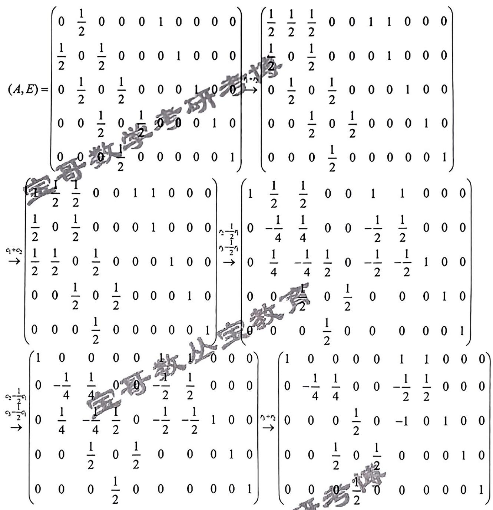
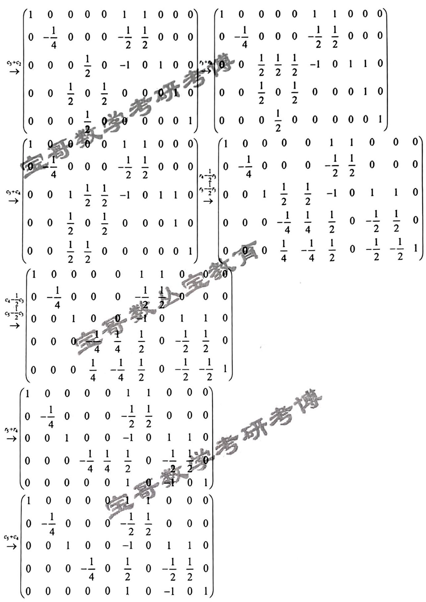
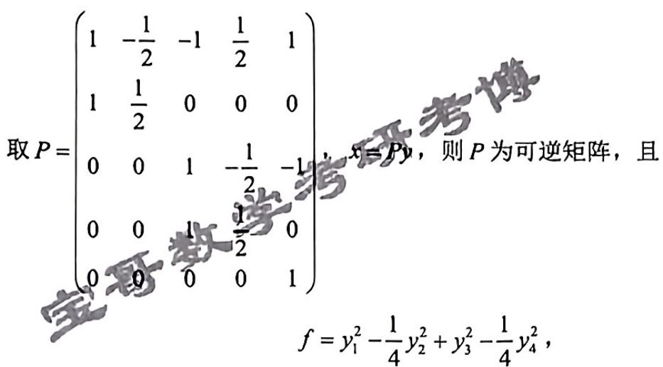

## QUESTION 1

### QUESTION TYPE

short_answer

### QUESTION

求一个4次实系数多项式  $f(x)$  ，使得  $f(x)$  被  $x^{2} + 1$  除余  $x + 1$  ，被  $x^{3} + x^{2} + 1$ 除余  $x^{2} - 1$ 。

### EXPLANATION

令  $f(x) = (a x^{2} + b x + c)(x^{2} + 1) + x + 1$  ，其中，  $a,b,c\in \mathbb{R}$  且  $a\neq 0$  ，故

$$
{\begin{array}{r l}&{f(x)=(a x^{2}+b x+c)(x^{2}+1)+x+1}\\ &{\qquad=a x^{4}+b x^{3}+c x^{2}+a x^{2}+b x+c+x+1}\\ &{\qquad=a x^{4}+b x^{3}+(a+c)x^{2}+(b+1)x+c+1}\\ &{\qquad=(a x+b - a)(x^{3}+x^{2}+1)+(2a - b + c) x^{2} + (-a + b + 1) x + a - b + c + 1}\end{array}}
$$

$f(x)$  被  $x^{3} + x^{2} + 1$  除余  $x^{2} - 1$  ，故

$$
\begin{cases}
2a - b + c = 1 \\
-a + b + 1 = 0 \\
a - b + c + 1 = -1
\end{cases}
$$

求解上述方程组，可得

$$
\left\{a = 3, b = 4, c = 0\right.
$$

故

$$
f(x) = 3 x^{4} + 4 x^{3} + 3 x - 2.
$$

### ANSWER

$f(x) = 3 x^{4} + 4 x^{3} + 3 x - 2$ 。

## QUESTION 2

### QUESTION TYPE

short_answer

### QUESTION

计算  $n$ 阶行列式det(A)，其中  $\nabla_{\lambda}\nabla_{\lambda}\nabla_{\lambda}\nabla_{\lambda}\nabla_{\lambda}\nabla_{\lambda}\nabla_{\lambda}\nabla_{\lambda}\mathcal{A}_{\lambda} = |\lambda_{\lambda} - \lambda_{\lambda}|$ ，条件  $1 \leq \lambda_{\lambda} \leq \cdots \leq \lambda_{\lambda}$。

### EXPLANATION

【解答】

# 【备注1】

本题见题解精粹第2讲2.1例6。

### ANSWER

（图片题解见上）

## QUESTION 3

### QUESTION TYPE

proof

### QUESTION

设 $\mathcal{A}$ 为 $n$ 阶非零实方阵，$\mathcal{A}^{\bullet}$为$\mathcal{A}$的伴随矩阵，$\mathcal{A}^T$为$\mathcal{A}$的转置矩阵，当$\mathcal{A}^T = \mathcal{A}^{\bullet}$时，证明：$\det(\mathcal{A}) \neq 0$。

### ANSWER

$\mathcal{A}$  为  $n$  阶非零实方阵，故  $\mathcal{A}^T\mathcal{A}$  为半正定但非零的矩阵。

$\boldsymbol{A}^{T} = \boldsymbol{A}^{\bullet}$，故

$$
\boldsymbol{A}^{T}\boldsymbol{A} = \boldsymbol{A}^\bullet \boldsymbol{A} = \det(\boldsymbol{A}) \boldsymbol{E}.
$$

又 $\boldsymbol{A}^T \boldsymbol{A}$ 为半正定但非零的矩阵，故必然有 $\det(\boldsymbol{A}) > 0$，故 $\det(\boldsymbol{A}) \neq 0$。

## QUESTION 4

### QUESTION TYPE

short_answer

### QUESTION

设

$$
\boldsymbol{A} = \begin{pmatrix}1 & 1 & -1 \\ 2 & 1 & 0 \\ 1 & -1 & 0 \end{pmatrix}, \quad \boldsymbol{B} = \boldsymbol{A}' = 2\boldsymbol{A}' \boldsymbol{A} 3 \boldsymbol{E},
$$

其中 $E$ 为单位矩阵。问 $B$ 是否可逆，若可逆，求 $B^{-1}$；若不可逆，说明理由。

### EXPLANATION

$A$ 的特征多项式为

$$
f(x) = |x E - A| = x^3 - 2 x^2 - 3.
$$

令 $g(x) = x^5 - 2 x^4 +3$，进行欧几里得算法计算：

$$
\begin{array}{rl}
& \left(\begin{array}{ccc} f(x) & 1 & 0 \\ g(x) & 0 & 1 \end{array}\right) = \cdots \rightarrow \left(\begin{array}{ccc} -x -1 & \frac{1}{3} x^{3} - \frac{2}{3} x^{2} + 1 & -\frac{1}{3} x + \frac{2}{3} \\ 1 & \frac{1}{6} (x^{4} - 3x^{3} + x^{2} + 3x -3) & \frac{1}{6}(-x^{2} +3x -1) \end{array}\right)
\end{array}
$$

故

$$
\frac{1}{6}(x^{4} - 3x^{3} + x^{2} + 3x -3) f(x) + \frac{1}{6}(-x^{2} + 3x - 1) g(x) = 1.
$$

代入矩阵 $A$ 得

$$
E = \frac{1}{6}(-A^2 + 3A - E) B,
$$

故 $B$ 可逆，且

$$
B^{-1} = \frac{1}{6}(-A^2 + 3A - E) = \frac{1}{6} \left[- \begin{pmatrix}1 & 1 & -1 \\ 2 & 1 & 0 \\ 1 & -1 & 0 \end{pmatrix}^2 + 3 \begin{pmatrix}1 & 1 & -1 \\ 2 & 1 & 0 \\ 1 & -1 & 0 \end{pmatrix} - E \right].
$$

计算后，

$$
B^{-1} = \begin{pmatrix} 0 & 0 & -\frac{1}{3} \\ \frac{1}{3} & -\frac{1}{6} & \frac{1}{3} \\ \frac{2}{3} & \frac{1}{2} & 0 \end{pmatrix}.
$$

### ANSWER

$B$ 可逆，且

$$
B^{-1} = \begin{pmatrix} 0 & 0 & -\frac{1}{3} \\ \frac{1}{3} & -\frac{1}{6} & \frac{1}{3} \\ \frac{2}{3} & \frac{1}{2} & 0 \end{pmatrix}.
$$

## QUESTION 5

### QUESTION TYPE

short_answer

### QUESTION

设

$$
A = \begin{pmatrix} a & 0 \\ b & c \end{pmatrix},
$$

其中 $a,b,c$ 为实数，试求 $a,b,c$ 的一切可能值，使得

$$
A^{20} = \begin{pmatrix}1 & 0 \\ 0 & 1 \end{pmatrix}.
$$

### EXPLANATION

$A$ 的特征值为 $a,c$，均为实数。$A^{20}$ 的特征值为 $a^{20}, c^{20}$。

若 $A^{20} = E$，则 $a^{20} = c^{20} = 1$，故 $a = \pm 1$，$c = \pm 1$。

(1) 若 $a,c$ 一为 $1$，一为 $-1$，则 $A$ 相似于

$$
\begin{pmatrix}1 & 0 \\ 0 & -1 \end{pmatrix},
$$

故 $A^{20} = E$。

(2) 若 $a = c = 1$，则

$$
A = \begin{pmatrix}1 & 0 \\ b & 1 \end{pmatrix} = E_2 + b \begin{pmatrix}0 & 0 \\ 1 & 0 \end{pmatrix}.
$$

利用二项式定理得

$$
A^{20} = E_2 + 20 b \begin{pmatrix}0 & 0 \\ 1 & 0 \end{pmatrix}.
$$

故 $A^{20} = E_2$ 当且仅当 $b=0$。

(3) 若 $a = c = -1$，则

$$
A^{20} = \left(\begin{pmatrix} -1 & 0 \\ b & -1 \end{pmatrix}\right)^{20} = \left(\begin{pmatrix}1 & 0 \\ -b & 1 \end{pmatrix}\right)^{20}.
$$

故 $-b=0$，即 $b=0$。

综上，

- $a,c$ 一为 $1$，一为 $-1$，$b$ 任意实数；
- 或 $a = c =1, b=0$；
- 或 $a=c=-1, b=0$。

### ANSWER

$$
\begin{cases}
a = 1, c = -1, b \in \mathbb{R}, \text{ 或 } \\
a = -1, c = 1, b \in \mathbb{R}, \text{ 或 } \\
a = c = 1, b = 0, \text{ 或 } \\
a = c = -1, b = 0.
\end{cases}
$$

## QUESTION 6

### QUESTION TYPE

short_answer

### QUESTION

用非退化线性替换化二次型

$$
f(x_1, x_2, x_3, x_4, x_5) = x_1 x_2 + x_2 x_3 + x_2 x_4 + x_4 x_5
$$

为标准形。

### EXPLANATION

二次型 $f$ 的矩阵为

$$
A = \begin{pmatrix}
0 & \frac{1}{2} & 0 & 0 & 0 \\
\frac{1}{2} & 0 & \frac{1}{2} & \frac{1}{2} & 0 \\
0 & \frac{1}{2} & 0 & 0 & 0 \\
0 & \frac{1}{2} & 0 & 0 & \frac{1}{2} \\
0 & 0 & 0 & \frac{1}{2} & 0
\end{pmatrix}.
$$

（注：原矩阵排版可能有误，以上为对称形式）

具体过程见下图：

利用配方法和初等变换可化为标准形。

### ANSWER

标准形已由图片演算给出，详见图片。

## QUESTION 7

### QUESTION TYPE

short_answer

### QUESTION

设

$$
A = \begin{pmatrix}
1 & -3 & 0 & 3 \\
-2 & -6 & 0 & 13 \\
0 & -3 & 1 & 3 \\
-1 & -4 & 0 & 8
\end{pmatrix},
$$

求矩阵 $A$ 的若当标准形。

### EXPLANATION

$A$ 的特征多项式为

$$
\begin{aligned}
|\lambda E - A| &= \begin{vmatrix}
\lambda -1 & 3 & 0 & -3 \\
2 & \lambda +6 & 0 & -13 \\
0 & 3 & \lambda -1 & -3 \\
1 & 4 & 0 & \lambda -8
\end{vmatrix} \\
&= (\lambda -1)^4.
\end{aligned}
$$

故特征值为 $1$ 重数4。

计算

$$
A - E = \begin{pmatrix}
0 & -3 & 0 & 3 \\
-2 & -7 & 0 & 13 \\
0 & -3 & 0 & 3 \\
-1 & -4 & 0 & 7
\end{pmatrix} \to \begin{pmatrix}
1 & 4 & 0 & -7 \\
0 & 1 & 0 & -1 \\
0 & 0 & 0 & 0 \\
0 & 0 & 0 & 0
\end{pmatrix},
$$

故秩 $r(A - E) = 2$，有 $2$ 个线性无关特征向量。

计算

$$
(A - E)^2 = \begin{pmatrix}
3 & 9 & 0 & -18 \\
1 & 3 & 0 & -6 \\
3 & 9 & 0 & -18 \\
1 & 3 & 0 & -6
\end{pmatrix}, \quad (A - E)^3 = 0.
$$

故 $(\lambda -1)^3$ 为最小多项式，最大Jordan块阶数为3。

$A$ 的若当标准形为

$$
\begin{pmatrix}
1 & 0 & 0 & 0 \\
0 & 1 & 1 & 0 \\
0 & 0 & 1 & 1 \\
0 & 0 & 0 & 1
\end{pmatrix}.
$$

### ANSWER

$A$ 的若当标准形为

$$
\begin{pmatrix}
1 & 0 & 0 & 0 \\
0 & 1 & 1 & 0 \\
0 & 0 & 1 & 1 \\
0 & 0 & 0 & 1
\end{pmatrix}.
$$

## QUESTION 8

### QUESTION TYPE

short_answer

### QUESTION

设 $T$ 为 $R^3 \to R^3$ 的线性变换，已知：

$$
T(1,0,0) = (1,0,1), \quad T(0,1,0) = (2,1,1), \quad T(0,0,1) = (-1,1,-2).
$$

(1) 用矩阵 $A$ 表示此变换：

$$
T(x_1, x_2, x_3) = (x_1, x_2, x_3) A.
$$

(2) 求出满足 $TX = 0 (X \in R^3)$ 的全体点 $X$。

### EXPLANATION

(1) 根据线性变换定义：

$$
T(x_1,x_2,x_3) = x_1 T(1,0,0) + x_2 T(0,1,0) + x_3 T(0,0,1) = (x_1, x_2, x_3) \begin{pmatrix}1 & 2 & -1 \\ 0 & 1 & 1 \\ 1 & 1 & -2 \end{pmatrix}.
$$

故取

$$
A = \begin{pmatrix} 1 & 2 & -1 \\ 0 & 1 & 1 \\ 1 & 1 & -2 \end{pmatrix}.
$$

(2) 求解 $TX=0$ 即

$$
(x_1, x_2, x_3) A = 0,
$$

即

$$
A^T \begin{pmatrix} x_1 \\ x_2 \\ x_3 \end{pmatrix} = 0,
$$

考虑 $A^T = \begin{pmatrix}
1 & 0 & 1 \\
2 & 1 & 1 \\
-1 & 1 & -2
\end{pmatrix}$，对其化简得：

$$
\begin{pmatrix}
1 & 0 & 1 \\
0 & 1 & 1 \\
0 & 0 & 0
\end{pmatrix}.
$$

解得通解为

$$
X = k \begin{pmatrix} 3 \\ -1 \\ 1 \end{pmatrix}, \quad k \in \mathbf{R}.
$$

### ANSWER

(1) 线性变换矩阵

$$
A = \begin{pmatrix} 1 & 2 & -1 \\ 0 & 1 & 1 \\ 1 & 1 & -2 \end{pmatrix}.
$$

(2) 核空间基为

$$
\{(3, -1, 1)\}, \quad TX=0 \text{ 的全体点为 } X = k(3, -1, 1), k \in \mathbf{R}.
$$

## QUESTION 9

### QUESTION TYPE

proof

### QUESTION

设 $A$ 为 $n$ 阶实对称矩阵，$C$ 为 $n$ 阶实反对称矩阵，且 $AC = CA$，$A - C$ 为满秩矩阵。证明：

$$
(A + C)(A - C)^{-1} \text{ 为正交矩阵}.
$$

### ANSWER

有

$$
\begin{aligned}
&\left[(A+C)(A-C)^{-1}\right]^T (A+C)(A-C)^{-1} \\
= & \left[(A - C)^{-1}\right]^T (A+C)^T (A+C)(A-C)^{-1} \\
= & \left[(A - C)^T\right]^{-1} (A^T + C^T)(A+C)(A-C)^{-1} \\
= & (A^T - C^T)^{-1} (A^T + C^T)(A + C)(A - C)^{-1} \\
= & (A - C)^{-1} (A + C)(A + C)(A - C)^{-1} \quad \text{（$A^T=A$, $C^T=-C$，且 $AC=CA$）} \\
= & E.
\end{aligned}
$$

因此，

$$
\left[(A + C)(A - C)^{-1}\right]^T (A + C)(A - C)^{-1} = E,
$$

证明了该矩阵为正交矩阵。

## QUESTION 10

### QUESTION TYPE

proof

### QUESTION

设 $A$ 是 $n$ 阶方阵。证明：

$$
A^{2} = E \iff r(A + E) + r(A - E) = n,
$$

其中 $E$ 为 $n$ 阶单位矩阵。

### ANSWER

引入结论：

设 $A \in P^{n\times n}$，$f(x), g(x) \in P[x]$ 满足 $\gcd(f,g) = 1$，$W, W_f, W_g$ 分别为线性方程组

$$
f(A) g(A) x = 0, \quad f(A) x = 0, \quad g(A) x = 0
$$

的解空间，则

$$
W = W_f \oplus W_g.
$$

证明如下：

由 $\gcd(f,g) = 1$，存在 $u(x), v(x)$ 使得

$$
u(x)f(x) + v(x)g(x) = 1,
$$

代入矩阵 $A$ 得

$$
u(A) f(A) + v(A) g(A) = I.
$$

对任意 $\alpha \in W$，有

$$
f(A) g(A) \alpha = 0, \quad \text{则}
$$

$$
\alpha = u(A) f(A) \alpha + v(A) g(A) \alpha,
$$

且

$$
g(A) u(A) f(A) \alpha = 0, \quad f(A) v(A) g(A) \alpha = 0,
$$

故

$$
u(A) f(A) \alpha \in W_g, \quad v(A) g(A) \alpha \in W_f.
$$

由此

$$
W = W_f + W_g, \quad W_f \cap W_g = \{0\},
$$

故

$$
W = W_f \oplus W_g.
$$

于是维数满足

$$
\dim W = \dim W_f + \dim W_g,
$$

即

$$
n - r(f(A) g(A)) = n - r(f(A)) + n - r(g(A)),
$$

即

$$
r(f(A) g(A)) = r(f(A)) + r(g(A)) - n.
$$

设 $f(x) = x - 1$, $g(x) = x + 1$，则 $(f,g) = 1$。

由条件 $A^2 = E$，即 $(A + E)(A - E) = 0$。

故

$$
r((A + E)(A - E)) = 0 \iff r(A + E) + r(A - E) = n.
$$

