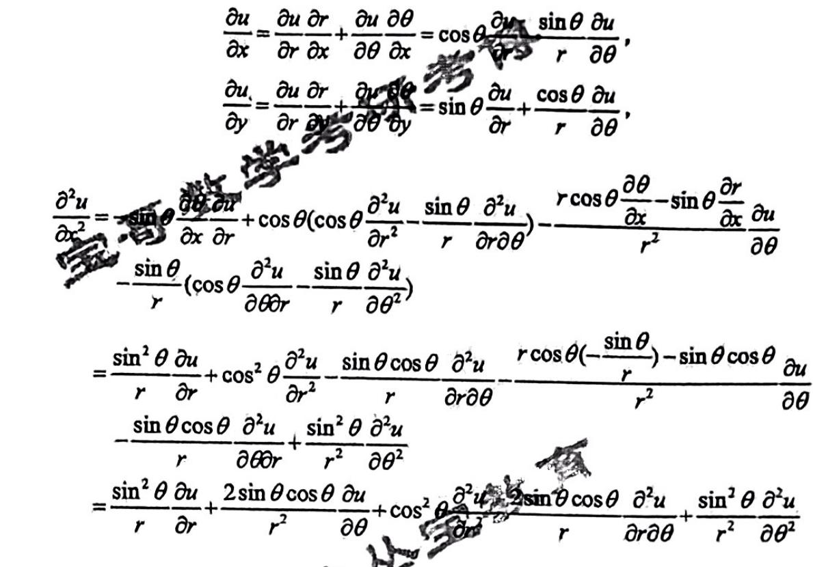
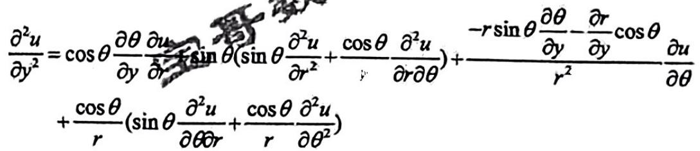
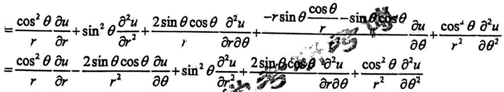

## QUESTION 1

### QUESTION TYPE

short_answer

### QUESTION

(1) 定义在 (1,2) 上的连续函数一定有最小值。

### EXPLANATION

取  $f(x) = x, x \in (1,2)$ ，则其为定义在 (1,2) 上的连续函数，但没有最小值。

### ANSWER

错误。

## QUESTION 2

### QUESTION TYPE

short_answer

### QUESTION

(2) 单调数列若有一个收敛子列，其自身也一定收敛。

### EXPLANATION

正确！不妨设  $\{a_{n}\}$  为单调递增数列，  $\{a_{n}\}$  有收敛子列  $\{a_{p_{n}}\}$  ，则  $\{a_{p_{n}}\}$  有上界。由于  $\{a_{n}\}$  为单调递增数列，且  $n \leq p_{n}$ ，故  $a_{n} \leq a_{p_{n}}$ ，故  $\{a_{p_{n}}\}$  有上界。由单调有界准则，  $\{a_{n}\}$  收敛。

### ANSWER

正确。

## QUESTION 3

### QUESTION TYPE

short_answer

### QUESTION

(3) 若级数  $\sum_{n=1}^{\infty} a_{n}$  条件收敛，则  $\sum_{n=1}^{\infty} (a_{n})^{2}$  也条件收敛。

### EXPLANATION

错误！取  $a_{n} = \frac{(-1)^{n-1}}{n}, n=1,2,\dots$ ，则级数  $\sum_{n=1}^{\infty} a_{n}$  条件收敛，但  $\sum_{n=1}^{\infty} (a_{n})^{2}$  绝对收敛。

### ANSWER

错误。

## QUESTION 4

### QUESTION TYPE

short_answer

### QUESTION

(4) 黎曼可积函数一定是连续函数。

### EXPLANATION

错误！  
$R(x) = \begin{cases} 
1 & x \in \mathbb{Q} \\[6pt]
0 & x \notin \mathbb{Q} 
\end{cases}$ ，则 $R(x)$ 在 [0,1] 上可积，但 $R(x)$ 却不是连续函数。

### ANSWER

错误。

## QUESTION 5

### QUESTION TYPE

short_answer

### QUESTION

(5) 若  $\{f_{n}\}_{n=1}^{\infty}$  是在 (0,1) 上的一列可导函数，且  $f_{n}$  逐点收敛到函数  $f$ ，则  $f$  在 (0,1) 上必可导。

### EXPLANATION

错误！

取  $f_{n}(x) = \sqrt{1 + (2x)^{n} + (2x)^{2n}}, x \in (0,1)$ ，则$\{f_{n}\}_{n=1}^{\infty}$ 是在 (0,1) 上的一列可导函数，且 $f_{n}$ 逐点收敛到函数  $f \equiv \max\{1, 2x, (2x)^2\}$ ，其在 (0,1) 上不可导。

### ANSWER

错误。

## QUESTION 6

### QUESTION TYPE

proof

### QUESTION

(1) 写出在区间  $(0, + \infty)$  上不一致连续函数的定义：

(2) 用定义证明  $y = x^{2}$  在  $(0, + \infty)$  上不一致连续

### ANSWER

(1) 如果存在  $\epsilon_{0} > 0$  ,使得对任意  $\delta >0$  ,总存在  $x,y\in (0, + \infty)$  ,使得  $|x - y|< \delta$  但  $|f(x) - f(y)|\geq \epsilon_{0}$  ,则称  $f(x)$  在  $(0, + \infty)$  上不一致连续。

(2) 取  $x_{n} = \sqrt{n}, n = 1,2,\dots$  ,则  $x_{n}\in (0, + \infty)$  ，且  $\lim_{n\to \infty}(x_{n + 1} - x_{n}) = 0$  ，故对任意  $\delta >0$  ，存在正整数  $N$  ，使得对任意  $n > N$  ，恒有  $|x_{n + 1} - x_{n}|< \delta$ ，但

$$
\left|y(x_{n + 1}) - y(x_{n})\right| = |(x_{n+1})^{2} - (x_{n})^{2}| = (n+1) - n = 1 > \frac{1}{2},
$$

故  $y = x^{2}$  在  $(0, + \infty)$  上不一致连续。

(1) 如果存在  $\epsilon_{0} > 0$  ，使得对任意  $\delta > 0$ ，总存在  $x,y \in (0, + \infty)$ ，使得  $|x - y| < \delta$  但  $|f(x) - f(y)| \geq \epsilon_{0}$ ，则称  $f(x)$  在  $(0, + \infty)$  上不一致连续。

(2) $y = x^{2}$  在  $(0, + \infty)$  上不一致连续。

## QUESTION 7

### QUESTION TYPE

short_answer

### QUESTION

二维欧氏空间中的极坐标写作  
$$
\left\{ \begin{array}{l}x = r\cos \theta \\ y = r\sin \theta \end{array} \right.
$$  
关于算子  
$$
\frac{\partial^{2}}{\partial x^{2}} + \frac{\partial^{2}}{\partial y^{2}} + x \partial_{x} + y \partial_{y}
$$  
的表达式。

### EXPLANATION

$$
\left\{ \begin{array}{l}
\cos\theta \, d r - r \sin\theta \, d\theta = d x \\
\sin\theta \, d r + r \cos\theta \, d\theta = d y
\end{array} \right.
$$

$x = r \cos \theta, y = r \sin \theta$ 两边取全微分，得到

$$
\left\{ \begin{array}{l}
d r = \frac{r \cos\theta \, d x + r \sin\theta \, d y}{r} = \cos \theta \, d x + \sin \theta \, d y \\
d \theta = \frac{\cos\theta \, d y - \sin\theta \, d x}{r} = -\frac{\sin\theta}{r} \, d x + \frac{\cos\theta}{r} \, d y
\end{array} \right.
$$

故  
$$
\frac{\partial r}{\partial x} = \cos \theta, \quad \frac{\partial r}{\partial y} = \sin \theta, \quad \frac{\partial \theta}{\partial x} = - \frac{\sin \theta}{r}, \quad \frac{\partial \theta}{\partial y} = \frac{\cos \theta}{r},
$$  
故

故

$$
\begin{array}{c}
x \frac{\partial u}{\partial x} + y \frac{\partial u}{\partial y} = r \cos \theta \left( \cos\theta \frac{\partial u}{\partial r} - \frac{\sin\theta}{r} \frac{\partial u}{\partial \theta} \right) + r \sin \theta \left( \sin \theta \frac{\partial u}{\partial r} + \frac{\cos \theta}{r} \frac{\partial u}{\partial \theta} \right) \\
= r \frac{\partial u}{\partial r}
\end{array}
$$

故

$$
\left(\frac{\partial^{2}}{\partial x^{2}} + \frac{\partial^{2}}{\partial y^{2}} + x \partial_{x} + y \partial_{y}\right) u = \frac{\partial^{2} u}{\partial r^{2}} + \frac{1}{r^{2}} \frac{\partial^{2} u}{\partial \theta^{2}} + \left(r + \frac{1}{r}\right) \frac{\partial u}{\partial r},
$$

故

$$
\frac{\partial^{2}}{\partial x^{2}} + \frac{\partial^{2}}{\partial y^{2}} + x \partial_{x} + y \partial_{y} = \frac{\partial^{2}}{\partial r^{2}} + \frac{1}{r^{2}} \frac{\partial^{2}}{\partial \theta^{2}} + \left(r + \frac{1}{r}\right) \frac{\partial}{\partial r}.
$$

### ANSWER

$$
\frac{\partial^{2}}{\partial x^{2}} + \frac{\partial^{2}}{\partial y^{2}} + x \partial_{x} + y \partial_{y} = \frac{\partial^{2}}{\partial r^{2}} + \frac{1}{r^{2}} \frac{\partial^{2}}{\partial \theta^{2}} + \left(r + \frac{1}{r}\right) \frac{\partial}{\partial r}.
$$

## QUESTION 8

### QUESTION TYPE

short_answer

### QUESTION

设函数  $f(x)$  在[-1,1]上连续，计算：  
$\displaystyle \lim_{h\to 0}\frac{\int_{0}^{h}(x - h)f(x)dx}{\sin(h)}.$

### EXPLANATION

函数  $f(x)$  在[-1,1]上连续，故

$$
\begin{array}{rl}
 & \underset {h\to 0}{\lim}\frac{\int_{0}^{h}(x - h)f(x)d x}{\sin(h)} = \underset {h\to 0}{\lim}\frac{\int_{0}^{h}x f(x)d x - h\int_{0}^{h}f(x)d x}{\sin(h)} \\
= & \underset {h\to 0}{\lim}\frac{h f(h) - \int_{0}^{h}f(x)d x - h f(h)}{1} = -\underset {h\to 0}{\lim}\int_{0}^{h}f(x)d x = 0
\end{array}
$$

### ANSWER

0

## QUESTION 9

### QUESTION TYPE

short_answer

### QUESTION

设函数  $f(x)$  在  $x = a$  处可导，计算：  
$\displaystyle \lim_{h\to 0}\frac{f(a + h) - f(a - 2h)}{\tan(h)}.$

### EXPLANATION

函数  $f(x)$  在  $x = a$  处可导，故

$$
\begin{array}{rl}
 & \underset {h\to 0}{\lim}\frac{f(a + h) - f(a - 2h)}{\tan(h)} = \underset {h\to 0}{\lim}\frac{f(a + h) - f(a - 2h)}{h} \\
= & \underset {h\to 0}{\lim}\left[\frac{f(a + h) - f(a)}{h} + 2\frac{f(a - 2h) - f(a)}{-2h}\right] = f^{\prime}(a) + 2f^{\prime}(a) \\
= & 3f^{\prime}(a)
\end{array}
$$

### ANSWER

$3f^{\prime}(a)$

## QUESTION 10

### QUESTION TYPE

fill_in_the_blank

### QUESTION

计算：  
$$
\lim_{n\to \infty}\frac{1}{2n} \big[n(n + 1)\dots (2n - 1)\big]^{\frac{1}{n}}.
$$

### EXPLANATION

$$
\begin{array}{l}
\lim_{n\to \infty}\ln \frac{1}{n} \left[n(n + 1)\dots (2n - 1)\right]^{\frac{1}{n}} = \lim_{n\to \infty}\left[\frac{1}{n}\sum_{k = 0}^{n - 1}\ln (n + k) - \ln n\right] \\
= \lim_{n\to \infty}\frac{1}{n}\sum_{k = 0}^{n - 1}\ln \left(1 + \frac{k}{n}\right) = \int_{0}^{1}\ln (1 + x) \, dx = \left[(1 + x)\ln (1 + x) - x\right]\Bigg|_{0}^{1}, \\
= 2\ln 2 - 1
\end{array}
$$

故

$$
\lim_{n\to \infty}\frac{1}{n}\left[n(n + 1)\dots (2n - 1)\right]^{\frac{1}{n}} = e^{2\ln 2 - 1} = \frac{4}{e},
$$

故

$$
\lim_{n\to \infty}\frac{1}{2n}\left[n(n + 1)\dots (2n - 1)\right]^{\frac{1}{n}} = \frac{2}{e}.
$$

### ANSWER

$\displaystyle \frac{2}{e}$

## QUESTION 11

### QUESTION TYPE

bybrid

### QUESTION

(1)计算曲面  $x^{2} + y^{2} - z = 0$  与  $0\leq z\leq 4$  围成的区域的体积；

(2)易观点  $P = (1,\sqrt{2},3)$  在曲面  $x^{2} + y^{2} - z = 0$  上，计算  $P$  点处该曲面的切平面的一组极大线性无关向量组；

(3)记  $C$  为曲面  $\left\{(x,y,z):x^{2} + y^{2} = z,0\leq z\leq 4\right\}$  与平面  $x + y = 2$  的交线，证明  $C$  的弧长大于4.

### EXPLANATION

(1)方法一

曲面  $x^{2} + y^{2} - z = 0$  与  $0\leq z\leq 4$  围成的区域的体积为

$$
V = \int_{0}^{1}\int_{0}^{1}(4 - x^{2} - y^{2})dxdy = \int_{0}^{2}(4 - r^{2})rdr\int_{0}^{2\pi}d\theta = 8\pi .
$$

方法二

曲面  $x^{2} + y^{2} - z = 0$  与  $0\leq z\leq 4$  围成的区域的体积为

$$
\int_{0}^{4}dz\int_{x^{2} + y^{2}\leq z}dxdy = \pi \int_{0}^{4}zdz = \frac{1}{2}\pi z^{2}\Big|_{0}^{4} = 8\pi
$$

(2)  $x^{2} + y^{2} - z = 0$  ，  $z_{x} = 2x,z_{y} = 2y$  ，都是连续的，  

$z_{x}(1,\sqrt{2}) = 2$, $z_{y}(1,\sqrt{2}) = 2\sqrt{2}$，故曲面在  $P = (1,\sqrt{2},3)$  处的切平面为

$$
2(x - 1) + 2\sqrt{2} (y - \sqrt{2}) - (z - 3) = 0,
$$

即

$$
z = 2x + 2\sqrt{2} y - 3,
$$

该平面上的点用向量表示为

$$
X = (x, y, 2x + 2\sqrt{2} y - 3) = x(1, 0, 2) + y(0, 1, 2\sqrt{2}) + (0, 0, -3),
$$

该平面上的向量的一个极大无关向量组为

$$
(1,0,2), \quad (0,1,2\sqrt{2}).
$$

(注：原答案中列出的向量组包括平面上一点的平移，与向量无关，应改为上述两个向量为切平面上的极大线性无关向量组)

(3)  $C$  为曲面  $\left\{(x,y,z):x^{2} + y^{2} = z,0\leq z\leq 4\right\}$  与平面  $x + y = 2$  的交线，其参数方程为  

$$
\left\{
\begin{array}{l}
x = t, \\
y = 2 - t, \\
z = t^{2} + (2 - t)^{2}
\end{array}
\right.
$$

由  $0 \leq z \leq 4$ ，即

$$
t^{2} + (2 - t)^{2} = 2t^{2} - 4t + 4 \leq 4,
$$

即  $0 \leq t \leq 2$。

因此曲线  $C$  的弧长为

$$
\begin{aligned}
l &= \int_{0}^{2}\sqrt{\left(\frac{d x}{d t}\right)^{2} + \left(\frac{d y}{d t}\right)^{2} + \left(\frac{d z}{d t}\right)^{2}}\, dt \\
&= \int_{0}^{2}\sqrt{1^{2} + (-1)^{2} + (4t - 4)^{2}}\, dt \\
&> \int_{0}^{2}\sqrt{(4t - 4)^{2}}\, dt = \int_{0}^{2} |4t - 4|\, dt \\
&= 4 \int_{0}^{2} |t - 1|\, dt = 8 \int_{1}^{2} (t - 1)\, dt \\
&= 4 (t - 1)^{2}\Big|_{1}^{2} = 4.
\end{aligned}
$$

故曲线  $C$  的弧长大于4.

### ANSWER

(1) 区域体积为  $8\pi$ ；

(2) 该平面上的极大线性无关向量组为  $(1,0,2)$  和  $(0,1,2\sqrt{2})$ ；

(3) 曲线  $C$  的弧长大于4.

## QUESTION 12

### QUESTION TYPE

short_answer

### QUESTION

求级数  $\sum_{n = 0}^{\infty}\frac{x^{n} + 2}{n!}$  的收敛半径，并求其和函数.

### EXPLANATION

我们已经知道幂级数展开式  $e^{x} = \sum_{n = 0}^{\infty}\frac{x^{n}}{n!},x\in (- \infty , + \infty)$  ，故

$$
\begin{array}{r l} 
& {\sum_{n = 0}^{\infty}\frac{x^{n}(n + 2)}{n!} = \sum_{n = 0}^{\infty}\frac{n x^{n}}{n!} +2\sum_{n = 0}^{\infty}\frac{x^{n}}{n!} = \sum_{n = 1}^{\infty}\frac{n x^{n}}{n!} +2e^{x} = \sum_{n = 1}^{\infty}\frac{e^{2x}}{(n - 1)!} +2e^{x}}\\ 
& {= \sum_{n = 0}^{\infty}\frac{x^{n + 1}}{n!} +2e^{x} = \sum_{n = 0}^{\infty}\frac{x^{n}}{n!} +2e^{x} = x e^{x} = 2e^{x} = (x + 2)e^{x}} 
\end{array}
$$

收敛半径为  $+\infty$

### ANSWER

收敛半径为  $+\infty$ ，和函数为  $(x + 2)e^{x}$

## QUESTION 13

### QUESTION TYPE

proof

### QUESTION

设函数  $f(x)$  在[0,1]上连续，求证：

$$
\lim_{n\to \infty}\int_{0}^{1}x^{n}f(x)d x = 0.
$$

### ANSWER

函数  $f(x)$  在  $[0,1]$  上连续, 故函数  $f(x)$  在  $[0,1]$  上有界, 即存在正常数  $M$ , 使得对任意  $x\in [0,1]$ , 有  $\left|f(x)\right| \leq M$ , 故对任意正整数  $n$ , 有

$$
\left|\int_{0}^{1}x^{n}f(x)dx\right| \leq \int_{0}^{1}x^{n}\left|f(x)\right|dx \leq M\int_{0}^{1}x^{n}dx = \frac{M}{n + 1} \to 0, n\to \infty ,
$$

由夹逼准则,  $\lim_{n\to \infty}\left|\int_{0}^{1}x^{n}f(x)dx\right| = 0$ , 也就是  $\lim_{n\to \infty}\int_{0}^{1}x^{n}f(x)dx = 0$ .

## QUESTION 14

### QUESTION TYPE

proof

### QUESTION

若函数  $f(x)$  在[0,1]上连续可微，求证：

$$
\lim_{n\to \infty}n\int_{0}^{1}x^{n}f(x)dx = f(1).
$$

### ANSWER

函数  $f(x)$  在  $[0,1]$  上连续可微, 故  $f^{\prime}(x)$  在  $[0,1]$  上连续. 对任意正整数  $n$ , 有

$$
n\int_{0}^{1}x^{n}f(x)dx = \frac{n}{n + 1}\int_{0}^{1}f(x)dx^{n + 1} = \frac{n}{n + 1} x^{n + 1}f(x)\left|_{0}^{1} - \frac{n}{n + 1}\int_{0}^{1}x^{n + 1}f^{\prime}(x)dx\right.
$$

$$
= \frac{n}{n + 1} f(1) - \frac{n}{n + 1}\int_{0}^{1}x^{n + 1}f^{\prime}(x)dx
$$

$\lim_{n\to \infty}\frac{n}{n + 1} f(1) = f(1)$ . 由(1),  $\lim_{n\to \infty}\int_{0}^{1}x^{n + 1}f^{\prime}(x)dx = 0$ , 故

$$
\lim_{n\to \infty}\frac{n}{n + 1}\int_{0}^{1}x^{n + 1}f^{\prime}(x)dx = \lim_{n\to \infty}\frac{n}{n + 1}\lim_{n\to \infty}\int_{0}^{1}x^{n + 1}f^{\prime}(x)dx = 0,
$$

故  $\lim_{n\to \infty}n\int_{0}^{1}x^{n}f(x)dx = f(1)$ 。

