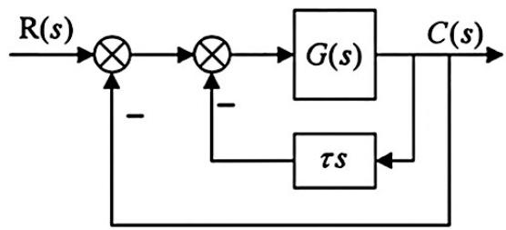
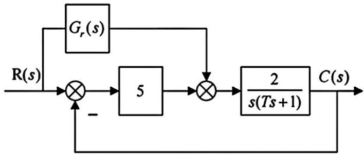
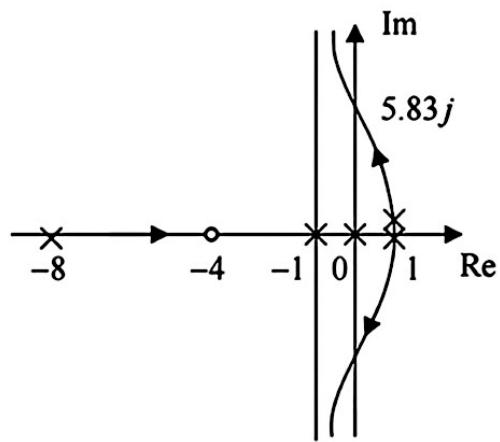
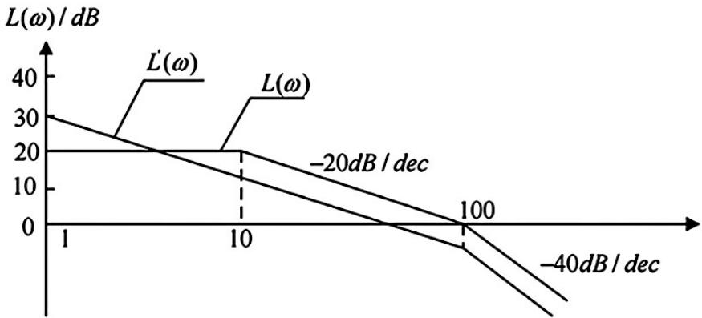
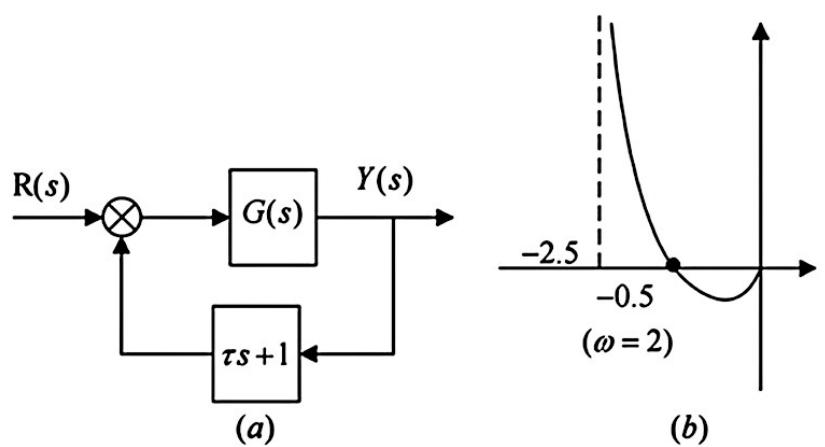

## QUESTION 1

### QUESTION TYPE

short_answer

### QUESTION

某单位负反馈系统的开环传递函数为  
$$G(s) = \frac{16}{s(0.25s + 1)}$$ 。

(1) 求系统的超调量  $\sigma \%$  ，调节时间  $t_{s}$ 。

(2) 选择适当的校正方式，使系统在无阻尼自然振荡频率不变的情况下满足  $\sigma \% \leq 16.3\%$ 。

### EXPLANATION

(1) 由单位负反馈系统的开环传递函数可得闭环传递函数:

$$
\Phi (s) = \frac{G(s)}{1 + G(s)} = \frac{16}{0.25s^2 + s + 16} = \frac{64}{s^2 + 4s + 64}
$$

特征方程:  $\mathbf{D}(s) = s^2 +4s + 64 = 0$

对比二阶系统的一般特征方程可得:

$$
\left\{ \begin{array}{l}
2\zeta \omega_{\mathfrak{n}} = 4 \\
\omega_{\mathfrak{n}}^2 = 64
\end{array} \right.
\Rightarrow
\left\{ \begin{array}{l}
\zeta = 0.25 \\
\omega_{\mathfrak{n}} = 8
\end{array} \right.
$$

超调量:  
$$
\sigma \% = \mathrm{e}^{- \frac{\zeta \pi}{\sqrt{1 - \zeta^2}}} \times 100\% = 44.4\%
$$

调节时间:  
$$
t_s = \frac{3}{\omega_n \zeta} = 1.5 \quad (\Delta = 5\%), \quad t_s = \frac{4}{\omega_n \zeta} = 2 \quad (\Delta = 2\%)
$$

(2) 方法一: 比例微分校正

观察一般二阶系统的特征方程:  
$$
\mathbf{D}(s) = s^2 + 2 \zeta \omega_n s + \omega_n^2 = 0
$$

无阻尼自然振荡频率  $\omega_n$  可以由常数项  $\omega_n^2$  得到。  
如需  $\omega_n$  不变, 需保持特征方程常数项不变,  
设串联校正环节(比例微分)为:  
$$
\mathbf{G}_c (s) = \tau s + 1
$$

校正后的系统开环传递函数:  
$$
\mathbf{G}^*(s) = \frac{16(\tau s + 1)}{s(0.25s + 1)}
$$

特征方程:

$$
\begin{aligned}
\mathbf{D}^*(s) &= s(0.25s + 1) + 16(\tau s + 1) = 0 \\
&\Rightarrow s^2 + (4 + 64 \tau) s + 64 = 0
\end{aligned}
$$

由超调量要求:  
$$
\sigma\% = \mathrm{e}^{- \frac{\zeta \pi}{\sqrt{1 - \zeta^2}}} \times 100\% < 16.3\% \Rightarrow \zeta > 0.5
$$

对比特征方程系数，有:  
$$
4 + 64 \tau = 2 \zeta \omega_n \Rightarrow \zeta = 0.25 + 4 \tau > 0.5
$$

解得:  
$$
\tau > \frac{1}{16}
$$

因此只要  $\tau > \frac{1}{16}$  ，选用  $\mathbf{G}_c (s) = \tau s + 1$  的串联校正方式，  
可以满足题目  $\sigma\% < 16.3\%$  的要求。

方法二: 测速反馈

闭环传递函数为:

$$
\Phi(s) = \frac{\frac{G(s)}{1 + \tau s G(s)}}{1 + \frac{G(s)}{1 + \tau s G(s)}} = \frac{64}{s^2 + (4 + 64 \tau) s + 64}
$$

特征方程:  
$$
\mathbf{D}(s) = s^2 + (4 + 64 \tau) s + 64 = 0
$$

对比二阶系统的一般特征方程有:  
$$
\left\{
\begin{array}{l}
2 \zeta \omega_n = 4 + 64 \tau \\
\omega_n^2 = 64
\end{array}
\right.
\Rightarrow
\left\{
\begin{array}{l}
\zeta = 0.25 + 4 \tau \\
\omega_n = 8
\end{array}
\right.
$$

无阻尼自然振荡频率不变，要使  
$$
\sigma\% < 16.3\% \Rightarrow \zeta > 0.5
$$

故  
$$
0.25 + 4 \tau > 0.5 \Rightarrow \tau > \frac{1}{16}
$$

因此采用测速反馈控制，且  $\tau > \frac{1}{16}$  时，可以使系统在无阻尼自然振荡频率不变的情况下满足  $\sigma\% < 16.3\%$ 。

### ANSWER

(1) 超调量  $\sigma\% = 44.4\%$ ，调节时间 $t_s = 1.5$秒（5%范围），$t_s = 2$秒（2%范围）。

(2) 采用比例微分校正或测速反馈校正，设定参数满足  
$$
\tau > \frac{1}{16}
$$  
即可满足系统超调量  $\sigma\% \leq 16.3\%$ ，且无阻尼自然振荡频率不变。

## QUESTION 2

### QUESTION TYPE

short_answer

### QUESTION

已知  $\mathbf{G}_{\mathbf{r}}(s) = \mathbf{a}s^2 + \mathbf{b}s,$  a、b为参数，若系统在  $\mathbf{r}(t) = 2t$  的输入信号作用下，稳态误差为零，求  $\mathbf{b}$  的值

### EXPLANATION

【解】  $\Phi (s) = \frac{(5 + G_{r}(s))\frac{2}{s(T + s + 1)}}{1 + 5\frac{s(T + s + 1)}{s(T + s + 1)}} = \frac{10 + 2G_{r}(s)}{T s^{2} + s + 10} = \frac{2a s^{2} + 2b s + 10}{T s^{2} + s + 10}$  

特征方程  $\mathsf{D}(\mathsf{s}) = \mathsf{T}\mathsf{s}^{2} + \mathsf{s} + 10,\mathsf{T} > 0$  时,系统是稳定的。

等效单位负反馈开环传递函数  $\mathsf{G}(s) = \frac{2a s^{2} + 2b s + 10}{(T - 2a)s^{2} + (1 - 2b)s}$ 。

在  $\mathbf{r}(t) = 2t$  的输入信号作用下,误差为0,则系统为二型系统,故  $1 - 2\mathbf{b} = 0$ ，

解得  $\mathbf{b} = 0.5$ 。

### ANSWER

$\mathbf{b} = 0.5$

## QUESTION 3

### QUESTION TYPE

short_answer

### QUESTION

某单位负反馈系统的开环传递函数为  $G(s) = \frac{K_{g}(s + 4)}{(s + 8)(s - 1)^{2}}, K_{g} \geq 0$ 。

(1) 绘制系统的根轨迹；

(2) 若系统具有一个实部为-5的闭环极点，求  $\sigma \%$；

(3) 求系统可能的最短调节时间  $t_{s}(\Delta = 2\%)$ 。

### EXPLANATION

【解】(1) 通题目可知开环传递函数:  $\mathsf{G}(s) = \frac{\mathsf{K}_{\mathsf{g}}(s + 4)}{(s + 8)(s - 1)^{2}}$  又因为系统为单位负反馈系统,因此根轨迹方程为:

$$
\mathsf{G}(s) = \frac{\mathsf{K}_{\mathsf{g}}(s + 4)}{(s + 8)(s - 1)^{2}} = 1
$$

$\mathsf{K}_{\mathsf{g}}$  从  $0\rightarrow +\infty$  变化时,绘制  $180^{\circ}$  根轨迹:

(1)零极点:  $\mathbf{p}_{1} = -8,\mathbf{p}_{2,4} = 1,\mathbf{z}_{1} = -4;\mathbf{n} = 3,\mathbf{m} = 1,\mathbf{n} - \mathbf{m} = 2$

(2)实轴上根轨迹:  $[-8, -4]$

(3)与虚轴交点:特征方程:

$$
\begin{array}{rl}\mathsf{D}(s) & = (s + 8)(s - 1)^2 +\mathsf{K}_g(s + 4)\\ & = s^3 +6s^2 +(K_g - 15)s + 8 + 4K_g = 0 \end{array}
$$

劳斯表:

$$
\begin{array}{c c c}
{{\mathrm{s}^{3}}} & {{1}} & {{\mathrm{K}_{g} - 15}}\\ 
{{\mathrm{s}^{2}}} & {{6}} & {{8 + 4\mathrm{K}_{g}}}\\ 
{{\mathrm{s}^{1}}} & {{\mathrm{K}_{g} - 15 - \frac{8 + 4\mathrm{K}_{g}}{6}}} & {{}}\\ 
{{\mathrm{s}^{0}}} & {{8 + 4\mathrm{K}_{g}}} & {{}}
\end{array}
$$

令  $\mathsf{K}_{g} - 15 - \frac{8 + 4\mathsf{K}_{g}}{6} = 0 \Rightarrow \mathsf{K}_{g} = 49,$  辅助方程:  $6s^{2} + 8 + 4K_g = 0,$  解得  $s = \pm 5.83\mathrm{j}$

于是与虚轴交点为  $(0,\pm 5.83\mathrm{j})$

(4)渐近线:  $\sigma = \frac{-8 + 1 + 1 + 4}{n - m} = -1, 0$ ，与角度为  $\pm \frac{\pi}{2}$

根轨迹如图所示。

(2) 若有一个实部为  $-5$  的闭环极点,则  $\mathbf{s} = -5$  满足特征方程:

$$
\mathsf{D}(-5) = -125 + 150 - 5(\mathsf{K}_g - 15) + 8 + 4\mathsf{K}_g = 0 \Rightarrow \mathsf{K}_g = 108
$$

此时可得:

$$
\begin{array}{rl}\mathsf{D}(\mathsf{s}) & = \mathsf{s}^3 + 6\mathsf{s}^2 + 93\mathsf{s} + 440\\ & = (\mathsf{s} + 5)(\mathsf{s}^2 + \mathsf{s} + 88) = 0 \end{array}
$$

由根轨迹图可以看出,  $\mathbf{s} = -5$  时,有另外两个闭环极点靠近虚轴,为主导极点也就是  $s^2 + s + 88 = 0$  的解,此时系统近似为二阶系统,对应二阶系统的表达式:

$$
\begin{cases}
2\zeta \omega_{\mathrm{n}} = 1 \\
\omega_{\mathrm{n}}^2 = 88
\end{cases}
\Rightarrow
\begin{cases}
\zeta = 0.053 \\
\omega_{\mathrm{n}} = 9.38
\end{cases}
$$

于是超调量为  $\sigma \% = \mathrm{e}^{-\frac{\pi \zeta}{\sqrt{1 - \zeta^2}}} \times 100\% = 84.6\%$

(3) 由根轨迹图像可得,当  $\mathsf{K}_g \to \infty$  时,考虑主导极点的二阶系统特征根具有最小的实部、为渐近线 -1,而由根轨迹上点的坐标的实际物理意义可得:

$$
-1 = -\zeta \omega_{\mathrm{n}}
$$

此时调节时间最短:  

$$
\mathbf{t}_{s} = \frac{4}{\zeta \omega_{\mathrm{n}}} = 4(\mathrm{s})
$$

### ANSWER

(1) 根轨迹如上绘制，包括零极点，实轴根轨迹段，虚轴交点及渐近线；

(2) $\sigma \% = 84.6\%$；

(3) 最短调节时间 $t_{s} = 4$ 秒。

## QUESTION 4

### QUESTION TYPE

short_answer

### QUESTION

某最小相位系统校正前后的对数幅频特性曲线如图示，其中  $L(\omega)$  曲线是校正前系统的对数幅频特性曲线，  $L^{\prime}(\omega)$  曲线是加入某种串联校正环节后系统的对数幅频特性曲线。

(1) 求校正环节的传递函数  $G_{c}(s)$ ，并说明该校正装置属于什么形式；

(2) 求校正前后系统的幅值穿越频率和相角裕度；

(3) 分析校正装置对系统的稳态误差和动态品质  $(\sigma_{p}\% ,t_{s})$  的影响。

### EXPLANATION

(1) 由对数幅频特性线可知:  $\mathbf{v} = 1,\omega_{1} = 100$

$$
20\lg \mathsf{K}_1 = 30 \Rightarrow \mathsf{K}_1 = 31.6
$$

故校正后系统开环传递函数

$$
\mathbf{G}'(\mathbf{s}) = \frac{31.6}{\left(\frac{\mathsf{s}}{100} + 1\right)}
$$

同理，未校正前系统开环传递函数

$$
\begin{array}{r}
\mathsf{G}(\mathsf{s}) = \frac{10}{\left(\frac{\mathsf{s}}{10} + 1\right)\left(\frac{\mathsf{s}}{100} + 1\right)} \\
\mathsf{G}'(\mathsf{s}) = \mathsf{G}_0(\mathsf{s}) \cdot \mathsf{G}(\mathsf{s})
\end{array}
$$

$$
\Rightarrow \mathsf{G}_{\mathsf{a}}(\mathsf{s}) = \frac{\mathsf{G}'(\mathsf{s})}{\mathsf{G}(\mathsf{s})} = \frac{3.16 \cdot \left(\frac{\mathsf{s}}{10} + 1\right)}{\mathsf{s}} = 0.316 + \frac{3.16}{\mathsf{s}}
$$

则校正装置属于滞后校正（PI校正）。

(2) 校正前系统渐进线方程

$$
\mathsf{L}(\omega) = 20 \lg \left\{
\begin{array}{ll}
\frac{10}{10} & \omega \leq 10 \\
\frac{10}{0.1 \omega} & 10 < \omega \leq 100 \\
\frac{10}{0.1 \omega \times 0.01 \omega} & 100 < \omega
\end{array}
\right.
$$

令  $\mathbf{L}(\omega) = 0$，解得截止频率  $\omega_{\mathrm{c}} = 100$。

校正后系统渐进线方程

$$
\mathbf{L}^{\prime}(\omega) = 20 \lg \left\{
\begin{array}{ll}
\frac{31.6}{\omega} & \omega \leq 100 \\
\frac{31.6}{\omega \times 0.01 \omega} & 100 < \omega
\end{array}
\right.
$$

令  $\mathbf{L}^{\prime}(\omega_{\mathrm{c}}^{\prime}) = 0$，

解得截止频率  $\omega_{\mathrm{c}}^{\prime} = 31.6$。

校正前:

$$
\gamma (\omega_{\mathrm{c}}) = 180^{\circ} - \arctan \frac{1}{10} \omega_{\mathrm{c}} - \arctan \frac{1}{100} \omega_{\mathrm{c}} = 50.7^{\circ}
$$

校正后:

$$
\gamma (\omega^{\prime}) = 180^{\circ} - 90^{\circ} - \arctan \frac{1}{100} \omega_{\mathrm{c}}^{\prime} = 72.46^{\circ}
$$

(3) 校正前开环系统为 0 型系统，校正后为 I 型系统。滞后校正网络提高系统的型别。未校正前系统闭环传递函数

$$
\Phi (\mathbf{s}) = \frac{\mathbf{G}(\mathbf{s})}{1 + \mathbf{G}(\mathbf{s})} = \frac{10000}{\mathbf{s}^{2} + 110 \mathbf{s} + 11000}
$$

校正后系统闭环传递函数

$$
\Phi^{\prime}(\mathbf{s}) = \frac{\mathbf{G}^{\prime}(\mathbf{s})}{1 + \mathbf{G}^{\prime}(\mathbf{s})} = \frac{3160}{\mathbf{s}^{2} + 100 \mathbf{s} + 3160}
$$

故此系统校正后系统阻尼变大，即  $\sigma_{p}\%$  减小，

由  $t_{p} = \frac{4}{w_{\mathrm{n}} \zeta} (\Delta = 2\%)$  可知，校正后调节时间变长。

### ANSWER

(1) 校正环节传递函数

$$
G_{c}(s) = 0.316 + \frac{3.16}{s}
$$

该校正装置属于滞后校正（PI校正）。

(2) 校正前截止频率  $\omega_{\mathrm{c}} = 100$ ，相角裕度  $50.7^{\circ}$ ；  
校正后截止频率  $\omega_{\mathrm{c}}^{\prime} = 31.6$ ，相角裕度  $72.46^{\circ}$ 。

(3) 校正后系统由0型系统变为I型系统，稳态误差减小，系统阻尼增大，超调率  $\sigma_{p}\%$  减小，但调节时间  $t_{p}$  变长，动态性能有所降低。

## QUESTION 5

### QUESTION TYPE

short_answer

### QUESTION

二阶控制系统的方块图如图(a)所示，开环传递函数的Nyquist图如图(b)所示。

(1) 求系统的开环传递函数；

(2) 判断系统的稳定性；

(3) 通过调节参数  $\pmb{\tau}$  使系统超调量小于等于  $4.3\%$ ，求参数  $\pmb{\tau}$  的取值范围。

### EXPLANATION

【解】(1) 设  $\mathbf{G}(\mathbf{a}) = \frac{\mathbf{K}}{\mathbf{s}(\mathbf{Ts} - \mathbf{1})}$ ，开环传递函数  $\mathbf{G}_{0}(\mathbf{s}) = \frac{\mathbf{K}(\mathbf{s} + \mathbf{1})}{\mathbf{s}(\mathbf{Ts} - \mathbf{1})}$

频率特性：

$$
\mathbf{G}_{0}(\mathbf{j}\omega) = \frac{\mathbf{K}(\tau\omega\mathbf{j} + 1)}{-\mathbf{T}\omega^{2} - \omega\mathbf{j}} = \frac{\mathbf{K}\mathbf{T}\omega^{2} + \mathbf{K}\pi\omega^{2}}{-\mathbf{T}^{2}\omega^{4} - \omega^{2}} + \frac{\mathbf{K}(\tau\mathbf{T}\omega^{a} - \omega)\mathbf{j}}{-\mathbf{T}^{2}\omega^{4} - \omega^{2}} = \mathbf{X}(\omega) + \mathbf{j}\mathbf{Y}(\omega)
$$

$\omega \rightarrow 0^{+}$ 时，实部  $\mathbf{X}(\omega)\rightarrow - \mathbf{K}(\mathbf{T} + \tau)$ ，即  $- \mathbf{K}(\mathbf{T} + \tau) = - 2.5$

$\omega = 2$ 时，  $\mathbf{X}(2) = \frac{4\mathbf{K}\mathbf{T} + \mathbf{4}\mathbf{K}\mathbf{T}}{- 16\mathbf{T} - 4} = - 0.5,\mathbf{Y}(\omega) = 0 \Rightarrow \mathbf{T}\tau = 0.25$

解得  $\mathbf{T} = 1,\tau = 0.25,\mathbf{K} = 2$

故开环传递函数  $\mathbf{G}_{0}(\mathbf{s}) = \frac{2(0.25\mathbf{s} + 1)}{\mathbf{s}(\mathbf{s} - 1)}$

(2) 特征方程  $\mathbf{D}(\mathbf{s}) = \mathbf{s}(\mathbf{s} - 1) + 2(0.25\mathbf{t} + 1) = \mathbf{s}^{2} - 0.5\mathbf{s} + 2$

一次项系数小于 0，故系统不稳定

(3) 超调量  $\sigma \% \leq 4.3\% \Rightarrow \xi \geq \frac{\sqrt{2}}{2}$

特征方程  $\mathbf{D}(\mathbf{s}) = \mathbf{s}^{2} + (2\tau - 1)\mathbf{s} + 2$

对比系数  $\omega_{\mathrm{n}} = \sqrt{2},\xi = \frac{2\tau - 1}{2\sqrt{2}}$

$$
\Leftrightarrow \xi = \frac{2\tau - 1}{2\sqrt{2}} \geq \frac{\sqrt{2}}{2} \Rightarrow \tau \geq 1.5
$$

### ANSWER

(1) 开环传递函数为  $\displaystyle \mathbf{G}_{0}(\mathbf{s}) = \frac{2(0.25\mathbf{s} + 1)}{\mathbf{s}(\mathbf{s} - 1)}$

(2) 系统不稳定

(3) 参数  $\pmb{\tau}$  的取值范围为  $\tau \geq 1.5$

## QUESTION 6

### QUESTION TYPE

bybrid

### QUESTION

已知某线性定常连续系统的状态空间表达式为  
$$
\begin{cases}
\dot{x} = \begin{bmatrix} -1 & 0 \\ 1 & 2 \end{bmatrix} x + \begin{bmatrix} 1 \\ 1 \end{bmatrix} u \\
y = [1 \quad 6] x
\end{cases}
$$  
其中 $\mathbf{u}$ 为单位阶跃输入。

(1) 设初始时刻状态为 $\mathbf{x}(0)$，且已知系统在 $\mathbf{t} = 1$ 和 $\mathbf{t} = 2$ 时刻输出分别为  
$$
y(1) = 4 e^{2} + e^{-1} - 5, \quad y(2) = 4 e^{4} + e^{-2} - 5,
$$  
求系统在任意时刻 $\mathbf{t}$ 的状态响应 $\mathbf{x}(t)$。

(2) 试设计全维观测器，使期望极点为 $-3, -6$。

### EXPLANATION

(1)  
求解矩阵 $(\mathsf{a}I - A)$ 及其逆矩阵：  
$$
\mathsf{a}I - A = \begin{bmatrix} \mathsf{a} + 1 & 0 \\ -1 & \mathsf{a} - 2 \end{bmatrix} \Rightarrow (\mathsf{a}I - A)^{-1} = \begin{bmatrix} \frac{1}{\mathsf{a} + 1} & 0 \\ \frac{1}{\mathsf{a} + 1} + \frac{1}{\mathsf{a} - 2} & \frac{1}{\mathsf{a} - 2} \end{bmatrix}
$$

于是  
$$
\mathbf{e}^{\mathbf{A}t} = \mathcal{L}^{-1}[(sI - A)^{-1}] = \left[- \frac{1}{3} e^{-t} + \frac{1}{3} e^{2t}\right].
$$  

设初始条件为：  
$$
\mathbf{x}(0) = \begin{bmatrix} \mathbf{x}_1(0) \\ \mathbf{x}_2(0) \end{bmatrix},
$$  
则状态响应为：  
$$
\begin{aligned}
\mathbf{x}(t) &= \mathbf{e}^{A t} \mathbf{x}(0) + \int_0^{t} \mathbf{e}^{A (t - \tau)} B u(\tau) d\tau \\
&= \left[-\frac{1}{3} e^{-t} + \frac{1}{3} e^{2 t}\right] \mathbf{x}(0) + \int_0^{t} \left[-\frac{1}{3} e^{- (t - \tau)} + \frac{1}{3} e^{2(t - \tau)}\right] \begin{bmatrix} 1 \\ 1 \end{bmatrix} u(\tau) d\tau \\
&= \left[-\frac{1}{3} e^{-t} + \frac{1}{3} e^{2 t}\right] \mathbf{x}(0) + \text{相应输入响应}
\end{aligned}
$$

输出为  
$$
y(t) = C x(t) = [1 \quad 6] \mathbf{x}(t).
$$

根据已知输出值  
$$
\begin{cases}
y(1) = -5 + (1 - x_1(0)) e^{-1} + (2 x_1(0) + 6 x_2(0) + 4) e^{2} = 4 e^{2} + e^{-1} - 5, \\
y(2) = -5 + (1 - x_1(0)) e^{-2} + (2 x_1(0) + 6 x_2(0) + 4) e^{4} = 4 e^{4} + e^{-2} - 5,
\end{cases}
$$

解得  
$$
\begin{cases}
2 x_1(0) + 6 x_2(0) + 4 = 4, \\
1 - x_1(0) = 1,
\end{cases} \Rightarrow \begin{cases}
x_1(0) = 0, \\
x_2(0) = 0.
\end{cases}
$$

故系统在任意时刻的状态响应为  
$$
\mathbf{x}(t) = \begin{bmatrix} \frac{1}{3} e^{2 t} + \frac{1}{3} e^{-t} - 1 \\ \cdots \end{bmatrix}.
$$

(2)  
系统能观性矩阵为  
$$
Q_0 = \begin{bmatrix} C \\ C A \end{bmatrix} = \begin{bmatrix} 1 & 6 \\ 5 & 12 \end{bmatrix},
$$  
$\mathrm{rank}(Q_0) = 2$，故系统完全能观，观测器存在且其极点可任意配置。

设观测器增益矩阵为  
$$
G = \begin{bmatrix} g_1 \\ g_2 \end{bmatrix}.
$$

观测器特征多项式为  
$$
\begin{aligned}
D(\lambda) &= |\lambda I - (A - G C)| = \left| \begin{array}{cc} \lambda + 1 + g_1 & 6 g_1 \\ g_2 - 1 & \lambda + 6 g_2 - 2 \end{array} \right| \\
&= \lambda^2 + (6 g_2 + g_1 - 1) \lambda + 6 g_2 - 2 + 4 g_1.
\end{aligned}
$$

期望特征多项式为  
$$
D''(\lambda) = (\lambda + 3)(\lambda + 6) = \lambda^2 + 9 \lambda + 18.
$$

令两多项式系数相等得  
$$
\begin{cases}
6 g_2 + g_1 - 1 = 9, \\
6 g_2 - 2 + 4 g_1 = 18,
\end{cases} \Rightarrow
\begin{cases}
g_1 = \frac{10}{3}, \\
g_2 = \frac{10}{9}.
\end{cases}
$$

故观测器增益矩阵为  
$$
G = \begin{bmatrix} \frac{10}{3} \\ \frac{10}{9} \end{bmatrix}.
$$

全维状态观测器的动态方程为  
$$
\dot{\hat{x}} = (A - G C) \hat{x} + B u + G y,
$$  
具体矩阵形式为  
$$
A - G C = \begin{bmatrix}
-1 & 0 \\ 1 & 2
\end{bmatrix} - \begin{bmatrix} \frac{10}{3} \\ \frac{10}{9} \end{bmatrix} [1 \quad 6] 
= \begin{bmatrix}
-1 - \frac{10}{3} & -6 \times \frac{10}{3} \\
1 - \frac{10}{9} & 2 - 6 \times \frac{10}{9}
\end{bmatrix} = \begin{bmatrix}
-\frac{13}{3} & -20 \\
-\frac{1}{9} & -\frac{14}{3}
\end{bmatrix}.
$$

### ANSWER

(1) 系统在任意时刻 $\mathbf{t}$ 的状态响应为  
$$
\mathbf{x}(t) = \begin{bmatrix} \frac{1}{3} e^{2 t} + \frac{1}{3} e^{-t} - 1 \\ \cdots \end{bmatrix}
$$  
且初始状态为 $\mathbf{x}(0) = \begin{bmatrix}0 \\ 0 \end{bmatrix}$。

(2) 观测器增益矩阵为  
$$
G = \begin{bmatrix} \frac{10}{3} \\ \frac{10}{9} \end{bmatrix},
$$  
全维状态观测器动态方程矩阵为  
$$
A - G C = \begin{bmatrix}
-\frac{13}{3} & -20 \\
-\frac{1}{9} & -\frac{14}{3}
\end{bmatrix}.
$$

## QUESTION 7

### QUESTION TYPE

short_answer

### QUESTION

线性定常连续系统满足  
$\left\{\begin{array}{l}\dot{x} = Ax + \left[ \begin{array}{l}3 \\ 0 \end{array} \right] u \\ y = [1 \quad 0] x \end{array}\right.$  
已知状态转移矩阵满足  
$$
\phi^{-1}(t) = \left[ \begin{array}{cc} e^{-kt} & \frac{1}{k+1} (e^{-kt} - e^{t}) \\ 0 & e^{t} \end{array} \right]
$$

(1) 求矩阵 $A$；

(2) 写出对偶系统及对偶系统的传递函数；

(3) 用李雅普诺夫第二法确定使系统渐进稳定的 $k$ 的取值范围。

### EXPLANATION

由状态转移矩阵的性质 $\Phi^{-1}(t) = \Phi(-t), \quad \Phi(0) = A$  

$$
\begin{array}{rl}
& \Phi^{-1}(\mathfrak{t}) = \Phi(-\mathfrak{t}) = \left[ \begin{array}{cc} e^{-\mathfrak{k}\mathrm{t}} & \frac{1}{\mathfrak{k} + 1} \left(e^{-\mathfrak{k} \mathrm{t}} - e^{\mathrm{t}}\right) \\ 0 & e^{\mathrm{t}} \end{array} \right] \\[10pt]
& \mathfrak{z} \Phi(\mathfrak{t}) = \left[ \begin{array}{cc} e^{\mathfrak{k} \mathrm{t}} & \frac{1}{\mathfrak{k} + 1} \left( e^{-\cdots} - e^{-\mathfrak{t}} \right) \\ 0 & e^{-\mathfrak{t}} \end{array} \right] \\[10pt]
& \mathfrak{X} \Phi'(\mathfrak{t}) = \left[ \begin{array}{cc} \mathfrak{k} e^{\mathfrak{s}} & \frac{1}{\mathfrak{k} + 1} \left( \mathfrak{k} e^{\mathfrak{s}} + e^{-\mathfrak{t}} \right) \\ 0 & -e^{-\mathfrak{t}} \end{array} \right]
\end{array}
$$

(1)  
$\mathbf{A} = \dot{\Phi}(0) = \begin{bmatrix} k & 1 \\ 0 & -1 \end{bmatrix}$

(2) 对偶系统状态空间表达式  
$$
\left\{
\begin{array}{l}
\dot{\bar{x}} = \begin{bmatrix} k & 0 \\ 1 & -1 \end{bmatrix} \bar{x} + \begin{bmatrix} 1 \\ 0 \end{bmatrix} u \\
\bar{y} = \begin{bmatrix} 3 & 0 \end{bmatrix} \bar{x}
\end{array}
\right.
$$

传递函数  
$$
G(s) = C (sI - A)^{-1} B = [3 \quad 0] \frac{\left( \begin{array}{cc} s+1 & 0 \\ 1 & s - k \end{array} \right)}{\det(sI - A)} = \frac{3}{s - k}
$$

(3) 由(1)知，  
$\mathbf{A} = \begin{bmatrix} k & 1 \\ 0 & -1 \end{bmatrix}$  

设  
$$
\mathbf{P} = \begin{bmatrix} P_{11} & P_{12} \\ P_{12} & P_{22} \end{bmatrix}
$$

法一：由李雅普诺夫方程  
$$
A^{\mathsf{T}} P + P A = - I
$$  
得  
$$
\begin{bmatrix} k & 0 \\ 1 & -1 \end{bmatrix}
\begin{bmatrix} P_{11} & P_{12} \\ P_{12} & P_{22} \end{bmatrix} + 
\begin{bmatrix} P_{11} & P_{12} \\ P_{12} & P_{22} \end{bmatrix}
\begin{bmatrix} k & 1 \\ 0 & -1 \end{bmatrix} = - \begin{bmatrix} 1 & 0 \\ 0 & 1 \end{bmatrix}
$$

解得  
$$
P = \begin{bmatrix} 
-1 & 1 \\[6pt]
\frac{2k}{1} & \frac{2k(k - 1)}{k^{2} - k + 1} \\[6pt]
\frac{1}{2k(k-1)} & \frac{k^{2} - k + 1}{2k(k - 1)}
\end{bmatrix}
$$

要使系统渐进稳定，则 $P$ 需正定，由此有  
$$
\left\{
\begin{array}{l}
- \frac{1}{2k} > 0 \\[6pt]
- \frac{2k}{2k(k-1)^2} > 0
\end{array}
\right.
$$  
解得  
$$
k < 0
$$

法二：设李雅普诺夫函数  
$$
V(x) = \frac{1}{2} x_1^2 + \frac{1}{2} x_2^3
$$

则  
$$
\begin{aligned}
\dot{V}(x) &= k \left(x_1^2 + \frac{1}{k} x_1 x_2 + \frac{1}{4 k^2} x_2^2 \right) - \left(\frac{1}{4 k} + 1 \right) x_2^2 \\
&= k \left(x_1 + \frac{1}{2 k} x_2 \right)^2 - \left(\frac{1}{4 k} + 1 \right) x_2^2
\end{aligned}
$$

若系统渐进稳定，则  
$$
\left\{
\begin{array}{l}
k < 0 \\
\frac{k}{4 k} + 1 > 0
\end{array}
\right. \Rightarrow k < -0.25
$$

### ANSWER

(1) $\mathbf{A} = \begin{bmatrix} k & 1 \\ 0 & -1 \end{bmatrix}$

(2) 对偶系统为  
$$
\left\{
\begin{array}{l}
\dot{\bar{x}} = \begin{bmatrix} k & 0 \\ 1 & -1 \end{bmatrix} \bar{x} + \begin{bmatrix} 1 \\ 0 \end{bmatrix} u \\
\bar{y} = \begin{bmatrix} 3 & 0 \end{bmatrix} \bar{x}
\end{array}
\right.
$$  
传递函数为  
$$
G(s) = \frac{3}{s - k}
$$

(3) 根据李雅普诺夫第二法，系统渐进稳定的 $k$ 值范围为  
$$
k < -0.25
$$

## QUESTION 8

### QUESTION TYPE

bybrid

### QUESTION

线性连续定常系统的传递函数为  $G(s) = \frac{s + 3}{(s + 1)(s + 2)}$

(1) 写出系统的第二能控标准型；

(2) 状态反馈K使系统期望极点为  $-3, -4$；

(3) 分析引入状态反馈后系统的能控能观性。

### EXPLANATION

(1) 能控标准型  
\[
\left\{ 
\begin{array}{l}
\left[ \begin{array}{l} \mathbf{x}_1 \\ \mathbf{x}_2 \end{array} \right] = \left[ \begin{array}{ll} 0 & 1 \\ -2 & -3 \end{array} \right] \left[ \begin{array}{l} \mathbf{x}_1 \\ \mathbf{x}_2 \end{array} \right] + \left[ \begin{array}{l} 0 \\ 1 \end{array} \right] \mathbf{v} \\
\mathbf{y} = \left[ \begin{array}{ll} 3 & 1 \end{array} \right] \left[ \begin{array}{l} \mathbf{x}_1 \\ \mathbf{x}_2 \end{array} \right]
\end{array}
\right.
\]

(2) 期望系统的特征多项式  
\[
\mathbf{D}^{\bullet}(\mathbf{s}) = (\mathbf{s} + 3)(\mathbf{s} + 4) = \mathbf{s}^2 + 7 \mathbf{s} + 12
\]

原系统特征多项式  
\[
\mathbf{D}(\mathbf{s}) = \mathbf{s}^2 + 3 \mathbf{s} + 2
\]

故状态反馈控制率  
\[
\mathbf{K} = [\mathbf{a}_0^* - \mathbf{a}_0 \quad \mathbf{a}_1^* - \mathbf{a}_1] = [10 \quad 4]
\]

(3) 状态反馈不改变能控性，故系统仍然能控。  

状态反馈后系统传递函数  
\[
\mathbf{G}(\mathbf{s}) = \frac{\mathbf{s} + \mathbf{3}}{(\mathbf{s} + \mathbf{3})(\mathbf{s} + \mathbf{4})} = \frac{1}{\mathbf{s} + 4}
\]
存在零极点相消，故系统不可观。

### ANSWER

(1) $\displaystyle \left\{ \begin{array}{l} \begin{bmatrix} x_1 \\ x_2 \end{bmatrix} = \begin{bmatrix} 0 & 1 \\ -2 & -3 \end{bmatrix} \begin{bmatrix} x_1 \\ x_2 \end{bmatrix} + \begin{bmatrix} 0 \\ 1 \end{bmatrix} v \\ y = \begin{bmatrix} 3 & 1 \end{bmatrix} \begin{bmatrix} x_1 \\ x_2 \end{bmatrix} \end{array} \right.$

(2) $\displaystyle K = [10 \quad 4]$

(3) 状态反馈后系统仍能控，但由于零极点相消，系统不可观。

