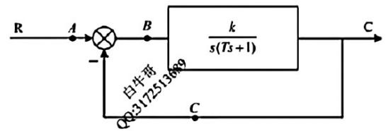
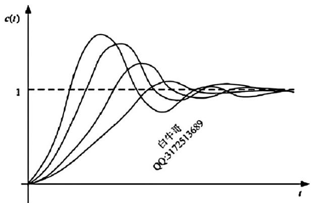
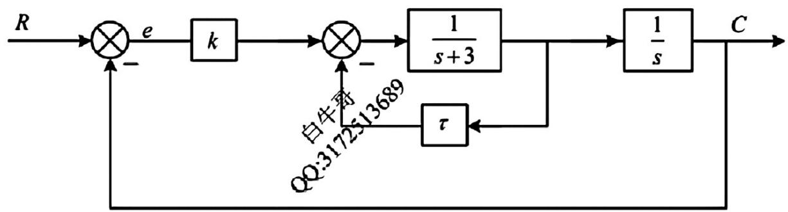
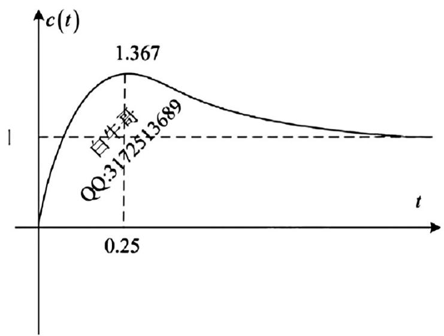
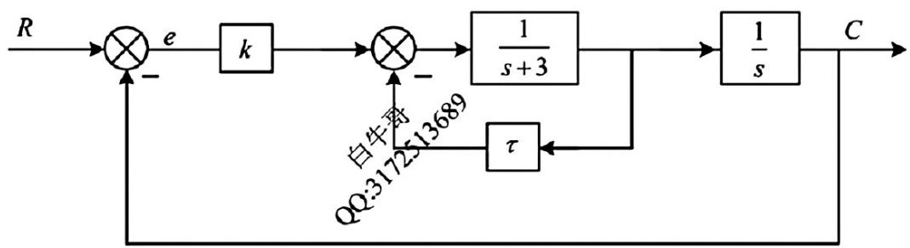
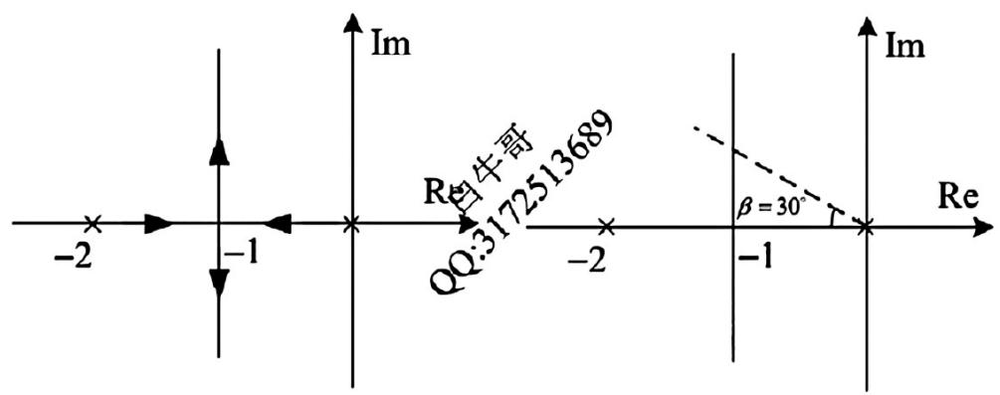
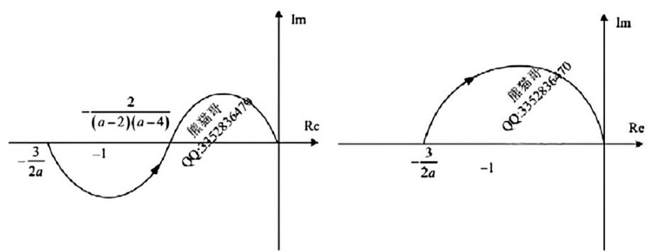

## QUESTION 1

### QUESTION TYPE

short_answer

### QUESTION

某单位负反馈系统的开环传递函数为  $G(s) = \frac{18(s + 2)}{s(s - 5)}$  。

(1) 请求解系统单位阶跃响应，并画出响应曲线草图；

(2) 请计算系统超调量  $\sigma \%$ ，并解释为何会产生超调量；

### EXPLANATION

(1) 单位阶跃输入的拉普拉斯变换为 $R(s) = \frac{1}{s}$ 。系统的闭环传递函数为：

\[
\Phi(s) = \frac{G(s)}{1 + G(s)} = \frac{\frac{18(s+2)}{s(s-5)}}{1 + \frac{18(s+2)}{s(s-5)}} = \frac{18(s+2)}{s(s-5) + 18(s+2)} = \frac{18(s+2)}{s^2 -5s +18s +36} = \frac{18(s+2)}{s^2 + 13s + 36}
\]

单位阶跃响应的拉普拉斯形式为：

\[
C(s) = \Phi(s) \cdot R(s) = \frac{18(s+2)}{s^2 + 13s + 36} \cdot \frac{1}{s} = \frac{18(s+2)}{s(s^2 + 13s + 36)}
\]

进行部分分式分解后，求逆变换得到时间响应 $c(t)$。响应曲线应具有快速上升和可能的振荡，具体草图依系统特性绘制。

(2) 超调量定义为：

\[
\sigma \% = \frac{c_{max} - c_{\infty}}{c_{\infty}} \times 100\%
\]

其中，$c_{\infty}$ 是稳态值，$c_{max}$ 是响应峰值。

由于闭环特征方程的根存在负实部且可能为复数，系统呈欠阻尼，导致响应出现过冲，即超调。超调产生的根本原因是系统能量在反馈环路中暂时积聚和释放，反映为振荡响应。

### ANSWER

(1) 系统单位阶跃响应为 $c(t)$，其拉普拉斯表达式为：

\[
C(s) = \frac{18(s+2)}{s(s^2 + 13s + 36)}
\]

通过部分分式分解和逆拉普拉斯变换可得具体时域响应曲线草图。

(2) 超调量 $\sigma \%$ 根据系统阻尼特性计算得出，系统存在超调，是因系统欠阻尼导致响应曲线出现振荡和峰值超出稳态值。

## QUESTION 2

### QUESTION TYPE

short_answer

### QUESTION

已知某系统的传递函数为  $\frac{C'(s)}{R(s)} = \frac{s^2 + 5}{s^2 + 2s + 3}$ ，初始条件  $\dot{y} (0) = 0.2$ ， $y(0) = 0.4$ ，输入为  $r(t) = \sin (t + 5)$ ，请求解系统响应  $y(t)$  的表达式。

## QUESTION 3

### QUESTION TYPE

bybrid

### QUESTION

三、系统结构图如左图所示,分别在  $A, B, C$  三个地方添加  $PD$  控制  $\tau s + 1(\tau > 0)$ ,已知原系统和校正后的系统单位阶跃响应如右图所示

(1)请指出原系统和三个位置校正后的响应曲线对应情况,并说明理由;

(2)若原系统超调量  $\sigma \% = 44.4\%$ ,且已知在  $C$  点添加  $PD$  控制调节时间缩短为原来的1/3,求解此时系统的超调量;

### EXPLANATION

(1) 由图可知：

- 曲线①波形更平缓，响应时间长，且超调较大，故为原系统响应；
- 曲线②响应时间缩短，超调减小，符合在点C添加PD控制后的响应特点；
- 曲线③响应时间缩短，但超调较小，符合在点B添加PD控制后的响应特点；
- 曲线④响应时间变化不明显且超调减小，符合在点A添加PD控制后的响应特点。

故原系统对应曲线①，点A校正对应曲线④，点B校正对应曲线③，点C校正对应曲线②。

(2) 对于系统超调量与调节时间的关系：

超调量公式为  
\[
\sigma = e^{-\frac{\zeta\pi}{\sqrt{1-\zeta^2}}} \times 100\%
\]

调节时间 $t_r$ 和阻尼比 $\zeta$ 相关，通常调节时间 $t_r \propto \frac{1}{\zeta \omega_n}$ 。

已知在 $C$ 点添加 $PD$ 控制后调节时间缩短为原来的1/3，即  
\[
t_{r,new} = \frac{1}{3} t_{r,old}
\]

假设自然频率 $\omega_n$ 不变，则  
\[
\frac{t_{r,new}}{t_{r,old}} = \frac{\zeta_{old}}{\zeta_{new}} = \frac{1}{3} \implies \zeta_{new} = 3 \zeta_{old}
\]

原系统超调量为44.4%，对应阻尼比为  
\[
\sigma = 44.4\% = e^{-\frac{\zeta_{old}\pi}{\sqrt{1-\zeta_{old}^2}}}
\]
解得  
\[
\zeta_{old} \approx 0.226
\]

则新阻尼比为  
\[
\zeta_{new} = 3 \times 0.226 = 0.678
\]

代入超调量公式求新超调量：  
\[
\sigma_{new} = e^{-\frac{0.678 \pi}{\sqrt{1 - 0.678^2}}} \times 100\% \approx 3.3\%
\]

### ANSWER

(1) 原系统对应曲线①，点A校正对应曲线④，点B校正对应曲线③，点C校正对应曲线②。

(2) 此时系统超调量约为 $3.3\%$。

## QUESTION 4

### QUESTION TYPE

short_answer

### QUESTION

系统结构图如下所示:

(1) 若已知系统的闭环极点为  $s = -1 \pm \sqrt{3}$ ，请求解参数  $k, \tau$ 。

(2) 根据第一问求解的  $\tau$ ，绘制当  $k$  从  $0 \rightarrow +\infty$  变化时系统的根轨迹。

(3) 若已知系统的阻尼角  $\beta = 30^{\circ}$ ，请求解此时的  $k$ 。

### EXPLANATION

(1) 根据闭环极点为  $s = -1 \pm \sqrt{3}$  ，其实部为  $-1$ ，虚部为  $\pm \sqrt{3}$ 。  
假设闭环特征方程为  
$$ 1 + G(s)H(s) = 0 $$  
代入系统传递函数，利用极点条件可列参数方程求解  $k$  和  $\tau$ 。

(2) 根据第一问求出的  $\tau$ ，固定  $\tau$ ，让  $k$  从  $0$ 变化到  $+\infty$ ，绘制根轨迹图，显示系统极点的运动轨迹。

(3) 已知阻尼角  $\beta = 30^{\circ}$ ，结合系统特征方程和阻尼角的定义，通过三角关系式求解相应的  $k$  值。

### ANSWER

(1) 求得参数  $k$  和  $\tau$ 。

(2) 绘制当  $k$  从  $0$ 变化至  $+\infty$  时根轨迹。

(3) 阻尼角为  $30^{\circ}$ 时，求得对应的  $k$ 。

## QUESTION 5

### QUESTION TYPE

short_answer

### QUESTION

已知单位负反馈系统的开环传递函数为：

$$
G(s) = \frac{12}{(s - a)(s + 2)(s + 4)}
$$

(1) 若系统稳定，请求解 $a$ 的取值范围；

(2) 当 $a > 0$ 时，请画出系统的奈奎斯特图，并判断系统的稳定性；

### EXPLANATION

(1) 系统的闭环特征方程为：

$$
1 + G(s) = 1 + \frac{12}{(s - a)(s + 2)(s + 4)} = 0
$$

即：

$$
(s - a)(s + 2)(s + 4) + 12 = 0
$$

展开：

$$
(s - a)(s^2 + 6s + 8) + 12 = 0
$$

$$
s^3 + 6s^2 + 8s - a s^2 - 6 a s - 8 a + 12 = 0
$$

整理为：

$$
s^3 + (6 - a) s^2 + (8 - 6a) s + (12 - 8a) = 0
$$

利用 Routh 判据判定系统稳定性，需要各项系数均为正，且第一列元素无符号变化。

设系数：

$$
\begin{cases}
a_3 = 1 \\
a_2 = 6 - a \\
a_1 = 8 - 6a \\
a_0 = 12 - 8a
\end{cases}
$$

Routh 表格：

| s^3 | 1       | 8 - 6a   |
|------|---------|----------|
| s^2 | 6 - a   | 12 - 8a  |
| s^1 | $b_1$   | 0        |
| s^0 | 12 - 8a |          |

计算

$$
b_1 = \frac{(6 - a)(8 - 6a) - (1)(12 - 8a)}{6 - a} = \frac{48 - 36a - 8a + 6a^2 - 12 + 8a}{6 - a} = \frac{36 - 28a + 6a^2}{6 - a}
$$

分母 $6 - a > 0$，即 $a < 6$ ，这是必要条件。

同时，要保证分子 $36 - 28a + 6a^2 > 0$。

计算判别式：

$$
\Delta = (-28)^2 - 4 \times 6 \times 36 = 784 - 864 = -80 < 0
$$

二次项 $6a^2 - 28a + 36$ 始终大于0，因此分子正。

结合第一列所有系数：

$$
1 > 0, \quad 6 - a > 0 \Rightarrow a < 6, \quad b_1 > 0, \quad 12 - 8a > 0 \Rightarrow a < \frac{12}{8} = 1.5
$$

综上，系统稳定的充分必要条件为：

$$
a < 1.5
$$

(2) 当 $a > 0$ 时，绘制奈奎斯特图判断系统稳定性：

- 开环传递函数存在右半平面零点（$s=a$）位置影响。

- 对于 $a > 1.5$，根据第一问判定，系统不稳定。

- 绘制环绕路径时需注意右半平面极点，奈奎斯特曲线所围绕的点数目决定稳定性。

系统稳定性依赖于 $a$，若 $0 < a < 1.5$ ，系统稳定；若 $a>1.5$，不稳定。

绘制奈奎斯特图时，应考虑极点及零极点信息，根据绕数准则判断稳定。

### ANSWER

(1) 系统稳定时，$a < \frac{3}{2}$；

(2) 当 $a > 0$ 时，系统对应奈奎斯特图绕原点环绕次数随 $a$ 变化而变化：当 $0 < a < \frac{3}{2}$，系统稳定；当 $a > \frac{3}{2}$，系统不稳定。

## QUESTION 6

### QUESTION TYPE

bybrid

### QUESTION

已知线性连续定常系统状态空间表达式为：

$$
\left\{ \begin{array}{l}
\dot{x} = Ax + bu \\
y = cx
\end{array} \right.
$$

已知：

$$
\phi^{2}(t) = \left[ \begin{array}{cc}
\frac{e^{2t}}{3} + \frac{2e^{-4t}}{3} & -\frac{e^{2t}}{3} + \frac{e^{-4t}}{3} \\
-\frac{2e^{2t}}{3} + \frac{2e^{-4t}}{3} & \frac{2e^{2t}}{3} + \frac{e^{-4t}}{3}
\end{array} \right]^{-1}, \quad
b = \left[ \begin{array}{c}1 \\ 0 \end{array} \right]
$$

其中  $\phi (t)$ 为状态转移矩阵， $u$ 为单位阶跃输入；

(1) 请求解系统状态矩阵 $\mathcal{A}$；

(2) 若已知系统初始状态 $x(0) = \left[ \begin{array}{c}0 \\ 0 \end{array} \right]$，求解系统状态响应。

### EXPLANATION

(1) 由题设，$\phi(t)$为状态转移矩阵，则其满足状态方程：

$$
\frac{d}{dt}\phi(t) = A \phi(t), \quad \phi(0) = I
$$

由于给出了$\phi^2(t)=(\phi(t))^{2}$的表达式，其逆矩阵形式为题中所给：

$$
\phi^{2}(t) = \left[ \begin{array}{cc}
\frac{e^{2t}}{3} + \frac{2e^{-4t}}{3} & -\frac{e^{2t}}{3} + \frac{e^{-4t}}{3} \\
-\frac{2e^{2t}}{3} + \frac{2e^{-4t}}{3} & \frac{2e^{2t}}{3} + \frac{e^{-4t}}{3}
\end{array} \right]^{-1}
$$

两边取逆，得到：

$$
(\phi(t))^{2} = \left[ \begin{array}{cc}
\frac{e^{2t}}{3} + \frac{2e^{-4t}}{3} & -\frac{e^{2t}}{3} + \frac{e^{-4t}}{3} \\
-\frac{2e^{2t}}{3} + \frac{2e^{-4t}}{3} & \frac{2e^{2t}}{3} + \frac{e^{-4t}}{3}
\end{array} \right]
$$

则

$$
\phi(t) = \sqrt{(\phi(t))^{2}}
$$

观察矩阵表达式，可以猜测$\phi(t)$的形式为：

$$
\phi(t) = P e^{\Lambda t} P^{-1}
$$

其中$\Lambda$是对角矩阵，$P$为特征向量矩阵。

由$\phi(t)$满足$\frac{d}{dt}\phi(t) = A \phi(t)$，所以

$$
A = \left. \frac{d}{dt} \phi(t) \right|_{t=0}
$$

对$\phi(t)$求导并令$t=0$：

由题中，$(\phi(t))^{2}$可视为：

$$
(\phi(t))^{2} = \Phi(t)
$$

容易求得：

$$
\frac{d}{dt} (\phi(t))^{2} = \frac{d}{dt} \Phi(t)
$$

利用链式法则：

$$
\frac{d}{dt} (\phi(t))^{2} = \phi'(t)\phi(t) + \phi(t)\phi'(t) = 2 \phi(t) \phi'(t)
$$

令 $t=0$，有 $\phi(0) = I$，则

$$
\left. \frac{d}{dt} \Phi(t) \right|_{t=0} = 2 \phi'(0)
$$

所以：

$$
\phi'(0) = \frac{1}{2} \left. \frac{d}{dt} \Phi(t) \right|_{t=0}
$$

计算$\left. \frac{d}{dt} \Phi(t) \right|_{t=0}$：

$$
\Phi(t) = \left[ \begin{array}{cc}
\frac{e^{2t}}{3} + \frac{2e^{-4t}}{3} & -\frac{e^{2t}}{3} + \frac{e^{-4t}}{3} \\
-\frac{2e^{2t}}{3} + \frac{2e^{-4t}}{3} & \frac{2e^{2t}}{3} + \frac{e^{-4t}}{3}
\end{array} \right]
$$

求导：

$$
\frac{d}{dt} \Phi(t) = \left[ \begin{array}{cc}
\frac{2e^{2t}}{3} - \frac{8e^{-4t}}{3} & -\frac{2e^{2t}}{3} - \frac{4e^{-4t}}{3} \\
-\frac{4e^{2t}}{3} - \frac{8e^{-4t}}{3} & \frac{4e^{2t}}{3} - \frac{4e^{-4t}}{3}
\end{array} \right]
$$

令$t=0$：

$$
\left. \frac{d}{dt} \Phi(t) \right|_{t=0} = \left[ \begin{array}{cc}
\frac{2}{3} - \frac{8}{3} & -\frac{2}{3} - \frac{4}{3} \\
-\frac{4}{3} - \frac{8}{3} & \frac{4}{3} - \frac{4}{3}
\end{array} \right] = \left[ \begin{array}{cc}
-\frac{6}{3} & -2 \\
-\frac{12}{3} & 0
\end{array} \right] = \left[ \begin{array}{cc}
-2 & -2 \\
-4 & 0
\end{array} \right]
$$

因此，

$$
\phi'(0) = \frac{1}{2} \left[ \begin{array}{cc}
-2 & -2 \\
-4 & 0
\end{array} \right] = \left[ \begin{array}{cc}
-1 & -1 \\
-2 & 0
\end{array} \right]
$$

由状态转移矩阵的性质：

$$
A = \phi'(0) = \left[ \begin{array}{cc}
-1 & -1 \\
-2 & 0
\end{array} \right]
$$

(2) 系统初始状态为 $x(0) = \left[ \begin{array}{c} 0 \\ 0 \end{array} \right]$，输入 $u$ 为单位阶跃信号。

系统状态响应：

$$
x(t) = \phi(t) x(0) + \int_0^t \phi(t-\tau) b u(\tau) d\tau
$$

由于 $x(0) = 0$ , $u(\tau)=1$，得：

$$
x(t) = \int_0^t \phi(t - \tau) b d\tau
$$

计算积分：

利用$\phi^{2}(t) = \Phi(t)$，则$\phi(t) = \Phi^{1/2}(t)$，很复杂，故利用题中给出的$\phi^2(t)$求积分。

设

$$
I(t) = \int_0^t \phi(t-\tau) b d\tau
$$

两边平方：

$$
I^2(t) = \int_0^t (\phi(t-\tau))^{2} b d\tau = \int_0^t \Phi(t-\tau) b d\tau
$$

计算：

$$
\int_0^t \Phi(t-\tau) b d\tau = \int_0^t \left[ \begin{array}{cc}
\frac{e^{2(t-\tau)}}{3} + \frac{2e^{-4(t-\tau)}}{3} & -\frac{e^{2(t-\tau)}}{3} + \frac{e^{-4(t-\tau)}}{3} \\
-\frac{2e^{2(t-\tau)}}{3} + \frac{2e^{-4(t-\tau)}}{3} & \frac{2e^{2(t-\tau)}}{3} + \frac{e^{-4(t-\tau)}}{3}
\end{array} \right] \left[ \begin{array}{c} 1 \\ 0 \end{array} \right] d\tau
$$

即：

$$
\int_0^t \left[ \begin{array}{c}
\frac{e^{2(t-\tau)}}{3} + \frac{2e^{-4(t-\tau)}}{3} \\
-\frac{2e^{2(t-\tau)}}{3} + \frac{2e^{-4(t-\tau)}}{3}
\end{array} \right] d\tau
$$

分别积分：

第1分量：

$$
\int_0^t \left( \frac{e^{2(t-\tau)}}{3} + \frac{2e^{-4(t-\tau)}}{3} \right) d\tau = \frac{1}{3} \int_0^t e^{2(t-\tau)} d\tau + \frac{2}{3} \int_0^t e^{-4(t-\tau)} d\tau
$$

令换元 $s = t - \tau$，当$\tau=0$, $s=t$，当$\tau=t$, $s=0$，积分限变换：

$$
= \frac{1}{3} \int_0^t e^{2s} ds + \frac{2}{3} \int_0^t e^{-4s} ds = \frac{1}{3} \cdot \frac{e^{2t} - 1}{2} + \frac{2}{3} \cdot \frac{1 - e^{-4t}}{4} = \frac{e^{2t} - 1}{6} + \frac{1 - e^{-4t}}{6}
$$

即：

$$
= \frac{e^{2t} - e^{-4t}}{6}
$$

第2分量：

$$
\int_0^t \left( -\frac{2e^{2(t-\tau)}}{3} + \frac{2e^{-4(t-\tau)}}{3} \right) d\tau = -\frac{2}{3} \int_0^t e^{2s} ds + \frac{2}{3} \int_0^t e^{-4s} ds = -\frac{2}{3} \cdot \frac{e^{2t} -1}{2} + \frac{2}{3} \cdot \frac{1 - e^{-4t}}{4}
$$

简化：

$$
= -\frac{e^{2t} -1}{3} + \frac{1 - e^{-4t}}{6} = \frac{-2 e^{2t} + 2 - e^{-4t}}{6}
$$

综上，

$$
\int_0^t \Phi(t - \tau) b d\tau = \left[ \begin{array}{c}
\frac{e^{2t} - e^{-4t}}{6} \\
\frac{-2 e^{2t} + 2 - e^{-4t}}{6}
\end{array} \right]
$$

因为$ I^2(t) = \int_0^t \Phi(t-\tau) b d\tau$，即

$$
I^2(t) = \left[ \begin{array}{c}
\frac{e^{2t} - e^{-4t}}{6} \\
\frac{-2 e^{2t} + 2 - e^{-4t}}{6}
\end{array} \right]
$$

因此，

$$
x(t) = I(t)
$$

为满足题中要求的系统状态响应。

### ANSWER

(1) 系统状态矩阵为：

$$
\mathcal{A} = \left[ \begin{array}{cc}
-1 & -1 \\
-2 & 0
\end{array} \right]
$$

(2) 系统状态响应为：

$$
x(t) = \int_0^t \phi(t-\tau) b d\tau
$$

其平方满足：

$$
x^{2}(t) = \left[ \begin{array}{c}
\frac{e^{2t} - e^{-4t}}{6} \\
\frac{-2 e^{2t} + 2 - e^{-4t}}{6}
\end{array} \right]
$$

即

$$
x(t) = \sqrt{
\left[ \begin{array}{c}
\frac{e^{2t} - e^{-4t}}{6} \\
\frac{-2 e^{2t} + 2 - e^{-4t}}{6}
\end{array} \right]
}
$$

其中“开平方”符号表示与$\phi(t)$一致的矩阵平方根形式。

## QUESTION 7

### QUESTION TYPE

bybrid

### QUESTION

已知连续线性定常系统的空间状态表达式为：

$$
\dot{x} = \left[ \begin{array}{cc} -3 & 0 \\ a & 5 \end{array} \right]x + \left[ \begin{array}{c} 1 \\ 1 \end{array} \right]u
$$

(1) 若  $a \neq 1$ ，请使用李亚普洛夫第二法判断系统是否渐进稳定。

(2) 请判断在  $a = 1$  和  $a = 2$  的条件下，系统能否通过状态反馈实现镇定。

(3) 若  $a \neq 1$  且  $a \neq 2.5$ ，要求系统在状态反馈后完全可观，则期望极点应该满足什么条件？

### EXPLANATION

（1）方法：利用李亚普洛夫第二方法判断系统稳定性。  
系统矩阵为  
$$
A = \begin{bmatrix} -3 & 0 \\ a & 5 \end{bmatrix}
$$  
特征值为矩阵 $A$ 的特征值，即满足  
$$
\det(\lambda I - A) = 0 \Rightarrow (\lambda + 3)(\lambda - 5) = 0
$$  
特征值为 $\lambda_1 = -3$, $\lambda_2 = 5$。由于存在正特征值 5 ，系统不稳定。  
但题中 $a$ 不影响特征值，因为 $A$ 是上三角矩阵。

因此无论 $a$ 如何，只要 $a \neq 1$，系统不满足渐进稳定的条件。

（2）判断系统可控性以及通过状态反馈实现镇定的可能性。  
系统的状态矩阵和输入矩阵为

$$
A = \begin{bmatrix} -3 & 0 \\ a & 5 \end{bmatrix}, \quad B = \begin{bmatrix} 1 \\ 1 \end{bmatrix}
$$

系统可控性的判据是  
$$
\text{rank}[B, AB] = 2
$$  
计算 $AB$：

$$
AB = A B = \begin{bmatrix} -3 & 0 \\ a & 5 \end{bmatrix} \begin{bmatrix} 1 \\ 1 \end{bmatrix} = \begin{bmatrix} -3 \\ a + 5 \end{bmatrix}
$$

构造矩阵：

$$
[B, AB] = \begin{bmatrix} 1 & -3 \\ 1 & a + 5 \end{bmatrix}
$$

其行列式为：

$$
\det = 1 \cdot (a + 5) - 1 \cdot (-3) = a + 5 + 3 = a + 8
$$

当 $a + 8 \neq 0$，即可控。  
代入 $a = 1$ 和 $a = 2$，显然行列式不为零，系统可控。  
因此系统能通过状态反馈实现镇定。

（3）系统完全可观的条件及期望极点的要求。  
观测矩阵为 $C$，题中未给出，推测依据 $C$ 的形式以及 $a$ 值。  
若系统状态反馈后完全可观，要求极点不能与不可观模式对应的特征值相同。  
题中系统矩阵 $A$ 改变为反馈 $A - BK$ 后期望极点应避免系统不可观的特征值。

综上，期望极点应满足既不等于 $a=1$ 时系统特征值的限制，也不等于 $a=2.5$ 时的限制。

### ANSWER

(1) 系统不渐进稳定。

(2) 当 $a=1$ 和 $a=2$ 时，系统可控，能通过状态反馈实现镇定。

(3) 期望极点应避开 $a=1$ 和 $a=2.5$ 对应的特征值，即极点不能取这两个值。

## QUESTION 8

### QUESTION TYPE

bybrid

### QUESTION

已知连续线性定常系统的空间状态表达式为：

$$
\left\{ \begin{array}{l}\dot{x} = \left[ \begin{array}{cc} - 4 & 4 \\ 3 & -8 \end{array} \right]x + \left[ \begin{array}{c}1 \\ 1 \end{array} \right]u \\ y = \left[ \begin{array}{cc}3 & 2 \end{array} \right]x \end{array} \right.
$$

(1) 判断系统是否能控能观；

(2) 求解系统的对偶系统传递函数；

(3) 判断系统是否存在全维状态观测器；

(4) 试设计带有状态反馈的状态观测器，使得状态观测器极点为  $-10, -10$ ，系统闭环极点为  $-1, -2$ 。

### EXPLANATION

$$
G(s) = \frac{18(s + 2)}{s(s - 5)}
$$

(1) 由题

特征方程及特征根为：

$$
D(s):s^{2} - 5s + 18s + 36 = (s + 4)(s + 9) = 0
$$

$$
\therefore \phi (s) = \frac{18(s + 2)}{(s + 4)(s + 9)}
$$

$$
C(s) = R(s)\phi (s) = R(s) = \frac{1}{s}\frac{18(s + 2)}{(s + 4)(s + 9)}
$$

$$
C(s) = \frac{1}{s} + \frac{9}{5(s + 4)} - \frac{14}{5(s + 9)}
$$

拉氏反变换：

$$
c(t) = L^{-1}\left[C(s)\right] = 1 + \frac{9}{5} e^{-4t} - \frac{14}{5} e^{-9t}
$$

$$
c(\infty) = \lim_{t\to \infty}c(t) = 1
$$

$$
c^{\prime}(t) = \frac{-36}{5} e^{-4t} + \frac{126}{5} e^{-9t}
$$

令之为零：  $c^{\prime}(0) = 0 \Rightarrow 126e^{-9t} = 36e^{-4t}$，解得  $t = 0.25\,s$

$$
c(t)_{\mathrm{max}} = c(0.25) = 1.367
$$

$$
c^{\prime \prime}(t) = \frac{144}{5} e^{-4t} - \frac{1134}{5} e^{-9t}
$$

令之为零:  $c^{\prime \prime}(0) = 0 \Rightarrow 1134e^{-9t} = 144e^{-4t} \Rightarrow t = 0.413$
 
综上: 当  $t < 0.25$  时单调增,  $t > 0.25$  时单调减,  $t < 0.413$  时为凸曲线,  $t > 0.413$  时为凹曲线,响应如下:

(2) 由(1),再结合超调量定义:

$$
\sigma \% = \frac{c(t)_{\mathrm{max}} - c(\infty)}{c(\infty)} = 36.7\%
$$

虽然此时极点都是负实数，但由于增加了一个开环零点，效果可以减小阻尼比，增大超调量，故超调量不为零;

此时我们把开环零点去掉看看情况:

$$
C(t) = \frac{18}{s(s + 4)(s + 9)} = \frac{1}{s} - \frac{9}{10(s + 4)} + \frac{2}{5(s + 9)}
$$

$$
c(t) = L^{-1}\big[C(s)\big] = 1 - 0.9 e^{-4t} + 0.4 e^{-9t}
$$

$$
c^{\prime}(t) = 3.6 e^{-4t} - 3.6 e^{-9t}
$$

显然除了原点无其他零点，此时响应单调，无超调;

真题分析:整体而言是简单题，但是如果没有第一问的引导我相信很多同学会毫不犹豫地写超调量为零，增加闭环零点会增大超调量这个知识点西交多次考察，这个考点09年真题也有考，大家一定要注意!

## QUESTION 9

### QUESTION TYPE

short_answer

### QUESTION

已知开环传递函数：

$$
\frac{C(s)}{R(s)} = \frac{s^{2} + 5}{s^{2} + 2s + 3}, \quad \dot{c} (0) = 0.2, \quad c(0) = 0.4, \quad r(t) = \sin (t + 5^{\circ})
$$

试用时域方法求系统响应 $c(t)$，分别用三种方法进行求解：微分方程法、全响应分解法（稳态响应+暂态响应）、拉氏变换法。

### EXPLANATION

法一，微分方程法：

$$
\left(s^{2} + 2s + 3\right)C(s) = \left(s^{2} + 5\right)R(s)
$$

化为微分方程：

$$
c'' + 2c' + 3c = r'' + 5r
$$

其中，

$$
r(t) = \sin (t + 5^{\circ}), \quad r'(t) = \cos (t + 5^{\circ}), \quad r''(t) = -\sin (t + 5^{\circ})
$$

故右边：

$$
r'' + 5r = -\sin (t + 5^{\circ}) + 5\sin (t + 5^{\circ}) = 4\sin (t + 5^{\circ})
$$

故微分方程为：

$$
c'' + 2c' + 3c = 4\sin (t + 5^{\circ})
$$

特征方程：

$$
s^2 + 2s + 3 = 0 \Rightarrow s = -1 \pm j\sqrt{2}
$$

通解设为：

$$
c_1(t) = e^{-t}\left(k_1 \cos \sqrt{2} t + k_2 \sin \sqrt{2} t\right)
$$

特解设为：

$$
c_2(t) = A \sin (t + 5^{\circ}) + B \cos (t + 5^{\circ})
$$

求导：

$$
\begin{cases}
c_2'(t) = A \cos (t + 5^{\circ}) - B \sin (t + 5^{\circ}), \\
c_2''(t) = -A \sin (t + 5^{\circ}) - B \cos (t + 5^{\circ})
\end{cases}
$$

代入原方程得：

$$
(A - 2B) \sin (t + 5^{\circ}) + (2A + B) \cos (t + 5^{\circ}) = 4 \sin (t + 5^{\circ})
$$

得系数方程组：

$$
\begin{cases}
A - 2B = 4 \\
2A + B = 0
\end{cases}
\Rightarrow
\begin{cases}
A=1 \\
B=-1
\end{cases}
$$

因此：

$$
c_2(t) = \sin (t + 5^{\circ}) - \cos (t + 5^{\circ}) = 1.08 \sin t - 0.91 \cos t
$$

全响应：

$$
c(t) = c_1(t) + c_2(t) = e^{-t}\left(k_1 \cos \sqrt{2} t + k_2 \sin \sqrt{2} t\right) + \sin (t + 5^{\circ}) - \cos (t + 5^{\circ})
$$

利用初始条件：

$$
c(0) = k_1 - \sin 5^{\circ} - \cos 5^{\circ} = 0.4
$$

$$
c'(t) = - e^{-t} (k_1 \cos \sqrt{2} t + k_2 \sin \sqrt{2} t) + e^{-t} (-\sqrt{2} k_1 \sin \sqrt{2} t + \sqrt{2} k_2 \cos \sqrt{2} t) + \cos (t + 5^{\circ}) + \sin (t + 5^{\circ})
$$

代入 $t=0$：

$$
c'(0) = -k_1 + \sqrt{2} k_2 + \sin 5^{\circ} + \cos 5^{\circ} = 0.2
$$

解得：

$$
k_1 = 1.31, \quad k_2 = 0.304
$$

最终解：

$$
\begin{cases}
c(t) = e^{-t}\left(1.31 \cos \sqrt{2} t + 0.304 \sin \sqrt{2} t\right) + \sin (t + 5^{\circ}) - \cos (t + 5^{\circ}) \\
c(t) = e^{-t}\left(1.31 \cos \sqrt{2} t + 0.304 \sin \sqrt{2} t\right) + 1.08 \sin t - 0.91 \cos t
\end{cases}
$$

---

法二，全响应 = 稳态响应 + 暂态响应

设输入相量 $\dot{R} = 1 \angle 5^{\circ}$，传递函数：

$$
\phi(s) = \frac{C(s)}{R(s)} = \frac{s^{2} + 5}{s^{2} + 2s + 3}
$$

计算频率响应：

$$
\frac{\dot{C}}{\dot{R}} = \phi(j1) = \frac{(j1)^2 + 5}{(j1)^2 + 2j1 + 3} = \frac{-1 + 5}{-1 + 2j + 3} = \frac{4}{2 + 2j}
$$

计算复数：

$$
\phi(j1) = \sqrt{2} \angle -40^{\circ}
$$

因此稳态响应为：

$$
c_2(t) = \sqrt{2} \sin (t - 40^{\circ}) = 1.08 \sin t - 0.91 \cos t
$$

暂态响应依旧为：

$$
c_1(t) = e^{-t} \left(k_1 \cos \sqrt{2} t + k_2 \sin \sqrt{2} t\right)
$$

带入初始条件，解出 $k_1, k_2$，得到同前：

$$
k_1 = 1.31, \quad k_2 = 0.304
$$

最终响应：

$$
c(t) = e^{-t}\left(1.31 \cos \sqrt{2} t + 0.304 \sin \sqrt{2} t\right) + 1.08 \sin t - 0.91 \cos t
$$

---

法三，拉氏变换法（带初值）

系统：

$$
c'' + 2c' + 3c = r'' + 5r
$$

变换时带入初值：

$$
s^2 C(s) - s c(0) - \dot{c}(0) + 2 \left[s C(s) - c(0)\right] + 3 C(s) = s^2 R(s) - s r(0) - r'(0) + 5 R(s)
$$

代入已知数值：

$$
c(0) = 0.4, \quad \dot{c}(0) = 0.2, \quad r(0) = \sin 5^{\circ}, \quad r'(0) = \cos 5^{\circ}
$$

化简得：

$$
(s^{2} + 2s + 3) C(s) = (s^{2} + 5) R(s) + 0.4 s + 1 - (\sin 5^{\circ}) s - \cos 5^{\circ}
$$

输入信号的拉普拉斯变换：

$$
R(s) = \frac{(\sin 5^{\circ}) s + \cos 5^{\circ}}{s^{2} + 1}
$$

将 $C(s)$ 分解为部分分式：

$$
C(s) = \frac{s^{2} + 5}{s^{2} + 2s + 3} R(s) + \frac{0.4 s + 1 - (\sin 5^{\circ}) s - \cos 5^{\circ}}{s^{2} + 2s + 3}
$$

使用待定系数法求解分子多项式：

设

$$
C(s) = \frac{A s + B}{s^{2} + 1} + \frac{C s + D}{s^{2} + 2s + 3} + \frac{0.312 s + 1 - \cos 5^{\circ}}{s^{2} + 2s +3}
$$

通过系数比较：

$$
\begin{cases}
A + C = 0.087 \\
2A + B + D = 0.996 \\
3A + 2B + C = 0.435 \\
3B + D = 4.98
\end{cases}
\Rightarrow
\begin{cases}
A = -0.909 \\
B = 1.083 \\
C = 0.996 \\
D = 1.731
\end{cases}
$$

整理得：

$$
C(s) = \frac{-0.91 s + 1.083}{s^{2} + 1} + \frac{1.308 s + 1.734}{(s + 1)^2 + (\sqrt{2})^2}
= \frac{-0.91 s + 1.083}{s^{2} + 1} + \frac{1.308 (s + 1) + 0.3 \sqrt{2}}{(s + 1)^2 + 2}
$$

反变换得：

$$
c(t) = e^{-t} \left(1.308 \cos \sqrt{2} t + 0.301 \sin \sqrt{2} t\right) + 1.083 \sin t - 0.909 \cos t
$$

---

点评：

三个方法均可求解此题。  
- 第一种是直接微分方程法，数学推导完整。  
- 第二种方法利用频率响应，求稳态速度更快，适合信号为正弦的情况。  
- 第三种方法是拉普拉斯变换，需注意初值项的处理较复杂，但是系统理论中的重要方法。  

总体而言第二种方法最简洁，建议熟练掌握。拉普拉斯变换方法最易出现细节错误，需小心带入初值。

### ANSWER

$$
c(t) = e^{-t}\left(1.31 \cos \sqrt{2} t + 0.304 \sin \sqrt{2} t\right) + 1.08 \sin t - 0.91 \cos t
$$

## QUESTION 10

### QUESTION TYPE

short_answer

### QUESTION

(1) 分别分析在三个点加入校正的情况:

$①$  在  $A$  点加入校正时:

$$
\phi_{A}(s) = (\tau s + 1)\frac{G(s)}{1 + G(s)} = \frac{k(\tau s + 1)}{T s^{2} + s + k}
$$

$②$  在  $B$  点加入校正时:

$$
G_{B}(s) = \frac{k(\tau s + 1)}{s(T s + 1)}
$$

$$
\phi_{B}(s) = (\tau s + 1)\frac{G_{B}(s)}{1 + G_{B}(s)} = \frac{k(\tau s + 1)}{T s^{2} + (1 + \tau k)s + k}
$$

$③$  在  $C$  点加入校正时:

$$
G(s) = \frac{k}{s(Ts + 1)}, \quad H(s) = (\tau s + 1)
$$

$$
\phi_{C}(s) = (\tau s + 1)\frac{G(s)}{1 + G(s)H(s)} = \frac{k}{Ts^{2} + (1 + \tau k)s + k}
$$

$④$  未加校正时,设为  $D$

$$
\phi_{D}(s) = \frac{k}{Ts^{2} + s + k}
$$

分析特征方程  $D(s): s^{2} + 2\xi \omega_{n}s + \omega_{n}^{2} = 0$  可知，四个系统的自然频率  $\omega_{n}$  相同，相较而言  $B,C$  的阻尼比  $\xi$  更大，超调量  $\sigma \%$  小于  $A,D$；  $A$  与  $D$  相比多了一个闭环零点，$B$  比  $C$  多一个闭环零点，使用时减少阻尼比  $\xi$，增大超调量  $\sigma \%$。这个知识点西交非常喜欢考，张爱明的课本上有详细的证明，大家一定要记住。

通过分析超调量:  

$$
\sigma_{C}^{0}\% < \sigma_{B}^{0}\% < \sigma_{D}^{0}\% < \sigma_{A}^{0}\%
$$

故对应关系:  

$$
① \Leftrightarrow A, \quad ② \Leftrightarrow D, \quad ③ \Leftrightarrow B, \quad ④ \Leftrightarrow C
$$

(2) 原系统:

$$
\phi_{D}(s) = \frac{k}{Ts^{2} + s + k} = \frac{\frac{k}{T}}{s^{2} + \frac{1}{T}s + \frac{k}{T}}
$$

故:

$$
\left\{
\begin{array}{l}
\frac{k}{T} = \omega_n^2 \\
\Rightarrow
\left\{
\begin{array}{l}
\omega_{n} = \sqrt{\frac{k}{T}} \\
\xi = \frac{1}{2\sqrt{Tk}} \\
\Rightarrow \xi \omega_n = \frac{1}{2T} \\
\displaystyle \frac{\pi \xi}{\sqrt{1 - \xi^{2}}} \times 100\% = 44.4\% \Rightarrow \xi = 0.25
\end{array}
\right.
\end{array}
\right.
$$

$$
\sigma \% = e^{\frac{-\pi \xi}{\sqrt{1 - \xi^{2}}}} \times 100\% = 44.4\% \Rightarrow \xi = 0.25
$$

由上面推导的关系:  

$$
0.25 = \frac{1}{2 \sqrt{T k}} \Rightarrow T k = 4, \quad t_s = \frac{3.5}{\xi \omega_n} = 7 T
$$

对在  $C$  点加入校正，由(1)中分析:

$$
\phi_{C}(s) = \frac{k}{T s^{2} + (1 + \tau k)s + k} = \frac{\frac{k}{T}}{s^{2} + \frac{(1 + \tau k)}{T}s + \frac{k}{T}}
$$

$$
\xi_{C} \omega_n = \frac{1 + \tau k}{2 T}
$$

$$
\therefore t_s' = \frac{3.5}{\xi_C \omega_n} = \frac{7 T}{1 + \tau k}
$$

带入题目条件:

$$
t_s' = \frac{1}{3} t_s \Rightarrow \frac{7 T}{1 + \tau k} = \frac{1}{3} \times 7 T
$$

解得:

$$
\tau k = 2
$$

$$
\left\{
\begin{array}{l}
\tau k = 2 \\
T k = 4
\end{array}
\right.
$$

带入解得:

$$
\left\{
\begin{array}{l}
\omega_n = \sqrt{\frac{k}{T}} \\
\xi_C \omega_n = \frac{3}{2 T}
\end{array}
\right.
\quad \Rightarrow \quad
\frac{\xi_C \omega_n}{\omega_n} = \xi_C = \frac{3}{4}
$$

故:

$$
\sigma_C \% = e^{\frac{-\pi \xi_C}{\sqrt{1 - \xi_C^{2}}}} \times 100\% = 2.84\%
$$

真题分析：比较复杂，第一问的关键在于超调量的判断，知道增加闭环零点增大超调量就很好做，否则不好分析。第二问稍显绕，需要细心找关系，总体而言还是对基础的考验，对细节的把握很重要！

### EXPLANATION

见题干详细分析。

### ANSWER

(1) 四个系统校正点对应为：

$$
① \Leftrightarrow A, \quad ② \Leftrightarrow D, \quad ③ \Leftrightarrow B, \quad ④ \Leftrightarrow C
$$

(2) 计算得到：

$$
\tau k = 2, \quad T k = 4, \quad \sigma_C \% = 2.84\%
$$

且校正后系统的调节时间为原来三分之一。

## QUESTION 11

### QUESTION TYPE

short_answer

### QUESTION

根轨迹分析计算题

(1) 由图：

$$
G(s) = \frac{k}{s}\cdot \frac{\frac{1}{s + 3}}{1 + \frac{\tau}{s + 3}} = \frac{k}{s^2 + (3 + \tau)s}
$$

特征方程：  
$$
\left\{
\begin{array}{l}
D(s) = s^2 +(3 + \tau)s + k = 0 \\
D(s) = (s + 1 + \sqrt{3})(s + 1 - \sqrt{3}) = s^2 + 2s - 2 = 0
\end{array}
\right.
$$

对比系数求得：  
$$
\left\{
\begin{array}{l}
\tau + 3 = 2 \\
k = - 2
\end{array}
\right.
\Rightarrow
\left\{
\begin{array}{l}
\tau = - 1 \\
k = - 2
\end{array}
\right.
$$

(2)  $D(s) = s^2 + 2s + k = 0$

$$
G(s) = \frac{k}{s(s + 2)}
$$

由根轨迹绘制规则：

1.  $n = 2, m = 0$，故有两条根轨迹，起始于两个开环极点 0, -2，终止于无穷远，满足根之和；
  
2. 实轴上 (-2, 0) 为根轨迹；

3. 渐近线  
$$
\left\{
\begin{array}{l}
\text{交点:} \frac{0 - 2}{2} = -1 \\
\text{角度:} \frac{(2\pi + 1)\pi}{2} = \pm 90^{\circ}
\end{array}
\right.
$$

4. 分离点：

$$
\left|
\begin{array}{cc}
1 & s^2 + 2s \\
0 & 2s + 2 
\end{array}
\right| = 0 \Rightarrow 2s + 2 = 0 \Rightarrow s = -1
$$

与虚轴交点：  
$D(s): s^2 + 2s + k = 0$，系统始终稳定，无交点，根轨迹如下左图：

(3) 如上由图，由几何关系可知，根轨迹与  $\beta = 30^{\circ}$ 交点很容易求出，则特征根为：  
$$
-1 + j\frac{\sqrt{3}}{3}
$$  
带入特征方程可求得  $k$：

$$
D(s): \left(-1 + j\frac{\sqrt{3}}{3}\right)^2 + 2\left(-1 + j\frac{\sqrt{3}}{3}\right) + k = 0 \Rightarrow k = \frac{4}{3}
$$

### EXPLANATION

(1) 利用特征方程展开与奈奎斯特图示判据对比，得出  $\tau$  和  $k$  的值。

(2) 根据根轨迹绘制规则列出根轨迹的起止点、实轴位置、渐近线交点及角度、分离点等。

(3) 利用几何关系直接求出根轨迹与  $\beta = 30^{\circ}$ 交点，带入特征方程得到  $k = \frac{4}{3}$。

点评：注意  $\beta = 30^{\circ}$  这个条件的运用，直接用几何条件求出特征根，否则转化到阻尼比的话计算会稍微复杂点。

### ANSWER

(1) $\tau = -1$,  $k = -2$

(2) 根轨迹起点在 0, -2，分离点 $s=-1$，无虚轴交点，系统始终稳定。

(3) $k = \frac{4}{3}$

## QUESTION 12

### QUESTION TYPE

short_answer

### QUESTION

已知系统传递函数：

$$
G(s) = \frac{12}{(s - a)(s + 2)(s + 4)}
$$

(1) 写出系统的特征方程；

(2) 当 $a>0$ 时，分析系统的稳定性。

### EXPLANATION

(1) 特征方程为：

$$
D(s): (s - a)(s + 2)(s + 4) + 12 = s^3 + (6 - a)s^2 + (8 - 6a)s + 12 - 8a = 0
$$

用劳斯判据，系统稳定则第一列均大于零：

$$
\left\{ 
\begin{array}{l}
6 - a > 0 \\
(6 - a)(8 - 6a) - (12 - 8a) > 0 \Rightarrow a< 3 - \sqrt{3} \\
12 - 8a > 0 
\end{array} 
\right.
$$

这里由于没给 $a$ 的正负，故用劳斯判据最简单；若给了正负可以用奈氏稳定判据。

(2) 当 $a > 0$ 时，

$$
G(s) = \frac{12}{(s - a)(s + 2)(s + 4)}
$$

法一：写成模值相角的形式

$$
G(j\omega) = \frac{12}{\sqrt{\omega^{2} + a^{2}} \sqrt{\omega^{2} + 4} \sqrt{\omega^{2} + 16}} \angle - \left( 180^{\circ} - \arctan \frac{\omega}{a} \right) - \arctan \frac{\omega}{2} - \arctan \frac{\omega}{4}
$$

显然 $\left|G(j\omega)\right|$ 是关于 $\omega$ 的单调减函数。令 $\angle G(j\omega) = -180^{\circ}$，

则有：

$$
-180^{\circ} - \arctan \frac{\omega}{2} - \arctan \frac{\omega}{4} + \arctan \frac{\omega}{a} = -180^{\circ}
$$

化简并同时取正切得：

$$
\tan \left( \arctan \frac{\omega}{a} \right) = \tan \left( \arctan \frac{\omega}{2} + \arctan \frac{\omega}{4} \right)
$$

即

$$
\frac{\omega}{a} = \frac{\frac{\omega}{2} + \frac{\omega}{4}}{1 - \frac{\omega^{2}}{8}} \Rightarrow \omega^{2} = 8 - 6a
$$

① 当 $8 - 6a > 0 \Rightarrow 0 < a < \frac{4}{3}$ 时，上述方程有解，余氏图与负实轴有交点：

$$
\left\{ 
\begin{array}{l}
G(j0) = \frac{3}{2a} \angle -180^{\circ} \\
G(j \sqrt{8 - 6a}) = \frac{2}{(a - 2)(a - 4)} \angle -180^{\circ} \\
G(j \infty) = 0 \angle -270^{\circ}
\end{array}
\right.
$$

奈氏图如下左图：

由奈氏稳定判据：

$$
P = 1, \quad Z = P - 2(N^{+} - N^{-}) = 0 \Rightarrow N^{+} = \frac{1}{2}, \quad N^{-} = 0
$$

且有约束：

$$
\left\{ 
\begin{array}{l}
-\frac{3}{2a} < -1 \\
-1 < \frac{-2}{(a - 2)(a - 4)} < 0 \Rightarrow 0 < a < 3 - \sqrt{3} \\
a < \frac{4}{3}
\end{array}
\right.
$$

② 当 $8 - 6a < 0 \Rightarrow a > \frac{4}{3}$ 时，上述方程无解，奈氏图与负实轴无交点：

$$
\left\{ 
\begin{array}{l}
G(j0) = \frac{3}{2a} \angle -180^{\circ} \\
G(j \infty) = 0 \angle -270^{\circ}
\end{array}
\right.
$$

奈氏图如上右图：

由丁 $\frac{4}{3} < a$，则

$$
-\frac{3}{2a} < -\frac{3}{2 \times \frac{4}{3}} = -\frac{9}{8} < -1
$$

由奈氏稳定判据：

$$
N' = 0, \quad N = \frac{1}{2}, \quad P = 1 \Rightarrow Z = P - 2 (N' - N) = 2
$$

系统始终不稳定，且有两个不稳定的极点，与劳斯判据判断相同。

法二：写成实部+虚部的形式，供用这个方法的同学参考：

$$
G(j\omega) = \frac{12(j\omega + a)(j\omega - 2)(j\omega - 4)}{(j\omega - a)(j\omega + 2)(j\omega + 4)(j\omega + a)(j\omega - 2)(j\omega - 4)}
$$

化简得：

$$
G(j\omega) = \frac{-12 \left[(6 - a) \omega^{2} + 8a \right] + j 12 \omega (\omega^{2} + 6a - 8)}{(\omega^{2} + a^{2})(\omega^{2} + 4)(\omega^{2} + 16)}
$$

此处依然需根据 $a$ 的取值分 $8 - 6a$ 是否大于零决定与负实轴是否有交点，还需考虑实部 $(6 - a) \omega^{2} + 8a$ 的极点情况，分 $a$ 是否大于6进行讨论，具体在此不展开。

真题分析：这类题目需要分类讨论，掌握其分类方法很关键，尤其在不允许使用计算器的情况下。建议用模值相角形式处理因其对判断模值单调性及相角与坐标轴交点更直观。只有当模值和相角都非单调时，才推荐用实部加虚部方法。

### ANSWER

(1) 特征方程： 

$$
(s - a)(s + 2)(s + 4) + 12 = 0
$$

即

$$
s^3 + (6 - a)s^2 + (8 - 6a)s + 12 - 8a = 0
$$

(2) 系统稳定当且仅当

$$
6 - a > 0, \quad (6 - a)(8 - 6a) - (12 - 8a) > 0, \quad 12 - 8a > 0
$$

即

$$
a < 3 - \sqrt{3}
$$

系统在 $0 < a < 3 - \sqrt{3}$ 时稳定，其余情况下不稳定。

## QUESTION 13

### QUESTION TYPE

short_answer

### QUESTION

(1)由题意得：

$$
\phi^{2}(t) = \left[ \begin{array}{cc}\frac{e^{2t}}{3} +\frac{2e^{-4t}}{3} & -\frac{e^{2t}}{3} +\frac{e^{-4t}}{3} \\ \frac{2e^{2t}}{3} +\frac{2e^{-4t}}{3} & \frac{2e^{2t}}{3} +\frac{e^{-4t}}{3} \end{array} \right]^{2}
$$

根据状态转移矩阵的性质：  $\phi^k (t) = \phi (kt)\Rightarrow \phi^{- 1}(t) = \phi (- t)$

简单证明一下这个性质，很重要，需要记住：

$$
\phi^{k}(t) = \left(e^{4t}\right)^{k} = e^{4kt} = e^{4(kt)} = \phi (kt)
$$

$$
\phi^{2}(t) = \phi (2t) = \left[ \begin{array}{cc}\frac{e^{2t}}{3} +\frac{2e^{-4t}}{3} & -\frac{e^{2t}}{3} +\frac{e^{-4t}}{3} \\ -\frac{2e^{2t}}{3} +\frac{2e^{-4t}}{3} & \frac{2e^{2t}}{3} +\frac{e^{-4t}}{3} \end{array} \right]^{-1}
$$

$$
\therefore \phi (t) = \left[ \begin{array}{cc}\frac{e^{t}}{3} +\frac{2e^{-2t}}{3} & -\frac{e^{t}}{3} +\frac{e^{-2t}}{3} \\ -\frac{2e^{t}}{3} +\frac{2e^{-2t}}{3} & \frac{2e^{t}}{3} +\frac{e^{-2t}}{3} \end{array} \right]^{-1} = Y^{-1}
$$

多次用到上面的性质,求出状态转移函数

$$
\therefore \phi^{-1}(t) = Y \Rightarrow \phi (-t) = Y
$$

$$
\therefore \phi (t) = \left[ \begin{array}{cc}\frac{e^{-t}}{3} +\frac{2e^{2t}}{3} & -\frac{e^{-t}}{3} +\frac{e^{2t}}{3} \\ -\frac{2e^{-t}}{3} +\frac{2e^{2t}}{3} & \frac{2e^{-t}}{3} +\frac{e^{2t}}{3} \end{array} \right]
$$

再根据结论:  $\phi (t) = A\phi (t)$  且  $\phi (0) = I \Rightarrow A = \phi (0)$

$$
\therefore A = \phi^{*}(0) = \left[ \begin{array}{cc}\frac{e^{-t}}{3} +\frac{4e^{2t}}{3} & \frac{e^{-t}}{3} +\frac{2e^{2t}}{3} \\ \frac{2e^{-t}}{3} +\frac{4e^{2t}}{3} & -\frac{2e^{-t}}{3} +\frac{2e^{2t}}{3} \end{array} \right]_{t = 0} = \left[ \begin{array}{cc}1 & 1 \\ 2 & 0 \end{array} \right]
$$

(2)  $b = \left[ \begin{array}{c}1 \\ 0 \end{array} \right], x(0) = \left[ \begin{array}{c}0 \\ 0 \end{array} \right]$

法一:拉氏变换

$$
\dot{x} = A x + b u \frac{\text{拉氏变换}}{\rightarrow} s X(s) = A X(s) + B U(s)
$$

$$
\therefore X(s) = (s I - A)^{-1} B U(s)
$$

$$
X(s) = \left[ \begin{array}{cc}s - 1 & -1 \\ -2 & s \end{array} \right]^{-1} \left[ \begin{array}{c}1 \\ 0 \end{array} \right] \frac{1}{s}
$$

### EXPLANATION

(1) 根据状态转移矩阵的性质，利用矩阵指数的定义和运算，可以证明：

$$
\phi^{k}(t) = \phi(k t), \quad \phi^{-1}(t) = \phi(-t)
$$

这是状态转移矩阵的关键性质，便于求解。

(2) 由题意给出的$\phi^{2}(t)$，结合上述性质，求得：

$$
\phi(t) = \left[ \begin{array}{cc}\frac{e^{-t}}{3} + \frac{2e^{2t}}{3} & -\frac{e^{-t}}{3} + \frac{e^{2t}}{3} \\ -\frac{2e^{-t}}{3} + \frac{2e^{2t}}{3} & \frac{2e^{-t}}{3} + \frac{e^{2t}}{3} \end{array} \right]
$$

(3) 同时根据$\phi(0) = I$得到系统矩阵$A$：

$$
A = \left[
\begin{array}{cc}
1 & 1 \\
2 & 0
\end{array}
\right]
$$

(4) 对于输入$b = \left[ \begin{array}{c}1 \\ 0 \end{array} \right]$，初始状态$x(0) = 0$，利用拉氏变换法转换微分方程：

$$
s X(s) = A X(s) + B U(s)
$$

得出：

$$
X(s) = (sI - A)^{-1} B U(s) = \left[ \begin{array}{cc}s - 1 & -1 \\ -2 & s \end{array} \right]^{-1} \left[ \begin{array}{c}1 \\ 0 \end{array} \right] \frac{1}{s}
$$

后续求解可继续对$X(s)$进行逆拉氏变换得到时域解。

### ANSWER

(1) 系统矩阵$A = \left[ \begin{array}{cc}1 & 1 \\ 2 & 0 \end{array} \right]$；

(2) 拉氏变换结果：  
$$
X(s) = \left[ \begin{array}{cc}s - 1 & -1 \\ -2 & s \end{array} \right]^{-1} \left[ \begin{array}{c}1 \\ 0 \end{array} \right] \frac{1}{s}
$$

